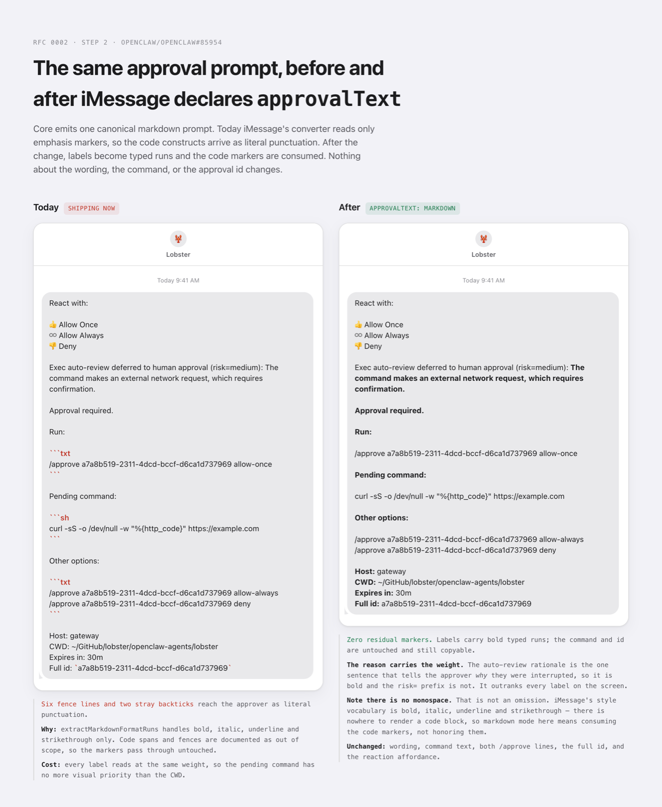

# Proposal: Approval Prompt Markdown Contract

## Summary

Approval prompts are built once in core and sent verbatim to every channel.
The builders emit mostly plain text, with an ad hoc markdown subset already
leaking in for exec approvals, and channels render that string inconsistently.
This proposal makes the approval prompt text a single defined markdown contract
owned by the core plugin SDK. Core emits one canonical markdown dialect, and
each channel decides, as an explicit capability, whether it renders that
markdown into native styling or downgrades it to clean plaintext.

## Motivation

Four core surfaces produce approval prompt text today and all return plain
strings that channels send as ordinary outbound messages:

- `src/infra/plugin-approvals.ts` builds the legacy plugin approval prompt
  (`buildPluginApprovalRequestMessage`) plus its resolved and expired variants.
  This is the text behind the `Plugin approval required / Title: / Plugin:`
  prompt. It is pure plaintext.
- `src/plugin-sdk/approval-reaction-runtime.ts` builds the reaction-aware
  pending text for both exec and plugin approvals, the reaction hint
  (`buildApprovalReactionHint`), and owns the canonical
  `APPROVAL_REACTION_BINDINGS` table.
- `src/infra/exec-approval-reply.ts` builds the exec approval pending payload
  (`buildExecApprovalPendingReplyPayload`). This one already emits a markdown
  subset: fenced code blocks for the pending command via
  `formatFencedCodeBlock` and inline code for `Full id` via
  `formatInlineCodeSpan`, both from `src/shared/markdown-code.ts`.
- `src/infra/exec-approval-forwarder.ts` builds the non-native fallback prompt
  (`buildExecApprovalRequestMessage`, plus its resolved and expired variants)
  and dispatches per-channel rendering through `buildApprovalRenderPayload`.
  It also emits fenced code blocks. This is the path used by every channel that
  declares an approval capability with neither a render adapter nor a native
  approval runtime, so it is where the unrendered-marker problem is most
  visible.

So core already ships markdown, just not on purpose and not uniformly. The exec
approval `Pending command:` fence renders as a code block on channels that
parse markdown and shows literal backticks on channels that do not, and richer
formatting such as a bold title is impossible without each channel reverse
engineering the plain text.

On the channel side, all seven native approval channels (Discord, iMessage,
Matrix, Signal, Slack, Telegram, WhatsApp) already own a markdown or formatting
layer for normal outbound text, but with diverging dialects:

- iMessage converts a markdown subset (bold, italic, underline, strikethrough)
  into native typed-run ranges on send (`extractMarkdownFormatRuns` in
  `extensions/imessage/src/send.ts`, documented in
  `extensions/imessage/src/markdown-format.ts`). macOS 15+ renders the runs;
  macOS 14 sees clean marker-stripped text. Approval prompts already flow
  through this send path, so the machinery is present and unused for approvals.
- Telegram sends with a parse mode and must escape reserved characters, so an
  unescaped `*` or `_` is a delivery hazard, not just a cosmetic one.
- Signal, WhatsApp, Slack, Discord, and Matrix each have their own format or
  send module with a distinct dialect (`**bold**` vs `*bold*`, fenced code
  support, escaping rules).

Beyond those seven, a second group declares an auth-only approval capability
built with `createChannelApprovalAuth`: Feishu, Mattermost, Microsoft Teams,
Nextcloud Talk, Synology Chat, and Zalo. They have neither a render adapter nor
a native approval runtime, so their approval text comes from the forwarder
fallback, and none of them applies any markdown translation on the way out.
Whatever their transport does with a fence or a backtick is accidental and
undeclared: Mattermost happens to render markdown server-side, while others
surface the raw markers to the person being asked to approve a shell command.
That the outcome varies by transport, with nothing in the codebase stating
which is intended, is the clearest evidence for the contract.

The dialects diverge, which is exactly why a single canonical core dialect plus
per-channel translation is the right seam. The goal is not a new approval
product surface. It is a stable formatting contract for the approval text that
already ships.

## Goals

- Core approval builders emit one canonical markdown dialect, documented and
  versioned in the plugin SDK.
- A channel renders approval markdown into native styling or downgrades to
  plaintext, by explicit capability, never by accident.
- Plaintext downgrade is lossless in meaning: stripping markers never changes
  the words, the id, the command text, or the reaction or reply instructions.
- The exec approval code fence and inline id already in core text become part
  of the defined contract rather than incidental output.
- Existing channels keep working during migration without a flag day.

## Non-Goals

- Changing approval semantics, decisions (`allow-once`, `allow-always`,
  `deny`), reaction emoji bindings, or the `/approve` reply grammar.
- Changing the approval reaction affordance (the allow once, allow always, and
  deny emoji shortcuts and hint) owned by the reaction runtime.
- Inventing a new rich-text format. The contract is a small markdown subset,
  not HTML, not attributed-body, not per-channel block kits.
- Forcing every channel to render markdown. Plaintext is a first-class,
  supported outcome.
- Localizing or rewording approval copy.

## Proposal

### Canonical subset

Core emits a fixed markdown subset, intentionally the intersection of what the
channels can already express plus what the exec builder already uses:

- `**bold**`
- `_italic_`
- `~~strikethrough~~`
- `` `inline code` ``
- triple-backtick fenced code blocks with an optional language hint

Underline is excluded from the core subset because most channels cannot express
it. iMessage may still map a channel-local marker if it wants, but core does
not emit one.

Fenced code block language hints are part of the contract but advisory. Core
emits a small fixed set (`sh` for a pending command, none or `txt` for a plain
block). A channel may honor a hint for native syntax highlighting and must drop
an unsupported hint safely, without altering the fenced content.

### Plugin SDK ownership

The plugin SDK owns:

1. The builders, unchanged in wording, updated to emit the canonical subset
   deliberately (bold labels or title, code for ids and commands).
2. A documented description of the subset and its escaping rules.
3. A `downgradeApprovalMarkdownToPlaintext(text)` helper that strips markers
   losslessly, so any channel can call one function to get safe plaintext.

The helper wraps the existing IR-based `stripMarkdown`
(`src/shared/text/strip-markdown.ts`) rather than adding a second stripper. It
exists to pin two options that must not be caller-configurable at the approval
boundary:

- `mode: "plain-text"`. The speech-mode cleanup collapses repeated punctuation
  and punctuation-only lines, which would silently rewrite a pending shell
  command inside its own fence.
- `linkStyle: "label-and-url"`. Label-only projection would render
  `[click here](https://example.invalid)` as `click here` and hide the
  destination from the approver. Keeping the URL visible is a security
  property of an approval prompt, not a formatting preference.

"Lossless" here means content-lossless, not byte-identical for the whole
message. The projection trims the leading and trailing edges of the final
string, so a prompt consisting of nothing but a fence would lose that fence's
surrounding whitespace. Fenced content in the body of a prompt is preserved
exactly, including leading indentation, trailing spaces, and internal blank
lines, which is the shape every approval builder actually emits because the
command fence is always followed by the host and id block. Conformance tests
should assert that the command, id, and instruction text survive verbatim as
substrings, not that the whole projection is byte-identical to its input.

### Channel capability

Channels gain an explicit capability on their approval handler. It is a field,
`approvalText`, on the existing channel approval capability object, declared
through the public plugin SDK. It is not a separate standalone capability or a
parallel registration path, which keeps the approval capability surface
cohesive. The field defaults to `"plaintext"`.

- `approvalText: "markdown"` means the channel translates the canonical subset
  into its native styling. The channel owns the translation and any escaping.
- `approvalText: "plaintext"` (the default during migration) means the channel
  calls `downgradeApprovalMarkdownToPlaintext` before send and surfaces clean
  text with no markers.

A channel must never pass canonical markdown straight to a transport that will
mangle it. Either it translates, or it downgrades. There is no implicit
pass-through.

The field belongs on the approval capability object, not on the runtime
approval adapter projected from it. `resolveChannelApprovalAdapter` copies a
fixed list of named fields and returns nothing at all for auth-only
capabilities, and most of the channels this contract is meant to fix are
auth-only. The mode must therefore be read through
`resolveChannelApprovalCapability`. Reading it through the adapter projection
looks correct and fails on exactly the channels that need it.

Core can enforce the downgrade directly on the forwarder path, where the target
channel is already resolved. On the native approval runtime path it cannot: the
per-channel `buildPendingPayload` returns a channel-specific payload type, and
Discord and Slack return native containers with no shared text field for core
to reach into. Channels on that path honor their declared mode themselves, and
a conformance test asserts every channel declaring an approval capability also
declares an explicit mode. See Unresolved questions.

### Worked example

A real exec approval prompt as core emits it today. This is the canonical
markdown a channel declaring `approvalText: "markdown"` receives unchanged:

````text
React with:

👍 Allow Once
♾️ Allow Always
👎 Deny

Exec auto-review deferred to human approval (risk=medium): The command
makes an external network request, which requires confirmation.

Approval required.

Run:

```txt
/approve a7a8b519-2311-4dcd-bccf-d6ca1d737969 allow-once
```

Pending command:

```sh
curl -sS -o /dev/null -w "%{http_code}" https://example.com
```

Other options:

```txt
/approve a7a8b519-2311-4dcd-bccf-d6ca1d737969 allow-always
/approve a7a8b519-2311-4dcd-bccf-d6ca1d737969 deny
```

Host: gateway
CWD: ~/GitHub/lobster/openclaw-agents/lobster
Expires in: 30m
Full id: `a7a8b519-2311-4dcd-bccf-d6ca1d737969`
````

On a channel that parses markdown, the three fences render as code blocks and
the id renders as an inline code span. On a channel that does not, every
backtick above is shown literally to the approver, including the three
` ```txt ` and ` ```sh ` opening fences. That second outcome is what the
default fixes.

The same prompt after `downgradeApprovalMarkdownToPlaintext`, which is the
verified output of the projection this RFC specifies:

```text
React with:

👍 Allow Once
♾️ Allow Always
👎 Deny

Exec auto-review deferred to human approval (risk=medium): The command
makes an external network request, which requires confirmation.

Approval required.

Run:

/approve a7a8b519-2311-4dcd-bccf-d6ca1d737969 allow-once

Pending command:

curl -sS -o /dev/null -w "%{http_code}" https://example.com

Other options:

/approve a7a8b519-2311-4dcd-bccf-d6ca1d737969 allow-always
/approve a7a8b519-2311-4dcd-bccf-d6ca1d737969 deny

Host: gateway
CWD: ~/GitHub/lobster/openclaw-agents/lobster
Expires in: 30m
Full id: a7a8b519-2311-4dcd-bccf-d6ca1d737969
```

This is what content-lossless means in practice. Zero residual backticks. The
pending command survives byte-for-byte, including the quoting in
`-w "%{http_code}"` that a naive regex stripper would corrupt. Both `/approve`
command lines and the full id survive verbatim, so every action the approver
can take is still copyable. Only the markers are gone.

Note what the contract does not cover. The reaction hint block and the decision
buttons some channels render beneath the text are owned by the reaction runtime
and the presentation payload respectively, not by this markdown contract.

### What a channel opting in actually gains

The same prompt on iMessage, before and after it declares
`approvalText: "markdown"`:



iMessage is the useful illustration because it shows the contract does not mean
"render the markdown as written." Its typed-run vocabulary is bold, italic,
underline, and strikethrough, so there is nowhere to render a fenced block at
all. Opting in there means consuming the code markers and promoting the labels
and the auto-review rationale to bold, not reproducing a code block. A channel
declaring `markdown` is declaring that it owns the translation, and a faithful
translation can legitimately drop a construct its transport cannot express, so
long as the content survives.

macOS 14 recipients see no typed runs, so the same message lands as the
plaintext projection. Both outcomes are correct under the contract, and neither
shows a stray marker.

### Emphasis over generated content

Core copy such as `Approval required.` or `Pending command:` is fixed and safe
to wrap in markers. Some prompt content is not: the exec auto-review rationale
above is model-generated text interpolated into the warning line, and approval
prompts also carry commands, paths, and ids derived from user or agent input.

Any builder applying emphasis to non-fixed content must escape the payload
before wrapping it. An unescaped `*` or `_` inside a generated rationale
silently breaks the emphasis span on a rendering channel, and on a parse-mode
transport such as Telegram it is a delivery hazard rather than a cosmetic bug.
The rule is narrow and worth stating explicitly because it is invisible in
review: emphasis is safe over literal copy the builder owns, and requires
escaping over anything it does not.

### Migration

Compatibility is opt-in, so the default is the safe one.

1. Land the canonical subset, the downgrade helper, the capability, and core
   enforcement on the forwarder path. In the same change, declare
   `approvalText: "markdown"` on every channel that already renders the subset
   today: Telegram, Matrix, Signal, WhatsApp, Slack, and Discord. For Telegram,
   Matrix, Signal, and WhatsApp the declaration prevents a regression, because
   their approval text is core-built markdown that their send path converts.
   For Slack and Discord it records intent rather than preventing one: both
   author native payloads in their own approval runtimes, so the forwarder
   default never reaches them either way. Assess each remaining channel against
   its actual transport before leaving it at the default, because rendering can
   come from the transport rather than from channel code. Mattermost is the
   known case: it has no render adapter but its server renders markdown, so it
   needs the same declaration despite carrying an auth-only capability.
2. Move iMessage to `markdown`. Its converter handles bold, italic, underline,
   and strikethrough but ignores inline code and fences, so approval prompts
   currently show literal backticks. This step teaches the converter to consume
   code constructs, then flips the mode.
3. Revisit any channel left at the default whose transport could express more
   than plaintext, one at a time, each with channel-native escaping and
   rendering proof.
4. Once a channel opts in, its approval prompt formatting is a tested contract,
   not incidental output.

Step 1 is not behavior-neutral, and an earlier revision of this RFC wrongly
claimed it was. The default reproduces today's output only where nothing
renders the markers. Anywhere they are already rendered, whether by channel
code or by the transport itself, leaving the default in place would strip
formatting that ships today, which is why those declarations belong in step 1
rather than a later one. The user-visible effect of step 1 is that surfaces
showing raw markers stop showing them, and surfaces already rendering are
unchanged.

The declaration is per channel, not per capability shape. An auth-only
capability can carry `approvalText` even though it projects no runtime approval
adapter, which is precisely why the mode must be read from the capability
rather than from that projection.

There is no flag day. A channel that never opts in keeps shipping clean
plaintext forever, which is a supported end state, not a temporary shim.

### Testing

- Plugin SDK unit tests for the canonical builders (exact emitted markers) and
  for `downgradeApprovalMarkdownToPlaintext` (strip is lossless: same words,
  same id, same command, same instructions, zero residual markers).
- Per-channel tests asserting the chosen mode: `plaintext` channels emit no
  markers; `markdown` channels emit native styling and escape reserved
  characters.
- iMessage: prove the approval prompt produces typed-run ranges once the
  converter consumes inline code and fences, and strips clean on the macOS 14
  path.
- Telegram: prove reserved-character escaping on a prompt whose title or
  command contains `*`, `_`, backticks, or other reserved characters.
- Emphasis over generated content: a prompt whose auto-review rationale itself
  contains `*` or `_` must not break its emphasis span on a rendering channel
  and must not break delivery on a parse-mode channel.
- Real-channel delivery proof for each channel at the point it opts into
  `markdown`, since rendering and escaping are transport behaviors.

## Rationale

The chosen design keeps formatting policy in core and rendering in channels,
matching the repo rule that core stays channel-agnostic and channels own their
rendering. Three alternatives were considered.

- iMessage-local formatting only. The iMessage channel could restyle the
  approval text it sends without touching core. This has zero blast radius but
  solves the problem for exactly one channel and leaves the existing exec fence
  inconsistency unaddressed everywhere else. It also pushes presentation logic
  that other channels want into a single plugin, so the next channel has to
  reinvent it.
- Shared markdown in core with no opt-in. Core could simply emit markdown and
  assume every channel renders it. This is the smallest diff but the highest
  risk: channels that do not parse markdown would surface literal markers, and
  parse-mode channels such as Telegram could break delivery on unescaped
  characters. Rendering is a transport behavior, so it cannot be assumed.
- Fully structured segments. Core could emit label and value segments and let
  every channel render its own way. This is the cleanest long-term contract but
  the largest change, touching every channel approval handler at once with no
  safe incremental path.

The proposal takes the middle path. Core emits markdown, but each channel opts
in explicitly and the default is a lossless plaintext downgrade, so the change
ships safely channel by channel. It also formalizes the markdown core already
emits incidentally rather than introducing a brand new format.

## Unresolved questions

One question is open, raised while scoping implementation.

- **Enforcement on the native approval runtime path.** Core enforces the
  downgrade on the forwarder path, but the native runtime path returns
  channel-specific payload types with no shared text field, so channels there
  honor their declared mode themselves and a conformance test only proves a
  mode was declared, not that it was obeyed. The alternative is threading an
  explicit text mode into the two shared pending-prompt builders so core does
  the stripping for both paths, at the cost of a new parameter on widely-called
  public SDK builders. iMessage makes this concrete rather than hypothetical:
  it has a native approval runtime and sits at the plaintext default through
  step 1, so it is a channel on the unenforced path that must honor its own
  declared mode from the moment step 1 lands. Step 1 can proceed either way,
  since iMessage's own approval builder is the only caller that has to comply,
  but the question should be settled no later than step 2.

The questions raised during initial review are resolved as follows, and the
decisions are reflected in the Proposal above.

- **Underline in the canonical subset.** Resolved: no. The canonical subset
  stays at the strict cross-channel intersection, and core never emits
  underline. iMessage may map a channel-local marker out of band, but it is not
  part of the contract.
- **Where the capability lives and how it is declared.** Resolved: it is a
  field, `approvalText`, on the existing channel approval capability object,
  declared through the public plugin SDK and defaulting to `"plaintext"`. There
  is no separate standalone capability or parallel registration path.
- **Exec fence language hints.** Resolved: the contract defines a small fixed
  set of hints (`sh` for a pending command, none or `txt` for a plain block)
  and treats them as advisory. A channel may honor a hint for native syntax
  highlighting and must drop an unsupported hint safely, without altering the
  fenced content.
