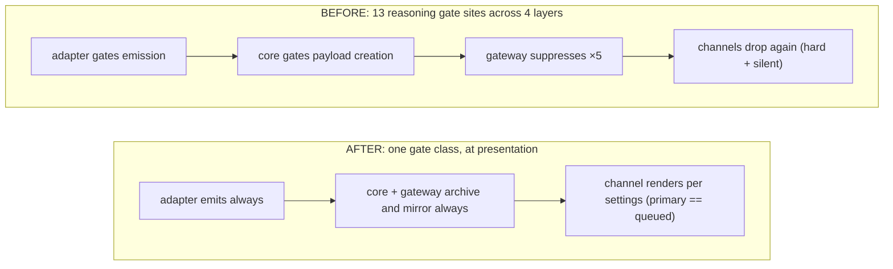

# Proposal: Normalized provider→channel stream grammar

## Summary

Every provider wire format (Anthropic Messages SSE, OpenAI Chat Completions,
OpenAI Responses, raw token streams, plus thin dialects like OpenRouter and the
claude-cli envelope) is normalized by core into **one** event grammar — final
text, thinking/reasoning, narration/commentary, tool activity, usage, and errors
— archived in the session record regardless of display settings, and projected
by each channel into the best UX that channel supports, with identical semantics
everywhere. The governing principle is **emit always, archive always, gate only
at presentation**. Integrating a new channel (GUI, TUI, Discord, anything) means
following this output contract and overlaying channel UX — nothing more.

The full normative specification, evidence files (per-family wire captures), a
conformance harness (37 tests across 28 golden captures), and two red-team passes live in a
companion repository:
<https://github.com/Marvinthebored/openclaw-provider-stream-spec>. This RFC is
the design narrative; the spec is the contract. It extends the agent event I/O
contract — vendored into this RFC at [`0008/agent-event-io-contract.md`](0008/agent-event-io-contract.md)
from openclaw/openclaw #92216 by ragesaq — and marks its four explicit amendments
as **[AMENDS BASE]**.

## Motivation

Provider outputs diverge sharply at the wire — four families plus envelopes and
dialects — yet today that divergence leaks all the way to the channel. Two
concrete failure classes follow:

1. **Reasoning is dropped at the source.** Adapters gate emission of wire-carried
   reasoning (`streamReasoning && onReasoningStream`, the `emitReasoning` discard
   path). Once dropped, no downstream setting can recover it, and it never reaches
   the archive.
2. **Gating is scattered.** Reasoning suppression alone is implemented at ~13
   sites across 4 layers (adapter, core, gateway ×5, channels — including silent
   drops). The same logical decision is re-litigated at every layer, so behavior
   drifts between providers, between channels, and even between primary and
   queued turns on the *same* channel.

The result is channels that compensate with provider-specific workarounds, and
user-visible bugs: reasoning that renders for one model but not another, finals
folded into thinking blocks, double-posted text, empty "final" messages on
tool-only turns. The fix is to normalize once and gate once, in the only place a
display decision belongs — presentation.

## Goals

- One normalized event grammar over **any** transport; `seq` is the universal
  ordering key and faithfully reflects provider order.
- **Emit always / archive always**: adapters never drop wire-carried content;
  the gateway archives the normalized sequence before any subscriber trimming,
  independent of every display flag.
- **Gate only at presentation**: a single gate class, in the channel, driven by
  `/reasoning` and `/verbose`. Identical semantics on primary and queued turns.
- A normative **finality resolution** state machine so finals are never
  double-posted (replacement, not dedup heuristics) and never empty.
- A **conformance harness** so any channel or adapter can be checked against the
  contract mechanically.
- New-channel integration cost = output contract + channel UX overlay, nothing
  more.

## Non-Goals

- Does **not** change what models generate. Request-side knobs (thinking budget /
  `thinkingLevel`) stay as they are; this proposal never gates emission, archival,
  or mirroring of what *is* generated.
- Does **not** define channel visual design beyond minimum rendering
  requirements.
- Does **not** cover non-turn data (model catalogs, billing APIs).

## Proposal

### Normalized event grammar (§3 of the spec)

Five streams on the existing `AgentEventPayload` envelope:

- `assistant` — text deltas/snapshots, `phase: commentary | final_answer`,
  stable `id` only where the provider supplies one (F1 block index; F3 composite
  `item_id:content_index`; F2 falls back to `seq`). Synthesized counters are
  forbidden as idempotency keys (reconnect-unstable). Refusal text lanes map to
  `final_answer` — a refusal *is* the reply.
- `thinking` **[AMENDS BASE]** — `variant: raw | summary | redacted`; emission is
  **unconditional** whenever the wire carries reasoning; display is gated
  downstream. Redacted reasoning is a content-free marker. A dual-lane dedup rule
  (structured `reasoning_details[]` wins over the flat `reasoning` string) keeps
  OpenRouter-style double-population from producing phantom thoughts. Opaque
  continuation state (e.g. `signature_delta`) is adapter-transcript only, never a
  bus event.
- `tool` / `item` **[AMENDS BASE]** — `phase: start` emitted at the earliest
  moment call id + name are known, never delayed until argument assembly.
- `lifecycle` — `start | update | end | error`; normalized stop reasons and
  cumulative usage. `update` is diagnostics (debug log, not rendered by default).
  Abnormal transport close emits a synthetic `lifecycle/error reason:"stream_closed"`.

### Finality resolution (§3.5, normative)

A total dispatch over every catalogued stop signal selects one path —
**Finalize / Truncate / Reject / Suspend / Dead** — plus tool-yield (no final;
the agent loop continues). Key rules: zero-text finalize emits no final_answer;
Reject is a *destructive settle* (already-streamed unsafe text is retracted in
the channel, surviving only in the archive); the durable final **replaces** the
draft rendering of its segment, so double-posting is structurally impossible.

### Settings model (§4) — three flags, one gate class

| Flag | Layer | Semantics |
|------|-------|-----------|
| `thinkingLevel` | request only | how much the model thinks (the only flag that changes generation) |
| `/reasoning` → `reasoningLevel` (`off \| on \| stream`) | channel only | render thinking: not / at segment end / live-then-settled |
| `/verbose` → `toolVerbose` (`off \| on \| full`) | channel only | tool liveness / name+status rows / + display-safe args+results |

The architectural change, from 13 gate sites to one:

### Gateway contract & channel projection (§5, §7)

The hidden session-subscriber mirror extends to `thinking` (all variants),
`item`, and lifecycle terminal events — thinking is mirrored on its own stream,
never disguised as commentary **[AMENDS BASE]**. An archive tap persists the
normalized sequence before subscriber trimming, independent of UI visibility and
every flag (operator/audit surface only). Channels declare a capability tier and
project the same events into tier-appropriate UX; a normative truth table fixes
the rendering for each (event × setting) pair, including the degenerate-draft and
path-independence rules.

### Conformance (§8)

The companion repo ships an executable harness (37 tests, 28 golden captures)
from live APIs for each wire family, so adapters and channels can be
validated against the contract rather than against each other.

### Reference implementation

Stacked draft PRs:

- **Core** — emit-always lane grammar, dispatch gating, catalog:
  openclaw/openclaw#93342 (`Marvinthebored:pipeline-core`).
- **Discord presentation gate** — stacked on core; renders the lanes:
  Marvinthebored/openclaw#2 (`Marvinthebored:pipeline-discord`), re-targets to
  upstream once core lands.

Each branch is independently checkout-able so contributors can patch their own
systems and help test ahead of landing. The core branch typechecks standalone
against the *unmodified* Discord plugin (changes are backward-compatible).

## Rationale

**Why normalize in core rather than per-channel.** The wire divergence is real
and irreducible, but it is a *normalization* problem, not a *presentation*
problem. Pushing it to channels is what produced N copies of provider-specific
logic and the drift between them. Normalizing once means a new channel inherits
correct semantics for free.

**Why emit-always instead of gate-at-adapter.** Gating at the adapter is
efficient but lossy and irreversible: a dropped thought cannot be shown by a
later `/reasoning on`, nor audited. Emit-always + archive-always + presentation
gate costs a mirror/trim per subscriber (transport economy, applied at fan-out,
never to the archive) in exchange for recoverability, auditability, and a single
place to reason about display.

**Why replacement over dedup for finals.** Heuristic dedup of "did we already
post this?" is exactly the class of bug this replaces. Making the durable final
*replace* the draft rendering of its segment removes the question structurally.

**Trade-offs.** More events on the bus and a mandatory archive tap (storage +
fan-out cost). The conformance burden shifts onto channels (they must maintain a
draft for queued turns identically to primary turns). We judge these worth the
elimination of an entire bug class and the drop in new-channel integration cost.

## Unresolved questions

- **Base-contract coordination.** The four [AMENDS BASE] points (§3.2, §3.3,
  §5.1, §7.3) are now folded into the vendored
  [`0008/agent-event-io-contract.md`](0008/agent-event-io-contract.md) (marked
  inline as *RFC 0008 amendment*), so an implementer of the base alone no longer
  builds a thinking-dropping gateway. Open: upstreaming the amended contract back
  into the maintained docs tree, sequenced with #92216.
- **deepseek reasoning/text boundary.** deepseek (no clean reasoning-end signal)
  can fold its final answer into the thinking block under the current adapter; a
  boundary fix is in progress in the core branch and is not yet complete.
- **Per-family catalogue completeness.** Gemini (F5) is live-captured but its
  full catalogue entry is pending; remaining dialects are capture-verified
  conservatively and should be confirmed per dialect.
- **Channel tier minimums.** The exact minimum rendering obligations for low-tier
  channels (and how strictly conformance enforces path-independence) warrant
  maintainer input.
