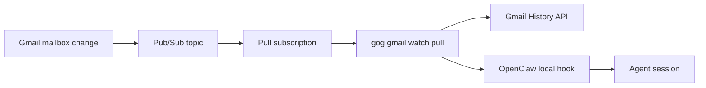

# Proposal: Gmail Pub/Sub Pull Delivery

## Summary

Make Gmail Pub/Sub pull delivery the first-party production path for OpenClaw
Gmail notifications. Instead of requiring Google Pub/Sub to call an HTTPS
endpoint owned by the user, OpenClaw should supervise a long-running `gog`
consumer that pulls notifications from a Pub/Sub subscription, fetches Gmail
history, and forwards local hook payloads into the OpenClaw gateway.

## Motivation

The current Gmail watch path is shaped around Pub/Sub push:

```text
Gmail -> Pub/Sub topic -> HTTPS push subscription -> gog HTTP server -> OpenClaw hook
```

That path works, but it makes the default Gmail notification setup depend on
public or semi-public HTTP ingress. Users must reason about Tailscale Funnel,
public callback URLs, push tokens in URLs or headers, reverse proxy path
rewrites, and whether Google can reach a private tailnet endpoint. Those are
operator decisions, not core Gmail notification decisions.

Pub/Sub does not require push delivery. Gmail publishes mailbox notifications to
a Pub/Sub topic. A subscription can be consumed by a process that calls Google
from the user's machine, receives queued messages, processes them, and
acknowledges them. This is the simpler production model for local OpenClaw
gateways:

```text
Gmail -> Pub/Sub topic -> pull subscription <- gog worker -> OpenClaw hook
```

The user still owns credentials and state, but no public HTTP endpoint is needed
for Google to reach the gateway.

Gmail Pub/Sub notifications are not email messages. Gmail publishes a small
notification containing the mailbox email address and a Gmail `historyId`. The
consumer still has to call the Gmail History API to turn that cursor into
message additions, deletions, labels, and message ids. Pull mode changes how the
notification is delivered from Pub/Sub to `gog`; it does not remove the Gmail
History API step.

## Goals

- Make the Gmail Pub/Sub pull model a first-party OpenClaw path.
- Keep `gog` as the Gmail watch runtime rather than switching OpenClaw to a
  separate Gmail CLI bridge.
- Add a transport-neutral Gmail notification processing path in `gog` that both
  push and pull delivery can share.
- Let OpenClaw configure and supervise pull delivery through the existing Gmail
  watcher lifecycle.
- Keep hook delivery local by default: `gog` should call the OpenClaw gateway on
  loopback with the existing hook token model.
- Make ack, retry, lease, duplicate, stale-history, rate-limit, and hook-failure
  behavior explicit.
- Keep Pub/Sub push available only as an explicit compatibility mode for users
  who intentionally operate public HTTPS ingress.
- Make the resulting config shape easy for declarative packagers, including
  nix-openclaw, to render as one coherent unit.

## Non-Goals

- Deprecating or removing the current inbound-webhook Pub/Sub push path in the
  same change.
- Making shared-token Pub/Sub push a recommended production path.
- Replacing `gog` with `gws` or another Gmail watcher runtime. Earlier pull-model
  proposals did that by adding a second Gmail bridge; this RFC deliberately keeps
  one Gmail watcher runtime and fixes the maintained `gog` path instead.
- Having OpenClaw create or mutate cloud infrastructure during normal gateway
  startup.
- Embedding Google credentials, hook tokens, or OAuth secrets in OpenClaw config
  files.
- Changing the Gmail hook payload schema unless the transport-neutral refactor
  reveals a necessary compatibility fix.
- Making Nix, Home Manager, Tailscale, or a specific deployment platform part of
  the OpenClaw runtime contract.

## Proposal

### Delivery model

OpenClaw should support explicit Gmail delivery modes. Pull should be the target
production default after the staged rollout described below:

```jsonc
{
  "hooks": {
    "gmail": {
      "account": "user@example.com",
      "topic": "projects/example/topics/openclaw-gmail",
      "delivery": {
        "mode": "pull",
        "subscription": "projects/example/subscriptions/openclaw-gmail"
      }
    }
  }
}
```

Push should remain available as explicit compatibility for users who own public
HTTPS ingress:

```jsonc
{
  "hooks": {
    "gmail": {
      "account": "user@example.com",
      "topic": "projects/example/topics/openclaw-gmail",
      "delivery": {
        "mode": "push",
        "endpoint": "https://gateway.example.com/gmail/push",
        "auth": {
          "mode": "google-signed"
        }
      }
    }
  }
}
```

The exact config nesting can change during implementation, but the contract
should preserve these decisions:

- Pull mode names a Pub/Sub subscription, not an HTTP endpoint.
- Pull mode does not require `pushToken`, `serve`, `tailscale`, or a public
  callback URL.
- Push mode remains explicit and keeps its own auth shape.
- Shared-token push is labeled as development or legacy fallback, not as the
  production default.

### Runtime flow



On gateway start, the OpenClaw Gmail watcher should:

1. Resolve Gmail hook runtime config.
2. Ensure the Gmail watch is registered or renewed for the configured topic.
3. Start a supervised `gog gmail watch pull` child process.
4. Keep the existing renewal timer behavior.
5. Restart the pull child on ordinary child exit according to the same respawn
   rules used for the current watcher.
6. Stop the child and timer on gateway shutdown or config reload.

### `gog` command surface

`gog` should add a pull command, for example:

```bash
gog gmail watch pull \
  --account user@example.com \
  --subscription projects/example/subscriptions/openclaw-gmail \
  --hook-url http://127.0.0.1:18789/hooks/gmail \
  --hook-token "$OPENCLAW_HOOK_TOKEN"
```

This is a transport sibling, not a new lifecycle verb. The current `gog`
command family has `start`, `status`, `renew`, `stop`, and `serve`: `start`,
`renew`, and `stop` register or unregister Gmail's watch with the Gmail API,
while `serve` is the long-running Pub/Sub push receiver. The new `pull` command
should sit next to `serve` as the long-running Pub/Sub pull receiver.

`gog` currently exposes this family in two ways: the canonical generated docs use
`gog gmail settings watch ...`, and OpenClaw already invokes the hidden
compatibility surface `gog gmail watch ...`. Implementation should keep those
surfaces aligned. If `pull` is added under `settings watch`, the OpenClaw-facing
`gmail watch pull` alias should exist too.

The command should reuse the existing Gmail watch state and hook delivery
behavior where possible. The main implementation work in `gog` is to extract the
current HTTP push handler's core logic into a transport-neutral notification
processor:

```text
Pub/Sub push envelope -> Gmail notification -> process notification -> hook
Pub/Sub pull message  -> Gmail notification -> process notification -> hook
```

The shared processor should own:

- account guardrails;
- duplicate Pub/Sub message detection;
- stale history handling;
- Gmail history fetch;
- message/deleted-message payload construction;
- hook delivery;
- persisted watch status and last delivery status;
- rate-limit circuit behavior.

Account guardrails are a defensive check against misconfiguration and migration
drift, not the expected happy path. Gmail includes the mailbox email address in
each notification. A worker configured for `user-a@example.com` should drop and
ack a notification for `user-b@example.com` if an operator points it at the wrong
subscription, reuses a topic across accounts, or leaves an old watch path
publishing into the same delivery stream.

### First-party Pub/Sub client contract

The pull implementation should use Google's maintained Go Pub/Sub client
library, `cloud.google.com/go/pubsub/v2`, at the high-level subscriber API. This
is the simplest first-party prior art for a Go worker. As of the docs checked on
2026-06-05, the current public package shown by Google is v2.6.0 and the simple
Go subscriber path is `Subscriber.Receive`. The implementation should not
hand-roll long polling, StreamingPull, ack-deadline extension, flow control, or
retry loops against raw REST unless a specific client-library bug forces that
choice.

The default implementation should use `Subscriber.Receive`, because the
official client already owns the hard Pub/Sub mechanics:

- receiving from a subscription id or fully qualified subscription name;
- extending ack deadlines while the handler is still processing a message;
- flow control for outstanding messages;
- retrying retryable service errors;
- exposing `Ack` and `Nack` decisions at the message boundary.

The implementation should still use the published Pub/Sub API shape in tests and
adapters rather than inventing a local envelope. For Go, that means the
generated Pub/Sub proto surface
`google.pubsub.v1.PubsubMessage`, exposed by the client as `pubsubpb.PubsubMessage`
for low-level tests and by the high-level client as `pubsub.Message` for normal
receive handling. The REST shape is also documented as `PubsubMessage`. A
Pub/Sub message has a `data` field and metadata such as message id. For Gmail,
`data` is not a proto message and not an email body; it is the base64url-encoded
JSON notification documented by the Gmail API:

```json
{
  "emailAddress": "user@example.com",
  "historyId": "9876543210"
}
```

Tests should build fixtures from that documented Gmail payload and the official
Pub/Sub message shape rather than from ad hoc strings copied out of one local
run.

### Why the worker still calls Gmail

Pub/Sub is the queue, not the mailbox change log. Gmail publishes a small
notification that says, in effect, "mailbox X advanced to history id Y." It does
not publish the changed message ids, deleted message ids, labels, snippets, or
message bodies. After the worker receives and decodes the Pub/Sub message, it
must call Gmail `history.list` from the last stored history id to discover the
actual mailbox changes. That is the same Gmail-side work the current push
handler already performs after receiving an HTTP Pub/Sub push.

So pull mode removes inbound HTTP delivery, but it does not replace Gmail
history processing. The transport changes from "Google POSTs the Pub/Sub
message to us" to "we receive the Pub/Sub message from Google"; the mailbox
cursor, history fetch, stale-history recovery, and hook payload construction
remain the same product behavior.

### Ack and retry policy

Push and pull put retry responsibility in different places.

With Pub/Sub push, Google calls an HTTPS endpoint. A 2xx response acknowledges
the message. A non-2xx response asks Pub/Sub to retry later.

With Pub/Sub pull, the worker receives a message and explicitly acknowledges it.
If the worker crashes before acknowledging, Pub/Sub can redeliver it. While the
worker is processing, the official Pub/Sub client library should own
ack-deadline or lease extension.

Pull mode should make the terminal decisions explicit:

- Acknowledge successful hook delivery.
- Acknowledge wrong-account notifications after logging them. This means the
  subscription or topic is miswired for the configured account; redelivery would
  not repair that.
- Acknowledge duplicate notifications after logging or metrics.
- Acknowledge stale or no-new-history notifications when the existing Gmail
  history recovery path has reached a terminal decision.
- Try local hook delivery with a small bounded retry window, then acknowledge
  hook delivery failure after recording failure status. This matches the current
  no-replay-storm behavior: a down gateway should not make Pub/Sub redeliver the
  same mailbox notification forever and repeatedly wake agents.
- Do not immediately acknowledge transient Gmail API failures, local network
  failures, or active Gmail rate-limit circuit failures.
- Avoid tight redelivery loops when rate limited by pausing receive, extending
  the lease, or otherwise backing off according to the Pub/Sub client contract.

Invalid Pub/Sub payloads are a poison-message case. The implementation should
record the decode failure and acknowledge the message once it is proven
permanently invalid, rather than redelivering forever.

The implication is deliberate: OpenClaw chooses notification stability over
infinite replay. Gmail history is cursor based, so a later successful
notification can still recover mailbox changes from the stored history cursor.
If history recovery itself becomes stale or impossible, `gog` should use the
existing stale-history recovery behavior rather than relying on Pub/Sub to replay
one old notification forever.

### Subscription ownership

Pub/Sub queues live at the subscription, not at a generic topic URL. A topic can
fan out to multiple subscriptions. Each subscription owns its backlog,
acknowledgment state, retention, retry policy, push configuration, and pull
delivery behavior.

The existing OpenClaw path already uses Pub/Sub, but it uses a push
subscription. A pull worker should either consume a separately named pull
subscription on the same topic or run an explicit migration that changes the
existing subscription from push to pull. It should not silently compete with an
active push subscription or assume the topic itself is a consumable queue.

### Current implementation delta

The current `gog` and OpenClaw code already support much of the Gmail watch
runtime, but only for Pub/Sub push. The implementation PRs should treat this as
an extraction and delivery-mode change, not as a new integration from scratch.

Current `gog` behavior:

- `gog` has `start`, `status`, `renew`, `stop`, and `serve` Gmail watch
  commands, but no pull command.
- The canonical generated command docs use `gog gmail settings watch ...`.
  OpenClaw also relies on the hidden compatibility surface
  `gog gmail watch ...`.
- `serve` already supports shared-token auth and Pub/Sub OIDC verification for
  push delivery.
- The push server already parses Pub/Sub push envelopes, decodes the Gmail
  `emailAddress` plus `historyId` payload, checks account mismatch, detects
  duplicate Pub/Sub message ids, handles stale history, calls Gmail
  `history.list`, fetches messages, applies excluded labels, records delivery
  state, handles rate-limit circuit state, and sends the OpenClaw hook payload.
- `gog` currently depends on `google.golang.org/api` for Google API clients, but
  not on `cloud.google.com/go/pubsub/v2`.

Therefore the `gog` slice should:

- add `gog gmail settings watch pull` and keep the OpenClaw-facing
  `gog gmail watch pull` alias available;
- add the official Go Pub/Sub client dependency;
- add a supervised pull subscriber loop around `Subscriber.Receive`;
- extract the current HTTP push processing path into a shared notification
  processor that accepts a decoded Gmail notification plus Pub/Sub metadata;
- keep current push tests green while adding fake-subscriber tests for pull ack
  and retry decisions;
- regenerate generated command docs.

Current OpenClaw behavior:

- `hooks.gmail` is push-shaped. It has `pushToken`, `serve`, and `tailscale`
  fields, but no delivery mode and no Pub/Sub subscriber credential/source
  fields.
- `resolveGmailHookRuntimeConfig` currently requires `pushToken`; that is
  correct for push but wrong for pull.
- OpenClaw builds `gog gmail watch start` for Gmail watch registration and
  `gog gmail watch serve` for the long-running push receiver. It has no pull
  spawn path yet.
- The gateway already stops, restarts, and respawns the Gmail watcher, and
  `hooks.gmail` config reloads already trigger a watcher restart. Pull should
  reuse that lifecycle instead of inventing a second supervisor.
- Current OpenClaw docs describe push setup, Tailscale exposure, and local
  `gog` serve behavior. Some CLI docs use the shorthand `gog watch serve`; the
  implementation and generated `gog` docs use `gog gmail watch serve` or
  `gog gmail settings watch serve`.
- The current OpenClaw wrapper only renders shared-token push into `gog serve`.
  `gog` itself supports OIDC push verification, but first-party OpenClaw setup
  does not currently expose that as the recommended production path.

Therefore the OpenClaw slice should:

- add an explicit Gmail delivery mode while preserving existing push config;
- make `pushToken`, `serve`, and `tailscale` required only for push delivery;
- make pull delivery require a subscription and Pub/Sub subscriber credential
  source instead of a push endpoint;
- build and supervise `gog gmail watch pull` in pull mode using the existing
  watcher lifecycle;
- keep `gog gmail watch start`/renewal behavior shared by push and pull;
- update schema, help, labels, docs, setup, reload, and watcher tests;
- normalize OpenClaw docs so command references consistently name the actual
  `gog gmail watch ...` or `gog gmail settings watch ...` surface.

### Setup behavior

`openclaw webhooks gmail setup` should gain pull mode before it becomes the
default. The first implementation PR should keep existing push setup behavior
intact and expose pull as an explicit mode for Crabbox, maintainer, and dogfood
testing. After that path has been exercised for a few weeks, a follow-up PR can
make pull the default for new setups.

In pull mode, setup should:

- ensure Gmail and Pub/Sub APIs are enabled when the operator asks setup to
  manage Google resources;
- ensure Gmail's publisher service account can publish to the topic;
- create or verify a pull subscription without `push_config`;
- write OpenClaw config that selects pull delivery;
- avoid configuring Tailscale Serve, Tailscale Funnel, reverse proxies, public
  endpoints, or push tokens.

Cloud resource mutation should remain an explicit setup action, not a normal
gateway startup action. Users who manage cloud resources with Terraform,
OpenTofu, Pulumi, or another system should be able to provide topic and
subscription names directly.

Existing push configurations remain valid. Implementing this RFC must not remove
or reinterpret existing `pushToken`, `serve`, `tailscale`, or push endpoint
configuration. If OpenClaw later normalizes old Gmail config into a
`delivery.mode = "push"` shape, that belongs in a doctor or migration path with
tests proving existing push deployments keep working.

Push documentation should remain available after pull becomes the recommended
path. It should move under explicit Pub/Sub push compatibility guidance rather
than disappear, because users with existing public HTTPS deployments still need
setup, renewal, auth, and troubleshooting docs.

### Credentials and secrets

Pull mode needs the same Gmail credential family that push mode already needs,
plus one new Pub/Sub subscriber credential family:

- Gmail credentials so `gog` can register or renew the Gmail watch and read
  Gmail history after a notification. This is not new to pull; the existing push
  handler also calls Gmail after receiving a Pub/Sub notification.
- Pub/Sub subscriber credentials so `gog` can pull from the subscription. This is
  new for pull because the local worker, not Google Pub/Sub push delivery, is now
  the subscriber.

The Gmail credential path should reuse whatever `gog` already uses for Gmail
watch setup and history reads. The Pub/Sub credential path should use the
official Google client-library authentication chain by default, which means
Application Default Credentials on local machines and normal service-account or
workload credentials on managed hosts. `gog` may add an explicit credentials-file
flag or environment variable for declarative systems, but it should feed that
into the Google client library rather than implementing its own token handling.

Push mode does not need Pub/Sub subscriber credentials because Google delivers
messages to the HTTP endpoint. Pull mode does, because the local worker is now
the subscriber calling Google.

OpenClaw should not store literal secrets in `openclaw.json`. The runtime should
accept environment-backed or file-backed credential sources, and docs should
show secret references rather than token literals.

The OpenClaw hook token remains a local gateway secret. In pull mode, it is sent
from the supervised local worker to the local OpenClaw hook endpoint. It is not
part of a public callback URL.

### Hook session policy

In this RFC, "OpenClaw hook" means the local gateway endpoint that receives a
structured event payload and dispatches it through the configured hook mapping.
For Gmail, the hook payload is the normalized mailbox-change event produced by
`gog` after it fetches Gmail history.

The default Gmail hook session policy should stay aligned with the existing
Gmail preset: per-message session keys using the `hook:gmail:` prefix. Setup
must render the required gateway gates, including request-derived session-key
permission and the allowed prefix, as part of Gmail setup. Users should not have
to discover those policy switches separately.

If a deployment wants a static session key instead, that should be an explicit
advanced mode. It should not be the default unless maintainers decide that the
per-message Gmail preset is the wrong long-term product behavior.

### Declarative packaging contract

Declarative packagers such as nix-openclaw should not have to invent a separate
runtime contract. They should render the same OpenClaw Gmail config and
environment inputs that direct OpenClaw users would write. Once OpenClaw exposes
pull delivery, a higher-level packager option should be able to render:

- `gog` in the gateway runtime path;
- account, topic, and subscription;
- local hook policy;
- session-key gates;
- secret-file backed environment variables;
- pull delivery mode;
- validation that raw low-level Gmail hook config is not also trying to own the
  same integration.

This RFC does not define the Nix option name. It defines the OpenClaw contract
that makes a coherent Nix option possible. If OpenClaw already has a low-level
input, nix-openclaw should pass it through rather than creating another magic
surface with different semantics.

### Product slices

This RFC should land as a sequence of small product slices, not one cross-repo
change. Each slice adds one product capability and has its own proof gate.

| Slice | Product or repo | What gets added | Proof gate |
| --- | --- | --- | --- |
| 0 | `openclaw/rfcs` | Accepted direction: pull is the target production path, push remains compatibility, and `gog` remains the Gmail runtime. | RFC review accepts the product boundary and rollout plan. |
| 1 | `gog` | `gog gmail settings watch pull`, the `gog gmail watch pull` compatibility alias, official Go Pub/Sub client dependency, pull subscriber loop, and a shared Gmail notification processor reused by push and pull. | `gog` unit/fake-subscriber tests prove decode, account guardrails, ack/nack, stale history, hook failure, rate-limit behavior, and unchanged push behavior. |
| 2 | OpenClaw | Explicit Gmail `delivery.mode`, config validation, watcher spawn support for pull, setup opt-in for pull, and docs for pull-vs-push. Existing push setup stays unchanged, including current push `pushToken`, `serve`, and `tailscale` config. | OpenClaw tests and Crabbox/Testbox proof show pull mode starts, restarts, renews, stops, and delivers one hook payload through Pub/Sub pull; push-mode tests prove existing setup still renders `gog gmail watch serve`. |
| 3 | nix-openclaw-tools | A released `gog` binary with pull support is packaged and exposed as the normal `gogcli` package. | Package smoke proves `gog gmail settings watch pull --help`, `gog gmail watch pull --help`, and the existing watch commands are present in the packaged binary. |
| 4 | nix-openclaw | A high-level Gmail watch module option renders the same OpenClaw Gmail config, adds `gog` to the runtime path, wires secret-backed env, and rejects conflicting raw Gmail hook ownership. | Nix/module eval tests prove rendered config has pull delivery, no push endpoint, no literal secrets, and no conflicting raw hook config. |
| 5 | First real deployment | The operator's cloud config creates or verifies the pull subscription and gives the local `gog` worker permission to read only that subscription; the user's OpenClaw config enables the high-level Gmail watch integration. | A real mailbox change reaches OpenClaw through Pub/Sub pull delivery, and rollback to the existing push path is documented. |
| 6 | Make pull the default for new setup | A follow-up OpenClaw PR changes new `openclaw webhooks gmail setup` runs to choose pull unless the user explicitly asks for push. Push docs move under explicit Pub/Sub push compatibility guidance. | Maintainers have live proof over a few weeks, documented rollback to push, and no unresolved compatibility findings. |

No implementation PR should cross product boundaries just to look complete. In
particular, the first `gog` PR should not patch OpenClaw defaults, the first
OpenClaw PR should not patch downstream Nix modules, and the nix-openclaw option
should wait until the OpenClaw and packaged `gog` contracts exist.

### Implementation sequence

1. Land slice 1 in `gog`.
2. Land slice 2 in OpenClaw with pull as explicit opt-in.
3. Release `gog` and land slice 3 in nix-openclaw-tools.
4. Land slice 4 in nix-openclaw only after OpenClaw and packaged `gog` expose
   the stable contract.
5. Run the first real deployment through operator-owned cloud config and user
   OpenClaw config.
6. Change new setup defaults only after that real deployment proof justifies
   making pull the default for new `openclaw webhooks gmail setup` runs.

### Validation plan

The first implementation should prove behavior without requiring live mailbox
mutation:

- `gog` unit tests for pull message decoding, account filtering, duplicate
  handling, stale history, invalid payloads, hook failures, and 429 backoff.
- `gog` fake subscriber tests that prove ack/nack decisions for every terminal
  and retryable outcome.
- `gog gmail watch start --dry-run --json` proof that watch registration
  requests are still formed correctly.
- OpenClaw config tests for pull-vs-push schema validation, including proof that
  pull mode does not require `pushToken` and push mode still does.
- OpenClaw watcher tests proving the pull command is spawned with the expected
  args and restarted/stopped with the gateway lifecycle.
- OpenClaw push compatibility tests proving existing `gog gmail watch serve`
  spawning, Tailscale path handling, and reload restart behavior remain intact.
- OpenClaw setup tests proving pull mode creates or verifies a subscription
  without `push_config`.
- Documentation examples that do not require Tailscale Funnel or public HTTP
  ingress for the production path.
- Crabbox/Testbox proof for the OpenClaw implementation PRs, including setup,
  watcher lifecycle, gateway restart, and hook delivery. Local `pnpm` is not
  sufficient proof for defaulting this path.

Live Google proof should be a gated integration test or maintainer runbook:

1. create a test topic and pull subscription;
2. register a Gmail watch for a test mailbox;
3. send one test email;
4. verify `gog gmail watch pull` receives the Pub/Sub notification;
5. verify Gmail history is fetched;
6. verify OpenClaw receives one hook payload;
7. verify the Pub/Sub message is acknowledged only after terminal handling.

The live proof should use official Google documentation as the oracle for the
current Pub/Sub client behavior and Gmail notification shape:

- Gmail push notification guide:
  https://developers.google.com/workspace/gmail/api/guides/push
- Pub/Sub pull subscriber guide:
  https://cloud.google.com/pubsub/docs/pull-messages
- Go Pub/Sub v2 client reference:
  https://cloud.google.com/go/docs/reference/cloud.google.com/go/pubsub/v2/latest
- Pub/Sub message REST/proto shape:
  https://cloud.google.com/pubsub/docs/reference/rest/v1/PubsubMessage
- Go Pub/Sub generated proto reference:
  https://cloud.google.com/go/docs/reference/cloud.google.com/go/pubsub/v2/latest/apiv1/pubsubpb
- Google client-library authentication:
  https://cloud.google.com/docs/authentication/client-libraries

## Rationale

Pull delivery is the best default because it uses Pub/Sub as a queue consumed by
the local worker, instead of requiring the user to operate a public inbound
webhook. Google-signed push is a valid production option for users who
intentionally operate public HTTPS endpoints, but it still requires inbound
endpoint ownership, proxying, path behavior, and push-subscription setup.
Shared-token push is simpler to test, but it exposes a bearer secret at the HTTP
boundary and should not be the recommended production path.

Keeping `gog` as the runtime is also intentional. Existing OpenClaw docs and
source already treat `gog gmail watch serve` as the supported Gmail watcher
path. Prior OpenClaw discussion rejected documenting a migration away from `gog`
while product code still supported `gog`. A pull-mode `gog` command keeps the
existing owner boundary: `gog` owns Gmail and Pub/Sub runtime behavior,
OpenClaw owns gateway hook dispatch and watcher supervision, and packagers own
declarative wiring.

A previous OpenClaw PR attempted the Pub/Sub pull product outcome through a
`gws` bridge:

- https://github.com/openclaw/openclaw/pull/35506

That PR demonstrates that the pull-model product outcome is useful, but it is
not the right first-party architecture for this RFC because it introduces a
second Gmail watch runtime. This RFC chooses the opposite boundary: keep `gog` as
the Gmail watcher, add Pub/Sub pull delivery there, and let OpenClaw supervise
that same runtime.

Maintainer discussion around these related items supports keeping `gog` as the
supported path until a product-level change is proposed and implemented:

- https://github.com/openclaw/openclaw/issues/50026
- https://github.com/openclaw/openclaw/pull/50130

Current push behavior also had maintainer rationale: removing push-token
handling without another auth path would break the existing Pub/Sub push setup:

- https://github.com/openclaw/openclaw/pull/60574

This RFC does not remove that path. It adds a simpler default and leaves push as
an explicit mode.

## Unresolved questions

- RFC number assignment may need maintainer cleanup after the currently open RFC
  drafts that also use `0007` settle.
- The exact OpenClaw config nesting for `delivery.mode` should be finalized in
  the implementation PR, but the product contract is fixed by this RFC: pull is
  the target production default, push remains compatibility, `gog` owns Gmail
  and Pub/Sub runtime behavior, and setup must preserve existing push users.
