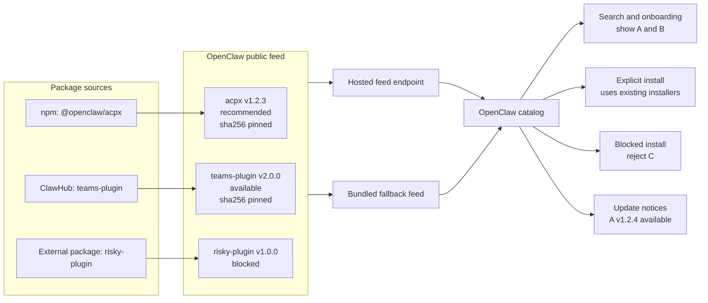
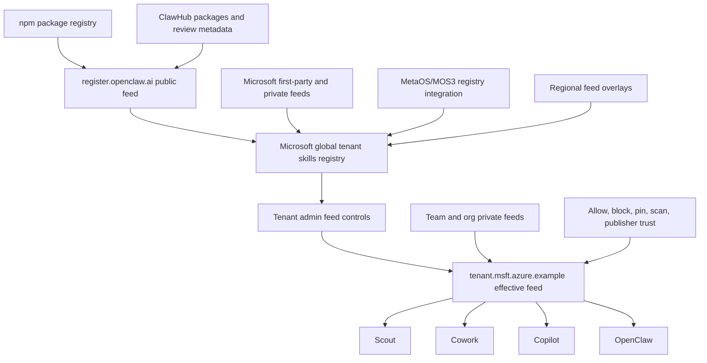
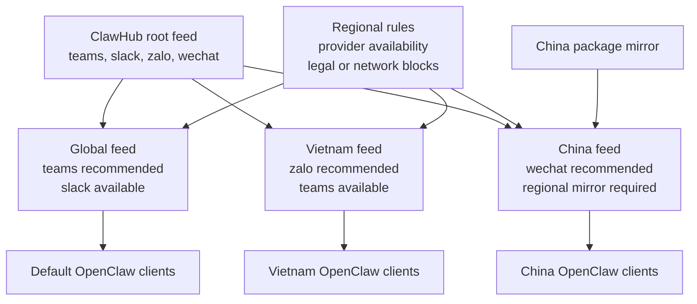

# Proposal: Hosted Feeds for Plugins and Skills

## Summary

Define a hosted feed model for OpenClaw plugins and skills. A feed is a JSON
catalog document that describes available packages, package sources, version and
integrity metadata, and feed-level governance state such as recommended,
disabled, blocked, or update available. OpenClaw should move the existing
file-backed external plugin catalog to this feed model first, keep a bundled
fallback for offline environments, and later extend the same contract to skills
and organization-specific catalogs.

The first implementation should preserve the package model OpenClaw already
uses. External plugins can continue to install from npm or ClawHub, with the feed
providing the catalog, source spec, version, and checksum. ClawHub can publish
the default public feed. Enterprises can publish their own effective feeds by
subsetting, filtering, or augmenting ClawHub feeds with private entries and
policy decisions.

## Motivation

OpenClaw is moving more plugins out of the base install and into external
packages. The current external plugin registry is local and file-backed, which
works as a bundle-time manifest but does not give OpenClaw or downstream
distributions a clean way to update recommendations, disable problematic
plugins, regionalize provider availability, or let enterprises expose only the
plugins they approve.

A hosted feed gives OpenClaw a small, cacheable, reviewable distribution
primitive. OpenClaw can fetch the public feed when online, detect changes through
HTTP metadata and checksums, and fall back to the bundled feed when offline or
blocked. ClawHub can curate the default public experience. Microsoft, other
enterprises, and regional mirrors can consume ClawHub feeds, apply their own
policy and private entries, and publish an effective feed to their clients.

This also aligns OpenClaw with proven package ecosystems. npm, Homebrew taps,
and marketplace catalogs separate package storage from catalog composition. The
feed should be the catalog and governance layer, while package registries such
as npm, ClawHub, private Git repositories, and enterprise registries remain the
package source layer.

## Goals

- Replace the bundled-only external plugin catalog with a hosted JSON feed plus
  bundled fallback.
- Preserve existing npm-backed external plugin installs, including package
  version and hash integrity checks.
- Define a feed entry shape for plugins first, with room for skills and other
  package types.
- Support edge-hosted and regional feeds so provider availability can differ by
  geography or deployment environment.
- Let ClawHub publish one or more public feeds for OpenClaw clients.
- Let enterprises publish composed effective feeds that subset, block, pin, or
  augment public feeds.
- Support private organization and team feeds without forcing OpenClaw to own
  the private registry RBAC model.
- Let clients detect feed updates using HTTP `Last-Modified`, `ETag`, and a feed
  checksum before downloading or applying changes.
- Keep a bundled feed in every OpenClaw build so offline, Docker, and
  air-gapped environments continue to work.
- Create an RFC and implementation plan that ClawHub, Microsoft, Tencent,
  Xiaomi, and other regional ecosystems can align on before incompatible feed
  formats emerge.

## Non-Goals

- Replacing ClawHub as the public registry and discovery surface.
- Replacing npm, ClawHub package storage, private Git repositories, or private
  enterprise registries as package sources.
- Automatically installing or updating plugins or skills without user action.
- Defining the full end-user onboarding redesign.
- Defining runtime tool-call policy enforcement such as MCP method blocking or
  parameter clamping.
- Making feed membership a guarantee that package code is safe.
- Requiring every enterprise to use Microsoft MOS3 or any specific hosted
  registry.
- Solving private registry authentication or RBAC inside the feed format.

## Proposal

OpenClaw should treat feeds as the catalog primitive underneath plugin and skill
marketplace experiences. A feed is fetched from an HTTP endpoint or loaded from a
local file. The client validates the document shape, verifies document integrity
when pinned, and uses entry-level package metadata to drive search,
recommendation, install, update notices, and feed-level allow/block decisions.

The initial implementation should refactor the existing external plugin catalog
rather than introduce a parallel catalog. Today the relevant OpenClaw entry
points are:

- `src/plugins/official-external-plugin-catalog.ts`, the generated TypeScript
  catalog entry point.
- `scripts/lib/official-external-plugin-catalog.json`, the actual package data.
- `openclaw.install.npmSpec`, the existing npm package install metadata.
- `src/wizard/setup.official-plugins.ts`, the onboarding reader.
- `src/commands/onboarding-plugin-install.ts`, the install executor.

The first feed version should preserve those semantics while moving the catalog
source from bundled-only JSON to hosted JSON with bundled fallback.

### Feed document

A feed document should be a deterministic JSON document with a schema version,
feed id, generated timestamp, revision metadata, and entries. Entry ids must be
stable. Package source metadata must be explicit enough for OpenClaw to install
through existing package installers without guessing.

```jsonc
{
  "schemaVersion": 1,
  "id": "clawhub-official",
  "generatedAt": "2026-06-18T00:00:00.000Z",
  "revision": {
    "etag": "\"clawhub-official-20260618\"",
    "bodySha256": "sha256:..."
  },
  "entries": [
    {
      "type": "plugin",
      "id": "acpx",
      "title": "ACP-X",
      "version": "1.2.3",
      "state": "recommended",
      "publisher": {
        "id": "openclaw",
        "trust": "official"
      },
      "install": {
        "source": "npm",
        "npmSpec": "@openclaw/acpx@1.2.3",
        "integrity": "sha256:..."
      },
      "regions": {
        "include": ["global"]
      }
    }
  ]
}
```

The initial states should cover the known plugin catalog needs:

- `available`: entry can be shown and installed.
- `recommended`: entry can be highlighted in onboarding or search.
- `disabled`: entry is known but not currently installable from this feed.
- `blocked`: entry should not be installed through this feed.
- `deprecated`: entry remains visible for migration but should not be selected
  for new installs.

The exact enum names can change during implementation, but the RFC should keep
these concepts separate. A recommended package is not the same as a merely
available package. A disabled package is not the same as a blocked package.

### Feed discovery and fallback

OpenClaw should have a default feed URL for the ClawHub public feed. At build or
deploy time, OpenClaw should also bundle the latest generated feed file. At
runtime the client should:

1. Load the bundled feed as the fallback catalog.
2. Fetch the hosted feed metadata when network access is allowed.
3. Use `ETag`, `Last-Modified`, and the previous validated body hash to decide
   whether the hosted feed probably changed.
4. Download and validate the hosted feed when it changed.
5. Compute the body hash over the canonical feed document, excluding the
   `revision.bodySha256` field, and use the hosted feed only when validation
   succeeds.
6. Fall back to the bundled feed when the hosted feed is unavailable, invalid,
   blocked, or not allowed by local policy.



**Figure 1.** OpenClaw uses feeds as the catalog layer. The feed can recommend,
show, block, pin, and notify updates for individual plugin entries while package
artifacts remain in npm, ClawHub, or another package source. The hosted feed
provides fresh catalog state, the bundled fallback preserves offline behavior,
and OpenClaw continues to use existing plugin and skill installers for explicit
installs.

The fallback is required. Users run OpenClaw in Docker, offline networks,
restricted enterprise environments, and regions where the public ClawHub endpoint
may not be reachable. Feed support must improve the online catalog without
breaking those installs.

### Feed composition

Feeds should support composition by convention, even if the first OpenClaw
client only consumes the final effective feed. A composed feed can start from a
parent feed and apply local rules: include only some entries, block entries,
change recommendation state, pin versions, add private entries, or publish a
regional variant.

The screen-share model from the design discussion used `register.openclaw.ai` as
the public OpenClaw feed endpoint and a tenant endpoint such as
`tenant.msft.azure.example` as the enterprise-composed feed. Those names are
illustrative, but the RFC should preserve the topology: clients consume a feed,
and feed entries point at package sources such as npm or ClawHub for the actual
artifact.



**Figure 2.** Enterprise composition keeps package sources such as npm and
ClawHub separate from the feed that clients consume, while allowing a global
enterprise registry, tenant admins, teams, and regional overlays to shape the
final effective feed.

Microsoft is one example of this pattern. ClawHub can publish the public feed at
an endpoint like `register.openclaw.ai`. MetaOS/MOS3 can integrate that feed
into a Microsoft global tenant skills registry, combine it with Microsoft
first-party and private feeds, and apply regional overlays. Tenant admins can
then further subset, block, pin, require scans, or restrict publishers before
publishing a tenant-scoped effective feed such as `tenant.msft.azure.example`.
Teams or organizations can contribute private feeds into that tenant layer when
the tenant permits it. Scout, Cowork, Copilot, and OpenClaw clients consume the
same effective feed contract. Other enterprises can publish the same shape from
their own registry, CI job, private Git repository, or static hosting service.

### Regional feeds

The feed model should allow regional variants. Some providers are only useful in
certain markets. Some providers may be unavailable or blocked in certain regions.
The feed endpoint can use edge routing, or the client can be configured with an
explicit regional feed URL. The feed document should make regional intent visible
so reviewers and mirrors can reason about it.



**Figure 3.** Regional feeds can share a root catalog while producing different
effective catalogs. One region can recommend Zalo, another can use a regional
mirror and recommend WeChat, and another can keep the default provider set.

Examples:

- A Vietnam feed can recommend Zalo during onboarding.
- A China feed can include providers and mirrors that only work in China.
- A region can temporarily disable or block an entry without requiring an
  OpenClaw application update.

### Feed governance versus runtime policy

Feeds own catalog governance. They decide what is present, recommended,
disabled, blocked, pinned, or eligible for update. They can carry metadata that
helps a policy engine make decisions.

Runtime policy remains separate. Tool-level MCP controls, such as disabling a
`send email` tool while allowing read-only tools, and parameter clamping, such
as restricting tool arguments to tenant-approved schemas, should not be hidden
inside the catalog contract. The RFC should leave room for feed entries to
reference policy metadata, but it should not make the feed format the runtime
policy engine.

### Marketplace naming

The user-facing surface can still be called a marketplace. The RFC should use
"feed" for the underlying protocol and artifact because it describes how the
catalog propagates through ClawHub, mirrors, enterprise registries, and clients.
A marketplace can be implemented on top of one or more feeds.

## Rationale

A hosted feed is the smallest change that unlocks remote catalog control without
requiring OpenClaw to become a hosted marketplace. It builds directly on the
existing external plugin catalog and npm install metadata. It also gives ClawHub
and enterprise administrators the same primitive: publish a catalog, let clients
verify it, and use existing package installers for the actual artifact.

A static JSON feed is easier to cache, mirror, review, and bundle than an API-only
registry. It can be hosted on edge infrastructure such as Cloudflare. It can be
copied into OpenClaw builds for fallback. It can be diffed in pull requests. It
can be mirrored by Tencent or other regional operators. It can also be generated
from richer systems such as ClawHub, MOS3, private Git repositories, or CI jobs.

This proposal deliberately separates the feed from package storage. npm already
solves package distribution for current external plugins. ClawHub can remain the
public registry and package discovery surface. Enterprises can keep private
artifacts in their own registries. The feed only needs to say what is approved,
where the package lives, and how the client verifies that it got the expected
package.

The bundled fallback is not optional. Without it, a feed outage or blocked
endpoint would break onboarding and plugin discovery. With it, hosted feeds add
freshness and control while preserving today’s offline behavior.

## Rollout plan

1. Refactor the existing external plugin manifest so the current local catalog
   shape can be generated from a feed document.
2. Publish the first ClawHub-hosted JSON feed for the existing official external
   plugins.
3. Update OpenClaw to fetch the hosted feed, validate it, and fall back to the
   bundled generated catalog.
4. Add build or deploy logic that refreshes the bundled fallback from the hosted
   feed.
5. Add `ETag`, `Last-Modified`, and checksum-based update detection.
6. Add regional feed support once the default hosted feed path is stable.
7. Extend the same feed contract to skills.
8. Add enterprise composition guidance and examples for Microsoft/MOS3 and other
   tenant-admin systems.
9. Align Tencent, Xiaomi, and other regional mirrors before the spec is treated
   as stable.

## Unresolved questions

- Should the default ClawHub feed include only official entries, reviewed
  entries, trusted publisher entries, or several named feeds?
- What is the exact feed entry schema for plugin install metadata beyond
  `npmSpec` and integrity?
- Should regional selection be client-configured, edge-routed, tenant-driven, or
  a combination?
- What user-facing noun should OpenClaw use: feed, marketplace, registry, or
  another term?
- How should private Git repositories be represented: first-class source type or
  one possible backing system for a generated feed?
- Which runtime policy metadata should feed entries be allowed to reference
  without turning the feed into a policy engine?
- How many stable OpenClaw releases should ship hosted feed fallback before
  Scout, Microsoft, and other clients depend on the contract?
- How should ClawHub represent trusted, verified, official, and reviewed
  publishers in the public feed?
