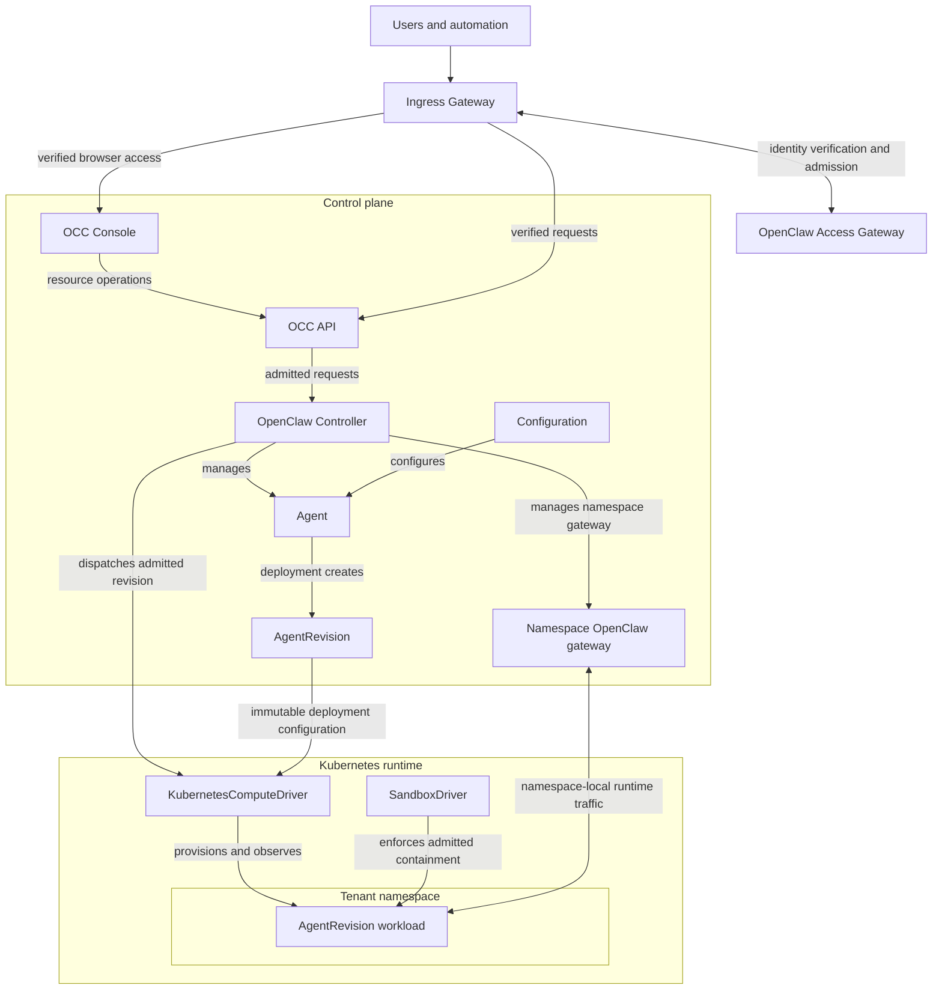

# Proposal: OpenClaw as the Open Enterprise Agent Platform

## Summary

OpenClaw Enterprise provides a multi-tenant control plane for configuring,
deploying, and operating agents. The OpenClaw Controller (OCC) owns platform
resources, authorization, deployment, integration selection, and audit. OCC
manages one isolated OpenClaw gateway for each Namespace. Users change an
`Agent`; each deployment creates an immutable `AgentRevision`, and at most one
revision is active for each Agent. The selected `ComputeDriver` provisions
only that revision's workload, and the selected `SandboxDriver` enforces its
containment. A selected `SecretDriver` performs brokered secret-backend
operations without exposing secret values or backend credentials to workloads.
Kubernetes is the only supported compute implementation in v1.

## Motivation

The existing OpenClaw gateway serves a single tenant. Operating agents for an
organization currently requires separate deployments, manually maintained
configuration, and application-specific integration work. Organizations lack a
shared way to manage tenant isolation, access, policy, deployment, and audit.

The platform needs one resource model for an agent, its configuration, the
version being deployed, and the infrastructure that runs it. Compute, external
identity, policy, messaging, and secret integrations need explicit ownership
boundaries without introducing a separate resource for each runtime detail.

## Goals

- Provide a multi-tenant OpenClaw control plane with explicit Installation,
  Namespace, and authorization boundaries.
- Validate externally authenticated identity and admit requests to the exact
  Installation and, when applicable, Namespace.
- Manage one isolated OpenClaw gateway per Namespace independently of agent
  workloads.
- Define the v1 resources used to configure, deploy, constrain, and operate an
  Agent.
- Preserve exact-resource authorization, immutable deployment snapshots, stable
  workload identity, fail-closed behavior, and audit evidence.
- Provision agent workloads through a `ComputeDriver`, with Kubernetes as the
  only v1 implementation.
- Enforce admitted sandbox policies and keep secret values, backend
  credentials, and provider credentials outside agent workloads.
- Extend the platform through explicit Driver, Adapter, and Backend contracts.

## Non-Goals

- Making the existing OpenClaw gateway multi-tenant.
- Introducing an execution resource between `AgentRevision` and its workload.
- Specifying the OCC API or OCC Console beyond naming their surfaces.
- Supporting a non-Kubernetes `ComputeDriver` in v1.
- Specifying integration wire protocols, database schemas, audit storage,
  directory synchronization, or external policy internals.
- Performing identity-provider authentication, login, token exchange, or
  credential issuance in the access gateway.
- Defining connector or plugin resources, tool actions, or approval workflows.
- Delegating human identity or authentication to an Agent.
- Supporting cross-Namespace references.

## Proposal

1. Introduce OCC as the owner of the multi-tenant control plane, platform
   resources, authorization, deployment, integration dispatch, and audit. `OCC
   API` and `OCC Console` name future product surfaces; their implementation
   belongs to later RFCs.
2. Use an Ingress Gateway as the public control-plane boundary. It forwards
   protected requests only after the OpenClaw Access Gateway (OAG) verifies
   externally authenticated identity and admits the exact requested scope.
3. Have OCC independently authorize every requested OpenClaw operation against
   the exact action, resource, and Namespace.
4. Define the v1 platform resources: `Namespace`, `Configuration`, `Agent`,
   `AgentRevision`, `Harness`, `Channel`, `Secret`, `SecretBroker`,
   `SandboxPolicy`, and `Restriction`.
5. Have OCC manage one OpenClaw gateway for each Namespace. The gateway routes
   Namespace-local Channels and agent runtime traffic independently of agent
   deployment.
6. Provision an admitted `AgentRevision` through `KubernetesComputeDriver`
   and enforce its exact `SandboxPolicy` through the selected `SandboxDriver`.
7. Keep compute, sandbox, secrets, and external systems behind bounded Driver,
   Adapter, and Backend contracts. Installing an integration does not grant it
   resource ownership, policy authority, or permission to select itself.
8. Provide durable platform state, exact-resource authorization, and audit
   evidence without selecting internal storage or wire formats.

## Architecture

The Ingress Gateway is the public control-plane boundary. An external identity
provider authenticates the caller, OAG verifies the resulting identity evidence
and tenant admission, and OCC authorizes the exact platform operation. The
control plane contains OCC and each Namespace's OpenClaw gateway.
`KubernetesComputeDriver` provisions only the workload for an admitted
revision. `SandboxDriver` enforces the policy for that same workload. OCC API
and OCC Console are named surfaces, not implementation or deployment
decisions.

## Common concepts

An `Installation` is one OpenClaw Enterprise deployment. It is the outer
administrative boundary for configured integrations, installation-scoped IAM
resources, and Namespaces. Installation configuration selects server-owned
integrations, including the authoritative `IAMAdapter` for each resource kind
and the selected compute, sandbox, and secret integrations.

Installation bootstrap establishes identity-provider trust and the first
administrator through a server-owned, single-use, installation-scoped setup
path. Normal requests are unavailable until setup completes, after which the
bootstrap path is disabled. Bootstrap decisions are audited. Only an
authorized human or installation-scoped service principal may create or
change Namespaces, Groups, Roles, AccessBindings, Restrictions, or
installation trust.

A `Namespace` is the tenant boundary inside one Installation. Each
Namespace-scoped resource, identity, and access binding belongs to exactly one
Namespace. Namespace-scoped references cannot cross the Namespace boundary.
Installation-scoped resources may be referenced only from a Namespace in that
same Installation.

A Namespace is ready only after its backing Kubernetes namespace and exact
OpenClaw gateway are ready. Retries reconcile the same Namespace. A failed or
incomplete Namespace cannot admit deployments, and deletion drains its active
workloads and gateway routes before its backing resources are removed.

OCC owns platform resource records and lifecycles. Drivers and Adapters consume
admitted resource intent at their boundary; they do not own platform resources,
select themselves, grant permissions, or rewrite revisions.

## Platform resources

| Resource | Scope | Contract |
| --- | --- | --- |
| `Namespace` | Installation | Tenant boundary for agents, configuration, messaging, secrets, policy, and runtime routing. OCC establishes its backing Kubernetes namespace and one ready OpenClaw gateway before contained resources can be deployed. |
| `Configuration` | Namespace | Reusable nonsecret configuration for Agents. Deployment snapshots the admitted contents into an `AgentRevision`; later edits affect only later deployments. |
| `Agent` | Namespace | Stable author-facing agent resource. It owns its revision history, at most one active revision, and one stable OCC-created `WorkloadIdentity`. |
| `AgentRevision` | Namespace | Immutable snapshot of one Agent and the exact configuration, references, harness, sandbox policy, and selected runtime implementations admitted for one deployment. OCC activates it only after preparing its candidate workload, verifying containment, and configuring a nonserving Namespace gateway route. |
| `Harness` | Installation | Versioned agent runtime published for the Installation. Deployment pins the admitted Harness version in the revision. |
| `Channel` | Namespace | Messaging surface available to an Agent through its Namespace's OpenClaw gateway. OCC owns the Channel resource; the messaging provider independently authorizes provider operations and owns provider credentials. |
| `Secret` | Namespace | Opaque reference to one exact `SecretBroker`. The Secret resource, revision, and workload contain no secret value. |
| `SecretBroker` | Namespace | Authorizes and mediates workload access to an external secret backend. A selected `SecretDriver` performs each permitted backend operation without exposing secret values or backend credentials to the workload. |
| `SandboxPolicy` | Namespace | Workload containment requirements for an Agent deployment. The selected `SandboxDriver` must support and enforce the exact admitted policy. |
| `Restriction` | Installation or Namespace | Platform-wide guardrail enforced by every relevant authority and integration. It can narrow an otherwise allowed operation, but it cannot grant or expand permission. |

Identities, groups, roles, permissions, and access bindings are IAM resources,
not additional deployment primitives. Workloads, Kubernetes objects, Drivers,
Adapters, Backends, and external provider objects are not platform resources.

## Access gateway

The external identity provider authenticates each human or automation caller.
OAG verifies the resulting identity evidence and admits the caller to exactly
one server-selected Installation. Namespace-scoped requests additionally
require admission to the exact existing Namespace. Installation-scoped
administrative requests do not require a Namespace. OAG does not perform
authentication, issue or exchange credentials, create a session, or grant an
OpenClaw permission.

Installation configuration establishes the trusted identity issuer, intended
audience, and verification authority. OCC owns the association between an
external tenant and an existing Namespace. OAG verifies the issuer, immutable
subject, audience, expiration, and required claims against that configuration.
For a Namespace-scoped request, it additionally verifies the exact existing
tenant association. Caller-supplied claims cannot select the Installation or
Namespace. An email address, unverified caller claim, or successful admission
is not proof of identity or platform permission.

The Ingress Gateway forwards only an OAG-admitted request and its verified
identity and scope. The evidence remains bound to the original request,
Installation, and applicable Namespace. OCC accepts this evidence only through
the Installation's trusted ingress boundary; direct or caller-supplied
admission is denied. Forwarding does not mint a credential or authorize a
resource. OCC independently resolves an existing platform identity, selects
the authoritative `IAMAdapter`, and authorizes the exact operation and each
protected reference.

Missing, invalid, expired, conflicting, or unverifiable identity evidence;
unavailable OAG or configured trust; a missing, ambiguous, or mismatched
required tenant; or denied gateway access fails closed. The Ingress Gateway
does not forward a denied request or a request whose OAG decision cannot be
verified. OCC independently denies an unknown platform identity.

## IAM and authority

An external identity provider authenticates the caller. OAG verifies that
identity and admits the exact Installation and applicable Namespace; OCC
authorizes the exact action, resource, and scope. Neither external
authentication nor gateway admission grants an OpenClaw permission.

| Boundary | Owner | Responsibility |
| --- | --- | --- |
| Authentication | External identity provider | Authenticate human and automation identities and own the resulting identity evidence. |
| Identity verification and admission | OAG | Verify external identity evidence and admit the exact Installation and, when required, Namespace. |
| OpenClaw resources | OCC | Own Agents, AgentRevisions, Channels, native IAM resources, and Namespace containment. |
| Platform Restrictions | OCC | Own Installation and Namespace guardrails and require each relevant adapter and Driver to enforce them. |
| Namespace runtime routing | OCC-managed OpenClaw gateway | Route Channel and Agent runtime traffic within its exact Namespace without granting platform permissions. |
| Native authorization | `OCCIAMAdapter` | Evaluate OpenClaw roles, bindings, permissions, and applicable Restrictions. |
| External authorization | Selected external `IAMAdapter` | Evaluate its external authority's policy and enforce applicable platform Restrictions. |
| External resources | External system | Own external resources, provider credentials, and provider authorization. |
| Workload infrastructure | Kubernetes | Authenticate and authorize its own workload and infrastructure identities. |

Native OpenClaw authorization assigns permissions to a specific principal or
Group through an explicit binding.

| Entity | Meaning |
| --- | --- |
| `Principal` | Stable OCC identity for an authenticated human. |
| `ServicePrincipal` | Explicit OCC automation identity scoped to one Installation or one Namespace. |
| `WorkloadIdentity` | Stable OCC identity belonging to exactly one Agent. |
| `Group` | OCC-managed collection of Principals. |
| `Permission` | One action on a resource kind, such as `openclaw.agents.read` or `openclaw.agents.deploy`. |
| `Role` | A named set of Permissions. |
| `AccessBinding` | Assignment of a Role to a `Principal`, `ServicePrincipal`, `WorkloadIdentity`, or `Group` at Installation, Namespace, or exact-resource scope. |
| `Restriction` | A platform-wide guardrail that narrows otherwise allowed permissions. |

OCC resolves a human to an existing `Principal` using immutable external
identity, such as provider, issuer, and subject. Automation resolves to an
existing `ServicePrincipal`. An unknown identity is denied; admission cannot
create a platform identity. Email, display name, authentication, and tenant
admission do not grant a permission.

An `AccessBinding` grants a Role at Installation, Namespace, or exact-resource
scope. Installation-scoped bindings administer the Installation and its
Namespaces. Namespace-scoped bindings apply only within one tenant.
Exact-resource bindings apply only to one named resource within its Namespace.

A `Group` belongs to its Installation or to one Namespace. A
Namespace-scoped Group can receive bindings only within that Namespace. A
`ServicePrincipal` belongs to exactly one Installation or one Namespace. An
installation-scoped `ServicePrincipal` can receive administrative bindings
only in its Installation. A Namespace-scoped `ServicePrincipal` can receive
bindings only in its Namespace or on exact resources within that Namespace.
An Agent's `WorkloadIdentity` can receive bindings only for its own Namespace
or exact resources within that Namespace.

OCC creates and owns each Agent's `WorkloadIdentity`. Every revision and
workload for that Agent uses the same identity, but only its single active
revision can act. A workload cannot assume a human session, inherit a creator's
Role, use the deploying user's credentials or provider sessions, or select
another Agent's identity.

Each Agent has one `WorkloadIdentity` backed by a dedicated Kubernetes
`ServiceAccount`. Its workload authenticates to OCC using a short-lived,
pod-bound `ServiceAccount` token. OCC verifies that the token is valid for OCC
and belongs to the exact Namespace, `ServiceAccount`, and active workload
associated with the Agent's `WorkloadIdentity` and active `AgentRevision`.
For each runtime operation, OCC checks the workload's current roles,
permissions, and applicable Restrictions. A candidate, retired revision,
revoked permission, or incorrectly scoped workload cannot authorize a runtime
or secret-broker operation.

## Authorization model

Each resource kind has exactly one authoritative `IAMAdapter`. Installation
configuration selects the adapter; a request, Agent, Backend, Driver, or
adapter cannot choose it.

`OCCIAMAdapter` is the native implementation. It authorizes an exact action
from the requesting identity's applicable `AccessBinding`, `Role`,
`Permission`, and `Restriction`. A native operation without an applicable
binding and permission is denied.

An external `IAMAdapter` authorizes the resource kinds explicitly assigned to
it by using its external system's policy and enforcing applicable platform
Restrictions. An OCC-owned `Agent` or
`AgentRevision` may use an external authorization adapter without becoming an
externally owned resource. A `Channel` may continue to use `OCCIAMAdapter`
when that external system does not authorize Channels.

For `create`, OCC authorizes the containing Installation or Namespace through
the selected adapter for the resource kind being created. For `list`, OCC
uses that resource kind's authoritative `IAMAdapter` to authorize the
resource-level `read` action for each candidate within the exact requested
Namespace. A listing returns only resources the caller is individually
authorized to read. An exact-resource binding makes a resource visible only
when it grants `read`; a deploy or update permission does not grant discovery.
OCC filters authorized resources before pagination and fails the list when
its selected authority is unavailable. Installation-scoped listings apply the
same rule within the exact Installation. Scope constrains the request but
never substitutes for resource-level permission. For another operation on an
existing resource, OCC selects the adapter for that resource's kind and
authorizes the exact resource.

An operation that references multiple resources requires one successful
decision from each resource's authoritative `IAMAdapter`. An allow for the
parent resource does not authorize its references. Platform Restrictions
independently narrow native and external authorization. Each selected adapter
or Driver enforces the Restrictions applicable to its role; unsupported,
unavailable, or unverifiable enforcement denies the operation. A Restriction
cannot grant permission, replace an authoritative policy, or select an
integration. OCC does not retry a denied or unavailable decision against
another adapter.

## Secret access

Agent workloads access secrets only through their exact, Namespace-scoped
`SecretBroker`. For every brokered operation, OCC verifies the active
`AgentRevision`, `WorkloadIdentity`, exact `Secret`, and current authorization.
The `SecretBroker` mediates access to its external secret backend. The
Installation-selected `SecretDriver` performs the permitted secret-backed
operation against that backend. The backend independently authorizes the
operation and retains its secret values and credentials.

A workload receives authorized broker-mediated access, never the secret value
or reusable backend credentials. Secret values do not appear in Agents,
revisions, driver inputs, gateway routes, or audit records. Revoking a binding,
Secret, or SecretBroker prevents subsequent brokered access without requiring
an Agent redeployment.

## OpenClaw gateway

OCC manages exactly one OpenClaw gateway for each Namespace. The gateway is a
single-tenant control-plane component that routes Channel traffic and agent
runtime requests within that Namespace. Its lifecycle belongs to the Namespace,
not to an Agent or `AgentRevision`. It is distinct from the Ingress Gateway and
OAG.

OCC establishes the gateway as part of making its Namespace ready. Deploying
an Agent requires the exact Namespace's gateway to be ready before OCC creates
a candidate revision or dispatches a Driver. Stopping or redeploying an Agent
does not recreate the gateway. Before activation, OCC prepares a nonserving
route for the candidate. It enables that route only after the candidate is the
sole active revision and its contained Harness is ready. A gateway or route
failure before activation leaves the previous revision, workload, and route
unchanged; a failure after activation requires rollback.

The gateway is not a platform primitive, compute integration, authorization
authority, or additional identity. It accepts only the exact Namespace's
Channels and Agent workloads. It cannot admit a tenant, authorize a platform
operation, grant a Permission, assume an Agent's `WorkloadIdentity`, or
substitute one Agent's identity for another.

## Agent deployment

An `Agent` is the stable, user-configured platform resource. Its
`Configuration`, `Channel`, `Secret`, `SecretBroker`, and `SandboxPolicy`
references belong to its Namespace; its `Harness` belongs to the same
Installation. Editing an Agent or one of its referenced resources changes only
the inputs available to a future deployment; it does not change an existing
`AgentRevision` or running workload.

Deploying an Agent follows one path.

1. OAG verifies the caller's externally authenticated identity and admits the
   caller to the exact Installation and Namespace.
2. OCC authorizes deployment of the exact Agent and enforces applicable
   Restrictions through the authoritative `IAMAdapter` for Agents.
3. OCC resolves the Agent's referenced `Configuration`, `Harness`, `Channel`,
   `Secret`, `SecretBroker`, and `SandboxPolicy` resources.
4. Each separately protected reference receives its own allow decision from
   the authoritative `IAMAdapter` for that exact resource.
5. OCC validates Namespace and Installation scope for every reference.
6. OCC verifies that the exact Namespace's OpenClaw gateway is ready and the
   selected `SandboxDriver` supports the entire `SandboxPolicy`.
7. OCC creates an immutable `AgentRevision` from the admitted Agent,
   configuration, references, harness, sandbox policy, and selected compute
   and sandbox implementations.
8. OCC gives both selected Drivers the same revision, exact Namespace, and
   stable Agent `WorkloadIdentity`.
9. `KubernetesComputeDriver` provisions a separate, non-serving candidate
   workload whose Harness cannot start. Kubernetes independently authorizes
   its infrastructure.
10. `SandboxDriver` establishes and verifies the exact admitted policy before
    the candidate can run its Harness.
11. OCC configures a nonserving gateway route for the exact candidate.
12. OCC retires any previous revision, verifies that its Harness has stopped,
    records the candidate as the sole active revision, and permits the
    candidate Harness to execute.
13. Once the active Harness becomes ready, OCC enables its prepared route.
    The gateway routes traffic only to that active revision.

The active revision is the deployed version of the Agent. OCC serializes
activation for each Agent and uses its single active revision as the source of
truth for workload authorization and gateway routing. A candidate or retired
revision cannot execute its Harness, receive traffic, or access runtime
resources. Failures before activation leave the previously active revision
unchanged. Failures after activation require fail-closed rollback.

## ComputeDriver

`ComputeDriver` provisions and observes the infrastructure required to run an
admitted `AgentRevision`. OCC owns the revision, Namespace, workload identity,
authorization decision, and desired state. The driver consumes those inputs,
creates and reconciles a separate candidate workload, and reports readiness or
failure for that exact revision. It cannot mutate the previously active
workload during candidate preparation. OCC authorizes revision retirement and
rollback.

`KubernetesComputeDriver` is the only supported implementation in v1. It runs
the admitted revision in the exact Kubernetes Namespace and workload identity
selected by OCC. Kubernetes owns scheduling and the infrastructure lifecycle.
The driver does not manage the Namespace's OpenClaw gateway. It cannot adopt
another tenant's resources, change an Agent's configuration, rewrite the
revision, select another identity, authorize a platform operation, or grant
permissions.

An unavailable driver, missing Namespace, invalid workload identity, or
Kubernetes provisioning failure keeps the candidate revision inactive. OCC
does not select a fallback compute implementation.

## SandboxDriver

`SandboxDriver` enforces the exact `SandboxPolicy` admitted for one
`AgentRevision`. Installation configuration selects one implementation.
Before creating a candidate revision, OCC verifies that the selected Driver
supports the complete policy; unsupported, unavailable, or ambiguous
enforcement rejects deployment.

After candidate workload provisioning, the Driver establishes and verifies
containment before the Harness starts. The enforcement matches the exact
revision, Namespace, `WorkloadIdentity`, admitted policy, and applicable
Restrictions. OCC activates the revision only after that containment is
ready. `SandboxDriver` does not provision workloads, own resources, select
another identity, grant permissions, or replace the Namespace gateway.

## Integrations

A **Driver** realizes admitted runtime or infrastructure intent. An
**Adapter** translates an external system's protocol or authority into a
bounded platform contract. A **Backend** packages compatible integrations but
does not select an implementation, own a resource, or grant authority. OCC
selects the implementation for each required capability through Installation
configuration.

Every selected Driver or Adapter enforces the platform Restrictions relevant
to its capability. An implementation that cannot verify enforcement is
ineligible for the operation; OCC does not select an alternate implementation.

A Backend may package an external `IAMAdapter` and `ResourceAdapter`. Installing
a Backend does not grant it permissions, make it a resource owner, or let it
select itself. External systems retain ownership of their resources,
credentials, provider authorization, and provider APIs.

Each `AgentRevision` pins the selected compute and sandbox implementations.
Installing or upgrading a Backend cannot replace either implementation for an
existing revision. OCC rejects removal while an active or candidate revision
depends on it. A changed runtime selection applies only to a later authorized
deployment.

## Failure behavior

OpenClaw fails closed when any required boundary or dependency fails:

- Identity verification, trusted ingress, or exact-scope admission.
- Resource authorization, platform Restrictions, active workload identity, or
  current permissions.
- Resource scope, Namespace isolation, or broker-mediated secret access
  through the selected `SecretDriver`.
- Selected sandbox support or verified policy enforcement.
- Namespace gateway readiness or candidate route activation.
- Selected runtime availability or Kubernetes workload provisioning.

Authorization, reference validation, Namespace gateway readiness, and sandbox
policy support complete before OCC creates a revision or dispatches a Driver.
If candidate provisioning, containment enforcement, or nonserving route
preparation fails before activation, the candidate remains inactive and the
previous revision, workload, and route remain unchanged. A failure after
activation stops the failed Harness and requires rollback to the previous
revision, workload, and route before service resumes. If rollback cannot be
verified, the Agent remains inactive and serves no traffic.

OCC never substitutes another Namespace, identity, `IAMAdapter`,
`SecretBroker`, `SecretDriver`, gateway, provider, or runtime implementation.

## Audit

OAG records identity-verification and admission decisions, their requested
scope, and safe denial reasons. OCC records the acting identity, requested
action, exact resource, scope, selected authority, applicable Restrictions,
their enforcement outcome, and the result for platform operations. Deployment
audit identifies the candidate and previous active revisions, selected
Drivers, readiness decisions, route changes, and any rollback outcome. Audit
records contain no credentials, secret values, provider message contents, or
runtime message contents.

## Platform invariants

The platform preserves:

- **Explicit scope:** each resource belongs to the Installation or exactly one
  Namespace. The Namespace is the tenant boundary; Namespace-scoped references
  cannot cross it.
- **Namespace-local runtime routing:** OCC manages exactly one OpenClaw gateway
  for each Namespace. Its lifecycle is independent of Agent revisions.
- **Independent authorization:** an external identity provider authenticates;
  OAG verifies identity and scope; OCC authorizes exact platform operations.
  Kubernetes and external providers retain their own authority.
- **Single-writer ownership:** OCC owns platform resources, desired state,
  native platform policy, and revisions. External systems retain their own
  policy. Drivers report infrastructure state without rewriting resources or
  granting permissions.
- **Immutable deployment:** an `AgentRevision` captures the exact admitted
  Agent configuration, dependencies, sandbox policy, and runtime integrations.
  Editing an Agent or changing runtime integrations affects only a later
  deployment.
- **Stable workload identity:** each Agent has one OCC-owned runtime identity.
  At most one revision is active, executes, or receives traffic. Only that
  revision's exact Kubernetes workload may act; it cannot inherit the
  initiating user's credentials or permissions.
- **Platform-wide Restrictions:** each applicable guardrail narrows native and
  external authority and is enforced by the selected adapter or Driver.
- **Enforced containment:** a candidate cannot run its Harness or receive
  traffic before its selected sandbox driver proves enforcement of the entire
  admitted policy.
- **Brokered secrets:** workloads access authorized secrets only through their
  exact broker and selected `SecretDriver`; backend credentials and secret
  values never enter the workload.
- **Server-owned integration selection:** installation configuration selects
  exactly one implementation for each required integration. A client, Driver,
  Adapter, or Backend cannot select or authorize itself.
- **Fail-closed operations:** unavailable authorization, invalid references,
  stale state, gateway unavailability, integration failure, or provisioning
  failure blocks the operation. OCC never substitutes an unauthorized
  fallback.
- **Auditable changes:** mutations produce attributable audit evidence without
  recording credentials, secret values, provider message contents, or runtime
  message contents.

## Near Term Future work

- OCC API contracts and implementation.
- OCC Console design and implementation.
- Stable integration wire contracts and capability payloads.
- Multi-tenant OpenClaw gateways and agent-to-agent delegation.
