# Proposal: OpenClaw MSIX Packaging for Windows

## Summary

Define a reproducible packaging and release pipeline for deploying OpenClaw on
Windows as an MSIX package. A dedicated `openclaw/openclaw-msix-packaging`
repository will build a package-specific host app and an OpenClaw payload
tarball from a commit pinned for each MSIX release, validate
architecture-specific artifacts with GitHub Actions, and publish them through
GitHub Releases. The MSIX installs the packaged app and its Windows identity;
on first launch, the host app prepares the payload and runs onboarding before
the Gateway is ready to use. This provides a stable Package Family Name (PFN),
enterprise-friendly deployment, and predictable installation and update
behavior on Windows.

## Motivation

Enterprise administrators need a way to identify, inventory, approve, deploy,
and remove OpenClaw consistently from managed Windows devices. A dedicated
OpenClaw MSIX artifact gives the Windows installation a stable, reviewable
package identity, declared capabilities, and a standard Windows
application-management surface, inspectable and governed like any other
managed application.

Windows uses the PFN to associate system-managed resources with the packaged
app and clean up those resources when the package is removed. Gateway state
and other resources created outside the package registration require separate,
explicit lifecycle handling as described below.
A separate RFC will define how the platform uses this package identity when
managing OpenClaw Gateway instances.

Keeping the packaging definition in a dedicated repository also supports trust
and maintainability: contributors and enterprise reviewers can determine
exactly which source revision, capabilities, build tools, signing steps, and
release checks produced a given OpenClaw MSIX artifact.

## Goals

- Create an `openclaw/openclaw-msix-packaging` repository containing the
  Windows host app, package definitions, release workflows, validation, and
  contributor documentation.
- Produce reviewable and reproducible MSIX builds whose OpenClaw payload is
  built from an explicitly pinned revision of the official
  [`openclaw/openclaw`](https://github.com/openclaw/openclaw) repository.
- Include a package-specific host app that verifies and stages the packaged
  payload and manages the Gateway lifecycle.
- Publish signed MSIX artifacts under a stable OpenClaw-controlled identity,
  with checksums and source-version metadata, through GitHub Releases.
- Make a supported way to disable OpenClaw Gateway self-updates a hard
  dependency for the MSIX release. The mechanism belongs in OpenClaw rather
  than this packaging RFC, but it is required so an administrator-approved
  MSIX remains authoritative for the deployed Gateway version.
- Make the [Windows companion app](https://github.com/openclaw/openclaw-windows-node) present **Install OpenClaw MSIX** as the
  default or preferred option for creating a local OpenClaw Gateway.

## Non-Goals

- Publishing v1 through or depending on the Microsoft Store, including
  Store-managed updates. GitHub Releases are the canonical initial release
  channel.
- Defining every enterprise runtime policy, data-loss-prevention rule, or tool
  authorization rule that may be applied to OpenClaw.
- Defining runtime isolation. A separate RFC may define a session-based runtime
  model.
- Defining a new Gateway endpoint, discovery mechanism, authentication scheme,
  pairing flow, or Windows companion app connection role.

## Proposal

### Repository and ownership

Create a dedicated `openclaw/openclaw-msix-packaging` repository. It owns the
Windows-specific host app and the packaging of OpenClaw source into
release-ready MSIX artifacts. The repository should contain:

- Source for the package-specific host app.
- MSIX manifests and package assets.
- Scripts that acquire and verify a pinned OpenClaw source revision.
- Build orchestration for x64 and ARM64.
- GitHub Actions workflows for pull requests, release candidates, and releases.
- Documentation for local builds, release operations, signing, installation,
  update, repair, reset, and uninstall behavior.

The official
[`openclaw/openclaw`](https://github.com/openclaw/openclaw) repository is the
source of truth for the OpenClaw payload. The packaging repository must not
carry a long-lived copy or fork of OpenClaw source; each MSIX release instead
pins the exact upstream revision it packages. This does not make OpenClaw the
build's only input: host app source, bootstrapper, runtime components,
toolchains, and packaging dependencies are separate inputs that must be pinned,
verified, and recorded in the release SBOM and provenance.

The host app is packaging infrastructure specific to the Windows MSIX
deployment. It is not a fork of the OpenClaw Gateway and must keep its
responsibilities narrow: package activation, payload verification and staging,
Gateway lifecycle, health, repair, and supported reset flows.

### Build and release pipeline

GitHub Actions should provide three levels of validation:

1. Pull requests build non-production packages and run manifest, payload, and
   installation tests without access to production signing credentials.
2. Release-candidate workflows build from a clean checkout using the pinned
   OpenClaw source revision and produce artifacts for manual validation.
3. A protected release workflow signs the approved artifacts, verifies the
   resulting signatures and payloads, and publishes a GitHub Release.

After the MSIX distribution path meets the release-readiness criteria in this
RFC, the production release cadence should follow OpenClaw's release channels:

- Every OpenClaw release promoted to the `stable` channel, including subsequent
  security or reliability updates to the active stable line, should have a
  corresponding production-signed MSIX release.
- Beta or other prerelease OpenClaw releases may produce clearly labeled
  prerelease MSIX artifacts for validation.
- Moving `dev` or `main` builds may produce CI artifacts, but must not be
  published as production MSIX releases.

Packaging-only fixes may publish a new MSIX package revision while retaining
the same embedded OpenClaw version. Release metadata must identify both the
MSIX package version and the exact OpenClaw version it contains.

The release workflow should:

- Restore dependencies from locked manifests, then build the host app,
  OpenClaw payload, and required runtime components for x64 and ARM64.
- Produce architecture-specific `.msix` files (and a combined `.msixbundle`,
  if adopted), validating package identity, capabilities, entry points, and
  payload inventory.
- Sign production artifacts with an OpenClaw-controlled code-signing identity
  and verify the resulting signature.
- Generate SHA-256 checksums, an SBOM, and build provenance.
- Publish release notes identifying the OpenClaw source revision and any
  security-relevant packaging changes.

Production signing credentials must be supplied through a protected signing
service or GitHub environment. They must never be committed to the repository
or exposed to pull-request workflows.

### Package and runtime architecture

The MSIX package provides OpenClaw's Windows package identity, a Gateway
payload built from a pinned source revision, declared capabilities, packaged
entry points, and the host app. The lifecycle section below defines how the
host prepares and manages the Gateway.

The host app is the packaged entry point. Its v1 responsibilities are package
activation, payload verification and staging, and launching or stopping the
packaged Gateway. It does not proxy Gateway traffic, distribute Gateway
credentials, or approve clients, nodes, or channel users.

```mermaid
flowchart LR
  Pin[Pinned OpenClaw source revision] --> Tarball[OpenClaw payload tarball]
  Tarball --> CI[MSIX build and validation]
  Host["C# MSIX host app source"] --> CI
  CI --> Sign[Protected signing step]
  Sign --> GH[OpenClaw MSIX GitHub Release]
  GH --> Install[User or enterprise installation]
  Install --> App[MSIX host app]
  App --> Verify["Verify payload tarball and inventory"]
  Verify --> Stage["Extract to clean versioned staging"]
  Stage --> Onboarding["Run OpenClaw onboarding"]
  Onboarding --> Gateway[OpenClaw Gateway]
  App -->|Manage lifecycle| Gateway
```

**Figure 1.** The packaging repository creates a signed MSIX containing the C#
host app and a payload built from a pinned OpenClaw revision.

### Gateway compatibility boundary

The MSIX deployment does not introduce a new Gateway endpoint, discovery
mechanism, connection protocol, authentication scheme, or pairing flow. The
packaged payload runs the standard OpenClaw Gateway and preserves its native
endpoint configuration, discovery, device authorization, node-capability
approval, channel behavior, and protocol handling. Clients and nodes connect
directly to the Gateway through existing OpenClaw mechanisms.

Gateway configuration, credentials, pairing records, and user data remain
owned by OpenClaw rather than the packaging host. The host does not inspect,
copy, authorize, or revoke those credentials. Their exact storage and
retention behavior must be documented and tested for install, update,
uninstall, reset, and multi-user scenarios.

This RFC does not define whether the Windows companion app connects to a
Gateway as an operator client, a node, or both. It changes the recommended
installation path for creating a local Gateway, not the companion app's
connection contract. Existing source-based, WSL, remote-Gateway, and companion
node-worker flows remain available unless a separate proposal changes them.

### End-to-end lifecycle

The MSIX provides the Windows package identity and the files needed to
bootstrap OpenClaw. The Gateway runs from the payload prepared by the host app.
The host owns package activation and packaged-payload lifecycle mechanics;
OpenClaw continues to own Gateway runtime behavior and protocol state.
Enterprise administrators own deployment policy and the selection of the MSIX
version approved for each managed device.

#### Installing the OpenClaw MSIX

An administrator or user installs the signed MSIX, either interactively by
opening it or through an enterprise deployment system. Windows verifies it,
registers its package identity and `openclaw.exe` app execution alias, and
presents OpenClaw as an installed packaged app in Start. No separate PATH
modification is required. At this point, the packaged app is installed, but
OpenClaw has not yet been onboarded and the Gateway is not ready.

Launching OpenClaw starts the host app. On first run, the host verifies the
packaged tarball, extracts the Gateway, and runs OpenClaw onboarding. After
onboarding completes, the Gateway is ready and the packaged app provides its
entry point.

#### Uninstalling the OpenClaw MSIX

Removing the MSIX unregisters the packaged application, its package identity,
and its installed entry points, including the `openclaw.exe` execution alias.
Package removal must not be treated as an implicit destructive reset of Gateway
data.

> **Note:** Resources created on behalf of the packaged app are associated with
> its package identity. When the MSIX is uninstalled, the system cleans up those
> package-associated resources. OpenClaw is not invoked and does not run custom
> cleanup code during uninstall. Gateway processes, state, or separately
> provisioned execution resources may exist outside the package registration
> and may require explicit decommissioning. The exact automated cleanup
> mechanism is outside the scope of this RFC and may be refined alongside a
> future session-isolation design.

Enterprise administrators are responsible for ensuring that OpenClaw is
cleanly installed and decommissioned on managed devices. When resources outside
the package registration must also be removed, administrators may invoke
supported reset tooling or perform equivalent documented operations through
their device-management system, including stopping running Gateway instances
and applying the organization's state-retention policy.

Package removal and destructive reset are separate operations. Ordinary
uninstall may preserve Gateway state for reinstall or recovery; reset may
permanently remove selected state and therefore requires explicit
administrative intent. The detailed decommissioning sequence and its
interaction with future session isolation can be defined by the corresponding
implementation or isolation design.

#### Updating OpenClaw through MSIX (preferred)

In an enterprise deployment, an IT administrator reviews and deploys a newer
signed MSIX with the same package identity and a higher package version.
Windows replaces the installed package files, including the host app and
bundled payload, while keeping the package identity stable. It does not directly
replace the extracted Gateway or its data.

Installing the newer MSIX does not immediately replace an extracted Gateway
that is already running. The host detects the new packaged payload the next
time it starts or restarts the Gateway. It verifies and stages the payload
separately rather than overwriting the active files. If the Gateway is running,
the host stops it, activates the staged version, and starts it again. Enterprise
deployments that require immediate activation must include that restart in
their rollout.

Until activation finishes, the installed MSIX version and the active Gateway
version may differ. A partially staged payload must not be activated. If an
update changes stored data or configuration, the release must include and test
the required migration.

#### Updating through OpenClaw itself

OpenClaw may also update its extracted installation through its native
`openclaw update` command. A user may invoke the same behavior indirectly by
asking OpenClaw to update itself.

The packaging layer cannot reliably prevent this update path. A native update
changes the running OpenClaw files without changing the installed MSIX version
or its signed payload. The PFN continues to identify the packaged application,
but the MSIX version no longer identifies the exact OpenClaw revision currently
running.

Native updating the Gateway must therefore be disabled for managed enterprise
installations. Otherwise it can bypass administrator approval, break the
version and inventory contract, and leave the running Gateway outside the
tested and signed MSIX release. The packaging host does not initiate a native
update on its own, but that is insufficient because users and the Gateway can
still invoke the OpenClaw update path. A supported OpenClaw mechanism for
disabling Gateway self-updates is therefore a hard dependency for the MSIX
release, even though defining and implementing that mechanism is outside this
RFC.

### Distribution and updates

GitHub Releases are the canonical distribution point for the first version of
this proposal. A release should provide direct artifact links, checksums,
signatures, provenance, release notes, and an SBOM.
Future versions may expand distribution to additional channels such as WinGet
or the Microsoft Store once their identity, signing, update, and publication
requirements are defined.
Publishing through WinGet requires submitting a package manifest to the WinGet
repository that references the signed MSIX hosted on GitHub Releases; WinGet
does not need to host a separate copy of the package. This allows GitHub
Releases to remain the canonical artifact source when WinGet support is added.

Enterprise administrators should handle OpenClaw MSIX like any other Windows
app distributed outside the Microsoft Store. They should use their existing
tools and policies to review, test, approve, deploy, update, and remove a
specific signed release. OpenClaw does not require a separate IT deployment
process.

The update behavior and limitations are described in the lifecycle section
above. Unattended MSIX package updates are disabled by default in v1.

For consumer installations, v1 may provide a manual update check or link to an
explicit GitHub Release, but installation still requires a clear user action.
The final consumer update experience remains to be determined.

### Windows companion app setup integration

After the MSIX release reaches the readiness bar below, the Windows companion
app setup UI should replace its current WSL recommendation with **Install
OpenClaw MSIX** as the default or preferred option for creating a local Gateway.
Selecting it should download/launch the approved MSIX installation flow or direct the
user to the appropriate artifact. This setup integration does not change how
the companion app discovers, authenticates to, or selects its role with a
Gateway.

### Release readiness

MSIX should become the preferred Windows installation mechanism for enterprise once:

- x64 and ARM64 packages are built and signed through the packaging pipeline.
- OpenClaw provides a supported mechanism that disables Gateway self-updates
  for managed MSIX installations.
- The payload tarball and staged files are verified before activation.
- Install, onboarding, update, repair, reset, and uninstall paths have
  automated and manual coverage.
- Gateway state ownership and cleanup are documented, including behavior for
  multiple Windows users.
- Package removal and destructive reset have distinct, documented behavior,
  including administrator responsibility for managed-device decommissioning.
- Host lifecycle operations and native `openclaw gateway` commands cannot
  create conflicting managed Gateway instances or bypass staged-payload
  activation.
- Package capability changes are reviewable and release-blocking.
- Existing local Gateway users, including WSL users, have a documented migration
  path to the packaged deployment.

Developer, source-based, and remote-Gateway paths can remain available during
the transition, but Windows installation documentation should prefer the
OpenClaw MSIX artifact after the release criteria are satisfied.

## Rationale

- MSIX is preferred over making a source checkout, bootstrap script, or loose
archive the enterprise deployment contract because it provides a stable package
identity, declarative manifest, signed artifact, predictable lifecycle, and
integration with Windows application-management systems. These properties make
the installed application and its requested capabilities easier to inventory
and review.

- A separate host app keeps Windows packaging and lifecycle code out of
OpenClaw core while providing the packaged entry point needed to prepare and
manage the Gateway.

- A payload tarball gives each release one unit to hash, inventory, and audit.
Clean versioned staging prevents a partially prepared update from replacing the
active Gateway, while keeping the package format independent of later runtime
changes.

- A separate packaging repository creates a focused review and ownership boundary
for the host app, manifests, OpenClaw source pinning, signing, and release
policy. It avoids adding Windows-specific packaging and signing machinery to the
core OpenClaw repository while still consuming OpenClaw directly from an exact
source revision rather than maintaining a fork.

- GitHub Releases are preferred over Microsoft Store publication for the initial
rollout because they keep the artifact and build evidence reviewable while
allowing enterprises to validate and redistribute an exact approved package
through their existing management systems. Store publication can be considered
separately if consumer distribution requirements justify its policy, identity,
and update implications.

- Disabling unattended MSIX package updates by default prioritizes administrator
control and reproducibility over consumer convenience. This is the safer
starting point for a package whose payload can execute agent actions. A
consumer-friendly package update channel can be added after its consent and
verification behavior are defined.

## Unresolved questions

- Is a standalone `openclaw/openclaw-msix-packaging` repository preferable, or
  should the host app, package definitions, and release workflows be maintained
  directly in `openclaw/openclaw`?
- Which capabilities must be declared in the package manifest, and which
  changes require explicit security review?
- What supported OpenClaw enforcement mechanism will disable native
  self-updates, including updates initiated through `openclaw update` or by
  prompting the Gateway, for managed MSIX installations?
- If Microsoft Store distribution is introduced later, can packages released
  through GitHub and the Store preserve the same PFN? If not, how will
  side-by-side installation be handled?
  - [@DrusTheAxe](https://github.com/DrusTheAxe) noted that preserving the PFN
    may be possible by defining the Store product identity in advance and using
    an Azure Artifact Services certificate whose subject matches the package
    manifest's `Publisher`. This is not a v1 priority; GitHub Releases will
    remain the MSIX release channel for the time being.
- How should enterprise deployment systems receive revocation or urgent
  security-update guidance without allowing clients to install unapproved
  payloads?
