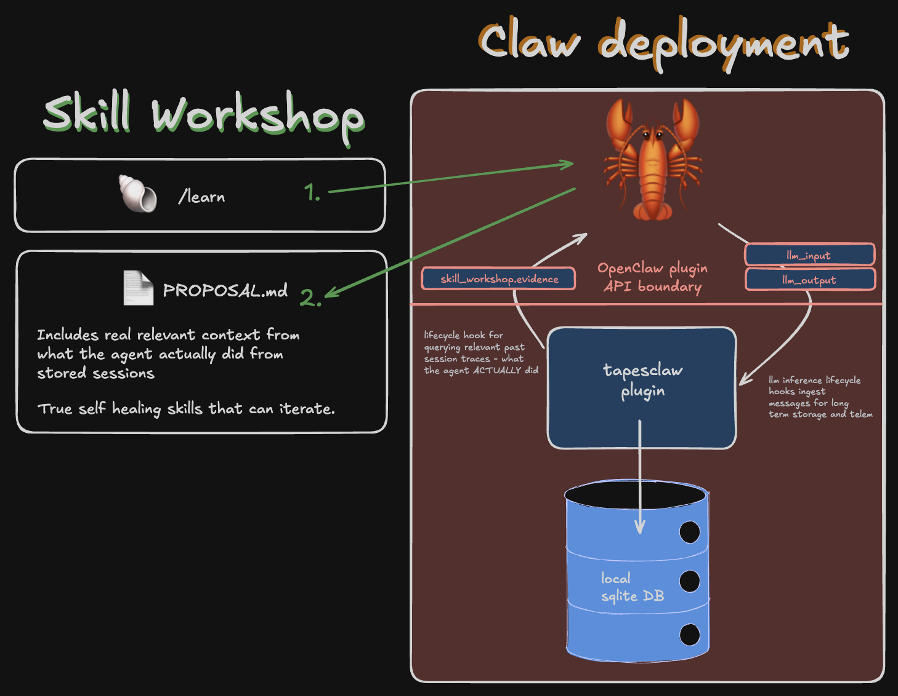

# Proposal: TapesClaw infrastructure

## Summary

This proposal extends OpenClaw's existing self-learning and
[Skill Workshop](https://docs.openclaw.ai/tools/skill-workshop) capabilities
with durable, queryable evidence from [`tapes`](https://github.com/papercomputeco/tapes).
It proposes a first-party bundled TapesClaw plugin, a small capture seam in
OpenClaw's agent lifecycle, and a Skill Workshop evidence hook.

`tapes` records what happened in an agent session. TapesClaw bridges that
record into OpenClaw where Skill Workshop can use selected, attributable evidence
to improve how it proposes skills.

## Motivation

OpenClaw already provides first-party self-learning: it can create pending
proposals from corrections, review substantial completed work, and scan past
local sessions. Those mechanisms are intentionally conservative and safe.

The opportunity is to improve the evidence available to those mechanisms.
A durable session and trace record can let a Workshop reviewer inspect relevant
prior attempts, including the useful tool sequence, recovery steps, and
outcomes, rather than inferring a reusable workflow only from a bounded local
transcript. This should improve proposal quality and provenance during Skill Workshop proposal stages.

## Goals

- Define an OpenClaw capture seam that lets TapesClaw record model calls,
  tool activity, and session boundaries without affecting the user-facing
  agent path.
- Define a `skill_workshop.evidence` hook that obtains bounded, attributable
  evidence before Skill Workshop asks a model to draft a proposal.
- Initially use the `skill_workshop.evidence` hook for `/learn`.
  We can then make the same trace evidence seam available to the
  existing autonomous experience-review and historical-scan paths later.
- Define the boundary between OpenClaw, a first-party `tapesclaw` plugin,
  and `tapes` as a foundation for durable record as self improving evidence.

## Non-Goals

- Replacing Skill Workshop's proposal, scanning, approval, or rollback model.
- Blocking, delaying, or failing an OpenClaw agent turn when `tapes` ingest or
  querying is unavailable.
- Specifying `tapes` storage engine, retention/draining policy, or local-runtime
  implementation. The Paper Compute Co. continues to owns those capabilities and this RFC assumes the local
  `tapes` runtime required by the integration is easily available.
- Using telemetry evidence to apply, reject, or quarantine a Workshop proposal
  automatically.

## Proposal

This architecture diagram shows integrating with a local `tapes` runtime,
the API boundary for `llm_input`, `llm_output`, and a new `skill_workshop.evidence` hook.

### 1. Local Tapes runtime

OpenClaw users who enable TapesClaw run a local `tapes` runtime that accepts
ingest APIs and serves local queries. The intended user outcome is local,
durable session trace evidence without requiring users to design or operate a
telemetry stack themselves. The storage, lifecycle, and future distribution
mechanics of that local runtime remain tapes-owned work.

TapesClaw is opt-in. A disabled or unhealthy local runtime must leave normal
OpenClaw operation unchanged.

### 2. `tapesclaw` first-party bundled plugin

`tapesclaw` is the OpenClaw-side adapter. It observes:

- `llm_input` and `llm_output` for model-call capture
- `after_tool_call` for action and result metadata
- session and subagent lifecycle hooks for session boundaries and ancestry

The capture seam must provide a stable model-call correlation ID and the
capture snapshot needed by the selected `tapes` ingest interface.
The `tapes` maintainers will determine whether Tapes accepts an OpenClaw raw-history/transcript
blob or whether TapesClaw conforms the snapshot to the completed-turn
ingest shape. That choice must preserve provider identity, model-call and
session correlation, streaming completion, and idempotent deduplication.

Capture is asynchronous and best effort. TapesClaw may batch/retry local
writes and expose health, backlog, accepted/dropped, and last-derived-session
metrics, but it must not add capture latency to an agent reply. Evidence may
be absent or stale; Workshop must continue safely without it.

TapesClaw also attaches OpenClaw-owned correlation metadata to captured work:
workspace and agent scope, session/run/call identifiers, parent/subagent
relationships, and the loaded skill identity and version/hash when available.
This enables Tapes to connect a skill invocation to its surrounding LLM traces
as that capability matures.

### 3. `skill_workshop.evidence` hook

Add a Skill Workshop evidence hook, called before a Workshop reviewer receives
the prompt from which it will draft or revise a proposal. `/learn` is the first
caller. The existing autonomous experience-review and historical-scan flows
can adopt the same hook without changing their proposal-only permissions.

The hook receives the proposal context, including the workspace and agent
scope, target skill when known, user goal, source-session/run references, and
a strict evidence budget. It returns either no evidence or a bounded structured
bundle of Tapes references and sanitized excerpts. Each item includes its
source session/trace/span or invocation reference so the eventual proposal can
cite its provenance.

Skill Workshop remains the policy owner: it chooses whether to request
Tapes evidence, assembles the reviewer prompt, treats retrieved text as
untrusted evidence rather than instructions, and preserves all current
proposal-only, scanner, approval, and rollback rules. TapesClaw owns only
capture, local querying, and transport.

The initial retrieval policy should scope evidence to the authorized local
workspace and agent, prefer explicitly correlated invocations of the target
skill, and fall back to bounded semantic/session retrieval only when useful.
It must never inject unbounded raw transcripts.

### 4. Privacy, access, and failure model

TapesClaw captures potentially sensitive prompts and tool results. Enabling it
must disclose local persistence and retrieval, use a local/private transport,
and inherit OpenClaw's applicable workspace and agent boundaries. Retrieved
evidence is redacted and size-bounded before it reaches a Workshop reviewer.

A Tapes query failure, an incomplete derivation, an unsupported provider, or
missing correlation metadata is a non-fatal “no evidence” result. The
resulting proposal remains a normal Workshop proposal and is never presented
as a complete record of prior work.

## Rationale

This proposal builds on, rather than replaces, OpenClaw's local transcript
review. Local transcripts remain the simplest and most reliable source for a
single current session. Tapes adds a durable cross-session trace surface,
correlation with tool activity and subagents, and a path to retrieval over
larger histories.

The alternative is to have Skill Workshop directly own another transcript
archive and search implementation. That duplicates observability and storage
work, couples Workshop to telemetry retention, and offers less value to users
who want to inspect their agent activity outside the Workshop UI.

## Open questions

- What exact local Tapes distribution, readiness, and upgrade contract should
  the bundled plugin depend on?
- Which Tapes ingest contract best represents all supported OpenClaw providers
  and streaming model calls: a raw-history/transcript interface, normalized
  completed turns, or both?
- What is the initial schema for recording a loaded skill/version and its
  invocation range alongside session traces?
- Which evidence fields are safe and useful for `/learn` first, and what
  redaction and byte/token budgets should apply?
- When should autonomous experience review and historical scan consume this
  evidence seam, and what evaluation demonstrates better proposals rather
  than more proposals?
