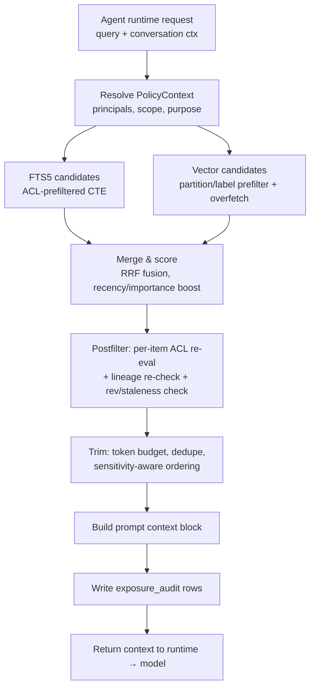

# OpenClaw Memory Broker — Local-First, ACL-Enforced Memory on Markdown Files with a SQLite Index

## 1. Design Principles

0. **Files are the store; SQLite is the index.** OpenClaw memory is markdown
   the user can read, hand-edit, and git-sync. The broker does not replace
   that store — it catalogs it. Every SQLite row about content is derived
   state (pointer + hash + search structures) that the indexer rebuilds from
   the files; policy state (ACL, lineage, audit, bindings — and grants once
   the deferred grant design of RFC Appendix A lands) is authoritative in
   SQLite.
1. **Deny by default.** A memory item is invisible unless an allow rule matches the resolved principal set *and* no deny rule matches. Absence of ACL rows = unreadable (for scopes where ACL rows apply; directory placement covers the rest).
2. **The model never queries the index directly.** All retrieval flows through the Memory Broker, which resolves policy context, filters at the SQL layer, re-filters post-retrieval, and audits exposure. There is no "raw query" tool surface. File access to memory subtrees is confined to the session's mounts — see RFC §2.1 for the enforcement requirements and their honest limits.
3. **Isolation by construction before isolation by policy.** Tenant, user, and channel isolation is achieved with **separate directory subtrees and per-scope index partitions**, not WHERE clauses. ACLs handle the finer grain (shared items, projections, postboxed and declassified items) *within* a mounted scope. A bug in ACL evaluation cannot cross a scope boundary — the unmounted subtree's files are never read and its index partition is never attached.
4. **Labels flow with data.** Derived memories (summaries, extractions, embeddings-of-summaries) inherit the **intersection** (most-restrictive meet) of their ancestors' authorizations. Lineage is a first-class table, and it is re-checked at read time, not only at write time.
5. **Two-phase enforcement.** Enforce ACLs in the candidate query (prefilter) *and* re-evaluate item-by-item after retrieval (postfilter). The prefilter is an optimization; the postfilter is the security boundary. This makes vector-index limitations a recall problem, never a disclosure problem.
6. **Every exposure is recorded.** If an item's content reached a prompt, there is an audit row saying which item revision, under which policy context, for which request. This makes revocation impact analysis ("who saw this after it should have been deleted?") a query, not forensics.

---

## 2. Local File Layout & Isolation Model

Content lives in the workspace memory tree (the store users already know);
broker state lives under `~/.openclaw/`:

```
{workspace}/memory/                # markdown source of truth (RFC §2)
  users/{user_id}/                 # personal store; mounted rw only in that
    ...                            #   user's DM sessions
    postbox/                       # machine-filed items from group sessions
  channels/{channel_id}/           # channel stores; mounted rw only in that
                                   #   channel's group sessions
  shared/                          # tenant-shared; read-only everywhere
  projections/{user_id}/           # opt-in shareable items

~/.openclaw/memory-acl/
  broker.lock                      # exclusive-writer advisory lock (whole runtime)
  tenants/
    {tenant_id}/
      index/
        users/{user_id}.db         # per-scope index partition: item catalog,
        channels/{channel_id}.db   #   ACL rows, lineage, FTS (at-rest: OS FDE, §8)
        shared.db
      vectors/                     # sqlite-vec, split per scope (see §7)
      state.db                     # bindings, membership, exposure audit
                                   #   (grants: deferred, RFC Appendix A)
      sync-outbox.db               # append-only op log for cloud reconciliation
```

**Why per-scope subtrees + per-scope index partitions (recommended), vs. alternatives:**

| Option | Isolation | Ops complexity | Cross-scope queries | Failure blast radius |
|---|---|---|---|---|
| **A. Subtree + index partition per scope (user / channel / shared)** | Strong: a cross-scope leak requires mounting the wrong subtree, not a bad predicate | Moderate: broker fans out to the session's mounted partitions per request | Broker-side merge (cheap at local scale) | One corrupt partition loses one scope; rebuildable from files |
| B. One store, scopes as rows + WHERE clauses | ACL-only between scopes | Simple | Native SQL | Corruption or SQL-injection-class bug exposes all users |
| C. Partition per (user × channel) | Strongest | Partition explosion; lineage spans partitions; painful re-derivation | Expensive multi-partition merges | Small |

Option A is the right trade-off for a local agent runtime: user and channel boundaries are the highest-consequence boundaries and get placement-level enforcement; finer distinctions (shared items, projections, postboxed items) are policy-shaped and belong in ACL rows within a partition. Option C makes derived memories that summarize across channels nearly impossible to manage. Option B is acceptable only for single-user installs — where it is also the current state of the world, which is why single-user Phase 0 is a no-op migration (one scope, one partition).

A session mounts at most: its scope's subtree + index partition, the shared partition, and live members' projections (group sessions, read-only). There is no cross-user read mount in this design (read-only grant slices for user sessions are part of the deferred grant design, RFC Appendix A). It never attaches another scope's partition for writing. Because index partitions are derived from files, a lost or corrupt partition is rebuilt by reindexing — the blast radius of index corruption is availability, not confidentiality or data loss.

---

## 3. Schema

One schema, instantiated per index partition. All timestamps are Unix epoch
ms; all IDs are ULIDs (sortable, mergeable on sync).

**The catalog is derived state.** `memory_item` rows point at markdown files;
the file is authoritative for content, the row is authoritative for policy
metadata (scope, ACL, lineage, tombstones). The indexer — memory-core's
existing watcher/sync machinery — rewrites rows when files change; a
`content_hash` mismatch between row and file marks the row stale (reindex,
and exclude from results until refreshed). `forget` tombstones the row *and*
removes the item file through the broker's write path in the same operation.

### 3.1 Item catalog and provenance

```sql
PRAGMA journal_mode = WAL;
PRAGMA foreign_keys = ON;
PRAGMA busy_timeout = 5000;
PRAGMA synchronous = NORMAL;        -- FULL if durability > latency

CREATE TABLE source (
  source_id      TEXT PRIMARY KEY,           -- ULID
  kind           TEXT NOT NULL,              -- 'file' | 'chat' | 'tool' | 'web' | 'agent'
  uri            TEXT,                       -- file path, URL, tool invocation id
  content_hash   TEXT,                       -- sha256 of raw source at ingestion
  channel_id     TEXT,                       -- originating channel, NULL = user-global
  conversation_id TEXT,
  agent_id       TEXT,                       -- which agent/runtime ingested it
  created_at     INTEGER NOT NULL,
  deleted_at     INTEGER,                    -- tombstone; NULL = live
  delete_reason  TEXT                        -- 'user' | 'retention' | 'revocation'
);

CREATE TABLE memory_item (
  item_id        TEXT PRIMARY KEY,           -- ULID
  rev            INTEGER NOT NULL DEFAULT 1, -- bumped on content change
  tenant_id      TEXT NOT NULL,              -- redundant with placement; belt-and-braces check
  scope          TEXT NOT NULL,              -- 'user:{id}' | 'channel:{id}' | 'shared' |
                                             -- 'projection:{user_id}'; derived from path at
                                             -- indexing time; redundant with partition placement
  path           TEXT NOT NULL,              -- memory-tree-relative markdown file (SOURCE OF TRUTH)
  span_start     INTEGER,                    -- chunk span within the file (lines); NULL = whole file
  span_end       INTEGER,
  content_hash   TEXT NOT NULL,              -- sha256 of the chunk at indexing time;
                                             -- mismatch with file ⇒ stale row ⇒ reindex, exclude
  owner_user_id  TEXT,                       -- NULL for shared-scope items owned by org
  kind           TEXT NOT NULL,              -- 'observation' | 'fact' | 'summary' | 'preference' | 'task'
  source_id      TEXT REFERENCES source(source_id),
  channel_id     TEXT,                       -- originating channel; NULL = user-global
  conversation_id TEXT,
  agent_id       TEXT,                       -- agent that authored it
  sensitivity    INTEGER NOT NULL DEFAULT 0, -- 0=default,1=confidential,2=restricted; monotonic max over lineage
  derived        INTEGER NOT NULL DEFAULT 0, -- 1 if produced from other items (see lineage)
  effective_label TEXT NOT NULL,             -- canonical hash of computed effective ACL (write-time cache, §5)
  created_at     INTEGER NOT NULL,
  updated_at     INTEGER NOT NULL,
  expires_at     INTEGER,                    -- TTL memories
  deleted_at     INTEGER                     -- tombstone (file removed via broker write path)
);
CREATE INDEX ix_item_scope ON memory_item(channel_id, conversation_id) WHERE deleted_at IS NULL;
CREATE INDEX ix_item_path ON memory_item(path) WHERE deleted_at IS NULL;
CREATE INDEX ix_item_source ON memory_item(source_id);
CREATE INDEX ix_item_label ON memory_item(effective_label) WHERE deleted_at IS NULL;
```

Note there is **no `content` column**: the row is a pointer (`path` +
`span` + `content_hash`). Content is read from the file at exposure time
through the symlink-safe scoped reader, after the postfilter allows it —
which also means a row that outlives its file dangles harmlessly instead of
leaking a stale copy.

### 3.2 ACL

```sql
CREATE TABLE principal (
  principal_id   TEXT PRIMARY KEY,           -- 'user:u_123', 'group:eng', 'tenant:t_1',
                                             -- 'channel:c_ops', 'role:admin', 'agent:coder',
                                             -- 'source:s_abc' (grants keyed to a source)
  kind           TEXT NOT NULL,              -- 'user'|'group'|'tenant'|'channel'|'role'|'agent'|'source'
  display_name   TEXT
);

CREATE TABLE acl_entry (
  acl_id         TEXT PRIMARY KEY,
  item_id        TEXT NOT NULL REFERENCES memory_item(item_id) ON DELETE CASCADE,
  principal_id   TEXT NOT NULL REFERENCES principal(principal_id),
  effect         TEXT NOT NULL CHECK (effect IN ('allow','deny')),
  perm           TEXT NOT NULL CHECK (perm IN ('read','retrieve','derive','sync','admin')),
  -- 'retrieve' = may appear in candidate search; 'read' = content may enter a prompt;
  -- 'derive' = may be summarized/combined; 'sync' = may leave the device.
  granted_by     TEXT,                       -- provenance of the grant
  created_at     INTEGER NOT NULL,
  expires_at     INTEGER
);
CREATE INDEX ix_acl_item ON acl_entry(item_id, effect, perm);
CREATE INDEX ix_acl_principal ON acl_entry(principal_id, effect, perm);

-- Channel identity binding: maps the sender ID asserted BY the channel transport
-- (Discord user id, WhatsApp JID, Slack member id, Telegram id) to the canonical user.
-- This table lives in the tenant state DB (state.db); written only by the pairing flow.
CREATE TABLE channel_identity (
  channel_id      TEXT NOT NULL,
  channel_user_id TEXT NOT NULL,             -- transport-asserted sender identity
  user_id         TEXT NOT NULL,             -- canonical OpenClaw user
  tenant_id       TEXT NOT NULL,
  verified_method TEXT NOT NULL,             -- 'pairing-code' | 'oauth' | 'admin-link'
  verified_at     INTEGER NOT NULL,
  revoked_at      INTEGER,                   -- unlink / account compromise
  PRIMARY KEY (channel_id, channel_user_id)
);
CREATE INDEX ix_chan_ident_user ON channel_identity(user_id) WHERE revoked_at IS NULL;

-- Live channel membership (group channels, DMs). Read-time authority for channel scope.
CREATE TABLE channel_member (
  channel_id      TEXT NOT NULL,
  user_id         TEXT NOT NULL,
  role            TEXT NOT NULL DEFAULT 'member',   -- 'member' | 'admin'
  joined_at       INTEGER NOT NULL,
  left_at         INTEGER,                   -- leaving = immediate retrieval revocation
  PRIMARY KEY (channel_id, user_id)
);
```

Separating `retrieve` from `read` matters for derived flows: an agent may be allowed to *know an item exists and cite its ID* (retrieve) without its content entering the prompt (read), and `derive` gates whether summarizers may consume it at all. The perms form an implication lattice (`admin ⇒ derive ⇒ read ⇒ retrieve`; `sync` independent) with per-request required sets — see §4 and RFC §3.1 for the normative rules the prefilter and postfilter both derive from.

### 3.3 Lineage / graph

```sql
CREATE TABLE lineage_edge (
  child_id       TEXT NOT NULL REFERENCES memory_item(item_id),
  parent_id      TEXT NOT NULL REFERENCES memory_item(item_id),
  relation       TEXT NOT NULL,              -- 'summarizes' | 'extracts' | 'merges' | 'refutes' | 'links'
  created_at     INTEGER NOT NULL,
  PRIMARY KEY (child_id, parent_id, relation)
);
CREATE INDEX ix_lineage_parent ON lineage_edge(parent_id);
```

### 3.4 FTS5 and embeddings

```sql
-- FTS holds the indexed chunk text, keyed to the catalog row. Populated by
-- the indexer (memory-core's existing file watcher/sync), not by triggers —
-- the catalog has no content column to trigger on. Catalog row + FTS row +
-- vector row are written/removed in one indexer transaction.
CREATE VIRTUAL TABLE memory_fts USING fts5(
  content,
  tokenize='porter unicode61'
);
-- rowid of memory_fts == rowid of the corresponding memory_item row.

CREATE TABLE embedding_meta (
  item_id        TEXT PRIMARY KEY REFERENCES memory_item(item_id),
  item_rev       INTEGER NOT NULL,           -- rev embedded; staleness check = rev mismatch
  model          TEXT NOT NULL,              -- 'text-embedding-3-small' etc.
  dim            INTEGER NOT NULL,
  created_at     INTEGER NOT NULL
);

-- sqlite-vec (vectors.db, optionally ATTACHed):
CREATE VIRTUAL TABLE vec_memory USING vec0(
  item_id TEXT PRIMARY KEY,
  embedding float[768],
  channel_id TEXT,                            -- aux/partition columns for coarse prefilter
  effective_label TEXT
);
```

Soft-deletes (`deleted_at` set, row retained) must **also** remove the FTS row and the vector row immediately, and delete the item file (or chunk span) through the broker's write path — a tombstoned row that still matches FTS, or an orphaned file a session can still `memory_get`, is the classic deleted-source leak. Do the index removals in one transaction with the tombstone, the file removal in the same broker operation, then rely on the postfilter as backstop. Conversely, a file edited or deleted *out of band* (hand-edit, git pull) is reconciled by the indexer: hash mismatch → stale → excluded until reindexed. Out-of-band edits are a feature (it's the user's store), not a bypass — the file's placement still determines its scope.

### 3.5 Sync metadata and audit

```sql
CREATE TABLE sync_op (
  op_seq         INTEGER PRIMARY KEY AUTOINCREMENT,  -- local monotonic
  hlc            TEXT NOT NULL,               -- hybrid logical clock for merge ordering
  op_kind        TEXT NOT NULL,               -- 'upsert_item'|'acl_add'|'acl_remove'|'tombstone'|'lineage_add'
  entity_id      TEXT NOT NULL,
  payload        BLOB NOT NULL,               -- canonical JSON incl. ACL + lineage snapshot
  synced_at      INTEGER                      -- NULL = pending
);

-- Canonical definition of the exposure audit table (the implementation plan's
-- C5 shows a subset view of the same table). Lives in the per-tenant state.db,
-- not a per-scope partition.
CREATE TABLE exposure_audit (
  exposure_id    TEXT PRIMARY KEY,
  batch_id       TEXT NOT NULL,               -- MemoryContextResult.exposureBatchId (one query = one batch)
  request_id     TEXT,                        -- runtime request correlation, when available
  agent_id       TEXT NOT NULL,
  policy_ctx_hash TEXT NOT NULL,              -- hash of resolved principal set + scope
  item_id        TEXT NOT NULL,
  item_rev       INTEGER NOT NULL,
  decision       TEXT NOT NULL,               -- 'exposed'|'retrieved_not_read'|'denied_prefilter'|'denied_postfilter'|'denied_lineage'
  reason         TEXT,
  prompt_hash    TEXT,                        -- hash of assembled context block
  grant_id       TEXT,                        -- provenance under deferred grants (RFC Appendix A); NULL until it lands
  created_at     INTEGER NOT NULL
);
CREATE INDEX ix_audit_item  ON exposure_audit(item_id, created_at);
CREATE INDEX ix_audit_batch ON exposure_audit(batch_id);
```

Auditing *denials* (sampled, if volume matters) is deliberate: postfilter denials with prefilter passes are your leading indicator that the prefilter has drifted from the policy — i.e., a latent leak you caught.

---

## 4. ACL Model & Evaluation Semantics

**Policy context resolution — session-granularity, channel identity is the input, user identity is derived.** The policy context is resolved **once, at session creation**, by the gateway's routing layer — not per tool call. A session's scope is fixed at routing time (group chats route to channel-scoped sessions; DMs route to user-scoped sessions under `session.dmScope`), and every memory operation in the session inherits it. A mid-run steering message from a different member does not mutate the session principal; per-message sender identity is resolved for audit and postbox targeting only. This avoids the shared-session attribution trap: a run triggered by Alice and steered by Bob has no single "requesting user," and pretending otherwise yields either leaks or mid-run denials.

For a **user-scoped (DM) session**, the resolver:

1. Verifies transport authenticity at the channel adapter (webhook signature / bot session) — `channel_user_id` is only as trustworthy as the transport that asserted it.
2. Resolves `channel_user_id → user_id` via `channel_identity` (must be verified, not revoked). **An envelope-supplied `user_id` is never trusted on channel-origin requests** — the binding table is the sole authority. No binding ⇒ the session runs as an *anonymous channel principal* with access to nothing user-scoped (or is rejected, per tenant policy).
3. Only then mounts that user's subtree + index partition and builds the user-scoped context.

For a **channel-scoped (group) session**, the principal is `channel:{channel_id}`; no member's personal DB is ever mounted for reading. Live membership (`channel_member.left_at IS NULL`) is re-confirmed at read time for each requesting member's visibility into channel-scoped items. For **autonomous sessions** (cron, webhook, sub-agent) the principal is `agent:{agent_id}` — no user principal exists.

```
PolicyContext = {
  tenant_id,
  session_scope,              -- 'user' | 'channel' | 'agent'; stamped at routing, immutable
  user_id,                    -- user-scoped sessions only; derived from channel_identity, never asserted
  channel_user_id,            -- last resolved sender; retained for audit + postbox targeting
  principals: { scope-derived: user:u | channel:c | agent:a, plus tenant:t, group:g*, role:r* },
  scope: { conversation_id, channel_id, purpose: 'retrieve'|'derive'|'sync' }
}
```

Group/role membership comes from a local, signed snapshot of the identity provider state (refreshed on sync), never from model-supplied claims. Snapshot staleness is **fail-closed with a bounded window**: within the window (default 24h) cached group principals are honored and audited as stale; beyond it, group principals are dropped while `user:`/`tenant:` principals are retained. The agent identity is asserted by the runtime, not the prompt.

**Permission lattice (normative, shared with RFC §3.1):** allows imply down the chain `admin ⇒ derive ⇒ read ⇒ retrieve` (`sync` independent; `admin ⇒ sync`). Each requested perm P has a required set — required(`retrieve`) = {retrieve}, required(`read`) = {retrieve, read}, required(`derive`) = {retrieve, read, derive} — and a deny matching **any** member of required(P) denies, while every member must be covered by an allow. The prefilter evaluates required(`retrieve`); the postfilter evaluates required(`read`) before content enters a prompt.

**Evaluation order (per item, per permission — normative, identical in RFC §3.2 and the implementation plan; one evaluator implements it):**

0. **Session scope & identity** (precede everything): the session envelope is stamped at routing time. For user-scoped sessions, the `(channel_id, channel_user_id) → user_id` binding is verified and unrevoked. Failure here aborts before any DB file is opened — there is no context to evaluate items against. (`deny-identity`)
1. **Hard partition checks** (non-ACL, cannot be overridden): `item.tenant_id == ctx.tenant_id`; the item's file lives in a subtree — and its row in an index partition — that the session's mount set includes; `deleted_at IS NULL`; `expires_at` not passed. (`deny-partition`)
2. **Sensitivity ceiling.** `item.sensitivity > ctx.sensitivityCeiling` → `deny-scope`. Sensitivity has exactly three trusted producers: per-channel/per-agent runtime config defaults at `remember` time, explicit values from admin surfaces, and `max()` over parents at `derive` time. Model text never sets sensitivity.
3. **Explicit deny wins.** Any `deny` entry matching any principal in the context, for any member of required(P), → `deny-explicit`. No allow can override.
4. **Allow required.** Every member of required(P) must be satisfied — by **placement** (the item's scope is the session's own scope; the common case, which carries no ACL rows — RFC §2) or by a matching, unexpired `allow` (directly or via lattice implication) → allowed. Otherwise `deny-default`. Deny entries are honored even on placement-allowed items.
5. **Scope narrowing.** Even when allowed, channel-scoped items (`channel_id NOT NULL`) are only returned when `ctx.channel_id == item.channel_id` **and** the requesting member has live membership in that channel (`channel_member.left_at IS NULL`, checked at read time), or an explicit `allow` exists for `channel:{ctx.channel_id}`. A grant to a *user* does not silently make a channel-scoped item visible in other channels, and leaving a channel revokes retrieval of its items immediately without any re-labeling. (`deny-scope` / `deny-membership`)
6. **Lineage & staleness.** Derived items re-check ancestry (§5) — `deny-lineage`; rev-mismatched vector candidates are dropped — `deny-stale`.

**Precedence summary:** session scope/identity → hard partition → sensitivity ceiling → deny → allow → scope narrowing (channel match + live membership) → lineage/staleness → default deny.

**Group-channel semantics (the mount model, RFC §1.2).** In a multi-member channel C, the session principal is `channel:C` and the visibility rules follow from what the session mounts, not from per-message classification: (a) *channel memory* — facts observed in C's shared conversation — is written with `allow read` for `channel:C`, so any live member retrieves it while in C; (b) *personal stores are never mounted for reading in channel-scoped sessions* — there is no code path that opens member A's DB inside C's session, so "what do you know about @A" resolves against channel memory only; (c) the **postbox** lets C's session file an observation into member A's personal store as a write-only operation (`allow read user:A`, lineage back to the channel source, delivered through the broker's write queue — never a directly opened foreign handle). The postbox narrows audience, never widens it; a hostile channel can pollute, not read — and postboxed items land in a **low-trust tier** (RFC §1.3): they hydrate only as provenance-labeled retrieval results, never into system-prompt-level memory and never as an instruction source, are rate-limited per source channel, and gain normal trust only by explicit owner promotion — with the whole mechanism deployment-controlled via `postbox.mode` (`labeled` | `review-required` | `off`; RFC §1.3); (d) a member may opt specific personal items into a **shareable projection** readable by channels they are a live member of — an explicit, audited, revocable declassification, never a default. This is what prevents user B in the same group chat from pulling A's inferred preferences merely by sharing a channel — same-channel presence grants channel memory plus A's deliberate projections, never A's personal store.

**Why explicit-deny-wins rather than most-specific-wins:** most-specific-wins (à la NTFS canonical ordering) is friendlier for admins but requires a total specificity ordering over heterogeneous principal kinds (is `channel:x` more specific than `group:y`?). In a system where grants are frequently machine-written by agents, a simple, order-independent rule is easier to prove correct and to replicate identically on the sync server. The cost — you can't allow a subgroup under a group-level deny — is acceptable; model those cases by removing the deny and writing narrower allows.

---

## 5. Derived Memories & Label Propagation

The most dangerous leak path in agent memory is not raw retrieval; it's **laundering through derivation**: restricted content → summary → summary indexed with looser scope → retrieved everywhere.

**Rules:**

1. **Derivation is gated by `derive` permission.** The summarizer agent's policy context must be allowed `derive` on every input item. Inputs failing the check are excluded *before* the summarization prompt is built (and audited as `denied`).
2. **Write-time label computation.** A derived item's authorization is the **meet (intersection)** of its parents:
   - allows: intersect (a principal must be allowed on *all* parents to be allowed on the child);
   - denies: union (any parent's deny applies to the child);
   - `sensitivity`: max over parents;
   - `channel_id`: if parents span multiple channels, the child gets *no* single channel — it gets explicit allows for exactly those channels, and is invisible elsewhere.
   The result is materialized as `acl_entry` rows on the child plus `effective_label` (a canonical hash) for cheap prefiltering and vector partitioning.
3. **Read-time lineage re-check.** Write-time labels go stale when a parent's ACL tightens or a parent is tombstoned. On retrieval of any `derived=1` item, walk ancestors (recursive CTE, depth-capped) and deny if any ancestor is tombstoned or now fails the context's `read` check:

```sql
WITH RECURSIVE anc(id, depth) AS (
  SELECT parent_id, 1 FROM lineage_edge WHERE child_id = :item
  UNION
  SELECT le.parent_id, anc.depth + 1
  FROM lineage_edge le JOIN anc ON le.child_id = anc.id
  WHERE anc.depth < 8
)
SELECT EXISTS (
  SELECT 1 FROM anc JOIN memory_item mi ON mi.item_id = anc.id
  WHERE mi.deleted_at IS NOT NULL          -- tombstoned ancestor poisons descendants
);
```

4. **Quarantine + re-derivation.** When a source or item is deleted/revoked, a background job marks descendants `quarantined` (denied at retrieval), then re-runs derivation *without* the revoked parent where possible, producing a new item with a fresh label. This preserves utility ("weekly summary minus the revoked doc") without leaking.
5. **Trade-off to make explicit:** strict intersection makes broadly-useful summaries over mixed-scope inputs nearly unreachable. The escape hatch is *deliberate declassification*: a human (or a policy with a named approver) writes a new allow on the derived item, recorded with `granted_by`, auditable. Never automatic.
6. **Compaction is derivation (RFC §7).** Session-compaction summaries are derived memories of the transcript: they MUST be written through the broker as `derive` operations that inherit the session's scope (channel-scoped for group sessions) with lineage back to the summarized transcript segment. No code path outside the broker persists a summary — otherwise compaction is a laundering channel that bypasses every rule above.

---

## 6. Retrieval Flow



**Prefilter CTE** (the optimization layer — bounds candidate work). The
candidate stage evaluates required(`retrieve`) from the permission lattice
(RFC §3.1): the deny check matches denies on `retrieve` itself, and the
allow stage is satisfied by **placement** (the item's scope is the session's
own scope — the common case, which carries no ACL rows, RFC §2) or by any
allow that *implies* retrieve (`retrieve`, `read`, `derive`, `admin`).
Without the placement branch the prefilter would exclude every ACL-row-free
item the evaluator allows — violating the recall invariant below:

```sql
WITH ctx_principals(pid) AS (VALUES (:p1),(:p2),(:p3) /* resolved set */),
authorized AS (
  SELECT mi.item_id
  FROM memory_item mi
  WHERE mi.deleted_at IS NULL
    AND mi.tenant_id = :tenant
    AND (mi.expires_at IS NULL OR mi.expires_at > :now)
    AND (mi.channel_id IS NULL OR mi.channel_id = :channel)
    -- deny stage: required(retrieve) = {retrieve}; honored even on
    -- placement-allowed items
    AND NOT EXISTS (SELECT 1 FROM acl_entry d
                    WHERE d.item_id = mi.item_id AND d.effect='deny'
                      AND d.perm = 'retrieve'
                      AND d.principal_id IN (SELECT pid FROM ctx_principals))
    AND (
      -- placement allow: item lives in the session's own scope (RFC §2);
      -- no ACL row exists or is needed
      mi.scope = :session_scope
      -- row allow: shared / projection / postbox / declassified items
      OR EXISTS (SELECT 1 FROM acl_entry a
                 WHERE a.item_id = mi.item_id AND a.effect='allow'
                   AND a.perm IN ('retrieve','read','derive','admin')
                   AND (a.expires_at IS NULL OR a.expires_at > :now)
                   AND a.principal_id IN (SELECT pid FROM ctx_principals))
    )
)
SELECT mi.item_id, bm25(memory_fts) AS score
FROM memory_fts
JOIN memory_item mi ON mi.rowid = memory_fts.rowid
JOIN authorized au ON au.item_id = mi.item_id
WHERE memory_fts MATCH :query
ORDER BY score LIMIT :k;
```

**Postfilter (the security boundary):** for each surviving candidate, re-run the full ACL evaluator for required(`read`) = {retrieve, read} — a deny on either rung, or a missing allow for either rung, blocks content — plus group snapshot freshness, lineage walk for derived items, embedding-rev staleness check, and the sensitivity ceiling for the requesting agent. Only then does content leave the broker. Items that pass `retrieve` but fail `read` may be cited by ID (audited `retrieved_not_read`) but their content never enters the prompt. The postfilter never trusts the prefilter; deliberate defense in depth against predicate drift between the SQL and the evaluator.

**Vector candidates and the prefilter-leak problem.** ANN indexes generally can't apply arbitrary ACL predicates during traversal. Naive "top-k then filter" has two failure modes: recall collapse (all k neighbors denied) and, worse, implementations that surface neighbor IDs/distances before filtering. Mitigations, layered:

- **Coarse partitioning for free:** per-scope index partitions mean a session's vector search never even sees other scopes' vectors.
- **In-index metadata filter:** store `channel_id` and `effective_label` as sqlite-vec aux/partition columns; filter to the context's channel + the set of labels the context can read (labels are enumerable because they're hashes of ACL sets — the broker maintains a `label → principal-set` map and computes readable labels per context).
- **Adaptive over-fetch:** request `k × f` (f starting at 4), postfilter, widen f and retry if results < k, hard cap on total scanned. Recall problem solved iteratively; disclosure impossible because nothing bypasses the postfilter.
- Distances/IDs of denied items never leave the broker — even "item X exists with similarity 0.93" is an inference channel.

**Trim stage:** token budget packing (importance × recency × score), near-duplicate collapse by `content_hash`/simhash, and a per-request **sensitivity ceiling** (e.g., a web-browsing agent may be capped at sensitivity 0 even where the user could read level 1). Items cut at trim are audited `retrieved_not_read` — they were authorized but not exposed, which matters when reconstructing what a model actually saw.

---

## 7. Vector / FTS Abstraction

```
ICandidateSource (n)
  ├─ Fts5CandidateSource          — always available, zero extra deps
  ├─ SqliteVecCandidateSource     — sqlite-vec loaded as extension, vectors.db
  └─ (future) RemoteAnnCandidateSource — only over 'sync'-permitted items
```

Keep vectors in a **separate `vectors.db`** ATTACHed at open: (a) sqlite-vec tables are large and rebuildable — excluding them from backup/sync is trivial; (b) an index rebuild (embedding model upgrade) doesn't churn the WAL of the authoritative DB; (c) if you choose not to encrypt vectors identically, the trust boundary is explicit (note: embeddings are invertible enough to be treated as content — encrypt them the same way).

Staleness contract: `embedding_meta.item_rev != memory_item.rev` ⇒ the vector is for old content. The postfilter drops stale-vector candidates from vector search (they may still arrive via FTS, which is trigger-synced and always fresh); a background embedder repairs the gap.

---

## 8. Encryption & Key Management

| Option | What it protects | Cost | Notes |
|---|---|---|---|
| **A. OS full-disk / per-file (BitLocker, FileVault, EFS)** | Offline theft | Free; already present on managed devices | **Baseline for Phases 0–2.** No protection from other local processes running as the same user — but neither is SQLCipher when the broker runs in-process with the agent runtime (the keys live in the same process the model steers). |
| B. SQLCipher (whole-file) | DB at rest incl. FTS shadow tables, WAL, freelist | ~5–15% CPU on I/O; **requires a different SQLite driver** | Deferred. OpenClaw's memory stack is `node:sqlite`, which links vanilla SQLite and cannot open SQLCipher databases; adopting SQLCipher means shipping a second native driver on every platform. Worth it only once the broker runs **out-of-process** (Option B in §12), where key isolation is real. FTS5 shadow tables contain plaintext tokens — if/when app-level encryption lands, it must be whole-file, not column-level. |
| C. App-level column encryption | Selected columns | Breaks FTS and vec entirely | Only for narrow secret fields, not memory content. |

**Honest threat accounting:** with an in-process broker, application-level encryption defends against offline disk access — the same threat OS FDE already covers — while adding a native-driver dependency and key-management surface. The marginal value appears only with process separation (broker holds keys, agent processes never see them). Therefore: Phases 0–2 rely on OS FDE plus file permissions (`0700` on `~/.openclaw/memory-acl/` and the workspace `memory/` tree); the key-hierarchy design below is specified now so the out-of-process broker can adopt it without schema changes.

**Key hierarchy (for the out-of-process phase):** OS keystore root key (DPAPI/Keychain/TPM-backed) → wraps per-tenant KEK (`tenant.kek` file) → wraps per-DB DEK. Rotation of KEK = rewrap DEKs (cheap, no data rewrite). Rotation of a DEK = `VACUUM INTO` a re-keyed file (offline, per-user granularity — another payoff of per-user files). Keys are held in memory only inside the broker process; child agent processes never receive them.

---

## 9. Concurrency Model

- **Single broker process, single logical writer.** `broker.lock` acquired exclusively at startup (`FileStream` with `FileShare.None`, plus a named mutex on Windows); a second runtime instance gets a clear "broker already running — connecting as client" path (local IPC: UDS/named pipe) rather than a second SQLite writer.
- **WAL mode** with `busy_timeout=5000`: readers never block the writer, writer never blocks readers. Broker keeps a small read-connection pool and exactly **one** write connection.
- **Write serialization in-process:** all mutations flow through a `Channel<WriteOp>` consumed by one loop that batches ops into transactions (amortizes fsync, guarantees ordering, gives natural backpressure). Item write + ACL rows + FTS trigger effects + `sync_op` append are one transaction — memory can never exist without its ACL.
- **Checkpointing:** passive auto-checkpoint plus a periodic `wal_checkpoint(TRUNCATE)` during idle; monitor WAL size as an operational signal.
- **Multi-process defense in depth:** even with the lock, run with `PRAGMA locking_mode=NORMAL` and treat `SQLITE_BUSY` as retryable; corruption from a rogue second writer is prevented by the lock, not by hope.

---

## 10. Sync Model (Eventual Cloud Reconciliation)

Goals: reconcile devices/cloud **without ever widening local access** and without shipping content the item's ACL forbids leaving the device.

- **Outbox, not state diffing.** `sync_op` is an append-only op log with HLC timestamps; the sync engine ships ops whose subject items carry an `allow sync` grant. Items without `sync` permission (or `deny sync`) simply never leave — local-only memory is a first-class concept, not a flag on the transport.
- **Payloads carry policy.** Each op includes the item, its ACL rows, and lineage edges as a unit. The server **re-validates**: it recomputes derived labels from lineage and rejects ops whose claimed ACL is broader than the recomputed one (defense against a compromised client widening scope for everyone else).
- **Merge rules (order-independent, same as local semantics):** deny ∪ deny; allow ∩ allow on conflicting concurrent ACL edits (tighten on conflict — availability suffers, confidentiality doesn't); content conflicts resolve LWW by HLC with both revisions retained; **tombstones dominate** any concurrent content update and propagate with a grace window before physical purge so late writers converge on deletion.
- **Inbound ops are re-filtered locally**: applying a remote op never bypasses the broker's write path, so a malicious/buggy server cannot inject an item into a scope the local policy forbids (e.g., a cross-tenant item is rejected at the hard-partition check).
- Embeddings are not synced; each device re-embeds (keeps model/dim heterogeneity sane and avoids shipping invertible vectors).

---

## 11. Failure Modes & Mitigations

| Failure mode | Mechanism | Mitigations (primary / backstop) |
|---|---|---|
| **Cross-channel leakage** | Channel-scoped item retrieved in another channel via user-level grant | Scope-narrowing rule in evaluator; `channel_id` predicate in prefilter *and* postfilter; vec partition on channel |
| **Deleted-source leakage** | Tombstoned source's items still in FTS/vec, or alive through derived summaries | Same-transaction FTS/vec removal on delete; lineage re-check poisons descendants; quarantine + re-derivation job; audit query for post-deletion exposures |
| **Stale embeddings** | Vector reflects old (possibly more sensitive or since-redacted) content | `item_rev` in `embedding_meta`; postfilter drops rev-mismatched vector hits; background re-embedder; redaction bumps `rev` |
| **Vector prefilter leaks** | ANN returns neighbors before ACL filtering; IDs/distances observable | Postfilter is the boundary; per-user files + label/channel partitions; adaptive over-fetch; denied candidates never serialized out of the broker |
| **Summary leakage** | Restricted content laundered into broadly-scoped derived items | `derive` perm gate on inputs; write-time label intersection; read-time lineage re-check; declassification only via explicit audited grant |
| **Multi-process writes** | Two runtimes writing one DB → lost writes/corruption | Exclusive `broker.lock` + named mutex; second instance becomes IPC client; WAL + busy_timeout; single write connection |
| **Prefilter/postfilter drift** | SQL predicate diverges from evaluator logic after a policy change | Postfilter authoritative; audit `denied_postfilter`-after-prefilter-pass as an alerting signal; property-based tests asserting the recall invariant (prefilter never excludes what the evaluator allows; results ⊇ evaluator-allowed) |
| **Spoofed channel sender** | Attacker asserts another member's `channel_user_id` to inherit their memory | Transport auth at the adapter (webhook signatures, bot session); `channel_identity` binding is sole user-resolution authority; unbound senders get anonymous (empty) scope; bindings revocable on compromise |
| **Envelope user impersonation** | Compromised agent/tool passes an arbitrary `user_id` in the request envelope | Channel-origin requests ignore envelope `user_id` entirely — user is always derived from `(channel_id, channel_user_id)`; non-channel (API) origins require an authenticated session token instead |
| **Stale channel membership** | User left/was removed from channel but still retrieves channel-scoped items | `channel_member.left_at` checked at read time in rule 0 and scope narrowing — no cached grants; membership snapshot refreshed from channel adapter events; sync propagates leaves as ACL-tightening ops |
| **Cross-member personal-memory leak in group channels** | Member B retrieves inferred personal facts about member A via shared channel scope | Mount model (RFC §1.2): personal stores are never mounted for reading in channel-scoped sessions — structural placement, not a filter; personal facts reach A's store only via the write-only postbox; channel principal never satisfies allow on personal items; red-team suite covers "what do you know about @A" from B's session and from the group session |
| **Steering-attribution confusion** | Run triggered by user A, steered mid-run by user B — tool calls attributed to the wrong user | Session-granularity attribution: the retrieval principal is the session's scope, stamped at routing time, immutable for the session; per-message senders are audit/postbox inputs only, never retrieval principals |
| **Postbox pollution** | Hostile group session files junk or poisoned content into a member's personal store | Postbox can only narrow audience (write to `user:A` with channel provenance + lineage), never read; items are reviewable/purgeable by owner, bulk-purge by source channel; rate limits per channel |
| **Prompt-injected exfiltration** | Model instructs agent to "recall everything about user X" | Broker only accepts scope from runtime-asserted context, never model text; sensitivity ceilings per agent; rate/volume anomaly alerts on exposure_audit |
| **Sync widening** | Client or server merges ACLs upward | Tighten-on-conflict merge; server label recomputation; inbound ops re-validated locally |

---

## 12. Broker Runtime

OpenClaw is a TypeScript/Node runtime. The broker is implemented as a **core
module** (`src/memory-acl/`) with an optional enterprise plugin for IdP adapters
and operational tooling. See [implementation-plan.md](implementation-plan.md)
for the full component breakdown.

| Option | Pros | Cons |
|---|---|---|
| **A. TS in-process broker** (`node:sqlite` + sqlite-vec, the existing memory-core stack) | One runtime, one deploy, zero new native deps; zero IPC latency; Node's single-threaded event loop makes the single-writer invariant nearly free; `DatabaseSync`'s synchronous API keeps txn scopes trivially correct | Broker shares a failure domain and memory space with the agent runtime (a prompt-injected agent is *in the same process* as the broker); CPU-bound embedding/re-derivation needs `worker_threads` |
| B. TS broker in the gateway process, agents as child processes | Process isolation *and* single runtime — agents get an IPC client, never the DB | Requires OpenClaw's process model to support it |

**Recommendation: A for single-machine local-first installs, moving toward B as OpenClaw's process model allows.** The schema, evaluation semantics, and pipeline are identical in both; only the host boundary changes.

### 12.1 TypeScript contracts

```typescript
// ---- Identity & policy ------------------------------------------------------
export type SessionScope = 'user' | 'channel' | 'agent';

export interface SessionEnvelope {
  // Stamped ONCE by the gateway at session routing time; immutable for the
  // session's lifetime. Tool calls never construct or modify this.
  tenantId: string;
  sessionKey: string;
  sessionScope: SessionScope;   // 'user' (DM), 'channel' (group), 'agent' (cron/webhook/subagent)
  channelId: string;
  agentId: string;
  // NOTE: no userId field — deliberately unrepresentable. For user-scoped
  // sessions the user is derived from the binding table at resolution time.
}

export interface SenderRef {
  // Per-message, used ONLY for audit rows and postbox targeting — never as
  // the retrieval principal of a channel-scoped session.
  channelUserId: string;        // transport-asserted; verified by the channel adapter
  conversationId?: string;
}

export interface PolicyContext {
  readonly tenantId: string;
  readonly sessionScope: SessionScope;  // stamped at routing, immutable
  readonly userId: string | null;       // user-scoped sessions only; derived via channel_identity
  readonly channelUserId: string | null; // last resolved sender; audit + postbox only
  readonly principals: ReadonlySet<string>;
  readonly channelId: string;
  readonly conversationId?: string;
  readonly agentId: string;
  readonly purpose: 'retrieve' | 'derive' | 'sync';
  readonly sensitivityCeiling: number;
}

export type Perm = 'retrieve' | 'read' | 'derive' | 'sync' | 'admin';
export type Decision =
  | 'allow' | 'deny-explicit' | 'deny-default' | 'deny-scope'
  | 'deny-lineage' | 'deny-partition' | 'deny-stale'
  | 'deny-identity' | 'deny-membership';

export interface PolicyContextResolver {
  /** Called once at session creation (and on sender change, to refresh the
   *  audit/postbox SenderRef). For user-scoped sessions, throws
   *  IdentityBindingError before any DB file is opened if
   *  (channelId, channelUserId) has no live verified binding. */
  resolve(envelope: SessionEnvelope, sender: SenderRef | null,
          purpose: PolicyContext['purpose']): Promise<PolicyContext>;
}

export interface AclEvaluator {
  evaluate(ctx: PolicyContext, item: MemoryItemHeader, acl: AclEntry[], perm: Perm): Decision;
  readableLabels(ctx: PolicyContext): ReadonlySet<string>;   // for vec label prefilter
}

// ---- Broker (the only surface agents see) -----------------------------------
export interface MemoryBroker {
  buildContext(q: MemoryQuery): Promise<MemoryContextResult>;
  remember(w: MemoryWrite): Promise<WriteResult>;
  derive(r: DerivationRequest): Promise<DeriveResult>;      // gated summarization
  forget(r: ForgetRequest): Promise<void>;                  // tombstone + cascade + FTS/vec purge
  analyzeRevocation(itemId: string): Promise<RevocationImpact>;
}

export interface MemoryQuery {
  envelope: SessionEnvelope;
  queryText: string;
  tokenBudget: number;
  k?: number;
}

export interface MemoryContextResult {
  contextBlock: string;
  exposed: ReadonlyArray<{ itemId: string; rev: number }>;
  exposureBatchId: string;
}

// ---- Retrieval pipeline -------------------------------------------------------
export interface CandidateSource {
  readonly name: 'fts5' | 'sqlite-vec';
  search(ctx: PolicyContext, query: string, k: number): Promise<Candidate[]>;
}

export interface VectorIndex {
  upsert(itemId: string, rev: number, emb: Float32Array,
         channelId: string | null, label: string): void;
  delete(itemId: string): void;
  nearest(q: Float32Array, k: number,
          channelFilter: string | null,
          labelFilter: ReadonlySet<string>): Array<{ itemId: string; dist: number }>;
}

export interface LineageWalker {
  checkAncestry(ctx: PolicyContext, itemId: string, maxDepth: number): Decision;
}

export interface ExposureAuditor {
  recordBatch(batchId: string, ctx: PolicyContext,
              rows: Array<{ itemId: string; rev: number; decision: Decision; reason?: string }>,
              promptHash?: string): void;
}
```

### 12.2 TS implementation notes

The broker uses **the stack memory-core already ships**: `node:sqlite`
(`DatabaseSync`) with the `sqlite-vec` extension — no new native
dependencies, no second SQLite driver. `DatabaseSync` is synchronous, so
transactions compose without async pitfalls and Node's event loop is the
single-writer serializer; this is the same pattern
`extensions/memory-core/src/memory/manager-db.ts` uses today.

```typescript
import { DatabaseSync } from 'node:sqlite';

// Same driver + extension loading path as memory-core's manager-db.ts.
const db = new DatabaseSync(scopeIndexDbPath, { allowExtension: true });
db.loadExtension(sqliteVecPath);                // sqlite-vec, already a dependency
db.exec(`
  PRAGMA journal_mode = WAL;
  PRAGMA foreign_keys = ON;
  PRAGMA busy_timeout = 5000;
`);

// Single-writer invariant across processes still needs the lock:
// broker.lock acquired exclusively at startup; losers connect as IPC clients.
// In-process, all mutations flow through one serial queue so multi-agent
// concurrency can't interleave partial writes; each op runs inside a single
// transaction: item + ACL + lineage + sync_op atomic.
const writeQueue = createSerialQueue();          // concurrency: 1
export const enqueueWrite = <T>(op: (db: DatabaseSync) => T) =>
  writeQueue.add(() => runInTransaction(db, op));

// Off-loop work: embeddings and re-derivation run in worker_threads —
// the same split memory-core uses for local embedding work; workers receive
// content + item ids, never a DB handle.
```

Stack: `node:sqlite` (`DatabaseSync`, already the memory-core driver);
`sqlite-vec` (already a dependency); `ulid`. Zod schemas at the broker
boundary so malformed agent-supplied envelopes fail closed. At-rest
encryption is OS FDE in this phase (§8) — `node:sqlite` links vanilla SQLite
and cannot open SQLCipher files; an encrypted-driver swap is an
out-of-process-broker concern, deliberately isolated behind the broker
interface so it never touches callers.

### 12.3 Session scope resolution (TS)

```typescript
export class SessionScopeResolver implements PolicyContextResolver {
  constructor(private readonly stateDb: DatabaseSync,   // tenant state.db owns bindings
              private readonly groups: GroupSnapshot) {} // fail-closed, bounded staleness (§4)

  async resolve(env: SessionEnvelope, sender: SenderRef | null,
                purpose: PolicyContext['purpose']): Promise<PolicyContext> {
    const base = {
      tenantId: env.tenantId,
      sessionScope: env.sessionScope,
      channelId: env.channelId,
      agentId: env.agentId,
      purpose,
      sensitivityCeiling: agentCeiling(env.agentId),
    };

    if (env.sessionScope === 'user') {
      // DM session: the retrieval principal IS the verified user.
      if (!sender) throw new IdentityBindingError('deny-identity', env);
      const binding = this.stateDb.prepare(`
        SELECT user_id FROM channel_identity
        WHERE channel_id = ? AND channel_user_id = ? AND revoked_at IS NULL
      `).get(env.channelId, sender.channelUserId) as { user_id: string } | undefined;
      if (!binding) throw new IdentityBindingError('deny-identity', env);

      return { ...base, userId: binding.user_id, channelUserId: sender.channelUserId,
        principals: new Set([
          `user:${binding.user_id}`, `tenant:${env.tenantId}`, `agent:${env.agentId}`,
          ...this.groups.principalsFor(binding.user_id),   // dropped when snapshot too stale
        ]) };
    }

    if (env.sessionScope === 'channel') {
      // Group session: channel principal; sender resolved for audit/postbox only.
      const senderUser = sender ? this.resolveSenderForAudit(env.channelId, sender) : null;
      return { ...base, userId: null, channelUserId: sender?.channelUserId ?? null,
        principals: new Set([
          `channel:${env.channelId}`, `tenant:${env.tenantId}`, `agent:${env.agentId}`,
        ]) };
    }

    // Autonomous (cron/webhook/subagent): agent principal only, nothing user-scoped.
    return { ...base, userId: null, channelUserId: null,
      principals: new Set([`agent:${env.agentId}`, `tenant:${env.tenantId}`]) };
  }
}
```

Live channel membership is not resolved here — it is checked **at read time**
in the scope-narrowing step (§4, rule 5) per requesting member, so leaving a
channel revokes visibility immediately regardless of session lifetime.

### 12.4 Alternative runtime hosts

Option B (gateway-hosted broker) uses identical
schema and evaluation semantics. The TS interfaces in §12.1 are the canonical
contract; alternative hosts implement the same surface over UDS/named-pipe IPC.
See the [implementation plan](implementation-plan.md) for the component
breakdown and core vs. plugin architecture split.

---

## 13. Phased Implementation Plan

**Phase 0 — Secure core (2–3 wks).** Scoped memory subtree layout + per-scope index partitions (single-user: one scope, no file moves); schema (item catalog, source, ACL, `channel_identity`, `channel_member`, audit); session file-view enforcement for `memory_search`/`memory_get` (RFC §2.1); pairing flow for channel-identity binding; broker with session-scope resolver → FTS5 prefilter → postfilter → trim → audit; single-writer queue; exclusive lock. *Exit:* property-based tests proving the prefilter never excludes evaluator-allowed items (results ⊇ evaluator-allowed; postfilter authoritative for anything it over-includes); adversarial matrix green for cross-channel retrieval, spoofed `channel_user_id`, and envelope `user_id` injection.

**Phase 1 — Derivation & lineage (2 wks).** `lineage_edge`, `derive` gating, write-time label intersection, read-time ancestry re-check, tombstone quarantine + re-derivation worker. *Exit:* deleted-source and summary-leak red-team suites green.

**Phase 2 — Vector search (1–2 wks).** `vectors.db` + sqlite-vec behind `IVectorIndex`; label/channel partition filters; adaptive over-fetch; staleness contract + background embedder. *Exit:* recall benchmarks vs. FTS-only; leak tests confirming denied neighbors never serialize.

**Phase 3 — Hardening (1–2 wks).** At-rest posture on the current stack: OS FDE verification in `openclaw doctor`, `0700` permissions on `~/.openclaw/memory-acl/` (index partitions are content-bearing — risk 7) and the workspace `memory/` tree; audit retention/compaction; anomaly alerts on exposure volume. App-level encryption (SQLCipher + OS-keystore key hierarchy, §8) is deliberately **not** in this phase — it requires a driver change and only pays off with an out-of-process broker; the schema and key-hierarchy design are ready for it when that lands.

**Phase 4 — Sync (3–4 wks).** Outbox shipping of `sync`-permitted ops; HLC merge with tighten-on-conflict; server-side label recomputation; tombstone propagation with grace window; inbound re-validation through the local write path.

Each phase ships behind the same `IMemoryBroker` surface — the runtime integration is written once in Phase 0 and never changes.
