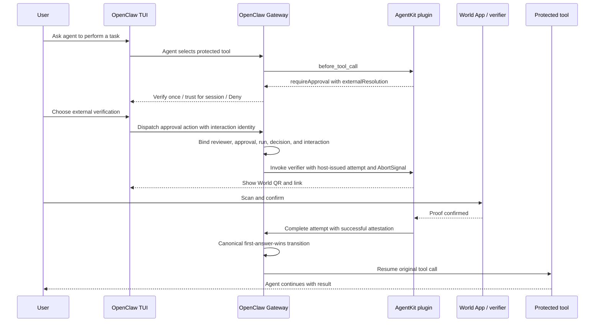

# Proposal: Plugin-Owned External Verification for Approval Resolution

## Summary

Allow a plugin to require one external verification ceremony before a pending
plugin approval can allow a protected action. OpenClaw stores the pending
record, renders the prompt, handles denial and expiry, commits the first
terminal decision, and resumes the blocked action. The plugin owns the verifier
and attests only to the result of its ceremony. A host-bound SDK helper captures
the plugin identity, binds the attempt to the originating run and user
interaction, propagates cancellation, validates ownership and the offered
decision, records verification lifecycle events, and applies a successful allow
through OpenClaw's approval ledger. The proposal does not add arbitrary
plugin-defined approval actions or verifier-specific code to core.

## Motivation

Some plugins need a user to complete an external ceremony that OpenClaw should
not implement: a World proof, hardware-key confirmation, or an enterprise
approval broker. The ceremony may require a QR code, browser handoff, device
interaction, polling, or a signed callback.

The first user is the external AgentKit plugin:

- https://github.com/Guardiola31337/openclaw-agentkit
- https://clawhub.ai/guardiola31337/plugins/agentkit

AgentKit protects configured tools with World-backed human verification. It
belongs in ClawHub, but it needs a narrow host seam so the user sees one coherent
OpenClaw approval flow: OpenClaw creates the approval, the user chooses external
verification or denial, AgentKit validates the proof, and OpenClaw resumes the
original tool call after a successful plugin attestation.

## Goals

- Keep one canonical OpenClaw approval record and terminal transition.
- Preserve `before_tool_call.requireApproval` as the plugin-facing gate.
- Let one plugin attach one structured external verification route to an
  approval it owns.
- Derive plugin identity from host registration, never from request payloads.
- Bind each approval and attempt to the originating run and each dispatch to a
  stable host-derived interaction identity.
- Make denial, cancellation, and expiry authoritative over late proof results.
- Stop verifier work and challenge presentation when an attempt becomes
  terminal.
- Reuse OpenClaw's canonical allow decisions and default external verification
  to `allow-once`.
- Record verification attempts without storing proof payloads or private user
  identifiers.
- Work through text commands without requiring generic plugin-defined buttons.
- Provide AgentKit as a real reference implementation and proof path.

## Non-Goals

- Adding World, AgentKit, or verifier-specific logic to OpenClaw core.
- Adding arbitrary plugin-defined action arrays or callback payloads.
- Letting a plugin resolve another plugin's approval or a core exec approval.
- Composing multiple external verifier plugins on one approval in v1.
- Supporting verification ceremonies that outlive the approval deadline.
- Letting auto review satisfy an external proof requirement.
- Defining plugin-specific grant duration or persistence policy in core.

## Proposal

### Ownership boundary

OpenClaw owns:

- approval creation, identity, and immutable request context
- the durable pending and terminal record
- approval routing and canonical presentation
- normal denial, cancellation, and expiry
- the first terminal decision through the canonical approval ledger
- resuming or blocking the original tool call
- verification attempt audit events
- run-bound cancellation and replay-safe interaction dispatch

The plugin owns:

- verifier configuration and secrets
- challenge, QR, link, polling, or callback behavior
- proof validation
- user-facing verifier progress
- plugin-scoped grants for future plugin hook calls

OpenClaw does not verify the third-party proof. It accepts an attestation from an
installed plugin that is already trusted to execute in process. Ownership checks
prevent one plugin from resolving another plugin's approval; they do not make a
malicious installed plugin honest.

### Approval state and decision composition

Every required gate must allow the action, and any denial wins:

1. Host policy and earlier hooks must permit the request to reach this approval.
2. The approval must still be pending.
3. A user may deny through the normal OpenClaw path at any time.
4. Choosing an external route starts verification; it is not itself an allow.
5. The owning plugin may attest success only for the pending approval and the
   external allow decision the user selected.
6. OpenClaw commits that allow through the same canonical first-answer-wins
   transition used by other approval surfaces.

The resulting state rules are:

| Current state | Event | Result |
| --- | --- | --- |
| Pending | Normal OpenClaw deny | Denied; tool remains blocked |
| Pending | Approval timeout | Expired; tool remains blocked |
| Pending | Originating run cancellation | Approval and active attempt are cancelled; tool remains blocked |
| Pending | External attempt starts | Remains pending; attempt is recorded |
| Pending | External attempt fails or is superseded by retry | Remains pending; user may retry or deny |
| Pending | Owning plugin attests success | Canonical ledger attempts the offered allow |
| Any terminal state | Any later event or proof | No state change |

Any deny, cancellation, expiry, or competing terminal decision therefore wins
over a late proof callback. A failed verification attempt does not silently
allow or automatically deny; it remains auditable while the approval stays
pending until the user retries, denies, or the host deadline is reached.

External-verification approvals are valid only when the private hook path has a
non-empty host-derived `runId`. The plugin cannot supply or override it. The
Gateway creates and indexes the approval under the same run-lifecycle
serialization used for cancellation. If abort commits before approval creation,
creation fails because the run is no longer active. If creation commits first,
the abort observes and cancels it. Run cancellation and external completion are
serialized against that same approval/attempt state: if cancellation commits
first, the attempt is cancelled and a later proof cannot allow or authorize a
grant; if the allow commits first while the run is active, normal run-abort
semantics apply afterward. Aborting one run does not cancel a different run's
approval, even in the same session.

Current OpenClaw hook composition selects one `requireApproval` owner. V1 follows
that model and permits exactly one `externalResolution` owner per approval.
Multi-plugin verifier composition requires a separate design.

### Plugin request contract

The public entry point remains `before_tool_call.requireApproval`:

```ts
api.on("before_tool_call", async (event) => {
  if (event.toolName !== "exec") {
    return;
  }

  return {
    requireApproval: {
      title: "World proof required for exec",
      description: "Verify with World before exec runs in this session.",
      severity: "warning",
      timeoutMs: 600_000,
      allowedDecisions: ["deny"],
      externalResolution: {
        label: "Verify with World",
        decisions: ["allow-once", "allow-always"],
      },
    },
  };
});
```

The generic shape is:

```ts
type PluginApprovalExternalResolution = {
  label: string;
  decisions?: ApprovalAllowDecision[]; // defaults to ["allow-once"]
};
```

Rules:

- Core stamps the approval owner from the registered hook. `pluginId` is not an
  input to the hook result or external-resolution request.
- Core stamps a non-empty `runId` from the active tool run. A plugin cannot
  supply it, and core fails closed if the private hook path cannot provide it.
- Core creates an external-verification approval through an in-process/private
  host service that preserves that stamped owner. The existing public
  caller-identified `plugin.approval.request` path must reject
  `externalResolution`.
- `externalResolution` contains one label and a non-empty subset of the host's
  canonical allow decisions.
- An omitted `decisions` field defaults to `["allow-once"]`.
- `deny` is never part of `externalResolution`; core always owns the normal deny
  path.
- When `externalResolution` is present, core normalizes an omitted
  `allowedDecisions` to `["deny"]` and rejects any allow decision in that field.
  External allow decisions and generic allow decisions cannot overlap.
- The owning plugin's external-resolution helper is the only allow path for
  these approvals.
- Core renders a canonical external-approval command for text clients and routes
  it through the approval control lane. Plugins do not define command syntax or
  callback payloads.

This lets a plugin expose verification without letting it redefine the approval
UI or bypass the normal deny path.

### Canonical decision vocabulary

External verification reuses the allow-style subset of the canonical approval
enum in the target OpenClaw version. It does not introduce verifier-specific
aliases.

The relevant meanings are:

| Decision | Meaning |
| --- | --- |
| `allow-once` | Allow only the current pending action |
| `allow-session` | Allow the current action and use the host's session semantics, when supported by the canonical enum |
| `allow-always` | Allow the current action and expose the existing reusable decision to the owning plugin |

At the time of this RFC, generic plugin approvals on OpenClaw `main` expose
`allow-once` and `allow-always`, not `allow-session`. The implementation PR must
reuse the canonical enum on its target `main`; this RFC does not add a parallel
decision enum. If that enum exposes `allow-session`, plugins offering session
trust should use it. Otherwise a plugin may map `allow-always` to a narrower
plugin-owned session grant, but it must label and document that behavior and may
not turn it into global host permission.

The host validates the selected decision against both its active canonical enum
and the approval's `externalResolution.decisions`.

### Host-bound external verification API

The plugin registers one verifier handler through an SDK surface bound to the
plugin registration rather than a general Gateway client:

```ts
api.approvals.onExternalVerification(async (attempt) => {
  const challenge = await createExternalChallenge(attempt.context, {
    signal: attempt.signal,
  });
  await attempt.present({ message: renderChallenge(challenge) });
  void monitorExternalVerification(attempt, challenge);
});

async function monitorExternalVerification(attempt, challenge) {
  let proof: { ok: boolean };
  try {
    proof = await waitForExternalProof(challenge, {
      signal: attempt.signal,
    });
  } catch {
    if (attempt.signal.aborted) {
      return;
    }
    proof = { ok: false };
  }
  const completion = await api.approvals.completeExternalVerification({
    attemptId: attempt.id,
    outcome: proof.ok ? "succeeded" : "failed",
  });

  if (proof.ok) {
    const decision = attempt.context.decision;
    if (
      completion.approval.status === "allowed" &&
      completion.approval.decision === decision &&
      completion.grantAuthorization
    ) {
      await upsertPluginGrant(
        completion.grantAuthorization,
        completion.approval,
      );
    }
  }
}
```

The exact method names may change during implementation, but the authority and
state contract are normative:

- `api.approvals` is a plugin-scoped facade created with the registered plugin
  record; it is not part of the process-global `api.runtime` object. The helper
  captures the plugin id from that registration closure.
- The verifier handler is invoked only by OpenClaw's canonical approval control
  dispatcher, never by `before_tool_call` or an ordinary queued plugin command.
- The dispatcher authenticates the reviewer, resolves the exact pending approval
  and selected external decision, and checks ownership and expiry before invoking
  the plugin.
- The dispatcher derives a stable `interactionId` from its authenticated action
  envelope, scoped to the approval and decision. For text commands it includes
  the channel, account, conversation, message identity, and parsed command
  occurrence. For native clients, core issues one identity per canonical action
  generation and reuses it across delivery routes, clients, and transport
  retries. The plugin cannot supply or override it.
- A single-use internal dispatch capability binds the registered plugin
  instance, approval id, run id, selected decision, interaction id, and, for a
  retry generation, the expected active attempt id. Core consumes it while
  creating or finding the attempt. The plugin never receives it as
  caller-editable authority.
- Replaying the same scoped interaction id returns the existing attempt or its
  recorded terminal result and cannot invoke the handler again. Core retains
  this mapping for the approval lifetime.
- A native action carries host-issued `start` or `retry` intent. Core issues a
  `start` generation while no attempt is active and a distinct `retry`
  generation while an attempt is active. Only selecting that `retry` generation
  while its expected attempt is still active cancels that attempt and creates a
  fresh one. Core validates and replaces under one serialized transition. If the
  expected attempt is no longer active, core records a stale-action result and
  returns the current presentation without invoking the plugin or cancelling the
  newer attempt. A double click, second-client click, or transport redelivery
  reuses its existing identity and cannot become a retry accidentally.
- After a non-successful attempt leaves the approval pending, core issues a fresh
  `start` generation. For text commands, redelivery of one message is a replay;
  a newly sent command is explicit user retry intent and receives a new
  interaction id.
- Core issues the attempt id and passes the immutable attempt context to the
  owning plugin's registered handler.
- The attempt exposes an `AbortSignal`. Core aborts it exactly once when the
  attempt is replaced, denied, expired, cancelled with its run, closed by a
  competing resolution, or terminated during graceful Gateway shutdown.
- The attempt exposes a presentation sink bound to the approval action's delivery
  route. It accepts bounded Markdown text only: no actions, callback payloads, or
  caller-selected targets. It remains valid only while the attempt is active;
  after cancellation or another terminal transition it rejects further output
  as attempt-closed. The plugin uses it to publish the verifier challenge before
  returning from the control action.
- The handler starts any longer polling or callback work in plugin-owned runtime
  and returns after publishing the challenge. That work must observe the signal
  and release timers, polling, and subscriptions when aborted. The approval
  remains pending; the approval control lane is not held open for the external
  ceremony.
- Completion accepts only that attempt id and outcome. The host derives the
  plugin, approval, and decision from the registered facade and stored attempt,
  then rechecks ownership, pending state, and expiry.
- A successful completion records the end event and attempts the allow through
  the canonical approval ledger atomically.
- A non-successful completion records the end event without allowing the
  operation.
- A terminal approval transition closes any active attempt. Replaying a
  completion returns the recorded result and cannot reopen terminal state.

If an ingress cannot provide a stable authenticated interaction identity, it
cannot dispatch external verification in v1 and fails closed. Redelivery of one
text message retains its message identity; sending the command again receives a
new identity and is a retry. A callback that cannot be stopped after abort may
still reach the plugin, but completion returns the recorded terminal result and
cannot emit presentation, allow the action, or authorize a grant.
The interaction identity belongs only to the external control dispatch; this RFC
does not add it to ordinary `approval.resolve` calls.

Completion returns the canonical result rather than a transport-only success:

```ts
type ExternalVerificationCompletionResult = {
  applied: boolean;
  approval: ApprovalSnapshot;
  attempt: ExternalVerificationAttemptSnapshot;
  grantAuthorization?: {
    id: string;
    issuedAtMs: number;
    approvalId: string;
    attemptId: string;
    decision: ApprovalAllowDecision;
  };
};
```

`applied` is true only when this plugin's matching allow decision won the
first-answer transition during that invocation; a replay returns `applied:
false`. When the matching plugin, attempt, and reusable decision are the
canonical winner, the host also returns the same stable `grantAuthorization` on
the first response and later replay/recovery reads. A late callback that loses
to denial, expiry, cancellation, or another decision receives no grant
authorization and cannot authorize a future grant.

The plugin upserts a reusable grant by `grantAuthorization.id`. Its grant time
is anchored to `issuedAtMs`, not the retry time, and replay must not extend its
expiry. Session grants also bind to the immutable session lifecycle identity in
the approval context. Revoked, expired, consumed, or reset-session grant ids must
remain non-reissuable through a tombstone or equivalent plugin-owned state.

In v1, `api.approvals` calls an in-process host approval service. It is available
only through the API object created for a registered native plugin and does not
cross a public Gateway RPC. `operator.approvals` authorizes operator devices and
approval runtimes; it does not authenticate plugin identity and is therefore not
enough to call this service. External callbacks return through the owning
plugin's registered route or service, which then completes its stored attempt in
process. A future out-of-process plugin runtime would need a separate host-issued,
plugin-bound principal and is outside this RFC.

External plugins must not need `operator.admin`, and an arbitrary
approval-scoped Gateway caller cannot access the plugin-bound service.

The typed selector and text fallback both enter the same approval control lane,
which remains available while the originating agent run is blocked. Text
fallback does not embed a secret token: the canonical approval command dispatcher
authenticates the actor and creates the internal single-use dispatch capability.
The attempt presentation is delivered back through that same approval route, so
the QR or link does not queue behind the blocked run. Completion requires the
plugin-bound facade and host-issued attempt id, but not a second operator
interaction.

This is an external attestation, not core proof verification. An implementation
may call the operation `resolveExternal` or `completeExternalVerification`; it
should avoid implying that OpenClaw independently validated the third-party
proof.

### Attempt lifecycle and audit

Verification attempts are append-only audit events associated with the canonical
approval record. Each attempt records:

- approval id and host-derived plugin id
- host-derived run id and an opaque scoped interaction id, not the raw callback
  or message payload
- host-issued attempt id
- selected decision
- verifier label
- start and end timestamps
- outcome: `succeeded`, `failed`, `cancelled`, or `timed-out`
- sanitized error class when useful
- terminal resolution source and resolver plugin id when success wins

Retries create distinct attempts. At most one attempt is active for an approval
at a time; starting a retry first ends the previous active attempt as cancelled.
The approval owner service serializes attempt creation, completion, and
cancellation. When the approval becomes terminal, the same transition atomically
closes any active attempt: denial or competing resolution cancels it, expiry
times it out, and run or graceful-shutdown cancellation cancels it. Before
releasing that transition, core aborts the attempt signal and invalidates its
presentation sink; it publishes lifecycle events only from committed state. A
later callback receives that recorded result and cannot mutate either the
attempt or approval.

An unexpected process exit cannot notify an in-memory `AbortSignal`. During
startup, core therefore reconciles any orphaned external approval and attempt to
the durable `gateway-restart` cancellation state before accepting approval
dispatch or completion. Late callbacks then receive the recorded terminal result
and cannot resume work or authorize a grant. Graceful shutdown and startup
recovery are separate test cases.

Core does not store proof payloads, nullifiers, wallet identifiers, verifier
secrets, broker credentials, or verifier-specific personal data. A plugin may
keep verifier diagnostics in plugin-owned storage subject to its own privacy
contract.

### Approval context binding

The host returns an immutable approval snapshot when an attempt starts. It
contains the context needed to prevent proof substitution:

- approval id and plugin id
- host-issued attempt id
- originating run id
- tool name and tool call id when available
- agent id and session key when available
- session lifecycle identity when available
- selected decision
- approval expiry

The plugin must bind its challenge to that snapshot and must not reuse a proof
created for a different approval, attempt, run, tool call, decision, or expired
request. In particular, proof from a cancelled attempt cannot satisfy a retry.
Core keeps interaction identity private; the plugin binds proof to the resulting
host-issued attempt. Core cannot validate a verifier-specific signature, but it
rechecks the canonical approval id, owner, run, decision, active attempt, and
expiry before accepting the plugin's attestation.

### Rendering and compatibility

Core projects the external route into the canonical approval presentation:

```text
Verify with World
Verify once: /approve plugin:<id> external allow-once
Verify and trust for session: /approve plugin:<id> external allow-always

Deny: /approve plugin:<id> deny
```

Clients that understand `externalResolution` may render a local selector with
Verify once, Verify and trust for session, and Deny. They do not execute an
arbitrary plugin callback; the selected external option dispatches a typed
canonical approval action through the out-of-band approval control lane.
That action carries a core-issued interaction identity and `start` or `retry`
intent. Core issues action generations; clients do not invent retry identity or
intent.

Compatibility has two separate gates:

1. **Host capability.** A plugin that requires this contract declares the
   minimum OpenClaw version or checks a named host capability before registering
   the protected hook. On an unsupported host it fails during plugin load or
   configuration rather than registering a deny-only approval.
2. **Client presentation.** A plugin cannot know every client or channel that may
   later receive an approval. The supporting host therefore includes its
   canonical external-approval command in fallback text. Older clients may show
   that text plus Deny, or Deny only if they cannot display the new projection.
   Approval commands must use the same out-of-band control dispatch as native
   approval callbacks so they cannot queue behind the blocked run. Clients that
   cannot provide that route fail closed.

Rich selector support is a client enhancement, not a correctness requirement.
No channel must implement generic plugin-defined actions.

### Interaction with auto review

The plugin sets `externalResolution` when it creates the approval. Auto review
does not add, remove, or satisfy that requirement, so this RFC requires no
change to auto-review policy.

Auto review may classify risk, deny, or escalate through its existing contract.
It may not issue the plugin's external allow or fabricate a successful attempt.
If auto review or any other authorized surface records a terminal denial first,
the canonical ledger rejects a later external success.

### Plugin-owned future grants

An external allow resolves the current approval. Future calls are skipped only
when the owning plugin separately implements a documented grant.

Such a grant must:

- be created only after a successful external allow decision that permits reuse
- include the actual tool and the configured session, agent, or narrower scope
- have a documented expiry or lifecycle boundary
- remain owned by the plugin
- be persisted through supported plugin storage APIs
- make later skips visible in logs or status output
- never bypass host exec policy or resolve an already pending core approval

For AgentKit, Verify and trust for session creates a grant keyed by the pending
approval snapshot, including the protected tool name and session. If that
context cannot be recovered, AgentKit must not persist the grant.

## AgentKit Reference Flow



The same contract supports a hardware-key plugin or a bounded enterprise broker
that completes within the OpenClaw approval deadline. Long-running ticket or
manager workflows that may take hours require a separate durable workflow
design; v1 does not claim to support them.

## Security Properties

- Host-derived identity prevents a caller from claiming another plugin id.
- External-verification approvals can be created only by the private
  host-stamped hook path; the public caller-identified request path rejects the
  field.
- The SDK helper can affect only pending approvals owned by that plugin.
- Starting also requires an operator dispatch authorized for that approval;
  plugin identity alone cannot start or replace an attempt.
- The dispatch capability is single-use and binds the exact approval and decision
  selected by the operator, the originating run, and a stable scoped interaction
  identity. A retry generation also binds the expected active attempt.
- Re-delivery of one interaction is idempotent. Replacing an active attempt
  requires either a newly submitted authenticated text command or a core-issued
  native retry generation.
- External choices use the approval control lane and cannot deadlock behind the
  blocked agent run.
- Challenge presentation is text-only, dispatch-bound, and cannot redirect output
  to a plugin-selected target.
- Attempt cancellation aborts plugin work and permanently closes its presentation
  sink, preventing stale progress or challenge output.
- The selected decision must have been offered for external resolution.
- The plugin cannot use the external helper for `deny` or for core exec
  approvals.
- Generic allow decisions are unavailable whenever external verification is
  required.
- All successful allows use the canonical approval ledger and first-answer-wins
  transition.
- A late proof cannot override denial, cancellation, expiry, or another terminal
  decision.
- Run cancellation and completion are serialized; proof cannot allow or create a
  reusable grant after its originating run has been cancelled.
- Approval creation shares that run-lifecycle serialization, so an abort cannot
  miss an approval created by an in-flight hook.
- Reusable grants require the stable authorization of the winning attempt and
  replay cannot recreate or extend expired, revoked, or reset-session trust.
- The verifier challenge is bound to the immutable approval context.
- A verifier challenge is bound to the attempt id, so proof from an earlier
  cancelled attempt cannot satisfy a retry.
- Proof data stays outside core.
- Unsupported hosts do not register the protected hook; unsupported clients fail
  closed.
- Installed-plugin trust is explicit: the host validates ownership and state,
  not the truth of a third-party proof.

## Validation and Acceptance Criteria

RFC acceptance establishes the contract. Runtime proof is required for the
implementation PR and reference plugin release; an RFC document alone cannot
prove behavior that is not yet present on OpenClaw `main`.

### Host contract tests

The OpenClaw implementation must prove:

- hook results cannot supply or override the owner plugin id
- the private creation path preserves the stamped owner and the public
  `plugin.approval.request` path rejects `externalResolution`
- approval creation and run cancellation cover both commit orders: creation
  rejects after an earlier abort, while a later abort observes and cancels the
  created approval
- omitted external decisions default to `["allow-once"]`
- only canonical allow decisions can be offered externally
- external approvals normalize generic decisions to `["deny"]` and reject any
  generic/external allow overlap
- normal Deny remains available and terminal
- the approval control dispatcher authenticates the reviewer and binds the exact
  approval, plugin, originating run, selected decision, and stable scoped
  interaction id before invoking the verifier
- wrong-target, wrong-run, and wrong-decision substitution fail
- redelivery with the same interaction id returns the existing attempt without
  invoking the handler again, while replacement requires a newly submitted text
  command or core-issued native retry generation
- native actions and text commands preserve the same interaction identity on
  transport redelivery, and an ingress without a stable identity fails closed
- stale native actions, double clicks, and concurrent clicks from another client
  cannot replace an active attempt; selecting a core-issued retry generation can
  replace only the expected active attempt in the same serialized transition
- non-approvers and background plugin calls cannot start or replace an attempt
- `api.approvals` is available only through the registered plugin's in-process
  API and arbitrary `operator.approvals` callers cannot claim plugin identity
- typed selectors and text-channel fallback can dispatch while the originating
  agent run is blocked
- the verifier challenge is delivered to the action's approval surface before
  the control action returns, while the approval remains pending
- normal generic allow cannot bypass an external-only decision
- success is committed through the canonical ledger
- deny, expiry, run cancellation, graceful shutdown, startup recovery, and
  competing resolution win races against late success when their transition
  commits first
- cancellation of run A closes only run A's approval and attempt when runs A and
  B have pending approvals in the same session
- completion-versus-run-abort race tests cover both commit orders and prove that
  a proof cannot authorize a grant after run cancellation wins
- retries create separate audit attempts and replay is idempotent
- retry, denial, expiry, run cancellation, graceful shutdown, and competing
  resolution abort the attempt signal exactly once and reject later presentation
- startup recovery cancels orphaned durable approval/attempt state before serving
  dispatch or completion, without claiming to signal work from the dead process
- completion returns the canonical winner and a late success cannot create a
  reusable grant
- grant persistence is idempotent by the stable authorization id, keeps the
  original grant timestamp, and cannot recreate trust after expiry, revocation,
  consumption, or session reset
- proof payloads are not persisted in core
- unsupported hosts reject plugin registration explicitly
- canonical text rendering remains usable without custom client actions

### AgentKit automated proof

AgentKit must run against an OpenClaw checkout containing the implementation and
prove:

1. Deny blocks the protected tool.
2. Verify once shows the World route and resumes exactly one protected action
   after proof.
3. Verify and trust for session resumes the action and creates only the intended
   session/tool grant.
4. A later matching action uses the grant without another AgentKit prompt.
5. A different session, tool, expired grant, or unknown tool does not reuse it.
6. Multiple pending approvals remain isolated by approval id.
7. Failed verification can retry without allowing the action.
8. A proof callback arriving after denial or expiry cannot resume the tool.
9. Proof generated for attempt A is rejected if presented to retry attempt B.
10. Replaying a successful completion does not duplicate, extend, or recreate a
   reusable grant.
11. Aborting the originating run stops verifier polling, closes challenge
    presentation, and prevents a late callback from allowing or creating a
    grant.
12. Redelivery of one approval action reuses its attempt; a newly submitted retry
    cancels that attempt and starts one new attempt.
13. Abort-before-creation rejects the approval, while create-before-abort cancels
    it; concurrent runs in one session remain isolated.
14. Native double clicks, stale actions, and second-client clicks are replays;
    only a core-issued retry generation bound to the current active attempt can
    replace it. An unused retry for attempt A cannot replace later attempt B.
15. Graceful shutdown aborts live plugin work, while crash/startup recovery
    cancels orphaned durable state before accepting a late callback.

The plugin should retain fast mocked tests, a real local Gateway integration
test, and a manual TUI runner.

### User-perspective artifact

Before the implementation lands, attach a redacted terminal capture or short
recording showing:

- a protected tool prompt
- Verify once, Verify and trust for session, and Deny
- the World QR/link
- successful continuation after a scan
- session grant reuse
- a separate denial that leaves the tool blocked

The artifact belongs on the RFC or implementation discussion, not in the
OpenClaw source tree.

## Implementation Plan

### Phase 1: RFC agreement

Agree on the ownership boundary, canonical-ledger integration, decision
semantics, capability gate, and audit lifecycle described here.

### Phase 2: Minimal OpenClaw host API

Implement:

- `requireApproval.externalResolution`
- host-derived approval ownership and originating-run binding
- run-lifecycle serialization for approval creation and cancellation
- a private host-stamped creation path that rejects this field on the existing
  public caller-identified request method
- the `allow-once` default and canonical decision validation
- canonical text presentation, an out-of-band approval control action with a
  stable interaction identity and explicit retry intent, plus optional richer
  client projection
- host capability/version gating
- a plugin-bound verifier handler and completion helper
- an attempt cancellation signal and a dispatch-bound, text-only verifier
  presentation sink that closes with the attempt
- an in-process-only v1 service boundary for those helpers
- canonical-ledger resolution and plugin resolver attribution
- append-only attempt audit events
- focused Gateway, SDK, TUI, Control UI, and channel fallback tests

Do not add arbitrary actions, verifier-specific fields, or bundled AgentKit code.

### Phase 3: AgentKit update and release

Update AgentKit to use the accepted SDK helpers, supported plugin storage, and
the final host capability. Run the automated and manual proof matrix, publish the
plugin to ClawHub, and link the evidence from the implementation PR.

## Rationale

### Bundle AgentKit in core

Rejected. The verifier, World configuration, proof lifecycle, and grant policy
are plugin concerns. Core needs only the generic approval boundary.

### Expose arbitrary plugin approval actions

Rejected. That would require every Gateway client and channel to understand
plugin-defined controls and callback payloads. One external route plus command
text satisfies the use case with a much smaller compatibility surface.

### Put the verifier command only in the description

Rejected. Prose alone cannot validate which allow decisions were offered,
identify external-verification approvals, or support consistent presentation
without text scraping.

### Let plugins call the normal resolver

Rejected. A general approval-scoped caller has no plugin identity, and a normal
allow is indistinguishable from a plugin attestation. The bound helper provides
ownership, audit attribution, and external-decision validation while still using
the same canonical terminal transition internally.

### Let auto review satisfy external verification

Rejected. Auto review can assess risk but cannot complete a plugin-owned proof
ceremony. It may deny or escalate, but only the owning plugin may attest external
success.

## Unresolved Questions

Two implementation details remain intentionally open without changing the
security or state contract:

1. Will `allow-session` be part of the canonical plugin approval enum before the
   implementation lands? If yes, external verification uses it directly. If
   not, AgentKit keeps the documented `allow-always` to session-grant mapping.
2. What final SDK method names and host capability key best fit the approval
   runtime after the current approval overhaul? They must preserve the
   host-bound identity and lifecycle semantics above.

## References

- Original in-core AgentKit prototype:
  https://github.com/openclaw/openclaw/pull/78583
- Reverted broad custom-action PR:
  https://github.com/openclaw/openclaw/pull/82431
- Revert of the broad custom-action PR:
  https://github.com/openclaw/openclaw/pull/87419
- Earlier external verification host API PR:
  https://github.com/openclaw/openclaw/pull/82434
- AgentKit ClawHub plugin:
  https://github.com/Guardiola31337/openclaw-agentkit
- ClawHub package:
  https://clawhub.ai/guardiola31337/plugins/agentkit
- Approval prompt Markdown RFC:
  https://github.com/openclaw/rfcs/pull/4
