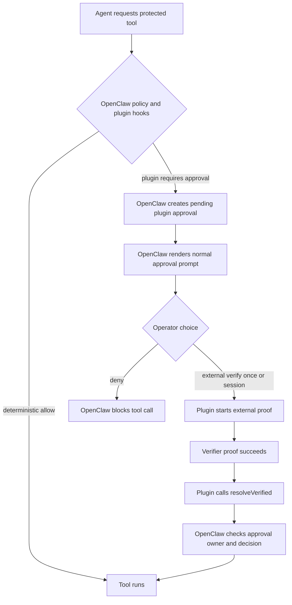
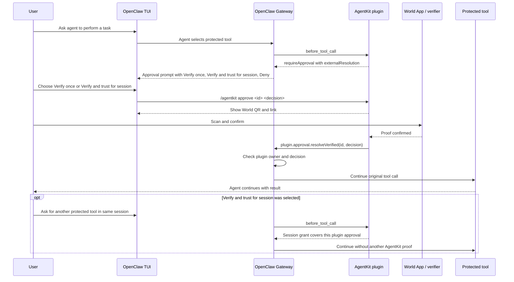

# Proposal: Plugin-Owned External Verification for Approval Resolution

## Summary

Allow external plugins to add one narrow external verification step to OpenClaw
approval prompts while core remains the approval owner for pending state,
routing, denial, timeout, cancellation, and final tool continuation. A plugin
may expose a structured verification command such as "Verify with World" and may
resolve only its own pending approval after external proof succeeds, without
adding arbitrary plugin-defined approval actions or verifier-specific code to
OpenClaw core.

## Motivation

Some plugins need to gate a tool call on an *external* verification ceremony
that OpenClaw core should not own: a World ID proof, a hardware-key tap, a
compliance broker, or a plugin-specific risk workflow.

The concrete first user is the ClawHub AgentKit plugin:

- https://github.com/Guardiola31337/openclaw-agentkit
- https://clawhub.ai/plugins/@guardiola31337/agentkit

AgentKit protects configured OpenClaw tools with World-backed human
verification. It should live outside core (the policy, verifier, and proof
lifecycle are not generic OpenClaw behavior) but it needs a small host seam so
the end user still gets a coherent OpenClaw HITL flow: core creates the pending
approval, the user picks verify or deny, the plugin runs the proof, and core
continues the blocked tool call once the plugin reports success.

This RFC proposes that seam: one external-verification route on a plugin
approval plus an ownership-checked resolver. It deliberately avoids the two
shapes maintainers have already rejected (bundling the verifier in core, and
exposing arbitrary plugin-defined approval actions) both covered in
[Rationale and Alternatives](#rationale-and-alternatives).

## Goals

- Keep OpenClaw core as the owner of pending approval state, normal denial,
  timeout behavior, cancellation, routing, and final tool continuation.
- Let a plugin request one structured external verification route for a pending
  approval.
- Let a plugin resolve only approvals that originated from that same plugin and
  only with decisions that were explicitly exposed for external verification.
- Preserve the existing `before_tool_call.requireApproval` gate as the public
  plugin entry point.
- Keep approval clients simple. They may render the external verification route
  as command text, and they do not need generic plugin-defined buttons.
- Compose cleanly with auto review by making external proof a distinct decision
  source, not an auto-review bypass.
- Provide a real ClawHub reference implementation through AgentKit so future
  plugin authors can copy the pattern.
- Make the proposal narrow enough to review and land independently of any
  richer approval-presentation follow-up.

## Non-Goals

- Adding World ID, AgentKit, or any other verifier to OpenClaw core.
- Reintroducing arbitrary plugin approval action arrays.
- Giving plugins generic control over approval prompt rendering.
- Letting plugins resolve approvals created by other plugins or by core exec
  approval flows.
- Letting auto review approve an external-proof-required approval without the
  external proof.
- Changing default OpenClaw safety behavior. This proposal is additive and only
  applies when a plugin explicitly requests external verification.

## Proposal

### Approval ownership model

The model has four decision sources, each with a different owner:

| Decision source | Owner | Purpose |
| --- | --- | --- |
| Deterministic policy | OpenClaw core and host policy | Fast allow or deny for known command/tool policy |
| Auto review | OpenClaw approval system | Optional low-risk exec approval review |
| Human operator | OpenClaw approval system | Manual allow or deny through TUI, Control UI, or channels |
| External verifier | Plugin | Proof ceremony that OpenClaw should not own |

External verification is an additional approval route for plugin-owned
approvals. It is not a replacement for host policy. It is not a new universal
approval UI system.



### Decision composition

Approval resolution is deny-wins and composes with strict AND semantics across
the approval path. A protected tool may continue only when every required owner
has either allowed the request or stayed out of the path:

1. core policy must not deny the tool call
2. auto review must not deny the tool call, when auto review participates
3. the human operator must not deny the pending approval
4. the external verifier must succeed, when the approval requested
   `externalResolution`
5. the pending approval must still be pending, not cancelled, expired, timed
   out, or already resolved differently

Any denial, timeout, cancellation, policy block, or failed proof is terminal for
that approval. A later external proof success must not override an earlier deny
or expired approval. `plugin.approval.resolveVerified` therefore checks the
current approval state at resolution time rather than treating proof success as
authority by itself.

### Plugin entry points

The plugin-facing API remains the existing `before_tool_call` hook with
`requireApproval`.

```ts
api.on("before_tool_call", async (_event, ctx) => {
  if (ctx.toolName !== "exec") {
    return;
  }

  return {
    requireApproval: {
      title: "World proof required for exec",
      description:
        "Verify with World before `exec` runs in this session. Use the verification commands below.",
      severity: "warning",
      timeoutMs: 600_000,
      allowedDecisions: ["deny"],
      externalResolution: {
        label: "Verify with World",
        commandTemplate: "/agentkit approve {id} {decision}",
        decisions: ["allow-once", "allow-always"],
      },
    },
  };
});
```

The important split is:

- The approval owner plugin id is derived from the plugin hook/runtime context.
  It is not caller-provided in the approval request payload, command payload, or
  verified resolver payload.
- `allowedDecisions` remains core-owned and controls normal OpenClaw approval
  decisions.
- `externalResolution` describes a single plugin-owned verification route.
- When `externalResolution` is present, normal `allow-once` and `allow-always`
  must not be accepted through the generic core resolver unless they are also
  part of the core-owned `allowedDecisions`.
- The external route may expose only the allow-style subset of OpenClaw's
  existing approval decision enum. In the current implementation that is
  `allow-once` and `allow-always`; if the active approval API exposes a
  session-scoped decision such as `allow-session`, the session trust option must
  use that existing decision rather than introducing a verifier-specific alias.
- Core keeps `deny` as the normal rejection path.

The external route is deliberately a command template, not arbitrary actions:

```ts
type PluginApprovalExternalResolutionTemplate = {
  label: string;
  commandTemplate: string; // must include {id} and {decision}
  // Defaults to ["allow-once"] when omitted.
  decisions?: Array<"allow-once" | "allow-always" | "allow-session">;
};
```

`allow-session` is valid only when it is part of the host's active approval
decision enum. The implementation should expose one canonical reusable/session
trust decision, not both `allow-always` and `allow-session` as competing labels.

Approval surfaces can render this as text:

```text
Verify with World:
/agentkit approve plugin:<approval-id> allow-once
/agentkit approve plugin:<approval-id> allow-always

Deny:
/approve plugin:<approval-id> deny
```

Native clients may improve presentation later, but this RFC does not require
them to add a plugin-defined button contract.

### General plugin contract

This proposal is not AgentKit-specific. Any plugin can rely on the same
architecture if it can express its approval ceremony as:

1. a `before_tool_call` or plugin-owned operation that needs approval
2. one external verification route
3. one or more allow-style external decisions
4. a plugin command, CLI command, or session action that runs the proof ceremony
5. a verified resolver call after proof succeeds

The host contract is:

```ts
return {
  requireApproval: {
    title: "<short approval title>",
    description: "<bounded human-readable reason>",
    severity: "info" | "warning" | "critical",
    allowedDecisions: ["deny"],
    externalResolution: {
      label: "<verification name>",
      commandTemplate: "/<plugin-command> approve {id} {decision}",
      decisions: ["allow-once", "allow-always"],
    },
  },
};
```

The plugin owns everything behind that command template. OpenClaw does not need
to know whether the proof is World ID, a hardware key, an enterprise approval
broker, a ticketing workflow, or a risk-scoring system.

Examples:

| Plugin type | External route | Plugin-owned proof |
| --- | --- | --- |
| AgentKit identity plugin | `Verify with World` | World App QR/link and verifier callback |
| Hardware-key plugin | `Confirm with security key` | WebAuthn or local hardware-key ceremony |
| Enterprise approval plugin | `Request manager approval` | Company approval broker or policy service |
| Ticket approval plugin | `Approve in ticket` | Jira/Linear/GitHub issue state transition |
| Risk-scoring plugin | `Run risk review` | Remote risk workflow before the operation continues |

This is intentionally restrictive at the host layer. The extensibility point is
the plugin command and proof workflow, not arbitrary OpenClaw-rendered UI. That
keeps the core contract stable while letting plugins build domain-specific
verification flows outside core.

### Verified resolver

After the external proof succeeds, the plugin calls a dedicated resolver:

```ts
await resolveVerifiedPluginApprovalOverGateway({
  approvalId,
  decision: "allow-once",
});
```

The Gateway method is conceptually:

```text
plugin.approval.resolveVerified
```

Required checks:

1. The caller has the required operator approval runtime authority.
2. The approval exists and is still pending.
3. The approval has a `pluginId`.
4. The caller's plugin identity matches the pending approval's `pluginId`.
5. The approval has `externalResolution`.
6. The requested decision is one of the decisions exposed by that
   `externalResolution`.
7. The requested decision is an allow-style decision, not `deny`.

This gives maintainers the actual security boundary they asked for:

> plugin X may resolve pending approval Y only if Y belongs to plugin X and Y
> explicitly offered that external verification decision.

The plugin identity used in step 4 must come from the authenticated plugin
runtime/session-action context or an equivalent host-owned install/runtime
record. It must not come from the resolver request body. This prevents a plugin
or command caller from claiming another plugin id.

v1 uses approval-specific operator authority (`operator.approvals`) plus the
ownership and decision checks above. Existing admin clients may satisfy the
method through `operator.admin`, but external plugin SDK helpers must request
and use only the approval-specific authority, and they must not require a general
admin-scoped Gateway client merely to submit one proof-backed approval
resolution. If the approval overhaul later introduces a narrower
approval-runtime scope, the resolver can adopt it without changing the approval
payload contract.

### Rendering contract

Approval clients should treat `externalResolution` as advisory presentation for
a plugin command:

- TUI and Control UI can show a title such as "Verify with World".
- Text channels can render the command lines.
- Existing `/approve ... deny` still works for rejection.
- Clients that do not understand the field can still show the approval text and
  deny command, but they do not provide a complete external-verification flow.
- Interactive clients may turn the command template into a local choice
  selector, such as Verify once, Verify and trust for session, and Deny, but the
  protocol remains one external route plus command text. The approval payload
  does not carry arbitrary plugin-defined button actions.

This is compatible with the approval markdown direction in
openclaw/rfcs#4. The external verification route is content in the canonical
approval prompt, not a separate per-channel action model.

### Version and capability gate

Older OpenClaw hosts and clients that do not understand `externalResolution`
cannot provide the full flow. At best they can render the normal approval text
and the core-owned deny path; they cannot reliably show or route the external
verification decision.

Plugins that depend on external verification must therefore declare a minimum
OpenClaw version or host capability for this approval format and must not
register the protected-tool hook when the host does not support it. The failure
mode should be explicit during plugin load or configuration, for example:

```text
AgentKit HITL requires OpenClaw support for plugin external approval
verification. Upgrade OpenClaw before enabling this protection.
```

The exact capability name or minimum version can be chosen in the implementation
PR, but the compatibility rule is part of this RFC: no silent registration of an
external-verification plugin against a host that can only offer denial.

### Interaction with auto review

External verification is a separate decision source from auto review, and the
two lanes do not overlap.

The external-verification requirement is set by the **plugin** when the approval
is created (`requireApproval.externalResolution` in `before_tool_call`). Auto
review does not set it, clear it, or move an approval into or out of the
external-verification lane, so **no change to auto review is required for this
boundary**.

Within its existing role, auto review may still:

- classify whether the underlying command or tool call is risky
- recommend denial or escalate to a human operator
- treat the approval as escalation context, since a pending `externalResolution`
  approval already records that it requires external proof

Auto review may **not** issue the external allow decision or otherwise satisfy
the proof. Only the owning plugin can resolve an `externalResolution` approval,
through `plugin.approval.resolveVerified`, after its external proof succeeds.

This preserves the host safety posture: policy runs first, auto review stays
bounded and read-only with respect to the external lane, uncertain cases still
reach a human, and external proof is supplied by the plugin that owns it.

### Plugin-owned grants and auto approvals

Some external verification plugins may want a "trust for session" option after
proof succeeds. AgentKit is one example: a user can verify once for the blocked
action or verify and trust AgentKit approvals for the current session.

That grant is plugin-owned policy, not a new core auto-approval lane.

External verification should use OpenClaw's existing approval decision
semantics. In current OpenClaw, a one-time external allow maps to `allow-once`
and a reusable external allow maps to the existing durable/session-scoped allow
decision offered by the host. If the approval overhaul represents that as
`allow-session`, plugins should use `allow-session`; if the active implementation
continues to represent it as `allow-always` with plugin-scoped session metadata,
plugins should use `allow-always`. The RFC does not introduce a new
verifier-specific trust decision.

Core treats that reusable allow decision as resolution of the current pending
approval. The plugin may observe it and store a plugin-scoped grant for future
plugin hook calls, but the grant must stay within the plugin's declared scope
and documentation.

Rules:

- Auto review cannot create plugin-owned external verification grants.
- A plugin-owned grant cannot bypass host exec policy.
- A plugin-owned grant cannot resolve an already pending core approval.
- The plugin must define the grant scope, such as session or agent, and its
  expiration.
- The plugin must make future skips explainable in logs or status text, such as
  "allowed exec via allow-always session grant".

This keeps "verify and trust for session" user-friendly without turning it into
a hidden global permission mode.

### Audit and observability

OpenClaw should record enough metadata to explain what happened without storing
third-party proof payloads or private user identifiers.

Useful audit fields:

- approval id
- plugin id
- tool name and tool call id when available
- agent id and session key when available
- decision
- decision source: `core`, `human`, `auto-review`, or `plugin-verified`
- external verifier label
- opaque verifier request id when the plugin provides one
- verification lifecycle timestamps and state:
  - `verificationStartedAt`
  - `verificationEndedAt`
  - `verificationOutcome` such as `succeeded`, `failed`, `cancelled`, or
    `timed-out`
- timestamps for approval creation, resolution, and expiration

The plugin may keep verifier-specific logs or proof references in plugin-owned
storage. Core should not need to store World proof payloads, nullifiers, wallet
data, or verifier secrets.

## AgentKit Reference Implementation

AgentKit is the motivating ClawHub plugin:

- https://github.com/Guardiola31337/openclaw-agentkit
- https://clawhub.ai/plugins/@guardiola31337/agentkit

It should use only public plugin entry points:

- `before_tool_call` returns `requireApproval.externalResolution` for protected
  tools.
- An AgentKit command or session action runs the verifier flow for
  `/agentkit approve <id> <decision>`.
- `plugin.approval.list` reads the pending approval before starting proof.
- `plugin.approval.resolve` remains the normal denial path.
- `plugin.approval.resolveVerified` submits the proof-backed allow decision.
- The Gateway helper uses approval-specific operator authority, not a broad
  admin client.

The end-user flow is:



The reference implementation should also document one important correctness
rule for plugin-owned session grants: a grant is keyed from the pending approval
snapshot, including the actual protected tool name. If the verifier command
cannot recover that context, it must not persist a grant for an `unknown` tool.

## Security Model

### Core responsibilities

Core owns:

- pending approval ids
- request expiration
- cancellation
- timeout behavior
- normal denial
- route selection
- final blocked-tool continuation
- validation that a verified resolver can only resolve an approval owned by the
  same plugin

### Plugin responsibilities

The plugin owns:

- verifier configuration
- verifier secrets
- QR/link generation
- polling or callback handling
- proof validation
- plugin-scoped grant persistence, if it offers "trust for session" or "trust
  for agent"
- user-facing verifier status messages

### Invariants

- External verification never grants a plugin a general approval capability.
- A plugin cannot resolve another plugin's approval.
- A plugin cannot resolve host exec approvals.
- A plugin cannot use `resolveVerified` for a decision the approval did not
  expose.
- A normal user denial path stays available through OpenClaw.
- The external verifier cannot override a core denial, timeout, or cancellation.
- The external verifier cannot skip OpenClaw's host policy.

## Design Pressure Test / FAQ

This proposal should be rejected or revised if it fails any of these tests.

| Concern | Expected answer                                                                                                                                                                                                                       | Revise if |
| --- |---------------------------------------------------------------------------------------------------------------------------------------------------------------------------------------------------------------------------------------| --- |
| Is this custom actions by another name? | No. `externalResolution` is one verifier label, one command template, allow-style decisions only, and no plugin callback payloads or native button contract.                                                                          | Clients need to understand arbitrary plugin action rendering. |
| Does this weaken exec approvals? | No. Verified resolution unblocks only the plugin approval that requested external proof. It cannot add exec allowlists, override safe-bin policy, or skip a separate exec approval.                                                   | The plugin can affect host exec policy outside its pending approval. |
| Does this give plugins broad admin authority? | No. v1 uses `operator.approvals` plus plugin ownership and exposed-decision checks, and `operator.admin` may satisfy the method only for existing admin clients. External plugin SDK helpers must not require a general admin client. | The SDK helper exposes or requires broad admin authority for external plugins. |
| Does this create hidden auto-approval? | No. A reusable/session allow decision may let the plugin store a scoped grant for future plugin hooks, but it is not a global host auto-approval mode.                                                                                 | A plugin-owned grant becomes global, indefinite, or not explainable. |
| Does every client need new UI? | No. The minimum renderer is text commands such as `/agentkit approve plugin:<id> allow-once` and `/approve plugin:<id> deny`.                                                                                                         | Correctness requires new per-channel custom action handling. |
| Does core store verifier proof? | No. Core stores approval metadata and, optionally, an opaque verifier request id. The plugin owns proof payloads, secrets, nullifiers, broker URLs, polling state, and verifier logs.                                                 | Core needs World, wallet, proof-format, or verifier-specific fields. |
| Is AgentKit the only plausible user? | No. The same host seam fits hardware-key approval plugins, enterprise approval brokers, compliance or ticket approvals, identity or presence proof, and risk-scoring workflows.                                                       | The API mentions World, AgentKit, wallets, or a specific proof format in core. |

## Compatibility

This proposal is additive.

- Existing plugin approval requests without `externalResolution` behave as they
  do today.
- Approval clients that understand `externalResolution` can render external
  verification as command text or richer local UI.
- Plugins that require external verification must declare a minimum OpenClaw
  version or host capability and must not register the protected hook on hosts
  that do not support this field.
- Existing `/approve <id> deny` remains the rejection path.
- Existing plugin approval routing remains separate from exec approval routing.
- No bundled plugin id, World-specific behavior, or AgentKit default is added to
  core.

The only new SDK/API surface is generic:

- one external verification command template on plugin approval requests
- one ownership-checked verified resolver

## Validation and Acceptance Criteria

Approval changes are security- and regression-sensitive, so implementation PRs
need both host-contract tests and a real plugin proof.

### Reference implementation

AgentKit should be the reference implementation rather than a synthetic-only
sample. It is a real ClawHub plugin with real external verification behavior,
and it exercises the exact surfaces proposed by the RFC.

The AgentKit repo should keep:

- a mocked plugin-level HITL test for fast iteration
- a real local OpenClaw Gateway end-to-end test
- a manual TUI demo script for recording the final user experience
- documentation showing how another plugin can copy the pattern

A smaller fixture plugin inside OpenClaw tests is still useful, but only as a
host-contract test. It should not replace the AgentKit end-to-end proof.

### Host API tests

The OpenClaw PR that implements this RFC should prove:

- `before_tool_call.requireApproval.externalResolution` creates a pending plugin
  approval with the expected owner and decisions.
- the approval owner plugin id is derived from host/plugin runtime context and
  cannot be overridden by a caller-provided payload field.
- omitted `externalResolution.decisions` defaults to `["allow-once"]`.
- normal `deny` still resolves through core approval controls.
- normal allow decisions are rejected when the approval requires external
  verification and those decisions are not in `allowedDecisions`.
- any deny, timeout, cancellation, expired approval, failed proof, or resolved
  state wins over a later verified allow attempt.
- `plugin.approval.resolveVerified` rejects missing, expired, already resolved,
  wrong-plugin, wrong-decision, and no-`externalResolution` approvals.
- `plugin.approval.resolveVerified` allows only the originating plugin to
  resolve an offered external allow decision.
- verification start and end lifecycle metadata can be reported to OpenClaw
  without storing verifier proof payloads.
- TUI, Control UI, and text/channel renderers include the verifier command text
  without requiring custom action support.
- plugin load/configuration fails explicitly when the host lacks the minimum
  external-resolution version or capability.
- SDK API baselines expose only the narrow generic types.

### AgentKit end-to-end proof

The AgentKit proof should run against an OpenClaw checkout that includes the
host API and verify:

1. Install/load AgentKit as an external plugin.
2. Start a real local OpenClaw Gateway.
3. Trigger a protected tool through `before_tool_call`.
4. Observe a pending approval with:
   - core-owned deny
   - "Verify with World" external route
   - `allow-once` and the host's reusable/session trust decision
5. Deny one request through the normal core resolver and confirm the tool call
   stays blocked.
6. Resolve another request through `plugin.approval.resolveVerified` and confirm
   the original tool call continues.
7. Resolve a request through the reusable/session trust decision, then trigger
   another protected tool in the same session and confirm AgentKit logs a
   scoped session grant instead of creating a new approval prompt.
8. Run a manual TUI flow where the user sees:
   - Verify once
   - Verify and trust for session
   - Deny
   - World QR/link
   - successful continuation after scan

The AgentKit plugin should publish proof from:

- `pnpm test:hitl` covers the plugin HITL logic, including deny, verify once,
  verify and trust for session, repeated approval ids, transient verifier fetch
  retries, and the no-`unknown`-tool grant invariant.
- `pnpm test:openclaw-hitl` builds the plugin, starts a real local OpenClaw
  Gateway, loads AgentKit as an external plugin, and proves deny, allow-once,
  reusable/session trust, and a trusted follow-up protected call.

### Manual demo artifact

For maintainer review, attach a short user-perspective demo:

1. launch OpenClaw TUI
2. ask the agent to use a protected tool
3. show the approval prompt
4. choose Verify once
5. show the World QR/link
6. scan and confirm
7. show the agent continuing after verified approval
8. ask for another protected tool
9. choose Verify and trust for session
10. scan and confirm
11. ask for one more protected tool in the same session
12. show that AgentKit allows it through the session grant without another
    approval prompt

The same proof set should also include a quick deny check, either in the
recording or in automated output, to show that normal OpenClaw denial remains
available and blocks the protected call.

The demo should be evidence attached to the AgentKit plugin PR or RFC
discussion, not committed into the OpenClaw source tree.

## Implementation Plan

### Phase 1: RFC and maintainer alignment

Open an RFC in openclaw/rfcs that asks maintainers to agree on four specific
points:

1. External verification belongs in plugins, not bundled core integrations.
2. The host API should be one narrow `externalResolution` command template, not
   arbitrary plugin-defined approval actions.
3. The sensitive capability is an ownership-checked verified resolver, not a
   UI button surface.
4. Auto review may classify or escalate these approvals, but it must not satisfy
   an external proof requirement.

### Phase 2: Minimal host API PR

Land the narrow host API equivalent to the current #82434 shape:

- `externalResolution` on plugin approval requests
- plugin owner identity derived from host-owned runtime context, not a
  caller-provided request field
- default external decisions of `["allow-once"]` when omitted
- protocol/schema/view-model support for that field
- minimum version or capability signaling so plugins can refuse to register on
  hosts that cannot render or route external verification
- text rendering for TUI, Control UI, and approval-capable channels
- `plugin.approval.resolveVerified`
- plugin ownership checks
- deny-wins state checks before accepting a verified allow
- verification start/end audit metadata
- approval-specific authorization for verified resolution, without requiring
  external plugins to hold a general admin-scoped Gateway client
- SDK types and docs
- focused tests for gateway, SDK rendering, Control UI parsing, and affected
  channel text output

This phase should not include:

- arbitrary approval actions
- bundled AgentKit code
- World-specific core code

### Phase 3: AgentKit plugin release path

Update and publish the ClawHub AgentKit plugin against the accepted host API:

- use `externalResolution` instead of custom approval actions
- keep normal core denial
- resolve verified allow decisions through the host resolver
- keep proof payloads and verifier state plugin-owned
- maintain local Gateway end-to-end proof
- document the setup as the example implementation

---

## Rationale and Alternatives

### Bundle AgentKit in core

Rejected. Maintainers explicitly want plugins out of core where current or
small generic plugin seams are enough. AgentKit is a good ClawHub plugin because
the policy, verifier, World configuration, and proof lifecycle are not generic
OpenClaw behavior.

### Keep arbitrary plugin approval actions

Rejected. This was the shape in #82431 and it broadened the contract too much.
It required Gateway schemas, approval payloads, native channel renderers, the
Web UI, and plugin SDK consumers to understand plugin-defined actions. For
AgentKit, the actual need is narrower: show a verifier command and let the
plugin prove the result.

### Put the verifier command only in the description

Possible but weaker. It avoids a new field, but it makes the verifier route
unstructured:

- clients cannot label it consistently
- docs cannot describe the external allow decisions
- tests must scrape prose
- host code cannot distinguish external proof-required approvals from normal
  approval prose
- the verified resolver cannot easily validate that a decision was intentionally
  exposed for external verification

The proposed `externalResolution` field keeps the shape narrow while preserving
machine-checkable intent.

### Let plugins use the normal resolver for allow decisions

Rejected. The normal resolver is the human/core approval path. A proof-backed
allow should be distinguishable from a human click or `/approve allow-once`.
The dedicated verified resolver gives core a specific place to enforce plugin
ownership and record the decision source.

### Let auto review satisfy external verification

Rejected. Auto review may judge the command risk, but it cannot complete a
World proof, hardware key ceremony, or plugin-owned compliance workflow. If an
approval requires external proof, the owning plugin must supply that proof.

## Resolved Decisions

These were the open questions during drafting. The answers below are the RFC's
recommendation, and maintainers can amend any of them during review.

1. **Plugin identity.** The approval owner plugin id is host-derived from the
   plugin runtime or session-action context. `requireApproval` and
   `resolveVerified` do not accept a caller-provided plugin id as authority.
2. **Resolver authority.** v1 uses the existing approval-specific operator
   authority (`operator.approvals`) plus the ownership and exposed-decision
   checks in [Verified resolver](#verified-resolver). External plugins must not
   need `operator.admin`. If the approval overhaul later introduces a narrower
   approval-runtime scope, the resolver adopts it without a contract change.
3. **Approval composition.** Approval resolution is strict AND and deny-wins.
   Any deny, timeout, cancellation, expired approval, failed proof, or already
   resolved different decision blocks a later verified allow.
4. **Decision vocabulary and default.** `externalResolution.decisions` uses the
   allow-style subset of OpenClaw's existing approval decision enum; it defaults
   to `["allow-once"]` when omitted. If the active approval API exposes
   `allow-session`, the session-trust option uses that existing decision instead
   of adding a verifier-specific alias.
5. **Reusable/session trust.** Core does not standardize a single duration. Core
   treats the reusable/session allow decision only as resolution of the current
   pending approval; any future "trust for session" behavior is plugin-owned
   policy. A plugin that offers it must declare the grant scope and expiration,
   and must make later skips explainable in logs or status text.
6. **Client and host compatibility.** Plugins that require external
   verification must declare a minimum OpenClaw version or host capability and
   must not register the protected hook on unsupported hosts. Unsupported older
   clients can only provide the deny path and are not a complete verification
   experience.
7. **Presentation surface.** v1 ships command templates only. A typed
   presentation field for native clients is a possible additive follow-up if
   maintainers later want richer UI; it is not required and does not block this
   host API.
8. **Audit fields.** The fields in
   [Audit and observability](#audit-and-observability) are the v1 baseline,
   including verification start/end timestamps and outcome. Maintainers may add
   fields during implementation, but core stores approval metadata only — never
   third-party proof payloads or private identifiers.
9. **Auto review scope.** Auto review may recommend denial or escalate to a
   human, and may read that an approval requires external verification as
   escalation context. It may not issue the external allow decision or satisfy
   the proof, and it requires no change for this boundary (see
   [Interaction with auto review](#interaction-with-auto-review)).
10. **Channel rollout.** The first PR must guarantee that approval surfaces
    which understand `externalResolution` render the verifier command path
    without custom actions. It does not require every channel to add custom
    verification UI; native clients can enrich presentation incrementally.

## Prior Work and References

- Original in-core AgentKit prototype:
  https://github.com/openclaw/openclaw/pull/78583
- Reverted broad custom-action PR:
  https://github.com/openclaw/openclaw/pull/82431
- Revert of the broad custom-action PR:
  https://github.com/openclaw/openclaw/pull/87419
- Narrow external verification host API PR:
  https://github.com/openclaw/openclaw/pull/82434
- Local approval runtime-token support that superseded #82752:
  https://github.com/openclaw/openclaw/pull/83433
- AgentKit ClawHub plugin:
  https://github.com/Guardiola31337/openclaw-agentkit
- ClawHub AgentKit package:
  https://clawhub.ai/plugins/@guardiola31337/agentkit
- Approval prompt markdown RFC:
  https://github.com/openclaw/rfcs/pull/4
