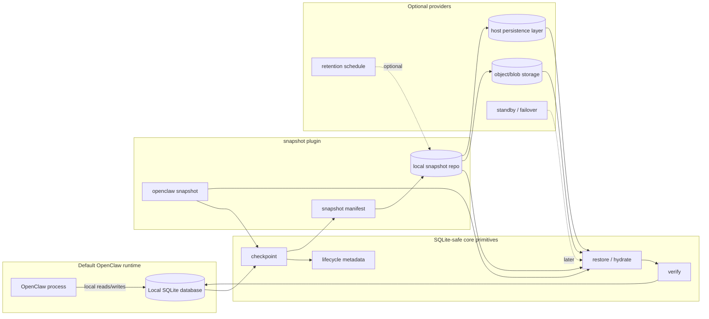

# Proposal: SQLite State Snapshot Plugin

## Summary

Define an opt-in `snapshot` plugin for OpenClaw-owned SQLite state. The plugin produces SQLite-safe state snapshots that can be verified, restored, and used as the foundation for future failover.

SQLite remains the hot local runtime database. The plugin does not replace SQLite, introduce a second required database backend, or make cloud storage mandatory. It gives managed and production operators a clearer answer to a narrower problem: how OpenClaw state becomes a portable, restorable artifact when a process, container, or host needs to be replaced.

The central contract is a state-artifact boundary: OpenClaw turns live local SQLite state into verified artifacts, while a host such as Lobster/Aether decides where those artifacts live and when they are uploaded, retained, downloaded, or replayed.

The plugin exposes its own `openclaw snapshot` command surface. It can leave room for later integration with `openclaw backup`, but the first implementation stack should stay plugin-scoped. The snapshot provider contract should apply to the database-first layout OpenClaw has already landed: a global control-plane database plus per-agent data-plane databases, and any future dedicated owner store that follows the same ownership model. The plugin can be the first consumer of primitives that core may later use directly if snapshot and restore become baseline behavior.

## Motivation

OpenClaw is moving runtime state into SQLite-backed stores. The database-first SQLite alignment landed in openclaw/openclaw#94646 makes that shape more explicit: `state/openclaw.sqlite` is the global control-plane database, while `agents/<agentId>/agent/openclaw-agent.sqlite` is the per-agent data-plane database for agent-owned state such as memory indexes and auth/profile state. That is a good local runtime shape, but operational reliability depends on more than having files on disk.

The pain points are concrete:

- copying a live SQLite database file can miss WAL state or capture a half-consistent database
- whole-file copying gets expensive as state grows
- network filesystems are not a safe concurrency strategy for hot SQLite writes
- backup archives are only useful if restore is verified and repeatable
- container or host replacement needs state hydration before OpenClaw opens the database
- failover cannot be credible until OpenClaw has a known-good restore point
- hosted OpenClaw platforms need a stable way to persist OpenClaw-owned state without reverse-engineering which files are authoritative, which SQLite sidecars are live-only, and which database units are safe to rehydrate

The operational question is therefore not primarily "which database should OpenClaw use?" Greater minds can make the long-term database choice separately. This RFC focuses on the SQLite state OpenClaw already owns and asks for a practical extension point around it.

The proposed answer is a `snapshot` plugin: an opt-in extension that turns local SQLite state into verified snapshot artifacts. Those artifacts can later support cloud uploads, retention policies, warm standby, and failover, but the first value is simpler: make state capture and restore correct.

This also gives hosted OpenClaw deployments a cleaner integration point. The host should not need to copy `*.sqlite`, `*.sqlite-wal`, and `*.sqlite-shm` files directly or infer durability rules from ignore files. OpenClaw should provide the SQLite-aware translation into clean artifacts; the host should provide destination storage, schedule, retention, encryption policy, and container lifecycle integration.

## Goals

- Keep SQLite as the hot local runtime database for this proposal.
- Make snapshot behavior opt-in through a plugin extension.
- Produce consistent SQLite snapshots that handle WAL state correctly.
- Make restore and verification first-class behaviors, not incidental backup side effects.
- Define a reusable SQLite snapshot provider contract for OpenClaw-owned SQLite databases.
- Define the state-artifact boundary that lets hosted platforms persist OpenClaw state without understanding OpenClaw's internal SQLite file layout.
- Allow the plugin to add commands under `openclaw snapshot`.
- Leave `openclaw backup` integration as a possible later follow-up, not part of the initial proof stack.
- Keep default local OpenClaw behavior unchanged when the plugin is not installed or enabled.
- Avoid hot writes over network filesystems as a durability or concurrency strategy.
- Define lifecycle metadata needed to validate, order, restore, and audit snapshots.
- Leave cloud artifact storage, retention, scheduling, and failover orchestration to optional providers or later RFCs.
- Let hosts such as Lobster/Aether own durable destination policy while OpenClaw owns the correctness of the local SQLite artifact operation.
- Build on the existing database-first units: global control-plane SQLite, per-agent data-plane SQLite, and any dedicated owner store.
- Leave room for core to adopt the same primitives later if snapshot and restore become required OpenClaw behavior.

## Non-Goals

- This RFC does not choose PostgreSQL, libSQL, remote SQLite, object storage, or any other backend product.
- This RFC does not define a general database abstraction layer.
- This RFC does not require OpenClaw to own the hosting platform's upload, retention, tenant routing, encryption, or object-storage policy.
- This RFC does not make snapshots, cloud storage, or managed failover mandatory for local, self-hosted, or development OpenClaw installs.
- This RFC does not require object-store credentials, a lease service, or a managed-service control plane in the default runtime.
- This RFC does not replace the session/transcript migration plan tracked by openclaw/openclaw#88838.
- This RFC does not define tenant isolation, row-level authorization, or a multi-tenant schema model.
- This RFC does not define FTS/vector search portability.
- This RFC does not require real-time multi-writer SQLite over shared storage.
- This RFC does not define the final managed failover control plane.
- This RFC does not change the existing `openclaw backup create` or `openclaw backup verify` behavior.

## Proposal

### Plugin shape

Add an opt-in `snapshot` plugin that owns SQLite-safe snapshot and restore workflows for OpenClaw state.

The plugin should be installable and removable like other OpenClaw plugins. When it is absent, default OpenClaw keeps its current local SQLite behavior and existing backup commands.

The plugin is the first proposed consumer of the snapshot provider contract, not the only possible consumer. Over time, the same contract can be used by core backup/restore commands, doctor checks, managed startup hydration, or other OpenClaw features that need a consistent SQLite restore point.

The plugin should follow the bundled extension pattern used by plugins such as `policy` and `oc-path`:

```text
extensions/snapshot/
  package.json
  openclaw.plugin.json
  index.ts
  src/
    snapshot-provider.ts
    manifest.ts
    local-repository.ts
```

The plugin adds a direct command surface:

```text
openclaw snapshot create
openclaw snapshot verify
openclaw snapshot restore
openclaw snapshot list
openclaw snapshot status
```

Later, if maintainers want one user-facing home for backup and restore workflows, the same provider contract can be wired under the existing backup command surface:

```text
openclaw backup snapshot
openclaw backup restore
openclaw backup status
```

That integration is intentionally not part of the initial implementation roadmap. The first proof should stay scoped to the `snapshot` plugin so it can demonstrate correctness without changing the existing backup command behavior.

### Responsibility split

Core should expose or own the SQLite-safe primitives that require knowledge of OpenClaw state paths, WAL behavior, schema versions, and integrity checks.

Core should own:

- eligible database discovery or registry for OpenClaw-owned SQLite databases
- consistent SQLite checkpoint creation
- restore or hydrate before opening runtime state
- restored database verification
- lifecycle metadata shape
- safety rules such as no hot writes over network filesystems

The `snapshot` plugin should own:

- snapshot command UX
- local snapshot artifact creation
- snapshot manifest creation and verification
- restore workflow orchestration
- provider hooks for storage backends

Optional future integrations and providers can own:

- integration with `openclaw backup`
- local snapshot repositories
- S3-compatible artifact storage
- Azure Blob or other cloud artifact storage
- ODSP, blob, git, durable-volume, or other host-specific persistence adapters
- retention policy and upload scheduling
- writer lease coordination
- warm standby or managed failover orchestration
- integration with external tools such as Litestream or LiteFS, if later accepted

In other words, OpenClaw should own this translation:

```text
live OpenClaw SQLite database -> verified snapshot artifact + manifest
```

The hosting platform should own this policy:

```text
verified snapshot artifact + manifest -> durable destination and restore timing
```

That split keeps SQLite correctness in the codebase that owns the schema and file layout, while keeping cloud credentials, tenant routing, retention, and platform lifecycle outside the default OpenClaw runtime.

### Architecture



The diagram is a responsibility split, not a default runtime requirement. Default OpenClaw can run with only the runtime box. Operators opt into the plugin when they need verified snapshot and restore workflows.

For hosted OpenClaw, the same split becomes the host integration contract. The host can ask OpenClaw to materialize a clean artifact before upload and can hydrate local disk from a verified artifact before OpenClaw opens SQLite. The host does not need to treat live SQLite sidecars as durable sync inputs.

### Snapshot semantics

An OpenClaw-owned SQLite database is snapshot-safe when it can be captured, verified, restored, and resumed on another host or directory without relying on a live shared filesystem.

The unit of snapshotting is an existing OpenClaw-owned SQLite database. The primary units are:

- the global control-plane database at `state/openclaw.sqlite`
- one per-agent data-plane database at `agents/<agentId>/agent/openclaw-agent.sqlite`
- any future dedicated owner store that has explicit ownership, schema, and lifecycle metadata

This RFC does not rename or redesign those logical units; openclaw/openclaw#94646 makes them concrete enough for snapshot to target. The RFC defines snapshot behavior that can apply to each eligible database.

The provider contract should therefore take a database reference rather than assume one hard-coded database path. Core can decide which SQLite databases are eligible, and the plugin or provider can apply the same snapshot semantics to each eligible database.

A snapshot must:

- handle `.sqlite`, `-wal`, and `-shm` state correctly
- avoid half-copied database state
- record the schema version and database identity
- record the checkpoint cursor or equivalent replay position when available
- produce enough metadata to verify restore integrity
- be restorable before OpenClaw opens the database for runtime writes

The implementation may use SQLite online backup APIs, `VACUUM INTO`, WAL checkpoints, page-level capture, or another implementation-specific mechanism. The observable contract is a consistent restore point.

### Snapshot artifacts

Snapshot storage should store durable artifacts, not a live database file used directly by the runtime.

The artifact model should support:

- compact snapshot artifacts
- ordered manifests
- content hashes or equivalent integrity checks
- optional incremental deltas after the first milestone
- resumable upload and download when a remote provider is configured
- restore from the latest valid snapshot plus any required ordered deltas

The delta mechanism can be WAL-frame based, page based, logical-change based, external-tool based, or backend-native. This RFC requires the contract, not one specific encoding.

Artifacts should be suitable for host persistence. A hosting platform should be able to upload, retain, copy, and later download the artifact set without preserving process-local SQLite sidecars or relying on a mounted shared filesystem.

### Restore verification

Restore is a required behavior for the `snapshot` plugin, not an incidental backup side effect.

A restore operation must:

- locate the selected snapshot and required artifacts
- verify artifact ordering and integrity
- hydrate local database files before runtime opens them
- run SQLite integrity checks or equivalent validation
- confirm the restored schema version is supported
- record the restore point OpenClaw is resuming from

The first implementation milestone should prove that OpenClaw can boot from restored state on a fresh directory, host, or container.

### Failover path

The plugin is not required to implement automatic failover in the first milestone, but it should be designed as the foundation for failover.

Failover becomes possible when OpenClaw has:

1. a recent verified snapshot or restore point
2. a way to hydrate local disk before startup
3. a way to confirm schema and integrity before runtime writes
4. a clear owner for the database after restore
5. optional deltas or upload scheduling to reduce the data-loss window

A later RFC can define leases, promotion, fencing, standby replicas, and managed orchestration. This RFC provides the snapshot and restore substrate those systems need.

### Writer ownership

OpenClaw must not treat a network filesystem as the concurrency model for hot SQLite writes.

Each snapshot-managed SQLite database should have explicit writer ownership when the deployment allows failover or multiple possible hosts. A managed deployment can move ownership, but only through a controlled sequence:

1. acquire ownership or a writer lease for the database, if leases are enabled
2. hydrate local disk from a verified restore point when needed
3. open and write SQLite locally
4. periodically create and publish snapshot artifacts
5. release ownership with a final verified snapshot when supported
6. allow another host to restore from the latest verified durable point

Concurrent readers and replicas can be designed later, but the write path must have one clear owner at a time unless a future RFC defines a stronger multi-writer mechanism.

### Lifecycle metadata

Each snapshot needs metadata sufficient to reason about restore, replay, and integrity.

At minimum, snapshot metadata should include:

- database id
- database kind or owner
- database role, such as global control-plane or per-agent data-plane
- owning agent id when the snapshot is for a per-agent database
- schema version
- snapshot generation
- checkpoint or WAL cursor when available
- artifact manifest id
- integrity hash or verification record
- snapshot creation time
- restore source and restore point when hydrated
- current writer owner or lease holder, when leases are enabled

The exact storage location for this metadata is implementation-defined, but the `snapshot` plugin must be able to read enough metadata to verify and restore a snapshot without opening a possibly unsafe runtime database first.

### Provider shape

The implementation can start as a SQLite-specific snapshot provider rather than a database abstraction layer.

The provider contract should be reusable by any OpenClaw feature that needs to capture or restore an OpenClaw-owned SQLite database. The `snapshot` plugin is the first proposed packaging and CLI surface, but the contract should not depend on plugin-only state.

A minimal shape is:

```ts
type SqliteSnapshotProvider = {
  create(dbRef): Promise<SnapshotResult>;
  verify(snapshotRef): Promise<VerifyResult>;
  restore(snapshotRef, targetPath): Promise<RestoreResult>;
  list?(): Promise<SnapshotSummary[]>;
  status?(): Promise<SnapshotStatus>;
};
```

A later provider can add remote persistence:

```ts
type RemoteSnapshotProvider = SqliteSnapshotProvider & {
  upload(snapshotRef): Promise<UploadResult>;
  download(snapshotRef, targetPath): Promise<DownloadResult>;
  prune?(policy): Promise<PruneResult>;
};
```

This keeps SQLite runtime access local while making state artifacts portable. A local snapshot provider can be the reference implementation. Cloud/object-store providers can come later without changing the default local runtime.

If the design proves broadly useful, core can adopt the same contract for built-in backup restore, startup hydration, or state migration workflows without requiring the `snapshot` plugin command surface to become mandatory.

### Implementation roadmap

The initial implementation should be a short PR stack that proves correctness before expanding product surface.

#### PR 1: provider proof

Add the bundled `snapshot` plugin scaffold and a local SQLite snapshot provider.

This PR should include:

- `extensions/snapshot` plugin manifest, package metadata, and entrypoint
- `SqliteSnapshotProvider` contract
- local snapshot repository
- snapshot manifest and content hash verification
- SQLite-safe snapshot creation for one database reference using shared core/package primitives where OpenClaw already owns the SQLite invariants
- tests against a WAL-mode SQLite database
- an internal restore in tests to prove the artifact is usable

This PR does not need the full public restore CLI. It should prove that the provider can create and verify a correct SQLite snapshot artifact without publishing a premature provider API surface.

#### PR 2: public snapshot CLI

Expose the user-facing plugin commands:

```text
openclaw snapshot create
openclaw snapshot verify
openclaw snapshot restore
```

This PR should add target-directory safety checks, restore manifest validation, SQLite integrity checks after restore, and docs for the `snapshot` plugin command surface.

The CLI should accept an explicit database path for the proof path, but the intended product model is not "any random SQLite file forever." The command should be able to grow toward named OpenClaw database targets such as global state or a specific agent database once core exposes the eligible database registry cleanly.

#### PR 3: fresh-state boot proof

Prove that a restored snapshot can hydrate a fresh OpenClaw state directory before runtime opens SQLite.

This PR should demonstrate that OpenClaw can start from restored state in a fresh directory, host, or container-style environment. That proof is what makes the plugin a credible failover substrate rather than only an archive utility.

This proof should also document the host contract: which OpenClaw command or API materializes the artifact, which manifest fields the host can store without interpreting SQLite internals, and what must be restored before OpenClaw opens the database.

#### Later work

After the three initial PRs, follow-up RFCs or implementation PRs can consider:

- `openclaw backup` integration
- incremental deltas
- object/blob storage providers
- retention and scheduling
- leases, promotion, fencing, and managed failover
- external tool integrations such as Litestream or LiteFS

## Rationale

This approach targets the reliability problem directly. It does not require OpenClaw to choose a second database backend before it has defined capture and restore semantics for the SQLite state it already owns.

The database-first work in openclaw/openclaw#94646 improves this RFC because it gives snapshot a concrete target model. Snapshot does not have to invent logical database units. It can operate over the already-established global control-plane database and per-agent data-plane databases, then extend to dedicated owner stores only when those stores have comparable ownership and lifecycle metadata.

Calling the extension `snapshot` keeps the first deliverable concrete. It describes the artifact OpenClaw needs before higher-level reliability features can exist. It also avoids overpromising automatic failover before leases, promotion, and orchestration are designed.

Keeping the first implementation stack under `openclaw snapshot` keeps the proof small and plugin-scoped. Existing `openclaw backup create` and `openclaw backup verify` behavior can remain unchanged while the snapshot provider proves the harder SQLite correctness and restore semantics.

Treating remote storage as artifact storage avoids the common failure mode where object storage or network filesystems are used as if they were local disk. SQLite remains local and authoritative while running. Reliability comes from verified snapshots, manifests, restore procedures, and later deltas.

Making the feature opt-in keeps the default OpenClaw runtime simple. Local and development users should not need object storage, a lease service, or a managed scheduler to keep using SQLite.

Keeping core responsible for SQLite-safe primitives is important because safe snapshots and restores need access to database paths, WAL behavior, schema versions, and integrity checks. Provider-owned artifact storage keeps cloud credentials, retention policy, and managed failover out of the default core runtime.

Hosted deployments make that core responsibility more important, not less. A host can persist a directory, but OpenClaw should define which database artifacts are safe to persist. Without that boundary, every host integration has to rediscover SQLite sidecar rules and OpenClaw database ownership independently.

The provider contract gives OpenClaw a path from plugin experimentation to core adoption. The first implementation can live as an opt-in plugin while the contract stays general enough for future core backup, restore, startup hydration, or migration workflows.

Explicit writer ownership keeps horizontal service orchestration honest. A service can move work between hosts, but it must move ownership and restore state deliberately rather than letting several instances write the same SQLite database through shared storage.

The proposal also keeps storage ownership decisions out of scope. OpenClaw already has global control-plane state, per-agent data-plane state, and owner-specific stores; this RFC defines how those databases become restorable snapshot artifacts.

## Unresolved questions

- Which database-first unit should be used for the first named snapshot/restore proof: global control-plane state, one per-agent data-plane database, or both?
- Should the first checkpoint implementation use SQLite online backup, `VACUUM INTO`, WAL checkpointing, page capture, or a higher-level export format?
- Should the reference provider be a local snapshot repository only, or should it include one object/blob storage provider?
- What is the acceptable data-loss window for managed deployments before deltas are implemented?
- Where should writer ownership metadata live before a database is opened?
- Should restore verification run during startup, doctor, a managed-control-plane action, or all three?
- What is the minimum host-facing API or command shape needed for Lobster/Aether-style platforms to request artifact materialization and pre-start hydration without importing plugin-specific policy?
- Which artifacts should be included with database restore for support/debug exports versus canonical runtime recovery?
- Should external tools such as Litestream or LiteFS be provider integrations, deployment recommendations, or out of scope for OpenClaw-owned code?
