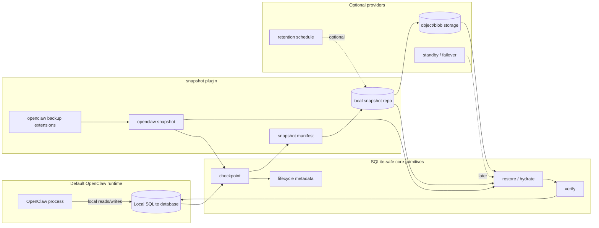

# Proposal: SQLite State Snapshot Plugin

## Summary

Define an opt-in `snapshot` plugin for OpenClaw-owned SQLite state. The plugin produces SQLite-safe state snapshots that can be verified, restored, and used as the foundation for future failover.

SQLite remains the hot local runtime database. The plugin does not replace SQLite, introduce a second required database backend, or make cloud storage mandatory. It gives managed and production operators a clearer answer to a narrower problem: how OpenClaw state becomes a portable, restorable artifact when a process, container, or host needs to be replaced.

The plugin can expose its own commands and also extend the existing `openclaw backup` command surface.

## Motivation

OpenClaw is moving runtime state into SQLite-backed stores. That is a good local runtime shape, but operational reliability depends on more than having files on disk.

The pain points are concrete:

- copying a live SQLite database file can miss WAL state or capture a half-consistent database
- whole-file copying gets expensive as state grows
- network filesystems are not a safe concurrency strategy for hot SQLite writes
- backup archives are only useful if restore is verified and repeatable
- container or host replacement needs state hydration before OpenClaw opens the database
- failover cannot be credible until OpenClaw has a known-good restore point

The operational question is therefore not primarily "which database should OpenClaw use?" Greater minds can make the long-term database choice separately. This RFC focuses on the SQLite state OpenClaw already owns and asks for a practical extension point around it.

The proposed answer is a `snapshot` plugin: an opt-in extension that turns local SQLite state into verified snapshot artifacts. Those artifacts can later support cloud uploads, retention policies, warm standby, and failover, but the first value is simpler: make state capture and restore correct.

## Goals

- Keep SQLite as the hot local runtime database for this proposal.
- Make snapshot behavior opt-in through a plugin extension.
- Produce consistent SQLite snapshots that handle WAL state correctly.
- Make restore and verification first-class behaviors, not incidental backup side effects.
- Allow the plugin to add commands under `openclaw snapshot` and extend `openclaw backup`.
- Keep default local OpenClaw behavior unchanged when the plugin is not installed or enabled.
- Avoid hot writes over network filesystems as a durability or concurrency strategy.
- Define lifecycle metadata needed to validate, order, restore, and audit snapshots.
- Leave cloud artifact storage, retention, scheduling, and failover orchestration to optional providers or later RFCs.
- Keep the design compatible with existing global state, per-agent state, and dedicated store boundaries.

## Non-Goals

- This RFC does not choose PostgreSQL, libSQL, remote SQLite, object storage, or any other backend product.
- This RFC does not define a general database abstraction layer.
- This RFC does not make snapshots, cloud storage, or managed failover mandatory for local, self-hosted, or development OpenClaw installs.
- This RFC does not require object-store credentials, a lease service, or a managed-service control plane in the default runtime.
- This RFC does not replace the session/transcript migration plan tracked by openclaw/openclaw#88838.
- This RFC does not define tenant isolation, row-level authorization, or a multi-tenant schema model.
- This RFC does not define FTS/vector search portability.
- This RFC does not require real-time multi-writer SQLite over shared storage.
- This RFC does not define the final managed failover control plane.

## Proposal

### Plugin shape

Add an opt-in `snapshot` plugin that owns SQLite-safe snapshot and restore workflows for OpenClaw state.

The plugin should be installable and removable like other OpenClaw plugins. When it is absent, default OpenClaw keeps its current local SQLite behavior and existing backup commands.

The plugin can add a direct command surface:

```text
openclaw snapshot create
openclaw snapshot verify
openclaw snapshot restore
openclaw snapshot list
openclaw snapshot status
```

It can also extend the existing backup surface so operators can use the name OpenClaw already has for this class of work:

```text
openclaw backup snapshot
openclaw backup restore
openclaw backup status
```

The intent is not to split the product vocabulary. `snapshot` is the plugin and capability name; `backup` remains the user-facing home for backup and restore workflows where that is more natural.

### Responsibility split

Core should expose or own the SQLite-safe primitives that require knowledge of OpenClaw state paths, WAL behavior, schema versions, and integrity checks.

Core should own:

- consistent SQLite checkpoint creation
- restore or hydrate before opening runtime state
- restored database verification
- lifecycle metadata shape
- safety rules such as no hot writes over network filesystems

The `snapshot` plugin should own:

- snapshot command UX
- local snapshot artifact creation
- snapshot manifest creation and verification
- restore workflow orchestration
- optional integration with `openclaw backup`
- provider hooks for storage backends

Optional providers can own:

- local snapshot repositories
- S3-compatible artifact storage
- Azure Blob or other cloud artifact storage
- retention policy and upload scheduling
- writer lease coordination
- warm standby or managed failover orchestration
- integration with external tools such as Litestream or LiteFS, if later accepted

### Architecture



The diagram is a responsibility split, not a default runtime requirement. Default OpenClaw can run with only the runtime box. Operators opt into the plugin when they need verified snapshot and restore workflows.

### Snapshot semantics

An OpenClaw-owned SQLite database is snapshot-safe when it can be captured, verified, restored, and resumed on another host or directory without relying on a live shared filesystem.

The unit of snapshotting is an existing OpenClaw-owned SQLite database, such as shared state, per-agent state, or a dedicated owner store. This RFC does not rename or redesign those logical units; it defines snapshot behavior that can apply to each unit.

A snapshot must:

- handle `.sqlite`, `-wal`, and `-shm` state correctly
- avoid half-copied database state
- record the schema version and database identity
- record the checkpoint cursor or equivalent replay position when available
- produce enough metadata to verify restore integrity
- be restorable before OpenClaw opens the database for runtime writes

The implementation may use SQLite online backup APIs, `VACUUM INTO`, WAL checkpoints, page-level capture, or another implementation-specific mechanism. The observable contract is a consistent restore point.

### Snapshot artifacts

Snapshot storage should store durable artifacts, not a live database file used directly by the runtime.

The artifact model should support:

- compact snapshot artifacts
- ordered manifests
- content hashes or equivalent integrity checks
- optional incremental deltas after the first milestone
- resumable upload and download when a remote provider is configured
- restore from the latest valid snapshot plus any required ordered deltas

The delta mechanism can be WAL-frame based, page based, logical-change based, external-tool based, or backend-native. This RFC requires the contract, not one specific encoding.

### Restore verification

Restore is a required behavior for the `snapshot` plugin, not an incidental backup side effect.

A restore operation must:

- locate the selected snapshot and required artifacts
- verify artifact ordering and integrity
- hydrate local database files before runtime opens them
- run SQLite integrity checks or equivalent validation
- confirm the restored schema version is supported
- record the restore point OpenClaw is resuming from

The first implementation milestone should prove that OpenClaw can boot from restored state on a fresh directory, host, or container.

### Failover path

The plugin is not required to implement automatic failover in the first milestone, but it should be designed as the foundation for failover.

Failover becomes possible when OpenClaw has:

1. a recent verified snapshot or restore point
2. a way to hydrate local disk before startup
3. a way to confirm schema and integrity before runtime writes
4. a clear owner for the database after restore
5. optional deltas or upload scheduling to reduce the data-loss window

A later RFC can define leases, promotion, fencing, standby replicas, and managed orchestration. This RFC provides the snapshot and restore substrate those systems need.

### Writer ownership

OpenClaw must not treat a network filesystem as the concurrency model for hot SQLite writes.

Each snapshot-managed SQLite database should have explicit writer ownership when the deployment allows failover or multiple possible hosts. A managed deployment can move ownership, but only through a controlled sequence:

1. acquire ownership or a writer lease for the database, if leases are enabled
2. hydrate local disk from a verified restore point when needed
3. open and write SQLite locally
4. periodically create and publish snapshot artifacts
5. release ownership with a final verified snapshot when supported
6. allow another host to restore from the latest verified durable point

Concurrent readers and replicas can be designed later, but the write path must have one clear owner at a time unless a future RFC defines a stronger multi-writer mechanism.

### Lifecycle metadata

Each snapshot needs metadata sufficient to reason about restore, replay, and integrity.

At minimum, snapshot metadata should include:

- database id
- database kind or owner
- schema version
- snapshot generation
- checkpoint or WAL cursor when available
- artifact manifest id
- integrity hash or verification record
- snapshot creation time
- restore source and restore point when hydrated
- current writer owner or lease holder, when leases are enabled

The exact storage location for this metadata is implementation-defined, but the `snapshot` plugin must be able to read enough metadata to verify and restore a snapshot without opening a possibly unsafe runtime database first.

### Provider shape

The implementation can start as a SQLite-specific snapshot provider rather than a database abstraction layer.

A minimal shape is:

```ts
type SqliteSnapshotProvider = {
  create(dbRef): Promise<SnapshotResult>;
  verify(snapshotRef): Promise<VerifyResult>;
  restore(snapshotRef, targetPath): Promise<RestoreResult>;
  list?(): Promise<SnapshotSummary[]>;
  status?(): Promise<SnapshotStatus>;
};
```

A later provider can add remote persistence:

```ts
type RemoteSnapshotProvider = SqliteSnapshotProvider & {
  upload(snapshotRef): Promise<UploadResult>;
  download(snapshotRef, targetPath): Promise<DownloadResult>;
  prune?(policy): Promise<PruneResult>;
};
```

This keeps SQLite runtime access local while making state artifacts portable. A local snapshot provider can be the reference implementation. Cloud/object-store providers can come later without changing the default local runtime.

### First milestone

The first implementation milestone should be intentionally small and opt-in:

1. implement the `snapshot` plugin with a local snapshot repository
2. choose one existing OpenClaw-owned SQLite database
3. produce a consistent local snapshot artifact
4. verify the snapshot manifest and SQLite integrity
5. restore it into a fresh directory or host
6. boot OpenClaw from restored state
7. expose the workflow through `openclaw snapshot` and optionally `openclaw backup snapshot` / `openclaw backup restore`
8. document that hot writes over network filesystems remain unsupported

Incremental deltas, object storage, leases, standby replicas, and automatic failover should follow after snapshot and restore are proven.

## Rationale

This approach targets the reliability problem directly. It does not require OpenClaw to choose a second database backend before it has defined capture and restore semantics for the SQLite state it already owns.

Calling the extension `snapshot` keeps the first deliverable concrete. It describes the artifact OpenClaw needs before higher-level reliability features can exist. It also avoids overpromising automatic failover before leases, promotion, and orchestration are designed.

Keeping `backup` as an extended command surface respects the CLI that already exists. Users who think in backup and restore terms can stay under `openclaw backup`; operators who install the plugin can use `openclaw snapshot` when they need the more specific state-artifact workflow.

Treating remote storage as artifact storage avoids the common failure mode where object storage or network filesystems are used as if they were local disk. SQLite remains local and authoritative while running. Reliability comes from verified snapshots, manifests, restore procedures, and later deltas.

Making the feature opt-in keeps the default OpenClaw runtime simple. Local and development users should not need object storage, a lease service, or a managed scheduler to keep using SQLite.

Keeping core responsible for SQLite-safe primitives is important because safe snapshots and restores need access to database paths, WAL behavior, schema versions, and integrity checks. Provider-owned artifact storage keeps cloud credentials, retention policy, and managed failover out of the default core runtime.

Explicit writer ownership keeps horizontal service orchestration honest. A service can move work between hosts, but it must move ownership and restore state deliberately rather than letting several instances write the same SQLite database through shared storage.

The proposal also keeps logical storage boundaries out of scope. OpenClaw already has shared state, per-agent state, and owner-specific stores; this RFC defines how any of those databases can become restorable snapshot artifacts.

## Unresolved questions

- Should the plugin command be exactly `snapshot`, or should `snapshot` exist only as a backup subcommand?
- Which existing SQLite database should be used for the first snapshot/restore proof?
- Should the first checkpoint implementation use SQLite online backup, `VACUUM INTO`, WAL checkpointing, page capture, or a higher-level export format?
- Should the reference provider be a local snapshot repository only, or should it include one object/blob storage provider?
- What is the acceptable data-loss window for managed deployments before deltas are implemented?
- Where should writer ownership metadata live before a database is opened?
- Should restore verification run during startup, doctor, a managed-control-plane action, or all three?
- Which artifacts should be included with database restore for support/debug exports versus canonical runtime recovery?
- Should external tools such as Litestream or LiteFS be provider integrations, deployment recommendations, or out of scope for OpenClaw-owned code?
