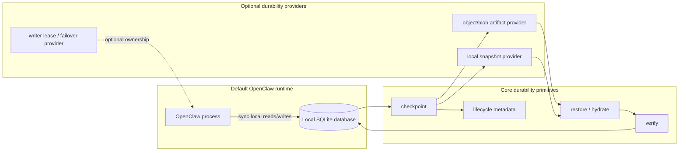

# Proposal: Cloud-Serializable SQLite State

## Summary

Define opt-in durability and recovery requirements for OpenClaw-owned SQLite state in managed deployments. SQLite remains the hot local runtime database; optional durability providers store verified snapshots and deltas as artifacts, not live database files.

## Motivation

OpenClaw is moving runtime state into SQLite-backed stores. That is a good local runtime shape, but managed deployments need more than local files: state must survive process restarts, container replacement, node loss, and service redeploys without relying on shared network filesystems or whole-file copy as the only durability mechanism.

The operational problem is not primarily database selection. It is that SQLite state needs a defined way to become portable, streamable, restorable, and schedulable as an owned artifact. A managed service needs clear semantics for checkpointing, incremental durability, ownership transfer, restore verification, and failover.

This proposal is intentionally opt-in. Default local OpenClaw should keep its existing SQLite behavior and backup commands unless an operator enables a durability provider or managed deployment mode.

## Goals

- Keep SQLite as the hot local runtime database for this proposal.
- Keep cloud-serializable durability opt-in, with no default cloud dependency.
- Define what it means for OpenClaw-owned SQLite databases to be cloud-serializable.
- Require consistent checkpoints that handle SQLite WAL state correctly.
- Define verified restore as a first-class behavior, including booting OpenClaw from restored state.
- Avoid hot writes over network filesystems as a durability or concurrency strategy.
- Define incremental durability requirements beyond repeated whole-file copies.
- Define writer ownership and lease expectations for each durable SQLite database.
- Define lifecycle metadata needed to validate, order, restore, and audit snapshots and deltas.
- Keep the design compatible with existing global state, per-agent state, and dedicated store boundaries.
- Let artifact storage, retention, scheduling, and managed failover be provider-owned or deployment-owned.

## Non-Goals

- This RFC does not choose PostgreSQL, libSQL, remote SQLite, object storage, or any other backend product.
- This RFC does not define a general database abstraction layer.
- This RFC does not make cloud durability mandatory for local, self-hosted, or development OpenClaw installs.
- This RFC does not require object-store credentials, a lease service, or a managed-service control plane in the default runtime.
- This RFC does not replace the session/transcript migration plan tracked by openclaw/openclaw#88838.
- This RFC does not define tenant isolation, row-level authorization, or a multi-tenant schema model.
- This RFC does not define FTS/vector search portability.
- This RFC does not require real-time multi-writer SQLite over shared storage.
- This RFC does not define the final backup UI, CLI, or managed-service control plane.

## Proposal

### Opt-in durability mode

Cloud-serializable durability is an optional mode for managed and production operators. It should not change the default local SQLite runtime.

Default OpenClaw keeps:

- local SQLite state
- existing backup create and verify behavior
- no cloud dependency
- no object storage configuration
- no writer lease service
- no additional managed-service scheduler

Opt-in durability mode adds a provider-backed durability path. Core owns the SQLite-safe primitives and contract. Providers or deployments own where artifacts go, how retention is scheduled, and how managed failover is orchestrated.

Core should own:

- consistent SQLite checkpoint creation
- restore or hydrate before opening runtime state
- restored database verification
- lifecycle metadata shape
- safety rules such as no hot writes over network filesystems

Providers can own:

- local snapshot artifact storage
- S3-compatible artifact storage
- Azure Blob or other cloud artifact storage
- retention policy and upload scheduling
- writer lease coordination
- managed failover orchestration
- integration with external tools such as Litestream or LiteFS, if later accepted

### Architecture



The diagram is a responsibility split, not a runtime requirement. Default OpenClaw can run with only the runtime box. Managed deployments opt into the provider side.

### Cloud-serializable SQLite state

An OpenClaw-owned SQLite database is cloud-serializable when it can be safely captured, uploaded, restored, verified, and resumed on a different host or container without relying on a live shared filesystem.

The unit of durability is an existing OpenClaw-owned SQLite database, such as shared state, per-agent state, or a dedicated owner store. This RFC does not rename or redesign those logical units; it defines durability behavior that can apply to each unit.

### Safe checkpointing

Each durable SQLite database must have a checkpoint operation that produces a consistent restore point.

A checkpoint must:

- handle `.sqlite`, `-wal`, and `-shm` state correctly
- avoid half-copied database state
- record the schema version and database identity
- record the checkpoint cursor or equivalent replay position
- produce enough metadata to verify restore integrity

The implementation may use SQLite online backup APIs, `VACUUM INTO`, WAL checkpoints, page-level capture, or another implementation-specific mechanism, but the observable contract must be a consistent restore point.

### Snapshot and delta artifacts

Cloud storage should store durable artifacts, not a live database file used directly by the runtime.

The artifact model should support:

- periodic compact snapshots
- incremental deltas between snapshots
- ordered manifests for snapshots and deltas
- content hashes or equivalent integrity checks
- resumable upload and download
- restore from the latest valid snapshot plus ordered deltas

The delta mechanism can be WAL-frame based, page based, logical-change based, external-tool based, or backend-native. The RFC requires the contract, not one specific encoding.

### Writer ownership and leases

OpenClaw must not treat a network filesystem as the concurrency model for hot SQLite writes.

Each durable SQLite database should have explicit writer ownership when the deployment allows failover or multiple possible hosts. A managed deployment can move ownership, but only through a controlled sequence:

1. acquire ownership or a writer lease for the database
2. hydrate local disk from a verified restore point when needed
3. open and write SQLite locally
4. periodically checkpoint and upload durable artifacts
5. release ownership with a final durable checkpoint
6. allow failover to restore from the latest verified durable point

Concurrent readers and replicas can be designed later, but the write path must have one clear owner at a time unless a future RFC defines a stronger multi-writer mechanism.

### Restore verification

Restore is a required behavior for opt-in durability mode, not an incidental backup side effect.

A restore operation must:

- download or locate the selected snapshot and required deltas
- verify artifact ordering and integrity
- hydrate local database files before runtime opens them
- run SQLite integrity checks or equivalent validation
- confirm the restored schema version is supported
- record the restore point OpenClaw is resuming from

The first implementation milestone should prove that OpenClaw can boot from restored state on a fresh host or container.

### Lifecycle metadata

Each durable database needs metadata sufficient to reason about ownership, replay, and integrity.

At minimum, durability metadata should include:

- database id
- database kind or owner
- schema version
- current writer owner or lease holder, when leases are enabled
- snapshot generation
- checkpoint or WAL cursor
- artifact manifest id
- integrity hash or verification record
- last durable upload time
- restore source and restore point when hydrated

The exact storage location for this metadata is implementation-defined, but opt-in managed deployments must be able to access it before opening a database for managed-runtime writes.

### Durability provider shape

The implementation can start as a SQLite-specific durability provider rather than a database abstraction layer.

A minimal shape is:

```ts
type SqliteDurabilityProvider = {
  checkpoint(dbRef): Promise<CheckpointResult>;
  uploadSnapshot(dbRef): Promise<SnapshotResult>;
  uploadDelta(dbRef, sinceCursor): Promise<DeltaResult>;
  restore(targetPath, restorePoint): Promise<RestoreResult>;
  verify(targetPath): Promise<VerifyResult>;
};
```

This keeps SQLite runtime access local while making persistence cloud-aware. A local snapshot provider can be the reference implementation. Cloud/object-store providers can come later without changing the default local runtime.

### First milestone

The first implementation milestone should be intentionally small and opt-in:

1. choose one existing OpenClaw-owned SQLite database
2. produce a consistent local snapshot artifact
3. restore it into a fresh directory or host
4. verify integrity
5. boot OpenClaw from restored state
6. document that hot writes over network filesystems remain unsupported

Incremental deltas, object storage, leases, and failover should follow after snapshot/restore is proven.

## Rationale

This approach targets the reliability problem directly. It does not require OpenClaw to choose a second database backend before it has defined durability and restore semantics for the SQLite state it already owns.

Treating cloud storage as artifact storage avoids the common failure mode where object storage or network filesystems are used as if they were local disk. SQLite remains local and authoritative while running. Managed durability comes from verified snapshots, deltas, manifests, and restore procedures.

Making the feature opt-in keeps the default OpenClaw runtime simple. Local and development users should not need object storage, a lease service, or a managed scheduler to keep using SQLite.

Keeping core responsible for SQLite-safe primitives is important because safe checkpoints and restores need access to database paths, WAL behavior, schema versions, and integrity checks. Provider-owned artifact storage keeps cloud credentials, retention policy, and managed failover out of the default core runtime.

Explicit writer ownership keeps horizontal service orchestration honest. A service can move work between hosts, but it must move ownership and restore state deliberately rather than letting several instances write the same SQLite database through shared storage.

The proposal also keeps logical storage boundaries out of scope. OpenClaw already has shared state, per-agent state, and owner-specific stores; this RFC defines how any of those databases can become durable cloud artifacts.

## Unresolved questions

- Which existing SQLite database should be used for the first snapshot/restore proof?
- Should the first checkpoint implementation use SQLite online backup, `VACUUM INTO`, WAL checkpointing, page capture, or a higher-level export format?
- Should the reference provider be a local snapshot provider only, or should it include one object/blob storage provider?
- What is the acceptable data-loss window for managed deployments before deltas are implemented?
- Where should writer lease metadata live before a database is opened?
- Should restore verification run during startup, doctor, a managed-control-plane action, or all three?
- Which artifacts should be included with database restore for support/debug exports versus canonical runtime recovery?
- Should external tools such as Litestream or LiteFS be provider integrations, deployment recommendations, or out of scope for OpenClaw-owned code?
