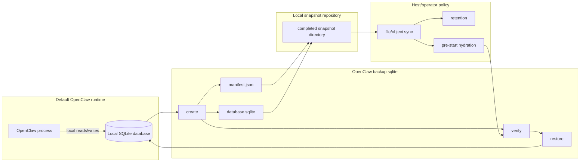

# Proposal: SQLite Snapshot Backup Artifacts

## Summary

Define a core `openclaw backup sqlite` command that gives operators and file-syncing hosts a SQLite-safe artifact for one OpenClaw-owned database.

OpenClaw keeps SQLite as the hot local runtime database. The snapshot command is the translation layer between live SQLite state and durable host storage: it materializes a compact `database.sqlite`, writes a strict `manifest.json`, verifies both, and publishes only the completed snapshot directory.

This RFC does not choose a replacement database, require cloud storage, or add managed failover. It defines the local artifact contract that hosts can safely sync, retain, verify, and restore before OpenClaw opens SQLite again.

Implementation landed in [openclaw/openclaw#105718](https://github.com/openclaw/openclaw/pull/105718), commit [2f25e9cba384acfc06cdf83640f236fdb7c1af33](https://github.com/openclaw/openclaw/commit/2f25e9cba384acfc06cdf83640f236fdb7c1af33). It superseded the original prototype in [openclaw/openclaw#94805](https://github.com/openclaw/openclaw/pull/94805) while preserving the SQLite-safe artifact direction.

## Motivation

OpenClaw stores important runtime state in SQLite-backed files. That is the right local runtime shape, but raw file syncing is the wrong durability boundary.

The unsafe sync inputs are concrete:

- `state/openclaw.sqlite` can be stale by itself when committed writes still live in `state/openclaw.sqlite-wal`.
- `agents/<agentId>/agent/openclaw-agent.sqlite` can be stale by itself when committed writes still live in `agents/<agentId>/agent/openclaw-agent.sqlite-wal`.
- `*.sqlite-wal`, `*.sqlite-shm`, and `*.sqlite-journal` are process-local SQLite sidecars, not durable host-sync artifacts.
- Copying a directory while OpenClaw is writing can split one logical database state across files captured at different moments.

The syncable file must be created deliberately. OpenClaw should open the source database through SQLite, materialize a clean copy using a SQLite-aware mechanism, verify it, and publish a completed artifact set. A host should sync that artifact set, not arbitrary live database churn.

The first landed implementation uses SQLite `VACUUM INTO` to capture committed WAL state into a compact database. That is different from copying a hot `.sqlite` file, and it is different from routinely vacuuming the runtime database. The operation happens only when creating a snapshot artifact.

## Goals

- Keep SQLite as the hot local runtime database.
- Provide a narrow core command for one-database SQLite snapshot artifacts.
- Support the shared OpenClaw state database and per-agent databases.
- Produce a host-syncable `database.sqlite` plus `manifest.json`.
- Handle WAL state correctly without syncing live SQLite sidecars.
- Verify snapshot shape, content hash, SQLite integrity, schema, role, owner, and canonical indexes.
- Restore only to a fresh target path, never by replacing a live database in place.
- Keep upload, scheduling, retention, failover, and restore-on-boot outside the Phase 1 command.

## Non-Goals

- This RFC does not choose PostgreSQL, libSQL, remote SQLite, object storage, or another backend.
- This RFC does not define a general database abstraction layer.
- This RFC does not make cloud storage or managed failover mandatory.
- This RFC does not require OpenClaw to own upload, tenant routing, retention, or encryption policy.
- This RFC does not require hot writes over a network filesystem.
- This RFC does not define WAL bundles, leases, promotion, fencing, or standby orchestration.
- This RFC does not define another Gateway pause, drain, or suspension API.
- This RFC does not change `openclaw backup create` archive behavior.

## Proposal

### Command Shape

Add SQLite snapshot operations under the existing backup command:

```text
openclaw backup sqlite create --global --repository <dir>
openclaw backup sqlite create --agent <id> --repository <dir>
openclaw backup sqlite list --repository <dir>
openclaw backup sqlite verify <snapshot-directory>
openclaw backup sqlite verify <snapshot-directory> --scratch <private-dir>
openclaw backup sqlite restore <snapshot-directory> --target <new-database-path>
```

The command is deliberately under `backup sqlite`, not a top-level `snapshot` command. `openclaw backup create` and `openclaw backup verify` remain broad archive commands. `openclaw backup sqlite` is the per-database SQLite artifact path.

### Responsibility Split

OpenClaw core owns the SQLite-aware artifact contract because the host cannot infer it safely from filesystem events.

OpenClaw owns:

- eligible database roles
- SQLite-safe snapshot creation
- snapshot repository validation
- staging and atomic publication
- manifest creation and strict parsing
- content hashing
- verification against OpenClaw database role and owner invariants
- restore to a fresh local SQLite file
- rejection of stale sidecars, unsafe paths, symlinks, hardlinks, and race-prone staging paths

The host or operator owns:

- upload and sync destination
- retention policy
- encryption and access control outside the local repository
- restore timing
- startup orchestration
- failover policy

The contract is:

```text
live OpenClaw SQLite database -> verified snapshot directory
verified snapshot directory -> durable destination and pre-start restore
```

### Host Flow

Before upload or sync:

```text
1. host or operator runs openclaw backup sqlite create
2. OpenClaw validates the source database role and repository
3. OpenClaw creates and verifies a compact database artifact in private staging
4. OpenClaw writes manifest.json and database.sqlite
5. OpenClaw publishes the completed snapshot directory
6. host syncs only completed snapshot directories
```

Before startup after replacement:

```text
1. host selects or downloads a completed snapshot directory
2. OpenClaw verifies the snapshot from a content-pinned private copy
3. OpenClaw restores to a fresh local SQLite target
4. OpenClaw opens SQLite for runtime writes only after restore succeeds
```

### Architecture



The diagram is a responsibility split. The default local runtime can ignore the host box entirely. Hosted deployments can use the snapshot directory as the sync boundary without copying live SQLite sidecars.

### Optional Follow-On Composition

RFC 0013 is the completed one-database artifact contract. It is also the
owner-authored substrate for optional recovery workflows, but those workflows
must compose the landed command rather than reinterpret live SQLite files or
duplicate snapshot creation, verification, repository, or restore behavior.

#### Why a recovery lifecycle is needed

Per-user and event-driven hosts can stop paying for resident compute only when
they can retire one Gateway generation and later admit work on a replacement
without losing accepted state. A SQLite snapshot alone cannot prove that
transaction. It does not identify the complete set of state owners, prove that
the host durably accepted every required byte, authorize retirement of the
source generation, or prove that the replacement restored the same recovery
point before accepting work.

Without those semantics, hosts must choose between keeping idle Gateways warm
or maintaining private shutdown, copying, restore-ordering, and readiness
inference paths. Managed-host experience has exposed the resulting failure
classes: accepted ingress can outlive the compute that should process it,
scheduled wake can race idle retirement, replacement can lose scheduler
continuity, and a cold runtime can appear ready before its required owner state
is restored.

Infrastructure platforms already provide the compute lifecycle primitives:

- [Fly Machines](https://fly.io/docs/launch/autostop-autostart/) can stop all
  Machines and autostart them for traffic.
- [E2B](https://e2b.dev/docs/sandbox/auto-resume) pauses and automatically
  resumes persistent sandboxes.
- [Daytona](https://www.daytona.io/docs/en/persistence/) preserves sandbox
  files across stop/start and offers archive or VM pause/resume paths.
- [Azure Container Apps](https://learn.microsoft.com/azure/container-apps/scale-app)
  scales to zero and wakes from configured event sources.
- [Cloudflare Durable Objects](https://developers.cloudflare.com/durable-objects/best-practices/websockets/)
  hibernate while retaining wakeable WebSocket delivery.

Those platforms do not know OpenClaw's owner inventory, SQLite invariants,
scheduler state, or readiness boundary. The follow-on contracts define that
application-consistent layer. A host remains responsible for retained ingress,
wake registration, compute placement, and external durability; OpenClaw and
its state owners provide the exact recovery point and restored-admission proof
that make those host primitives safe to use.

The draft implementer-facing follow-on contracts are:

- [Recovery Point Components v1](0013/recovery-point-components-v1-spec.md):
  compose verified SQLite snapshots with explicit non-SQLite owner artifacts
  and external or reconstruction obligations.
- [Portable Handoff v1](0013/portable-handoff-v1-spec.md): combine the existing
  cooperative Gateway suspension fence with final owner capture, durable host
  acceptance, and generation-bound source destruction authority.
- [Restored Admission v1](0013/restored-admission-v1-spec.md): restore exact
  accepted components into fresh paths and keep admission closed until
  scheduler and required owner readiness complete.

These sidecars do not change `openclaw backup sqlite`. They do not make every
ordinary snapshot a portable recovery point, add a continuity-specific storage
provider, or make Lobster part of the core contract.

Draft OpenClaw implementation evidence is available for the three owner-side
slices exercised by these sidecars:

- [openclaw/openclaw#112385](https://github.com/openclaw/openclaw/pull/112385)
  composes verified global and owner-selected per-agent RFC 0013 snapshots into
  one deterministic `host-protected` recovery point and exact acceptance byte
  inventory.
- [openclaw/openclaw#112865](https://github.com/openclaw/openclaw/pull/112865)
  is a draft stacked on #112385. It adds one hidden offline final
  capture operation with durable intent, exact committed-result replay, and
  fail-closed quarantine for conflicting or incomplete attempts.
- [openclaw/openclaw#112896](https://github.com/openclaw/openclaw/pull/112896)
  is a draft stacked on #112865. It restores one exact accepted aggregate to
  fresh canonical paths, holds when required owner evidence is absent, and
  keeps Gateway work admission closed through scheduler reconciliation and
  owner readiness.

These drafts are evidence for owner review, not normative dependencies. They do
not move Gateway suspension, external ingress fencing, clean process shutdown,
durable host acceptance, publication, host wake, or source destruction into
OpenClaw.

The intended observable outcome of the complete host composition is:

- idle compute may reach zero without treating a raw live filesystem copy as a
  recovery point;
- accepted ingress remains retained until restored admission succeeds;
- autonomous scheduled work does not require an unrelated user message to
  recover from absent compute;
- the source generation is not destroyed before exact durable acceptance; and
- replacement readiness names the accepted recovery point it restored.

The three OpenClaw drafts prove only the owner-side recovery-point, final
capture, and restored-admission slices. Host acceptance, retained ingress,
wake, and destruction remain separate review and implementation work.

OpenClaw `main` already provides the host-neutral
`gateway.suspend.prepare|status|resume` contract from
[openclaw/openclaw#103618](https://github.com/openclaw/openclaw/pull/103618),
with the validation and import-boundary repair from
[openclaw/openclaw#103925](https://github.com/openclaw/openclaw/pull/103925).
A follow-on handoff must reuse that cooperative tracked-work fence. It must not
introduce another Gateway pause API. The existing contract intentionally leaves
external ingress, third-party Channel transports, unregistered background work,
and full process/filesystem consistency to the host.

### Snapshot Semantics

The unit of snapshotting is one existing OpenClaw-owned SQLite database:

- the shared OpenClaw state database
- one per-agent database

The landed implementation also has a generic role in the manifest format, but the public named sources are intentionally strict. A future dedicated owner store can become eligible only after it has explicit role, owner, schema, and lifecycle invariants.

A snapshot directory contains exactly:

```text
manifest.json
database.sqlite
```

The manifest records schema version, snapshot id, creation time, database role, database owner fields when applicable, database basename, SQLite `user_version`, artifact path, SHA-256, and size.

Snapshot creation must:

- validate the live source database before reading it
- use SQLite to produce a compact artifact that includes committed WAL state
- verify the generated database
- hash the generated artifact
- publish only a completed directory
- refuse unsafe repositories and publication races
- avoid producing live SQLite sidecars in the sync-owned artifact directory

Global snapshots may sanitize transient runtime rows before publication when those rows are not durable state and should not be retained in deleted pages.

### Verification And Restore

Verification is first-class. It must reject malformed, tampered, incomplete, or unsafe snapshots before SQLite opens untrusted bytes.

The landed command verifies:

- strict manifest shape
- artifact size and SHA-256
- SQLite integrity
- foreign keys
- schema version
- database role and owner
- OpenClaw-owned index definitions
- unexpected entries
- symlinks and hardlinks
- path identity and publication-race hazards
- private staging path ownership and ACL safety

Restore repeats verification and writes only to a fresh target path. It refuses an existing target and refuses stale `-wal`, `-shm`, or `-journal` sidecars. Activating a restored database remains an explicit offline operator step.

### Security And Sensitivity

SQLite snapshot artifacts can contain auth profiles, session state, plugin state, per-agent state, and credentials-adjacent records. Snapshot repositories must be protected with the same access controls, encryption, retention policy, and destination restrictions as live OpenClaw state.

The implementation fails closed rather than falling back to raw file copies when it cannot prove the repository, staging root, manifest, artifact, path identity, role, owner, ACL, or schema invariants.

### WAL Bundles

Ryan's scaling concern about whole-file copies is real, but file-sync deltas over live SQLite are not a safe answer. They can observe database pages, WAL frames, and sidecars at different moments without SQLite ordering or checkpoint semantics.

If Phase 1 metrics show full snapshots are too large, too slow, or too infrequent, the next design should be ordered WAL-bundle artifacts anchored to a verified full snapshot. A WAL bundle would be an OpenClaw-authored artifact, not the live `*.sqlite-wal` file.

The minimum WAL-bundle design should include:

- base snapshot generation
- monotonic bundle sequence number
- source database role and owner
- schema and page-size compatibility data
- content hash and byte size
- staging then publish into the artifact repository
- restore rejection for gaps, forks, duplicates, incompatible schema, and failed integrity checks
- final SQLite verification before runtime opens the restored database

WAL bundles, compaction, pruning, upload scheduling, and restore-on-boot remain follow-up work.

## Implementation

Phase 1 landed in [openclaw/openclaw#105718](https://github.com/openclaw/openclaw/pull/105718):

- `openclaw backup sqlite create|list|verify|restore`
- strict local snapshot repository
- `VACUUM INTO` artifact creation
- committed WAL-state capture
- manifest and SHA-256 verification
- fresh-target restore
- global and per-agent database roles
- protected Windows DACL creation
- POSIX and macOS ownership/ACL checks
- symlink, hardlink, path-race, and publication-race defenses
- native Linux, Windows, and macOS proof

The original contributor prototype was [openclaw/openclaw#94805](https://github.com/openclaw/openclaw/pull/94805). It was closed as superseded because the landed implementation needed stricter database roles, schema/index/owner validation, fresh-only restore, content-pinned verification, durable publication, and cross-platform path-security hardening.

The stress harness remains tracked separately in [openclaw/openclaw#94967](https://github.com/openclaw/openclaw/pull/94967). Broader state ownership and continuity work remains related to [openclaw/openclaw#101290](https://github.com/openclaw/openclaw/issues/101290).

Adjacent shipped lifecycle foundations are:

- [openclaw/openclaw#103618](https://github.com/openclaw/openclaw/pull/103618),
  which added cooperative host suspension; and
- [openclaw/openclaw#103925](https://github.com/openclaw/openclaw/pull/103925),
  which restored its architecture and validation gates.

The optional follow-on sidecars consume those contracts as implemented on
current `main`.

## Rationale

This approach solves the reliability problem at the correct boundary. SQLite remains local and authoritative while OpenClaw is running. Durability is handled by verified artifacts, manifests, and explicit restore procedures.

The command belongs in core because core owns the database roles, schema invariants, SQLite capabilities, and restore safety checks. Hosts can persist files, but they should not need to rediscover which live SQLite files are safe or unsafe to copy.

Putting the feature under `openclaw backup sqlite` keeps it narrow and operator-facing without implying a broad backup archive, a new database backend, or automatic failover.

Deferring WAL bundles is intentional. Full snapshots provide the first correct restore point and produce the metrics needed to decide whether incremental artifacts are worth the complexity.

## Future Work

- stress and crash-injection validation for concurrent writes
- high-frequency snapshot metrics across hosted deployments
- ordered WAL-bundle artifacts
- compaction and pruning for bounded bundle chains
- upload/download providers
- scheduling and retention policy
- restore-on-boot host integration
- leases, promotion, fencing, and managed failover
- dedicated snapshot targets for future owner stores

The three RFC 0013 sidecars narrow the first portable follow-on without
promoting those future items into this completed SQLite contract.
