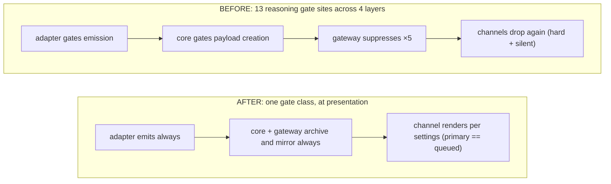

# Proposal: Normalized provider→channel stream grammar

## Summary

Every provider wire format (Anthropic Messages SSE, OpenAI Chat Completions,
OpenAI Responses, raw token streams, plus thin dialects like OpenRouter and the
claude-cli envelope) is normalized by core into **one** event grammar — final
text, thinking/reasoning, narration/commentary, tool activity, usage, and errors
— archived in the session record regardless of display settings, and projected
by each channel into the best UX that channel supports, with identical semantics
everywhere. The governing principle is **emit always, archive always, gate only
at presentation**. Integrating a new channel (GUI, TUI, Discord, anything) means
following this output contract and overlaying channel UX — nothing more.

The full normative specification is **vendored in this RFC's tree** at
[`0015/stream-grammar-spec.md`](0015/stream-grammar-spec.md) (from the
previously-pinned companion commit
[`0d354d9ed075`](https://github.com/Marvinthebored/openclaw-provider-stream-spec/tree/0d354d9ed075);
the companion repository remains the home of the evidence files — per-family
golden wire captures — and the executable conformance harness, 37 tests across
28 goldens, plus two red-team passes). This RFC is the design narrative; the
vendored spec is the contract. It extends the agent event I/O contract —
vendored at [`0015/agent-event-io-contract.md`](0015/agent-event-io-contract.md)
from openclaw/openclaw#92216 (merged 2026-06-13) by ragesaq — and marks its four
explicit amendments as **[AMENDS BASE]**.

> **Renumbering note:** originally filed as RFC 0008; renumbered to 0015 because
> `0008-context-engine-runtime-settings` was accepted on `main` in the interim.
> The renumber itself is purely mechanical; this revision's substantive updates
> are described in [Implementation status](#implementation-status).

Since this draft was filed (2026-06-15), the contract's core behaviors have
landed piecewise on `main` through maintainer-reviewed PRs (see
[Implementation status](#implementation-status)). The framework is
substantially ratified by landed commits; this RFC thus seeks to provide the
canonical documentation for future or peripheral development, and the
normative grammar for the parts not yet upstream.

## Motivation

Provider outputs diverge sharply at the wire — four families plus envelopes and
dialects — and at the time this RFC was drafted (2026-06-15) that divergence
leaked all the way to the channel. Two concrete failure classes followed:

1. **Reasoning is dropped at the source.** Adapters gate emission of wire-carried
   reasoning (`streamReasoning && onReasoningStream`, the `emitReasoning` discard
   path). Once dropped, no downstream setting can recover it, and it never reaches
   the archive.
2. **Gating is scattered.** Reasoning suppression alone is implemented at ~13
   sites across 4 layers (adapter, core, gateway ×5, channels — including silent
   drops). The same logical decision is re-litigated at every layer, so behavior
   drifts between providers, between channels, and even between primary and
   queued turns on the *same* channel.

The result was channels that compensated with provider-specific workarounds,
and user-visible bugs: reasoning that rendered for one model but not another,
finals folded into thinking blocks, double-posted text, empty "final" messages
on tool-only turns. The fix is to normalize once and gate once, in the only
place a display decision belongs — presentation. Several of these leaks have
since been fixed on `main` along the lines this RFC prescribes (see
[Implementation status](#implementation-status)); the motivation is kept in
draft-time tense as the baseline the framework was designed against.

## Goals

- One normalized event grammar over **any** transport; `seq` is the universal
  ordering key and faithfully reflects provider order.
- **Emit always / archive always**: adapters never drop wire-carried content;
  the gateway archives the normalized sequence before any subscriber trimming,
  independent of every display flag.
- **Gate only at presentation**: a single gate class, in the channel, driven by
  `/reasoning` and `/verbose`. Identical semantics on primary and queued turns.
- A normative **finality resolution** state machine so finals are never
  double-posted (replacement, not dedup heuristics) and never empty.
- A **conformance harness** so any channel or adapter can be checked against the
  contract mechanically.
- New-channel integration cost = output contract + channel UX overlay, nothing
  more.

## Non-Goals

- Does **not** change what models generate. Request-side knobs (thinking budget /
  `thinkingLevel`) stay as they are; this proposal never gates emission, archival,
  or mirroring of what *is* generated.
- Does **not** define channel visual design beyond minimum rendering
  requirements.
- Does **not** cover non-turn data (model catalogs, billing APIs).

## Proposal

### Normalized event grammar (§3 of the spec)

Five streams on the existing `AgentEventPayload` envelope:

- `assistant` — text deltas/snapshots, `phase: commentary | final_answer`,
  stable `id` only where the provider supplies one (F1 block index; F3 composite
  `item_id:content_index`; F2 falls back to `seq`). Synthesized counters are
  forbidden as idempotency keys (reconnect-unstable). Refusal text lanes map to
  `final_answer` — a refusal *is* the reply.
- `thinking` **[AMENDS BASE]** — `variant: raw | summary | redacted`; emission is
  **unconditional** whenever the wire carries reasoning; display is gated
  downstream. Redacted reasoning is a content-free marker. A dual-lane dedup rule
  (structured `reasoning_details[]` wins over the flat `reasoning` string) keeps
  OpenRouter-style double-population from producing phantom thoughts. Opaque
  continuation state (e.g. `signature_delta`) is adapter-transcript only, never a
  bus event.
- `tool` / `item` **[AMENDS BASE]** — `phase: start` emitted at the earliest
  moment call id + name are known, never delayed until argument assembly.
- `lifecycle` — `start | update | end | error`; normalized stop reasons and
  cumulative usage. `update` is diagnostics (debug log, not rendered by default).
  Abnormal transport close emits a synthetic `lifecycle/error reason:"stream_closed"`.

> **Shipped:** lane tagging at the source for F1 (openclaw/openclaw#96106) and
> F1e (openclaw/openclaw#99401); stable-id idempotency for the codex envelope
> (openclaw/openclaw#93343).

### Finality resolution (§3.5, normative)

A total dispatch over every catalogued stop signal selects one path —
**Finalize / Truncate / Reject / Suspend / Dead** — plus tool-yield (no final;
the agent loop continues). Key rules: zero-text finalize emits no final_answer;
Reject is a *destructive settle* (already-streamed unsafe text is retracted in
the channel, surviving only in the archive); the durable final **replaces** the
draft rendering of its segment, so double-posting is structurally impossible.

> **Shipped:** the reasoning/answer boundary seal for F2
> (openclaw/openclaw#95283); durable-replaces-draft on Telegram
> (openclaw/openclaw#98907). The full dispatch table remains spec-normative.

### Settings model (§4) — three flags, one gate class

| Flag | Layer | Semantics |
|------|-------|-----------|
| `thinkingLevel` | request only | how much the model thinks (the only flag that changes generation) |
| `/reasoning` → `reasoningLevel` (`off \| on \| stream`) | channel only | render thinking: not / at segment end / live-then-settled |
| `/verbose` → `toolVerbose` (`off \| on \| full`) | channel only | tool liveness / name+status rows / + display-safe args+results |

The architectural change, from 13 gate sites to one:

### Gateway contract & channel projection (§5, §7)

The hidden session-subscriber mirror extends to `thinking` (all variants),
`item`, and lifecycle terminal events — thinking is mirrored on its own stream,
never disguised as commentary **[AMENDS BASE]**. An archive tap persists the
normalized sequence before subscriber trimming, independent of UI visibility and
every flag (operator/audit surface only). Channels declare a capability tier and
project the same events into tier-appropriate UX; a normative truth table fixes
the rendering for each (event × setting) pair, including the degenerate-draft and
path-independence rules.

> **Shipped:** the commentary-phase mirror (openclaw/openclaw#92216); channel
> presentation gates on Discord (openclaw/openclaw#96106) and Telegram
> (openclaw/openclaw#97875, openclaw/openclaw#98907 — the full
> `/reasoning off|stream|on` matrix with a single stationary draft window).

#### Proposed channel capability tiers (answers a previously-unresolved question)

| Tier | Channel shape | Minimum obligations |
|------|---------------|---------------------|
| **T0 persist-only** | send-once messages, no edits (e.g. email-like, webhook sinks) | durable finals; durable 🧠/💬 only when the gate opts in; no draft window; MUST still honor zero-text-finalize and replacement semantics (skip, never double-send) |
| **T1 editable-draft** | messages editable after send (Discord, Telegram, Slack-like) | one stationary draft window per turn (edit in place, never delete+repost); durable final **replaces** the draft; persistent-XOR-window for gated lanes; lane distinguishability (🧠 vs 💬) in rendering |
| **T2 native-stream** | owned rendering surface (TUI, web GUI) | true token streaming per lane; all T1 semantics; lane transitions rendered as they resolve |

Path-independence rule (all tiers): the settled transcript after a turn MUST be
identical whether the turn ran primary or queued, and whether the channel
streamed or fell back to persist-only. Tier declaration is per-channel
capability metadata; conformance checks a channel only against its declared
tier. Discord and Telegram (T1) are the shipped references; this table is
proposed for maintainer amendment rather than left as an open question.

This taxonomy supersedes the legacy A/B/C/D surface letters in the vendored
spec's §7 (mapped there: A→T1, B→T2, C→T2 with a declared clamp, D→T0; the
spec's worked projections are relabeled accordingly — see its vendoring-sync
note).

### Reasoning privacy & archival boundary

Model thinking is privacy-sensitive, and this contract deliberately changes
*where it exists* before a display decision is made. The policy is stated
explicitly so it can be accepted or rejected as a design decision, not
discovered later:

- **Archival is display-independent, by design and openly.** `/reasoning` and
  `/verbose` are *display* settings; setting them `off` does not — and is not
  intended to — prevent wire-carried reasoning from being archived. This is
  the recoverability/auditability trade made in the Rationale, stated here as
  the user-facing expectation: reasoning the model generated exists in the
  session record regardless of what any channel rendered.
- **No new retention, access, or export surface.** Bus events are in-process.
  The archive tap writes into the *existing* session-record store and inherits
  its retention, access control, and operator-only visibility unchanged —
  adapters already persist reasoning replay state there today for
  continuation. This RFC adds no export path and no external mirror; the only
  new persistence is completeness of what the existing store records.
- **Mirroring stays inside the gateway trust boundary.** The hidden
  session-subscriber mirror delivers thinking to channel *sessions*, not to
  users; a channel adapter must apply the presentation gate before anything
  user-visible. Thinking is mirrored on its own stream, never disguised as
  commentary, so a gate cannot be bypassed by misclassification
  (**[AMENDS BASE]**, §5.1 of the vendored contract; its *Security and
  privacy* section governs the channel-projection half of this boundary).
- **Presentation gates are the only user-facing exposure decision.** No event
  reaching the bus or archive implies rendering; a channel shows thinking only
  per its `/reasoning` setting, identically on primary and queued turns.
- **Redacted stays redacted.** The `redacted` variant is a content-free marker
  end-to-end; encrypted or opaque continuation state is adapter-transcript
  only and never a bus event.
- **Reject retracts from channels, not from the archive.** A destructive settle
  removes already-streamed unsafe text from channel rendering; the archive
  retains it for audit, as it does today.

The merged implementations already ship this model: openclaw/openclaw#96106
emits raw Anthropic thinking and inferred pre-tool commentary as bus events
with display gated downstream, and openclaw/openclaw#97875 /
openclaw/openclaw#98907 gate channel exposure per setting. The
openclaw/openclaw#99401 review posed the same acceptance question for the CLI
envelope explicitly, and its merge (2026-07-04) answered it — maintainers
accepted raw thinking reaching the bus/archive with presentation gated
downstream for the CLI path as well. This section states that already-shipped
policy at the RFC level, for maintainers to ratify or amend.

### Conformance (§8)

The companion repo (pinned at
[`0d354d9ed075`](https://github.com/Marvinthebored/openclaw-provider-stream-spec/tree/0d354d9ed075))
ships an executable harness (37 tests, 28 golden captures) from live APIs for
each wire family, so adapters and channels can be validated against the
contract rather than against each other.

### Implementation status

The framework did not land as one PR; it landed as a series of
maintainer-reviewed fixes on `main`, each implementing a slice of this contract
for one wire family or one channel. As of 2026-07-05, all seven are merged:

| PR | Merged | Contract slice it implements |
|----|--------|------------------------------|
| openclaw/openclaw#92216 | 2026-06-13 | Base I/O contract behavior-half: gateway mirrors hidden commentary-phase assistant events (§5) |
| openclaw/openclaw#93343 | 2026-06-16 | Codex envelope: commentary de-duplicated across the raw response lane (stable-id idempotency, §7.3) |
| openclaw/openclaw#95283 | 2026-06-22 | F2 (`reasoning_content` dialects, e.g. deepseek): reasoning stream sealed when the answer lane opens under `/reasoning on` — the reasoning/answer boundary seal, one rule of the §3.5 finality machine |
| openclaw/openclaw#97875 | 2026-06-30 | Telegram: durable reasoning delivered when enabled — presentation-gated 🧠 lane (§4, §7) |
| openclaw/openclaw#96106 | 2026-07-01 | F1 (Anthropic SSE): pre-tool text tagged `phase: commentary` at the transport parser; raw thinking emitted as bus events with display gated downstream (session-record persistence of thinking replay pre-exists this PR) (§3.2 [AMENDS BASE], §5.1) |
| openclaw/openclaw#98907 | 2026-07-03 | Telegram: full streamed-lane presentation gate — `/reasoning off\|stream\|on` matrix, 🧠/💬 lane distinguishability, single stationary draft window, durable-before-final replacement (§4, §7 truth table); plus core-owned, channel-agnostic durable commentary delivery (`/verbose on`), closing openclaw/openclaw#90962 |
| openclaw/openclaw#99401 | 2026-07-04 | F1e (claude-cli stream-json envelope): native thinking parsed, bridged into the same `/reasoning` presentation gates, durable reasoning payloads (§3.2) |

The merged set ratifies the three pillars — emit-always with lane tagging at
the source, display gating decoupled from emission, one presentation gate —
across **F1, F1e, F2, and the codex envelope**, with **Discord**
(openclaw/openclaw#96106) and **Telegram** (openclaw/openclaw#97875,
openclaw/openclaw#98907) as the shipped presentation gates. With
openclaw/openclaw#99401 merged (2026-07-04), **every implementation slice
cited above is on `main`.** Remaining un-upstreamed: the conformance harness
itself, and per-family adapter completeness per the spec's catalogue.

These landings also closed independently-reported instances of exactly the
§Motivation failure classes: openclaw/openclaw#96079 (reasoning and pre-tool
narration produced but never surfaced on Discord) and openclaw/openclaw#90962
(inter-tool commentary clobbering tool progress on Telegram, filed by a third
party) — evidence the divergence was a recognized problem class, not a
single-reporter itch.

**Lineage.** The original stacked reference implementation (core
openclaw/openclaw#93342, `Marvinthebored:pipeline-core`; Discord overlay
Marvinthebored/openclaw#2) predates these landings and remains checkout-able as
a whole-framework build, but `main` is now the better reference for every slice
listed above.

## Applying this RFC to future work

The practical purpose of accepting this document: future PRs get held to a
section reference instead of re-deriving design in each review thread.

- **Adding a provider adapter** → map the wire onto the §3 grammar; emission is
  unconditional (§3.2) — never gate wire-carried content at the adapter; use
  provider-supplied stable ids, never synthesized counters (§3.1/§7.3); capture
  golden frames and run the conformance harness.
- **Adding or upgrading a channel** → declare a capability tier and project
  events per §5/§7; one presentation gate driven by `/reasoning` and `/verbose`
  (§4); identical semantics on primary and queued turns; the durable final
  replaces the draft (§3.5) — no dedup heuristics.
- **Changing reasoning/commentary display** → the gate lives in presentation,
  nowhere else (§4); thinking is opt-in only; thinking is never disguised as
  commentary (§5.1).
- **Triaging "reasoning doesn't show" reports** → first check what the model
  actually emitted (archive/goldens) before suspecting the pipeline: several
  models emit signature-only/empty thinking, and harness prompts that mandate
  narration suppress thinking summaries entirely. Absence of emission is not
  evidence of a pipeline fault.

## Rationale

**Why normalize in core rather than per-channel.** The wire divergence is real
and irreducible, but it is a *normalization* problem, not a *presentation*
problem. Pushing it to channels is what produced N copies of provider-specific
logic and the drift between them. Normalizing once means a new channel inherits
correct semantics for free.

**Why emit-always instead of gate-at-adapter.** Gating at the adapter is
efficient but lossy and irreversible: a dropped thought cannot be shown by a
later `/reasoning on`, nor audited. Emit-always + archive-always + presentation
gate costs a mirror/trim per subscriber (transport economy, applied at fan-out,
never to the archive) in exchange for recoverability, auditability, and a single
place to reason about display.

**Why replacement over dedup for finals.** Heuristic dedup of "did we already
post this?" is exactly the class of bug this replaces. Making the durable final
*replace* the draft rendering of its segment removes the question structurally.

**Trade-offs.** More events on the bus and a mandatory archive tap (storage +
fan-out cost). The conformance burden shifts onto channels (they must maintain a
draft for queued turns identically to primary turns). We judge these worth the
elimination of an entire bug class and the drop in new-channel integration cost.

## Resolved since the initial draft

- **deepseek reasoning/text boundary** — resolved on `main` by
  openclaw/openclaw#95283 (reasoning sealed when the answer lane opens), exactly
  the §3.5 boundary rule.
- **Per-family catalogue completeness** — the capture campaign has since
  wire-verified all nine consumed API surfaces (F1, F1e, F2 ×3 dialect groups,
  F3, F5, Harmony-native, codex envelope) against raw goldens; Gemini (F5) is
  no longer pending.
- **Base-contract coordination (partially)** — the behavior-half of the base
  contract merged as openclaw/openclaw#92216 (2026-06-13). The doc-half lives
  vendored here as the separately-ownable copy.

## Unresolved questions

- **Sidecar doc home.** Whether the vendored contracts
  ([`0015/agent-event-io-contract.md`](0015/agent-event-io-contract.md),
  [`0015/stream-grammar-spec.md`](0015/stream-grammar-spec.md)) should later be
  upstreamed into the maintained docs tree, or this RFC's sidecar remains their
  home. Maintainer preference wanted. (The normative *content* is now in-tree
  either way; this is only a question of final location.)
- **Conformance harness home.** The executable harness (37 tests / 28 goldens)
  and the golden captures live in the companion repo (pinned); whether any of
  it should move in-tree as adapter CI is a maintainer call.

*(Resolved in this revision: channel tier minimums — now a concrete proposed
table under §Gateway contract & channel projection, awaiting maintainer
amendment rather than open-ended input.)*
