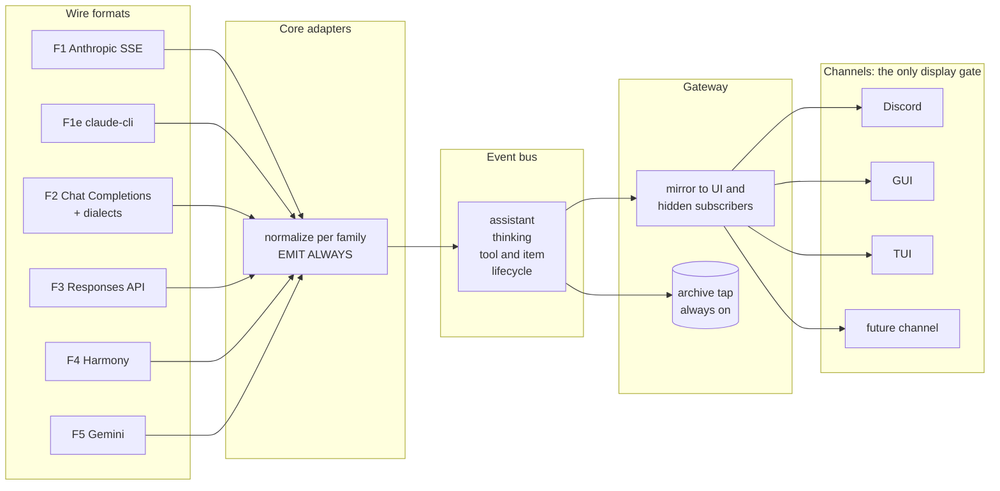
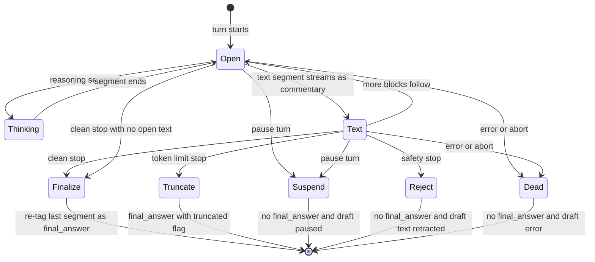
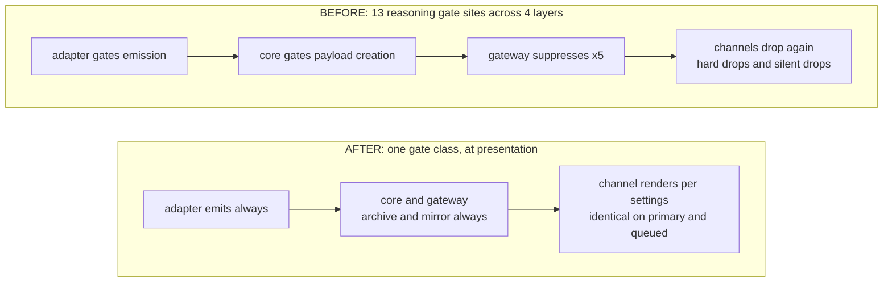

<!--
Normative stream-grammar specification for RFC 0015 — vendored in-tree.

Origin: Marvinthebored/openclaw-provider-stream-spec @ 0d354d9ed075 (the commit this RFC
previously pinned as normative), vendored 2026-07-06 in response to review feedback that a
personal companion repository should not be the normative source for an accepted RFC.
THIS COPY IS NOW THE NORMATIVE TEXT; the companion repo remains the home of the evidence
files (golden wire captures) and the executable conformance harness it references.

Vendoring sync (2026-07-07, addressing review findings): (1) base-contract reference
repointed to the in-tree sidecar agent-event-io-contract.md; (2) stale F5 "catalogue
pending" evidence status superseded (completed 2026-06-18); (3) §7 channel tier taxonomy
unified with the RFC's T0/T1/T2 table — legacy letters map A→T1, B→T2, C→T2 with a
declared clamp, D→T0. The reasoning archival boundary is UNCHANGED from the pinned text.
-->

# Provider Content Pipeline — Normalized Stream Specification

**Version:** 0.4-draft (2026-06-12) · **Status:** Phase 1, post-red-team-2 + full capture reconciliation (all families golden-verified; 6 reconciliation contradictions folded)
**Base:** extends [`agent-event-io-contract.md`](agent-event-io-contract.md) (ragesaq, from openclaw/openclaw#92216 — vendored alongside this spec in the RFC 0015 tree, its four amendments folded inline).
Explicit amendments to the base contract are marked **[AMENDS BASE]** — there are four
(§3.2, §3.3, §5.1, §7.3). Everything else is additive.
**Evidence:** all wire-format claims trace to `evidence/*.md`; golden captures exist for
F1/F1e/F2 (pioneer, OpenRouter, deepseek-direct, moonshot)/F3 and gemini (F5) — the F5
catalogue, marked pending in the 0.4 original, was completed 2026-06-18 (see the RFC's
Resolved-since-draft list). Red-team passes: `RED-TEAM-claude.md` (27 findings → v0.2),
`RED-TEAM-codex.md` (16 findings → v0.3).

---

## 0. Goal and non-goals

**Goal.** All information returned by a provider's API — final text, thinking/reasoning,
narration/commentary, tool activity, usage, errors — is (a) normalized by core into one
event grammar on any transport, (b) archived in the session record regardless of display
settings, and (c) projected by each channel into the best UX that channel supports, with
identical semantics everywhere. Integrating a new channel (GUI, TUI, Discord, anything)
means following this spec's output contract and overlaying channel UX — nothing more.

**Non-goals.** This spec does not change what models generate (request-side knobs like
thinking budget stay as they are), does not define channel visual design beyond minimum
requirements, and does not cover non-turn data (model catalogs, billing APIs).

**Design principle:** *Emit always, archive always, gate only at presentation.*

## 1. Wire-format landscape (evidence summary)

Four wire families plus thin envelopes/dialects:

| # | Family | Used by | Evidence file |
|---|--------|---------|---------------|
| F1 | Anthropic Messages SSE | Anthropic direct API | `anthropic-messages-sse.md` |
| F1e | claude-cli stream-json (envelope over F1) | Claude CLI backend (subscription auth) | `claude-cli-streamjson.md` (live-captured) |
| F2 | OpenAI Chat Completions SSE (+ reasoning-field dialects) | pioneer, OpenRouter, deepseek, Kimi/moonshot, ollama-compat, most aggregators | `openai-families.md` §A, `pioneer-dialect.md`, `openrouter-dialect.md`, **`f2-dialect-notes.md`** (9-dialect capture comparison) |
| F3 | OpenAI Responses API streaming | OpenAI hosted reasoning models, Codex app-server | `openai-families.md` §B |
| F4 | Harmony channel grammar (token-level; re-exposed via F2/F3 or server-native envelopes) | gpt-oss / open-weight | `openai-families.md` §C + live ollama re-exposure addendum (captured: analysis survives as native `message.thinking` / compat flat `delta.reasoning`; ollama-native envelope documented incl. object-form tool arguments) |
| F5 | Gemini streamGenerateContent SSE | Google direct API (aggregators re-expose via F2; antigravity CLI untested) | `gemini-genai-sse.md` (live-captured incl. thoughtSignature) |

Key asymmetries the grammar must absorb (verified in evidence):

- **Finality is positional in F1/F2/F3**; only F4 tags it explicitly (`final` channel).
- **Thinking sub-lanes are plural**: F1 signed + redacted; F3 raw CoT + summary +
  encrypted; F2 dialects use 4 sibling field names inconsistently; F4 `analysis`.
- **Thinking is optional per turn even when enabled** (claude-cli captures).
- **Delta-only and snapshot-only frames both occur** and both must be valid.
- **Mid-stream errors differ by dialect**, including OpenRouter errors smuggled inside
  normal chunks, and streams that die with no terminal frame at all.

## 2. Architecture



Two distinct persistence stores, never to be conflated (red-team AS5-02):

1. **Adapter provider-native transcript** — byte-stable provider blocks needed for API
   replay (F1 signed/redacted thinking incl. signatures, F3 `encrypted_content`,
   OpenRouter `reasoning_details[].data` AND `reasoning_details[].signature` — signatures
   ride on displayable `reasoning.text` entries too and must be stripped before any
   `thinking` event is emitted). Lives with the adapter
   (existing: `session-transcript-repair.ts`). Opaque material **never leaves it**.
2. **Gateway archive tap** — the normalized event sequence (§5.4). Contains displayable
   content and markers only; never signatures/encrypted blobs.

## 3. Normalized event grammar

Envelope: unchanged (`AgentEventPayload`). `seq` is the universal ordering key; adapters
emit in provider order (F1 block index, F3 `sequence_number`, F2 arrival order, F4 token
order) so `seq` is faithful.

### 3.1 `stream: "assistant"`

```ts
{ delta?: string; text?: string; phase?: "commentary" | "final_answer";
  id?: string; status?: "in_progress" | "completed"; truncated?: boolean }
```

- Delta-only frames are valid (no `text`). Snapshot-only frames are valid (no `delta`).
- `id` identifies the text segment **only where the provider supplies a stable id**.
  F1: block index. F3: **composite** — `item_id:content_index` for text/refusal (one
  item can hold multiple content parts; `item_id` alone collapses distinct segments,
  red-team COD-AS4-01). F2 has none; F2 adapters omit `id` and consumers fall back to
  `seq` keys (§7.3). Synthesized counters are forbidden as idempotency keys
  (red-team AS2-05: they are reconnect-unstable).
- `truncated: true` marks a final answer cut short by token limits (§3.5).
- Refusal text lanes (F2 `delta.refusal`, F3 `response.refusal.*`) are user-facing
  responses: they map to `assistant` with `phase:"final_answer"` — a refusal IS the
  reply. (Distinct from F1 `stop_reason:"refusal"`, which is a mid-stream safety stop
  with unsafe partial content — see §3.5.)

### 3.2 `stream: "thinking"` (canonical definition — contract addendum) **[AMENDS BASE]**

This section supersedes the base contract's "`stream: 'thinking'` **or drop**, unless
explicitly configured for reasoning display" (Provider mapping guide rows for
Claude/Anthropic thinking and Harmony analysis): adapters may NOT drop wire-carried
reasoning; emission is unconditional, display is gated downstream (red-team COD-AS6-01).

```ts
{
  delta?: string;          // incremental reasoning text
  text?: string;           // snapshot/accumulated reasoning text
  id?: string;             // reasoning segment id, when provider-stable
  variant: "raw" | "summary" | "redacted";
  phase?: "start" | "end"; // segment boundaries; text/delta frames omit phase
  tokens?: number;         // see population rule below
}
```

- `variant: "raw"` — chain-of-thought (F1 `thinking_delta`, F3 `reasoning_text.*`,
  F4 `analysis`, F2 sibling reasoning fields).
- `variant: "summary"` — provider-generated summary (F3 `reasoning_summary_*`,
  OpenRouter `reasoning_details[type=reasoning.summary]`).
- `variant: "redacted"` — reasoning occurred, content withheld. Emitted as a content-free
  **marker** (`phase:"start"` then `phase:"end"`, optional `tokens`). Sources: F1
  `redacted_thinking` AND F1 signature-only thinking blocks (`display:"omitted"` — a
  block that opens, receives only `signature_delta`, closes; this IS the redacted case,
  per evidence §3); F3 encrypted-only reasoning items; OpenRouter encrypted-only details.
- **`tokens` population rule** (red-team Q2): thinking-token counts come from usage
  frames, not thinking blocks — F1 `message_delta.usage.output_tokens_details.thinking_tokens`,
  F3 `response.completed.usage.output_tokens_details.reasoning_tokens`. The adapter
  back-fills `tokens` on the segment's `phase:"end"` marker when the usage frame arrives
  after the segment (F1: it always does); if usage arrives only at turn end, the adapter
  MAY emit one summary marker update. Channels must tolerate `tokens` being absent.
- **Dual-lane dedup rule** (red-team Q5 + COD-AS7-01, OpenRouter): when a dialect
  populates both the flat `reasoning` string and structured `reasoning_details[]`,
  **the structured lane wins and the flat lane is ignored**. Segment identity within
  `reasoning_details[]` is the deterministic key: `id` when present, else
  `format + index + type-group` (type-group: displayable = text|summary, opaque =
  encrypted). Per segment key: emit ONLY the displayable variant when one exists;
  a `redacted` marker is emitted only for segment keys with NO displayable entry —
  the encrypted entry is the same reasoning round-tripped, not additional thinking.
  Entries with absent ids AND absent indexes collapse to one segment per type-group
  per turn (conservative; capture-verify per dialect). Note: `format` may be the
  literal string `"unknown"` (observed: deepseek-via-OpenRouter) — the key stays
  deterministic (`unknown+0+displayable`); adapters must not special-case it.
  Capture-validated (2026-06-12): all three OpenRouter models populate BOTH lanes
  simultaneously (structured-wins is necessary, not theoretical); GPT-5-mini emits
  summary then encrypted under the same index — displayable-wins yields one summary
  segment and no marker, which is correct.
- **Opaque continuation state is NOT bus data** — adapter transcript only (§2). This
  includes `signature_delta`: consumed by the adapter, never an event (see §6).
- Delta-only AND snapshot-only thinking frames are valid.
- **Emission is unconditional** whenever the wire carries reasoning content. The
  `streamReasoning && onReasoningStream` gate (`embedded-agent-subscribe.ts:1143`, both
  conditions) and the `emitReasoning` discard (`openai-transport-stream.ts:2963`) are
  removed as emission gates; `onReasoningStream` survives only as a channel-layer
  rendering hook.

### 3.3 `stream: "tool"` / `"item"`

`AgentItemEventData` per base contract. **[AMENDS BASE]** This spec tightens the base
contract's "emit `start` whenever the provider/runtime knows the call in advance" to:
emit `phase:"start"` at the earliest moment call id+name are available (first F2
tool_call delta, F1 `content_block_start`, F3 `output_item.added`) — never delayed
until argument assembly completes.

### 3.4 `stream: "lifecycle"`

Phases `start | update | end | error`.

`data` carries: normalized stop reason (`completed | truncated | stop_sequence |
tool_use | paused | refusal | content_filter | error`), `status` on `end`
(`completed | incomplete`), cumulative usage (incl. thinking tokens), provider id/model,
and diagnostics.

- **`update` events are diagnostics** (F1 `fallback` block → `model_fallback`;
  claude-cli `rate_limit_event`, `system/status`; F3 `response.queued`). Rendering rule
  (red-team Q4): channels do NOT render `lifecycle/update` by default — debug-level log
  only. A channel MAY surface specific diagnostics (e.g. rate-limit warnings) as a
  status line; that is channel policy, not a spec obligation.
- **`response.incomplete` is NOT uniformly truncation** (red-team Q3 + COD-AS2-02): it
  branches on `incomplete_details.reason` — token/output-limit reasons follow the
  Truncate path; content-filter/safety reasons follow the Reject path; unknown reasons
  end the turn with `lifecycle/end status:"incomplete"` and NO final_answer. See §3.5.
- **Mid-stream provider errors must surface as `phase:"error"`** even when the dialect
  disguises them as normal frames (OpenRouter `finish_reason:"error"` + in-chunk `error`
  key).
- **Stream death** (red-team AS2-03): if the transport closes abnormally with no terminal
  frame, the adapter MUST emit a synthetic `lifecycle/error` with `reason:"stream_closed"`,
  treated identically to an in-band error (abort guard active, no final_answer re-tag).

### 3.5 Finality resolution (normative)



(Exit-path details — which stop signals select which path, retraction, resume-is-a-new-run —
are normative in the dispatch table and rules below; the diagram is the shape only.)

Terminal-signal dispatch (total over all catalogued stop signals):

| Terminal signal | Path |
|---|---|
| F1 `end_turn`/`stop_sequence`, F2 `stop`, F3 `response.completed`, F4 `final` channel end | **Finalize** |
| F1 `max_tokens`, F2 `length`, F3 `response.incomplete` with token/output-limit `incomplete_details.reason` | **Truncate** |
| F1 `refusal`, F2 `content_filter`, F3 `response.incomplete` with content-filter/safety `incomplete_details.reason` | **Reject** — partial text is unsafe/non-final (evidence F1 §6); never delivered as final_answer |
| F3 `response.incomplete` with unknown `incomplete_details.reason` | `lifecycle/end status:"incomplete"`, NO final_answer (conservative) |
| F1 `pause_turn` | **Suspend** |
| F1 `tool_use`, F2 `tool_calls` AND legacy `function_call`, F3 function_call yield | turn yields to runtime tool execution; **no final_answer event**; the agent loop continues and finality is resolved by a later provider turn |
| in-band `error`, abort, `stream_closed` | **Dead** |

Additional rules:

- **Zero-text finalize** (red-team AS2-04): reaching Finalize/Truncate with no completed
  text segment emits NO final_answer event — the turn ends with `lifecycle/end` alone.
  Channels never deliver an empty final message.
- **Reject is a destructive settle** (red-team COD-AS2-01): partial text of the rejected
  segment has already streamed into live drafts as commentary by the time the safety
  stop arrives. On Reject, channels MUST retract it — replace the rendered text of the
  rejected segment with a placeholder line, DECIDED (T2):
  "⛔ response withdrawn (provider safety stop)" — in the draft's settled error state.
  The partial text survives only in the archive. Adapters for providers whose safety
  stops retroactively invalidate text MAY instead buffer the trailing text segment
  until the terminal reason is known (latency trade-off; channel retraction remains
  the required safety net either way).
- **F1e single final source** (red-team COD-AS2-03): the inner F1 text deltas are live
  progress ONLY; `result.result` is the single authoritative final-reply source
  (fallback to accumulated streamed text only when `result` is missing/unusable). An
  F1e adapter never finalizes from both paths.
- Channels render live text transiently (draft); the durable final message **replaces**
  the draft rendering of that segment (key: §7.3). Double-posting is structurally
  prevented by replacement, not dedup heuristics.
- F4 resolves finality eagerly via the `final` tag.

## 4. Settings model

### 4.1 The three flags

| Flag | Type | Layer it may act on | Semantics |
|------|------|--------------------:|-----------|
| `thinkingLevel` (`off…max/adaptive`) | **request knob** | provider request only | How much the model thinks. The only flag that changes what is generated. Never gates emission/archival/mirroring of what IS generated. |
| `/reasoning` → `reasoningLevel` (`off \| on \| stream`) | **presentation** | channel only | `off`: thinking lane not rendered. `on`: rendered once per reasoning segment at segment end. `stream`: rendered live, then settled. |
| `/verbose` → `toolVerbose` (`off \| on \| full`) | **presentation** | channel only | `off`: liveness indicator only (defined in §11). `on`: tool name + status rows. `full`: + display-safe args/result summaries. |

Gateway payload trimming (stripping `data.result` unless `full`) is transport economy
per subscriber at fan-out — never applied to the archive tap.

### 4.2 Gate model, before → after



(The 13 before-sites are enumerated with file:line in `evidence/openclaw-internals.md` §1.)

### 4.3 Behavior truth table (normative, T1)

Path-independence (primary == queued) is a **requirement on channels**, not an observed
property: a T1 channel MUST maintain an active draft for queued/followup turns
exactly as for primary turns (red-team AS3-01 — today followup turns may run without an
in-progress draft, silently degrading `/reasoning stream`; migration item 13).

| E \ settings | `/reasoning off` | `/reasoning on` | `/reasoning stream` |
|---|---|---|---|
| `thinking` raw/summary | not rendered | rendered at segment end (channel's quoted/collapsed form, §7.2 overflow rules) | rendered live in draft, settles at segment end |
| `thinking` redacted marker | not rendered | "thought privately (N tok)" row (`(N tok)` omitted when `tokens` absent) | same as `on` |

| E \ settings | `/verbose off` | `/verbose on` | `/verbose full` |
|---|---|---|---|
| `item` start/update/end | liveness indicator only (§11) | tool name + status row, updated in place | + display-safe args/result summary |
| `command_output` etc. | not rendered | summarized row | fuller display-safe detail |

| E (always-on rows) | rendering — not configurable |
|---|---|
| `assistant` commentary/deltas | streamed into the transient draft, interleaved with item rows by `seq` |
| `assistant` final_answer | durable message on the reliable path; replaces the draft rendering of that segment |
| `assistant` final_answer `truncated:true` | as above + visible suffix line "⚠️ truncated (token limit)" — DECIDED (T2): suffix line, not reaction-only |
| `lifecycle` error (incl. refusal/content_filter/stream_closed) | error notice; draft settles to error state; for Reject (§3.5) the channel MUST also retract already-rendered text of the rejected segment (destructive settle) |
| `lifecycle` end | settles the draft (paused state for `reason:"paused"`) |
| `lifecycle` update | NOT rendered (debug log); channel MAY surface select diagnostics as status |

Degenerate-draft rule (red-team AS3-03): if at settle time the draft contains nothing
(no thinking, no tool rows, no commentary — e.g. both flags off on a tool-only turn),
the draft is silently dismissed, not settled to an all-zero summary line. A draft is
created lazily on the first event that would render into it.

Archival: **every event above is archived regardless of every setting.**

## 5. Gateway contract (delta vs #92216)

1. **[AMENDS BASE]** Hidden session-subscriber mirror extends to `stream:"thinking"`
   (all variants), `item`, and lifecycle terminal — same exact-subscriber selection,
   `dropIfSlow:true`, abort guard. **This explicitly supersedes the base contract's
   "Must not mirror as hidden commentary → Private reasoning or analysis events"
   item** (red-team AS6-01): thinking IS mirrored, on its own stream — never disguised
   as commentary; display suppression is the channel's job per §4.3. Implementers of
   the base contract alone will build a thinking-dropping gateway; this amendment must
   land in the base contract doc itself, not only here.
2. `final_answer` exclusion from the progress mirror: unchanged.
3. Delta-only assistant frames must flow (upstream main already conforms; 6.5 base does
   not — migration item 9).
4. **Archive tap**: gateway persists the normalized event sequence per session (pattern:
   `persistGatewaySessionLifecycleEvent`), before subscriber trimming, independent of
   `isControlUiVisible` and every flag. Drop-if-slow never applies to the archive.
   **Access control** (red-team AS5-01): the archive tap is operator/audit surface ONLY.
   No channel-facing component may read it; channel sessions cannot query it. Raw
   thinking in the archive is a privacy surface — see §10.7.
5. Final answer delivery never depends on a drop-if-slow path (base rule restated).
6. **Dropped-progress rule** (red-team AS4-02): events dropped by `dropIfSlow` for a
   subscriber are NOT replayed to it from the archive after the turn. The archive serves
   audit, not channel catch-up. Channels may catch up only within the active turn
   (before `lifecycle` end), via §7.3's replay protocol.

## 6. Per-family normalization (summary; full tables in evidence files)

| Lane / frame class | F1 Anthropic SSE | F1e claude-cli | F2 CC dialects | F3 Responses | F4 Harmony |
|------|------------------|----------------|----------------|--------------|------------|
| commentary | `text` block before further blocks | inner F1 rule | `delta.content` while turn open — may be JSON `null` during a reasoning phase (deepseek): treat null as absent, never as empty text | non-final `message` items | `commentary` channel free text |
| final answer | last text segment per §3.5 dispatch | `result.result` authoritative; inner deltas progress-only (§3.5 single-source rule) | accumulated content per §3.5 | last `message` item per §3.5 | `final` channel (explicit) |
| refusal text lane | n/a (F1 refusal is a stop reason → Reject path) | n/a | `delta.refusal` → assistant/final_answer | `response.refusal.*` → assistant/final_answer | n/a |
| thinking raw | `thinking_delta` → raw | inner F1 rule + `assistant` snapshot `thinking` blocks | sibling reasoning fields (probe order per evidence; structured-wins dedup §3.2) | `reasoning_text.*` → raw | `analysis` → raw |
| thinking summary | — | — | `reasoning_details[type=reasoning.summary]` | `reasoning_summary_*` (segment key `item_id:summary_index`) | — |
| thinking redacted | `redacted_thinking` AND signature-only blocks → marker | inner F1 rule | encrypted-only details → marker (dedup §3.2) | encrypted-only item → marker | — |
| `signature_delta` / signature material | **adapter transcript only — never a bus event** | same | OpenRouter: `signature` arrives as a closing `reasoning_details` entry carrying ONLY `signature` (no `text`), on the same `index` as the segment's text chunks (capture-verified) → strip to adapter transcript, attach to that segment. A segment is a redacted **marker** only when NO entry of it ever carried displayable text — a signature-only *closing chunk* of a text-bearing segment is NOT a marker | n/a (`encrypted_content` same rule) | n/a |
| `citations_delta` | PROVISIONAL: transcript-only + `unsupported_frame` diagnostic, pending evidence (open question F1 §9) | same | n/a | `output_text.annotation.added` → item meta on the owning segment | n/a |
| tool calls | `tool_use`/`server_tool_use` blocks → item start/update/end; `*_tool_result` snapshot blocks (web_search/web_fetch/etc.) → item end for owning `tool_use_id`, display-safe summary | inner F1 rule + CLI tool frames | `delta.tool_calls[]` by index | `function_call` + built-in `*_call.*` lifecycles | `commentary` w/ `to:` recipient |
| usage | `message_delta.usage` (cumulative) → lifecycle | `result.usage`/`modelUsage` → lifecycle | final usage chunk (when offered) → lifecycle. Dialect variance (capture-verified, `f2-dialect-notes.md`): top-level `chunk.usage` (OpenAI/OpenRouter), inside `choices[0].delta` on the stop chunk (Moonshot), post-stop empty-`choices[]` chunk (pioneer) — adapters probe all three | `response.completed.usage` → lifecycle | outer API's rule |
| errors | in-band `error` → lifecycle error | `result.is_error` → lifecycle error | HTTP-level + OpenRouter in-chunk errors → lifecycle error | `error`/`response.failed` → lifecycle error; `response.incomplete` → lifecycle end `status:"incomplete"` (§3.4) | outer API's rule |
| session/setup frames | `message_start` → lifecycle/start (provider/model/message metadata); `message_stop` → lifecycle/end after §3.5 dispatch | `system/init` → lifecycle start metadata; `system/status` → lifecycle update diag; `rate_limit_event` → lifecycle update diag | `delta.role` (first chunk) → consumed, no event | `response.created`/`queued` → lifecycle start/update diag | — |
| transport/control & metadata | — | — | `[DONE]` → transport-only, consumed — but OPTIONAL per dialect (pioneer omits it): stream close is the authoritative end, never block on `[DONE]`; unknown post-stop chunks (e.g. pioneer `x_pioneer`) → lifecycle diagnostic; `logprobs` → debug metadata, no event (Phase-1 `unsupported_frame` if requested); `native_finish_reason`/`openrouter_metadata`/`provider` (always present despite docs claiming opt-in) → lifecycle diagnostic metadata | `sequence_number` → consumed as seq source | — |
| full snapshots | — | `assistant` frames: reconstruction source + thinking-block extraction; no bus re-emission when `stream_event` deltas present | n/a (no snapshots in F2) | `*.done` events: correctness checks; no duplicate emission | — |
| keepalives/noise | `ping` → dropped | — | SSE comments (`: OPENROUTER PROCESSING`) → dropped safely | `response.in_progress` → dropped/diag | control tokens consumed by parser |
| structural framing | `content_block_start/stop` for supported types → segment boundaries, no standalone event, NO diagnostic | inner F1 rule | — | `content_part.added/done` for supported part types (output_text/refusal/reasoning_text) → structural/indexing only, no event, NO diagnostic; `*.done` snapshots → correctness checks | channel-boundary tokens consumed by parser |
| **Phase-1 out of scope** | — | `control_request/response` (native permission handshake, existing path) | — | audio, image-generation, MCP-call, custom-tool-call, unsupported content-part types → `unsupported_frame` diagnostic, Phase 2 | — |

### F5 — Gemini streamGenerateContent (direct API; evidence `gemini-genai-sse.md`, live-captured)

| Frame/field | Disposition |
|---|---|
| `parts[]` text (no `thought`) before functionCall parts | `assistant`/commentary (positional, as F1) |
| `parts[]` text, last segment at `finishReason:"STOP"` | §3.5 Finalize → final_answer |
| `parts[]` with `thought:true` | `thinking`, **variant `summary`** (Gemini exposes thought *summaries* via `includeThoughts`, not raw CoT) |
| `thoughtSignature` (sibling key inside the same part as `functionCall`) | adapter transcript ONLY — stripped before any bus event |
| `parts[].functionCall` | `item` start (id+name known immediately, §3.3) |
| `finishReason: STOP / MAX_TOKENS / SAFETY / RECITATION / OTHER / MALFORMED_FUNCTION_CALL` | Finalize / Truncate / **Reject** / **Reject** / lifecycle end incomplete, no final_answer / item end failed + lifecycle end |
| `usageMetadata` (incl. `thoughtsTokenCount` → §3.2 tokens rule) | lifecycle usage |
| `safetyRatings`, `citationMetadata`, `modelVersion`, `responseId`, `finishMessage` | lifecycle diagnostic metadata |
| aggregated Gemini (OpenRouter etc.) | arrives as F2 dialect — F2 rules apply, not F5 |

Unknown frames: never silently dropped — `unknown_frame` lifecycle diagnostic + counter.
Catalogued-but-unimplemented frames use `unsupported_frame` (distinct, so dialect drift
and scope gaps are separately observable). Scoping note (red-team F3-AS1-05): the
`unsupported_frame` dispositions above ARE the Phase-1 totality answer for those frames;
conformance §8.1 counts them as covered.

## 7. Channel projection guide

### 7.1 Capability tiers

| Tier | Capabilities | Examples | Legacy id |
|------|--------------|----------|-----------|
| **T0 persist-only** | append-only / send-once messages, no edits | minimal bridges, webhook sinks | D |
| **T1 editable-draft** | editable draft + durable messages | Discord, Telegram, ClickClack | A |
| **T2 native-stream** | owned rendering surface — full event UI or status pane | Control UI / GUI; TUI status = T2 with a declared clamp | B, C |

Required for every tier: final answer exactly once; errors surfaced; "agent is working"
backed by real events. Settings clamp to tier ceiling **declaredly, not silently** — a
status-line TUI is a T2 surface with a clamped ceiling, not a separate tier. Minimum
per-tier obligations are normative in RFC 0015 §"Proposed channel capability tiers".
*[RFC 0015 vendoring sync, 2026-07-07]*

### 7.2 Worked projections

**T1 — Discord (reference).** UX policy RATIFIED (Peter, 2026-06-12):
🧠-blockquote thinking, collapse-to-summary settle, truncation suffix line, Reject
placeholder — these are decisions, not suggestions. Liveness: native typing indicator
from first event to settle (§11); the activity draft is created lazily by the first
rendering event. One
in-place-edited activity draft per turn, commentary + item rows interleaved by `seq`;
thinking per §4.3. (Telegram: same model — `sendChatAction` typing + lazy draft.) Formatting: 🧠-prefixed
blockquote for thinking segments (spoiler/thread as channel-config alternatives).
**Overflow rules** (red-team AS3-02): the draft has a hard message-size budget
(Discord: 2000 chars). Per-lane budgets: thinking segments render head+tail with
"… [N chars omitted]" elision; item rows cap at name+status under pressure; commentary
is elided last (oldest first). The draft NEVER splits into multiple messages. Full
content is always in the archive; elision is presentation. Draft settles to a one-line
summary ("🧠 n segments · m tools · k s"); per §4.3 a content-free draft is dismissed
instead. Hard drops (`message-handler.process.ts:602/645`) and silent
routeReply/dispatch drops are **deleted**; rendering policy is the truth table,
identical on primary and followup paths (which requires followup turns to carry an
active draft — migration item 13).

**T2 — Control UI.** Closest to spec today; gains redacted markers, variant labels,
truncation indicators, unified item rows. `response.incomplete`-style ends render as
"incomplete" state, not error (§3.4).

**T2 (clamped) — TUI.** Status line: spinner + current item title + last commentary line;
`/reasoning stream` clamps to `on` (declared); thinking renders as a dim block post-
segment. Final answer printed normally.

**T0 — minimal text.** Single "working…" notice or nothing; final answer + errors
only; clamping declared on settings change.

### 7.3 Idempotency, ordering, reconnect

**[AMENDS BASE]** Key priority — base contract says "`runId + seq`, or a provider item
id when one exists." This spec makes the amendment explicit and conditional (red-team
AS6-02): use `runId + id` ONLY where `id` is provider-stable — F1 block index; F3
**composite keys** (`item_id:content_index` for text/refusal, `item_id:summary_index`
for summaries; bare `item_id` only for item-level lifecycle) per red-team COD-AS4-01.
Otherwise `runId + seq` (always for F2). Synthesized ids are forbidden as keys.

- item: `runId + itemId + phase`
- final answer: reply-path idempotency, never the progress key
- interleave by `seq`

**Reconnect protocol** (red-team AS4-01): a channel persists `lastRenderedSeq` per
`runId` in its own storage. On reconnect **within an active turn**, it requests replay
from `lastRenderedSeq + 1`; events ≤ `lastRenderedSeq` are discarded. `final_answer` is
never replayed via the progress path. After `lifecycle` end, no progress replay (§5 item 6).

**Crash recovery** (red-team AS4-03): on restart, the channel checks for runs with an
archived `lifecycle` start but no terminal event and settles their orphaned drafts to
"agent interrupted"; the final answer is not redelivered without user re-trigger.

## 8. Conformance

1. **Adapter**: golden-capture replay — emitted normalized event sequence equals fixture
   (order, streams, phases, variants, truncation flags). Mapping total over family
   catalogue §2 (Phase-1 `unsupported_frame` dispositions count as covered). Must
   include: refusal stop, token-limit stop, pause_turn (F1), zero-text tool-only turn,
   stream-death (connection cut mid-stream → synthetic `stream_closed`), dual-lane
   reasoning dedup (F2/OpenRouter).
2. **Gateway**: base mirror tests + thinking-mirror + archive tap (events persisted with
   all flags off, Control UI hidden) + delta-only flow + no-archive-replay-after-end +
   archive unreadable from channel-session scope.
3. **Channel**: truth-table cells reproduced against a scripted event sequence on a real
   configured channel, **primary AND queued origin — projections must be identical**;
   reconnect (mid-turn) produces no duplicates; crash-orphaned draft settles; overflow
   elision; truncated-final indicator; refusal renders as error not answer; final answer
   exactly once.
4. **Settings**: flipping `/reasoning` and `/verbose` mid-turn affects rendering only —
   the archived event record for the turn is byte-identical. (The decoupling proof.)

Goldens: ALL families captured — F1 (Anthropic ×3), F1e (claude-cli ×2), F2 (pioneer,
OpenRouter ×3, deepseek-direct, kimi-k2.6, moonshot-base), F3 (Responses reasoning),
F4-via-ollama (gpt-oss:20b, native ×3 + compat ×2), F5 (gemini ×3 incl.
thoughtSignature). Raw Harmony token grammar remains docs-only, but adapters never see
it — they see server re-exposures, which ARE captured.

## 9. Migration map (current code → spec)

| # | Current behavior (evidence) | Spec target | Layer |
|---|------------------------------|-------------|-------|
| 1 | embedded: commentary dropped at TWO sites — bus-emission short-circuit (`handlers.messages.ts:678`) AND visible-output suppression (`handlers.messages.ts:45-47`); both must go — removing one leaves inconsistent state | emit `assistant`/commentary on bus AND route to payloads | adapter |
| 2 | embedded: thinking emission gated at `embedded-agent-subscribe.ts:1143` by BOTH `streamReasoning` AND `onReasoningStream`; remove both as emission gates; `onReasoningStream` becomes channel rendering hook only | emit always, variants per §3.2 | adapter |
| 3 | claude-cli: `thinking_delta`/`signature_delta` not parsed AND `assistant` snapshot `thinking` content blocks not extracted (`cli-output.ts`) | parse both paths → thinking events; signatures → adapter transcript | adapter |
| 4 | codex: Harmony commentary as `item`/preamble + emit-site dedup (`event-projector.ts:1010-1030`, `lastCommentaryProgressTextByItem`) | re-route to `assistant`/commentary; move dedup to channel layer | adapter |
| 5 | ACP: thinking off-bus at ALL sites — `translator.ts:1116`, `translator.replay.ts:14,57`, any `event-mapper.ts` paths | dual-emit: native ACP + `thinking` event at every site | adapter |
| 6 | F2 transport: `emitReasoning` discards reasoning deltas (`openai-transport-stream.ts:2963`) | emit always; add dual-lane dedup §3.2 | adapter |
| 7 | no normalized-event archival beyond F1 provider transcript | gateway archive tap + access control (§5.4) | gateway |
| 8 | #92216 mirrors assistant only | extend to thinking/item/lifecycle terminal; amend base contract doc (§5.1) | gateway |
| 9 | 6.5 base drops delta-only assistant frames | upstream main conforms; arrives with rebase | gateway |
| 10 | Discord: 2 hard drops + silent routeReply/dispatch drops; reasoning visible only via draft lane | delete drops; truth-table rendering; overflow rules §7.2 | channel |
| 11 | Telegram: independent reasoning-draft re-derivation | consume unified grammar + truth table | channel |
| 12 | followup-path drops are silent (observability) | spec-mandated non-renders are rendering decisions, logged at debug, never data drops | channel |
| 13 | followup/queued turns may run without an active in-progress draft (`progress-draft-compositor.ts:215-221` no-ops) → `/reasoning stream` silently dead on queued path | queued turns MUST create/maintain an active draft; path-independence is a conformance requirement (§4.3, §8.3) | channel |
| 14 | finality edge paths unhandled anywhere (refusal/content_filter delivered as final; pause_turn; stream death) | §3.5 dispatch table INCLUDING channel draft retraction on Reject and F3 `incomplete_details.reason` classification; conformance §8.1+§8.3 cases | adapter + channel |

Sequencing unchanged (PROPOSAL.md): adapter+gateway upstream, coordinated with ragesaq
post-#92216; Discord (T1 reference) local-first on ga-build.

## 10. Assumptions and open risks

1. **OAuth/subscription API returns the same wire format as API-key access** — believed
   true (claude-cli capture shows standard F1 inside the envelope), unverified for
   direct OAuth transports.
2. **Pioneer envelope** is bare CC SSE — code-derived, capture pending. Reasoning field
   name unknown (4 candidates; §3.2 probe order + dedup covers all).
3. **Queued-path thinking on deepseek** untested (anthropic-via-pioneer confirmed).
4. **Harmony re-exposure variance** across inference servers — PARTIALLY RESOLVED by
   live ollama 0.24 captures (gpt-oss:20b): `analysis` survives on both ollama
   surfaces (native `message.thinking`; OpenAI-compat flat `delta.reasoning`, covered
   by F2 probing). Ollama native is its own envelope — note **object-form tool
   arguments** (`arguments: {…}`, not a JSON string); string-assuming adapters break.
   REMAINING open: whether Harmony `commentary` free-text preambles survive ollama
   (not observed in one tool capture — re-test with a preamble-eliciting prompt);
   vLLM/llama.cpp uncaptured.
5. **Privacy stance on raw thinking display**: rendered only on explicit `/reasoning`;
   channels MAY summarize-before-show for F4 `analysis` (cookbook recommendation);
   variant labels make raw vs summary distinguishable.
6. **Rate limits**: T1 edit cadence respects channel limits via existing gateway
   throttle lanes (assistant + thinking); overflow handled by §7.2 elision.
7. **Archive privacy** (red-team AS5-01): the archive holds raw thinking for all turns
   by design. Until a dedicated access-control spec exists, the archive is
   operator/audit-only (§5.4); channel sessions cannot read it; no channel projection
   path may be built on archive reads. This is a named precondition for shipping
   Layer 7 (migration item 7).
8. **F1 `citations_delta`** disposition is provisional pending evidence (§6).
9. **Antigravity CLI** (Gemini transport): exists, not testable on this machine; F5
   coverage is direct-API only until a capture exists. Aggregated Gemini arrives as an
   F2 dialect and is covered by the F2 rules.

## 11. Glossary

- **segment** — one contiguous provider content block (text or reasoning) with stable identity per §7.3
- **turn** — one user-visible agent run (`runId`)
- **draft** — transient channel rendering, edited in place, settled at turn end; created lazily on first renderable event
- **settle** — final state transition of a draft: collapse, summarize, paused/error state, or dismissal (when content-free)
- **marker** — a content-free event recording that something happened (redacted thinking)
- **archive tap** — settings-independent persistence of the normalized event sequence; operator/audit-only
- **liveness indicator** — the minimum honest signal that work is in progress, backed by real events. T1: the channel's **native typing indicator** (Discord typing, Telegram chat action), triggered on the first event of the turn and refreshed on activity until settle — the draft is NOT created for liveness alone (resolves red-team COD-AS3-01: no empty-draft contradiction; the draft is created lazily by the first event that actually renders). Channels without a typing primitive fall back to a one-line status draft. T2: native progress state. Clamped-T2 / T0: spinner or static "working…" line. Must not be absent while work is ongoing
- **destructive settle** — the Reject-path settle (§3.5): already-rendered text of the rejected segment is replaced with an error/redacted placeholder; the text survives only in the archive
- **adapter provider-native transcript** — byte-stable provider blocks for API replay (signatures, encrypted content); never leaves the adapter
