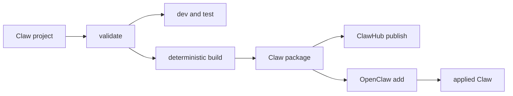

# Claw Project v1 Specification

This document is the implementer-facing source-project, deterministic-build,
and local-development specification for RFC 0016, Claws. The existing
`CLAW.md` and package specifications define the portable declaration and built
artifact. This specification defines how authors produce and exercise that
artifact without creating a second OpenClaw runtime or mutation owner.

Status: experimental draft, tied to RFC 0016.

Addendum PR: [openclaw/rfcs#56](https://github.com/openclaw/rfcs/pull/56).

## Dependency

This specification depends on the portable profile/bootstrap contract proposed
in [RFC PR #48](https://github.com/openclaw/rfcs/pull/48) and the
application-composition and client contract proposed in
[RFC PR #52](https://github.com/openclaw/rfcs/pull/52). In particular, it
consumes those proposals' schema-v1 conventional profiles, package-root
`BOOTSTRAP.md`, native extensions, managed application content, and shared
lifecycle services.

This specification does not independently standardize those inputs. If either
prerequisite changes, this specification must be reconciled before acceptance.
It may be reviewed and prototyped in parallel, but it must not be accepted or
merged first.

## Scope

This specification defines:

- the distinction among a Claw project, package, and applied Claw;
- project discovery and conventional source layout;
- create and read-only validation behavior;
- deterministic package builds and project-only exclusions;
- isolated local development and static or explicitly live tests;
- the handoff of exact built artifacts to ClawHub and OpenClaw; and
- conformance evidence for the complete author-to-recipient lifecycle.

It does not change the portable package schema version, ownership model, or
one-Claw-one-new-agent invariant.

## Product States

### Claw project

A Claw project is a human-authored directory containing package inputs and
optional project-only development material. It is mutable source and is not a
registry identity or an applied installation.

### Claw package

A Claw package is a deterministic immutable artifact built from validated
project inputs. It contains only publishable package content defined by RFC
0016 and its sidecar specifications. Its artifact digest identifies the exact
bytes inspected, published, downloaded, and handed to an applying client.

### Applied Claw

An applied Claw is one new agent plus the managed and referenced local state
realized by a harness. Credentials, selected accounts, channel addresses,
provider authentication, host paths, runtime availability, operator policy,
sessions, and user-created personalization remain local and are not package
identity.



## Ownership Boundary

OpenClaw owns runtime semantics and every local capability owner: agents,
models, tools, sandboxes, channels, secrets, plugins, MCP servers, schedules,
workspaces, bootstrap, status, diagnostics, update, and removal.

The Claw project tooling owns only source discovery, project validation,
deterministic packaging, disposable development orchestration, project tests,
and exact-artifact handoff. It must call public or explicitly shared OpenClaw
lifecycle services rather than reproduce their planning or mutation logic.

ClawHub owns authenticated publication, package ownership, immutable versions,
security scanning, discovery, and exact artifact distribution. Publication is
not an OpenClaw runtime mutation and must not rebuild source.

## Project Discovery and Layout

A V1 project is identified by both `package.json` and `CLAW.md` at its root.
No additional root configuration file or hidden generator state is required.

Conventional optional paths are:

```text
my-claw/
|-- package.json
|-- CLAW.md
|-- BOOTSTRAP.md
|-- profiles/
|   `-- openclaw.yml
|-- skills/
|-- references/
|-- schemas/
|-- templates/
|-- examples/
|-- fixtures/
`-- tests/
    `-- smoke.claw-test.yml
```

These directory names do not create new runtime owners. Files become package
content only through the existing package and manifest contracts. `tests/` is
project-only by default. A fixture intended to ship as application content must
also be selected through ordinary managed package content rather than inheriting
publishability from its directory name.

Project discovery must use canonical real paths, reject an ambiguous ancestor
project, and apply the package specification's path, link, file-type, size, and
containment rules before consuming source bytes.

Project tests use the strict format in
[`claw-test-v1-spec.md`](claw-test-v1-spec.md). They are never inferred from
arbitrary YAML or executable files under `tests/`.

## Create

`openclaw claws create [path]` scaffolds one minimal, immediately valid project.
It may offer a small number of maintained examples, but templates must produce
the same ordinary files an author would write by hand.

Create must:

- fail rather than merge into a nonempty destination unless an explicit future
  conflict contract says otherwise;
- emit readable Markdown, JSON, and YAML with no generated lock file or hidden
  project database;
- use a development-safe package identity and version;
- produce a project that passes validation without network access; and
- make optional capabilities removable without repairing unrelated files.

Create does not install dependencies, add an agent, contact ClawHub, select
credentials, or modify OpenClaw state.

## Validate

`openclaw claws validate [path]` is read-only. It validates the project and the
exact package inputs that a subsequent build would consume.

Validate is also an implicit prerequisite of `dev`, `test`, and `build`. Those
commands must return the same validation findings before performing their own
work. Standalone validate remains useful for editors, CI, and focused diagnosis
without becoming another required first-use step.

Validation must:

- discover exactly one project root;
- validate package metadata, `CLAW.md`, conventional profiles,
  `BOOTSTRAP.md`, declared files, skills, and exact dependency references;
- report project-only exclusions;
- resolve local source paths without mutation;
- reject unsupported required components, collisions, unsafe paths, links,
  special files, unbounded content, and credentials in prohibited fields;
- reject a nonempty package `scripts` object, including npm lifecycle scripts;
- distinguish package validity from local OpenClaw readiness; and
- emit stable machine-readable findings suitable for editors and CI.

Validation may inspect installed catalogs needed for compatibility, but it must
not install, enable, authenticate, publish, or apply anything. A network-backed
resolution mode must be explicit and must not change the local project.

## Deterministic Build

`openclaw claws build [path] --out <artifact>` produces one immutable package
artifact from the validated project snapshot.

The V1 OpenClaw builder emits a deterministic npm-compatible `.tgz` archive
with the conventional `package/` root. Registries and applying clients may
continue to support other explicitly identified transport formats under the
package specification, but those formats are not alternative outputs of the V1
project builder.

For identical source bytes, selected inputs, builder contract version, and
declared package metadata, two builds must be byte-identical. The builder must
therefore define stable path ordering, normalized archive metadata, timestamps,
permissions, separators, and compression settings. It must not include host
user names, absolute paths, process environment, filesystem mtimes, caches, or
nondeterministic generated identifiers.

The repository must retain a golden project and expected artifact digest.
Supported Linux, macOS, and Windows builders must produce those exact bytes;
WSL must also pass the packed-CLI build/read smoke. A platform-specific archive
is nonconforming rather than a valid alternative artifact.

V1 build must not execute package scripts, hooks, arbitrary project code, or
network calls. Executable application behavior remains in exact declared
plugins or extensions and is evaluated by their canonical owners during
OpenClaw planning.

A V1 Claw project's root `package.json` must not contain a nonempty `scripts`
object. Validation rejects it, and build must not copy it into the artifact.
This keeps the Claw artifact data-only even when another tool treats the output
as an npm-compatible archive. Declared plugin or extension packages retain
their own canonical installation and execution contracts; this rule applies to
the Claw package itself.

The build excludes by default:

- `tests/` and project-only evaluation fixtures;
- caches, logs, temporary output, and prior build artifacts;
- local credentials, environment files, OAuth state, and SecretRef values;
- local OpenClaw state, sessions, memories, bindings, and user-created output;
- host-specific paths and development dependency mappings; and
- source-control metadata.

After writing the artifact, the builder must re-open it through the canonical
Claw package reader and verify its package identity, complete contents,
integrity, and expected artifact digest. A failed re-read deletes or clearly
quarantines the incomplete output and returns failure.

Build and publish are separate operations. Build success conveys no registry
ownership, security approval, or runtime compatibility promise.

## Isolated Development

`openclaw claws dev [path]` builds a development snapshot and exercises it
through the canonical OpenClaw lifecycle. Its default lane stops at an offline
preview; its explicit live lane uses disposable state.

Default `dev` is offline, non-delivering, and read-only outside temporary build
files. It validates, builds, and produces the complete native lifecycle preview
without creating applied or durable OpenClaw state. It does not start
provider-backed turns, invoke network-capable tools or MCP servers, activate
recurring schedules, or deliver through channels. Starting those effects
requires `dev --live`, a marked disposable state boundary, the normal
integrity-bound lifecycle consent, and an explicit display of each enabled
external effect. Recurring work and outbound channel delivery remain suppressed
unless separately selected in that live plan.

If a canonical owner cannot complete preflight without network access, offline
dev reports that unresolved prerequisite or blocker rather than weakening the
offline boundary or claiming readiness. The same project may obtain the fuller
preflight only through explicitly consented live execution.

Every dev run must:

- show the same inspect and dry-run effects production add would show;
- reuse the canonical add planner and readiness owners; and
- expose missing local prerequisites honestly.

Live dev must additionally:

- use an isolated state directory, agent id, workspace, scheduler state, and
  local lifecycle provenance;
- require `--live` and normal consent before provider, executable, network,
  schedule, or delivery effects;
- reuse add, status, doctor, update, and remove mutation owners;
- report the exact local chat or Control UI entry point when started;
- remove disposable managed state on explicit stop;
- persist a bounded marker before creating disposable state and clear it only
  after cleanup completes; and
- detect abandoned markers on the next project command and through doctor,
  report their exact paths and owners, and offer canonical reclamation.

No implementation can promise immediate cleanup after an uncatchable process
termination. Conformance instead requires that production state remains
untouched, abandoned development state is unambiguously identifiable, and a
subsequent command can reclaim it without guessing ownership.

An explicit future option may target a named non-disposable OpenClaw instance,
but that is production add semantics and must not be the default or be implied
by `dev`.

## Project Tests

`openclaw claws test [path]` runs static conformance and declared offline
scenarios by default. Tests are authoring evidence and do not become applied
runtime state.

The strict project-only format is defined by
[`claw-test-v1-spec.md`](claw-test-v1-spec.md). Unknown fields and unsupported
checks fail validation; downloaded package tests never execute automatically.

The default lane must run without provider credentials or network access. It
may assert:

- package validity and deterministic build inputs;
- expected lifecycle actions, blockers, and readiness requirements;
- fixture-to-output-schema conformance;
- required packaged assets and fallback content; and
- planned removal and cleanup actions from canonical dry-run output.

Provider-backed model evaluation requires `--live`, an explicit model or
approved default, a bounded turn count, and visible budget context. When the
provider cannot enforce a monetary or token ceiling, the runner must say so
rather than present an estimate as a hard limit. Live tests must not publish
private prompts, transcripts, user files, or credentials as package content.
Test output must distinguish framework failure, package failure, harness-owner
failure, unavailable local prerequisite, and model assertion failure.

V1 does not execute arbitrary test code from projects or downloaded Claw
packages. Ordinary repository tests remain outside the Claw toolchain.

## Publication and Application

ClawHub publication consumes the exact already-built artifact. It must not run
the project builder, infer omitted files, execute project code, or substitute a
new archive. The authenticated publisher selects package identity and version;
ClawHub validates and scans the exact bytes, stores their digest, and enforces
version immutability.

The digest of the locally tested artifact, accepted publication artifact, and
downloaded artifact must match. OpenClaw then resolves and verifies those exact
bytes before producing the normal `claws add --dry-run` plan. Registry approval
does not bypass dependency policy, capability consent, or canonical owner
readiness.

No `openclaw claws publish` command is required by this specification. A
ClawHub-owned CLI or another publisher client may perform the authenticated
upload as long as it accepts the exact built artifact and preserves this
boundary.

## Security and Privacy

Project tooling inherits all package containment, archive, size, integrity,
dependency, and consent rules from RFC 0016. It adds these requirements:

- project validation and build never resolve or serialize secret values;
- validation rejects package scripts and build executes or ships no
  package-authored lifecycle code;
- dev isolation fails closed if its state boundary cannot be established;
- default dev and test suppress provider, network, schedule, and delivery
  effects until explicit live selection and consent;
- static tests do not require provider credentials;
- live tests are explicit and budget-visible;
- logs and machine-readable results redact credentials and private local data;
- publication accepts exact bytes and cannot silently rebuild; and
- experimental commands remain behind `OPENCLAW_EXPERIMENTAL_CLAWS=1`.

## Conformance

A V1 project implementation conforms only when it proves:

1. A fresh `create` result passes offline `validate` without hidden state.
2. Validation rejects unsafe and unsupported input without mutation.
3. Editing one selected input predictably changes the project/build digest.
4. One golden project produces byte-identical output and the same digest on
   Linux, macOS, Windows, and WSL packed-CLI proof.
5. The built artifact independently passes the canonical package reader.
6. Project-only tests, caches, credentials, and host paths are absent.
7. Offline dev creates no durable OpenClaw state. Live dev uses marked
   disposable state, leaves production state unchanged, cleans on normal stop,
   and reclaims abandoned state on a subsequent command.
8. Default dev and static tests produce no provider, network, schedule, or
   channel-delivery effects and classify failures by owner.
9. Live tests require explicit opt-in and report model and budget context.
10. The built, published, downloaded, and applied artifact digests match.
11. Clean-recipient add, status, doctor, and remove use existing OpenClaw
    lifecycle owners and preserve user-owned local state.

## Non-Goals

- A TypeScript agent framework or package-authored runtime code.
- A second Gateway, plugin manager, scheduler, sandbox, or secret store.
- Schema version 2 or new portable package fields.
- Package scripts, arbitrary build hooks, setup scripts, or downloaded test
  execution.
- Packaging credentials, channel accounts, concrete bindings, or host paths.
- Deploying or managing an OpenClaw Gateway service.
- Multi-agent or subagent package semantics.
- Requiring `npx claws`, Hermes, Codex, Claude, or another harness for V1.
- Making publication part of OpenClaw's local runtime lifecycle.

## Evolution

A standalone `claws` tool may later implement this project contract and invoke
public harness commands through adapters. That does not change the V1 owner
boundary: OpenClaw remains the reference runtime and canonical mutation owner,
and a foreign adapter must fail rather than silently discard required package
semantics.

Additional project metadata, test check kinds, dependency-workspace mappings,
and deployment targets require separate evidence and versioned contracts. They
must not be inferred from permissive unknown fields in V1.
