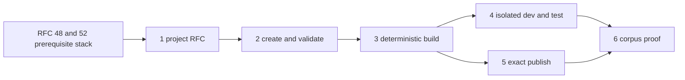

# Claw Application Framework Implementation Plan

This sidecar defines the dependency-ordered implementation plan for the Claw
project and developer lifecycle in RFC 0016. It is a follow-on to, not a
replacement for, the package/application stack.

Status: proposed experimental plan.

## Prerequisite Stack

This plan depends on acceptance of the portable profile/bootstrap addendum in
[RFC #48](https://github.com/openclaw/rfcs/pull/48), the composition/client
contract in [RFC #52](https://github.com/openclaw/rfcs/pull/52), and the
behavior supplied by their current OpenClaw implementation stack:

1. [#115237](https://github.com/openclaw/openclaw/pull/115237): conventional
   profiles and native package-root `BOOTSTRAP.md`.
2. [#115962](https://github.com/openclaw/openclaw/pull/115962): schema-v1
   profile extensions and managed application content.
3. [#115371](https://github.com/openclaw/openclaw/pull/115371): export of an
   explicitly reviewed native bootstrap file.
4. [#112808](https://github.com/openclaw/openclaw/pull/112808): read-only
   Gateway and Control UI lifecycle.
5. [#112828](https://github.com/openclaw/openclaw/pull/112828): consented
   Gateway and Control UI mutation lifecycle.

The framework PRs may be drafted while this prerequisite stack is reviewed,
but they must not duplicate it or be presented as independently complete. The
framework RFC must not be accepted before RFC #48 and RFC #52. OpenClaw
implementation PRs should be based on the merged prerequisite behavior, not
permanently stacked on unmerged fork heads.

## Series

### PR 1: RFC 0016 application-framework addendum

Repository: `openclaw/rfcs`.

- Update `rfcs/0016-claws.md`.
- Add `rfcs/0016/claw-project-v1-spec.md`.
- Add this implementation-plan sidecar.
- Define project, package, and applied states plus owner boundaries.
- Preserve schema version 1 and every accepted RFC #52 contract.

Exit proof: maintainer review confirms that project tooling composes OpenClaw
owners rather than becoming a second runtime, and the dependencies on RFC #48
and RFC #52 are explicit.

### PR 2: Create and validate

Repository: `openclaw/openclaw`.

- Add `openclaw claws create` with one minimal project and one maintained
  application example.
- Discover projects from root `package.json` plus `CLAW.md` without another
  root config file.
- Add read-only project validation and stable structured findings.
- Reuse the canonical package, profile, bootstrap, extension, and file readers.
- Keep the command behind `OPENCLAW_EXPERIMENTAL_CLAWS=1`.

Exit proof: one command creates a readable project that validates offline; an
unsafe path and unsupported required component fail without mutation.

### PR 3: Deterministic build

Repository: `openclaw/openclaw`.

- Add `openclaw claws build` producing one immutable artifact.
- Emit one canonical npm-compatible `.tgz` with a conventional `package/` root.
- Define stable archive ordering, metadata, timestamps, permissions, path
  separators, and compression.
- Exclude tests, caches, secrets, host paths, and local state.
- Execute no package scripts or hooks.
- Re-read the result through the canonical package reader.

Exit proof: two clean builds are byte-identical; a selected input change alters
the digest; a packed-CLI clean-prefix test independently reads the artifact.

### PR 4: Isolated dev and test

Repository: `openclaw/openclaw`.

- Add `openclaw claws dev` using disposable state by default.
- Reuse inspect, dry-run, consent, add, status, doctor, update, and remove.
- Print the native chat or Control UI entry point.
- Add offline static/project scenario tests.
- Gate provider-backed evaluation behind `--live` with visible model and budget
  context.

Exit proof: normal stop and forced interruption leave production state
unchanged; static tests run offline; live tests cannot start without explicit
opt-in.

### PR 5: Exact-artifact publication

Repository: `openclaw/clawhub`.

- Accept an already-built Claw artifact through the existing experimental
  ClawHub gate.
- Authenticate package ownership, validate and scan exact bytes, and enforce
  immutable versions.
- Record and return the exact artifact digest.
- Never rebuild source or execute package project code.
- Keep publication ownership in ClawHub rather than adding a second OpenClaw
  mutation path.

Exit proof: the submitted, stored, and downloaded bytes and digests match; a
changed or reused immutable version fails closed.

### PR 6: Reference corpus and clean-recipient proof

Repository: `openclaw/awesome-claws`.

- Upgrade the copyable reference Claw and golden Claw to the project/test
  contract.
- Include one schema asset, one output template, one exact extension, one MCP
  prerequisite, native bootstrap, one isolated schedule, and rich UI plus
  complete Markdown fallback.
- Run create, validate, build, dev, static test, publish, clean add, status,
  doctor, and remove against the exact artifact.
- Classify package, framework, registry, adapter, owner, environment, and model
  failures separately.

Exit proof: build digest equals published digest equals downloaded and applied
digest; the clean recipient is ready except for any deliberately omitted local
credential, and removal preserves bootstrap-created user content.

## Dependency Graph



PRs 4 and 5 may proceed in parallel after deterministic build. The corpus PR
is last because it is the cross-repository proof, not the place to invent
missing framework semantics.

## Deliberate Omissions

This series does not add:

- another OpenClaw profile expansion beyond RFC #48 and RFC #52;
- `openclaw claws publish` as a runtime-owned command;
- schema version 2;
- setup forms, answer persistence, or update reconciliation;
- package-authored build hooks or arbitrary downloaded test code;
- Gateway deployment or service management;
- multi-agent/subagent packages; or
- a required standalone `npx claws` implementation.

These omissions keep the first series focused on the missing development and
artifact lifecycle while reusing the application and runtime contracts already
under review.

## End-to-End Gate

Before the series is called complete, one exact reference project must prove:

```text
create -> validate -> isolated dev -> static test -> deterministic build
       -> exact publish -> clean add -> status/doctor -> remove
```

The proof must record the source revision, builder version, package digest,
registry digest, applying OpenClaw version, experimental gates, environment,
and result for each owner boundary. Unit tests alone do not satisfy the
clean-recipient or interruption-cleanup gates.

## Stop Conditions

Return to RFC review if implementation requires:

- duplicating OpenClaw planning or mutation logic;
- packaging credentials, account ids, concrete bindings, or host paths;
- executing package-authored build or setup code;
- accepting nondeterministic artifact bytes;
- changing portable schema version 1;
- treating registry approval as dependency or capability consent; or
- merging this addendum before its RFC #48 and RFC #52 prerequisites are
  accepted.
