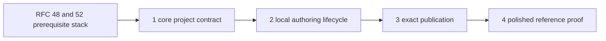

# Claw Application Framework Implementation Plan

This sidecar defines the smallest dependency-ordered implementation plan for
the Claw project and developer lifecycle in RFC 0016. It proves one complete
author-to-recipient path before generalizing testing or live development.

Status: proposed experimental plan.

## Prerequisite Stack

This plan depends on acceptance of the portable profile/bootstrap addendum in
[RFC #48](https://github.com/openclaw/rfcs/pull/48), the composition/client
contract in [RFC #52](https://github.com/openclaw/rfcs/pull/52), and the
behavior supplied by their current OpenClaw implementation stack:

1. [#115237](https://github.com/openclaw/openclaw/pull/115237): conventional
   profiles and native package-root `BOOTSTRAP.md`.
2. [#115962](https://github.com/openclaw/openclaw/pull/115962): schema-v1
   profile extensions and managed application content.
3. [#115371](https://github.com/openclaw/openclaw/pull/115371): export of an
   explicitly reviewed native bootstrap file.
4. [#112808](https://github.com/openclaw/openclaw/pull/112808): read-only
   Gateway and Control UI lifecycle.
5. [#112828](https://github.com/openclaw/openclaw/pull/112828): consented
   Gateway and Control UI mutation lifecycle.

The project PRs may be drafted while this prerequisite stack is reviewed, but
they must not duplicate it or be presented as independently complete. This RFC
must not be accepted before RFC #48 and RFC #52. OpenClaw implementation should
be based on merged prerequisite behavior rather than permanently stacked on
unmerged fork heads.

## Four-PR Series

### PR 1: Core project contract

Repository: `openclaw/rfcs`.

- Update `rfcs/0016-claws.md`.
- Add `rfcs/0016/claw-project-v1-spec.md` and this implementation plan.
- Define project, immutable package, and applied Claw states.
- Define `create`, implicit/read-only validation, offline `dev`, deterministic
  `build`, exact-artifact publication, and clean-recipient proof.
- Preserve schema version 1 and every accepted RFC #52 contract.
- Record declarative tests and live development as explicit follow-ups.

Exit proof: maintainer review confirms that the project layer supplies the
missing OpenClaw application-development lifecycle without becoming a second
runtime, and that the V1 slice is small enough to prove with one application.

### PR 2: Complete local authoring lifecycle

Repository: `openclaw/openclaw`.

Implementation draft: [#117037](https://github.com/openclaw/openclaw/pull/117037).

- Add `openclaw claws create` with one minimal readable project.
- Discover a project from root `package.json` plus `CLAW.md`; add read-only
  validation and run it implicitly before dev and build.
- Reject nonempty root package scripts and reuse canonical package, profile,
  bootstrap, extension, asset, and lifecycle readers.
- Add `openclaw claws build` producing one deterministic npm-compatible `.tgz`
  with a conventional `package/` root and no author-only or local state.
- Re-read the artifact through the canonical package reader.
- Add offline `openclaw claws dev`, which builds a temporary snapshot and shows
  the canonical inspect/add dry-run without applying, contacting providers,
  invoking network capabilities, activating schedules, or delivering messages.
- Keep every command behind `OPENCLAW_EXPERIMENTAL_CLAWS=1`.

Exit proof: one command creates a valid readable project; offline dev reports
the exact lifecycle plan without durable state; one golden project builds to
the same artifact digest on Linux, macOS, and Windows with WSL packed-CLI proof;
unsafe inputs fail without mutation; the artifact independently re-reads.

### PR 3: Exact-artifact publication

Repository: `openclaw/clawhub`.

- Accept an already-built Claw artifact through the existing experimental
  ClawHub gate.
- Authenticate package ownership, validate and scan exact bytes, and enforce
  immutable versions.
- Record and return the exact artifact digest.
- Never rebuild source or execute project code.
- Keep publication ownership in ClawHub rather than adding an OpenClaw publish
  or mutation path.

Exit proof: submitted, stored, and downloaded bytes and digests match; a
changed or reused immutable version fails closed.

### PR 4: One polished end-to-end reference Claw

Repository: `openclaw/awesome-claws`.

- Upgrade one copyable reference Claw into the golden application project.
- Include one schema asset, one output template, one exact extension, one MCP
  prerequisite, native bootstrap, one isolated schedule, and rich UI with a
  complete Markdown fallback.
- Run create, validate, offline dev, deterministic build, exact publish, clean
  add, status, doctor, and remove against the same artifact.
- Record source revision, builder version, package digest, registry digest,
  applying OpenClaw version, experimental gates, environment, and owner result.

Exit proof: build digest equals published digest equals downloaded and applied
digest; the clean recipient is ready except for a deliberately omitted local
credential; removal preserves bootstrap-created user content. Unit tests alone
do not satisfy this clean-recipient gate.

## Dependency Graph



This is intentionally one vertical sequence. The reference project verifies
the framework and registry contracts; it is not the place to invent missing
semantics.

## Deferred Follow-Ups

After the four-PR series demonstrates internal product fit, separate reviewed
tracks may add:

- a bounded declarative `claws test` format;
- provider-backed model evaluation with explicit model and budget disclosure;
- live disposable development and interruption recovery; and
- a broader Awesome Claws conformance matrix.

These are not required to call the first lifecycle complete. Their design must
use evidence from real authors and the golden reference Claw rather than
speculating ahead of use.

## Deliberate Omissions

This series does not add:

- another OpenClaw profile expansion beyond RFC #48 and RFC #52;
- `openclaw claws publish` as a runtime-owned command;
- schema version 2;
- setup forms, answer persistence, or update reconciliation;
- package-authored build hooks or arbitrary downloaded test code;
- provider-backed or live project execution;
- Gateway deployment or service management;
- multi-agent/subagent packages; or
- a required standalone `npx claws` implementation.

## End-to-End Gate

Before the series is called complete, one exact reference project must prove:

```text
create -> offline dev -> deterministic build -> exact publish
       -> clean add -> status/doctor -> remove
```

The proof must show that the same immutable package bytes cross every boundary.
No stage may substitute a rebuilt artifact or imply registry approval bypasses
OpenClaw dependency policy, capability consent, or owner readiness.

## Stop Conditions

Return to RFC review if implementation requires:

- duplicating OpenClaw planning or mutation logic;
- packaging credentials, account ids, concrete bindings, or host paths;
- executing package-authored build or setup code;
- accepting nondeterministic artifact bytes;
- changing portable schema version 1;
- treating registry approval as dependency or capability consent; or
- merging this addendum before RFC #48 and RFC #52 are accepted.
