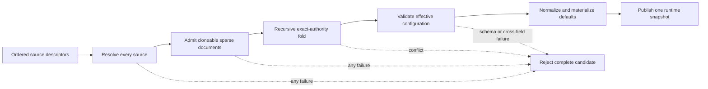
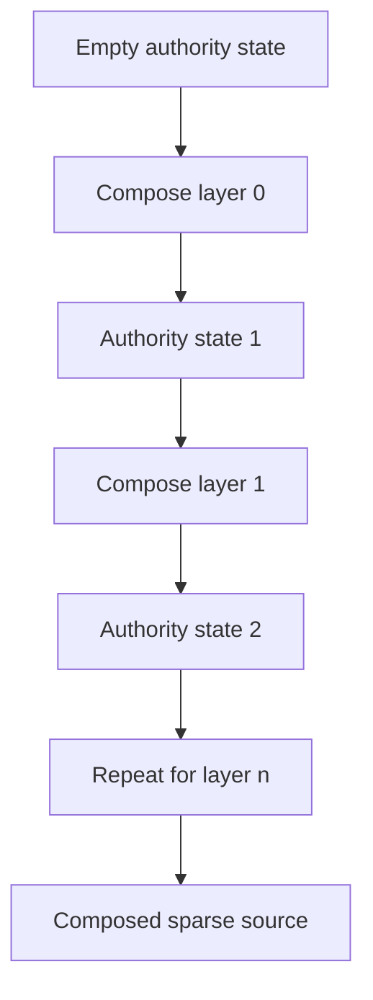
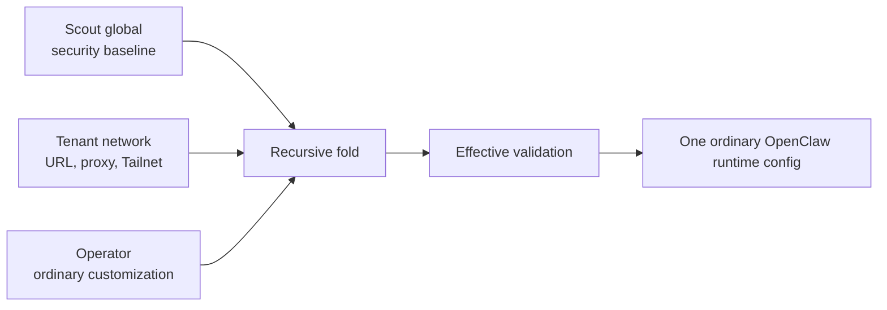

# Proposal: Managed Configuration

## Summary

Add a core configuration-authority model that recursively composes an ordered
list of named configuration layers through the existing OpenClaw schema.
OpenClaw rejects conflicts or attempts to weaken authority established by an
earlier layer and produces one effective configuration with inspectable
provenance. A host-managed document plus an operator document is one deployment
profile of this generic model, not a pair of roles hard-coded into the engine.

## Motivation

OpenClaw currently has one ordinary configuration authority. A hosting platform
that must enforce deployment posture while preserving operator customization
therefore has to generate config fragments, project environment variables,
rewrite files in a particular order, remove stale generated values, and keep
custom logic synchronized with OpenClaw's schema.

The missing distinction is not a new `hosting` config section. It is authority
over fields in the existing configuration schema:

```text
OpenClaw defaults
  + host-managed configuration
  + operator configuration
  -> admission and cross-field validation
  -> effective configuration
  -> runtime
```

Without an upstream contract, hosts silently overwrite operator values or carry
private strictness logic. Operators cannot reliably explain why a value is
effective, and support teams cannot reproduce the deployment from declared
inputs. Repeated host patches then track OpenClaw config internals instead of a
stable composition contract.

Managed Configuration also gives OCC a clean future boundary: OCC can compile
admitted desired state into a managed document while OpenClaw remains the owner
of schema validation, field semantics, and effective runtime configuration.

## Goals

- Load an ordered list of named layers using the normal OpenClaw configuration
  schema.
- Let presence in an earlier layer declare authority over that field for every
  later layer.
- Reject conflicts with structured findings instead of silently overwriting.
- Support exact authority for every schema field.
- Support a small closed set of OpenClaw-defined bounded strictness rules.
- Run normal cross-field validation against the composed effective config.
- Expose redacted effective values, provenance, control mode, and stable config
  identity for diagnostics and conformance.
- Associate mutability with a layer source rather than a built-in role, and
  prevent writes from bypassing earlier authority.
- Make unsafe startup composition failures visible through status/readiness.
- Allow hosts to replace private config writers with a release-tested contract.

## Non-Goals

- A new top-level `hosting` section containing copies of existing settings.
- Numeric priorities, implicit source discovery, or dynamic layer reordering.
- A policy expression language or host-defined comparison functions.
- Silent managed-value precedence.
- Dynamic OCC reconciliation in the first version.
- Secret delivery, trusted identity, lifecycle, state synchronization, or
  plugin installation.
- Depending on the optional Policy plugin for runtime correctness.
- Making every field support a monotonic "stricter" relationship.

## Proposal

### Layers and recursive composition

The input is an ordered list of layer descriptors from strongest to weakest:

```text
layer[0] -> layer[1] -> ... -> layer[n]
```

Each descriptor has a stable layer identity, an opaque source reference, and an
explicit `read-only` or `read-write` access capability. Resolution returns one
document using the existing OpenClaw schema plus a stable redacted source
identity. Names such as
`platform`, `tenant`, `team`, and `operator` are diagnostic labels supplied by a
deployment; they have no special semantics in core.

Independent sources may resolve concurrently, but composition always retains
the descriptor array's declared order. Empty or duplicate layer identities fail
before source I/O. Failure to resolve any source rejects the complete candidate;
OpenClaw does not silently omit the failed layer.

Composition applies one operation repeatedly:

```text
state[0] = empty authority state
state[i + 1] = compose(state[i], layer[i])
effective = materializeWithDefaults(state[layerCount])
```





For each leaf, the first declaring layer establishes its schema-defined control
rule. Every later layer may omit the leaf, repeat the same authored exact
value, or tighten a bounded value. It may not replace an exact value or weaken a
bounded value. A leaf omitted by every layer receives its ordinary OpenClaw
default after composition.

Authority compares authored source values before schema normalization. Two
different accepted representations remain different exact claims even if the
ordinary schema would later normalize them to the same runtime value. This
keeps admission recursive and context-free: a layer cannot acquire a different
meaning merely because another layer supplies a cross-field dependency.

Schema normalization, defaults, plugin-aware validation, and runtime-derived
values apply only after the complete fold. They therefore never create
authority claims. Cross-field rules see the composed effective candidate rather
than an incomplete sparse layer.

Arrays are whole-field values unless a specific built-in bounded rule applies.
Objects are traversed according to the normal schema; declaring one child does
not implicitly claim unrelated siblings.

Absence means that a layer makes no declaration for the path. Removing a path
from a writable layer relinquishes that layer's claim when the chain is
recomputed. `null` is a declared value only where the schema accepts it; it is
not a generic deletion marker.

Empty objects declare no leaves and canonicalize away without individual
warnings. A layer with no declarations is valid, allowing staged or temporarily
empty sources, but inspection and status report one `NoDeclaredValues`
advisory for that layer.

The ordered layer list is selected at process startup through one explicit core
loading mechanism. Each source reference identifies one document, its immutable
source identity, and an optional expected digest. Order is declared once; it is
not inferred from filenames, environment discovery, or numeric priority.

OpenClaw resolves JSON5 and includes within each source before authority
admission, using the ordinary include rules and the source's real location.
Includes cannot read from, write to, or gain precedence over another layer.
Environment substitution runs once after the ordered documents are composed,
so an earlier layer may intentionally declare environment values referenced by
a later layer without making substitution order-dependent. Every resolved
layer must be a cloneable plain-object document. Ordinary schema, plugin-aware,
secret-reference, and cross-field validation run against the composed
candidate.

The runtime reports source identities rather than host paths where paths would
leak deployment details. A host can prove which inputs produced an effective
snapshot without making its filesystem layout part of the contract.

### Authority rules

#### Exact authority

A later layer must omit the field or provide the same authored value. A
different value is an admission error.

```json
{
  "path": "gateway.auth.mode",
  "reason": "ControlledByEarlierLayer",
  "controllingLayer": "platform",
  "controllingValue": "trusted-proxy",
  "conflictingLayer": "operator",
  "conflictingValue": "token",
  "control": "exact"
}
```

Exact authority is the default and works for every schema field without adding
field-specific policy logic.

Equal exact declarations are accepted. Provenance records each declaring layer
while the earliest remaining declaration stays controlling. Removing or
reordering a layer recomputes the complete chain from source documents; derived
authority state is not persisted as another configuration source.

#### Bounded authority

OpenClaw may mark a small closed set of fields with a monotonic comparator. A
later layer may preserve or tighten the inherited boundary but cannot weaken
it. Comparator composition must be associative so the same operation can be
applied recursively across any number of layers.

Initial comparator classes are:

| Comparator | Composition rule |
| --- | --- |
| Allow-set ceiling | Operator set must be a subset of the managed set |
| Deny-set floor | Operator set must be a superset of the managed set |
| Maximum limit | Operator value must be equal or lower |
| Minimum requirement | Operator value must be equal or stricter |
| Required protection | Operator cannot disable it |
| Disabled risky capability | Operator cannot re-enable it |

Comparator assignment and ordering are owned by the OpenClaw schema. Layers
cannot attach a comparator to an arbitrary field or redefine "stricter."
Each comparator must be deterministic, idempotent, and associative over its
supported domain so recursive composition does not depend on fold grouping.

### Effective configuration

Composition happens once before runtime consumers observe configuration:

```text
resolve each source independently
  -> sparse-document admission
  -> authority admission
  -> effective composition
  -> existing schema, plugin-aware, and cross-field validation
  -> existing runtime materialization
  -> immutable runtime snapshot
```

Gateway, plugins, tools, sessions, and state modules consume the same effective
snapshot. They do not independently merge managed and operator values.

The effective result reports two identities: an effective-content identity for
the normalized, redacted effective configuration, and an authority-chain
identity for the ordered authored claims and control metadata. Source delivery
identities are separate diagnostic metadata. Secret values are never included
in diagnostic output or hashes in a way that exposes plaintext.

### Findings and provenance

Validation returns structured findings suitable for CLI, status, doctor, admin
UI, and automation:

```json
{
  "valid": false,
  "findings": [
    {
      "path": "tools.exec.ask",
      "reason": "WeakerThanManagedRequirement",
      "managedValue": "always",
      "operatorValue": "never",
      "control": "minimum-requirement"
    }
  ]
}
```

Effective inspection reports provenance without exposing secrets:

```json
{
  "path": "tools.alsoAllow",
  "value": ["read", "sessions_list"],
  "authority": "operator",
  "managedBoundary": ["read", "sessions_list", "exec"],
  "control": "allow-set-ceiling"
}
```

At minimum, OpenClaw should support machine-readable operations equivalent to:

- validate managed plus operator inputs;
- inspect the effective configuration;
- explain one path's value, authority, and comparator;
- report the effective configuration identity through status.

Exact command names and loading flags should follow existing config CLI and
Gateway conventions during implementation.

### Mutation behavior

Mutation APIs target one explicitly writable layer, including a middle layer. A
write that would violate authority inherited from an earlier layer fails before
persistence; a valid declaration may establish authority over later layers.
Read-only layers are not writable through normal config APIs, regardless of
label.

Config reload follows the existing hot-reload/restart classification after a
complete effective candidate passes admission and cross-field validation.
OpenClaw publishes one runtime snapshot; a failed reload leaves the previous
snapshot active and does not partially activate the candidate. At startup,
failure remains visible and prevents readiness when the runtime cannot safely
operate under the declared host boundary.

Layer resolution and admission invoke snapshot publication exactly once with a
complete source/runtime candidate. Source resolution, sparse-document admission,
authority, or effective-validation failure does not invoke the publisher.
Atomic preflight and publication remain owned by the existing runtime snapshot
boundary; the layer engine does not own snapshot globals or reload actions.

Layer writes use the existing config mutation preflight and conflict model. The
write must be validated against the target source and authority-chain
identity captured for that mutation. If either changed, the write fails with a
structured conflict before persistence. This extends the existing write path;
it does not introduce dynamic ownership transfer or a general reconciliation
protocol.

A descriptor with an expected content digest is immutable for that descriptor
generation and therefore cannot also be writable. A successful persistence
adapter returns the canonical committed bytes. Before publication, OpenClaw
resolves the complete source chain again, requires the refreshed writable
source to match those committed bytes, and recomposes from the refreshed
sources. A concurrent non-target change is therefore included in the published
candidate, while an intervening target write produces a structured conflict
instead of publishing bytes that no longer match storage.

```mermaid
sequenceDiagram
  participant C as Config client
  participant O as OpenClaw
  participant W as Writable source
  participant R as Remaining sources
  C->>O: write(target digest, chain identity, proposal)
  O->>O: resolve + preflight complete chain
  O->>W: CAS/atomic commit
  W-->>O: canonical committed bytes
  O->>R: resolve complete chain again
  O->>W: resolve committed target again
  alt target digest matches committed bytes
    O->>O: recompose + validate refreshed chain
    O-->>C: publish one candidate
  else target changed after commit
    O-->>C: structured conflict; publish nothing
  end
```

### Example deployment profiles

A local personal installation can use one writable layer. A simple hosted
deployment can use two layers. A control plane can use more:

```text
platform -> tenant -> agent/team -> operator
```

These are profiles of the same ordered recursive model. Core does not assign
special behavior to any name or require a fixed layer count.

### Lobster usage case: Scout, tenant, and operator config

A realistic Lobster deployment uses three layers. The names describe this
deployment; core still treats them as generic ordered sources.

The Scout global layer establishes fleet-wide Gateway security posture:

```yaml
id: scout-global
access: read-only
config:
  gateway:
    mode: local
    auth:
      mode: trusted-proxy
      trustedProxy:
        userHeader: x-scout-user
        requiredHeaders:
          - x-scout-tenant
    controlUi:
      dangerouslyAllowHostHeaderOriginFallback: false
      allowInsecureAuth: false
      dangerouslyDisableDeviceAuth: false
```

The tenant layer supplies private-network facts that differ per deployment,
including its Tailnet exposure, trusted proxy range, and tenant URL:

```yaml
id: tenant-network
access: read-only
config:
  gateway:
    bind: tailnet
    trustedProxies:
      - 100.96.0.0/12
    tailscale:
      mode: serve
      serviceName: svc:openclaw-acme
    controlUi:
      allowedOrigins:
        - https://openclaw.acme.internal
```

The operator layer remains writable for ordinary customization:

```yaml
id: operator
access: read-write
config:
  gateway:
    controlUi:
      enabled: true
  logging:
    level: info
```



OpenClaw publishes the same ordinary runtime shape that an unmanaged
installation would consume:

```yaml
gateway:
  mode: local
  bind: tailnet
  auth:
    mode: trusted-proxy
    trustedProxy:
      userHeader: x-scout-user
      requiredHeaders:
        - x-scout-tenant
  trustedProxies:
    - 100.96.0.0/12
  tailscale:
    mode: serve
    serviceName: svc:openclaw-acme
  controlUi:
    enabled: true
    allowedOrigins:
      - https://openclaw.acme.internal
    dangerouslyAllowHostHeaderOriginFallback: false
    allowInsecureAuth: false
    dangerouslyDisableDeviceAuth: false
logging:
  level: info
```

No Gateway, Control UI, logging, or plugin consumer needs to know that three
sources produced the document. Provenance retains the distinction for
inspection and write preflight.

If the operator later attempts to replace the tenant URL, OpenClaw rejects the
write before persistence:

```json
{
  "path": "gateway.controlUi.allowedOrigins",
  "reason": "ControlledByEarlierLayer",
  "controllingLayer": "tenant-network",
  "controllingValue": ["https://openclaw.acme.internal"],
  "conflictingLayer": "operator",
  "conflictingValue": ["https://example.invalid"]
}
```

The same rule protects Scout global security posture and tenant-private network
facts without hard-coding Scout, tenant, or operator as engine roles. This
replaces Lobster-specific fragment generation and stale-value cleanup while
preserving the existing runtime config API.


### Policy plugin relationship

Core owns composition, authority metadata, comparators, findings, and startup
enforcement. The optional Policy plugin may reuse the comparator and finding
machinery for diagnostics, repair suggestions, or conformance checks, but core
must not depend on that plugin.

### Conformance

Release tests should cover:

- exact conflicts across representative scalar, object, and array fields;
- every supported bounded comparator and authored-representation edge case;
- source immutability and operator write rejection;
- redaction and stable effective identity;
- cross-field validation after composition;
- reload/restart behavior;
- invalid-startup readiness/status behavior;
- compatibility when a newer managed document references an unsupported field
  or comparator;
- transactional reload and preservation of the previous effective generation;
- stale operator-write rejection across managed-boundary rotation;
- rejection of a digest-pinned writable descriptor;
- complete-chain refresh when a non-target source changes during persistence;
- intervening target-write rejection before publication;
- canonical committed-byte reread before effective publication;
- source digest mismatch and source-identity redaction;
- semantic equivalence between direct effective config and composed managed
  plus operator inputs.

Hosting Profiles may declare Managed Configuration as an optional capability,
but profiles do not own its semantics.

### Implementation sequence

The RFC is delivered as small, independently reviewable PRs. No PR needs to
implement the complete RFC:

1. **Exact-authority core.** Add the pure recursive fold, authored-value conflict
   findings, provenance, effective validation, and focused tests. No startup,
   persistence, or existing config behavior changes.
2. **Bounded-authority registry and first field set.** Add the schema-owned
   comparator registry and the first closed set of real fields using the
   allow-set ceiling, deny-set floor, numeric-minimum, or numeric-maximum
   classes. The PR must include at least one demonstrated deployment use; it is
   not an empty comparator framework.
3. **Opt-in loading and activation.** Add one explicit ordered-source seam to the
   existing config I/O path and publish one effective snapshot through the
   existing activation boundary. With no source list, OpenClaw follows its
   current single-config path and users cannot observe the feature.
4. **Writes and inspection.** Route writes to an explicitly writable source,
   reject writes that violate earlier authority, and expose redacted provenance
   and readiness findings. Reuse existing mutation and status surfaces rather
   than creating a management subsystem.
5. **Concrete local-file integration.** Resolve ordered JSON5/include sources,
   use the ordinary primary OpenClaw config as the one writable source, persist
   through existing snapshot/CAS/atomic-write APIs, and recompose canonical
   committed bytes before publication. Environment substitution runs once
   after the complete ordered composition.
6. **Lobster migration and deletion.** Prove effective-config equivalence for
   the allowed-origins case, switch Lobster to the supported source seam, and
   delete its baked overlay writer, stale-value cleanup, and exact-blob tests.

The exact-authority core can be reviewed independently, but RFC completion
includes the bounded-authority PR. Comparator assignment remains closed,
schema-owned, and justified field by field.

Steps 1 through 5 complete the generic OpenClaw feature contract. Step 6 is an
adoption and deletion gate for Lobster, intentionally dependent on an OpenClaw
release that contains the capability; it is not additional core composition
machinery.

### Host migration and deletion gate

The feature succeeds only when a host can remove private config machinery. For
each migration, conformance compares the old generated effective config with
the OpenClaw-composed effective snapshot over representative deployments, then
proves conflict, reload, and operator-write behavior. Once a minimum OpenClaw
release passes that proof, the host removes the corresponding fragment
generator, environment projection, stale-value cleanup, and exact config-blob
tests. Temporary dual generation is diagnostic only and must have an owner,
expiry release, and removal change.

## Rationale

### Why not generated overlays?

Generated overlays express precedence, not authority. They silently overwrite
conflicts and require every host to reproduce OpenClaw normalization and
cross-field validation behavior.

### Why not a new hosted config section?

The controlled settings already have canonical homes. Copying them into a
hosting section creates two schemas and forces runtime modules to understand
hosting. Authority metadata composes existing fields without changing their
semantic owner.

### Why reject instead of managed-wins?

Silent precedence hides operator intent and configuration drift. Structured
admission makes the conflict actionable and preserves one explainable effective
state.

### Why keep comparators closed?

Arbitrary host comparators become a policy language and make conformance
impossible. OpenClaw can safely promise monotonic composition only where it owns
the field and ordering.

### Why core rather than a plugin?

Configuration authority must apply before optional plugins and runtime modules
activate. A plugin cannot safely be the enforcement dependency for its own
loading configuration or for Gateway startup.

## Unresolved questions

- Which existing OpenClaw config loading API and CLI commands should expose the
  ordered layer list?
- Which fields, if any, should receive bounded comparators in the first release?
- How should schema evolution report a managed field that is unknown to an
  older OpenClaw release?
- Which redacted provenance fields belong in `status` versus a dedicated config
  inspection call?
- What storage and ownership guidance should hosts follow for durable operator
  configuration across container replacement?
- Which existing runtime override paths are defaults, trusted activation
  inputs, or potential authority-chain bypasses?
