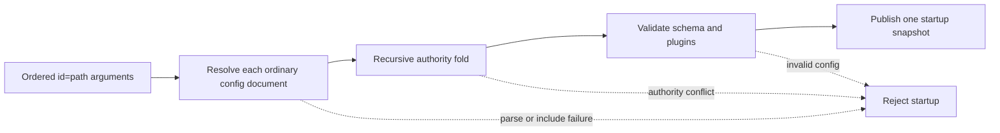
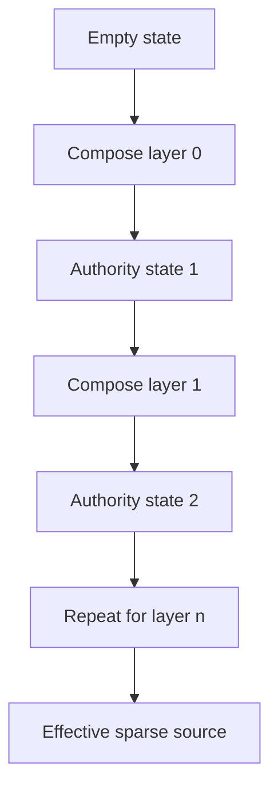
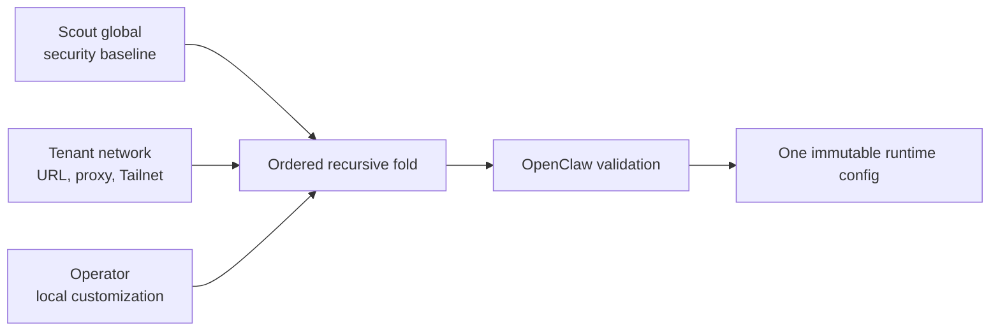

# Proposal: Managed Configuration

## Summary

Add an opt-in way to start OpenClaw from an ordered list of ordinary
configuration documents.

Each document is parsed and validated through OpenClaw's existing configuration
pipeline. OpenClaw then folds the documents in declared order. The first layer
to declare an exact path controls it; later layers may omit it or repeat the
same value, but may not replace it. A small closed set of fields can use
OpenClaw-owned monotonic rules instead.

The first version is deliberately startup-only and read-only. It does not add a
configuration control plane, layer roles, write routing, live reload, or a
provenance API.

## Motivation

Lobster currently needs to combine three kinds of OpenClaw configuration:

- Scout-wide security and Gateway defaults;
- tenant-specific URLs and private-network facts;
- operator-local customization.

Without an upstream composition seam, Lobster must bake those inputs into one
config file and maintain overlay application, stale-value cleanup, and
OpenClaw-specific validation behavior outside OpenClaw. OpenClaw sees only the
result and cannot reject a later overlay that weakens an earlier boundary.

The problem is not unique to Lobster and does not require a new `hosting`
section. The values already belong in the ordinary OpenClaw schema. What is
missing is a generic way to compose multiple ordinary documents while
preserving declared order and rejecting conflicts.

### Why OpenClaw owns composition semantics

OpenClaw must own the merge semantics because OpenClaw owns the configuration
schema, plugin-aware validation, tool-policy interpretation, runtime snapshot,
and mutation boundary. Authority and monotonic-tightening decisions depend on
those semantics; a launcher cannot reproduce them reliably without becoming a
second OpenClaw configuration implementation.

Hosts remain responsible for materializing values and declaring source order.
OpenClaw is responsible for resolving, composing, validating, and enforcing
those sources. This boundary keeps deployment vocabulary outside core while
ensuring every host receives the same conflict and security behavior.

`$include` remains appropriate for structuring one authored configuration
document. It does not preserve authority between independent sources, enforce
monotonic policy bounds, or make the resulting runtime immutable. External
flattening also erases source boundaries before OpenClaw can enforce them.

## Goals

- Accept any positive number of explicitly ordered config documents.
- Keep layer names descriptive, with no built-in host, tenant, or operator roles.
- Apply the same operation recursively for every layer.
- Reuse JSON5, include, environment, schema, and plugin validation behavior.
- Reject exact conflicts instead of silently choosing a winner.
- Permit only proven tightening for the initial bounded tool-policy fields.
- Publish one effective startup snapshot to existing runtime consumers.
- Make the layered runtime immutable for its lifetime.
- Leave ordinary single-config startup unchanged and unaware of the feature.
- Give Lobster a supported seam that can replace baked overlay generation.

## Non-goals

- Implicit source discovery or numeric priorities.
- A fixed two-stage managed/operator model.
- Host-defined comparators or a policy expression language.
- Writable layers or routing config mutations back to source documents.
- Live layer reload, rollback generations, or transactional reconciliation.
- A per-path provenance or explanation API in V1.
- Secret delivery, identity, state synchronization, or plugin installation.
- Moving canonical settings into a parallel hosted-config schema.

## Interface

The Gateway CLI accepts a repeatable option:

```bash
openclaw gateway run \
  --config-layer global=./global.json5 \
  --config-layer tenant=./tenant.json5 \
  --config-layer operator=./operator.json5
```

The syntax is:

```text
--config-layer <id=path>
```

Order is the command-line declaration order. IDs must be non-empty and unique,
but otherwise have no semantics. The examples use deployment vocabulary only
to make the source of each document understandable.

When no `--config-layer` option is present, OpenClaw follows its existing
single-config path with no behavior change.

Layered startup is incompatible with `--dev`, because dev startup creates and
mutates configuration.

## Composition model

Each source is an ordinary sparse OpenClaw config document. For each source,
OpenClaw:

1. reads JSON5;
2. resolves includes using the normal include roots and the source file location;
3. resolves environment references;
4. requires a plain-object root;
5. rejects bootstrap-owned `meta` and `env` root keys.

After every source resolves, OpenClaw folds them in declared order:

```text
state[0] = empty
state[i + 1] = compose(state[i], layer[i])
effective = validate(state[layerCount])
```





Objects compose recursively. Declaring one child does not claim unrelated
siblings. Arrays are whole-field values unless the field has a built-in bounded
rule. Empty objects preserve ownership of that object boundary.

The composed source is validated once through the ordinary OpenClaw schema and
plugin-aware validator. Gateway, plugins, tools, and other consumers receive
the normal runtime config shape; they do not implement layer-specific logic.

## Authority rules

### Exact ownership

Exact ownership is the default.

The earliest layer declaring a path owns that path. A later layer may:

- omit the path;
- repeat the same authored value.

A later layer may not provide a different value. OpenClaw rejects the complete
candidate with a `ControlledByEarlierLayer` finding.

```json
{
  "reason": "ControlledByEarlierLayer",
  "layer": "operator",
  "path": "gateway.controlUi.allowedOrigins",
  "controllingLayer": "tenant"
}
```

There is no silent managed-wins or last-writer-wins behavior.

### Bounded tool policy

V1 has two built-in bounded paths:

| Path | Rule |
| --- | --- |
| `tools.allow` | A later layer may only narrow the effective allow policy |
| `tools.deny` | A later layer may only broaden the effective deny policy |

The comparison uses OpenClaw's runtime tool-policy semantics, including groups,
wildcards, and the meaning of an empty allow list. Ambiguous
expression-to-expression comparisons fail closed unless containment is proven.

A weakening attempt produces `WouldWeakenEarlierLayer`.

No other field receives a comparator in V1. Additional comparators require
field-specific semantics, tests, and demonstrated demand.

## Runtime lifecycle

Layered configuration is a startup input, not a second live config store.

When layered mode is active:

- the composed snapshot is reused for the server lifetime;
- config hot reload is disabled;
- config-mutating RPCs are rejected;
- agent create, update, and delete are rejected before workspace side effects;
- config persistence targeting the layered Gateway's canonical path rejects
  writes;
- a source change takes effect only after Gateway restart.

Read surfaces use the composed snapshot where they would otherwise reread the
canonical config file.

The write guard is owned by the Gateway server lifecycle and scoped to the
canonical config path. Overlapping owners for that path compose safely, while
an unrelated config path remains writable. Closing one layered server removes
only its own guard. Pathless mutation preflights resolve to the canonical path
so plugin or repair side effects cannot occur before persistence is rejected.

This read-only boundary avoids partial write semantics and keeps V1 small. A
future writable-layer design would need explicit source ownership, conflict
detection, atomic persistence, reload, and recovery guarantees and is not
implied by this RFC.

## Lobster example

The following is a realistic three-file Scout deployment. The names are not
special to OpenClaw.

### 1. Scout global config

```json5
// scout-global.json5
{
  gateway: {
    mode: "local",
    auth: {
      mode: "trusted-proxy",
      trustedProxy: {
        userHeader: "x-scout-user",
        requiredHeaders: ["x-scout-tenant"],
      },
    },
    controlUi: {
      dangerouslyAllowHostHeaderOriginFallback: false,
      allowInsecureAuth: false,
      dangerouslyDisableDeviceAuth: false,
    },
  },
  tools: {
    deny: ["exec"],
  },
}
```

### 2. Tenant network config

```json5
// tenant-network.json5
{
  gateway: {
    bind: "tailnet",
    trustedProxies: ["100.96.0.0/12"],
    tailscale: {
      mode: "serve",
      serviceName: "svc:openclaw-acme",
    },
    controlUi: {
      allowedOrigins: ["https://openclaw.acme.internal"],
    },
  },
  tools: {
    deny: ["exec", "web"],
  },
}
```

### 3. Operator config

```json5
// operator.json5
{
  gateway: {
    controlUi: {
      enabled: true,
    },
  },
  logging: {
    level: "info",
  },
}
```

Lobster starts OpenClaw with the three explicit sources:

```bash
openclaw gateway run \
  --config-layer scout=./scout-global.json5 \
  --config-layer tenant=./tenant-network.json5 \
  --config-layer operator=./operator.json5
```



The effective runtime shape is the same ordinary config shape OpenClaw already
consumes:

```json5
{
  gateway: {
    mode: "local",
    bind: "tailnet",
    auth: {
      mode: "trusted-proxy",
      trustedProxy: {
        userHeader: "x-scout-user",
        requiredHeaders: ["x-scout-tenant"],
      },
    },
    trustedProxies: ["100.96.0.0/12"],
    tailscale: {
      mode: "serve",
      serviceName: "svc:openclaw-acme",
    },
    controlUi: {
      enabled: true,
      allowedOrigins: ["https://openclaw.acme.internal"],
      dangerouslyAllowHostHeaderOriginFallback: false,
      allowInsecureAuth: false,
      dangerouslyDisableDeviceAuth: false,
    },
  },
  tools: {
    deny: ["exec", "web"],
  },
  logging: {
    level: "info",
  },
}
```

If the operator document also declares a different
`gateway.controlUi.allowedOrigins`, startup is rejected because the tenant
layer declared that exact path first. If it removes `web` from
`tools.deny`, startup is rejected because that would weaken the inherited
deny floor.

This lets Lobster materialize three source files without teaching OpenClaw
about Scout, tenants, or operators. After an OpenClaw release contains the
feature, Lobster can remove the baked effective-config overlay and its
stale-value cleanup.

## Evidence

The design was developed through the FACES loop:

- frame the host problem and deletion target;
- audit the existing OpenClaw config and lifecycle boundaries;
- compare recursive and layered patterns inside OpenClaw;
- evaluate the contract with maintainer, security, host, operator, and testing
  roles;
- build a broad fork prototype, then reduce it to the smallest supported slice.

Evidence available during RFC review:

- broad fork prototype: https://github.com/giodl73-repo/openclaw/pull/33
- simplified upstream draft implementation:
  https://github.com/openclaw/openclaw/pull/107026
- a Lobster fork adapter materializes Scout, tenant, and operator documents and
  passes them as repeated flags;
- 63 focused OpenClaw tests cover recursive composition, exact conflicts,
  bounded tool policies, config loading, immutable write ownership, and early
  agent-mutation rejection;
- a foreground lifecycle proof demonstrates successful three-layer startup,
  composed config reads, rejected runtime mutation, rejected conflicting
  startup, and no canonical config write;
- fresh-state and existing-state Gateway proofs demonstrate that layered startup
  neither creates a missing canonical config nor changes an existing canonical
  config or its legacy metadata;
- final Codex review reported no actionable correctness regression.

The broad prototype was useful evidence, not the proposed V1. It showed that
writable layers, provenance, reload, and rollback substantially expand the
contract. Those features were removed from the upstream implementation rather
than carried as speculative framework.

## Delivery plan

### PR 1: OpenClaw V1

The implementation draft at
https://github.com/openclaw/openclaw/pull/107026 delivers the complete V1
contract in one reviewable change:

- pure recursive composition;
- exact ownership and bounded tool-policy checks;
- repeatable Gateway CLI loading;
- ordinary config and plugin validation;
- immutable server lifecycle;
- focused tests and user documentation.

The implementation PR records a foreground Gateway proof showing successful
three-layer startup, composed reads, rejected conflict startup, and rejected
runtime mutation. Before moving from draft, it must have green upstream CI.

### PR 2: Lobster adoption and deletion

After an OpenClaw release contains PR 1, Lobster can:

- materialize the three ordinary documents;
- launch OpenClaw with repeated `--config-layer` flags;
- compare the resulting effective config with representative existing
  deployments;
- remove the baked overlay writer, stale-value cleanup, and exact generated-blob
  tests.

The Lobster PR should depend on the released OpenClaw version, not an
unpublished branch. No upstream Lobster PR is required before that release.

## Conformance

V1 acceptance requires:

- no-flag startup remains behaviorally unchanged;
- one or more layers compose in declared order;
- duplicate or malformed descriptors fail;
- JSON5, includes, env references, schema, and plugin validation work;
- exact conflicts fail before readiness;
- tool-policy tightening succeeds and weakening fails closed;
- the Gateway uses the composed snapshot for reads;
- reload is disabled for layered mode;
- config and agent config mutations fail before persistence or workspace side
  effects;
- closing layered runtimes releases only their own write guards;
- documentation shows the generic model and the Lobster three-file example.

## Rationale

### Why an opt-in CLI seam?

It is explicit, easy for hosts to generate, invisible to ordinary users, and
does not add a second persistent config format.

### Why reject conflicts?

Silent precedence hides operator intent and can weaken deployment posture.
Rejecting the whole candidate makes the boundary visible and keeps the last
running configuration unchanged.

### Why only two bounded fields?

Exact ownership is generic. Monotonic comparison is field-specific. The two
tool-policy fields already have runtime semantics OpenClaw can reuse and test.
Adding an empty comparator framework would increase surface area without
delivering behavior.

### Why startup-only and read-only?

Write-through and reload require source selection, concurrency, recovery, and
partial-failure semantics. Hosts can solve the immediate overlay problem by
regenerating source files and restarting. The smaller lifecycle is easier to
reason about and ship.

### Why core rather than a plugin?

Composition and authority must run before plugin-aware validation and plugin
activation. A plugin cannot safely enforce the configuration that controls its
own loading.

## Future work

The following require separate evidence and design review:

- redacted per-path provenance and explanation;
- writable source routing;
- live reload with atomic candidate publication;
- rollback generations;
- additional field-specific bounded comparators;
- non-file source adapters.

None is required for Lobster to replace its baked startup overlays.
