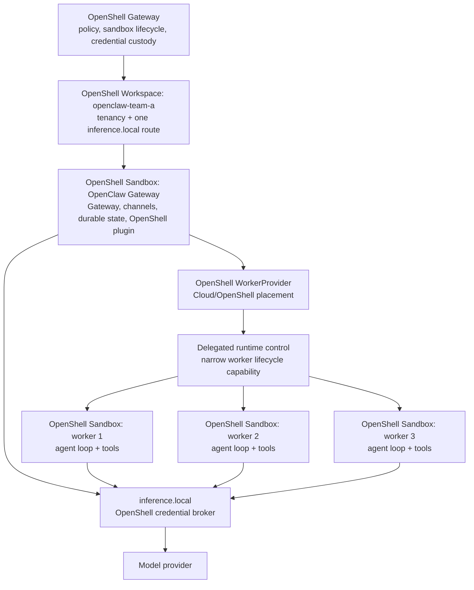

# Proposal: OpenShell Worker Provider and Credential-Brokered Session Sandboxes

## Summary

Extend `@openclaw/openshell-sandbox` with an OpenClaw `WorkerProvider` named
`openshell`. A Cloud/OpenShell session receives one disposable OpenShell
sandbox for its agent runtime and tools. The long-lived OpenClaw Gateway runs
in its own OpenShell sandbox. OpenShell `inference.local` brokers model
credentials for both; neither process receives provider credential values or an
OpenShell client mTLS identity.

This reuses OpenClaw's existing Cloud Worker lifecycle: durable placement,
workspace synchronization, worker protocol, recovery, and reclamation. The
plugin owns only the OpenShell-specific worker lifecycle and transport.

The working branches prove both sides of this design. OpenShell provides
identity-scoped delegated child-sandbox creation and relay; OpenClaw uses that
capability from a Gateway sandbox. The Gateway does not need a standalone
broker or an OpenShell client mTLS key.

## Working branches

- OpenShell: [`sallyom/OpenShell:openshell-openclaw-worker-delegation`](https://github.com/sallyom/OpenShell/tree/openshell-openclaw-worker-delegation) (tested at `b513a765`)
- OpenClaw: [`sallyom/openclaw:openshell-session-workers`](https://github.com/sallyom/openclaw/tree/openshell-session-workers) (rebased on `origin/main` on 2026-07-31)

The OpenShell branch adds the narrow delegated capability; the OpenClaw branch
adds the `openshell` `WorkerProvider` integration. These are draft proof-of-
concept branches, not released interfaces.

## Why

The existing OpenShell `SandboxBackend` isolates selected tool execution, but
the agent loop, session state, and model calls still run in the OpenClaw
Gateway. That is useful tool isolation, not a disposable per-session agent
runtime.

OpenClaw Cloud Workers already have the required lifecycle. An OpenShell
WorkerProvider maps one Cloud Worker environment to one OpenShell sandbox:

- OpenClaw owns placement, sessions, transcripts, and recovery.
- OpenShell owns sandbox policy, network enforcement, provider credentials, and
  model-request credential injection.
- Each selected agent session owns one isolated worker sandbox.

## Goals

- Register the optional `openshell` WorkerProvider when the OpenShell plugin
  is enabled.
- Run the OpenClaw Gateway in an operator-created OpenShell sandbox.
- Place each Cloud/OpenShell session in a separate, disposable OpenShell worker
  sandbox.
- Route Gateway and worker model calls through workspace-scoped
  `inference.local`; OpenShell retains the real provider credential.
- Keep provider credentials, OpenShell client mTLS, and unrestricted sandbox
  control out of Gateway and worker images.
- Reuse the existing Cloud Worker workspace sync, worker protocol, fencing,
  transcript, and reclamation behavior.
- Keep the existing OpenShell tool `SandboxBackend` available independently.

## Non-goals

- Automatically placing every new session in a worker sandbox. Today, users
  explicitly choose Cloud/OpenShell placement.
- Recursive worker placement for subagents.
- Treating a workspace as a sandbox or Podman pod. A workspace is a tenancy,
  policy, and inference-routing scope; sandboxes are compute instances.
- Giving Gateway or worker code a general OpenShell CLI, client mTLS key, or
  provider credential value.
- Per-session provider/model switching within one OpenShell workspace.
- Changing credential behavior for OpenClaw deployments that do not opt into
  this OpenShell configuration.

## Architecture

The diagram shows one OpenClaw Gateway deployment. Deployments that need
separate tenancy or inference routes use separate OpenShell workspaces.



The boundaries are deliberate:

- **Workspace:** shared OpenShell scope for policy, sandbox ownership, and one
  selected `inference.local` provider/model route.
- **Gateway sandbox:** long-lived OpenClaw control plane. A session that is not
  placed in Cloud/OpenShell continues to execute here, subject to OpenShell
  policy.
- **Worker sandbox:** one disposable Cloud Worker environment and one attached
  OpenClaw session. Its agent loop and tools execute here.
- **Credential broker:** `inference.local` is an OpenShell endpoint. Gateway
  and workers use a credential-free route and SDK placeholder; OpenShell
  resolves and injects the real provider credential.

Workers are child sandboxes of the long-lived Gateway sandbox and remain in its
OpenShell workspace. The Gateway remains the OpenClaw control plane; the
delegation credential does not make it an OpenShell administrator.

## Proposal

### Expand the plugin with a WorkerProvider

When enabled, `@openclaw/openshell-sandbox` registers two independent
capabilities:

| Capability | What it isolates | Where the agent loop runs |
| --- | --- | --- |
| `SandboxBackend` | selected tool execution | OpenClaw Gateway sandbox |
| `WorkerProvider` | selected session's full agent runtime and tools | dedicated OpenShell worker sandbox |

The `openshell` WorkerProvider:

1. derives a stable OpenShell sandbox name from OpenClaw's durable provision
   operation id;
2. creates or adopts that exact sandbox with the configured image and policy;
3. reports lifecycle state for reconciliation;
4. returns a provider-authenticated SSH/proxy transport for workspace sync and
   `openclaw worker` launch; and
5. deletes the exact sandbox when the Cloud Worker environment is reclaimed.

The operation-derived name makes a lost create response recoverable: OpenClaw
can inspect and adopt the named sandbox rather than creating a second one.

### Map one Cloud session to one worker sandbox

OpenClaw already attaches at most one session to a Cloud Worker environment. The
WorkerProvider maps that environment directly to one OpenShell sandbox:

```text
OpenClaw session selected as Cloud/OpenShell
  -> durable Cloud Worker environment
  -> OpenShell WorkerProvider lease
  -> one OpenShell worker sandbox
  -> one restricted openclaw worker runtime
```

The worker receives the normal placement-scoped OpenClaw worker credential and
establishes its normal authenticated outbound connection to the Gateway. That
credential is for the OpenClaw worker protocol only; it is neither an OpenShell
administrative identity nor a model-provider credential.

The worker image is selected by the OpenClaw OpenShell profile. It must contain
the OpenClaw worker runtime and normal SSH/workspace-sync dependencies; it does
not need the OpenShell CLI or client mTLS material.

### Broker model credentials through OpenShell

The target deployment configures the Gateway and every worker to use the
workspace's `inference.local` route. OpenClaw configuration contains only the
selected OpenClaw provider/model shape, route URL, and non-secret SDK
placeholder.

OpenShell owns the provider record, real credential, injection and refresh,
model-provider egress policy, and selected workspace route. The plugin validates
the configured profile against the effective route before provisioning a worker.
A mismatch fails closed; it must not fall back to an OpenClaw-held credential.

Current route cardinality is explicit:

- one workspace has one selected `inference.local` provider/model route;
- all Gateway and worker sandboxes in that workspace use that route; and
- a deployment that needs a different route creates another workspace and
  selects a profile for it.

This is credential and route isolation at the workspace level, not a claim that
each session has a distinct provider route.

### Delegate only the runtime control the plugin needs

The Gateway sandbox must not receive the OpenShell client mTLS identity or the
supervisor's full sandbox JWT. It opts in with
`OPENSHELL_DELEGATION_TOKEN_FILE=/run/openshell/delegation-token`; its
supervisor refreshes a separate parent-bound credential at that path. The
required OpenShell capability supports only:

- create a worker sandbox using the parent sandbox's server-owned image,
  policy, resources, and ordinary environment;
- inspect and delete a worker sandbox belonging to the calling Gateway;
- obtain the authenticated worker SSH/proxy transport; and
- read the effective workspace inference route metadata.

It must not expose arbitrary CLI execution, arbitrary policy or image
selection, credential retrieval, unrelated workspace access, or a reusable mTLS
key.

OpenShell derives the parent relationship from the delegation credential,
stamps the child ownership label server-side, enforces same-workspace scope,
and authorizes relay only to owned children. It clears the delegation marker
from children, so worker sandboxes cannot recursively create grandchildren. No
external broker, client mTLS key, or full supervisor JWT is required.

### Configuration shape

The plugin remains optional. A profile selects `provider: "openshell"` and
describes the worker sandbox shape and fixed inference route:

```json5
{
  cloudWorkers: {
    profiles: {
      "openshell-opus": {
        provider: "openshell",
        install: "bundle",
        settings: {
          workspace: "openclaw-team-a",
          from: "quay.io/example/openclaw-worker:latest",
          policy: "/etc/openshell/openclaw-worker.yaml",
          autoProviders: false,
          inference: {
            mode: "local",
            provider: "team-anthropic",
            openclawProvider: "anthropic",
            model: "claude-opus-4-7",
            api: "anthropic-messages",
          },
        },
      },
    },
  },
}
```

The profile does not contain a provider credential or mTLS key. In delegated
mode, OpenShell owns the worker image, policy, resources, and provider-attach
decision through the Gateway parent sandbox; the plugin supplies only the
parent-bound control transport. The current proof invokes the OpenShell CLI in
the Gateway image with that restricted credential. Worker images do not need
the CLI.

The current proof still invokes the OpenShell CLI as a compatibility surface;
the sandbox JWT is supplied out-of-band by the mounted token file. The eventual
plugin should call the equivalent delegated API directly, so the OpenShell CLI
does not need to be baked into Gateway or worker images.

### Lifecycle

1. An operator creates an OpenShell workspace, registers the provider
   credential with OpenShell, selects `inference.local`, and creates the
   Gateway sandbox from an OpenClaw image with the plugin enabled.
2. A user creates a session and selects the Cloud/OpenShell profile.
3. OpenClaw creates a durable Worker environment and calls the plugin with a
   stable provision operation id.
4. The plugin uses delegated runtime control to create or adopt the matching
   worker sandbox, validates inference, and returns its transport.
5. OpenClaw synchronizes the Git-backed workspace, starts `openclaw worker`,
   and attaches the session.
6. The worker runs the agent loop and tools in its sandbox. Model calls go to
   `inference.local`; events and transcript commits use the normal worker
   connection to the Gateway.
7. On reclaim, failure, or reconciliation, OpenClaw asks the plugin to delete
   the exact operation-derived sandbox.

## Security properties

| Property | Boundary |
| --- | --- |
| Gateway and worker code cannot read model-provider credential values | OpenShell credential store and `inference.local` injection |
| Gateway and workers cannot create arbitrary sandboxes | delegated runtime permits only scoped lifecycle operations |
| One selected session cannot access another session's runtime/filesystem | one Cloud Worker environment maps to one worker sandbox |
| Gateway-local sessions remain policy-governed | Gateway runs in an OpenShell sandbox |
| Client mTLS is not in an agent image | native delegation replaces the temporary external holder |

Worker policies remain independently configurable, so a worker can receive
fewer filesystem, network, or compute capabilities than the Gateway sandbox.

## Delivery and acceptance

### Abbreviated reviewer smoke test

An agent can reproduce the core path as follows:

```text
1. Check out the two Working branches above.
2. In OpenShell, build `openshell-gateway` and `openshell`; start a local
   Podman-backed mTLS gateway and create one test workspace.
3. Create the long-lived OpenClaw Gateway sandbox from the working OpenClaw
   image with `OPENSHELL_DELEGATION_TOKEN_FILE=/run/openshell/delegation-token`.
   Record its `OPENSHELL_SANDBOX_ID`; verify only the restricted token path is
   visible to the workload.
4. From that Gateway sandbox, run `openshell sandbox create --parent-sandbox-id
   "$OPENSHELL_SANDBOX_ID" ...`; verify the child is Ready and its
   `openshell.nvidia.com/parent-sandbox-id` label is server-owned.
5. Open an SSH/proxy stream to the child using the delegation token; verify the
   child SSH banner is returned. Verify `sandbox list`, a different
   parent/workspace, and credential-bearing inference calls are denied.
6. Build/run the OpenClaw branch with the `openshell` WorkerProvider and a
   workspace `inference.local` route. Start one Cloud/OpenShell session and
   verify one additional worker sandbox appears; reclaim it and verify it is
   deleted.
```

The OpenShell unit suite and OpenClaw OpenShell provider tests should be green
before the UI demo is attempted. The standalone broker used by earlier PoCs is
not part of this smoke test.

The integration is complete only when it demonstrates:

1. Two concurrent Cloud/OpenShell sessions create two distinct worker sandboxes,
   and reclaiming one never deletes the other.
2. A non-Cloud session continues to execute in the Gateway sandbox.
3. Gateway and worker model calls use `inference.local`, while their runtime
   environments contain no model-provider credential value or OpenShell client
   mTLS material.
4. A worker synchronizes its Git-backed workspace and connects through the
   provider-authenticated SSH/proxy transport.
5. Gateway restart and lost-create-response recovery adopt or clean up the
   operation-derived sandbox deterministically.
6. The plugin remains optional and deployments without it retain current
   behavior.

## Alternatives considered

### Use only SandboxBackend

This isolates tool calls but leaves the agent runtime and session model activity
in the Gateway. It does not provide the per-session runtime boundary.

### Put a general OpenShell CLI and mTLS key in the Gateway image

This is simpler mechanically but gives Gateway-resident code broad control-plane
authority. It defeats the intended separation between an agent runtime and
OpenShell administration.

### Put all OpenClaw activity in one sandbox

This is a valid single-boundary deployment, but sessions share the Gateway
runtime. It does not provide a disposable sandbox for each selected session.

### Use Gateway-managed provider credentials

This preserves existing OpenClaw provider behavior but does not meet the goal
that model credentials stay outside Gateway and agent runtimes.

## Open questions

- What is the final OpenShell API and authorization model for delegated worker
  lifecycle control?
- Should OpenShell expose machine-readable inference-route metadata and version
  preconditions rather than requiring the plugin to parse CLI text?
- Should OpenClaw add default session/subagent placement policy after the
  WorkerProvider path is established?
- Should a future OpenShell feature support sandbox-scoped inference bindings
  for deployments needing route or quota isolation below the workspace?
