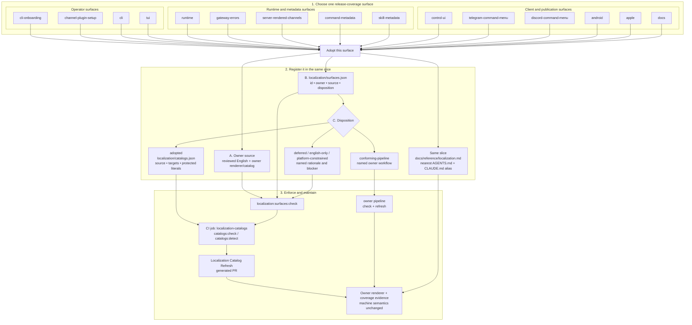
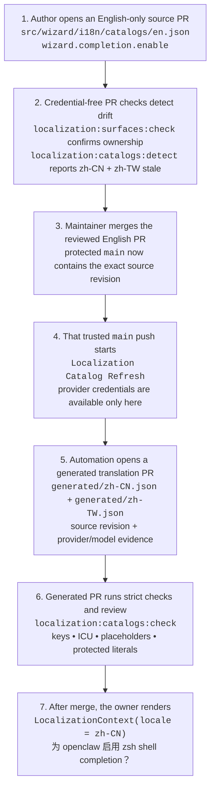

# Proposal: Localization Runtime and Product Coverage

## Summary

OpenClaw will support one 22-locale product target across its 15 required
product surfaces: English is the reviewed source locale and the other 21 are
translation targets. That is 315 translation-target cells. Coverage lands
progressively, but a full product claim requires every cell to be complete.

Each surface still owns its English copy, catalogs, renderer, translation
workflow, and review policy. Shared infrastructure provides locale identity,
`LocalizationContext`, ICU formatting through `intl-messageformat`, fallback,
validation, inventory, CI gates, generated-PR automation, and coverage
reporting. Codes, commands, identifiers, structured output, user data, and
model-generated content are never translated by this system.

The detailed contracts are normative and live in these focused sidecars:

- [Localization Runtime v1 specification](0024/localization-runtime-v1-spec.md)
- [Localization Coverage v1 specification](0024/localization-coverage-v1-spec.md)
- [Localized Metadata v1 specification](0024/localized-metadata-v1-spec.md)
- [Implementation plan](0024/implementation-plan.md)
- [Projected owner slice registry](0024/projected-owner-slice-registry.md)
- [GitHub issue catalog](0024/issue-catalog.md)

## System at a glance

Each product surface enrolls independently. An adopted shared-catalog surface
updates three code locations in the same slice: its owner source,
`localization/surfaces.json`, and `localization/catalogs.json`. A surface with
an existing conforming pipeline names that workflow instead. The same slice
also updates the public workflow index and nearest owner guidance.



Control UI, native, and documentation surfaces keep their existing formats and
owner workflows while satisfying the same inventory, evidence, and coverage
contract. A deferred or platform-constrained disposition remains visible as a
product-completion blocker; it is not counted as localized.

These are release-reporting rows, not delivery-slice names. For example,
updater and Doctor work rolls into `cli`; approval work can affect `runtime`,
`gateway-errors`, and `server-rendered-channels`; and adapter-specific evidence
feeds the appropriate channel row. Adding an implementation slice does not
silently add another row to the 315-cell product denominator.

### Example: one English wizard string, end to end

The wizard authoring exemplar in OpenClaw PR
[#112784](https://github.com/openclaw/openclaw/pull/112784), together with the
surface-inventory follow-up
[#112801](https://github.com/openclaw/openclaw/pull/112801), shows the complete
path with an actual message:



| Point in the path | Actual value |
| --- | --- |
| English source PR | `"wizard.completion.enable": "Enable {shell} shell completion for {cli}?"` |
| PR detection | `zh-CN/wizard-core` and `zh-TW/wizard-core` are stale |
| Trusted trigger | Merge of the registered English source path to protected `main` |
| Generated translation PR | `"wizard.completion.enable": "为 {cli} 启用 {shell} shell completion？"` plus source-pinned evidence |
| Runtime output | `t("wizard.completion.enable", { shell: "zsh", cli: "openclaw" })` → `为 openclaw 启用 zsh shell completion？` |

The checked-in `zh-CN` exemplar is marked `bootstrap-reviewed` with a human
provider. The first credentialed post-merge refresh is therefore still a
supervised rollout gate. Once that gate succeeds, no contributor manually
creates the translation PR: the English merge triggers the trusted refresh and
generated-PR publisher. The same loop applies to every one of the 15 product
surfaces, using its registered source and owner workflow.

## Product target

RFC 0024 starts with the union of locales already shipped by OpenClaw:

```text
en, zh-CN, zh-TW, pt-BR, de, es, ja-JP, ko, fr, hi, ar,
it, tr, uk, id, pl, th, vi, nl, fa, ru, sv
```

This is 22 locales, not 22 translated languages: English is the source and the
other 21 are translation targets. The current portfolio has 15 required
product surfaces, so the terminal target is:

```text
15 required surfaces × 21 translation targets = 315 target cells
```

Every cell reports `complete`, `partial`, `experimental`,
`platform-constrained`, or `unsupported`. Only `complete` counts toward the
full product claim. A constraint can explain an incomplete cell but cannot
silently remove it from the denominator.

The 22-locale registry is a v1 baseline, not a permanent cap or a claim of
world-language coverage. Adding a locale requires demand, catalog ownership,
review capacity, fallback behavior, direction and formatting support, and an
explicit initial maturity state.

## Decision

RFC 0024 establishes six rules:

1. **One locale context.** Each user-visible operation captures one immutable
   `LocalizationContext` at its owning presentation edge. Explicit user or
   recipient preference outranks request, surface, operator, and platform
   inference; unsupported values fall back safely to English.
2. **Stable product messages.** Product-owned text uses a stable key, typed
   literal parameters, and a reviewed English fallback. Shared JavaScript and
   TypeScript rendering delegates ICU formatting to `intl-messageformat`.
3. **Surface ownership.** The presenting surface owns message meaning,
   catalogs, rendering, translation workflow, and review. Shared core owns
   locale, validation, fallback, and evidence semantics—not product copy.
4. **Machine semantics never change.** Error codes, commands, config keys,
   IDs, paths, structured output, user data, upstream prose, and model output
   remain literal.
5. **Compatibility is additive.** Known Gateway errors keep their stable code
   and reviewed English `message`; owner-approved messages may add bounded
   `details.localization` metadata that capable clients render and old clients
   ignore.
6. **Coverage is evidence-based.** Every adopted surface publishes inventory,
   validation, catalog revision, maturity, and required-review evidence. A
   release claim is generated only from landed owner declarations.

The exact runtime types, validation bounds, locale precedence, Gateway wire
shape, metadata fields, maturity meanings, and conformance requirements live
in the linked normative sidecar specifications.

## What gets localized

| Content | Rule |
| --- | --- |
| Product-owned presentation | Localize through a stable key at the owning renderer. |
| Product-owned labels and enum presentation | Use catalog labels or ICU `select`; do not leak raw English labels. |
| Codes, commands, config keys, IDs, paths, URLs, versions | Preserve literally. |
| User/operator data and executable content | Preserve literally with renderer-safe isolation. |
| Provider errors, third-party prose, model output | Preserve or safely summarize; never silently runtime-translate. |
| Logs, traces, and developer diagnostics | Outside the product-localization claim. |

Safety-sensitive families such as approvals, authentication, authorization,
destructive actions, privacy, and recovery require scoped human review before
a locale can be complete. If a required safety catalog is missing, invalid, or
unreviewed, the whole presentation falls back to one reviewed English snapshot
rather than mixing languages.

## How delivery works

The project uses shared per-repository gates and workflows, not a new gate or
translation system for every slice:

1. Land the locale/context/runtime foundation and one real consumer.
2. Enroll one owner surface by updating its source, inventory, catalog or
   conforming-pipeline disposition, and owner guidance in the same slice.
3. Run credential-free detection on ordinary pull requests.
4. Let the trusted owner workflow generate candidate catalogs and open a
   generated pull request.
5. Validate keys, placeholders, protected literals, provenance, formatting,
   fallback, and required human review.
6. Land the source and generated artifacts, then update the coverage report.

A source PR may be separate from its generated-catalog PR, but the adoption
slice is not complete until both land with required review. Translation
credentials never run against untrusted pull-request code, and AI-generated
copy never approves itself.

The current source audit contains 47 projected slices grouped into 16
dependency-safe delivery packages, with a product-completion decision targeted
for September 1, 2026. These are planning units, not 47 required PRs or runtime
identifiers. Slices may combine or split at owner and publication boundaries.
The live delivery state is tracked in
[openclaw#113105](https://github.com/openclaw/openclaw/issues/113105).

## Completion milestones

1. **Architecture accepted:** locale, ownership, fallback, compatibility, and
   coverage contracts are approved.
2. **Foundation shipped:** the shared kernel, reusable gates, trusted refresh,
   inventory, and one end-to-end consumer are landed and supervised.
3. **Owner cohorts complete:** each required surface adopts the contract or
   proves its existing pipeline conforms, with generated catalogs and review.
4. **Product claim promoted:** all 315 target cells are complete. Any remaining
   partial, unsupported, deferred, or constrained cell blocks the unqualified
   22-locale product claim.

## Compatibility boundaries

- Existing English output, locale IDs, environment variables, stored
  preferences, Gateway error fields, command names, and plugin manifests remain
  valid unless a separately approved migration changes them.
- `zh-CN` and `zh-TW` remain canonical in v1; `zh-Hans` and `zh-Hant` are
  accepted aliases.
- The optional Gateway `ConnectParams.locale` describes that connected client;
  it does not establish a different channel recipient's or approval reviewer's
  locale.
- Server-rendered channel text stays English until its owner has a legitimate
  recipient locale source.
- Existing Control UI, native, docs, and wizard pipelines are preserved and
  brought under the shared evidence contract rather than replaced.
- A bad or withdrawn translation falls back to English without changing the
  underlying operation or machine-readable result.

## Non-goals

- Bulk-extract every string, exception, or log.
- Translate at runtime with a model.
- Translate commands, codes, identifiers, structured output, or executable
  content.
- Force one catalog format or renderer on UI, native, docs, CLI, and channels.
- Create a public external-plugin runtime catalog API in v1.
- Treat generated translation as linguistic or safety approval.
- Couple model-generated content language to the product UI locale.

## Unresolved owner decisions

- Who approves the first public recipient-locale preference for
  server-rendered channel messages?
- What review standard and reviewer roster are required for safety-sensitive
  copy in all 21 translation targets?
- How should third-party localized metadata report review quality without
  implying OpenClaw endorsement?
- Which publishing path completes Persian and Thai documentation catalogs?
