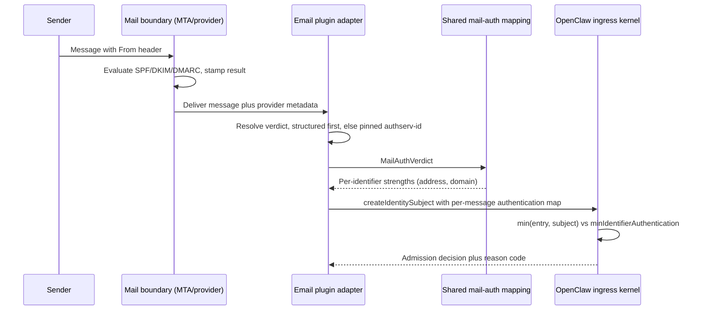

# Proposal: Channel-Agnostic Sender Authentication Strength

## Summary

OpenClaw's ingress kernel already models one axis of identifier trust, the boolean
`dangerous` flag that marks mutable identifiers such as display names, and the
`mutableIdentifierMatching` policy that refuses to let those identifiers authorize a
sender. That boolean conflates two very different facts: an identifier the transport
authenticated, and an identifier the transport merely relayed. This proposal generalizes
the existing boolean into a small ordered authentication strength on the same field,
evaluated by the same gate, so an operator can require that a sender's identifier was
actually authenticated before it authorizes anything. No new module, no new plugin kind,
and no email-specific contract enter core.

## Motivation

### The concrete failure

A downstream OpenClaw consumer runs a private inbound email channel. Its effective sender
policy resolved to `dmPolicy: "open"` with no projected allowlist, so any sender inside the
owner's tenant could drive the owner's agent. The immediate fix is downstream and is not
what this RFC proposes.

What the incident exposed is upstream. The channel handed core an SMTP `From:` header as a
sender identifier. Core had no way to represent that this identifier was unauthenticated,
because the only distinction core models is mutable versus not-mutable, and an SMTP
`From:` header is not mutable in the sense `dangerous` means. It is stable, attacker-chosen,
and completely unauthenticated.

### What already exists

| Piece | Location |
| --- | --- |
| Per-identifier flag `dangerous?: boolean \| ((value: string) => boolean \| undefined)` | `src/channels/message-access/runtime-types.ts:45-46` |
| Matchable identifier carrying `dangerous?: boolean` | `src/channels/message-access/types.ts:24-29` |
| Policy knob `mutableIdentifierMatching?: "disabled" \| "enabled"` | `src/channels/message-access/types.ts:228` |
| Gate that strips `dangerous` entries from `matchedEntryIds` | `applyMutableIdentifierPolicy`, `src/channels/message-access/allowlist.ts:89-125` |
| Reason code `mutable_identifier_disabled` | `src/channels/message-access/types.ts:297` |
| Channel declaration site | `defineStableChannelIngressIdentity`, `src/channels/message-access/runtime-identity.ts:22-36` |
| Public break-glass config `dangerouslyAllowNameMatching` | `src/config/types.channel-messaging-common.ts:90` |

Six bundled channels already declare mutable identifiers: `discord`
(`extensions/discord/src/monitor/dm-command-auth.ts:75`), `slack`
(`extensions/slack/src/monitor/auth.ts:122`), `msteams`
(`extensions/msteams/src/monitor-handler/access.ts:30`), `googlechat`
(`extensions/googlechat/src/monitor-access.ts:75`), `mattermost`
(`extensions/mattermost/src/mattermost/monitor-auth.ts:30`), and `irc`
(`extensions/irc/src/inbound.ts:58,73`). Google Chat already marks an **email address** as
mutable, which is the closest existing precedent for the problem this RFC addresses.

### The gap

"Not mutable" conflates "the transport authenticated this identifier" with "the transport
handed us a string." A Signal ACI, a Discord snowflake, and an unauthenticated SMTP `From:`
header are all equally non-`dangerous` today. An operator cannot express "only authorize
senders whose identifier was actually authenticated."

`docs/security/THREAT-MODEL-ATLAS.md:156-166` already names this as T-ACCESS-002
("AllowFrom spoofing", residual risk Medium) and recommends "add cryptographic verification
where possible," tracked as recommendation R-008 at `docs/security/THREAT-MODEL-ATLAS.md:507`.

## Goals

- Let a channel declare, per identifier, how strongly the transport authenticated it,
  statically for session-authenticated transports and per message for transports that
  authenticate each message.
- Let an operator require a minimum authentication strength before an identifier may
  authorize a sender.
- Reuse the existing gate, policy position, and reason-code family rather than adding a
  parallel trust vocabulary.
- Keep the shipped `dangerous` boolean working through a named deprecation window.
- Keep email out of core entirely. Email becomes one consumer of a generic fact.

## Non-Goals

- Adding DKIM, SPF, DMARC, or `Authentication-Results` parsing to core. There are zero
  such references in the repository today and zero email channels in `extensions/`.
- Adding capability tiers or a second admission gate. Strength is an admission input to
  the existing allowlist gate, nothing more.
- Keying `toolsBySender` (`src/agents/sender-tool-policy.ts:23`) on strength. That is a
  possible follow-up, deliberately deferred. A named consumer requirement now exists for it
  (gating mailbox actions such as move, archive, and delete on sender strength), which makes
  the follow-up concrete rather than speculative, and still does not make it v1.
- Defining what "authenticated" means for any specific transport. Each channel owns that
  judgment and must document it.
- Composing this with approval flows. RFC 0011 already owns plugin-attested approvals.
- Adding a new operator-facing config surface in v1. The default policy minimum stays
  `asserted`, which is exactly today's default behavior, so no current deployment changes;
  requiring `verified` is new and opt-in, declared in code by a channel. A public
  minimum-strength config knob, if ever justified, is a separate RFC.

## Proposal

### Ordered strength scale

Four levels, mechanism-neutral:

| Level | Meaning | Example |
| --- | --- | --- |
| `verified` | The identifier came from transport or session metadata that the channel treats as authenticated for sender binding | Signal ACI, Discord snowflake from an authenticated gateway session |
| `asserted` | A boundary the channel trusts vouched for the identifier, without binding it to this specific sender | SMS caller ID, an address whose *domain* authenticated but whose mailbox nothing named |
| `unverified` | The identifier was presented by a party nobody authenticated. Stable, attacker-chosen, unproven | SMTP `From:` with no aligned authentication |
| `mutable` | A user-changeable label or similarly weak alias (today's `dangerous: true`) | display name, username, nickname |

Ordering is `verified > asserted > unverified > mutable`.

`unverified` and `mutable` are both untrustworthy, and they are separated because they are
untrustworthy for different reasons. A display name is weak because it is an alias: two
people can hold the same one, and it identifies nobody even when honestly set. An
unauthenticated `From:` is weak because nothing bound it to its sender: it is an exact,
stable identifier whose claimed ownership is simply unproven. Collapsing them would force a
channel to describe a precise address as a nickname to get it rejected, which is how a
diagnostic ends up lying about why it fired.

**Why `asserted` cannot absorb the unauthenticated case.** It is tempting to keep three
levels and call an unauthenticated `From:` `asserted`. That is what the reference
implementation did, and it produced a live spoofing bypass: with the default minimum at
`asserted` (below), an identifier nobody authenticated cleared the bar, so every allowlisted
address could be spoofed by anyone. The floor has to sit below the default or the default is
not a bar. Stated generally:

> A scale whose lowest reachable value for an identifier equals the configured minimum for
> that identifier is not a gate.

The scale stops at four. See Rationale for why a fifth `cryptographic` level above
`verified` is not in v1.

### Type contract

Identifier declaration side, extending `ChannelIngressIdentityField` and
`ChannelIngressIdentityAlias` in `src/channels/message-access/runtime-types.ts`:

```ts
/** How strongly the transport authenticated this identifier for sender binding. */
export type IdentifierAuthentication = "verified" | "asserted" | "unverified" | "mutable";

export type ChannelIngressIdentityField = {
  // ...existing members unchanged...

  /**
   * Authentication strength for this identity field. Mirrors the existing `dangerous`
   * shape: a constant, or a predicate for fields whose strength varies per value.
   */
  authentication?:
    | IdentifierAuthentication
    | ((value: string) => IdentifierAuthentication | undefined);

  /** @deprecated Use `authentication`. `true` maps to `"mutable"`. */
  dangerous?: boolean | ((value: string) => boolean | undefined);
};
```

Matchable identifier side, in `src/channels/message-access/types.ts`:

```ts
type MatchableIdentifier = {
  opaqueId: string;
  kind: ChannelIngressIdentifierKind;
  authentication: IdentifierAuthentication;
  sensitivity?: "normal" | "pii";
};
```

Note that `authentication` is **required** on the normalized internal shape even though it
is optional on the declaration surface. Normalization resolves it exactly once, so no
downstream consumer branches on absence.

Policy side, extending `ChannelIngressPolicyInput` in
`src/channels/message-access/types.ts`:

```ts
export type ChannelIngressPolicyInput = {
  // ...existing members unchanged...

  /** Minimum identifier authentication strength that may authorize a sender. */
  minIdentifierAuthentication?: IdentifierAuthentication;

  /** @deprecated Use `minIdentifierAuthentication`. */
  mutableIdentifierMatching?: "disabled" | "enabled";
};
```

### Per-message strength

Field-level declaration is sufficient for every channel that exists today, because whether
a Slack `senderName` is mutable is a static property of the field. It is **not** sufficient
in general. For a transport whose authentication varies per message, the same identifier
string can carry different strength on different messages: `operator@example.com` is `verified`
in a DMARC-aligned message and `asserted` in a spoofed one.

The current subject input carries only values
(`src/channels/message-access/runtime-types.ts:89-94`), and strength is resolved from the
field declaration through a value-only predicate (`runtime-identity.ts:56`, applied to
entries at `:99` and subjects at `:180`). A predicate that sees only the value string
cannot make that distinction. Subject input therefore gains an optional per-message
strength map:

```ts
export type ChannelIngressIdentitySubjectInput = {
  stableId?: string | number | null;
  aliases?: Record<string, string | number | null | undefined>;
  /**
   * Per-message authentication strength, keyed like `aliases` plus the primary field key.
   * Channels whose strength varies per inbound message supply it here. Static channels
   * omit it and keep declaring strength on the field.
   */
  authentication?: Record<string, IdentifierAuthentication>;
};
```

### The comparison

Strength exists on both sides: the configured allowlist entry, and the inbound subject. The
gate takes the weaker of the two.

```text
min(entry.authentication, subject.authentication) >= policy.minIdentifierAuthentication
```

with `verified > asserted > unverified > mutable`.

The `min()` is the load-bearing half. An allowlist entry configured as a display name stays
weak no matter how strongly the message authenticated, and a well-configured address entry
still cannot authorize a message that failed authentication. Today's gate compares only the
entry side (`src/channels/message-access/allowlist.ts:100-118`); extending it to the
subject side is what makes the primitive usable by transports with per-message
authentication.

### Normalization precedence

Resolved once, during entry and subject normalization:

1. If the subject supplies `authentication` for this field key, use it (subjects only).
2. Else if the field declares `authentication`, use it.
3. Else if `dangerous` resolves to `true`, use `"mutable"`.
4. Else use `"asserted"`.

Step 4 is the load-bearing default and it is deliberately conservative. A channel that has
not thought about this question does not get to claim `verified`. Because the default
policy minimum is also `asserted` (see below), this default changes no current behavior; it
only prevents a silent claim of strength that nobody made.

### Default policy minimum

Today, `applyMutableIdentifierPolicy` treats any value other than `"enabled"` as disabled
(`src/channels/message-access/allowlist.ts:93`), so mutable identifiers are **already**
stripped by default. That maps exactly onto a default `minIdentifierAuthentication` of
`"asserted"`.

| Today | Under this proposal |
| --- | --- |
| `mutableIdentifierMatching` unset or `"disabled"` | `minIdentifierAuthentication: "asserted"` |
| `mutableIdentifierMatching: "enabled"` | `minIdentifierAuthentication: "mutable"` |

Every current deployment therefore keeps its exact current behavior with no config change.
Requiring `"verified"` is a new, opt-in posture.

**Adding `unverified` below the default preserves that guarantee rather than spending it.**
The compatibility claim holds because no shipped channel emits `unverified`: today's
channels produce a session-authenticated identifier plus, at worst, a `dangerous` display
name, which map to `verified` and `mutable` exactly as before. Undeclared identifiers still
normalize to `asserted` (see Normalization precedence), so nothing an existing channel emits
moves. A channel only lands below the default by explicitly saying "nobody authenticated
this", which is a statement no current channel makes and every email channel must.

This is the part worth being precise about, because the obvious alternative is worse. Making
the *default* stricter, or reclassifying existing `asserted` identifiers, would close the
same hole while breaking deployments that are not affected by it. Putting a new floor
underneath an unchanged default closes it for the channels that need it and is a no-op for
everyone else. The compatibility guarantee and the secure default are only in tension if the
fix moves identifiers that already exist.

### Gate and reason codes

`applyMutableIdentifierPolicy` becomes `applyIdentifierAuthenticationPolicy` in the same
file, filtering matches whose weaker side is below the policy minimum. One reason
code is added to `IngressReasonCode`:

```ts
| "identifier_authentication_too_weak"
```

`mutable_identifier_disabled` is retained and emitted when the rejected entry's strength is
`mutable` and the minimum is `asserted`, which is the entire set of cases that can produce
it today. Existing diagnostics, tests, and operator-facing text keep working unchanged.
Adding a reason code is additive to `IngressReasonCode`, which is exported through
`src/plugin-sdk/channel-ingress-runtime.ts:40`.

### The invariant that makes this safe

A plugin declares its own identifiers' strength. Core does not verify the claim, exactly as
core does not verify a plugin's approval attestation under accepted RFC 0011:

> "OpenClaw does not verify the third-party proof. It accepts an attestation from an
> installed plugin that is already trusted to execute in process. Ownership checks prevent
> one plugin from resolving another plugin's approval; they do not make a malicious
> installed plugin honest."

That trust model is settled upstream and this RFC does not relitigate it. The invariant
that must hold, and that applies regardless of whether a plugin is trusted, is narrower:

1. **Strength must never be derived from sender-controlled message content.** Only from
   transport or session metadata the transport itself authenticated. A plugin that reads a
   header the sender wrote and calls the result `verified` has produced a fiction.
2. **The plugin declares; the operator decides what it is worth.** Strength is
   channel-reported, the minimum is config-owned. A plugin cannot widen its own authority.
3. This mirrors the existing precedent at
   `src/agents/embedded-agent-runner/effective-tool-policy.ts:21-28`: "callers MUST resolve
   it from server-verified session metadata (session key, inbound transport event), never
   from tool-call or model-controlled input."

Any channel declaring `verified` must document, in its own docs, what transport fact backs
that claim. A channel that cannot state one declares `asserted`.

### Migration

Three surfaces migrate, on different clocks.

**1. The SDK field `dangerous`.** This is exported plugin-SDK surface via
`src/plugin-sdk/channel-ingress-runtime.ts` and gated by `pnpm plugin-sdk:surface:check`
against `src/plugin-sdk/api-baseline.ts`. `openclaw doctor --fix` cannot migrate plugin
source code, so this needs a real deprecation window, which is what the SDK guide
prescribes for shipped external API: new API first, named deprecation, removal plan.

- `authentication` ships alongside `dangerous`.
- `dangerous` is marked `@deprecated` with the mapping documented.
- Bundled and first-party channels migrate in-tree in the same release.
- `dangerous` is removed no earlier than the next major, named in the deprecation note.

**2. The public config `dangerouslyAllowNameMatching`.** This is where the config surface
bar in the root `AGENTS.md` bites hardest: "Before adding a config option or env var, first
prove existing product behavior, provider selection, defaults, or doctor migration cannot
solve it."

v1 does not replace it. `dangerouslyAllowNameMatching: true` continues to mean exactly what
it means today, and resolves to `minIdentifierAuthentication: "mutable"`. It lives on the
shared `ChannelBotInteractionConfig` type (`src/config/types.channel-messaging-common.ts:87-91`),
so this is one shared definition rather than a per-channel fan-out.

An operator-facing knob for requiring `verified` is **deferred out of v1**. No public
channel can currently justify it, and adding it before one can would be config surface
purchased on speculation. When a public channel needs it, it arrives as its own change with
a `openclaw doctor --fix` migration.

This deferral only holds because `unverified` exists. Without it, the worked example below
would need `minIdentifierAuthentication: "verified"` merely to reject spoofed mail — an
earlier draft's example set exactly that — leaving v1 in the position of deferring the knob
its own motivating consumer required, and making every email channel's safety depend on
privately overriding a permissive default. With the floor in place, the shipped default
rejects unauthenticated senders on its own, and `verified` reverts to what a deferred knob
should be: an opt-in stricter posture that buys mailbox-level rather than domain-level
proof.

If a future change does replace the boolean, the migration has a precise template already
in the tree: `createLegacyPrivateNetworkDoctorContract`
(`src/plugin-sdk/ssrf-policy.ts:133-178`) migrates the flat `allowPrivateNetwork` boolean
into structured `network.dangerouslyAllowPrivateNetwork` at both provider and
`accounts.<id>` level, emitting `legacyConfigRules` for detection and
`normalizeCompatibilityConfig` for the rewrite. Three external plugins already consume it
(`extensions/tlon`, `extensions/nextcloud-talk`, `extensions/mattermost`). A
`createLegacyNameMatchingDoctorContract({ channelKey })` would follow it exactly.

**3. Existing channel plugins.** Staged, not a flag day. Plugins using `dangerous: true`
keep working through the alias. Bundled channels migrate in-tree. Channels with only stable
ids and no mutable aliases must make an explicit call: declare `verified` and document the
transport fact behind it, or stay silent and be treated as `asserted`.

**What `openclaw doctor --fix` must do in v1:** nothing to configs, because no config shape
changes. It must gain one finding: warn when an account's `allowFrom` entries would stop
authorizing under a stricter minimum than the account currently sets, so an operator raising
the bar sees the consequence before it locks them out. The audit text in
`src/security/audit-channel.ts:318-326` should also be widened to distinguish mutable-name
risk from asserted-but-unauthenticated risk, which it does not currently do.

### Proposed PR stack

Sequential, each independently landable and testable, smallest first.

| # | PR | Scope | Risk |
| --- | --- | --- | --- |
| 1 | Threat model and terminology | Define the gap and the trust boundary in `docs/security/THREAT-MODEL-ATLAS.md` and channel security docs. No runtime change. | Minimal |
| 2 | Kernel internalization ([#116281](https://github.com/openclaw/openclaw/pull/116281)) | Add `IdentifierAuthentication`, resolve it during normalization for both entries and subjects, add the per-message subject strength map, replace `applyMutableIdentifierPolicy` with the `min()` gate, add the reason code. No new exported names; see the note below. Tests in `src/channels/message-access/`. | Low, fully unit-testable |
| 3 | SDK compat ([#117121](https://github.com/openclaw/openclaw/pull/117121)) | Export `authentication`, the subject strength map, and `minIdentifierAuthentication` through `src/plugin-sdk/channel-ingress-runtime.ts`, deprecate `dangerous` and `mutableIdentifierMatching`, update the API baseline, add precedence tests. | Medium, public surface |
| 4 | Bundled channel migration | Migrate the six channels declaring `dangerous: true` to explicit strength. Each channel's docs state what backs its claim. First PR exercising the model across real transports. | Medium, six owners |
| 5 | Audit and doctor findings | Widen `audit-channel` wording, add the lockout-preview doctor finding. | Medium |
| 6 | Downstream consumer | Private email channel maps its mail-auth facts onto the primitive. Not in this repo. | Downstream |

PR 3 is the compatibility commitment. PR 4 is where the design meets reality: if six
channel owners cannot each state a defensible strength for their identifiers, the
abstraction is wrong and should stop there rather than proceed. A public
minimum-strength config surface, if it is ever justified, is a separate RFC.

**PR 2 cannot be surface-free, and PR 4 is load-bearing.** Both corrections come from
building PR 2 rather than from reasoning about it
([openclaw/openclaw#116281](https://github.com/openclaw/openclaw/pull/116281)).

An earlier version of the table above claimed PR 2 touched internal types only. It does
not. `ChannelIngressPolicyInput`, `ChannelIngressState`, `ChannelIngressIdentityField`,
`ChannelIngressIdentitySubjectInput`, and `IngressReasonCode` are all already re-exported
from `src/plugin-sdk/channel-ingress-runtime.ts`, so every field the primitive adds lands
on a public type wherever the code sits. The boundary that does hold is narrower and worth
stating precisely: PR 2 adds no new exported **names**. The distinction is enforced, not
aspirational — the SDK surface budget rejected the two type exports the first attempt added
(`public exports 4776 > 4774`), which is what moved them into PR 3 alongside the `dangerous`
deprecation they belong with. Plugins pinning an exhaustive `switch` over
`IngressReasonCode` still see a widened union in PR 2; that is the one compatibility cost
the split cannot defer.

The second correction is sharper. Because the gate takes `min(entry, subject)` and an
undeclared entry resolves to `asserted`, **no per-message proof can lift an entry the
channel never described.** A `verified` message against a silent channel still scores
`asserted`. This is the intended reading of "stay silent and be treated as `asserted`", and
it is the right failure direction, but it means a strict posture is unreachable until the
owning channel makes its claim. PR 4 is therefore not polish applied to a working
primitive; it is the step that makes `verified` mean anything at all. Sequencing PR 5's
lockout-preview doctor finding before PR 4 would warn operators about a bar no channel can
yet clear.

## Worked Example: Apple Mail Channel

This section is illustrative. None of it lands in OpenClaw core, and this RFC does not
propose an email channel. It exists to prove the primitive is sufficient for the transport
that motivated it, and to show the reuse boundary. If this example cannot be written
cleanly, the primitive is wrong.

The example is an Apple Mail channel, reading `Mail.app` on the machine the agent runs on,
because that binds the channel to the agent's own mailbox and removes any question of
whose inbox is being authorized. It is also the harder of the two email cases the author is
building, which is what makes it useful here.

### Why email is the hard case

Email is the transport where per-message strength is unavoidable. Every other bundled
channel authenticates the session, so identifier strength is a static property. Email
authenticates the *message*, so the same address is strong or weak depending on what
arrived with it.

Email is also the case where the naive implementation is actively dangerous.
`Authentication-Results` is a header inside the message, which makes it sender-controlled
by default. An adapter that parses the first `Authentication-Results` it finds and reports
`verified` has built a spoofing oracle: the attacker simply writes the header they want.
This is precisely the invariant from "The invariant that makes this safe" above, and email
is where it bites hardest.

This is not hypothetical. The author had a working Apple Mail sender-authentication check
in production, in two independent implementations, and both parsed the authserv-id and then
never compared it to anything. Both also accepted an SPF `pass` without checking that
`smtp.mailfrom` aligned with the `From` domain. Together those two omissions let a message
that forges its own `Authentication-Results` header, and passes SPF for the attacker's own
envelope domain, resolve to a fully trusted verdict. The provenance rules below are written
as normative because that is the failure mode they exist to prevent.

Apple Mail also makes a second problem concrete. `Mail.app` aggregates accounts, and each
account sits behind a different trust boundary: iCloud, Gmail over IMAP, a corporate
Exchange tenant. A single channel therefore has no single authoritative authserv-id, so
boundary configuration must be **per account**, not per channel. A design that assumes one
boundary per channel is wrong on the first multi-account mailbox it meets.

### Layering, and where reuse lives

Three layers. Only the middle one is shared, and none of it is in core.

| Layer | Owner | Content |
| --- | --- | --- |
| Provider adapter | Per-provider plugin | Extract raw authentication facts from that provider's delivery mechanism |
| Verdict normalization | Shared mail package | One closed verdict type every adapter produces |
| Strength mapping | Shared mail package | Verdict plus operator config to `IdentifierAuthentication` |

The shared layers belong in a mail-specific package that email channels import, not in the
plugin SDK. `src/plugin-sdk/AGENTS.md:54-55` is explicit: do not add an SDK export that
wraps one provider's local implementation unless there is already a second consumer. Core
never learns what DKIM is; it sees four levels and a comparison.

### The normalized verdict

```ts
type MailAuthMethodResult = "pass" | "fail" | "neutral" | "none" | "temperror" | "permerror";

type MailAuthVerdict = {
  spf: MailAuthMethodResult;
  /** Whether smtp.mailfrom aligned with the From domain. An unaligned pass proves nothing. */
  spfAligned: boolean;
  dkim: MailAuthMethodResult;
  /** header.d of the passing signature, needed to compare against expectedDkimDomains. */
  dkimSigningDomain?: string;
  dmarc: MailAuthMethodResult;
  /** Domain DMARC aligned against, present only when `dmarc` is `"pass"`. */
  alignedDomain?: string;
  /** How this verdict was obtained. Decides whether it may be trusted at all. */
  source: "provider-structured" | "trusted-authserv" | "untrusted";
};
```

`source` and `spfAligned` are the two fields that do the security work. Neither is
diagnostic metadata, and omitting either one is a bypass rather than a missing feature.

### Provenance rules

The adapter's real job is not parsing. It is proving which authentication result the
operator's own trust boundary produced.

1. **Prefer out-of-band structured verdicts.** Some delivery mechanisms report the result
   outside the message body, where the sender cannot reach it. That is
   `source: "provider-structured"` and it is the only fully clean path. Where a provider
   offers it, the adapter must use it in preference to any header.
2. **Otherwise pin the authserv-id, per account.** RFC 8601 has the receiving boundary stamp
   its own identifier and strip pre-existing instances carrying that identifier. Do not rely
   on the stripping: it only removes instances bearing the boundary's *own* id, so a forged
   header using any other id survives untouched. The operator configures the expected
   authserv-id for each account, and the adapter accepts only matching instances. That is
   `source: "trusted-authserv"`.
3. **Everything else is `untrusted`.** No configured authserv-id, no match, or a
   conflicting instance means every identifier in the message maps to `unverified`. Fail
   closed. Not "no higher than `asserted`": the only evidence available is sender-writable,
   which is exactly what `unverified` denotes, and `asserted` would clear the default
   minimum.
4. **An SPF pass must align.** SPF authenticates the envelope sender, not the `From` header.
   A pass for the attacker's own domain says nothing about the identity the message claims.
   Unless `smtp.mailfrom` aligns with the `From` domain, an SPF pass does not contribute.

Rules 2 and 4 are the two the author's production implementation was missing, and each was
independently sufficient for a bypass.

Fail-closed has a usability cost worth designing for: an adapter with no configured
authserv-id cannot verify anything, which is correct but opaque. The reference
implementation resolves this by reporting the authserv-ids it *observed* on the message in
its diagnostics, so configuring the boundary is a copy step rather than a research project.

Exact header names, field names, and provider behavior differ per provider and drift over
time. An implementation must verify them against current provider documentation rather
than against this RFC.

### Mapping a verdict to strength

The mapping is where most designs go wrong, because of one fact:

**DMARC authenticates a domain, not a mailbox.** An aligned pass proves the message came
from something authorized to send for `example.com`. It proves nothing about the local part
unless the operator separately knows that domain binds local parts to people. A corporate
tenant does. A shared consumer mail host does not.

That single distinction is why per-identifier strength is the right model rather than one
per-message trust score. One message yields several identifiers at different strengths.

The reference implementation resolves the mailbox question with an operator assertion made
at **address** granularity rather than domain granularity, which is both tighter and easier
to reason about than a domain-level "this domain binds local parts" flag:

```jsonc
{
  "trustedSenders": [
    {
      "name": "Operator",
      "emails": ["operator@example.com"],
      "expectedDkimDomains": ["example.com", "mailprovider.example"],
      "requireDkim": true,
      "requireSpf": false
    }
  ],
  // Per account, because Mail.app aggregates accounts behind different boundaries.
  "trustedAuthservIds": {
    "iCloud": ["dkim-verifier.icloud.com", "spf.icloud.com"]
  }
}
```

`expectedDkimDomains` states, for one sender address, which signing domains are legitimate
for it. That converts "some domain was proven" into "this address's expected signer signed
this message", which is the mailbox-level claim DMARC alignment alone cannot supply. It also
naturally accommodates relayed mail: `mailprovider.example` is the sending provider's signing
domain for a `example.com` address, which DMARC-alignment-only logic would reject or, worse,
accept for the wrong reason.

The resulting mapping:

| Identifier | Strength | Justification |
| --- | --- | --- |
| display name | `mutable` | Sender-chosen, always, exactly like every other channel's display name |
| sender domain | `verified` when a trusted-boundary result shows an *aligned* DKIM pass, or an aligned SPF pass | The domain-level claim the transport actually proved |
| full address | `verified` only when a DKIM pass came from a signing domain in that sender's `expectedDkimDomains` | The mailbox claim, backed by an explicit operator assertion |
| full address | `asserted` when the domain authenticated but no operator assertion names the mailbox | A trusted boundary vouched for the domain and nothing narrower |
| any identifier from an `untrusted` verdict | `unverified` | Provenance unproven; the only evidence present is sender-writable |
| any identifier where nothing authenticated | `unverified` | Presented, not proven |

```ts
function mailAuthToIdentifierStrengths(
  verdict: MailAuthVerdict,
  sender: { expectedDkimDomains: readonly string[]; requireSpf: boolean },
): { address: IdentifierAuthentication; domain: IdentifierAuthentication } {
  // Provenance first: an unpinned Authentication-Results header proves nothing, so every
  // identifier drops to the floor. `asserted` here would clear the default minimum.
  if (verdict.source === "untrusted") {
    return { address: "unverified", domain: "unverified" };
  }
  // SPF only counts when smtp.mailfrom aligns with the From domain.
  const spfOk = verdict.spf === "pass" && verdict.spfAligned;
  // DKIM likewise: a pass authenticates header.d, which is not automatically the sender's
  // domain. An unaligned signature lets any domain that can sign anything vouch for this
  // sender, which is the same defect alignment fixes for SPF.
  const dkimOk =
    verdict.dkim === "pass" &&
    !!verdict.dkimSigningDomain &&
    domainMatches(verdict.dkimSigningDomain, domainOf(sender.address));
  const domainAuthenticated = dkimOk || spfOk;

  // The operator naming a signer for this specific address is the only thing that carries
  // the claim from domain to mailbox. It need not align: mailbox providers routinely sign
  // with their own domain, and naming that signer is narrower than alignment, so it carries
  // the domain claim too.
  const signerExpected =
    verdict.dkim === "pass" && !!verdict.dkimSigningDomain &&
    sender.expectedDkimDomains.some((d) => domainMatches(verdict.dkimSigningDomain!, d));
  const mailboxProven = signerExpected && (spfOk || !sender.requireSpf);

  const address = mailboxProven ? "verified" : domainAuthenticated ? "asserted" : "unverified";
  const domain = domainAuthenticated || mailboxProven ? "verified" : "unverified";

  return { address, domain };
}
```

Without `expectedDkimDomains` for a sender, no address reaches `verified`, so an allowlist
of bare addresses cannot authorize anyone under a `verified` minimum. That is the property
that would have prevented the incident in Motivation.

### Declaring the identity

Static shape, declared once, exactly like every other channel:

```ts
const mailIngressIdentity = defineStableChannelIngressIdentity({
  key: "sender-address",
  kind: "email",
  normalizeEntry: normalizeMailAddressEntry,
  normalizeSubject: normalizeMailAddress,
  sensitivity: "pii",
  aliases: [
    {
      key: "sender-domain",
      kind: "email",
      normalizeEntry: normalizeMailDomainEntry,
      normalizeSubject: normalizeMailDomain,
    },
    {
      key: "sender-display-name",
      kind: "username",
      normalizeEntry: normalizeDisplayName,
      normalizeSubject: normalizeDisplayName,
      authentication: "mutable", // static: a display name is never stronger
    },
  ],
});
```

Note what is absent. `sender-address` and `sender-domain` declare no static strength,
because theirs is per message.

### Building the subject

Per inbound message:

```ts
// Account selects the trusted authserv-id set; Mail.app spans several boundaries.
const verdict = await adapter.resolveVerdict(message, {
  account: message.accountName,
});
const strengths = mailAuthToIdentifierStrengths(verdict, trustedSenderFor(message.from.address));

const subject = createIdentitySubject(mailIngressIdentity, {
  stableId: normalizeMailAddress(message.from.address),
  aliases: {
    "sender-domain": normalizeMailDomain(message.from.address),
    "sender-display-name": message.from.displayName,
  },
  authentication: {
    "sender-address": strengths.address,
    "sender-domain": strengths.domain,
    // "sender-display-name" omitted: the static field declaration already says mutable
  },
});
```

Everything provider-specific sits behind `adapter.resolveVerdict`. Everything shared is
`mailAuthToIdentifierStrengths`. Everything upstream is three string literals.

### End-to-end outcomes

Operator config: `allowFrom: ["operator@example.com"]`, `minIdentifierAuthentication: "verified"`
(set as private downstream policy: v1 ships no public knob for it, see Migration),
the `trustedSenders` and `trustedAuthservIds` entries shown above.

| Inbound message | Verdict source | Subject strength | Result |
| --- | --- | --- | --- |
| Genuine mail from `operator@example.com`, DKIM pass `header.d=mailprovider.example`, stamped by the configured boundary | `trusted-authserv` | `verified` | Authorized |
| Spoofed `From: operator@example.com`, no authentication | `trusted-authserv`, `dkim: "fail"` | `unverified` | Blocked, `identifier_authentication_too_weak` |
| Spoofed `From`, message carries a forged `Authentication-Results: x.invalid; dkim=pass header.d=example.com` | `untrusted` (authserv-id not in `trustedAuthservIds`) | `unverified` | Blocked, forged header never consulted |
| Spoofed `From`, SPF passes for the attacker's own envelope domain | `trusted-authserv`, `spfAligned: false` | `unverified` | Blocked, unaligned pass does not contribute |
| Genuine mail, DKIM pass, but signing domain not in that sender's `expectedDkimDomains` | `trusted-authserv` | `asserted` on address, `verified` on domain | Blocked on the address; domain alias would authorize if allowlisted |
| The three spoof rows under the default `minIdentifierAuthentication: "asserted"` | any | `unverified` | Still blocked |
| Row five under the default minimum | `trusted-authserv` | `asserted` | Authorized: the domain authenticated, and the operator allowlisted the address |

Rows two through four are the live bypasses found in the reference implementation, now
closed by the primitive rather than by each channel remembering to. Row five is the point of
the whole design, an operator authorizing exactly the identifier the transport actually
proved.

The last two rows are what the `unverified` level buys. In an earlier draft of this RFC the
spoof rows were *authorized* under the default minimum, and that was written down as the
compatibility guarantee. It was not one. Nothing shipped depended on an unauthenticated
`From:` being admitted, because no channel shipped that could produce one; the only thing
the permissive default protected was a hypothetical deployment that did not exist, at the
cost of every real one. Compatibility means not moving identifiers that already exist, not
holding a floor open under a channel that has not been written yet.

Note also what row six shows: the strict `verified` posture is no longer required for basic
spoof resistance. It buys the *additional* guarantee that a specific mailbox, not merely its
domain, was proven, which is a real but separate control.



## Rationale

### Why not a new `SenderTrust` enum in the plugin SDK

An earlier framing proposed a standalone five-value trust enum. OpenClaw already carries
several trust and provenance vocabularies: `IngressReasonCode`, `InputProvenance`
(`src/sessions/input-provenance.ts:12`), `resolveConversationCapabilityProfile`
(`src/agents/conversation-capability-profile.ts:189`), and `toolsBySender`. A parallel
vocabulary would be a fifth. `src/plugin-sdk/AGENTS.md:79` is explicit that "SDK surface is
too large." Extending the field that already carries this axis costs one type and one gate
rename; a new enum costs a permanent second concept.

### Why not an upstream `Authentication-Results` parser

`src/plugin-sdk/AGENTS.md:54-55`: "Avoid adding a new SDK export that only wraps one
provider's local implementation unless there is already a second consumer." There are zero
email channels upstream and zero DKIM, SPF, or DMARC references repo-wide. A mail-auth
parser upstream would have exactly one consumer, and that consumer is private.

### Why the scale stops where it does

The scale grows downward, not upward. An earlier draft proposed splitting `verified` into `cryptographic` (the sender proved key
possession) and `authenticated` (an authority the operator trusts vouched for the
identifier). The distinction is real. It is not currently actionable.

The kernel offers an operator one admission threshold. For a level above `verified` to earn
its place, an operator must be able to set "minimum `cryptographic`" and have that mean
something consistent across mixed channels. Today a Discord snowflake, a Signal ACI, and a
Matrix MXID arrive through materially different trust chains, and no channel documents
where it sits. Encoding `cryptographic > authenticated` would assert a cross-channel
ordering the codebase cannot currently substantiate, and would invite operators to believe
they had enforced a posture that channels were interpreting inconsistently.

The levels that exist capture the distinctions that caused real incidents: authenticated
versus vouched-for versus unproven versus alias. If a second policy surface later consumes
the finer split above `verified`, adding a level to an ordered scale is a smaller,
better-evidenced change than removing one.

The asymmetry is deliberate. A level *above* the top of the scale is speculative: nothing
breaks while it is absent, because the strictest available posture is still the strictest
posture. A missing level at the *bottom* is not speculative, it is a hole. If the weakest
value an identifier can take already satisfies the default minimum, the gate admits
everything it was built to reject, and it does so silently, reporting the identifier as
having passed. That is the failure the `unverified` level exists to prevent, and it was
found by implementing this RFC rather than by reading it.

### Why admission-only, and no capability tiers

Keying tool availability on sender authentication strength is a plausible follow-up, and
`toolsBySender` already maps sender identity to a tool policy. But a second gate is a
second place for these decisions to disagree, and `observe` admission
(`src/channels/message-access/types.ts:359`) already provides a degraded-capability
outcome. v1 adds no gate.

The email consumer supplies the obvious test case for this boundary, and it lands on the
correct side. Mail arrives constantly from senders who are not on any allowlist, and the
useful policy is graduated rather than binary: an authenticated stranger should be readable
and summarizable but must not be able to drive a reply, while an unauthenticated one should
not be admitted at all. That reads like a capability tier, which this RFC declines to add.

It does not need one. `ChannelIngressDecision`
(`src/channels/message-access/types.ts:362-368`) is a returned value, not an enforcement
point: the channel receives the admission and decides what to do with it. Mapping a
degraded outcome onto reduced capability is already established practice, in
`extensions/whatsapp/src/auto-reply/monitor/process-message.ts:546` and
`extensions/line/src/bot-handlers.ts:259`, both of which translate `observe` into an
observe-only turn. A channel that wants "authenticated stranger may be read but not replied
to" composes the strength primitive with its own admission handling and needs nothing from
core.

That is the argument for the boundary rather than an admission against it. A v1 that
required core changes to express its first consumer's real policy would be under-scoped.
A v1 whose first consumer's real policy falls out of composing the primitive with existing
seams is scoped correctly.

### Why this is not purely a downstream fix

The strongest argument against this RFC is that it generalizes from a single downstream
email incident, and that the incident is fully fixable downstream by making the private
channel fail closed. That argument is substantially correct about the incident and this RFC
concedes it: the P0 fix is downstream and is not proposed here.

What is not fixable downstream is the representation. A channel that knows its sender
identifier is unauthenticated currently has no vocabulary to tell core so, and core has no
way to let an operator act on it. Every channel that wants this must invent it privately,
and no operator can express the policy in `openclaw.json` at all. T-ACCESS-002 and R-008
already name this as a tracked upstream gap with residual risk Medium.

The honest counter is that this is worth doing only if channels can substantiate their
claims. That is exactly why PR 4 is positioned as the go/no-go point rather than as
cleanup at the end.

## Unresolved questions

- **Does `verified` need splitting later?** This RFC says not in v1. Maintainers should
  confirm they would rather add a level above `verified` on evidence than ship it now and
  discover it is decorative.
- **Should core refuse a channel whose gated identifier can never reach the minimum?** A
  channel that emits only `asserted` for its primary identifier under an `asserted` default
  has a gate that cannot fire. That is statically detectable from a channel's declared
  reachable strengths, and catching it at registration would turn the class of bug this RFC
  was amended for into a startup error rather than a silent bypass.
- **What is the proof standard for declaring `verified`?** This RFC requires a channel to
  document the transport fact behind the claim. It does not propose a mechanical
  conformance test, and there may not be one. If the answer is "reviewer judgment at PR
  time," that should be stated rather than implied.
- **Should the operator-facing minimum ever become public config?** v1 defers it. The
  trigger condition should be named: presumably the first public channel that can declare
  `verified` for some identifiers and `asserted` for others.
- **Does the per-message subject strength map belong in v1?** No *bundled* channel needs it
  today; every current channel's strength is static. By this RFC's own standard that makes
  it speculative surface. The counter-argument is that the primitive is provably
  insufficient without it for the transport that motivated the RFC. One external email
  channel (an Apple Mail channel) is being built against it today, so the second-consumer
  bar in `src/plugin-sdk/AGENTS.md:54-55` is not yet met by a second real consumer.
  Maintainer call on whether the demonstrated insufficiency plus one real consumer justifies
  the per-message surface now, or whether it waits for the second consumer to materialize.
- **Is per-*kind* authentication collapse safe once a channel supplies per-message strength?**
  The v1 subject strength map keys authentication by identifier *kind* — weakest claim wins
  per kind — not by the exact identifier. This is conservative by construction:
  `effective = weakest(entryStatic, kindStrength)`, and the kind value is already the weakest
  claimed sibling, so collapsing can only *lower* an entry's effective strength, never raise
  it. It is therefore fail-safe — a weak identity cannot borrow a strong same-kind sibling's
  strength to clear a higher minimum, because `weakest(static, anything) ≤ static` makes that
  direction arithmetically impossible. What per-kind collapse *can* do, once a subject carries
  more than one same-kind identifier with differing per-message strengths, is over-restrict: a
  specifically-matched strong identifier is dragged down by a weak same-kind sibling — a false
  *denial*, not a false admit. No bundled or in-progress channel supplies per-message claims
  for multiple same-kind identifiers today, so this is latent. The first channel that does
  (Apple Mail, only if it ever presents more than one authenticated address per subject)
  should associate authentication with the exact matched identifier via match provenance —
  binding each matched entry to the identifiers that matched it, and reading strength from
  those — rather than by kind. Until a channel needs it, the kind collapse stays; making the
  change is a correctness improvement that removes false denials, not a security fix.
- **Where does the shared mail-auth mapping live?** The worked example places it in a
  mail-specific package shared across email plugins rather than the plugin SDK. If OpenClaw
  ever ships a first-party email channel, that boundary should be revisited before the
  second consumer appears, not after.
- **Does "the plugin can compose it" hold up, or is it how this went wrong the first time?**
  This RFC argues that graduated policy for unallowlisted senders belongs in the channel,
  because `ChannelIngressDecision` is advisory and channels already map `observe` to reduced
  capability. The uncomfortable symmetry is that "the plugin can do it" is exactly the
  situation that produced two independent spoofing bypasses in the reference implementation.
  The distinction this RFC relies on is that *deriving* strength is subtle and easy to get
  wrong, which is why it becomes a shared primitive, while *acting* on an admission outcome
  is a local product decision each channel legitimately makes differently. If maintainers
  disagree with that split, the capability-tier Non-Goal is the thing to revisit.
- **Should core say anything about provenance, or only about strength?** This RFC keeps
  core ignorant: a plugin declares strength and core never asks how it was derived. The
  reference implementation demonstrates that the derivation is where the security actually
  lives, and that two independent implementations of it both shipped the same bypass. That
  is an argument that core should at least *document* the provenance obligation next to the
  type, even though it cannot enforce it. It may also be an argument that the obligation
  belongs in a conformance checklist for channel authors rather than in prose.
- **Is `mutable_identifier_disabled` worth retaining** once
  `identifier_authentication_too_weak` exists, or is the compatibility it buys not worth two
  codes for overlapping conditions?
- **Should plugin channels be required to implement `plugin.security.resolveDmPolicy`?**
  Today it is optional (`src/security/audit-channel.ts:333-346`), so a plugin channel can
  silently skip the DM-policy security audit entirely. That is an adjacent upstream gap this
  RFC surfaced but does not fix, and it likely deserves its own issue.
