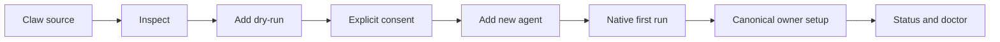

# Proposal: Claw Application Composition and Clients

## Summary

Complete the experimental Claw application model without introducing schema
version 2 or a second setup engine. A Claw remains a versioned definition of one
complete new agent. Its portable core carries purpose, instructions, skills,
direct MCP servers, managed workspace content, and scheduled work. Conventional
harness profiles carry native extensions and operating policy. An optional
package-root `BOOTSTRAP.md` gives the new agent a seed-once first-run interview
through the harness's existing bootstrap lifecycle.

Schemas, API references, templates, examples, fixtures, images, HTML, and other
assets remain ordinary managed workspace files. CLI, TUI, chat, and Control UI
are clients of the same read-only plan, consent, owner, status, doctor, update,
and remove services. The Control UI may provide the richest guided experience,
but it does not own a different package parser or mutation path.

This RFC builds on the merged, still draft-status [RFC 0016](0016-claws.md)
proposal and the draft portable profile addendum in
[RFC PR #48](https://github.com/openclaw/rfcs/pull/48). The exact
portable format, package lifecycle, and OpenClaw profile contracts live in:

- [`0016/claw-md-v1-spec.md`](0016/claw-md-v1-spec.md)
- [`0016/claw-package-v1-spec.md`](0016/claw-package-v1-spec.md)
- [`0016/openclaw-profile-v1-spec.md` in RFC #48](https://github.com/openclaw/rfcs/pull/48)

## Motivation

Claws are differentiated from plugins by application scope. A plugin adds
capability to a harness. A Claw combines purpose, identity, instructions,
knowledge, tools, integrations, scheduled work, first-run setup, and lifecycle
into one operational agent application.

The initial lifecycle proves that a complete agent can be added safely, but
three product gaps remain:

1. **Native extensions.** OpenClaw, Claude, Codex, and Cursor plugin bundles can
   contain skills, commands, hooks, subagents, MCP integrations, and other
   harness behavior. Those dependencies belong in the selected harness profile,
   not in portable `CLAW.md` fields that imply every harness can execute them.
2. **Application content.** Finished solutions need schemas, references,
   templates, examples, fixtures, and visual assets. They should be reviewable
   package content without creating a new file owner or automatically loading
   every file into every turn.
3. **Onboarding and clients.** A distributable executive-assistant Claw should
   interview its new user, direct credentials to canonical setup surfaces, and
   finish with an applied/ready result. That should work from chat or TUI and
   become polished in Control UI without requiring forms in the package schema.

The earlier draft proposed typed setup inputs, a template language, persisted
answers, reconciliation, and schema version 2. That duplicates OpenClaw's
native `BOOTSTRAP.md` owner, adds privacy-bearing state, and commits to update
semantics before real starter Claws establish the need. The simpler native
bootstrap model meets the first-run use case while keeping later structured
setup possible as evidence-driven follow-up.

## Goals

- Preserve schema version 1 for launch.
- Keep `CLAW.md` portable and understandable without one harness profile.
- Put native plugin bundles and their format assertions in conventional harness
  profiles.
- Delegate extension detection, scanning, installation, readiness, update, and
  cleanup to canonical harness owners.
- Support finished applications with managed schemas, references, templates,
  examples, fixtures, and static assets.
- Use package-root `BOOTSTRAP.md` for seed-once conversational onboarding.
- Keep credentials, OAuth, channel bindings, providers, and sensitive settings
  on canonical owner surfaces; never inject them into package-authored chat.
- Provide equivalent lifecycle outcomes from CLI, TUI, chat, automation, and
  Control UI.
- Preserve the one-Claw-one-new-agent and managed/referenced ownership models.
- Keep all new behavior behind the existing experimental Claws gates.

## Non-Goals

- A universal plugin format or a promise that every foreign plugin component
  works on every harness.
- Portable commands, hooks, subagents, LSP servers, or native tool names.
- A portable capability registry, binding language, or fallback strategy.
- A general form engine, template language, answer store, personalization
  ledger, or setup reconciliation system.
- Package scripts, setup hooks, arbitrary code execution, or package-defined
  network calls during onboarding.
- Storing credentials or resolved secrets in package files, plans, provenance,
  browser state, or bootstrap instructions.
- Automatically inferring personal data or setup questions during export.
- Loading every packaged resource into every model turn.
- Replacing plugin, MCP, SecretRef, channel, model/provider, workspace, agent,
  or scheduler owners.
- Requiring Hermes, Claude, or a public npm release before OpenClaw validation.
- Removing experimental gates or graduating the schema.

## Proposal

### Application layers

A Claw application has three layers:

1. **Portable package.** `CLAW.md`, optional `BOOTSTRAP.md`, identity, managed
   workspace files, skills, direct MCP servers, and scheduled work.
2. **Harness profile.** Native extensions, tool posture, memory posture, sandbox
   behavior, and presentation choices at `profiles/<harness>.yml`.
3. **Local instance.** Credentials, OAuth state, channel bindings, operator
   policy, runtime selection, and user-owned personalization.

The portable package describes the complete application and its durable
behavior. A harness profile explains how one harness realizes it. Local state
finishes configuration without becoming distributable package identity.

OpenClaw provides the richest reference profile. A Codex or Claude adapter may
configure a project rather than create an OpenClaw-style agent. Profiles do not
need identical tools or presentation, but an adapter must fail the complete plan
when it cannot realize a required component; it must not silently call a
degraded partial projection conforming.

### Native extensions

New harness-native plugin dependencies belong in the selected conventional
profile. The exact OpenClaw schema is defined by
[`0016/openclaw-profile-v1-spec.md` in RFC #48](https://github.com/openclaw/rfcs/pull/48).
Existing experimental schema-v1 manifests with portable `plugin` package
entries remain readable, but canonical producers do not duplicate a dependency
between portable core and a harness profile.

The OpenClaw profile can assert `openclaw`, `claude`, `codex`, or `cursor`
artifact format. That assertion does not create a Claw parser for foreign
bundles. OpenClaw delegates detection and component mapping to its canonical
plugin owner. Preview distinguishes mapped, detect-only, unavailable, and
unsupported components. Required extension failures block the plan.

Extension identity, exact version, artifact integrity, detected format, mapped
inventory, unavailable inventory, trust findings, redacted effects, and adapter
identity bind preview and consent. A later OpenClaw version may map the same
bundle differently; status and doctor report that compatibility drift without
silently changing plugin enablement.

Direct `mcpServers` remain portable core. MCP servers embedded in extensions
remain extension-owned. Claws do not invent semantic deduplication between the
two representations; canonical owners preflight exact collisions and preview
attributes every effect to its declaration path.

### Application content and assets

Shared application schemas, references, templates, examples, fixtures, and
static assets use ordinary `workspace.files`. V1 adds no resource-role field.
Authors should use conventional directories such as:

```text
references/
schemas/
templates/
examples/
fixtures/
assets/
```

Directory names are descriptive only. They do not load content into context,
grant execution authority, or create another owner. `CLAW.md`, `AGENTS.md`, or
an installed skill references content the agent needs. Skill-private support
content remains inside the skill's own directories so its progressive
disclosure and ownership stay intact.

A Claw may package an HTML view or other asset and instruct the OpenClaw agent
to use `show_widget` when available. If the active client does not expose that
tool, the agent returns the complete result as ordinary Markdown or a message.
Dashboard placement is an OpenClaw-native `show_widget` option, not a portable
`dashboard` tool. No generic capability or fallback schema is added.

### First-run onboarding

An optional package-root `BOOTSTRAP.md` contains conversational instructions
for the new agent's first-run interview. The applying adapter discloses and
seeds it through the harness's native bootstrap owner. In OpenClaw:

- it is written only for the new Claw workspace;
- the agent can ask about the user, working style, priorities, and preferences;
- the agent may write user-owned local files such as `USER.md`;
- host-owned controls may hand credentials and integrations off only to
  canonical owner setup surfaces, never to a package-provided URL or command;
- successful native consumption may delete `BOOTSTRAP.md`;
- expected deletion is not drift;
- update never recreates or rewrites a consumed bootstrap file;
- remove deletes `BOOTSTRAP.md` only while it is still pending and its bytes
  match the applied digest;
- remove never deletes user-owned interview output.

`BOOTSTRAP.md` is package-authored prompt content, not trusted host UI. Applying
a Claw trusts its reviewed instructions to influence the new agent just as it
trusts `CLAW.md`, skills, and managed workspace instructions. A malicious prompt
can still ask a user to disclose a secret; the native bootstrap owner does not
claim to make that impossible. Preview must disclose bootstrap presence and
digest, and every first-run client must label the conversation as package-
authored and warn the operator not to paste credentials or tokens. The host
must never inject resolved secrets into that conversation, automatically follow
package-provided setup links, or let package content impersonate a canonical
credential surface. Trusted owner setup is launched only from host-owned UI or
commands. A future restricted bootstrap mode may strengthen this boundary, but
it is not implied by this RFC.

The package cannot target root `BOOTSTRAP.md` through ordinary managed
workspace fields. This prevents the managed file reconciler from recreating a
consume-once native file.

The interview is naturally available in chat and TUI because it is the agent's
existing bootstrap lifecycle. Control UI may open that conversation and show
bootstrap progress, but the browser does not parse instructions or store an
answer ledger. A non-interactive adapter that cannot conduct the required
bootstrap must report the prerequisite honestly rather than inventing answers.

### Lifecycle clients

Every client uses the same Gateway or local lifecycle services:



The primary guided stages are:

1. **Overview:** identity, exact version, publisher/trust context, purpose, and
   expandable validated manifest.
2. **Preview:** complete agent, file, skill, extension, MCP, cron, bootstrap,
   capability, blocker, and retained-boundary effects.
3. **Add:** exact plan-integrity consent and canonical mutation outcomes.
4. **Personalize:** the new agent conducts native bootstrap through chat or TUI.
5. **Connect:** canonical plugin, MCP OAuth, channel, and credential surfaces.
6. **Ready:** status and doctor distinguish applied state from operational
   readiness and provide owner-specific remediation.

Control UI can present all six stages in one polished flow. TUI and CLI may
link or transition to the same native owner operations. Surface-specific layout
is allowed; package meaning, plan integrity, consent, ownership, and lifecycle
outcomes are not.

The Control UI appears only when the Gateway advertises experimental Claw
methods. Hiding navigation is not the security boundary. Direct routes and
Gateway methods fail closed when the experimental feature is disabled. The
browser receives bounded display projections and authorized exact effects, not
secret values or an independent mutation contract.

### Update, remove, and export

Update reconciles managed package content and native extension dependencies
under RFC 0016. It preserves user-owned bootstrap output and never restarts the
first-run ritual. A package that needs a new guided migration must introduce an
explicit future contract rather than repurpose bootstrap as recurring update
code.

Remove follows managed/referenced cleanup rules. It removes unchanged managed
resources selected by the plan, releases extension dependency edges, retains
referenced resources by default, and preserves user-owned workspace content. A
still-pending, digest-identical seeded `BOOTSTRAP.md` may be removed; a consumed
or modified bootstrap file and every interview output remain user-owned.

Export remains selection-based and excludes credentials, bindings, runtime
choices, and user-owned personal files by default. It emits supported OpenClaw
settings and native extension dependencies to `profiles/openclaw.yml`. Export
does not infer setup questions or copy a consumed local bootstrap ritual. An
author may add and review a new package-root `BOOTSTRAP.md` explicitly before
publication.

### ClawHub boundary

ClawHub validates the exact package, optional conventional profiles, optional
`BOOTSTRAP.md`, and safe managed sources behind its existing experimental gate.
It may expose bounded counts and safe summaries for discovery, but it does not
execute extension code, judge runtime mapping, collect onboarding answers, or
replace applying-client validation and consent.

## Rationale

### Why native bootstrap instead of structured setup?

OpenClaw already has a first-run conversational owner that creates personalized
workspace state and then consumes its instruction file. Reusing it removes a
form schema, renderer, answer database, privacy surface, update reconciler, and
UI-specific setup protocol. Structured non-interactive setup can be proposed
later if real Claws demonstrate requirements native bootstrap cannot meet.

### Why profiles instead of portable plugin fields?

Plugin bundles are executable harness extensions. Their component models and
support levels differ. Conventional profiles let each harness use its canonical
installer and be honest about mapping without making `CLAW.md` OpenClaw-native
or reducing a Claw to an undifferentiated plugin bundle.

### Why ordinary workspace files for assets?

The existing file lifecycle already provides containment, digest, consent,
provenance, drift, update, export, and removal semantics. Directory conventions
and instructions supply meaning without adding schema fields that old strict v1
consumers would reject.

### Why multiple clients over one lifecycle?

A Claw is useful from automation, terminal, chat, and browser. Letting each
surface parse and mutate packages would create divergent policy and ownership.
Server-driven projections preserve one contract while allowing Control UI to
provide the best visual experience.

## Implementation Plan

The dependency-aware cross-repository plan is in
[`0027/implementation-plan.md`](0027/implementation-plan.md). OpenClaw
[#115237](https://github.com/openclaw/openclaw/pull/115237) is reused for the
conventional-profile/native-bootstrap slice. The schema-v1 extension slice is
[#115962](https://github.com/openclaw/openclaw/pull/115962), and the current
Control UI/Gateway pair is
[#112808](https://github.com/openclaw/openclaw/pull/112808) followed by
[#112828](https://github.com/openclaw/openclaw/pull/112828). Standalone
[#1](https://github.com/giodl73-repo/claws/pull/1) provides the schema-v1
reference CLI/OpenClaw adapter, and standalone
[#2](https://github.com/giodl73-repo/claws/pull/2) provides the bounded Codex
workspace adapter. The remaining schema-v2 answer-state and guided-template
drafts are superseded and should not land in their current form.

## Acceptance Criteria

1. Schema version 1 remains the only accepted portable manifest version.
2. Optional profiles are discovered only at conventional paths and are bound
   into package integrity without manifest pointers.
3. OpenClaw validates profile v1 agent settings and native extensions strictly.
4. Every extension delegates to canonical plugin detection, safety, install,
   readiness, update, and cleanup paths.
5. A required extension failure or unusable mapping blocks the complete plan;
   unavailable components are disclosed without being presented as working.
6. Application schemas, references, templates, examples, fixtures, and assets
   use ordinary managed workspace-file semantics.
7. A package-root `BOOTSTRAP.md` is seeded once through native first-run state;
   consumption is not drift, update never recreates it, and remove deletes only
   a pending digest-identical seed while preserving user-owned outputs.
8. Credentials and resolved secrets remain on canonical owner surfaces and out
   of package content, package-authored bootstrap chat, plans, provenance, logs,
   and browser state; clients label bootstrap trust and warn against pasting
   secrets.
9. CLI, TUI, chat, automation, and Control UI use one package validator,
   planner, consent contract, executor, and owner model.
10. OpenClaw presentation can use `show_widget` and packaged assets when the
    runtime exposes the tool and returns a complete message fallback otherwise.
11. Status and doctor report extension compatibility drift, bootstrap progress,
    and owner-specific readiness without adding per-turn Claw parsing.
12. ClawHub validates package/profile/bootstrap structure without claiming
    runtime extension compatibility or collecting local onboarding state.
13. All new surfaces fail closed when their existing experimental Claws gate is
    disabled.

## Unresolved Questions

- Which native foreign-bundle components should OpenClaw map at launch, and
  which should remain detect-only?
- Should Control UI open the first bootstrap conversation inline or route to the
  existing agent chat while preserving progress context?
- What evidence would justify a future structured, non-interactive setup
  contract beyond native `BOOTSTRAP.md`?
- After the Codex adapter proof, which conformance vectors should become a
  shared public standard rather than reference-engine behavior?
