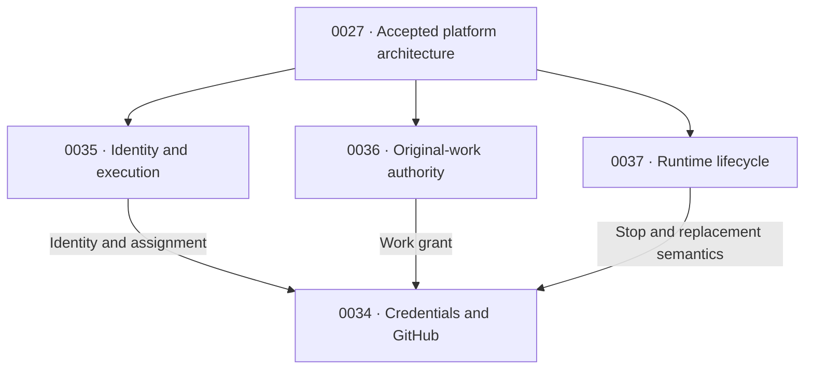

# Enterprise runtime and access: RFC series

This is an informational reading guide under accepted [RFC 0027](../0027-openclaw-enterprise.md). The linked drafts own their requirements; this guide adds no authority, resource, or acceptance decision. All four proposals remain drafts.

## Decisions and owners

| Proposal | Owns | Other contracts consume |
| --- | --- | --- |
| [0035: identity](https://github.com/openclaw/rfcs/pull/69) | Authenticated participant and canonical OCC execution assignment. | Assignment reference/generation, verified peer and evidence lifetime. |
| [0036: work authority](https://github.com/openclaw/rfcs/pull/70) | Original-work admission, immutable scope and current policy. | Grant reference/digest, operation ceiling, closure and business receipts. |
| [0037: runtime lifecycle](https://github.com/openclaw/rfcs/pull/71) | Stop/resume intent, bounded drain, writer exclusion and completed-state recovery. | Current purpose, drain deadline, retirement and observed termination. |
| [0034: credentials and GitHub](https://github.com/openclaw/rfcs/pull/68) | Provider credentials, protected custody, mediation and cleanup. | Credential eligibility and truthful issuance/use/cleanup outcomes. |

These arrows show contract reuse. Selecting SPIFFE for a trusted connector does not require changing every Agent's authentication profile. Credential mediation needs stop/replacement semantics, not the entire completed-context recovery feature.

## One operation through the series

1. **Admit.** OCC selects the execution assignment (0035) and admits the original work and scope (0036).
2. **Use.** A trusted connector proves its own identity and the represented execution/work binding. Current OCC/IAM decisions authorize the exact operation. The broker obtains an eligible credential and the mediator inserts it outside Agent execution (0034).
3. **Renew.** Identity and provider credentials may rotate. Neither extends the original work grant or a stop deadline.
4. **Close.** Turn or parent-session closure denies new effects across connectors. Stop closes new work admission and permits only eligible original work within its recorded finite drain; disable or retirement cuts off authority without waiting (0036/0037).
5. **Replace and recover.** Compute establishes predecessor termination before shared writable replacement. Recovery restores supported completed context and files, with a fresh execution and new work admission (0037).
6. **Clean up.** Retained platform authority resolves credential obligations even after user revocation or Agent deletion (0034). Business, credential and lifecycle outcomes remain distinct and correlated.

## Review and acceptance

Review the common assignment, work-grant, dispatch-withdrawal, and stop contracts together. Accept the RFCs separately once their dependencies agree: identity and work authority first, lifecycle alongside them, then the credential integration. Review credential interfaces concurrently; do not require completed implementations before accepting contracts. Each RFC follows the [repository lifecycle](../../README.md#rfc-lifecycle).

## Remaining design and qualification gates

- **0035:** selected authentication profile, attestation and protected execution evidence; current-purpose consistency and withdrawal protocol.
- **0036:** protected attribution within persistent workers; admission, principal policy, horizon and cancellation for work beyond a turn/session.
- **0037:** qualified drain policy, Harness/recovery compatibility and evidence of stopped writers.
- **0034:** qualified Git/REST/GraphQL operations, token accounting/cleanup, publication controls and the complete mediated production test.

Work surviving in a process or recovered workspace does not supply missing background authority. The concrete protected connector-to-broker representation remains a release gate. An accepted RFC or passing component test does not qualify the complete production composition.
