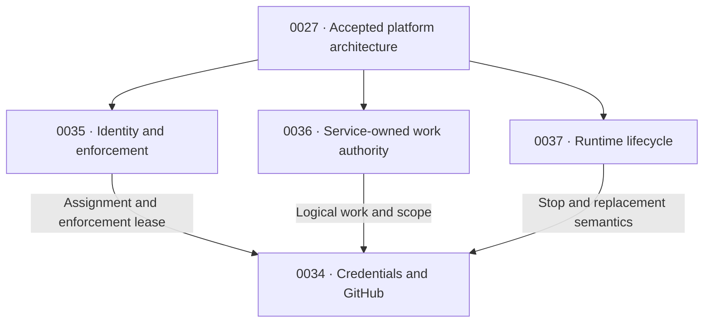

# Enterprise runtime and access: RFC series

This is an informational reading guide under accepted [RFC 0027](../0027-openclaw-enterprise.md). The linked drafts own their requirements; this guide adds no authority, resource, or acceptance decision. All four proposals remain drafts.

## Decisions and owners

| Proposal | Owns | Other contracts consume |
| --- | --- | --- |
| [0035: identity and enforcement](https://github.com/openclaw/rfcs/pull/69) | Authenticated participant, canonical execution assignment, enforcement leases and withdrawal protocol. | Assignment reference/generation, verified peer, lease limits and effective withdrawal evidence. |
| [0036: work authority](https://github.com/openclaw/rfcs/pull/70) | Service-owned work, immutable scope, attached children and finite delivery admission. | Work reference/digest, operation ceiling, lineage, closure and business receipts. |
| [0037: runtime lifecycle](https://github.com/openclaw/rfcs/pull/71) | Stop/resume intent, bounded drain, writer exclusion and completed-state recovery. | Current purpose, drain deadline, retirement, observed termination and completed-delivery handling. |
| [0034: credentials and GitHub](https://github.com/openclaw/rfcs/pull/68) | Provider credentials, protected custody, mediation and cleanup. | Credential eligibility and truthful issuance/use/cleanup outcomes. |

These arrows show contract reuse. Selecting SPIFFE for a trusted connector does not require changing every Agent's authentication profile. Credential mediation needs stop/replacement semantics, not the entire completed-context recovery feature.

## One operation through the series

1. **Admit.** OCC checks the requester's permission to invoke the service and the service's own access. It records logical work with an immutable scope and horizon (0036), selects a qualified execution, and issues a bounded enforcement lease (0035).
2. **Use.** A trusted connector proves its own identity and the represented execution/work binding. Writes need current authority. Only expressly qualified reads may use an existing unexpired lease during an authority outage, with all required local evidence intact. The broker obtains an eligible credential and the mediator inserts it outside Agent execution (0034).
3. **Renew.** Current policy may renew an enforcement lease within the original work and ancestor limits. Attached children need no live parent process, but their logical ancestors must remain open and authorized. Identity and provider-credential rotation cannot extend work authority or a stop deadline.
4. **Complete or cancel.** Completing a model turn does not complete the logical job. Work closure withdraws its computation authority. Delivery of an already completed result needs a separately admitted finite responsibility for its exact audience. Graceful stop can preserve that responsibility; cancellation and security revocation withdraw it (0036/0037).
5. **Replace and recover.** Compute establishes predecessor termination before shared writable replacement. Recovery restores supported completed context and files. Continuing still-open work requires fresh authoritative assignment and enforcement leases; closed work, old grants and uncertain effects cannot be revived or replayed (0037).
6. **Clean up.** Retained platform authority resolves credential obligations even after work closure or Agent deletion (0034). Business, credential, delivery and lifecycle outcomes remain distinct and correlated.

These drafts extend the accepted platform contract. In particular, qualified read continuity under bounded leases is a proposed exception to online authorization for every operation; it must be explicitly selected and demonstrated. An HTTP read method, valid certificate or running process does not establish eligibility.

## Review and acceptance

Review the common assignment, work-grant, dispatch-withdrawal, and stop contracts together. Accept the RFCs separately once their dependencies agree: identity and work authority first, lifecycle alongside them, then the credential integration. Review credential interfaces concurrently; do not require completed implementations before accepting contracts. Each RFC follows the [repository lifecycle](../../README.md#rfc-lifecycle).

## Remaining design and qualification gates

- **0035:** attestation and protected execution evidence; current-purpose consistency and withdrawal under the selected authentication profile.
- **0036:** admission and isolated/shared data policy, protected work attribution, attached-child joins, exact audiences, and measurable lease/withdrawal profiles.
- **0037:** qualified drain policy, Harness/recovery compatibility, evidence of stopped writers, and delivery withdrawal after stop.
- **0034:** qualified Git/REST/GraphQL operations, read-only credential maintenance where selected, token accounting/cleanup, publication controls and the complete mediated production test.

The work, assignment, enforcement lease and provider token have separate lifetimes. None can supply missing authority for another. The concrete protected connector-to-broker representation remains a release gate. An accepted RFC or passing component test does not qualify the complete production composition.
