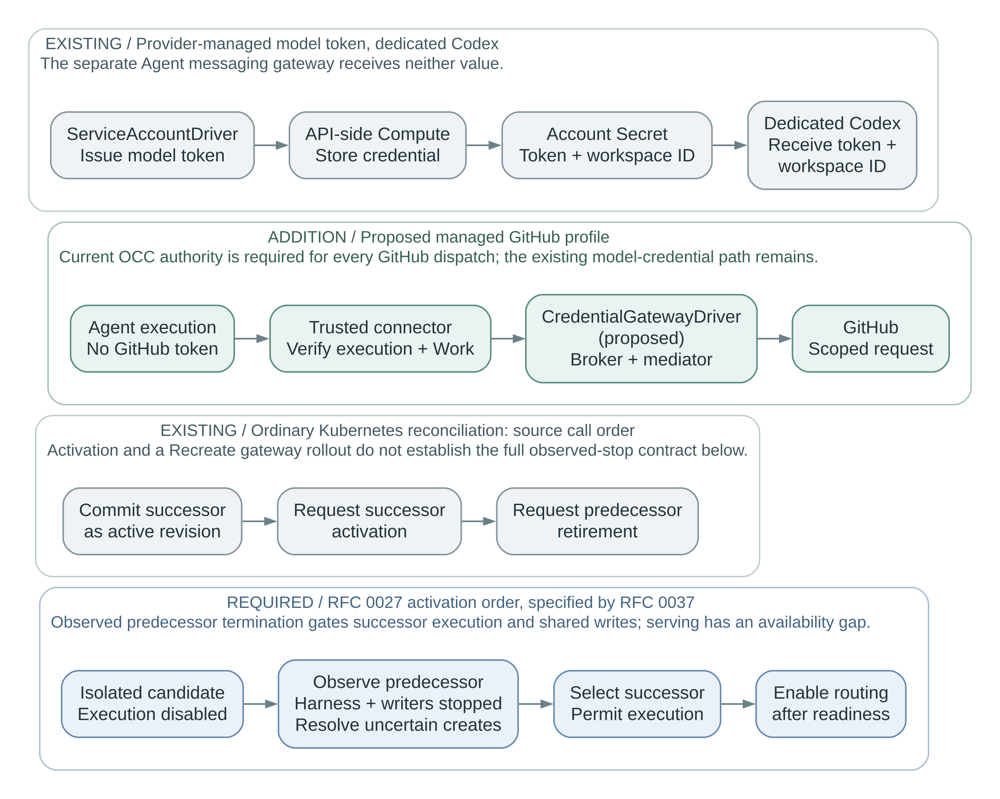
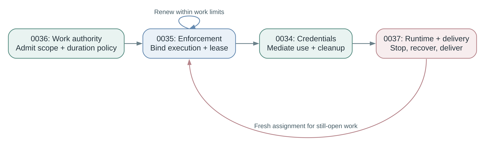

# Enterprise runtime and access: RFC series

This informational guide connects four **draft** proposals under accepted [RFC 0027](../0027-openclaw-enterprise.md). Each draft owns its requirements; this guide adds no authority, resource, or acceptance decision.

## Four owners

| Proposal | Owns |
| --- | --- |
| [0036: work authority](https://github.com/openclaw/rfcs/pull/70) | Service-owned logical work, immutable scope and selected duration policy, child admission, and delivery authority. |
| [0035: identity and enforcement](https://github.com/openclaw/rfcs/pull/69) | Authenticated identity, execution assignment, bounded enforcement leases, and withdrawal. |
| [0034: credentials and GitHub](https://github.com/openclaw/rfcs/pull/68) | Credential issuance, protected custody, mediated use, and cleanup. |
| [0037: runtime and delivery](https://github.com/openclaw/rfcs/pull/71) | Stop/resume, bounded drain, writer exclusion, completed-state recovery, and completed-result delivery. |

## Changes from the merged implementation

The comparison below is anchored to merged source `3eeacb8`. The named profiles have different credential and runtime boundaries.

| Boundary | Existing implementation | Addition or required change |
| --- | --- | --- |
| Identity and configuration | An [Agent-associated ServicePrincipal and revision selections](https://github.com/openclaw/openclaw-enterprise/blob/3eeacb85d9e8e087bc3e74d792778e4ef3123412/packages/contracts/src/index.ts#L309) for Provider and ServiceAccount. | 0035 binds authenticated execution to work authority. 0034 adds the proposed `repositoryAccess` selection and `credential_gateway` capability. |
| Credentials | [Provider-managed model tokens](https://github.com/openclaw/openclaw-enterprise/blob/3eeacb85d9e8e087bc3e74d792778e4ef3123412/docs/reference/service-accounts.md#L85) reach dedicated Codex through Compute's account Secret. Ordinary [SecretDriver bindings](https://github.com/openclaw/openclaw-enterprise/blob/3eeacb85d9e8e087bc3e74d792778e4ef3123412/docs/flows/secret-storage-and-delivery.md#L113) reach the consuming gateway environment. | 0034 adds mediated GitHub access with protected tokens and current OCC authority per dispatch. Existing model and ServiceAccount credential paths remain. |
| Replacement | The [ordinary Kubernetes controller](https://github.com/openclaw/openclaw-enterprise/blob/3eeacb85d9e8e087bc3e74d792778e4ef3123412/apps/controller/src/worker.ts#L987) selects and requests successor activation before requesting predecessor retirement. | 0037 requires observed predecessor termination before successor execution or shared writes, preserving RFC 0027's order and accepting an availability gap. |

The messaging gateway remains Agent-owned, provisioned by Compute, and separate from the proposed credential gateway. In dedicated Codex, it receives neither managed account token nor workspace ID. Current [activation](https://github.com/openclaw/openclaw-enterprise/blob/3eeacb85d9e8e087bc3e74d792778e4ef3123412/apps/controller/src/drivers/compute/kubernetes/index.ts#L1647) and [retirement](https://github.com/openclaw/openclaw-enterprise/blob/3eeacb85d9e8e087bc3e74d792778e4ef3123412/apps/controller/src/drivers/compute/kubernetes/index.ts#L1817) calls do not establish the full observed-stop contract; their order alone does not prove concurrent writers.

## Delivery stages

| Stage | User-visible behavior | Required boundary |
| --- | --- | --- |
| **A: read** | Managed repository metadata, clone, and fetch. | Current authorization for each dispatch, protected credentials, and minimal internal Work and operation records. A standalone root Work may qualify first; same-scope subordinate helpers join only after their attribution and cancellation are qualified. |
| **B: code and publish** | Coding plus explicit human **Approve and publish** for an exact frozen candidate. | Any configured, authorized human may approve, including the requester. The Agent cannot approve its own candidate; absent approval policy denies publication. |
| **C: durable work and controls** | Broader durable Work and children, **Stop task**, **Stop Agent**, and **Start Agent**. | Qualify the broader work and lifecycle contracts; this stage does not add advanced scheduling or a task-database design. |

Later publication modes may require an independent human **or** use an explicitly scoped automatic authorization policy. These are alternative modes, both bound to the exact candidate and current policy; automatic authorization does not also require per-operation human approval. Missing policy never selects a fallback. See [repository configuration](../0034/repository-configuration.md).

## One operation

1. **Admit.** OCC checks the requester's invocation permission and the service's own access separately. Minimal internal records bind root Work, immutable scope, selected duration policy, execution, and operation identity. Execution defaults to uncapped unless admission selects a finite limit; missing policy is not an uncapped selection. Qualified helpers remain subordinate to the same root's scope and cancellation. Broader durable-child behavior is later scope (0035/0036).
2. **Dispatch and renew.** The trusted connector proves its identity and execution/Work binding. The proposed `CredentialGatewayDriver`, selected by the Installation, obtains online OCC authority for every GitHub dispatch and keeps tokens outside Agent execution (0034). It is separate from the Agent messaging gateway; broker and mediator may share a trusted service. Each enforcement lease and operation deadline is finite. Renewal respects every configured Work, attempt, and ancestor limit; certificate or token rotation extends none of them. Stage B also records approval and push/PR effects separately.
3. **Stop or complete.** A completed model turn does not close logical Work. Cancellation and security revocation withdraw affected authority from the first supported profile. Stage C adds the broader user controls, bounded graceful drain, and separately admitted delivery of an already completed result to its exact audience; cancellation or security revocation also withdraws affected delivery (0036/0037).
4. **Replace and clean up.** Changed permissions require a fresh isolation boundary; the selected Kubernetes/gVisor profile uses a fresh Pod and sandbox. Compute proves predecessor termination before shared writable replacement. When separately selected, recovery restores supported completed state; active-session migration and replay remain later scope (0037). Closed Work and uncertain effects cannot be revived or replayed. Credential cleanup survives Work closure and Agent deletion under retained platform authority (0034).

## Acceptance boundary

RFC 0027's accepted baseline denies operations when authorization is unavailable. The first GitHub profile retains that behavior, including reads and credential maintenance; previously fetched local files are a separate boundary. The broader authority drafts retain an optional **explicit amendment** for separately selected, qualified reads under existing unexpired enforcement leases, with all required local evidence intact. Writes, authority renewal, admission, and new assignment still require current authority. That amendment remains unaccepted and is not an initial GitHub release gate.

Review shared contracts together and accept RFCs separately under the [repository lifecycle](../../README.md#rfc-lifecycle). Stages A and B need the relevant minimal identity, Work, operation, cancellation, and credential contracts; they do not wait for all of Stage C. Selecting SPIFFE for a connector does not select it for every Agent.

Acceptance does not qualify a production runtime. Each owner retains its mechanism and integration gates, including protected Work attribution, measured withdrawal, recovery compatibility, and mediated provider access. Initial profiles name the helper/child and recovery subset they support. Component checks and explicitly substituted external interfaces support bounded source evidence; runtime and provider claims require the corresponding live evidence.
