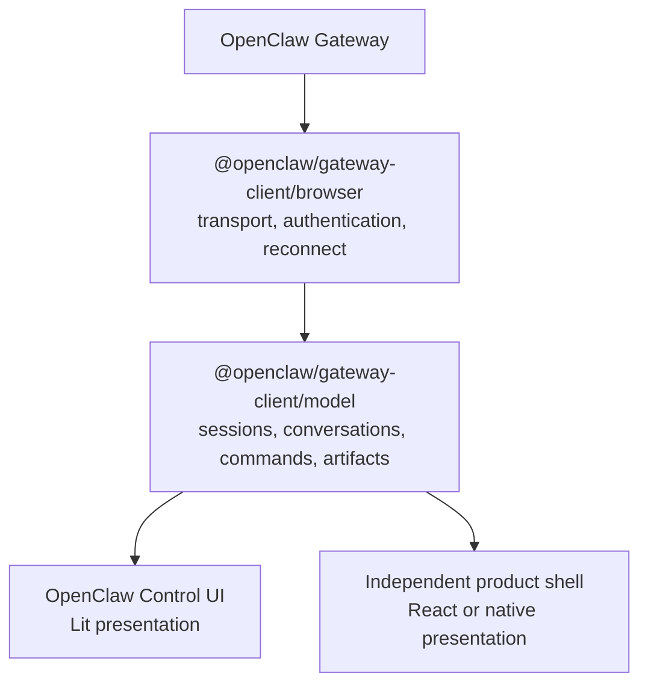
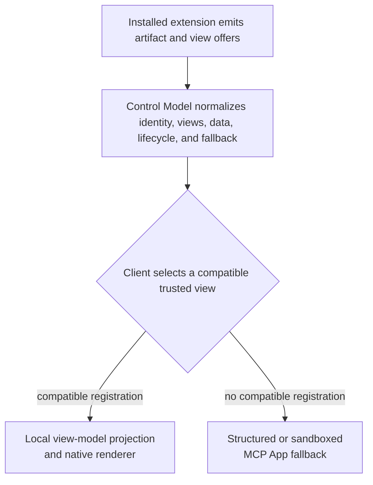

# Proposal: OpenClaw Control Model

## Summary

OpenClaw should provide a framework-neutral Control Model as optional
`@openclaw/gateway-client/model` subpaths above the existing browser transport.
The model would expose immutable state snapshots, typed commands, history/live
reconciliation, and renderer-neutral UI artifacts without depending on Lit,
React, routes, or product presentation. OpenClaw's Control UI and independently
owned product shells could consume the same behavior while retaining their own
components, navigation, theming, authentication, and rollout.

This document is a fork-only design preview. It does not request RFC intake,
open an upstream pull request, or claim maintainer acceptance.

## Motivation

OpenClaw already publishes a reference Gateway client. It owns protocol
handshake, authentication helpers, request correlation, timeouts, reconnect
primitives, sequence-gap detection, and event delivery.

OpenClaw's Control UI builds a richer application model above that client:
session catalogs, history/live reconciliation, connection epochs, chat stream
state, tool lifecycle, approvals, config state, and other capabilities. That
model is assembled inside the Lit application and is not a supported headless
consumer boundary.

An independently owned UI therefore has two unattractive choices:

1. host or fork OpenClaw's complete Control UI even when the product needs a
   different framework and experience; or
2. consume raw Gateway methods and events and independently reimplement the
   state machines already required by Control UI.

The first choice couples product presentation to OpenClaw's application. The
second creates semantic drift around reconnect, event ordering, history
reconciliation, tool outcomes, approvals, and compatibility.

Tool-provided UI has a related gap. OpenClaw can materialize Canvas documents
and MCP Apps, but the current projection selects those presentation paths
before another host can choose a trusted native renderer. First-party products
that need native components either add tool-specific interpretation or bypass
the existing projection.

The desired architecture is:



One OpenClaw-owned behavioral model can serve multiple presentations without
making OpenClaw own those products.

## Goals

- Publish a framework-neutral state and command boundary above the Gateway
  client.
- Keep Gateway protocol and server behavior authoritative.
- Provide stable immutable projections for connection, session catalog, and a
  selected conversation.
- Reconcile history, live events, reconnects, and tool lifecycle once.
- Return typed command failures without success-shaped fallbacks.
- Preserve renderer-neutral UI artifacts and all applicable OpenClaw-provided
  view offers long enough for a host to select its preferred native renderer,
  product view model, structured fallback, or sandboxed MCP App.
- Let OpenClaw Control UI become a reference adopter without changing its
  presentation.
- Support independently owned browser, desktop, mobile, terminal, and hosted
  shells without importing a UI framework.
- Make adoption incremental and tie each layer to conformance and deletion
  evidence.

## Non-Goals

- Replacing `@openclaw/gateway-client` or introducing another wire protocol.
- Standardizing routes, navigation, layout, CSS, theme, localization, or
  product design systems.
- Moving product-owned React, Lit, native, or terminal components into the
  Control Model.
- Publishing Control UI's complete internal `ApplicationContext` as-is.
- Defining browser credential storage, tenant authentication, runtime routing,
  or host deployment.
- Making UI visibility, disabled state, or command preflight authoritative.
- Loading executable React components or arbitrary JavaScript named by a tool
  result.
- Replacing MCP Apps as the sandboxed third-party executable-UI contract.
- Requiring JSON Render or any other renderer library.
- Adding a sidecar, service, or new process boundary. The Control Model is an
  in-process library over an existing Gateway client.
- Replacing OpenClaw's existing dashboard/workboard model, registered widget
  providers, layout persistence, or `show_widget`/`dashboard` tool semantics.
- Defining generic model-authored layouts or a public component marketplace in
  v1. A dashboard-shaped artifact view is presentation, not the authoritative
  OpenClaw board model.
- Including config forms, settings navigation, channels, skills, workboards,
  or every existing Control UI capability in v1. Configuration requires a
  separate authority- and provenance-aware model.

## Proposal

The normative candidate contracts and delivery gates are split into companion
documents:

- [Control Model v1 specification](0029/control-model-v1-spec.md)
- [UI artifact v1 specification](0029/ui-artifact-v1-spec.md)
- [Conformance and adoption plan](0029/conformance-and-adoption-plan.md)
- [Implementation and PR plan](0029/implementation-plan.md)

### Draft implementation stack

The proposed boundary has four fork-only implementation drafts:

1. [OC1: Gateway Client model foundation](https://github.com/giodl73-repo/openclaw/pull/230)
2. [OC2: conversation model and commands](https://github.com/giodl73-repo/openclaw/pull/231)
3. [OC3: renderer-neutral UI artifacts](https://github.com/giodl73-repo/openclaw/pull/232)
4. [OC4: Control UI reference adoption](https://github.com/giodl73-repo/openclaw/pull/238)

These drafts are evidence for review, not an upstream submission or accepted
roadmap.

The independent Lobster evidence is also available as a temporary carry plus
six bounded adopter slices:

1. [L0: temporary Control Model carry](https://microsoft.ghe.com/bic/lobster/pull/8165)
2. [LM1: adapt canonical snapshots into `SessionView`](https://microsoft.ghe.com/giodl/lobster/pull/63)
3. [LM2: render one allowlisted native table artifact](https://microsoft.ghe.com/giodl/lobster/pull/64)
4. [LM3: route one native refresh action through the model](https://microsoft.ghe.com/giodl/lobster/pull/65)
5. [LM4: route ordinary sends through the model](https://microsoft.ghe.com/giodl/lobster/pull/66)
6. [LM5: route active-run aborts through the model](https://microsoft.ghe.com/giodl/lobster/pull/67)
7. [LM6: hydrate selected-session history through the model](https://microsoft.ghe.com/giodl/lobster/pull/68)

This series proves native React rendering, actions, send, abort, reconnect, and
history while deleting duplicate Lobster Gateway behavior. It intentionally
stops at LM6: remaining raw paths are host-owned operational/security or
compatibility lanes rather than equivalent Control Model behavior.

Two adjacent owner-first projections now have separate fork-only evidence:

- [Board Model fork proof](https://github.com/giodl73-repo/openclaw/pull/240)
  extracts the existing selected-session reconciliation into
  `@openclaw/gateway-client/model/board` from Control UI while preserving OpenClaw board,
  provider, ticket, grant, persistence, and sandbox authority. Control UI is
  the reference adopter. Release ancestry shows no stable tag contains the
  coordinated board stack. `v2026.8.1-beta.2` is the first tag containing the
  full implementation plus the later ownership and UI hardening; the extraction
  applies cleanly there with 55 focused tests and a Gateway Client build.
  Lobster adoption therefore remains gated on a stable board-capable generation
  or an explicit beta-admission decision.
- [Config Model LC1 fork proof](https://microsoft.ghe.com/giodl/lobster/pull/69)
  provides `@openclaw/gateway-client/model/config` read-only authored
  configuration snapshots and read-scoped schema lookup. Lobster LC1 consumes
  it through Electron-owned Gateway transport and renders one native read-only
  settings category without exposing raw config or write authority to React. A
  real Electron Gateway fixture now proves the populated native page, authored
  value boundary, and restart guidance.

### Module boundary

Add the framework-neutral, browser-safe Control Model as optional exports from
`@openclaw/gateway-client`: `model`, `model/catalog`, and
`model/session-event-refresh`. The model module graph must not import Lit,
React, DOM components, route definitions, product authentication, localization
catalogs, CSS, or Control UI presentation helpers.

The model consumes a narrow host-supplied Gateway binding compatible with the
public Gateway Client:

```ts
export interface ControlGateway {
  getSnapshot(): GatewayConnectionSnapshot;
  subscribe(listener: () => void): () => void;
  subscribeEvents(listener: (event: GatewayEvent) => void): () => void;
  request<T>(method: string, params?: unknown, options?: RequestOptions): Promise<T>;
}
```

The binding lets the model reuse OpenClaw's browser, Node, or hosted transport
without owning credential persistence, product routing, or socket creation.

The Control Model exposes immutable snapshots and typed commands:

```ts
export interface ControlModel {
  getSnapshot(): ControlSnapshot;
  subscribe(listener: () => void): () => void;
  conversation(sessionKey: string): ConversationModel;
  sessions: SessionCommands;
  dispose(): void;
}
```

Subscriptions are invalidation signals. Consumers read the current immutable
snapshot after notification. This works with framework adapters without
embedding framework hooks in the model.

### V1 capability boundary

V1 contains:

- connection phase, accepted protocol/session metadata, and structured errors;
- session catalog snapshots and refresh/reconciliation state;
- one or more lazily selected conversation models;
- canonical ordered messages;
- active run, stream, tool invocation, approval, and question state needed by
  conversation presentation;
- typed chat/session commands supported by the selected Gateway; and
- renderer-neutral UI artifacts associated with messages or tool invocations.

V1 excludes broader Control UI capabilities until each has a bounded,
framework-neutral contract and an independent consumer.

### Snapshot and event semantics

Snapshots are serializable except for explicitly documented command handles.
They use stable identifiers, finite retained state, and typed lifecycle states.
They do not expose mutable Control UI objects.

The model owns:

- the initial history snapshot;
- live event application;
- connection-epoch retirement;
- duplicate and stale event handling;
- explicit sequence-gap and partial-state presentation;
- reconnect resynchronization;
- tool invocation/result association;
- cancellation and terminal run reconciliation; and
- artifact association and revision ordering.

Raw Gateway events remain available from the Gateway client. They are not the
Control Model's stable UI contract.

### Command semantics

Commands express typed user intent. Candidate v1 commands include session
refresh, select, create, rename, archive/delete where authorized, chat send,
abort, retry where supported, answer, approve, and deny.

The model may expose command availability for presentation. The Gateway remains
authoritative. A command must return a typed result or throw a typed error. It
must not silently treat a rejected, stale, disconnected, or unsupported
operation as success.

Commands are connection- and session-aware. An operation captured under a
retired connection epoch must not execute against a replacement session unless
the command contract explicitly permits safe retry.

### Renderer-neutral UI artifacts

A UI artifact is data and identity, not executable presentation:

```ts
export interface UiArtifact {
  id: string;
  revision: number;
  structuredContent?: JsonValue;
  views: UiArtifactViewOffer[];
  state: "pending" | "ready" | "failed" | "expired";
  source: {
    sessionKey: string;
    messageId?: string;
    toolCallId?: string;
  };
  fallback?: McpAppArtifact | CanvasArtifact;
}

export interface UiArtifactViewOffer {
  id: string;
  templateUri: string;
  dataVersion: number;
  availability: "inline" | "deferred";
  data?: JsonValue;
  recommended?: boolean;
  fallback?: McpAppArtifact | CanvasArtifact;
}
```

OpenClaw core and installed extensions may offer zero or more views of the same
artifact, such as calendar, list, table, summary, or an MCP App. A view's
`templateUri` is opaque. It does not grant trust, select a JavaScript import,
or authorize an action. A host may map a locally registered URI to a native
component. It must schema-validate view data before rendering.

Each view's `dataVersion` selects a schema version within the host's exact local
registration. Registration and component code ship through the host's ordinary
reviewed supply chain; tool output cannot add, replace, or widen a registration.
OpenClaw may identify a recommended default, but the client remains free to
choose any compatible offered view or project the underlying structured content
into its own product view model. If no compatible renderer is registered, the
host may show structured/text output or use an explicitly sandboxed fallback.

OpenClaw exposes every authorized applicable descriptor, not every fully
materialized payload. A bounded view may be inline. An expensive or sensitive
view is deferred until the client selects it and requests materialization
through a typed, read-only Control Model command. Materialization remains
extension-owned and Gateway-authorized.

Presentation placement does not define artifact identity. A client may render
the same artifact revision inline in chat, in an expanded panel, or in a
dedicated artifact surface. Its stable `id` and monotonic `revision` let later
turns or tool runs update that logical artifact instead of emitting unrelated
cards. V1 durability means addressable, revisioned session state that survives
history reload and reconnect. It does not require permanent document storage,
cross-session retention, or a collaborative document protocol.

V1 uses complete immutable revisions. It does not standardize JSON Patch,
JSONL, or a renderer-specific component tree. A later extension may introduce a
negotiated patch dialect after conformance evidence demonstrates a shared need.

### Security boundary

The Control Model is presentation support, not an authorization authority.

- Native renderers are registered and allowlisted by the host.
- Tool output cannot select an import path, module URL, or privileged action.
- Artifact data is untrusted input with finite size and depth.
- Artifact data and structured content remain separate from hidden model or
  credential state.
- Component actions call named host bindings that re-enter typed model commands.
- The Gateway independently authorizes every protected action.
- Native action audit and telemetry can correlate the renderer registration,
  artifact ID, revision, action name, session, and tool call without recording
  raw artifact data.
- MCP Apps and Canvas retain their sandbox, CSP, lifecycle, and capability
  boundaries.
- Unknown versions, malformed data, expired state, and stale revisions fail
  visibly and do not trigger executable fallback automatically.

### Ownership boundary

OpenClaw maintainers own:

- Gateway Client model contracts and implementation;
- Gateway-to-model normalization and reconciliation;
- stable state, command, error, and artifact semantics;
- compatibility fixtures and release versioning;
- Control UI reference adoption; and
- server-side authorization behavior.

Independent products own:

- product navigation, layout, components, design systems, accessibility, and
  localization;
- renderer registration and component schemas;
- registration provenance, code review, signing, and deployment through the
  product's ordinary component supply chain;
- product authentication, tenant routing, telemetry, deployment, and rollout;
- optional adapters into an existing product view model; and
- product-specific actions that call supported OpenClaw commands.

Tool and MCP server authors own structured domain results and UI resources.
They do not choose whether a host trusts a native renderer.

### Extension and client capability split

Installed and enabled OpenClaw extensions determine which tools, structured
results, UI artifacts, and alternative view offers can be produced. The client
determines which artifact views and native renderers it has installed,
registered, and trusted, and which product view model should consume the
projection.

The Control Model does not generate UI capabilities independently of either
side. It normalizes the artifact emitted by the active extension, exposes the
current client-rendering decision, and preserves a safe fallback:



Client capability advertisement may let an extension avoid producing an
unsupported optional artifact, but it is an optimization rather than an
authorization grant. Extensions should preserve useful structured or text
output when no native renderer is available. A client must not claim native
support unless an exact compatible local registration exists. OpenClaw owns
the available view offers and their semantics; Lobster or another host owns
which offer it selects and how it maps that projection into its own view model.

View discovery is filtered to the authenticated caller, selected session,
enabled extension surface, and current policy. It must not disclose hidden
extensions or unavailable tools. Client renderer advertisement is delivered to
the trusted Gateway and is not exposed verbatim to extensions by default.

### Compatibility and release

The Gateway Client model follows the OpenClaw calendar release train and
declares its compatible Gateway protocol window. Additive fields must not break
consumers. Incompatible snapshot or command changes require a documented
migration and a major contract-version decision independent of the wire
protocol number.

The model subpaths begin as fork-only exports. Publication requires:

- adoption by OpenClaw Control UI;
- adoption by one independent host;
- exact shared conformance fixtures;
- package-acceptance and browser-safe module-graph checks;
- a declared support and compatibility policy; and
- evidence that one duplicate consumer implementation can be deleted.

Subscriber callbacks run outside the Gateway receive stack. Model ingestion,
normalization, notification, and retained queues must remain bounded; a slow or
throwing subscriber cannot be awaited by protocol event delivery.

### Delivery shape

The implementation is intentionally incremental:

1. Gateway Client model boundary plus connection and session-catalog snapshots;
2. selected-conversation projection and commands;
3. renderer-neutral artifact projection and existing MCP App/Canvas adapters;
4. OpenClaw Control UI adoption of one complete slice; and
5. independent Lobster adoption through `SessionView`, including native
   artifact, action, send, abort, and history deletion evidence;
6. package publication and support ownership after compatibility, security,
   and package-acceptance gates; and
7. product rollout with live hosted-Gateway proof, flags, rollback, telemetry,
   accessibility, localization, and shareable demo evidence.

No later layer is required to accept an earlier bounded layer.
Adding another capability after v1 requires an independent consumer, a bounded
contract, and a named duplicate implementation or inference path it can delete.

Existing OpenClaw dashboards and settings follow separate adoption paths.
Lobster can host version-matched dashboard and settings routes immediately.
The Board Model proof now demonstrates the optional projection of OpenClaw's
existing board model, but not a Lobster adopter on the pinned pre-board
generation. No stable OpenClaw tag currently contains the coordinated board
stack; `v2026.8.1-beta.2` is the first fully compatible tag and passes the
Board Model extraction proof. The Config Model and LC1 proof demonstrate a
native read-only settings surface over authored values and schema descriptors,
including a real Electron screenshot. Governed writes still require provenance,
authority, validation, candidate diffs, generation, and transactional
activation from Managed Configuration. Neither model belongs in the
conversation snapshot.

## Rationale

### Why not inject a model into Control UI

Control UI already has an internal capability graph, but its bootstrap,
application context, route ownership, and presentation lifecycle are
application internals. Making that graph injectable would still require an
independent host to load the Lit application and track private module changes.
The reusable boundary belongs below the application.

### Why not use the Gateway Client browser transport directly

The browser transport deliberately exposes protocol methods and events. Session
catalogs, conversation snapshots, tool outcomes, and UI artifacts remain a
distinct optional state-and-command layer under `gateway-client/model`; every UI
otherwise reimplements them.

### Why not publish Control UI's application context

The current context includes theme, navigation, overlays, browser settings,
native bridges, and capabilities whose state mixes domain and presentation
concerns. Publishing it wholesale would freeze application internals and make
framework-independent use difficult. V1 extracts only the proven independent
slice.

### Why immutable snapshots

Immutable snapshots work with React external stores, Lit controllers, native
bridges, tests, and non-UI consumers. They keep ordering and mutation inside
the owner package and avoid making raw event accumulation a renderer
responsibility.

### Why UI artifacts are not components

A renderer identifier plus validated data supports native first-party
presentation without letting untrusted tool output load code. It also preserves
MCP Apps as the executable third-party boundary and keeps renderer choice with
the host.

### Why not standardize JSON Render in v1

JSON Render is a useful adopter and comparator: it demonstrates schema-defined
catalogs, named actions, and streamed revisions. Making its component tree or
patch dialect normative would couple OpenClaw state reuse to one renderer
before two OpenClaw consumers prove the need. The v1 artifact contract can
carry validated JSON data that a host renders with JSON Render or another
library.

### Why OpenClaw owns the model

The model interprets OpenClaw protocol behavior and must change atomically with
Gateway and Control UI semantics. Product-owned copies would drift. Product
presentation remains outside OpenClaw, so upstream ownership does not absorb
independent UX.

## Unresolved questions

- When should the optional Gateway Client model subpaths publish after
  fork-only two-consumer evidence is accepted?
- Does artifact streaming need complete revisions only, or does adoption
  evidence justify a negotiated patch dialect?
- What finite size, depth, count, and retention defaults should v1 require?
- Which maintainers own model compatibility and security review if the subpaths
  are published?
- What release and support gates should promote the proven optional
  `@openclaw/gateway-client/model/board` subpath?
- Should governed settings writes extend the proven read-only
  `@openclaw/gateway-client/model/config` surface or remain a separate Managed
  Configuration client?
- If cross-client user-message delivery becomes required, what identity
  contract aligns host `clientMessageId`, model idempotency, retry/reconnect,
  persisted history, and renderer deduplication?
