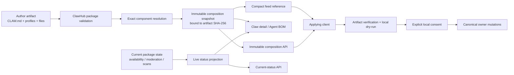
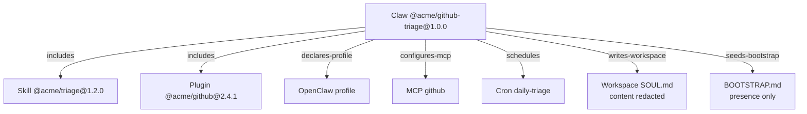
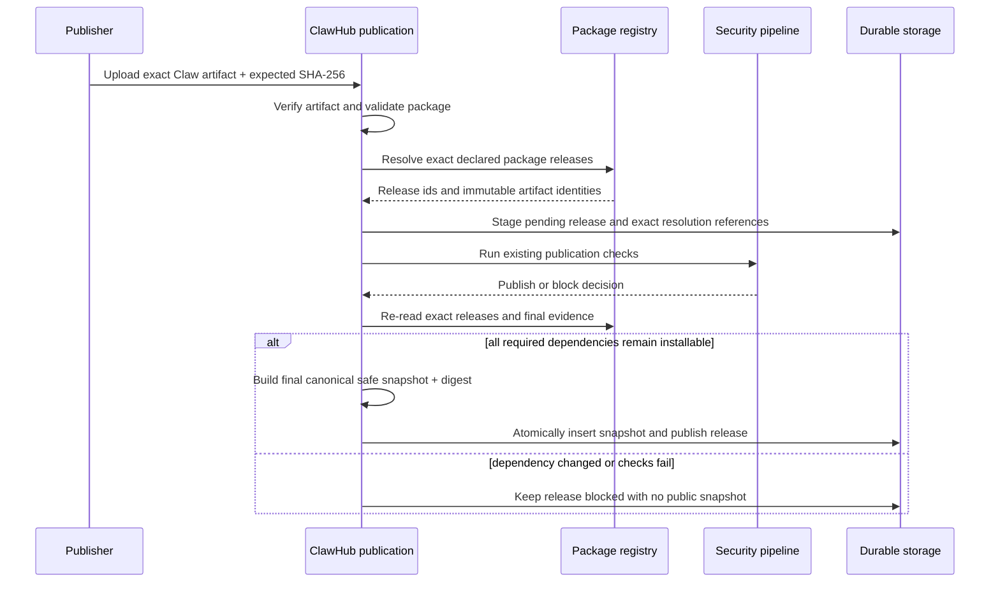

# Proposal: Claw Composition Evidence (Agent BOM)

## Summary

Define **Claw Composition Evidence**, presented to users as an **Agent Bill of
Materials (Agent BOM)**, as a bounded, immutable, registry-generated view of
the exact components and declarative resources contained in one exact Claw
release. Each composition snapshot is bound to the Claw artifact SHA-256 and
records the exact Skill and Plugin releases resolved at publication time.
ClawHub exposes current registry health separately so later moderation,
availability, and scan changes do not rewrite historical publication evidence.
The BOM helps users inspect a Claw before download while OpenClaw and other
applying clients remain authoritative for runtime mapping, local planning,
consent, mutation, provenance, update, and removal.

## Status and related work

This proposal extends, rather than replaces, the existing experimental Claws
contract:

- [RFC 0016: Claws](https://github.com/openclaw/rfcs/pull/27) defines one Claw
  as one complete new agent and assigns runtime planning and mutation to the
  applying harness.
- [RFC 0016 profile addendum](https://github.com/openclaw/rfcs/pull/48) and
  [RFC 0027: Claw application composition and clients](https://github.com/openclaw/rfcs/pull/52)
  define portable package, harness-profile, native extension, bootstrap, and
  client boundaries. They remain draft dependencies at the time of writing.
- [Claw project lifecycle](https://github.com/openclaw/rfcs/pull/56) and
  [ClawHub exact-artifact publication](https://github.com/openclaw/clawhub/pull/3359)
  are adjacent draft work. This proposal consumes an immutable stored artifact
  identity but does not define how authors build that artifact.
- [Declared capability manifest issue](https://github.com/openclaw/clawhub/issues/2944)
  is complementary. A BOM answers “what is included”; capability evidence
  answers “what it declares or is observed to do.”

The phrase **application composition** in RFC 0027 describes how a harness
realizes a complete Claw. **Composition evidence** in this RFC describes what
ClawHub can prove about one published package before application. These are
different owner surfaces.

## Motivation

ClawHub currently retains the exact Claw artifact and a bounded
ClawManifestSummary. The summary contains the agent identity and counts of
workspace files, Skills, Plugins, MCP servers, and cron jobs. It deliberately
does not expose the complete manifest, prompt body, or harness profile.

That count-only summary is insufficient for the product promise in VISION.md
that users can inspect a Claw's publisher, components, permissions, and
security evidence:

1. A count of three Skills does not say which Skills or exact releases are
   included.
2. The manifest requires exact package versions, but ClawHub does not publish a
   durable record of which registry releases and artifact digests those
   coordinates resolved to.
3. Current scan or moderation status can change after publication. A mutable
   graph alone cannot answer what was true when the Claw was published.
4. Parsing the Claw artifact on every detail-page read would repeat bounded
   archive work, provide no indexed dependency identity, and still conflate
   declaration with registry resolution.
5. OpenClaw can produce a rich local dry-run only after the artifact is
   downloaded. ClawHub needs a safe pre-download evidence surface for
   discovery, comparison, moderation impact, and feed consumers.

The existing exact-version manifest and artifact SHA-256 provide the necessary
foundation. The missing layer is a safe, deterministic resolution record.

## Terminology

| Term                 | Meaning                                                                                                                              |
| -------------------- | ------------------------------------------------------------------------------------------------------------------------------------ |
| Claw manifest        | Author-declared portable fields and supported harness-profile declarations in the exact package artifact.                            |
| Subject              | One exact Claw package name, version, and artifact SHA-256.                                                                          |
| Component            | An externally versioned installable artifact, initially a ClawHub Skill or Plugin and later a validated native extension coordinate. |
| Resource             | A package-local or declarative effect such as a workspace destination, MCP server, cron job, bootstrap prompt, or harness profile.   |
| Composition snapshot | Immutable safe projection generated from one exact subject and exact resolved component releases.                                    |
| Composition digest   | SHA-256 of the canonical snapshot content.                                                                                           |
| Current status       | Mutable, read-time registry facts for the exact releases recorded in a snapshot.                                                     |
| Applying client      | OpenClaw or another harness adapter that validates the artifact and plans local effects.                                             |
| Agent BOM            | User-facing product name for the snapshot plus its current status presentation.                                                      |

This RFC does not claim SPDX or CycloneDX conformance. “BOM” describes the
product purpose, not a software-only SBOM interchange standard.

## Goals

- Let a user identify every direct externally versioned component in one exact
  Claw release before downloading it.
- Bind the composition snapshot to the exact Claw artifact SHA-256.
- Resolve every portable ClawHub package coordinate to an exact release,
  package family, artifact digest, publisher, and publication-time trust
  evidence.
- Preserve publication-time evidence without hiding later moderation,
  availability, or scan changes.
- Expose MCP, cron, workspace, bootstrap, and profile information through
  explicitly safe projections.
- Keep list, search, and feed payloads small by carrying only a compact
  composition reference outside the dedicated composition endpoint.
- Reuse existing package visibility, scanning, moderation, verification, and
  download policy rather than inventing a second security policy.
- Keep OpenClaw authoritative for runtime compatibility, dry-run effects,
  collisions, capabilities, consent, and local mutation.
- Support accessible grouped-list presentation and an optional graph from one
  wire contract.
- Make the snapshot deterministic, bounded, versioned, testable, and suitable
  for cross-repository conformance fixtures.

## Non-Goals

- Installing, updating, removing, or enabling any component.
- Replacing OpenClaw dry-run, plan-integrity consent, provenance, status,
  doctor, or owner-specific cleanup.
- Claiming that a Claw or component is safe.
- Defining a new package manager, dependency solver, capability registry, or
  runtime compatibility engine.
- Inferring undeclared transitive dependencies by scanning arbitrary source
  code.
- Defining semantic deduplication between direct MCP declarations and
  extension-owned MCP integrations.
- Publishing prompts, cron messages, workspace contents, profile source text,
  secrets, resolved environment values, or full raw command lines.
- Making every package file a graph node.
- Supporting Claw-to-Claw dependencies in version 1.
- Requiring SPDX, CycloneDX, or another external BOM format in version 1.
- Graduating experimental Claws or removing their existing feature gates.
- Making the graph visualization the authoritative accessibility surface.

## Proposal

### Normative principles

| Principle                  | Requirement                                                                                                                                   |
| -------------------------- | --------------------------------------------------------------------------------------------------------------------------------------------- |
| Exact subject              | A snapshot describes exactly one Claw package version and artifact SHA-256.                                                                   |
| Immutable history          | Snapshot content is insert-only. Later registry changes never rewrite it.                                                                     |
| Separate current truth     | Availability, moderation, and scan changes are returned by a separate current-status projection.                                              |
| Complete direct resolution | Every declared ClawHub Skill or Plugin coordinate is resolved or publication fails. No silent omission or truncation is allowed.              |
| Existing policy ownership  | “Installable” and “blocked” use existing package publication, visibility, moderation, scan, and download predicates.                          |
| Safe projection            | Public snapshot fields are allowlisted. The full manifest and package-authored text are not copied into the snapshot.                         |
| Artifact authority         | The exact artifact remains authoritative. A BOM is evidence about it, not a replacement package or installation plan.                         |
| Runtime authority          | Applying clients revalidate the artifact and own runtime mapping, local conflicts, readiness, and consent.                                    |
| No inherited trust         | Root publisher trust does not propagate to component publishers. Every component shows its own evidence.                                      |
| Bounded contract           | Node counts, edge counts, string sizes, and serialized bytes have explicit shared limits. Oversized composition fails; it is never truncated. |
| Versioned behavior         | Wire schema and generator contract versions are explicit. Old snapshots are not silently regenerated under new semantics.                     |

### Owner boundary

| Concern                                      | ClawHub                               | Applying client                   |
| -------------------------------------------- | ------------------------------------- | --------------------------------- |
| Package identity and publisher               | Authoritative                         | Consumes                          |
| Exact release and artifact resolution        | Authoritative for ClawHub coordinates | Verifies downloaded bytes         |
| Publish-time component evidence              | Authoritative                         | May display or verify             |
| Current registry moderation and availability | Authoritative                         | Enforces registry download result |
| Manifest and profile structure               | Validates shared supported contract   | Revalidates                       |
| Runtime extension mapping                    | Does not claim                        | Authoritative                     |
| Local filesystem, config, MCP, cron effects  | Does not plan or mutate               | Authoritative                     |
| Credentials and OAuth                        | Never stores or resolves              | Canonical local owners            |
| User consent                                 | Does not replace                      | Authoritative                     |

### Architecture



**Figure 1.** ClawHub owns immutable registry evidence and current registry
facts. The applying client owns local behavior.

### Three distinct records

The implementation MUST preserve three distinct concepts:

1. **Author declaration.** The exact manifest, prompt, profile, and package
   files retained in the immutable artifact.
2. **Composition snapshot.** A safe immutable projection of the subject plus
   exact registry resolutions observed during publication.
3. **Current status.** A mutable projection computed for the exact resolved
   component releases when requested.

The snapshot MUST NOT be updated when:

- a component is later quarantined, revoked, or deleted;
- a publisher handle or verification tier changes;
- a newer component release is published;
- a later OpenClaw version maps a native extension differently;
- the Claw ceases to be the latest version.

Those facts belong in current status or applying-client diagnostics.

### Snapshot envelope and digest

The public snapshot envelope has this conceptual shape:

```json
{
  "schemaVersion": 1,
  "digest": "sha256:0123...",
  "recordedAt": "2026-08-05T10:00:00.000Z",
  "origin": "publish",
  "content": {
    "generatorContract": "clawhub.claw-composition.v1",
    "subject": {},
    "components": [],
    "resources": [],
    "edges": [],
    "summary": {}
  }
}
```

The digest is calculated only over the canonical UTF-8 serialization of
**content**. The digest MUST NOT include digest itself, recordedAt, storage
identifiers, internal database identifiers, request-specific URLs, or live
status.

The schema-owned serializer MUST:

- emit fields in a defined order;
- represent maps as arrays where ordering affects identity;
- sort components and resources by stable node id;
- sort edges by source id, relationship, then target id;
- sort set-like string arrays using Unicode code-point order;
- reject non-finite numbers and unknown fields;
- preserve validated string bytes rather than trimming into validity;
- emit no insignificant whitespace.

This follows the repository's explicit deterministic feed serializer pattern
instead of relying on incidental object insertion order.

The canonical digest format is lowercase **sha256:** followed by 64 hexadecimal
characters.

### Digest taxonomy

Composition integrity is a new identity and MUST NOT be confused with existing
artifact or applying-client identities:

| Digest                                  | Covers                                                                     | Owner                              | Substitutable?                                             |
| --------------------------------------- | -------------------------------------------------------------------------- | ---------------------------------- | ---------------------------------------------------------- |
| Claw artifact SHA-256                   | Exact published archive bytes                                              | ClawHub publication/artifact owner | No; this remains the download authority.                   |
| Composition digest                      | Canonical safe registry projection and exact resolved component identities | ClawHub composition owner          | No; it does not authenticate omitted prompt or file bytes. |
| Applying-client package-snapshot digest | Applying client's canonical interpretation of extracted package inputs     | Applying client                    | No; it may include harness-specific validated inputs.      |
| Plan-integrity digest                   | Exact reviewed local effects and consent input                             | Applying client                    | No; it depends on local state and runtime mapping.         |

Consumers verify every digest required by their layer. Matching a composition
digest never permits skipping artifact verification, package validation,
dry-run, or plan-integrity consent.

### Subject identity

The subject contains:

| Field            | Requirement                                                 |
| ---------------- | ----------------------------------------------------------- |
| package          | Canonical package name.                                     |
| version          | Exact release version.                                      |
| family           | Always claw for schema version 1.                           |
| artifact.kind    | Stored artifact kind.                                       |
| artifact.sha256  | Exact immutable artifact digest. Required.                  |
| publisher.handle | Publisher handle observed at snapshot time.                 |
| publisher.trust  | Subject publisher trust evidence observed at snapshot time. |

Internal Convex package, release, user, or publisher ids MUST NOT appear in the
public contract.

### Stable node ids

Node ids are deterministic within one snapshot and contain no database ids.
Recommended forms are:

```text
root
package:skill:@acme/triage@1.2.0
package:plugin:@acme/github@2.4.1
profile:openclaw
mcp:github
cron:daily-triage
workspace:SOUL.md
bootstrap:BOOTSTRAP.md
```

All manifest-controlled id and path inputs are validated before node-id
construction. Duplicate node ids block snapshot generation.

### Components

Version 1 component nodes cover direct package dependencies.

```json
{
  "id": "package:skill:@acme/triage@1.2.0",
  "type": "package",
  "declaredKind": "skill",
  "resolvedFamily": "skill",
  "name": "@acme/triage",
  "version": "1.2.0",
  "artifact": {
    "kind": "npm-pack",
    "sha256": "sha256:abcd..."
  },
  "publisher": {
    "handle": "acme",
    "trust": "community"
  },
  "evidenceAtResolution": {
    "availability": "available",
    "scanStatus": "clean",
    "verification": {
      "tier": "source-linked",
      "scope": "artifact-only"
    }
  }
}
```

Required package fields are:

- declared kind from the Claw manifest;
- exact canonical package name and version;
- resolved package family;
- exact component artifact SHA-256;
- publisher identity and trust evidence;
- publication-time availability and scan status;
- verification tier and scope when present;
- source/provenance summary when already safe and public in the package API.

A declared Skill MUST resolve to family **skill**. A declared Plugin MUST
resolve to **code-plugin** or **bundle-plugin**. A Claw family release cannot be
referenced as a Skill or Plugin.

The existing verification scope **dependency-graph-aware** MUST NOT be assigned
merely because a BOM exists. It may be used only when the verification process
actually validates the direct component graph and records evidence for that
claim.

### Harness profiles and native extensions

Composition generation MUST consume the profile inventory returned by the
shared Claw package validator. It MUST NOT implement independent profile
discovery rules that can drift from RFC 0016 or RFC 0027.

Each validated profile is represented as a resource with:

- harness namespace;
- validated package-relative path;
- profile schema version when known;
- safe operating-policy summary;
- declared native extension count;
- profile-present indicator.

The raw profile body is not stored in the snapshot.

Once an accepted shared profile schema exposes exact native extension
coordinates, those extensions may be emitted as component nodes. ClawHub may
record exact declaration and artifact identity, but it MUST NOT claim:

- that the active OpenClaw version can map the bundle;
- that a foreign bundle format is usable;
- that required tools are ready;
- that local plugin setup or credentials are complete.

Those are applying-client facts. Until the shared extension contract is
accepted, version 1 implementations emit the profile resource and bounded
counts only.

### Resource projections

Resources are declarative package effects, not independently installable
registry releases.

#### Workspace resources

Each declared destination may expose:

- stable node id;
- destination path;
- category: bootstrap-file, managed-file, implicit-prompt, or application
  content;
- source kind: package-file or claw-markdown-body;
- presence only for package-root native bootstrap.

It MUST NOT expose:

- file contents;
- prompt contents;
- source text;
- user-local output;
- resolved local paths.

The subject artifact digest authenticates the complete package bytes. The
public BOM does not need per-file content digests.

#### MCP resources

Each MCP resource may expose:

- manifest server id;
- transport;
- safely parsed exact package coordinate for a package-backed stdio command;
- remote URL origin only;
- auth mode;
- environment variable names, never values;
- tool-filter include and exclude names;
- timeout presence or bounded numeric values.

It MUST NOT expose raw unresolved URL path, query, fragment, userinfo, arbitrary
command arguments, shell fragments, or resolved environment values. If a safe
package coordinate cannot be derived, the projection reports launch kind
**binary** or **unknown** without copying the command.

#### Cron resources

Each cron resource may expose:

- job id and safe display name;
- cron expression;
- timezone;
- session mode;
- delivery mode and channel category.

It MUST NOT expose the message body or a digest of the message body. Omitting a
digest avoids equality and dictionary attacks against short package-authored
instructions.

#### Bootstrap resources

A non-empty CLAW.md body is represented as an implicit managed SOUL.md
workspace resource with content redacted. Optional package-root BOOTSTRAP.md is
represented by presence, lifecycle category, and path only.

The BOM MUST NOT publish either prompt. OpenClaw's existing redaction invariant
for preview, status, and automation output remains unchanged.

#### Profile policy resources

A profile safe summary may expose explicitly validated policy fields useful for
pre-download understanding, such as:

- sandbox mode, scope, and workspace access;
- tool profile and allow/deny names;
- memory-search posture;
- heartbeat presence;
- native extension count.

Unknown profile fields and full profile source remain excluded. The safe
projection changes only through a versioned composition schema or generator
contract update.

### Edges

Version 1 uses explicit, directed relationships:

| Relationship       | Source  | Target                     |
| ------------------ | ------- | -------------------------- |
| includes           | root    | Skill or Plugin component  |
| declares-profile   | root    | Harness profile            |
| declares-extension | Profile | Native extension component |
| configures-mcp     | root    | MCP resource               |
| schedules          | root    | Cron resource              |
| writes-workspace   | root    | Workspace resource         |
| seeds-bootstrap    | root    | Native bootstrap resource  |

Version 1 does not infer edges between external components. Because portable
package references cannot target Claws, the direct graph cannot contain a
Claw-to-Claw cycle. If Claw nesting is proposed later, cycle detection, maximum
depth, and maximum expanded-node rules require a new contract.



**Figure 2.** Version 1 is intentionally a direct composition graph. A grouped
list and this graph are two views of the same nodes and edges.

### Summary

The snapshot carries a derived summary:

```json
{
  "componentCount": 2,
  "skillCount": 1,
  "pluginCount": 1,
  "nativeExtensionCount": 0,
  "profileCount": 1,
  "mcpServerCount": 1,
  "cronJobCount": 1,
  "workspaceResourceCount": 2
}
```

The existing ClawManifestSummary remains the list/search compatibility
projection. It is not replaced in the initial rollout. Detail responses may add
a compact composition reference containing schema version, digest, summary,
and URL.

### Resolution rules

Snapshot generation resolves only exact declared coordinates.

For each package declaration, ClawHub MUST:

1. canonicalize and look up the package using the existing registry owner;
2. find the exact requested release;
3. verify the declared kind against resolved package family;
4. require an immutable artifact SHA-256;
5. evaluate publication, deletion, visibility, moderation, scan, and download
   policy through existing helpers;
6. capture safe publisher, artifact, verification, and source evidence;
7. create the component node and root edge.

Resolution failure codes should be stable and machine-readable:

| Code                             | Meaning                                                                            |
| -------------------------------- | ---------------------------------------------------------------------------------- |
| composition_package_not_found    | Canonical package does not exist or is not visible to the publish context.         |
| composition_version_not_found    | Exact version does not exist or is not visible.                                    |
| composition_family_mismatch      | Declared Skill/Plugin kind does not match package family.                          |
| composition_artifact_unavailable | Exact release lacks an immutable install artifact digest.                          |
| composition_dependency_blocked   | Existing package security or moderation policy blocks the release.                 |
| composition_visibility_mismatch  | A Claw would expose or require a dependency its intended consumers cannot resolve. |
| composition_limit_exceeded       | Complete safe projection exceeds a contract limit.                                 |
| composition_duplicate_node       | Two declarations produce the same stable node id.                                  |

Errors MUST include the manifest declaration path and human-readable context,
but clients branch on the code rather than message text.

Public Claws MUST NOT resolve to a dependency that an anonymous public consumer
cannot download. Private dependency behavior must reuse the existing
authenticated package-resolution contract; it must not be invented inside the
BOM endpoint.

### Publication lifecycle and consistency

Composition generation is part of staged Claw publication:



**Figure 3.** Dependency installability is checked before staging and again
before final publication to close the publication-time race.

The pre-publication stage stores exact resolution references, not a
publication-time snapshot. Finalization MUST use those same exact component
release ids, re-read their current evidence, and build the public immutable
snapshot inside the publish decision. It must not resolve a tag or select a
newer version. Snapshot insertion and release publication are one atomic
outcome, so no visible release can lack its required publish-origin snapshot
and no failed release can expose one.

If a component becomes blocked after final publication, the subject snapshot
remains visible wherever historical version detail remains visible. Current
status reports the block and install-oriented feeds omit the Claw until all
required components are installable again.

### Current status

Current status is a separate response with separate cache semantics:

```json
{
  "schemaVersion": 1,
  "compositionDigest": "sha256:0123...",
  "evaluatedAt": "2026-08-05T11:00:00.000Z",
  "overall": "attention",
  "components": [
    {
      "id": "package:skill:@acme/triage@1.2.0",
      "availability": "available",
      "scanStatus": "pending",
      "verificationTier": "source-linked"
    }
  ]
}
```

Overall states are deliberately not safety claims:

| State     | Meaning                                                                                                                              |
| --------- | ------------------------------------------------------------------------------------------------------------------------------------ |
| available | Every required exact component remains installable under current registry policy and no non-blocking attention signal is present.    |
| attention | Components remain installable, but at least one current signal such as pending, suspicious, not-run, or stale evidence needs review. |
| blocked   | At least one required exact component cannot currently be installed.                                                                 |
| unknown   | ClawHub could not complete a current evaluation.                                                                                     |

The UI MUST say “available” or “no current blocking signal,” never “safe.”

Current status may include:

- exact-release availability;
- soft deletion or owner deletion;
- manual moderation state;
- effective scan status;
- verification tier and scope;
- trust-staleness indicators;
- publisher handle and trust changes when safely available.

It MUST NOT claim runtime compatibility, credential readiness, MCP reachability,
extension mapping support, workspace collision safety, or successful local
installation.

### HTTP API

The proposed endpoints are:

```text
GET /api/v1/packages/{name}/versions/{version}/composition
GET /api/v1/packages/{name}/versions/{version}/composition/status
```

The exact-version package route remains the authorization and visibility
boundary. Composition handlers first prove that the caller may view the
subject release, then return only fields permitted for that subject.

#### Snapshot endpoint

- Returns one exact immutable composition snapshot.
- Uses the composition digest as ETag.
- Uses no-store or mandatory revalidation while subject visibility and the
  experimental gate can change. Immutable content does not imply immutable
  authorization.
- Returns 404 when Claws are disabled, the subject is not a Claw, the release
  is not visible, or no snapshot exists.
- Does not parse the artifact on each read.

A future content-addressed public route may use immutable caching only after
maintainers explicitly decide that a once-public composition remains public
after subject moderation, deletion, or visibility changes.

#### Status endpoint

- Returns current registry facts for the exact component release references.
- Uses no-store or a short explicitly bounded cache.
- Never mutates the snapshot.
- Returns unknown rather than presenting stale partial evaluation as complete.

#### Existing package detail

Exact-version and latest-version detail may add:

```json
{
  "composition": {
    "schemaVersion": 1,
    "digest": "sha256:0123...",
    "summary": {
      "componentCount": 2,
      "mcpServerCount": 1,
      "cronJobCount": 1
    },
    "url": "/api/v1/packages/%40acme%2Fgithub-triage/versions/1.0.0/composition"
  }
}
```

List and search responses retain the existing count-only
ClawManifestSummary. They do not embed node arrays or live status.

### Experimental feed

The current experimental Claw feed is a strict schema-version-1 contract. It
must not receive unknown fields without a coordinated schema update.

A later feed slice may introduce schema version 2 with:

```json
{
  "composition": {
    "schemaVersion": 1,
    "digest": "sha256:0123...",
    "url": "https://clawhub.ai/api/v1/packages/.../composition"
  }
}
```

Feed entries continue to carry the exact Claw artifact integrity. Composition
integrity is additional evidence, not a substitute. Claws whose current status
is blocked are omitted from install-oriented feeds, preserving the existing
feed eligibility model.

The ClawHub-to-OpenClaw bridge test must verify:

1. strict feed parsing;
2. exact artifact bytes against feed integrity;
3. composition bytes against composition digest;
4. composition subject identity against feed package/version/artifact;
5. safe extraction;
6. real OpenClaw add dry-run;
7. absence of prompt, cron-message, and resolved-secret text in feed,
   composition, and serialized plan output.

OpenClaw local-file and development flows do not require a ClawHub BOM.

### CLI

The ClawHub CLI should extend package inspection rather than introduce a
second Claw lifecycle:

```text
clawhub package inspect @acme/github-triage@1.0.0 --composition
clawhub package inspect @acme/github-triage@1.0.0 --composition --json
```

Human output groups:

1. subject and publisher;
2. exact Skills and Plugins;
3. harness profiles and native-extension declarations;
4. MCP servers;
5. scheduled work;
6. workspace and bootstrap effects;
7. publication-time evidence;
8. current registry attention or blocking facts.

The CLI MUST label publication-time and current facts separately. It MUST NOT
perform local installation or imply that registry availability guarantees a
successful OpenClaw plan.

### Web experience

The Claw version detail page adds a **Components** section or tab.

The authoritative accessible view is a grouped table/list with:

- exact component name and version;
- component publisher;
- artifact and provenance link;
- publication-time scan and verification evidence;
- current availability and attention state;
- MCP, cron, profile, bootstrap, and workspace safe summaries;
- a clear link to the exact Claw artifact.

An optional graph uses the same nodes and edges. It is secondary presentation,
not the only way to access information. Keyboard, screen-reader, narrow-screen,
and no-JavaScript fallbacks use the grouped representation.

The page visually separates:

- **Published composition** — immutable historical snapshot;
- **Current registry status** — mutable facts evaluated now;
- **Local install effects** — unavailable until an applying-client dry-run.

### Storage model

Use a dedicated table rather than expanding packageReleases:

```text
clawCompositionSnapshots
  packageId
  packageReleaseId
  schemaVersion
  generatorContract
  subjectArtifactSha256
  compositionDigest
  origin
  recordedAt
  content
  internalResolutionRefs

indexes
  by_release_schema
  by_digest
```

Reasons:

- Convex reads whole documents. Generic list/detail queries should not pay for
  the full graph.
- Snapshot immutability and schema evolution are clearer outside the mutable
  package release document.
- Current-status evaluation needs internal release references that must not be
  exposed publicly.

The table validator MUST describe the complete safe shape; content MUST NOT use
an unbounded any validator.

Insertion semantics:

- one snapshot per package release and schema version;
- retry with the same digest is idempotent;
- retry with a different digest fails closed and requires investigation;
- no ordinary update mutation exists;
- internal resolution refs are storage metadata, not part of the public digest;
- pending publication stores resolution input, not a public snapshot;
- blocked or failed publication exposes no publish-origin snapshot.

Current status is computed from internal exact-release references. Version 1
does not require a second durable status table. A later cache must carry
evaluatedAt and must never be mistaken for snapshot content.

### Bounds

The initial proposed limits are:

| Limit                              |         Value |
| ---------------------------------- | ------------: |
| Direct portable package components |           128 |
| Native extension components        |           128 |
| MCP server resources               |            64 |
| Cron resources                     |           128 |
| Managed workspace resources        |           512 |
| Harness profiles                   |            16 |
| Total nodes                        |         1,024 |
| Total edges                        |         2,048 |
| Canonical snapshot content         | 512 KiB UTF-8 |

Limits apply before storage and public serialization. Every emitted node and
edge counts. Unknown or unsupported resource kinds fail validation; they are
not silently dropped.

These limits are composition limits, not permission to exceed existing tighter
archive, manifest, profile, managed-file, or applying-client limits. Before
implementation acceptance, ClawHub and OpenClaw must publish matching
conformance vectors for any limit that also constrains accepted packages.

### Security and privacy invariants

The snapshot is an allowlisted derivative, never a redacted copy of arbitrary
input.

It MUST NOT contain:

- CLAW.md Markdown body;
- SOUL.md, AGENTS.md, BOOTSTRAP.md, or other workspace contents;
- cron message bodies or hashes;
- environment values;
- URL query, fragment, or userinfo;
- raw arbitrary command arguments;
- resolved credentials, OAuth state, channel bindings, provider configuration,
  or local paths;
- scanner raw evidence that is not already public under package security APIs;
- internal Convex ids;
- private dependency metadata visible beyond the subject's authorization.

Additional requirements:

- Publication validates and serializes through one shared schema.
- Unknown fields are rejected.
- Every public string and array has an explicit bound.
- Node ids cannot contain control characters or unsafe path forms.
- Public and private authorization tests cover subject and dependency
  visibility.
- Composition generation performs no package script execution and no network
  call to author-declared endpoints.
- Remote MCP origins are parsed using URL APIs and emitted only after removing
  path, query, fragment, and credentials.
- Current status reuses canonical package-security policy.
- UI copy never turns a scan, Official publisher, or available state into a
  safety guarantee.

### Moderation impact

A future internal query may use internal resolution refs to find Claws affected
by one exact component release. That enables:

- moderator impact previews before quarantine or revocation;
- owner notifications;
- “affected Claws” diagnostics;
- security-advisory targeting.

This reverse index is not required for the first public API slice. If added, it
must use indexed exact-release references and bounded pagination; it must not
scan all snapshots or all package releases.

### Versioning

Composition schema version and generator contract are separate:

- **schemaVersion** controls the public wire shape and parser.
- **generatorContract** controls projection and resolution semantics within
  that shape.

Adding a new optional safe field may still require a generator-contract change
when it changes the digest. Changing node identity, edge semantics, required
fields, safe projection, or canonical serialization requires a new public
schema version.

Existing immutable snapshots are never rewritten to a new generator contract.
A later schema may coexist for the same release under a separate
by-release-and-schema record.

### Existing releases and reconstruction

The implementation MUST NOT fabricate publication-time evidence for releases
published before this contract.

Options for an existing experimental release are:

1. no snapshot, with the UI saying composition evidence is unavailable; or
2. an explicit reconstructed snapshot generated from the immutable artifact
   and exact registry state at reconstruction time.

Reconstructed snapshots use origin **reconstructed** and recordedAt reflects
reconstruction time. UI and API must not label that evidence as observed at
original publication.

Because Claws remain experimental, the recommended initial rollout is:

- generate publish-origin snapshots for new releases;
- reconstruct only maintained fixture or official experimental releases needed
  for conformance;
- do not run a broad production backfill until maintainers accept semantics and
  operational cost.

Any broad Convex backfill requires the repository's migration workflow,
cursor-based batches, progress and resume support, dry-run evidence, and real
Convex runtime validation.

### Feature gating and rollout

All public surfaces remain behind CLAWHUB_EXPERIMENTAL_CLAWS. A second
user-visible feature flag is not required. Internal rollout controls may stage
snapshot generation, API reads, UI, and feed consumption independently.

Recommended stages:

1. schema, canonical serializer, privacy fixtures, and contract documentation;
2. publication resolver and immutable snapshot storage;
3. exact-version composition and status APIs plus CLI inspection;
4. grouped web presentation and optional graph;
5. feed schema update and cross-repository consumer proof;
6. version diff, reverse impact, advisories, capability evidence, and external
   BOM export.

Removing the Claws gate requires a separate stable compatibility and migration
decision. This RFC does not make that decision.

## Example

For this manifest fragment:

```yaml
packages:
  - kind: skill
    source: clawhub
    ref: "@acme/triage"
    version: 1.2.0
  - kind: plugin
    source: clawhub
    ref: "@acme/github"
    version: 2.4.1
mcpServers:
  github:
    transport: streamable-http
    url: https://mcp.example.com/github?tenant=private
    auth: oauth
cronJobs:
  - id: daily-triage
    schedule:
      cron: "0 9 * * 1-5"
      timezone: America/Los_Angeles
    session: isolated
    message: "Private package-authored instruction omitted from BOM"
```

The safe snapshot contains:

```json
{
  "schemaVersion": 1,
  "digest": "sha256:...",
  "recordedAt": "2026-08-05T10:00:00.000Z",
  "origin": "publish",
  "content": {
    "generatorContract": "clawhub.claw-composition.v1",
    "subject": {
      "package": "@acme/github-triage",
      "version": "1.0.0",
      "family": "claw",
      "artifact": {
        "kind": "npm-pack",
        "sha256": "sha256:root..."
      },
      "publisher": {
        "handle": "acme",
        "trust": "community"
      }
    },
    "components": [
      {
        "id": "package:plugin:@acme/github@2.4.1",
        "type": "package",
        "declaredKind": "plugin",
        "resolvedFamily": "code-plugin",
        "name": "@acme/github",
        "version": "2.4.1",
        "artifact": {
          "kind": "npm-pack",
          "sha256": "sha256:plugin..."
        },
        "publisher": {
          "handle": "acme",
          "trust": "community"
        },
        "evidenceAtResolution": {
          "availability": "available",
          "scanStatus": "clean"
        }
      },
      {
        "id": "package:skill:@acme/triage@1.2.0",
        "type": "package",
        "declaredKind": "skill",
        "resolvedFamily": "skill",
        "name": "@acme/triage",
        "version": "1.2.0",
        "artifact": {
          "kind": "npm-pack",
          "sha256": "sha256:skill..."
        },
        "publisher": {
          "handle": "acme",
          "trust": "community"
        },
        "evidenceAtResolution": {
          "availability": "available",
          "scanStatus": "clean"
        }
      }
    ],
    "resources": [
      {
        "id": "mcp:github",
        "type": "mcp-server",
        "transport": "streamable-http",
        "endpointOrigin": "https://mcp.example.com",
        "auth": "oauth"
      },
      {
        "id": "cron:daily-triage",
        "type": "cron-job",
        "cron": "0 9 * * 1-5",
        "timezone": "America/Los_Angeles",
        "session": "isolated"
      }
    ],
    "edges": [
      {
        "from": "root",
        "relationship": "includes",
        "to": "package:plugin:@acme/github@2.4.1"
      },
      {
        "from": "root",
        "relationship": "includes",
        "to": "package:skill:@acme/triage@1.2.0"
      },
      {
        "from": "root",
        "relationship": "configures-mcp",
        "to": "mcp:github"
      },
      {
        "from": "root",
        "relationship": "schedules",
        "to": "cron:daily-triage"
      }
    ],
    "summary": {
      "componentCount": 2,
      "skillCount": 1,
      "pluginCount": 1,
      "nativeExtensionCount": 0,
      "profileCount": 0,
      "mcpServerCount": 1,
      "cronJobCount": 1,
      "workspaceResourceCount": 0
    }
  }
}
```

The URL query and cron message are absent even though they remain authenticated
by the root artifact digest.

## Rationale

### Why snapshot plus current status?

Only a snapshot preserves what exact releases and evidence were observed at
publication. Only a live projection can warn that one of those releases later
became blocked. Combining them in one mutable record either destroys history or
serves stale safety information.

### Why not expand ClawManifestSummary?

ClawManifestSummary is deliberately small and appears on generic detail and
feed surfaces. Expanding it into a graph would inflate common reads, mix
immutable and mutable fields, complicate list caching, and duplicate internal
resolution references on the package release document. It remains the compact
compatibility summary.

### Why not parse the artifact on every read?

Repeated archive parsing spends work on an immutable input, cannot prove what
registry releases were resolved during publication, offers no indexed reverse
impact path, and increases the public request attack surface. Publication is
the correct bounded seam for validation and resolution.

### Why not let OpenClaw compute the only BOM?

OpenClaw is authoritative for local effects, but it runs after download and
depends on local state and runtime version. ClawHub owns discovery, package
identity, publisher evidence, exact release resolution, and current registry
moderation. A registry BOM and local install plan answer different questions.

### Why not store only the full manifest?

The full manifest contains package-authored text and fields that should not
become a broad public projection. It also lacks resolved release identity and
current registry evidence. The artifact already preserves the full manifest.
The snapshot is an allowlisted derivative, not a second source of truth.

### Why not adopt SPDX or CycloneDX immediately?

Those formats are valuable for software artifacts, but a Claw also contains
MCP declarations, schedules, workspace effects, prompts, and harness policy.
Forcing those into an external schema before the native contract stabilizes
would create lossy extensions and distract from the registry boundary. A later
export can map package component nodes into CycloneDX while preserving the
native composition schema.

### Why a direct graph first?

Current portable contracts declare direct exact Skill and Plugin references.
They do not provide one trustworthy transitive dependency graph across all
package families. A direct graph is complete for the declared contract and
avoids presenting scanner inference as package truth.

### Alternatives considered

| Alternative                               | Verdict                                                                         |
| ----------------------------------------- | ------------------------------------------------------------------------------- |
| One mutable graph on packageReleases      | Rejected: destroys historical evidence and inflates common documents.           |
| Count-only summary plus artifact download | Rejected: users cannot inspect exact components before download.                |
| Parse and resolve on demand               | Rejected: repeated cost, weaker evidence, no durable resolution identity.       |
| OpenClaw-only plan                        | Rejected: wrong owner for registry discovery and pre-download trust.            |
| Full manifest public API                  | Rejected: privacy and ownership boundary violation.                             |
| Scanner-inferred dependency graph         | Rejected for v1: observation is not declaration and may be incomplete.          |
| Immediate universal SBOM format           | Deferred: native resources do not map cleanly and the contract is experimental. |

## Implementation plan

The detailed repository and test plan lives in
[0030/implementation-plan.md](0030/implementation-plan.md).

The intended PR sequence is:

1. **PR 0 — RFC:** this document, diagrams, contract decisions, and sidecar
   implementation plan.
2. **PR 1 — Schema and canonical serialization:** public types, validators,
   limits, privacy fixtures, stable diagnostic codes, and deterministic digest.
3. **PR 2 — Resolution and immutable storage:** publication-time resolver,
   staged/finalization checks, dedicated table, and current-status query owner.
4. **PR 3 — HTTP API and CLI:** exact-version composition/status endpoints,
   compact detail reference, and package-inspect output.
5. **PR 4 — Web presentation:** grouped accessible BOM, current-status
   separation, and optional direct graph.
6. **PR 5 — Feed and applying-client proof:** coordinated experimental feed
   schema update and real OpenClaw dry-run bridge.
7. **PR 6 — Follow-ups:** version diff, reverse impact, advisories, capability
   evidence, and external format export.

Every implementation PR remains independently testable and behind the existing
experimental Claws gate.

## Acceptance criteria

1. Every newly published visible Claw release has one immutable composition
   snapshot bound to its exact artifact SHA-256.
2. The same subject artifact, exact resolved release records, publication-time
   evidence, and schema/generator contract produce the same canonical bytes and
   digest.
3. Every declared ClawHub Skill and Plugin coordinate resolves to an exact
   release or publication fails with a stable diagnostic.
4. Family mismatch, missing version, missing artifact digest, blocked release,
   visibility mismatch, duplicate node, and limit overflow fail closed.
5. Publication finalization rechecks the same exact component releases and
   cannot silently select newer versions.
6. Snapshot content never changes because of later moderation, scan,
   publisher, latest-version, or runtime changes.
7. Current status reports later registry changes without mutating the
   composition digest.
8. Public responses contain no prompt, workspace content, bootstrap content,
   cron message, environment value, credential-bearing URL, raw arbitrary
   command line, local path, or internal database id.
9. Public and private authorization tests prove that composition does not leak
   subject or dependency metadata.
10. List and search responses remain compact and do not read full composition
    documents.
11. Exact-version composition uses deterministic ETag behavior while
    revalidating mutable authorization; current status has separate bounded
    cache semantics.
12. UI and CLI visibly separate publication-time evidence, current registry
    facts, and unavailable-until-dry-run local effects.
13. No UI label claims “safe” based on availability, scanning, Official
    publisher, or verification alone.
14. Applying-client behavior remains unchanged: artifact verification,
    runtime mapping, local planning, explicit consent, and canonical mutation
    remain authoritative.
15. The cross-repository fixture verifies feed, artifact, composition, and real
    OpenClaw dry-run identities without leaking package-authored prompt text.
16. Existing experimental releases are either explicitly unavailable or
    labeled reconstructed; none are presented as publish-origin evidence.
17. Disabled Claw deployments fail closed for publication and all composition
    read surfaces.
18. The accepted schema includes complete validators and shared conformance
    vectors for limits, canonical ordering, redaction, and digest calculation.

## Unresolved questions

Maintainer decisions required before PR 1:

1. Are the proposed node and byte limits appropriate, or should accepted RFC
   0016/OpenClaw source limits define lower shared values?
2. Should private Claws with private exact dependencies be supported in version
   1, or should version 1 require every dependency to be publicly resolvable?
3. Should a post-publication blocked dependency omit the Claw from the
   install-oriented feed, as recommended here, or publish a blocked entry in a
   newly versioned feed contract?
4. Should the first implementation reconstruct any current official
   experimental releases, or require republish for publish-origin evidence?
5. Should profile-policy safe summaries land in PR 1, or follow only after RFC
   0016 addendum and RFC 0027 profile contracts are accepted?
6. Is **Claw Composition Evidence** the preferred normative name, with
   **Agent BOM** reserved for product UI, or should both API and UI use one
   name?

Questions explicitly deferred beyond version 1:

- transitive dependency declarations and Claw nesting;
- declared-versus-observed capability comparison;
- component advisory subscriptions and notifications;
- CycloneDX or SPDX export;
- multi-version composition diff;
- cross-registry component coordinates;
- runtime-specific readiness aggregation.
