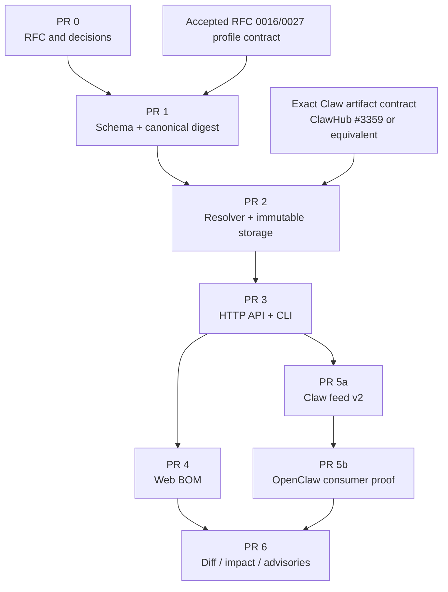

# Claw Composition Evidence implementation plan

This sidecar translates the Agent BOM RFC into bounded, dependency-aware pull
requests. It is implementation guidance, not a substitute for the normative
contract in [the RFC](../0030-claw-composition-evidence.md).

## Dependency map

## PR 0: RFC

### Scope

- Agree on snapshot versus current-status separation.
- Agree on safe fields and forbidden fields.
- Agree on publication failure and recheck semantics.
- Agree on naming, limits, authorization, and reconstruction policy.
- Record non-overlap with RFC 0027 application composition.
- Record dependency on an immutable exact artifact identity.

### Files

- rfcs/0030-claw-composition-evidence.md
- rfcs/0030/implementation-plan.md

### Validation

- Markdown link and Mermaid rendering inspection.
- Cross-check against VISION.md, specs/claws.md,
  specs/experimental-claw-feed.md, packages/schema/src/claws.ts,
  packages/schema/src/clawPackage.ts, packages/schema/src/packages.ts,
  convex/packages.ts, convex/schema.ts, and current OpenClaw RFC drafts.
- Verify no code, public API, or production behavior changes.

### Exit gate

Maintainers resolve or explicitly defer the six version-1 questions in the RFC.
Do not start public schema implementation while naming, visibility, safe
projection, or post-publication blocking semantics remain ambiguous.

## PR 1: Schema and canonical serialization

### Primary owner

packages/schema

### Proposed files

- packages/schema/src/clawComposition.ts
- packages/schema/src/clawComposition.test.ts
- packages/schema/src/index.ts
- generated schema distribution files
- mirrored CLI schema only through the repository's normal generation path

### Deliverables

- Snapshot envelope and content validators.
- Component, resource, edge, summary, and current-status schemas.
- Explicit distinction between artifact, composition, applying-client package
  snapshot, and plan-integrity digests.
- Stable node-id construction helpers.
- Stable diagnostic codes.
- Explicit serializer with deterministic field and collection ordering.
- SHA-256 digest helper over canonical content bytes.
- Contract limit constants.
- Safe-projection helpers for MCP URL origins, environment key names, cron,
  workspace destinations, prompt presence, and profiles.
- Shared fixtures for valid and rejected snapshots.

### Required tests

- Same logical unordered input produces byte-identical canonical output.
- Every field change covered by identity changes the digest.
- recordedAt, storage ids, and current status do not change the digest.
- Unknown fields fail.
- Duplicate node ids and duplicate edges fail.
- Missing edge targets fail.
- Invalid digest format fails.
- Every limit has boundary-minus-one, boundary, and boundary-plus-one vectors.
- Unicode and portable path ordering are deterministic.
- URL userinfo, path, query, and fragment are absent.
- Prompt, cron message, environment value, and arbitrary command arguments
  cannot be represented by the public schema.
- Parser round-trip preserves canonical content.

### Exit gate

- Schema TypeScript checks pass.
- Package schema test suite passes.
- Canonical fixture digest is committed as a cross-repository vector.
- A second independent implementation or small verification script reproduces
  the fixture digest.

## PR 2: Resolver and immutable storage

### Primary owners

- convex/packages.ts publication flow
- new convex/clawComposition.ts owner module
- convex/schema.ts

Before writing Convex code, read convex/\_generated/ai/guidelines.md.

### Proposed storage

- clawCompositionSnapshots table.
- by_release_schema index.
- by_digest index.
- Internal release references stored separately from the public content shape.
- No generic list query reads snapshot documents.

### Publication flow

1. Verify and parse the exact Claw artifact.
2. Receive the validated Claw package result from the existing package
   validator.
3. Resolve exact package coordinates through canonical package queries.
4. Validate family, version, artifact, visibility, and current installability.
5. Stage exact resolution references and validated safe resource input with the
   pending package release.
6. Run existing publication security checks.
7. Re-read the exact recorded dependency releases during finalization.
8. Capture final publication-time evidence and build components, resources,
   edges, and summary.
9. Canonicalize and hash.
10. Insert the snapshot and publish the release atomically, or block the
    release without exposing a snapshot.

### Idempotency

- Same release/schema/digest retry returns the existing snapshot.
- Same release/schema with a different digest fails and records an operator-
  visible error.
- No ordinary mutation updates snapshot content.

### Current-status owner

- Resolve internal exact release refs through indexed lookups or direct ids.
- Use existing package security, moderation, publication, deletion, and
  download-policy helpers.
- Return unknown on incomplete evaluation.
- Do not perform runtime compatibility or network readiness checks.

### Required tests

- Valid Skill and both Plugin families resolve.
- Missing package/version and family mismatch fail with declaration paths.
- Missing artifact digest and blocked dependency fail.
- Public subject to private dependency fails.
- Subject authorization is checked before dependency metadata is returned.
- Dependency state changed before finalization blocks publication.
- Dependency state changed after publication leaves digest unchanged and
  changes only current status.
- Retry idempotency and digest mismatch behavior.
- Pending publication has only internal resolution input; blocked publication
  exposes no publish-origin snapshot.
- Existing generic package list/search paths do not read snapshots.
- Snapshot content remains below configured byte limit.
- Real Convex runtime validation covers indexes, validators, authorization, and
  staged/final mutation behavior.

### Exit gate

- Focused package-publication and Convex runtime tests pass.
- Existing Claw publication E2E still passes.
- No new table scan or unindexed filter.
- Snapshot write and release finalization failure recovery are proven.

## PR 3: HTTP API and CLI

### Proposed API files

- packages/schema/src/packages.ts
- packages/schema/src/routes.ts
- convex/httpApiV1/packagesV1.ts
- convex/httpApiV1.handlers.test.ts
- docs/http-api.md

### Proposed CLI files

- packages/clawhub/src/cli/commands/packages.ts
- packages/clawhub/src/cli/commands/packages.test.ts
- packages/clawhub/README.md or docs/cli.md

### Deliverables

- Exact-version composition snapshot endpoint.
- Exact-version current-status endpoint.
- Compact composition reference on exact/latest package detail.
- ETag plus no-store or mandatory revalidation for snapshot authorization.
- No-store or short-cache behavior for current status.
- Human and JSON package-inspect output.
- Feature-gate and family checks.

### Required API tests

- Public exact version success.
- Encoded scoped package name.
- Latest detail points to the exact latest release snapshot.
- Historical exact version points to its own snapshot.
- Non-Claw, disabled gate, missing snapshot, hidden release, private caller, and
  blocked subject cases.
- Conditional ETag request.
- Current-status response changes without snapshot ETag change.
- Response-schema strictness.
- Prompt and sensitive-value absence over serialized bytes.

### Required CLI tests

- Grouped human output.
- JSON output exactly matches public schema.
- Publication-time versus current-state labels.
- Attention and blocked exit/output semantics.
- Missing composition evidence for pre-contract releases.
- No install or local mutation side effect.

### Exit gate

- HTTP E2E and CLI focused suites pass.
- Public docs state that BOM availability is not runtime readiness or safety.

## PR 4: Web presentation

### Scope

- Exact-version Claw detail only.
- Grouped accessible list is required.
- Direct graph is optional and derives from the same response.
- Published composition and current registry status remain visually distinct.

### Suggested components

- ClawCompositionSummary
- ClawCompositionGroups
- ClawCompositionStatusBanner
- ClawCompositionGraph
- ClawCompositionEvidenceLegend

Names are illustrative and should follow current route/component ownership.

### User states

- loading snapshot;
- snapshot available, status available;
- snapshot available, status attention;
- snapshot available, status blocked;
- snapshot available, status unknown;
- pre-contract release with no snapshot;
- Claws gate disabled;
- private or unauthorized;
- partial network failure where immutable snapshot loads but status does not.

### Accessibility

- Every graph fact appears in the grouped semantic list.
- Keyboard navigation does not require spatial graph interaction.
- Status is not color-only.
- Exact versions and publisher names are copyable text.
- Evidence timestamps use accessible absolute values with optional relative
  display.
- Mobile layout does not require horizontal graph panning to reach facts.

### Proof

- Component and route tests.
- Real local ClawHub instance with seeded exact releases.
- Browser screenshots for available, attention, and blocked states.
- Keyboard/focus and narrow viewport checks.

## PR 5a: Experimental feed contract

### Dependency

PR 3 API must be stable behind the experimental gate.

### Scope

- Bump the strict experimental Claw feed schema in coordination with its
  consumer.
- Add composition schema version, digest, and URL.
- Keep exact artifact integrity as the install authority.
- Omit subjects with blocked current required dependencies.
- Preserve deterministic serialization.

### Tests

- Old and new parser compatibility decision is explicit.
- Unknown field behavior is intentional.
- Feed composition subject matches package/version/artifact.
- Blocked dependency removes entry.
- Feed serialization is deterministic.
- No full graph is embedded in feed.

## PR 5b: Applying-client bridge

### Scope

- Consumer fetches or receives exact composition reference.
- Consumer verifies canonical bytes and digest.
- Consumer verifies subject coordinate and artifact digest match feed.
- Consumer downloads and verifies artifact independently.
- Real OpenClaw add dry-run remains the local authority.

### Failure cases

- Wrong composition digest.
- Composition subject/version mismatch.
- Composition artifact mismatch.
- Feed points to hidden or unauthorized composition.
- Component becomes blocked between feed generation and fetch.
- Composition endpoint unavailable.

The accepted failure policy should fail closed for integrity mismatch and fall
back only where the experimental consumer contract explicitly allows a BOM-
unaware path.

### Cross-repository evidence

- Pin exact ClawHub and OpenClaw commits.
- Install frozen dependencies.
- Serve deterministic feed, composition, and artifact fixtures.
- Assert returned OpenClaw plan is non-mutating.
- Assert package-authored prompt and cron text do not occur in any serialized
  registry or plan output.

## PR 6: Follow-ups

These are separate product decisions and should not inflate the MVP:

### Version diff

- Compare immutable snapshots by stable node id.
- Added, removed, version-changed, evidence-changed, and resource-policy-
  changed groups.
- Do not compare live status as though it were package content.

### Reverse impact

- Normalize or index internal exact-release references for bounded reverse
  lookup.
- Moderator preview and owner notification.
- Cursor pagination and no full-table scans.

### Advisories

- Attach one advisory to exact component release ids.
- Derive affected Claw releases from immutable references.
- Keep advisory claims separate from scanner verdicts.

### Capability evidence

- Link accepted declared capability evidence to component nodes.
- Compare declared versus observed only when scanner evidence has explicit
  provenance and confidence.
- Never infer enforcement policy from the BOM alone.

### External formats

- Export package component subset to CycloneDX.
- Preserve MCP, cron, workspace, profile, and bootstrap resources through
  documented extensions or a companion native document.
- Do not call the export complete if native resources are silently discarded.

## Validation matrix

| Invariant                      |       Schema | Backend |        API/CLI |                   UI |            Cross-repo |
| ------------------------------ | -----------: | ------: | -------------: | -------------------: | --------------------: |
| Exact subject artifact binding |            ✓ |       ✓ |              ✓ |              display |                     ✓ |
| Deterministic digest           |            ✓ |       ✓ |              ✓ |              display |                     ✓ |
| Exact dependency resolution    |      fixture |       ✓ |        display |              display |                     ✓ |
| Snapshot immutability          |      fixture |       ✓ |           ETag |              display |                     ✓ |
| Current status separation      |       schema |       ✓ |              ✓ |                    ✓ |                     ✓ |
| Prompt/secret redaction        |            ✓ |       ✓ | byte assertion |  rendering assertion |        byte assertion |
| Authorization                  | schema shape |       ✓ |              ✓ |          route state | authenticated fixture |
| Limits                         |            ✓ |       ✓ |       response | large-state fallback |               fixture |
| Gate disabled                  |       parser |       ✓ |              ✓ |   hidden/fail closed |                     ✓ |
| Runtime authority retained     |          N/A |     N/A |           copy |                 copy |          real dry-run |

## Estimated effort

These are engineering estimates, not acceptance promises:

| Slice                | Estimate                                |
| -------------------- | --------------------------------------- |
| PR 0 RFC             | 2–4 days including maintainer iteration |
| PR 1 schema          | 4–6 days                                |
| PR 2 backend         | 7–10 days                               |
| PR 3 API and CLI     | 4–6 days                                |
| PR 4 web             | 4–6 days                                |
| PR 5 feed and bridge | 5–8 days across repositories            |

The MVP is approximately 4–6 engineer-weeks for one contributor familiar with
the ClawHub publication and OpenClaw Claws contracts. Review latency and
cross-repository landing order are not included.

## Landing order

1. RFC acceptance.
2. Exact-artifact publication contract or equivalent immutable subject proof.
3. Shared schema and canonical digest.
4. Resolver and storage.
5. HTTP API and CLI.
6. Web grouped view.
7. Coordinated feed and applying-client bridge.
8. Optional graph polish and post-MVP work.

No slice should advertise an installable BOM until its exact subject artifact,
complete direct resolution, safe projection, and digest verification are all
available.
