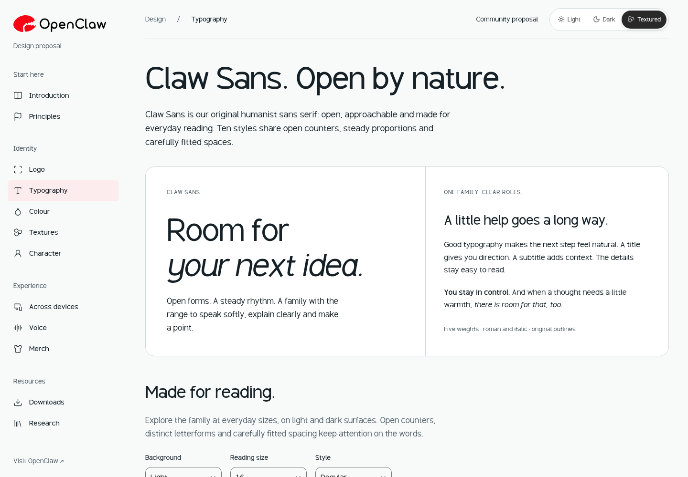
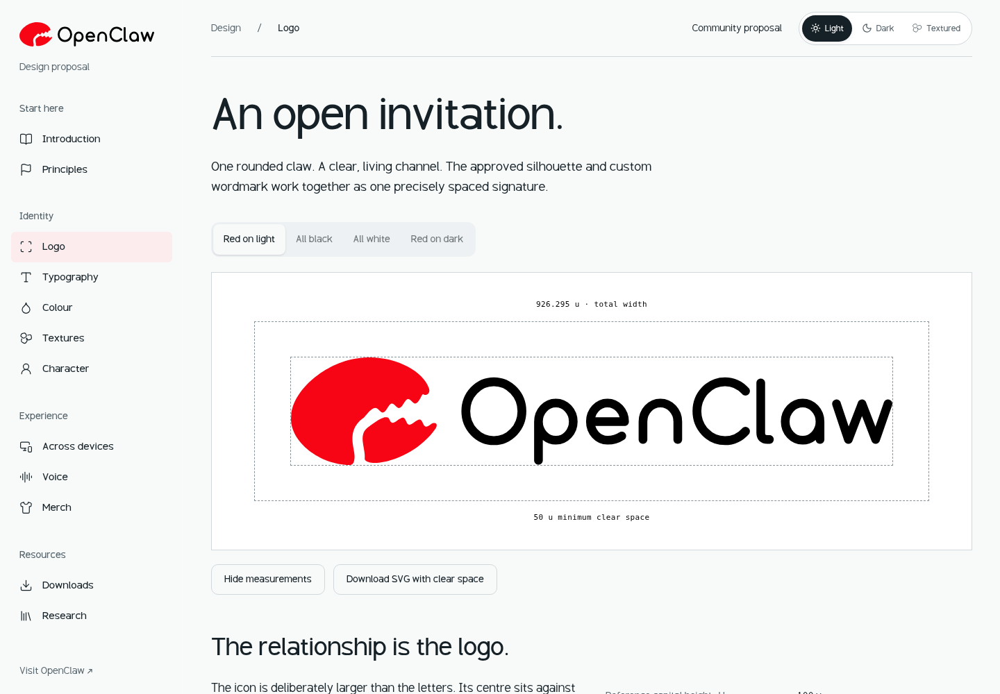
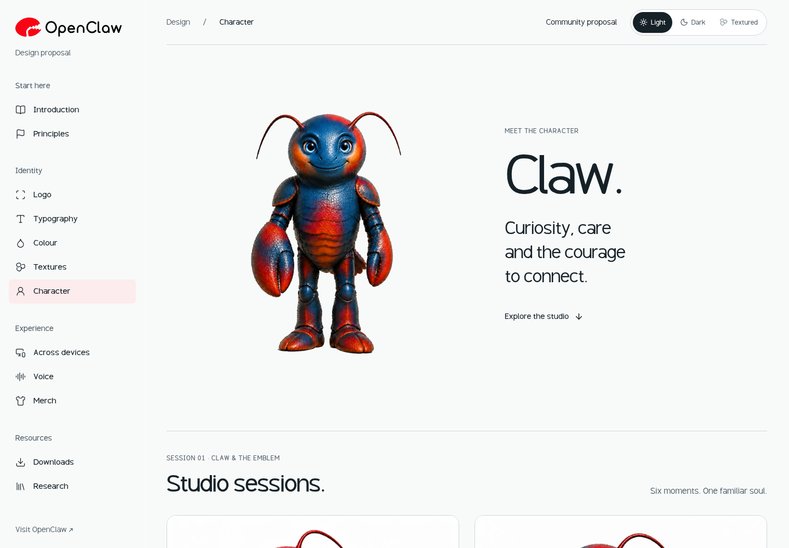

# Proposal: Community visual identity and typography direction

## Summary

Offer an independent visual design study for OpenClaw community review: a red claw identity, the original Claw Sans family, a shell-derived texture language, and the Claw character. The working website includes device, voice, and merchandise explorations and downloadable sources. This RFC asks which elements, if any, merit a focused evaluation with maintainers; it does not request adoption of the entire collection or change existing OpenClaw applications.

**[Explore the public proposal](https://openclaw-design-proposal.sergiopesch.chatgpt.site/)** · **[Download assets and source](https://openclaw-design-proposal.sergiopesch.chatgpt.site/downloads)** · **[Run it locally](0032/local-preview.md)**

Made with care and love by Sergio Peschiera — [@sergiopesch on X](https://x.com/sergiopesch).

## Motivation

The aim is to explore how an approachable, recognizable identity can carry through reading, interface chrome, and character expression. A working specimen makes the forms and interactions easier to critique than isolated mockups, and editable files let contributors inspect the actual construction.

This is a design hypothesis, not evidence that the current upstream identity is defective. Existing native design systems remain the starting point for any implementation. Review should determine whether the proposed forms improve clarity, recognition, or warmth in a concrete OpenClaw surface before committing to migration.

## Goals

- Make the complete proposal publicly inspectable without requiring a local setup.
- Supply original assets, precise type measurements, editable sources, provenance, and reproducible local setup.
- Gather feedback on identity and typography as independently adoptable elements.
- Agree on one useful evaluation surface, acceptance criteria, and ownership before any implementation PR.

## Non-Goals

- An immediate project-wide rebrand, replacement frontend, or mandated cross-platform visual treatment.
- A working Gateway client, live voice assistant, or new agent capability.
- A claim that design-site tests establish native accessibility, global language coverage, or improved usability.
- Approval to manufacture merchandise, trademark licensing, or a request to merge this draft before the RFC lifecycle is complete.

## Proposal

### Review the final family and identity

The [Typography page](https://openclaw-design-proposal.sergiopesch.chatgpt.site/typography) presents the final Claw Sans family with interactive reading specimens and an outline/spacing inspector. It includes five weights, real italics, ten static styles, and 285 encoded characters per style. The design uses a 1,000-unit em, 700-unit cap height, 546-unit x-height, 629-unit lowercase t, and 560-unit tabular numeral advances. Unsupported scripts require fallback fonts; there are no variable or optical-size axes or arbitrary combining-mark positioning.

The [Logo page](https://openclaw-design-proposal.sergiopesch.chatgpt.site/logo) supplies inspectable silhouette and wordmark artwork. The fixed wordmark is an SVG master, distinct from the UI font. The [Textures page](https://openclaw-design-proposal.sergiopesch.chatgpt.site/textures) translates rounded shell plates into colorless relief with opaque and reduced-effects fallbacks.

### Explore character and applications as supporting studies

[Claw](https://openclaw-design-proposal.sergiopesch.chatgpt.site/character) expresses curiosity, care, empathy, and encouragement through consistent anatomy and positive poses. The studio includes transparent solo artwork and downloadable 3840-pixel enlargements, explicitly labeled as upscaled illustrations. It does not include a rigged 3D character.

[Across devices](https://openclaw-design-proposal.sergiopesch.chatgpt.site/across-devices) explores desktop, laptop, phone, and watch compositions. [Voice](https://openclaw-design-proposal.sergiopesch.chatgpt.site/voice) is a state-animation study with optional local audio-file visualization; it does not capture a microphone or connect to a Gateway. [Merch](https://openclaw-design-proposal.sergiopesch.chatgpt.site/merch) contains apparel, caps, stickers/pins, mugs, and plush concepts, not production-ready manufacturing specifications.

These studies show a possible range for the identity. Acceptance of typography or an icon would not imply acceptance of the character, texture, voice behavior, or merchandise.

### Preserve platform decisions

The existing [iOS design guide](https://github.com/openclaw/openclaw/blob/main/apps/ios/DESIGN.md) prefers native SwiftUI structure, a black sidebar, semantic action colors, and Liquid Glass reserved for controls/navigation. Some proposed transparent surfaces and red decorative treatments differ from those rules. Those differences are open design questions, not upstream-compliant changes ready to land. Native implementation would preserve platform structure, Dynamic Type, assistive technology, reduced effects, and current capability boundaries.

The site is React/Vinext; upstream Control UI uses Lit. The contribution being evaluated is a design and asset direction, not a proposed framework migration.

### Make review and reuse practical

The [maintainer handoff](https://openclaw-design-proposal.sergiopesch.chatgpt.site/downloads/MAINTAINER-GUIDE.md) indexes font binaries/UFO/Fontra sources, metrics and proofs, identity masters, texture CSS, character art, original merch mockups, semantic tokens, and the portable website source. [Checksums](https://openclaw-design-proposal.sergiopesch.chatgpt.site/downloads/resource-index.json) identify 70 current/historical downloads; the page highlights 14 entry points.

Reviewers can use the public site directly or follow the [tested local setup](0032/local-preview.md). The author's loopback server is not a public service. Localhost links in the setup refer to each reviewer's own machine.

Original site code/tokens are MIT; font software is SIL OFL 1.1; contributor-owned artwork and documentation are offered under CC BY 4.0 to the extent rights can be granted. AI-assisted/generated artwork has per-asset provenance. Third-party rights remain with their owners; no trademark rights or upstream endorsement are implied. See the [license ledger](https://openclaw-design-proposal.sergiopesch.chatgpt.site/downloads/LICENSES.md) and [screenshot notices](0032/ASSET-NOTICES.md).

### Evaluate one part before implementing

A possible first evaluation is a Claw Sans reading/label specimen using real strings from one maintainer-selected documentation or UI surface. Compare it with the existing family at actual sizes, with fallback scripts, enlarged text, both themes, and the target platforms. Keep the current font if the proposed one does not meet the agreed criteria. This is a suggested starting point, subject to maintainer interest, not a promised upstream change.

If a direction is accepted, record a focused implementation issue and implement only that scope in the target repository, with matched before/after evidence and its normal tests.

## Rationale

- A complete website lets the community explore the work; a compact RFC keeps the adoption decision reviewable.
- A source archive and editable assets permit examination without adding the entire site or large binary archive history to OpenClaw's runtime repository.
- Selective evaluation gives typography, identity, and character their own acceptance decisions. A wholesale rebrand would bundle substantially different costs and product choices.
- Retaining all current upstream visuals is a valid outcome. The proposal has not demonstrated a measured usability improvement over them.

## Unresolved questions

- Is any part of this identity/type direction useful to OpenClaw's current priorities?
- Which single surface would be appropriate for a first comparison, and who should own that decision?
- Which existing brand and native-platform conventions must remain fixed?
- What language coverage, accessibility, rendering, and maintenance criteria would an adopted font need?
- Should character and merchandise remain independent community artwork?
- This submission is GitHub-only. The separate `maintainer-discussion` thread required by the RFC README has not been created. That lifecycle step remains outstanding before acceptance; no exception or sponsorship is claimed.

## Review evidence

See [verification and limits](0032/local-preview.md#verification-on-2026-09-08). The site is a functioning design study; production Gateway integration and complete native/browser qualification are outside the validated scope. Screenshots show the proposal, not before/after changes to upstream software.
