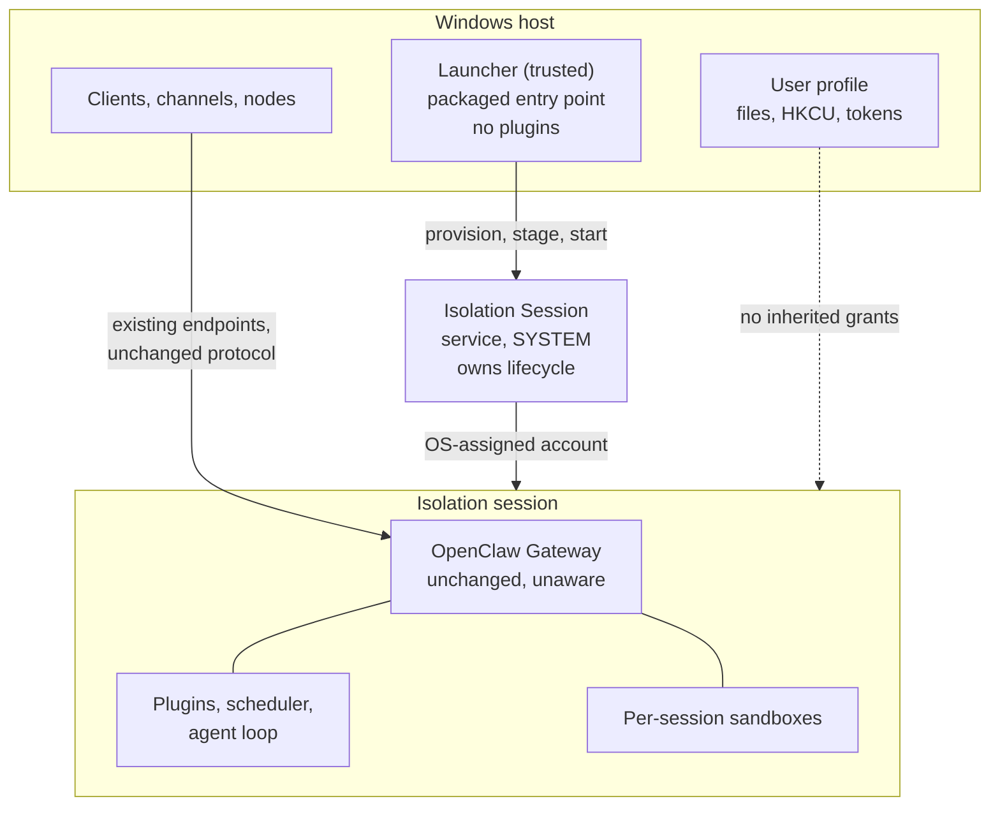

# Proposal: Gateway Containment and Windows Isolation Sessions

## Summary

We contain the work an agent does, but not the process that decides to do it. On
Windows the Gateway runs as the signed-in user, so every plugin, credential, and
model-directed decision carries that user's full reach over their files,
registry, and tokens.

This proposes containing the Gateway itself — and, importantly, doing it from
*outside* the Gateway. A small trusted launcher provisions an OS-managed
boundary and starts the Gateway inside it. The Gateway is unchanged and unaware;
it simply never runs anywhere else.

Windows Isolation Sessions are the first provider: the OS mints a fresh
throwaway account, runs the Gateway in a session bound to it, and tears both
down afterward. That provider is preview-quality today, so this asks for the
contract and the direction, plus a readiness bar to clear before anyone
recommends it.

## Motivation

### The Gateway is our biggest uncontained surface

We already have containment seams, and they're all narrower than the Gateway.
`SandboxBackend` (`src/agents/sandbox/`, with Docker and SSH backends) is
per-session and scoped to a workspace. It contains the commands an agent runs.

It doesn't contain the process that loads plugins, holds channel and provider
credentials, runs the scheduler, and picks the commands in the first place.

That's backwards. A tool call gets a container; the thing that chose the tool
call, and holds the tokens authorizing it, runs as you. On a Windows
workstation, the blast radius of a prompt injection or a hostile skill is your
whole profile: documents, browser and credential stores, `HKCU`, startup
entries, SSH keys.

ACLs don't help here. They don't separate code running as you from data owned by
you — that's exactly the grant they encode. Neither does a different working
directory or a restricted shell. Any control the Gateway can decline to apply is
a policy, not a boundary, and agent software is the one category where the
process can be talked into changing its mind.

### A compromised Gateway can't contain itself

This constrains the design more than anything else here.

If the Gateway is what we're treating as compromised, it can't also be what
decides whether to be contained. A containment check inside the Gateway is code
the attacker already controls — patch it, configure it away, or just never reach
it. By the time it would run, untrusted code is already executing with the
identity the check was supposed to remove. Plugins are no better, since they
load into the process being contained.

So the boundary has to exist *before* the Gateway does, established by something
outside it. That something is a launcher: a separate, minimal executable that
runs as the user, provisions the boundary, and starts the Gateway inside. The
Gateway then has no uncontained mode to reach — not because it declines one, but
because it's never started outside the boundary at all. It needs no containment
code and no containment config.

That also sets the bar for the launcher. It's the trusted computing base here,
so it stays small, loads no plugins, and never runs agent-directed work.

### Today's Windows options are all bad trades

| Option | Trade |
|---|---|
| Run as the user (default) | Full reach, full blast radius |
| WSL (today's recommendation, per [#58](https://github.com/openclaw/rfcs/pull/58)) | Real boundary, but a second OS with its own filesystem, packages, credentials, and update cadence |
| VM or Windows Sandbox | Stronger boundary, but continuous resource cost and a lifecycle built for disposable sessions, not an always-on daemon |

None works as a default. The first isn't contained; the others are heavy enough
that nobody runs them for a background process.

### The OS now offers something better shaped

Windows is exposing containment built around per-instance *identity* rather than
a whole guest OS. Per the public
[`microsoft/mxc`](https://github.com/microsoft/mxc) project, its
`isolation_session` backend asks a Windows service to mint a fresh agent account
with an opaque OS-assigned name, start a session for it, run processes inside,
then stop the session and delete the account.

[MXC states the
requirements](https://github.com/microsoft/mxc/blob/main/docs/isolation-session/oneshot.md)
plainly: "per-execution OS-isolated identity so the workload's actions cannot
pollute the calling user's NTFS / registry / token state", with an "OS-managed
session lifecycle that the OS-side service tears down cleanly when the calling
process exits."

The unit is a session and an account, not a guest OS — no guest memory footprint
or boot time. Provisioning isn't free, which is exactly why MXC's state-aware
lifecycle exists: one session hosts many executions "without re-paying the
provisioning / session-start cost each time." For a daemon that starts once and
stays up, that's the right shape.

### How this fits with work already in flight

- [**#58 (MSIX packaging)**](https://github.com/openclaw/rfcs/pull/58) lists
  "Defining runtime isolation" as a non-goal and says a separate RFC may define
  a session-based runtime model. This is that RFC. #58 also already describes
  the launcher we need — see below.
- [**#42026 (control plane / per-agent
  runtimes)**](https://github.com/openclaw/openclaw/issues/42026) splits the
  gateway so each agent runs in its own container or process, giving "true
  secret isolation" between agents. Different axis. It partitions *which
  component holds which secrets*; this changes *what principal a component runs
  as*. Fully decomposed on Windows, every runtime still runs as you. Both are
  worth having, so the contract below targets a *unit of containment* rather
  than a monolithic Gateway.
- [**#55 (OpenShell worker
  provider)**](https://github.com/openclaw/rfcs/pull/55) contains a session's
  worker. This contains the Gateway. They nest.

## Goals

- Establish the boundary in a launcher outside the Gateway, so a compromised
  Gateway has no uncontained mode to reach.
- Keep the Gateway unchanged and unaware — no new config, no runtime branch, no
  protocol change.
- Define a platform-agnostic `ContainmentProvider` contract so this isn't a
  Windows fork of the startup path.
- Make each provider's limits explicit and machine-readable, so one that can't
  enforce something says so instead of implying it.
- Fail closed, loudly, when a selected provider isn't available.
- Leave existing uncontained deployments alone, with a real migration and
  rollback path for anyone opting in.
- Define the readiness bar to clear before recommending — later, defaulting —
  contained execution.

## Non-Goals

- **Packaging and distribution.** That's
  [#58](https://github.com/openclaw/rfcs/pull/58). This RFC doesn't depend on
  MSIX; it needs *a* launcher, and on Windows #58 already builds one.
- **Replacing per-session sandboxes.** `SandboxBackend` and
  [#55](https://github.com/openclaw/rfcs/pull/55) contain a session's work. This
  contains the Gateway.
- **Deciding how the Gateway is decomposed.** That's
  [#42026](https://github.com/openclaw/openclaw/issues/42026).
- **Specifying the Windows API.** Owned by Windows; consumed, not defined, here.
- **Making containment the default,** or requiring it, now.
- **Changing auth, pairing, discovery, or the wire protocol.**

## Proposal

### Where things run

Three parts, and which side of the boundary each lands on is the whole point.

**The launcher runs outside, as the user.** It's the entry point. It selects a
provider, provisions the boundary, stages the payload, starts the unit inside,
and reports posture. It's the trusted computing base, so it stays minimal, loads
no plugins, and never executes agent-directed work.

On Windows this is #58's host app, not a new component. #58 defines it as "the
packaged entry point" behind an `openclaw.exe` execution alias, whose job is
"package activation, payload verification and staging, and launching or stopping
the packaged Gateway", and which explicitly "does not proxy Gateway traffic,
distribute Gateway credentials, or approve clients, nodes, or channel users."
This RFC adds one responsibility: establish the boundary first.

**The unit of containment runs inside.** Today that's the Gateway, along with
the agent loop, plugins, scheduler, and its working state. If
[#42026](https://github.com/openclaw/openclaw/issues/42026) lands, the unit
becomes each runtime instead, and nothing below changes.

**Everything else is untouched.** Clients, channels, and nodes reach the Gateway
through existing endpoints. Per-session sandboxes still work; containment nests.
The Gateway still owns its own config, credentials, and pairing records — the
launcher provisions an environment, it doesn't broker credentials.

### The `ContainmentProvider` contract

The launcher implements and consumes this. A provider answers two questions:
what boundary can this host actually give me, and how do I start and stop
something inside it.

**Capabilities.** A provider declares its boundary honestly, because an
overstated boundary is worse than none:

| Capability | Meaning |
|---|---|
| `identityIsolation` | Does the unit run as a principal distinct from the user, and is it per-instance? |
| `statePersistence` | Does state inside survive the lifecycle, and across what — instance, host, nothing? |
| `hostPathProjection` | Can arbitrary host paths be mapped in? |
| `stagingChannel` | Is there a directory for moving files across, and what's its lifetime and visibility? |
| `networkPosture` | What can be enforced on the network. Includes "nothing". |
| `hostUiReach` | Can contained code see or drive the user's desktop, clipboard, input? |
| `workloadIdentity` | Can the unit carry its own identity instead of borrowing the caller's? |
| `lifecycleOwner` | Is teardown guaranteed by the OS, or do we have to drive it? |

`hostPathProjection` and `stagingChannel` are deliberately separate. Being able
to hand a file across is not the same as giving an agent the user's working
tree, and merging them is how someone ends up believing they have the second.

The descriptor is versioned. The launcher refuses a version it doesn't
understand rather than treating absent fields as "unsupported" — an unrecognised
capability must never quietly become a claim about the boundary.

**Lifecycle:**

```
probe -> provision -> start -> attach -> stop -> deprovision
```

`probe` reports availability and capabilities with no side effects. `attach`
reconnects to an already-running unit across separate invocations, so ordinary
commands don't each pay provisioning cost.

Every operation is idempotent, and `deprovision` is the only destructive one, so
a supervisor can retry anything else safely. `provision` returns an opaque
identifier the launcher persists and reuses to address the environment later,
and reports whether it reused an existing identity.

The environment outlives the process that started it. That's what makes `attach`
work, and it means a crashed launcher leaves an environment behind — reconciling
orphans is an obligation, not an edge case.

**Failure outcomes** are a closed set, so the launcher can act without parsing
provider text:

| Outcome | Meaning | Behavior |
|---|---|---|
| `unavailable` | Provider can't run here — absent, gated off, unsupported build | Fail closed unless fallback is configured |
| `policy_rejected` | Config was supplied that this provider can't enforce | Fail closed, always |
| `stale` | Referenced environment is gone | Re-provision if starting, else surface |
| `lifecycle_failed` | Operational failure | Retry per policy, then fail closed |

`policy_rejected` never falls back, even when fallback is on. Asking for a
boundary the provider can't deliver is a config error, not an availability
problem, and quietly running with a weaker boundary is the exact outcome this
contract exists to prevent.

### The Windows provider

`provision` asks the OS service for a fresh account, `start` boots a session
bound to it, `stop` and `deprovision` tear both down. Each instance is a
distinct account with no shared registration, so concurrent units are
independent.



**Figure 1.** The launcher establishes the boundary; the Gateway starts inside
it and never runs outside it.

This is an **identity** boundary and the descriptor has to say so. Per [MXC's
backend
docs](https://github.com/microsoft/mxc/blob/main/docs/isolation-session/state-aware-rust.md),
the network is unrestricted — a process inside can listen on a port reachable
over localhost — so `networkPosture` is unsupported. There's no UI-restriction
primitive either, though contained code can't reach the host's desktop or
clipboard.

Host paths are the interesting part, and they drive much of the design.
Arbitrary path projection is rejected outright — you can't map in the user's
documents folder. What exists instead is one OS-created directory per sandbox,
documented as "a directory shared between the calling user and this isolated
agent user, through which the caller can stage files into the session", with
three properties that matter:

- **Asymmetric.** Each isolated user sees only its own; the caller sees every
  concurrent sandbox's. The caller is the privileged side.
- **Ephemeral.** Created at provision, deleted at deprovision. A channel, not
  storage.
- **Not the working directory.** It doesn't change where the workload runs.

Two other provider inputs shape things. Provisioning takes an optional
application identifier — documented as "the Package Family Name for a packaged
app", carried so "a future OS contract acting on the calling application's
identity needs no breaking change." That's a concrete, mechanical link to
[#58](https://github.com/openclaw/rfcs/pull/58): package identity is an *input*
to containment. It also takes an optional user-identity bundle, which is the
hook for giving a contained unit an identity of its own.

Availability: the backend is experimental, gated behind both an explicit flag
and an OS feature flag, and needs a recent [Insider
build](https://learn.microsoft.com/en-us/windows-insider/release-notes/experimental/preview-build-26300-8553).

### What this costs

**Durable state has to live outside.** Both the account and the staging
directory die at deprovision, so nothing kept inside is durable. That settles it
rather than leaving it open: durable state is host-side and staged in. The catch
is that this store then holds exactly the credentials containment was supposed
to make less valuable, so it needs protecting accordingly.

**Don't run the Gateway from the staging directory.** It's ephemeral,
caller-writable, and explicitly not the working directory. Stage through it,
then materialize inside.

**Host reach drops to a staging channel.** No desktop, and no user working tree.
"Fix a file in my repo" isn't expressible unless something explicitly stages
that content across — a product decision about mediated access, not a
transparent capability. See [Unresolved questions](#unresolved-questions).

### Bypass resistance

Containment you can skip by accident is a default, not a boundary. Two paths
need closing:

- **A second entry point.** If a source checkout, stale shortcut, or copied
  binary still starts a Gateway directly, the boundary is optional in practice.
- **`openclaw gateway`.** It starts a Gateway by design.
  [#58](https://github.com/openclaw/rfcs/pull/58) already makes this a release
  requirement for its own payload activation — that host operations and native
  `openclaw gateway` commands "cannot create conflicting managed Gateway
  instances or bypass staged-payload activation" — and the same applies here.

Since the Gateway can't be trusted to refuse to start, this can't be a check
inside it. It comes from deployment shape: the managed install exposes the
launcher as its entry point, and a Gateway started some other way is a
*different, unmanaged install* rather than a containment failure of the managed
one. Making that difference observable is part of the readiness bar.

### Readiness bar

Recommend contained execution for a deployment class only once:

- The capability descriptor is accurate and the launcher refuses what a provider
  can't enforce.
- State persists across `provision`/`deprovision` and host restarts, and the
  host-side store is protected like the credentials it holds.
- Orphaned environments get reconciled instead of accumulating.
- Anything the host reads back from the staging channel is treated as untrusted
  input, with the parsing boundary identified and tested.
- Clients, channels, and nodes connect with no protocol change and no extra user
  step.
- `attach` keeps ordinary CLI use cheap.
- Startup, crash, restart, and teardown are covered, including ungraceful
  shutdown.
- Posture is reported by the launcher, fallback is loud, and a managed install
  is distinguishable from one started outside it.
- The platform primitive is generally available and its owner is willing to call
  it a security boundary. The `microsoft/mxc` README currently says the opposite
  about its preview backends, which alone blocks claiming this as a defense.

Until then it ships experimental and opt-in.

## Threat model

The threat is a Gateway induced to act against you: prompt injection reaching
the agent loop, a hostile plugin or skill, a compromised dependency. Assume
arbitrary code execution inside the Gateway. Out of scope: an attacker who
already has your credentials, local admin, or kernel access, and a malicious
OpenClaw build.

**What the boundary removes.** The attacker no longer runs as you. Your profile,
`HKCU`, browser and credential stores, SSH keys, and startup entries are refused
by the OS rather than by our own policy. They also can't watch your screen or
inject input, which kills the screen-scraping and synthetic-input paths into
your other apps. Filesystem persistence inside the boundary dies at deprovision.

**What survives.** This is an identity boundary and nothing more:

- **Every credential the Gateway holds.** Provider keys, channel credentials,
  pairing records, conversation history — all inside by construction.
  Containment limits reach into *your* assets; it does nothing to protect the
  Gateway's own secrets from code running as the Gateway. Exfiltration is fully
  available.
- **The network, including loopback.** Nothing is enforced, and a process inside
  can reach and be reached over localhost. Host services that trust their caller
  by origin — dev servers, local databases, other Gateways, local MCP servers —
  stay reachable. On a workstation with local services listening, this is the
  biggest surviving path, and it's why this must never be described as a network
  control.
- **The staging channel, both ways.** Contained code can write into a directory
  a host-side process running as you will later read, so anything the host
  parses from it is untrusted input. This is the likeliest place for a
  boundary-crossing bug.
- **The host-side state store,** which holds the credentials above. Containment
  moves the crown jewels; it doesn't eliminate them.
- **The launcher itself.** It runs as you and can start, stop, and stage into
  the boundary, so compromising it defeats everything. Anything added to the
  launcher is added to the TCB, which makes package integrity and signing a
  dependency of this design rather than an adjacent concern.
- **You.** A contained agent can still talk you into running something yourself.

One consequence worth stating: **posture reported by the Gateway is not
evidence.** A compromised Gateway can claim to be contained. Containment status
is a launcher-side assertion, and anything that needs to be trustworthy — an
admin verifying a managed device — has to observe from outside.

## Rollout

**Nothing changes by default.** Containment is opt-in and off. Deployments that
don't configure a provider behave exactly as they do now, everywhere.

**Turning it on is a migration.** The Gateway moves to a new principal, so state
under your profile isn't automatically visible to it. Adoption has to relocate
or re-establish config, credentials, and pairing records, and say clearly when
it can't — a migration that silently produces an empty Gateway looks identical
to a working one until the first channel fails to authenticate. This depends on
the unresolved persistence question.

**Rollback is routine, not recovery.** Turning containment off returns to the
previous behavior without data loss, which means adoption must never destroy
pre-migration state while moving it.

**Downgrade.** A version predating the launcher contract would ignore the config
and start uncontained — the silent posture change this whole RFC argues against.
It must reject unknown config instead, and that behavior gates the readiness
bar.

**Phases.** None of the first three require the preview OS dependency to begin.

1. **Contract only.** Provider interface, versioned descriptor, failure
   taxonomy, selection, fail-closed, posture reporting — in the launcher, with a
   null provider. No change to OpenClaw core. Proof: tests through the real
   interface for selection, refusal, and reporting.
2. **Windows provider, experimental.** Implement the lifecycle against the OS
   primitive with an honest descriptor. Proof: a Gateway that starts contained,
   is reachable from a client, and runs under an account that demonstrably isn't
   the signed-in user; plus a host without the capability failing closed with a
   reason.
3. **State and migration.** Resolve persistence, then adoption and rollback with
   tested restart, upgrade, and downgrade.
4. **Bypass resistance.** Make the launcher the managed entry point and make an
   unmanaged Gateway distinguishable. Proof: an admin-observable signal that
   doesn't involve asking the Gateway.
5. **Readiness review.** Maintainer decision against the bar.

Phases 1–2 belong to whoever owns the launcher — on Windows, the
[#58](https://github.com/openclaw/rfcs/pull/58) work. Phase 3 shouldn't start
while persistence is open, and phase 4 builds on #58's entry-point work rather
than duplicating it.

## Decision requested

**Is launcher-established, opt-in Gateway containment a direction we want to
support, given that the first provider offers identity isolation only and is
preview-gated?**

A yes authorizes phase 1: the contract, in the launcher, no provider, no default
change — and notably no change to OpenClaw core, since the Gateway is unchanged
and unaware. It doesn't commit us to the Windows provider, a default posture, or
a timeline.

## Rationale

**Why contain the Gateway, not just the session.** Per-session sandboxes assume
the agent's *work* is untrusted. Prompt injection attacks its *judgment*. Once
that's the threat, the thing holding the credentials and choosing the actions
has to be inside a boundary too.

**Why the launcher, not a hook in the Gateway.** A seam in OpenClaw core would
be easier to ship and would sit where the rest of the runtime config lives. It's
wrong for one decisive reason: the Gateway is what the threat model treats as
compromised, so a decision it makes about its own containment is a decision the
attacker makes. A separate executable costs an entry-point contract and buys a
boundary that exists before any untrusted code runs. That OpenClaw core changes
not at all is a bonus — nothing to misconfigure, and no preview OS dependency in
the cross-platform build.

**Why a provider contract, not Windows-specific code.** The problem isn't
Windows-specific; only this primitive is. macOS and Linux have different
mechanisms with different capability profiles. An explicit descriptor lets those
arrive later and forces each to state its limits in a form we can act on.
Without it, the first implementation becomes the de facto contract and its
unstated assumptions get baked in.

**Why not just split the Gateway.**
[#42026](https://github.com/openclaw/openclaw/issues/42026) gives each agent its
own runtime and secrets — genuinely worth doing, and not a substitute. It
partitions between agents while every resulting process still runs as you.
Decomposition means a compromised agent can't reach another agent's secrets;
containment means it can't reach yours.

**Why not WSL.** It contains by moving the Gateway into a second OS, with its
own filesystem, packages, credentials, update cadence, and failure modes, and it
distances the Gateway from the environment you actually work in. An isolation
session keeps it on Windows and changes only the principal.

**Why not a VM or Windows Sandbox.** Stronger boundary, and right for some
deployments. Poor default for an always-on daemon: continuous resource cost,
noticeable startup, and a lifecycle built for disposable sessions. The
isolation-session cost profile is what makes contained execution plausible as an
eventual default rather than an expert mode.

**Why not AppContainer.** Process-level containment restricts a process that
still runs as you — it's MXC's default Windows backend, and useful, but the
principal is unchanged, so the token reach motivating this RFC survives.

**Why fail closed.** A control that silently degrades to no control produces the
worst outcome: someone who believes they're protected and isn't.

## Unresolved questions

### Blocking

- **How does a contained Gateway reach the user's files?** Arbitrary paths can't
  be projected; there's a staging directory. So the question isn't whether
  sharing is possible but what to do with a mediated channel: stage an
  explicitly selected working set in and results out, run a filesystem bridge
  over the existing protocol like the one already used for sandboxes, wait for
  an OS projection primitive, or accept that a contained Gateway works only on
  its own workspace. Each reopens the boundary differently, and the choice
  decides how useful this actually is.
- **What holds durable state, and how is it protected?** It has to be host-side.
  What is it, how is it protected given it holds the Gateway's credentials, and
  how does an existing install migrate into it? Blocks phase 3.
- **Is an identity-only boundary worth adopting?** Nothing is enforced on the
  network and loopback survives. Do we require a network-capable provider before
  recommending this, or is reduced reach into user assets enough on its own?

### Non-blocking

- **Do Windows node capabilities survive?** Computer use, screen capture, and
  input injection (see [RFC 0025](0025-default-pluggable-computer-use.md)) need
  the user's desktop, which contained code can't reach. Does the node stay
  outside and connect in, and what does that do to the boundary's value?
- **Should the contained Gateway carry its own identity?** The provider accepts
  an identity bundle at provision, which would narrow the credential blast
  radius above and interacts with per-agent secret isolation in
  [#42026](https://github.com/openclaw/openclaw/issues/42026). Out of scope for
  phase 1; `workloadIdentity` is reserved so it can be answered later.
- **How does autostart work?** A background Gateway has to start without an
  interactive logon, and the launcher is what starts it.
- **How do we express a posture most hosts can't support** without fragmenting
  the Windows experience?
- **Should this contract live here or in
  [#58](https://github.com/openclaw/rfcs/pull/58)?** It belongs to a launcher
  #58 already owns. Separate keeps it platform-neutral; folded in keeps the host
app's responsibilities in one document. Pick one rather than letting both
describe the launcher.
- **What would let us call this a security boundary?** The platform won't make
  that claim for preview profiles. We should say in advance what evidence we'd
  need before describing this as a defense to users.
- **Is `0032` the right number?** It was the lowest unclaimed integer, but
  several open proposals currently share numbers, so allocation clearly isn't
  sequential. A maintainer should confirm or reassign.
