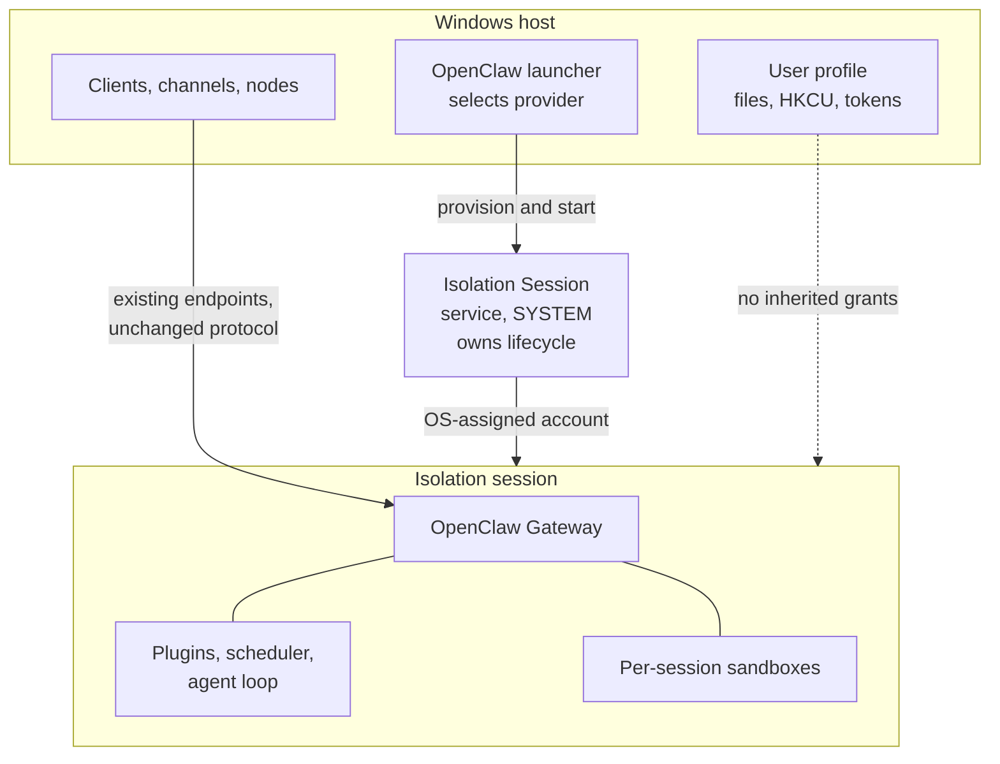

# Proposal: Gateway Containment and Windows Isolation Sessions

## Summary

OpenClaw contains the work an agent does, but not the process that decides to do
it. On Windows the Gateway runs as the signed-in user and inherits that user's
full filesystem, registry, and token reach, so every credential, plugin, and
model-directed decision executes with the operator's identity. This RFC argues
that the Gateway process itself should be containable, and proposes a
platform-agnostic `GatewayContainmentProvider` seam that lets a deployment run
the Gateway inside an OS-managed containment boundary instead of directly as the
user. Windows Isolation Sessions are proposed as the first provider: the
operating system provisions a fresh, OS-assigned agent account, runs the Gateway
in a dedicated session bound to that account, and tears the session and account
down when the owning process exits. The seam and the argument are the proposal;
the Windows provider is currently preview-quality, so this RFC defines the
readiness bar that adoption must clear rather than asking for immediate default
adoption.

## Motivation

### The Gateway is the largest uncontained surface

OpenClaw already has containment seams, and they are all narrower than the
Gateway. `SandboxBackend` (`src/agents/sandbox/`, with Docker and SSH backends)
is created per session and scoped to a session key and workspace directory. It
contains the commands an agent runs. It does not contain the process that loads
plugins, holds channel and provider credentials, runs the scheduler, accepts
node connections, and decides which commands to run in the first place.

That leaves a straightforward asymmetry. A tool call can be confined to a
container, while the component that chose the tool call, holds the tokens that
authorize it, and can rewrite its own configuration runs with the operator's
full identity. On a Windows workstation the practical blast radius of a
prompt-injection, a hostile skill, or a compromised plugin is therefore the
user's entire profile: documents, browser and credential stores, `HKCU`, startup
entries, SSH keys, and any resource that authenticates the user by token rather
than by password.

### ACLs are not a boundary against your own code

The usual mitigations do not close this. File and registry ACLs do not separate
code running as the user from data owned by the user, because that is exactly
the grant they encode. Neither does running the Gateway as a service, or in a
different working directory, or under a restricted shell. Any control that
depends on the Gateway voluntarily declining access is a policy, not a boundary,
and agent software is precisely the category where the process can be talked
into changing its mind.

The only durable fix is an identity the operating system enforces: run the
Gateway as a principal that is not the user and never had the user's grants.

### Existing options force an unattractive trade

Windows deployments today choose between reach and containment:

- **Run natively as the user.** Full reach, full blast radius. This is the
  default and it is what most users run.
- **Run in WSL.** The current recommended local-Gateway path on Windows. It
  provides a real boundary, but it is a second operating system with its own
  filesystem, package management, credential storage, update cadence, and
  support burden, and it moves the Gateway away from the Windows environment the
  user actually works in.
- **Run in a VM or Windows Sandbox.** A stronger boundary at a much higher
  resource and lifecycle cost, and an awkward fit for a long-lived daemon that
  is expected to be running whenever the user is.

None of these is a good default. The first is not contained, and the others are
heavy enough that most users will not adopt them for an always-on background
process.

### The operating system now offers a better-shaped primitive

Windows has begun exposing a containment primitive built around per-instance
identity rather than a whole guest OS. As documented publicly by the
[`microsoft/mxc`](https://github.com/microsoft/mxc) project, its
`isolation_session` containment backend calls a Windows service that provisions
a fresh agent user account with an opaque, OS-assigned name, starts a dedicated
session for it, hosts processes inside that session, and then stops the session
and deprovisions the account. MXC states the requirements this backend exists to
meet as "per-execution OS-isolated identity so the workload's actions cannot
pollute the calling user's NTFS / registry / token state", with an "OS-managed
session lifecycle that the OS-side service tears down cleanly when the calling
process exits."

That shape matters. The unit of containment is a session and an account, not a
guest operating system, so it avoids a guest's memory footprint and boot time,
and the boundary is an OS-enforced identity rather than a cooperative policy.
Provisioning and session start are not free — MXC's state-aware lifecycle exists
precisely so one provisioned session can host multiple executions "without
re-paying the provisioning / session-start cost each time" — but that is a cost
paid once for a daemon that then stays up. For a long-lived agent process, that
is the trade OpenClaw has been missing.

### This composes with packaging, and does not duplicate it

[RFC PR #58](https://github.com/openclaw/rfcs/pull/58) proposes MSIX packaging
for Windows and explicitly lists "Defining runtime isolation. A separate RFC may
define a session-based runtime model" among its non-goals. The two proposals
answer different questions. Packaging gives the installation a reviewable
identity so an administrator can inventory, approve, update, and remove it.
Containment reduces what that installation can reach while it runs. An approved,
signed, inventoried Gateway with the user's full token is still an
unbounded-blast-radius component.

## Goals

- Define a platform-agnostic `GatewayContainmentProvider` seam so Gateway
  containment is a deployment choice with a stable contract, not a
  Windows-specific fork of the startup path.
- Make the containment boundary and its limits explicit and machine-readable, so
  a provider that cannot enforce something says so instead of implying it.
- Establish Windows Isolation Sessions as the first provider, contributed behind
  the same seam as any future provider.
- Preserve the Gateway's existing contract across the boundary: endpoints,
  discovery, device authorization, pairing, node capability approval, and
  protocol behavior are unchanged by containment.
- Define explicit selection, fallback, and diagnostic behavior, including what
  happens when a requested provider is unavailable on the host.
- Define the readiness bar that a provider must clear before contained execution
  can be recommended, and later defaulted, for a class of deployment.

## Non-Goals

- **Defining the packaging or launch mechanism.** How a Gateway build is
  packaged, signed, distributed, and started on Windows belongs to
  [PR #58](https://github.com/openclaw/rfcs/pull/58) and its implementation.
  This RFC describes the containment contract and deliberately does not specify
  the process that establishes it.
- **Replacing per-session sandboxes.** `SandboxBackend` and the worker-provider
  direction in [PR #55](https://github.com/openclaw/rfcs/pull/55) contain a
  session's work. This RFC contains the Gateway. They compose; neither
  substitutes for the other.
- **Specifying the Windows API surface.** The OS API is owned by Windows and is
  consumed, not defined, here.
- **Requiring containment, or making it the default, in this RFC.** The Windows
  provider is preview-quality today. This RFC asks for the seam, the argument,
  and the readiness bar.
- **Changing authentication, pairing, discovery, or the wire protocol.** No new
  endpoint, credential type, or trust relationship is introduced.
- **Defining enterprise policy.** Which deployments must run contained is a
  policy question for the administrator and for OpenClaw's enterprise surface,
  not for this seam.

## Proposal

### What moves, and what does not

Containment applies to the Gateway process and everything it hosts in-process:
the agent loop, plugin code, the scheduler, and the Gateway's own working state.
The following explicitly stay outside the boundary and are unchanged:

- Client, channel, and node connections, which continue to reach the Gateway
  through its existing endpoints.
- Per-session sandbox backends, which continue to contain agent work. A
  contained Gateway may still place a session in a sandbox; containment nests.
- Configuration and credential *ownership*. The Gateway continues to own its
  configuration, credentials, and pairing records. The containment provider
  provisions and tears down an execution environment; it does not read, copy,
  broker, or authorize Gateway credentials.

### The `GatewayContainmentProvider` seam

A containment provider answers two things: what boundary can this host actually
provide, and how is a Gateway started and stopped inside it.

**Capability descriptor.** A provider must declare its boundary honestly,
because an overstated boundary is worse than no boundary. At minimum:

| Capability | Meaning |
|---|---|
| `identityIsolation` | Whether the contained Gateway runs as a principal distinct from the invoking user, and whether that principal is per-instance or shared. |
| `statePersistence` | Whether Gateway state survives the containment lifecycle, and across what unit — instance, host, or not at all. |
| `hostPathSharing` | Whether, and how, host paths can be projected into the boundary. |
| `networkPosture` | What the provider can enforce on inbound and outbound network access. Explicitly includes "nothing". |
| `hostUiReach` | Whether contained code can observe or drive the user's desktop, clipboard, and input. |
| `lifecycleOwner` | Whether teardown is guaranteed by the OS or must be driven by OpenClaw. |

A provider must decline configuration it cannot enforce rather than accepting it
silently. This mirrors the disposition MXC already takes for its own backends,
where unenforceable policy is rejected rather than quietly dropped, and it is
the property that makes the descriptor trustworthy.

**Lifecycle.** Providers implement a lifecycle that a long-lived daemon can use:

```
probe -> provision -> start -> attach -> stop -> deprovision
```

`probe` reports availability and the capability descriptor for the current host,
without side effects. `provision` creates the isolated principal and
environment. `start` launches the Gateway inside it. `attach` reconnects to an
already-running contained Gateway across separate CLI invocations, so ordinary
commands do not each pay provisioning cost. `stop` and `deprovision` end the
Gateway and release the environment.

**Selection and fallback.** Containment is selected explicitly by configuration,
never inferred. When a selected provider's `probe` fails, the default is
**fail-closed**: the Gateway does not start, and the failure is reported with
the reason. A deployment may opt into falling back to uncontained execution, but
that must be a stated choice, because a security control that silently degrades
to no control is the failure mode worth avoiding. Whichever path is taken, the
resulting posture must be visible in Gateway status and diagnostics: an operator
should never have to guess whether the Gateway they are talking to is contained.

### The Windows Isolation Session provider

The Windows provider maps this seam onto the OS-managed session primitive
described publicly by `microsoft/mxc`. `provision` asks the OS-side service for
a fresh agent account; `start` boots a session bound to that account and
launches the Gateway inside it; `stop` and `deprovision` end the session and
remove the account. Because each provisioned instance is a distinct OS account
with no shared registration, two contained Gateways on one host are independent.

Every claim this RFC makes about Windows behavior is drawn from that public
documentation rather than from any particular OpenClaw implementation, and the
feature it describes is preview-gated today: MXC lists `isolation_session` as an
experimental backend, gated behind an explicit experimental flag and an OS
feature flag, and available only on recent Windows Insider builds.



**Figure 1.** The Gateway runs under an OS-assigned account inside an OS-managed
session. Clients reach it through its existing endpoints; it does not inherit
the signed-in user's grants.

The boundary this provider delivers is an **identity** boundary, and the
capability descriptor must say exactly that. Per the public MXC documentation
for this backend, it has no host-folder-sharing primitive and rejects filesystem
policy outright; its network is unrestricted, with a process inside able to
listen on a port reachable via localhost; and it exposes no UI-restriction
primitive, though contained code cannot reach the host's desktop or clipboard.
So the honest descriptor is per-instance identity isolation and OS-owned
teardown, with `hostPathSharing` and `networkPosture` reported as unsupported.

### Obligations this creates

Naming the boundary honestly surfaces three obligations that the seam must
account for and that the Windows provider does not yet satisfy.

**State must outlive the environment.** A Gateway is not a one-shot workload.
Its configuration, credentials, pairing records, and session history must
survive restarts. If deprovisioning removes the account that owns that state,
then either state lives outside the boundary through a mechanism the provider
declares, or contained execution is limited to deployments that can tolerate
losing it. The seam must therefore treat `statePersistence` as a first-class
capability rather than an implementation footnote, and OpenClaw must not assume
state survives unless the provider says it does.

**Reachability must be explicit.** Clients, channels, and nodes must continue to
reach the contained Gateway with no protocol change. Where the provider's
network posture is unrestricted this is straightforward, but it also means
containment buys nothing at the network layer, and the RFC should not let the
word "contained" imply otherwise.

**Host reach is genuinely lost.** A contained Gateway cannot see the user's
desktop or, on this provider, the user's files. For an agent expected to work on
the user's behalf in the user's environment, that is a real capability
regression, not a detail. It is the central unresolved question below.

### Readiness bar

Contained execution should be recommended for a class of deployment only once:

- The provider's capability descriptor is accurate, and OpenClaw refuses
  configuration the provider cannot enforce.
- Gateway state has defined, tested persistence across
  `provision`/`deprovision`, including across host restarts.
- Clients, channels, and nodes connect to a contained Gateway with no protocol
  change and no additional user step.
- `attach` makes ordinary CLI use cheap, rather than paying provisioning cost
  per command.
- Startup, crash, restart, and teardown paths are covered, including orphaned
  environments after an ungraceful host shutdown.
- Containment status is reported in Gateway status and diagnostics, and a
  fallback to uncontained execution is loud rather than silent.
- The platform primitive is generally available rather than preview-gated, and
  its owner is prepared to describe it as a security boundary. The
  `microsoft/mxc` README currently states the opposite for its preview backends,
  and that alone blocks any claim that containment is a defense OpenClaw can
  rely on today.

Until then, contained execution should ship as an explicitly experimental,
opt-in posture for deployments that want to exercise it.

## Rationale

**Why contain the Gateway rather than only the session.** Per-session sandboxes
were designed for the case where the agent's *work* is untrusted. The case that
motivates this RFC is where the agent's *judgment* is untrusted, because
judgment is what prompt injection attacks. Once that is the threat, the
component holding the credentials and choosing the actions has to be inside a
boundary too.

**Why a provider seam rather than a Windows code path.** The problem is not
Windows-specific; only this particular primitive is. macOS and Linux have
different mechanisms with different capability profiles, and the industry is
actively producing more of them. A seam with an explicit capability descriptor
lets those arrive as contributions, keeps Windows-specific lifecycle code out of
the Gateway's startup path, and forces each provider to state its limits in a
form OpenClaw can act on. Absent a seam, the first implementation becomes the de
facto contract, and its unstated assumptions get baked in.

**Why Isolation Sessions rather than WSL.** WSL is the current recommended local
Gateway path on Windows and works, but it contains by moving the Gateway into a
second operating system. That brings its own filesystem, package management,
credential storage, update cadence, and failure modes, and it distances the
Gateway from the Windows environment the user works in. An isolation session
keeps the Gateway on Windows and changes only the principal it runs as, which is
the narrower change and the one that matches the actual threat.

**Why Isolation Sessions rather than a VM or Windows Sandbox.** Both provide a
stronger boundary than an identity boundary, and for some deployments that is
the right answer. They are a poor default for an always-on daemon: the resource
cost is charged continuously, startup is slow enough to be noticed, and their
lifecycle model is oriented toward disposable sessions rather than a service the
user expects to already be running. The value of the isolation-session primitive
is that its cost profile makes contained execution plausible as an eventual
default rather than an expert-only mode.

**Why not AppContainer or a process-level container.** Process-level containment
on Windows restricts a process that still runs as the user. It is useful, and
MXC's default Windows backend uses it, but the principal is unchanged, so the
per-user token reach that motivates this RFC is not removed. Isolation sessions
change the principal, which is the property being argued for.

**Why fail-closed by default.** A containment control that silently degrades to
no containment produces the worst outcome: an operator who believes they are
protected and is not. Failing closed makes the absence of the boundary a visible
event. Deployments that prefer availability can opt out, having said so.

**Why argue the direction before the primitive is ready.** The seam, the
capability descriptor, and the readiness bar are useful independently of any one
provider, and they are what determine whether contained execution is adopted
honestly. Designing them while the first provider is still preview-quality is
cheaper than retrofitting them around a shipped Windows-specific implementation.

## Unresolved questions

- **How does a contained Gateway reach the user's files?** This provider has no
  host-folder-sharing primitive. An agent that cannot open the user's working
  files is not useful for most of what OpenClaw is used for. Is the answer a
  future OS sharing primitive, an explicit user-mediated projection of selected
  paths, a filesystem bridge over the existing protocol similar to the remote
  filesystem bridge already used for sandboxes, or an accepted restriction to
  deployments where the Gateway operates on its own workspace?
- **Where does Gateway state live?** If the OS-assigned account is removed at
  deprovision, what persists configuration, credentials, and pairing records
  across restarts, and what is the migration path for an existing uncontained
  installation adopting containment?
- **What is the correct network posture?** The provider enforces nothing today
  and the Gateway's endpoints are reachable via localhost. Should OpenClaw
  require a network-capable provider before recommending containment, or is an
  identity-only boundary sufficient for the stated threat?
- **How do Windows node capabilities survive?** Computer use, screen capture,
  and input injection (cf. [RFC 0025](0025-default-pluggable-computer-use.md))
  require the user's desktop, which contained code cannot reach. Does the
  Windows node remain outside the boundary and connect to the contained Gateway
  as a node, and what does that imply for the boundary's value?
- **What are the availability and gating rules?** The primitive is preview-gated
  and requires a recent Windows build. How does OpenClaw express a containment
  posture that is unavailable on most hosts without fragmenting the Windows
  experience?
- **How is autostart handled?** A Gateway expected to run in the background must
  start without an interactive logon. What does contained startup look like
  before or without a signed-in user?
- **Who owns the provider implementation?** Does it live in the OpenClaw
  repository, alongside the Windows packaging work, or in a separate
  platform-integration component, and what is the dependency and support
  boundary?
- **What is the acceptance criterion for calling this a security boundary?** The
  platform currently declines to make that claim for preview profiles. OpenClaw
  should state in advance what evidence it requires before describing contained
  execution as a defense to users.
