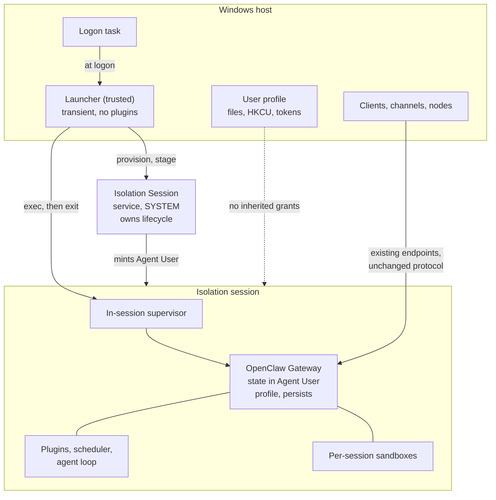

# Proposal: Gateway Containment and Windows Isolation Sessions

## Summary

We contain the work an agent does, but not the process that decides to do it. On
Windows the Gateway runs as the signed-in user, so every plugin, credential, and
model-directed decision carries that user's full reach over their files,
registry, and tokens.

This proposes containing the Gateway itself — and, importantly, doing it from
*outside* the Gateway. A small trusted launcher provisions an OS-managed
boundary and starts the Gateway inside it. The Gateway needs no containment code
of its own; it simply never runs anywhere else.

Windows Isolation Sessions are the first provider: the OS mints a dedicated
**Agent User** account and runs the Gateway in a session bound to it. The
account is provisioned and deprovisioned explicitly, so we keep it between runs
and agent memory and state persist across reboots. That provider is
preview-quality today, so this asks for the contract and the direction, plus a
readiness bar to clear before anyone recommends it.

## Motivation

### The Gateway is our biggest uncontained surface

We already have containment seams, and they're all narrower than the Gateway.
`SandboxBackend` (`src/agents/sandbox/`, with Docker and SSH backends) is
per-session and scoped to a workspace. It contains the commands an agent runs,
and it does real work: a sandboxed tool call that tries to read your SSH keys or
write a startup entry doesn't reach them.

What it doesn't contain is the process that loads plugins, holds channel and
provider credentials, runs the scheduler, and picks the commands in the first
place.

That's backwards, and it leaves the full blast radius reachable by three
distinct routes. A tool call that isn't sandboxed — because the session didn't
select a backend, or the operation doesn't route through one — runs with your
identity. A container escape puts the attacker back on the host as you. And the
Gateway process is never sandboxed at all, so anything the agent loop, a plugin,
or the scheduler does directly skips the boundary rather than escaping it.

Down any of those routes, on a Windows workstation, the blast radius of a prompt
injection or a hostile skill is your whole profile: documents, browser and
credential stores, `HKCU`, startup entries, SSH keys. Tool sandboxing narrows
the first route and does nothing about the third, which is the one this RFC is
about.

ACLs don't help here. They don't separate code running as you from data owned by
you — that's exactly the grant they encode. Neither does a different working
directory or a restricted shell. Any control the Gateway can decline to apply is
a policy, not a boundary, and agent software is the one category where the
process can be talked into changing its mind.

### A compromised Gateway can't contain itself

This constrains the design more than anything else here.

If the Gateway is what we're treating as compromised, it can't also be what
decides whether to be contained. A containment check inside the Gateway is code
the attacker already controls — patch it, configure it away, or just never reach
it. By the time it would run, untrusted code is already executing with the
identity the check was supposed to remove. Plugins are no better, since they
load into the process being contained.

So the boundary has to exist *before* the Gateway does, established by something
outside it. That something is a launcher: a separate, minimal executable that
runs as the user, provisions the boundary, and starts the Gateway inside. The
Gateway then has no uncontained mode to reach — not because it declines one, but
because it's never started outside the boundary at all. It needs no containment
code and no containment config.

That also sets the bar for the launcher. It's the part of the trusted computing
base we actually own, so it stays small, loads no plugins, and never runs
agent-directed work.

### Today's Windows options are all bad trades

| Option | Trade |
|---|---|
| Run as the user (default) | Full reach, full blast radius |
| WSL (today's recommendation, per [#58](https://github.com/openclaw/rfcs/pull/58)) | Real boundary, but a second OS with its own filesystem, packages, credentials, and update cadence |
| VM or Windows Sandbox | Stronger boundary, but continuous resource cost and a lifecycle built for disposable sessions, not an always-on daemon |

None works as a default. The first isn't contained; the others are heavy enough
that nobody runs them for a background process.

### The OS now offers something better shaped

Windows is exposing containment built around a distinct *identity* rather than a
whole guest OS. Per the public
[`microsoft/mxc`](https://github.com/microsoft/mxc) project, its
`isolation_session` backend asks a Windows service to mint an **Agent User** —
an account with an opaque OS-assigned name — start a session bound to it, and
run processes inside. Both the account and the session are explicitly
provisioned and explicitly removed; neither is torn down implicitly.

[MXC states the
requirements](https://github.com/microsoft/mxc/blob/0aaa2afa6588d4aee34b35efb290308bb6f84fa1/docs/isolation-session/oneshot.md)
plainly: "OS-isolated identity so the workload's actions cannot pollute the
calling user's NTFS / registry / token state", with an OS-managed session
lifecycle.

The unit is a session and an account, not a guest OS — no guest memory footprint
or boot time. Provisioning isn't free, which is exactly why MXC's state-aware
lifecycle exists: one session hosts many executions "without re-paying the
provisioning / session-start cost each time." For a daemon that starts once and
stays up, that's the right shape.

### How this fits with work already in flight

- [**#58 (MSIX packaging)**](https://github.com/openclaw/rfcs/pull/58) lists
  "Defining runtime isolation" as a non-goal and says a separate RFC may define
  a session-based runtime model. This is that RFC. #58 also already describes
  the launcher we need — see below.
- [**#42026 (control plane / per-agent
  runtimes)**](https://github.com/openclaw/openclaw/issues/42026) splits the
  gateway so each agent runs in its own container or process, giving "true
  secret isolation" between agents. Different axis. It partitions *which
  component holds which secrets*; this changes *what principal a component runs
  as*. Fully decomposed on Windows, every runtime still runs as you. Both are
  worth having, so the contract below targets a *unit of containment* rather
  than a monolithic Gateway.
- [**#55 (OpenShell worker
  provider)**](https://github.com/openclaw/rfcs/pull/55) overlaps most and
  deserves care: it also runs the long-lived Gateway inside a sandbox, and goes
  further by brokering model credentials through `inference.local` so neither
  Gateway nor worker holds provider credential values. That directly fixes the
  residual risk this RFC can't — a contained Gateway still holds its own
  secrets. The difference is deployment context. #55's Gateway sandbox is
  *operator-created* on a container platform, which suits cloud and server
  deployments; it doesn't help a personal Windows machine where there is no
  operator and no OpenShell. The two are complementary: #55 is the better answer
  wherever it's available, and its credential brokering is the direction this
  RFC should follow rather than compete with.
- [**RFC 0027 (OpenClaw Enterprise)**](0027-openclaw-enterprise.md), accepted,
  already defines a `SandboxDriver` whose invariants are close to the ones
  below: the platform verifies the selected driver "supports the complete
  policy" and rejects deployment when enforcement is "unsupported, unavailable,
  or ambiguous"; the driver "establishes and verifies containment before the
  Harness starts"; and "an implementation that cannot verify enforcement is
  ineligible for the operation", with no substitution of an alternate. That's
  capability honesty, boundary-before-start, and fail-closed — so treat what
  follows as applying an accepted pattern in a new place rather than inventing
  one. Two differences matter: 0027 assumes a control plane a personal machine
  doesn't have, and its driver explicitly "does not manage the Namespace's
  OpenClaw gateway". Even in the accepted enterprise design, the Gateway is the
  piece left outside the boundary — which is the gap this RFC closes.

## Goals

- Establish the boundary in a launcher outside the Gateway, so a compromised
  Gateway has no uncontained mode to reach.
- Add no containment code, config, or runtime branch to the Gateway, and no
  protocol change. This is *not* a claim that the Gateway is unaffected — a new
  principal means a different profile, registry hive, and credential store, and
  what that breaks is tracked below.
- Define a platform-agnostic `ContainmentProvider` contract so this isn't a
  Windows fork of the startup path.
- Make each provider's limits explicit and machine-readable, so one that can't
  enforce something says so instead of implying it.
- Fail closed, loudly, when a selected provider isn't available.
- Leave existing uncontained deployments alone, with a real migration and
  rollback path for anyone opting in.
- Define the readiness bar to clear before recommending — later, defaulting —
  contained execution.

## Non-Goals

- **Packaging and distribution.** That's
  [#58](https://github.com/openclaw/rfcs/pull/58). This RFC doesn't depend on
  MSIX; it needs *a* launcher, and #58 proposes one for Windows. #58 is itself
  an open draft, so this RFC depends on a proposal rather than on shipped code.
- **Containing what the Gateway can command.** Authorized desktop nodes and
  other action fulfillers sit outside this boundary and need their own
  containment story. Out of scope here.
- **Replacing per-session sandboxes.** `SandboxBackend` contains a session's
  work; this contains the process running it. They nest.
- **Competing with [#55](https://github.com/openclaw/rfcs/pull/55).** Where an
  operator-managed container platform is available, #55 is the better answer and
  its credential brokering is stronger. This targets machines where that isn't
  an option.
- **Deciding how the Gateway is decomposed.** That's
  [#42026](https://github.com/openclaw/openclaw/issues/42026).
- **Specifying the Windows API.** Owned by Windows; consumed, not defined, here.
- **Making containment the default,** or requiring it, now.
- **Changing auth, pairing, discovery, or the wire protocol.**

## Proposal

### Where things run

Three parts, and which side of the boundary each lands on is the whole point.

**The launcher runs outside, as the user.** It's the entry point. It selects a
provider, provisions the boundary, stages the payload, starts the unit inside,
reports posture, and exits. It's the part of the trusted computing base we own,
so it stays minimal, loads no plugins, and never executes agent-directed work.

On Windows this is #58's host app, not a new component. #58 defines it as "the
packaged entry point" behind an `openclaw.exe` execution alias, whose job is
"package activation, payload verification and staging, and launching or stopping
the packaged Gateway", and which explicitly "does not proxy Gateway traffic,
distribute Gateway credentials, or approve clients, nodes, or channel users."
This RFC adds one responsibility: establish the boundary first.

**The unit of containment runs inside.** Today that's the Gateway, along with
the agent loop, plugins, scheduler, and its working state. If
[#42026](https://github.com/openclaw/openclaw/issues/42026) lands, the unit is
whichever process holds the credentials and runs the agent loop — likely each
runtime, and possibly the control plane too, since it keeps channels, routing,
and cron. The provider contract below still applies, but which unit to contain,
and how many, becomes a live question rather than a given.

**The protocol surface is untouched, but the environment isn't.** Clients,
channels, and nodes reach the Gateway through existing endpoints, and the
Gateway still owns its own config, credentials, and pairing records — the
launcher provisions an environment, it doesn't broker credentials.

What does change is everything a process inherits from its principal: profile
path, registry hive, and credential store. Two consequences we should not gloss
over. Migration has to move or re-establish that state (see
[Rollout](#rollout)). And per-session sandbox backends assume things about their
environment — the Docker backend needs to reach a daemon, the SSH backend needs
keys and known hosts — none of which is guaranteed for the Agent User. Whether
those keep working under containment is an implementation question phase 2 has
to answer, and if the answer is no for some backend, that is a real capability
loss rather than a detail.

### The `ContainmentProvider` contract

The launcher implements and consumes this. A provider answers two questions:
what boundary can this host actually give me, and how do I start and stop
something inside it.

**Capabilities.** A provider declares its boundary honestly, because an
overstated boundary is worse than none. These are enumerated values, not free
text, so the launcher can compare two providers and refuse a weaker one:

| Capability | Values |
|---|---|
| `identityIsolation` | `none` (same principal), `shared` (one distinct principal), `perInstance` (fresh principal per environment) |
| `statePersistence` | `none`, `acrossRuns` (survives restart, dies on teardown), `external` (provider keeps no state) |
| `hostPathProjection` | `none`, `explicitPaths` |
| `stagingChannel` | `none`, or a directory with a declared lifetime (`ephemeral`, `durable`) and visibility (`callerSeesAll`, `mutual`) |
| `networkPosture` | `unrestricted`, `egressFiltered`, `isolated` |
| `hostUiReach` | `full`, `none` |
| `lifecycleOwner` | `os` (teardown guaranteed), `caller` (we must drive it) |
| `sessionLifetime` | `perCall` (environment dies with the calling process), `persistent` (survives until explicitly stopped) |

`hostPathProjection` and `stagingChannel` are deliberately separate. Being able
to hand a file across is not the same as giving an agent the user's working
tree, and merging them is how someone ends up believing they have the second.

The descriptor is versioned. The launcher refuses a version it doesn't
understand rather than treating absent fields as "unsupported" — an unrecognised
capability must never quietly become a claim about the boundary.

**Lifecycle.** The middle phases mirror the provider's own rather than inventing
new ones; `probe` is the launcher's own step, not something the provider
defines:

```
probe -> provision -> start -> exec -> stop -> deprovision
```

`probe` reports availability and capabilities with no side effects. `exec` is
what actually launches the Gateway inside the environment; the earlier phases
only build the place it runs.

**The launcher is transient.** It runs, provisions or rehydrates the
environment, `exec`s, confirms the Gateway came up, and exits. It is not a
resident supervisor, and containment does not add a second always-on process.

That works because of two things. The session outlives the launcher — it is
stopped explicitly, not when the calling process goes away — so the environment
is still there next time. And while the provider's own `exec` call is
synchronous, the workload can detach *inside* the boundary: the script the
launcher execs starts the Gateway as a detached child and returns, so the
Gateway outlives the call that created it. Nothing about the provider prevents a
long-lived daemon; the detachment just happens on the inside rather than being
handed out by the API.

Supervision lives inside the boundary too — a small in-session launcher script
owns the Gateway process, records its PID and status, and captures its exit —
which keeps the host-side launcher out of the steady-state picture entirely.

**So what starts it?** Not a resident process. On Windows the packaged flow
registers a scheduled task at logon that re-runs the launcher, which rehydrates
the existing session and starts the Gateway if it isn't already up. That's what
makes the Gateway survive logoff and reboot, and it keeps each launcher
invocation short-lived. Health and status are observational: a later invocation
reads the status file and probes the port rather than holding a live handle.

**Idempotency is per-operation, not universal.** The provider's phases behave
differently on repeat, and a launcher that assumes otherwise leaks accounts:

| Operation | On repeat | What the launcher must do |
|---|---|---|
| `provision` | **Not idempotent** — mints a fresh identity every call | Write a durable record *before* calling, so a retry after a lost response doesn't blindly provision again |
| `start` / `stop` | Provider-dependent failure on repeat | Track state; don't retry blindly |
| `exec` | Runs the command again, no deduplication | Guard with the launcher's own supervision state |
| `deprovision` | Returns "stale" once the identity is gone | Treat stale as success |

Only `deprovision` is destructive, but only `deprovision` is safely repeatable,
which is the opposite of the convenient case. `provision` returns an opaque
identifier the launcher persists and uses to address the environment later.

One failure the launcher genuinely cannot fix on its own: if it dies *during*
provisioning, the identity may exist while the identifier needed to address it
does not. That environment is unreachable through the normal contract, and the
provider treats cleaning it up as an out-of-band operator task. So a write-ahead
record narrows the window but doesn't close it, and shipping this needs an
out-of-band reclamation path for environments no launcher can name. That belongs
in the readiness bar, and it is one of the costs of the provider being
preview-quality.

Because the environment survives until something explicitly deprovisions it —
which is what we want — the launcher has to reconcile against what already
exists rather than assume a clean slate. Every invocation rehydrates persisted
state and adopts the running environment instead of provisioning a second one.
That's the same mechanism that makes the transient-launcher model work, so it
isn't extra machinery; it just has to be right.

**Failure outcomes** are a closed set, so the launcher can act without parsing
provider text:

| Outcome | Meaning | Behavior |
|---|---|---|
| `unavailable` | Provider can't run here — absent, gated off, unsupported build | Fail closed, unless a fallback provider of equal or greater strength is configured |
| `policy_rejected` | Config was supplied that this provider can't enforce | Fail closed, always |
| `stale` | Referenced environment is gone | Re-provision if starting, else surface |
| `lifecycle_failed` | Operational failure | Retry per policy, then fail closed |

Fallback never means "run uncontained." It means "try the next provider that
still satisfies the requested capabilities." A deployment that wants uncontained
execution turns containment off, which is a visible configuration change rather
than a silent runtime degradation.

`policy_rejected` never falls back at all, even to a stronger provider. Asking
for a boundary that can't be delivered is a config error, not an availability
problem.

**Where the configuration lives.** With the launcher, not in `openclaw.json`.
Provider selection, the requested capabilities, and the fallback policy are read
by the launcher before the Gateway exists, so putting them in Gateway config
would mean the contained process owned the settings governing its own
containment — the same inversion the Motivation rejects. It also keeps the
promise that OpenClaw core gains no containment surface: no new config keys, no
new schema, nothing for a deployment to set in the wrong place. The Gateway
never reads or writes these values, and can't.

### The Windows provider

`provision` mints the Agent User, `start` boots a session bound to it, `exec`
runs the Gateway, `stop` ends the session, and `deprovision` removes the
account. Each Agent User is distinct with no shared registration, so concurrent
units are independent.

In normal operation only `start`/`exec`/`stop` recur. `provision` happens once
at setup and `deprovision` only when the deployment is being decommissioned or
deliberately reset — which is what lets Gateway state persist across runs.



**Figure 1.** A logon task runs the launcher, which establishes the boundary,
`exec`s a supervisor inside it, and exits. The session and the Gateway outlive
it; the Gateway never runs outside the boundary.

This is an **identity** boundary and the descriptor has to say so. Per [MXC's
backend
docs](https://github.com/microsoft/mxc/blob/0aaa2afa6588d4aee34b35efb290308bb6f84fa1/docs/isolation-session/state-aware-rust.md),
the network is unrestricted — a process inside can listen on a port reachable
over localhost — so `networkPosture` is `unrestricted`. There's no
UI-restriction primitive either, though contained code can't reach the host's
desktop or clipboard.

Host paths are the interesting part, and they drive much of the design.
Arbitrary path projection is rejected outright — you can't map in the user's
documents folder. What exists instead is one OS-created directory per sandbox,
documented as "a directory shared between the calling user and this isolated
agent user, through which the caller can stage files into the session", with
three properties that matter:

- **Asymmetric.** Each Agent User sees only its own; the caller sees every
  concurrent sandbox's. The caller is the privileged side.
- **Ephemeral.** Created at provision, deleted at deprovision — so it tracks the
  Agent User's lifetime, not each run. Still a channel, not storage: the
  Gateway's durable state belongs in the profile, not here.
- **Not the working directory.** It doesn't change where the workload runs.

Provisioning also takes an optional application identifier — documented as "the
Package Family Name for a packaged app", which MXC "neither interprets nor
verifies" and which nothing consumes yet. It is carried verbatim so "a future OS
contract acting on the calling application's identity needs no breaking change."
Today that is inert forward-compatibility metadata, not an enforced link. Worth
noting because it is where package identity from
[#58](https://github.com/openclaw/rfcs/pull/58) would plug in if that OS
contract ever lands — but this RFC should not claim a mechanical link that does
not exist yet.

**These facts are pinned deliberately.** Every claim here is cited against
`microsoft/mxc` commit
[`0aaa2af`](https://github.com/microsoft/mxc/commit/0aaa2afa6588d4aee34b35efb290308bb6f84fa1),
verified 2026-08-18. This is not pedantry: an earlier draft of this RFC
described an optional caller-supplied identity bundle that the backend accepted
at provision. That surface was removed upstream within about a week, and the
current docs state that `appId` is the only caller knob beyond the network
acknowledgment. Anything preview-gated should be re-verified, not trusted from
memory.

Availability: the backend is experimental, gated behind both an explicit flag
and an OS feature flag, and needs a recent [Insider
build](https://learn.microsoft.com/en-us/windows-insider/release-notes/experimental/preview-build-26300-8553).

### State lives in the Agent User profile

The provider supports provisioning an Agent User per run, but this design
deliberately doesn't. Deprovisioning is an explicit act, and the account
survives everything short of it, so the shape we want is **provision once, keep
it**. The Gateway's configuration, credentials, pairing records, conversation
history, and memory live in that account's profile and persist across runs and
reboots. There's no host-side shadow copy of Gateway state, and no need for one.

That's a better outcome than it first appears. Durable state stays *inside* the
boundary rather than parked on the host where the user's own token could reach
it, so containment isn't just relocating the credentials it was supposed to
protect. The staging channel goes back to being what its name says — a way to
hand payload in at setup — rather than a data plane the Gateway depends on at
runtime.

One consequence to design for: **deprovision destroys the agent's memory along
with the environment**, so wiping a possibly compromised Agent User and losing
its accumulated history are the same operation. The fix is straightforward — the
launcher exposes backup and restore through the staging directory, so state can
be exported before a reset and reinstated after — but it has to exist before
deprovision can be recommended as remediation.

**Don't run the Gateway from the staging directory.** It's ephemeral,
caller-writable, and explicitly not the working directory. Stage through it,
then materialize into the profile.

**Host reach drops to a staging channel.** No desktop, and no user working tree.
"Fix a file in my repo" isn't expressible unless something explicitly stages
that content across — a product decision about mediated access, not a
transparent capability. See [Unresolved questions](#unresolved-questions).

### Bypass resistance

Containment you can skip by accident is a default, not a boundary. Two paths
need closing:

- **A second entry point.** If a source checkout, stale shortcut, or copied
  binary still starts a Gateway directly, the boundary is optional in practice.
- **`openclaw gateway`.** It starts a Gateway by design.
  [#58](https://github.com/openclaw/rfcs/pull/58) already makes this a release
  requirement for its own payload activation — that host operations and native
  `openclaw gateway` commands "cannot create conflicting managed Gateway
  instances or bypass staged-payload activation" — and the same applies here.

Since the Gateway can't be trusted to refuse to start, this can't be a check
inside it. It comes from deployment shape: the managed install exposes the
launcher as its entry point, and a Gateway started some other way is a
*different, unmanaged install* rather than a containment failure of the managed
one. Making that difference observable is part of the readiness bar.

### Readiness bar

Recommend contained execution for a deployment class only once:

- The capability descriptor is accurate and the launcher refuses what a provider
  can't enforce.
- Gateway state survives restart and reboot in the Agent User profile.
- The launcher can back up and restore that state through the staging directory,
  so remediation and rollback don't mean losing the agent's memory.
- Anything the host reads back from the staging channel is treated as untrusted
  input, with the parsing boundary identified and tested.
- Clients, channels, and nodes connect with no protocol change and no extra user
  step.
- Ordinary CLI use doesn't pay provisioning cost per command.
- Repeat invocations adopt the existing environment rather than provisioning a
  second one, and there's an out-of-band path for environments no launcher can
  address.
- The Gateway survives the launcher exiting, and comes back after logoff,
  reboot, and its own crash.
- The Docker and SSH sandbox backends either work under containment or their
  loss is a documented, accepted tradeoff.
- Downgrade below the containment-capable launcher is prevented by packaging.
- Posture is reported by the launcher, fallback is loud, and a managed install
  is distinguishable from one started outside it.
- The platform primitive is generally available and its owner is willing to call
  it a security boundary. The [`microsoft/mxc`
  README](https://github.com/microsoft/mxc/blob/0aaa2afa6588d4aee34b35efb290308bb6f84fa1/README.md)
  currently says the opposite about its preview backends, which alone blocks
  claiming this as a defense.

Until then it ships experimental and opt-in.

### Security properties

The invariants a correct implementation has to hold, stated so they can be
checked rather than assumed:

- The boundary exists before any Gateway code runs; there is no window in which
  the Gateway executes uncontained and is contained afterwards.
- The Gateway holds no containment code, configuration, or decision. Nothing it
  can do to itself removes the boundary.
- A provider that cannot enforce a requested capability refuses, rather than
  accepting it and enforcing something weaker.
- No failure path silently produces uncontained execution. Fallback selects
  another provider satisfying the same capabilities, or the start fails.
- The contained unit runs as a principal that never held the user's grants,
  rather than as the user with restrictions applied.
- Containment posture is asserted by the launcher. A statement from the Gateway
  about its own containment is not evidence.
- Data crossing the boundary is one-directional in trust: anything the host
  reads back from the staging channel is untrusted input.

## Threat model

The threat is a Gateway induced to act against you: prompt injection reaching
the agent loop, a hostile plugin or skill, a compromised dependency. Assume
arbitrary code execution inside the Gateway. Out of scope: an attacker who
already has your credentials, local admin, or kernel access, and a malicious
OpenClaw build.

The right comparison throughout is **against an uncontained Gateway today**, not
against a perfect sandbox. Several things below survive containment, and it
matters a great deal whether they survive *worse*, *the same*, or *newly*.

### What containment removes

The attacker no longer runs as you. Your profile, `HKCU`, browser and credential
stores, SSH keys, and per-user startup entries are refused by the OS rather than
by our own policy. It can't drive your desktop directly — no screen capture off
your session, no synthetic input into your other apps. What it writes lands in
the Agent User's profile, not yours.

It also devalues a tool-sandbox escape. Today, breaking out of a per-session
sandbox lands the attacker on the host as you. With the Gateway contained, the
same escape lands them in the Agent User — still bad, but bounded by the same
boundary as the Gateway itself. The two seams genuinely compose rather than
overlapping.

That is the whole claim. It is narrower than "the Gateway is sandboxed."

### What is unchanged from today

These survive containment, but a contained Gateway is **no worse than the
uncontained one you're running now**. They are not regressions, and none of them
is an argument against adopting containment — they're an argument against
overselling it.

- **Anything readable by `Users`, `Authenticated Users`, or `Everyone`.** The
  contained account is a normal Windows account, so machine-wide files, `HKLM`,
  and world-readable content stay reachable. Containment removes *your* grants,
  not the machine's public surface.
- **Local IPC and host services.** Named pipes, RPC/COM, ALPC, shared memory,
  and anything on loopback. Services that trust a caller by origin rather than
  by credential — dev servers, local databases, other Gateways, local MCP
  servers — remain reachable. This is why containment must never be described as
  a network control.
- **Outbound egress,** which is unrestricted.
- **Resource exhaustion** of host CPU, disk, and memory.
- **Persistence — relocated, not removed.** Because the Agent User is meant to
  be kept between runs, an attacker who establishes persistence in that profile
  keeps it across restarts and reboots, exactly as they would today. The
  difference is *where* it lands: uncontained it goes in your profile, your
  `HKCU`, and your startup; contained it is confined to the Agent User. Better
  scoped and cleanly removable — but note the removal is `deprovision`, which
  also destroys the agent's memory, so treat it as a real remediation cost
  rather than a free reset.
- **Anything a compromised Gateway can order someone else to do.** Most
  concretely an authorized desktop node (see [RFC
  0025](0025-default-pluggable-computer-use.md)): the Gateway doesn't need
  desktop access if it can command a node that has it. Containing the Gateway
  does not contain what the Gateway is allowed to drive. Nodes need their own
  containment story; that's out of scope here, and this RFC should not be read
  as claiming model-directed action is fully contained.
- **You.** A contained agent can still talk you into running something yourself.

### What containment shifts or newly introduces

This is the list that deserves scrutiny, because these are the costs rather than
the leftovers.

- **The Gateway's own credentials stay with it.** Provider keys, channel
  credentials, and pairing records live inside the Agent User profile by
  construction. Containment limits reach into your assets; it does nothing to
  stop code running as the Gateway from exfiltrating what the Gateway
  legitimately holds. Fixing that needs credential brokering, not containment —
  see [#55](https://github.com/openclaw/rfcs/pull/55), which does exactly that.
  Keeping state inside the boundary at least avoids the worse alternative of
  parking those credentials on the host where your own token could reach them.
- **The staging channel, in both directions.** Contained code writes into a
  directory a host-side process running as you later reads, so anything the host
  parses from it is untrusted input. This is a genuinely new boundary-crossing
  surface and the likeliest place for a bug. Keeping it to setup-time staging,
  rather than a runtime data plane, keeps that surface small.
- **A long-lived account holding accumulated secrets.** Persisting across runs
  is the point, but the Agent User profile accrues credentials, history, and
  memory over months, and it isn't covered by the user's own backup. The
  launcher's backup and restore path covers that; the residual question is who
  else can read the backup once it's outside the boundary.
- **The launcher,** which runs as you and can provision, start, stop, and stage
  into the boundary. It's short-lived, so it isn't a standing target the way a
  resident daemon would be — but its binary and its registered entry point are,
  since replacing either means owning every subsequent start.
- **The autostart registration.** Something has to start the Gateway at logon,
  and whatever holds that registration can change what gets started. On Windows
  that's a scheduled task, which is a well-understood thing to protect but is
  now part of the design rather than an incidental detail.

### The trusted computing base

Bigger than the launcher, and worth naming honestly:

| Component | Why it's trusted |
|---|---|
| Launcher and its provider implementation | Establishes the boundary and stages into it |
| Its binary and autostart registration | Replacing either owns every subsequent start |
| The provider SDK and native bindings | Everything reaches the OS through them |
| The SYSTEM-hosted OS session service | Owns account and session lifecycle |
| Windows kernel and session separation | The enforcement itself |
| Staging channel parser | Cross-boundary data path |
| Package integrity and signing | Protects the above |

Two consequences. "The provider declares its capabilities honestly" is a
contract, not a security mechanism — providers must be trusted built-ins or
independently verified, not arbitrary third-party code. And **posture reported
by the Gateway is not evidence**: a compromised Gateway can claim to be
contained, so anything that must be trustworthy has to observe from outside.

Finally, the platform's own documentation declines to call these profiles
security boundaries today, and session separation does not by itself stop a
kernel-level escape. Contained execution is defense in depth and a direction of
travel, not a control to rely on.

## Rollout

**Nothing changes by default.** Containment is opt-in and off. Deployments that
don't configure a provider behave exactly as they do now, everywhere.

**Turning it on is a one-time migration.** The Gateway moves to the Agent User,
so state under your profile isn't automatically visible to it. Adoption stages
config, credentials, and pairing records across into the Agent User profile
once, and says clearly when it can't — a migration that silently produces an
empty Gateway looks identical to a working one until the first channel fails to
authenticate. After that the Agent User profile is the Gateway's home and
nothing needs re-staging on subsequent runs.

Credentials protected by the old account's DPAPI keys won't decrypt under the
new principal, so migration means re-establishing those secrets rather than
copying ciphertext. Anything that can't be re-established without user action
has to say so rather than failing at runtime.

**Rollback is routine, not recovery.** Turning containment off returns to the
previous behavior without data loss, which means adoption must never destroy
pre-migration state while moving it — and it's why the launcher's backup and
restore path matters: state has to come *out* of the Agent User profile before
deprovisioning, which destroys it irreversibly.

**Downgrade is a real gap, not a requirement we can write our way out of.** A
launcher version predating this contract ignores the containment config and
starts uncontained — the silent posture change this RFC argues against. We can't
retroactively teach an older build to reject config it has never heard of, so
this has to be handled outside the config: a minimum launcher version enforced
by the deployment, or an install that refuses to downgrade below the version
that introduced containment. Whichever, it belongs to whoever owns packaging,
and the readiness bar depends on it existing.

**Phases.** None of the first three require the preview OS dependency to begin.

1. **Contract only.** Provider interface, versioned descriptor, failure
   taxonomy, selection, fail-closed, posture reporting — in the launcher, with a
   null provider. No change to OpenClaw core. Proof: tests through the real
   interface for selection, refusal, and reporting.
2. **Windows provider, experimental.** Implement the lifecycle against the OS
   primitive with an honest descriptor. Proof: a Gateway that starts contained,
   is reachable from a client, and runs under an account that demonstrably isn't
   the signed-in user; plus a host without the capability failing closed with a
   reason.
3. **State, migration, and backup.** One-time migration into the Agent User
   profile, backup and restore through the staging directory, and tested
   restart, reboot, upgrade, and downgrade.
4. **Bypass resistance.** Make the launcher the managed entry point and make an
   unmanaged Gateway distinguishable. Proof: an admin-observable signal that
   doesn't involve asking the Gateway.
5. **Readiness review.** Maintainer decision against the bar.

Phases 1–2 belong to whoever owns the launcher — on Windows, the
[#58](https://github.com/openclaw/rfcs/pull/58) work. Phase 4 builds on #58's
entry-point work rather than duplicating it.

## Decision requested

**Is launcher-established, opt-in Gateway containment a direction we want to
support, given that the first provider offers identity isolation only and is
preview-gated?**

A yes authorizes phase 1: the contract, in the launcher, no provider, no default
change — and no change to OpenClaw core, since the Gateway gains no containment
code. It doesn't commit us to the Windows provider, a default posture, or a
timeline.

Be clear about what a yes accepts in principle, though, because these are
structural rather than incidental:

- **A launcher as the supported entry point.** Starting the Gateway goes through
  it, including at logon, so the deployment owns an entry point it didn't have
  before. The launcher is short-lived, so this isn't a resident process — but it
  is a new required step in front of the Gateway.
- **A larger trusted computing base,** including the provider SDK, a
  SYSTEM-hosted OS service, and package integrity.
- **A boundary that is identity-only.** It doesn't constrain the network, and it
  doesn't contain what the Gateway is authorized to command.

If those are unacceptable, it's better to say so now than after phase 1.

## Rationale

**Why contain the Gateway, not just the session.** Per-session sandboxes assume
the agent's *work* is untrusted. Prompt injection attacks its *judgment*. Once
that's the threat, the thing holding the credentials and choosing the actions
has to be inside a boundary too.

**Why the launcher, not a hook in the Gateway.** A seam in OpenClaw core would
be easier to ship and would sit where the rest of the runtime config lives. It's
wrong for one decisive reason: the Gateway is what the threat model treats as
compromised, so a decision it makes about its own containment is a decision the
attacker makes. A separate executable costs an entry-point contract and buys a
boundary that exists before any untrusted code runs. That OpenClaw core changes
not at all is a bonus — nothing to misconfigure, and no preview OS dependency in
the cross-platform build.

**Why a provider contract, not Windows-specific code.** The problem isn't
Windows-specific; only this primitive is. macOS and Linux have different
mechanisms with different capability profiles. An explicit descriptor lets those
arrive later and forces each to state its limits in a form we can act on.
Without it, the first implementation becomes the de facto contract and its
unstated assumptions get baked in.

**Why not just split the Gateway.**
[#42026](https://github.com/openclaw/openclaw/issues/42026) gives each agent its
own runtime and secrets — genuinely worth doing, and not a substitute. It
partitions between agents while every resulting process still runs as you.
Decomposition means a compromised agent can't reach another agent's secrets;
containment means it can't reach yours.

**Why not WSL.** It contains by moving the Gateway into a second OS, with its
own filesystem, packages, credentials, update cadence, and failure modes, and it
distances the Gateway from the environment you actually work in. An isolation
session keeps it on Windows and changes only the principal.

**Why not a VM or Windows Sandbox.** Stronger boundary, and right for some
deployments. Poor default for an always-on daemon: continuous resource cost,
noticeable startup, and a lifecycle built for disposable sessions. The
isolation-session cost profile is what makes contained execution plausible as an
eventual default rather than an expert mode.

**Why not AppContainer.** MXC's default Windows backend is AppContainer-based,
so this is a real option rather than a strawman — it's just the wrong shape for
a Gateway. AppContainer is a *restriction* model: it keeps your token and takes
access away, so every resource the workload needs has to be enumerated up front.
A Gateway that loads arbitrary plugins, spawns a Node runtime, and starts MCP
servers has an open-ended and unpredictable resource set, which is exactly the
case an allowlist handles worst. There's a deployment cost too: the tier
available on every current Windows release enforces filesystem policy through
host path ACEs, and standing that up needs a separate **elevated** host-prep
step that adds ACEs for AppContainer SIDs to the system-drive root. Those ACEs
are removable again by a matching unprepare step, so this isn't permanent damage
— but requiring an administrator to modify machine-wide ACLs before a per-user
agent can run is a poor fit for a personal machine. An isolation session gives a
separate principal with an ordinary account instead, so nothing has to be
enumerated and nothing machine-wide is touched.

**Why fail closed.** A control that silently degrades to no control produces the
worst outcome: someone who believes they're protected and isn't.

## Unresolved questions

### Blocking

- **How does a contained Gateway reach the user's files?** Arbitrary paths can't
  be projected; there's a staging directory. So the question isn't whether
  sharing is possible but what to do with a mediated channel: stage an
  explicitly selected working set in and results out, run a filesystem bridge
  over the existing protocol like the one already used for sandboxes, wait for
  an OS projection primitive, or accept that a contained Gateway works only on
  its own workspace. Each reopens the boundary differently, and the choice
  decides how useful this actually is.
- **How is exported state protected?** Backup and restore through the staging
  directory is the mechanism, but an export leaves the boundary carrying the
  Gateway's credentials and history. What protects it at rest, and what happens
  to the Agent User profile when the machine is reimaged?
- **Is an identity-only boundary worth adopting?** Nothing is enforced on the
  network and loopback survives. Do we require a network-capable provider before
  recommending this, or is reduced reach into user assets enough on its own?

### Non-blocking

- **Do Windows node capabilities survive?** Computer use, screen capture, and
  input injection (see [RFC 0025](0025-default-pluggable-computer-use.md)) need
  the user's desktop, which contained code can't reach. Does the node stay
  outside and connect in, and what does that do to the boundary's value?
- **Should the contained Gateway carry its own identity?** Giving the unit its
  own credentials rather than the Gateway holding provider keys would fix the
  biggest residual risk above. The provider exposed a caller-supplied identity
  bundle recently and no longer does, so there's nothing to build on today — but
  [#55](https://github.com/openclaw/rfcs/pull/55) already solves this with
  credential brokering, and that's the more promising direction regardless of
  what the OS offers.
- **Can the Gateway start without a logon?** A logon task covers the normal
  case, but a Gateway expected to be reachable on a machine nobody has signed
  into needs something else, and registering that something generally needs
  elevation. Whether headless operation is in scope is a product question.
- **How do we express a posture most hosts can't support** without fragmenting
  the Windows experience?
- **Should this contract live here or in
  [#58](https://github.com/openclaw/rfcs/pull/58)?** It belongs to a launcher
  #58 already owns. Separate keeps it platform-neutral; folded in keeps the host
app's responsibilities in one document. Pick one rather than letting both
describe the launcher.
- **What would let us call this a security boundary?** The platform won't make
  that claim for preview profiles. We should say in advance what evidence we'd
  need before describing this as a defense to users.
- **Is `0032` the right number?** It was the lowest unclaimed integer, but
  several open proposals currently share numbers, so allocation clearly isn't
  sequential. A maintainer should confirm or reassign.
