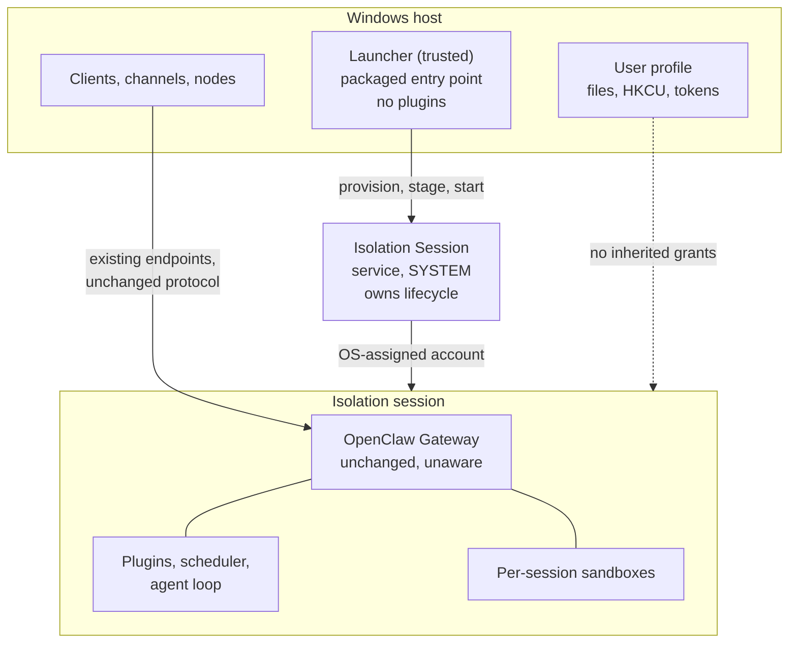

# Proposal: Gateway Containment and Windows Isolation Sessions

## Summary

OpenClaw contains the work an agent does, but not the process that decides to do
it. On Windows the Gateway runs as the signed-in user and inherits that user's
full filesystem, registry, and token reach, so every credential, plugin, and
model-directed decision executes with the operator's identity. This RFC argues
that the Gateway process itself should be contained, and that the component
which establishes that containment must sit outside it. It proposes a small,
trusted **launcher** that owns a platform-agnostic `ContainmentProvider` seam:
the launcher probes the host, provisions an OS-managed boundary, stages the
payload, and starts the Gateway inside — so the Gateway never runs uncontained
and is never asked to contain itself. Windows Isolation Sessions are proposed as
the first provider: the operating system provisions a fresh, OS-assigned agent
account, runs the Gateway in a dedicated session bound to that account, and
tears the session and account down when the owning process exits. The Gateway
itself is unchanged and unaware. The seam is written against a *unit of
containment* rather than a monolithic Gateway, so it survives a future split of
the Gateway into a control plane and per-agent runtimes. The seam and the
argument are the proposal; the Windows provider is currently preview-quality, so
this RFC defines the readiness bar that adoption must clear rather than asking
for immediate default adoption.

## Motivation

### The Gateway is the largest uncontained surface

OpenClaw already has containment seams, and they are all narrower than the
Gateway. `SandboxBackend` (`src/agents/sandbox/`, with Docker and SSH backends)
is created per session and scoped to a session key and workspace directory. It
contains the commands an agent runs. It does not contain the process that loads
plugins, holds channel and provider credentials, runs the scheduler, accepts
node connections, and decides which commands to run in the first place.

That leaves a straightforward asymmetry. A tool call can be confined to a
container, while the component that chose the tool call, holds the tokens that
authorize it, and can rewrite its own configuration runs with the operator's
full identity. On a Windows workstation the practical blast radius of a
prompt-injection, a hostile skill, or a compromised plugin is therefore the
user's entire profile: documents, browser and credential stores, `HKCU`, startup
entries, SSH keys, and any resource that authenticates the user by token rather
than by password.

### ACLs are not a boundary against your own code

The usual mitigations do not close this. File and registry ACLs do not separate
code running as the user from data owned by the user, because that is exactly
the grant they encode. Neither does running the Gateway as a service, or in a
different working directory, or under a restricted shell. Any control that
depends on the Gateway voluntarily declining access is a policy, not a boundary,
and agent software is precisely the category where the process can be talked
into changing its mind.

The only durable fix is an identity the operating system enforces: run the
Gateway as a principal that is not the user and never had the user's grants.

### Existing options force an unattractive trade

Windows deployments today choose between reach and containment:

- **Run natively as the user.** Full reach, full blast radius. This is the
  default and it is what most users run.
- **Run in WSL.** The current recommended local-Gateway path on Windows. It
  provides a real boundary, but it is a second operating system with its own
  filesystem, package management, credential storage, update cadence, and
  support burden, and it moves the Gateway away from the Windows environment the
  user actually works in.
- **Run in a VM or Windows Sandbox.** A stronger boundary at a much higher
  resource and lifecycle cost, and an awkward fit for a long-lived daemon that
  is expected to be running whenever the user is.

None of these is a good default. The first is not contained, and the others are
heavy enough that most users will not adopt them for an always-on background
process.

### The operating system now offers a better-shaped primitive

Windows has begun exposing a containment primitive built around per-instance
identity rather than a whole guest OS. As documented publicly by the
[`microsoft/mxc`](https://github.com/microsoft/mxc) project, its
`isolation_session` containment backend calls a Windows service that provisions
a fresh agent user account with an opaque, OS-assigned name, starts a dedicated
session for it, hosts processes inside that session, and then stops the session
and deprovisions the account. MXC states the requirements this backend exists to
meet as "per-execution OS-isolated identity so the workload's actions cannot
pollute the calling user's NTFS / registry / token state", with an "OS-managed
session lifecycle that the OS-side service tears down cleanly when the calling
process exits."

That shape matters. The unit of containment is a session and an account, not a
guest operating system, so it avoids a guest's memory footprint and boot time,
and the boundary is an OS-enforced identity rather than a cooperative policy.
Provisioning and session start are not free — MXC's state-aware lifecycle exists
precisely so one provisioned session can host multiple executions "without
re-paying the provisioning / session-start cost each time" — but that is a cost
paid once for a daemon that then stays up. For a long-lived agent process, that
is the trade OpenClaw has been missing.

### A compromised Gateway cannot contain itself

This follows directly from the threat, and it constrains the design more than
anything else in this proposal.

If the Gateway is the component we are treating as potentially compromised, it
cannot also be the component that decides whether to be contained. A containment
check that runs inside the Gateway is code the attacker already controls: it can
be patched, configured away, exception-handled, or simply never reached, and by
the time it would run the untrusted code is already executing with the identity
the check was supposed to remove. The same applies to a plugin, since plugins
load into the process being contained.

So the boundary has to be established *before* the Gateway exists, by something
outside it. That something is a launcher: a separate, minimal executable that
runs as the user, provisions the boundary, and starts the Gateway inside it. The
Gateway then has no uncontained mode to fall back to, not because it declines to
use one, but because it is never started outside the boundary in the first
place. Correspondingly, the Gateway needs no containment code, no containment
configuration, and no awareness that it is contained.

This also sets the standard the launcher must meet. It is the trusted computing
base for this design, so it should stay small, load no plugins, execute no model
output, and do nothing on behalf of the agent. Its job is to establish the
boundary and get out of the way.

### This composes with neighbouring proposals rather than duplicating them

Two active proposals touch the same area, and neither makes this one redundant.

[RFC PR #58](https://github.com/openclaw/rfcs/pull/58) proposes MSIX packaging
for Windows and explicitly lists "Defining runtime isolation. A separate RFC may
define a session-based runtime model" among its non-goals. It also already
describes the component this proposal needs: a package-specific host app that is
"the packaged entry point", registered behind an `openclaw.exe` execution alias,
whose responsibilities are "package activation, payload verification and
staging, and launching or stopping the packaged Gateway", and which explicitly
"does not proxy Gateway traffic, distribute Gateway credentials, or approve
clients, nodes, or channel users".

That host app is the launcher this design requires. This RFC does not propose a
second one, and it does not depend on MSIX: it proposes that whatever launches
the Gateway on a platform also establish the containment boundary first, and it
defines the contract for doing that portably. Packaging gives the installation a
reviewable identity so an administrator can inventory, approve, update, and
remove it. Containment reduces what that installation can reach while it runs.
An approved, signed, inventoried Gateway holding the user's full token is still
an unbounded-blast-radius component. The two are also joined mechanically rather
than only thematically: the containment provider accepts the calling
application's package identity at provision time, specifically so a future OS
contract can act on it, which makes a stable package identity an input to
containment rather than a parallel concern.

[`openclaw/openclaw#42026`](https://github.com/openclaw/openclaw/issues/42026)
proposes splitting the gateway into a control plane and per-agent runtimes so
each agent can run in its own container, VM, or process, and argues for "true
secret isolation" in which one agent's credentials never coexist with another's.
That is a real reduction in blast radius, and it is a different axis from this
proposal. Decomposition partitions *which component holds which secrets*;
containment changes *what principal a component runs as*. A fully decomposed
deployment on Windows still runs every control plane and every runtime as the
signed-in user, so each piece keeps the same reach into that user's files,
registry, and tokens — the partition is horizontal, between agents, and does not
cross the user boundary. Conversely, containment without decomposition places
all agents behind one contained identity.

The two therefore compose, and the seam proposed here is deliberately written
against a *unit of containment* rather than against a monolithic Gateway. If
#42026 lands, the unit becomes the runtime, optionally the control plane, and
the contract below is unchanged.

## Goals

- Establish the containment boundary in a launcher outside the Gateway, so a
  compromised Gateway has no uncontained mode to reach and needs no containment
  code of its own.
- Define a platform-agnostic `ContainmentProvider` seam so containment is a
  deployment choice with a stable contract, not a Windows-specific fork of the
  startup path.
- Keep the Gateway unchanged and unaware, so containment adds no configuration,
  no runtime branch, and no protocol change inside it.
- Make the containment boundary and its limits explicit and machine-readable, so
  a provider that cannot enforce something says so instead of implying it.
- Establish Windows Isolation Sessions as the first provider, contributed behind
  the same seam as any future provider.
- Preserve the Gateway's existing contract across the boundary: endpoints,
  discovery, device authorization, pairing, node capability approval, and
  protocol behavior are unchanged by containment.
- Define explicit selection, fallback, and diagnostic behavior, including what
  happens when a requested provider is unavailable on the host.
- Keep the seam neutral about the unit of containment so it remains valid if the
  Gateway is later split into a control plane and per-agent runtimes.
- Preserve existing uncontained deployments unchanged, with a defined migration
  and rollback path for those that opt in.
- Define the readiness bar that a provider must clear before contained execution
  can be recommended, and later defaulted, for a class of deployment.

## Non-Goals

- **Defining the packaging or launch mechanism.** How a Gateway build is
  packaged, signed, distributed, and started on Windows belongs to [PR
  #58](https://github.com/openclaw/rfcs/pull/58) and its implementation. This
RFC describes the containment contract and deliberately does not specify the
process that establishes it.
- **Replacing per-session sandboxes.** `SandboxBackend` and the worker-provider
  direction in [PR #55](https://github.com/openclaw/rfcs/pull/55) contain a
  session's work. This RFC contains the Gateway. They compose; neither
  substitutes for the other.
- **Deciding how the Gateway is decomposed.** Whether the Gateway splits into a
  control plane and per-agent runtimes is
  [`openclaw/openclaw#42026`](https://github.com/openclaw/openclaw/issues/42026)
  to settle. This RFC defines a contract that applies to whatever the resulting
  deployable unit is.
- **Specifying the Windows API surface.** The OS API is owned by Windows and is
  consumed, not defined, here.
- **Requiring containment, or making it the default, in this RFC.** The Windows
  provider is preview-quality today. This RFC asks for the seam, the argument,
  and the readiness bar.
- **Changing authentication, pairing, discovery, or the wire protocol.** No new
  endpoint, credential type, or trust relationship is introduced.
- **Defining enterprise policy.** Which deployments must run contained is a
  policy question for the administrator and for OpenClaw's enterprise surface,
  not for this seam.

## Proposal

### What sits where

The design has three parts, and which side of the boundary each falls on is the
whole point.

**The launcher runs outside the boundary, as the user.** It is the entry point
the user or the OS invokes. It selects and drives a containment provider,
provisions the boundary, stages the payload, starts the unit of containment
inside it, and reports posture. It is the trusted computing base: it must stay
minimal, load no plugins, and never execute agent-directed work. On Windows it
is the packaged host app from [#58](https://github.com/openclaw/rfcs/pull/58)
rather than a new component.

**The unit of containment runs inside.** Today that is the Gateway. If
[#42026](https://github.com/openclaw/openclaw/issues/42026) splits it, the unit
becomes each per-agent runtime, and optionally the control plane, without
changing the contract below. Containment applies to that unit and everything it
hosts in-process: the agent loop, plugin code, the scheduler, and its own
working state. It is unchanged by this proposal and holds no containment logic.

**Everything else is untouched.** The following explicitly stay outside the
boundary and keep their current behavior:

- Client, channel, and node connections, which continue to reach the Gateway
  through its existing endpoints.
- Per-session sandbox backends, which continue to contain agent work. A
  contained Gateway may still place a session in a sandbox; containment nests.
- Configuration and credential *ownership*. The Gateway continues to own its
  configuration, credentials, and pairing records. The launcher provisions and
  tears down an execution environment; consistent with #58's boundary for the
  host app, it does not read, copy, broker, or authorize Gateway credentials,
  and it does not proxy Gateway traffic.

### The `ContainmentProvider` seam

The seam is implemented and consumed by the launcher. A containment provider
answers two things: what boundary can this host actually provide, and how is a
unit of containment started and stopped inside it.

**Capability descriptor.** A provider must declare its boundary honestly,
because an overstated boundary is worse than no boundary. At minimum:

| Capability | Meaning |
|---|---|
| `identityIsolation` | Whether the contained Gateway runs as a principal distinct from the invoking user, and whether that principal is per-instance or shared. |
| `statePersistence` | Whether state inside the boundary survives the containment lifecycle, and across what unit — instance, host, or not at all. |
| `hostPathProjection` | Whether arbitrary host paths can be mapped into the boundary. |
| `stagingChannel` | Whether the provider offers a directory for moving files across the boundary, its lifetime, and which side can see it. |
| `networkPosture` | What the provider can enforce on inbound and outbound network access. Explicitly includes "nothing". |
| `hostUiReach` | Whether contained code can observe or drive the user's desktop, clipboard, and input. |
| `workloadIdentity` | Whether the contained unit can be given an identity of its own rather than borrowing the caller's. |
| `lifecycleOwner` | Whether teardown is guaranteed by the OS or must be driven by OpenClaw. |

`hostPathProjection` and `stagingChannel` are deliberately separate. A provider
may offer a way to hand a file across the boundary without being able to give
the contained unit access to the user's working tree, and treating those as one
capability is how a deployment ends up believing it has the second when it only
has the first.

A provider must decline configuration it cannot enforce rather than accepting it
silently. This mirrors the disposition MXC already takes for its own backends,
where unenforceable policy is rejected rather than quietly dropped, and it is
the property that makes the descriptor trustworthy.

The descriptor is versioned. A provider reports the descriptor schema version it
implements, and the launcher refuses to run against a descriptor whose version
it does not understand rather than assuming absent fields mean "unsupported" —
an unrecognised capability must never be silently downgraded into a claim about
the boundary. Adding a capability is a minor version change; changing the
meaning of an existing one is a major version change and requires a provider
update.

**Lifecycle.** Providers implement a lifecycle that a long-lived daemon can use:

```
probe -> provision -> start -> attach -> stop -> deprovision
```

`probe` reports availability and the capability descriptor for the current host,
without side effects. `provision` creates the isolated principal and
environment. `start` launches the unit of containment inside it. `attach`
reconnects to an already-running contained unit across separate CLI invocations,
so ordinary commands do not each pay provisioning cost. `stop` and `deprovision`
end the process and release the environment.

Two invariants make the lifecycle safe to drive from a supervisor. Every
operation is idempotent: `provision` on an already-provisioned environment
returns the existing one, and `stop` or `deprovision` on an absent one succeeds.
And `deprovision` is the only destructive step, so a supervisor may retry any
other operation without risking state.

**Addressing and reuse.** `provision` returns an opaque identifier that the
caller persists and uses to address the environment in every later phase, and it
reports whether it created a new isolated identity or reused an existing one.
This is what makes `attach` work across separate CLI invocations, and it is not
theoretical: the Windows provider's underlying lifecycle is explicitly designed
so a provisioned session can host multiple executions across separate caller
processes rather than re-paying provisioning cost per command. A contained
Gateway is therefore a durable environment that outlives the process that
started it, and the supervisor's job is to re-address it, not to recreate it.

The corollary is that the environment does not go away on its own. Because
`deprovision` is explicit and destructive, a crashed or forgotten supervisor
leaves a provisioned environment behind. Reconciling those orphans is an
implementation obligation, not an edge case, and is called out in the readiness
bar.

**Failure semantics.** Providers report a small closed set of outcomes so
OpenClaw can act on them without parsing provider text:

| Outcome | Meaning | OpenClaw behavior |
|---|---|---|
| `unavailable` | The provider cannot run on this host: absent, feature-gated off, or unsupported build. | Fail closed unless fallback is configured. Report the reason. |
| `policy_rejected` | Configuration was supplied that this provider cannot enforce. | Fail closed always. Never downgrade to a weaker boundary. |
| `stale` | The referenced environment no longer exists. | Re-provision if the caller asked to start; otherwise surface. |
| `lifecycle_failed` | A lifecycle operation failed for an operational reason. | Retry per policy, then fail closed. |

`policy_rejected` never falls back, even when fallback is configured. A
deployment that asked for a boundary the provider cannot deliver has a
configuration error, not an availability problem, and silently running it with a
weaker boundary is the outcome this contract exists to prevent.

**Selection and fallback.** Containment is selected explicitly by configuration,
never inferred. When a selected provider's `probe` fails, the default is
**fail-closed**: the Gateway does not start, and the failure is reported with
the reason. A deployment may opt into falling back to uncontained execution, but
that must be a stated choice, because a security control that silently degrades
to no control is the failure mode worth avoiding. Whichever path is taken, the
resulting posture must be visible in Gateway status and diagnostics: an operator
should never have to guess whether the Gateway they are talking to is contained.

### The Windows Isolation Session provider

The Windows provider maps this seam onto the OS-managed session primitive
described publicly by `microsoft/mxc`. `provision` asks the OS-side service for
a fresh agent account; `start` boots a session bound to that account and
launches the Gateway inside it; `stop` and `deprovision` end the session and
remove the account. Because each provisioned instance is a distinct OS account
with no shared registration, two contained Gateways on one host are independent.

Every claim this RFC makes about Windows behavior is drawn from that public
documentation rather than from any particular OpenClaw implementation, and the
feature it describes is preview-gated today: MXC lists `isolation_session` as an
experimental backend, gated behind an explicit experimental flag and an OS
feature flag, and available only on recent Windows Insider builds.



**Figure 1.** The launcher runs as the user and establishes the boundary; the
Gateway is started inside it and never runs outside it. Clients reach the
Gateway through its existing endpoints, and it does not inherit the signed-in
user's grants.

The boundary this provider delivers is an **identity** boundary, and the
capability descriptor must say exactly that. Per the public MXC documentation
for this backend, its network is unrestricted, with a process inside able to
listen on a port reachable via localhost, and it exposes no UI-restriction
primitive, though contained code cannot reach the host's desktop or clipboard.
So the honest descriptor is per-instance identity isolation and OS-owned
teardown, with `networkPosture` reported as unsupported.

`hostPathSharing` is more nuanced than "unsupported", and the distinction drives
much of the design below. The backend rejects every filesystem policy field, so
a caller cannot project an arbitrary host path — the user's documents folder
cannot be mapped in. What it does provide is a single OS-created staging
directory per sandbox, documented as "a directory shared between the calling
user and this isolated agent user, through which the caller can stage files into
the session", with three properties that matter:

- **Asymmetric visibility.** Each isolated user can access only its own
  workspace, while the caller can access every concurrent sandbox's workspace.
  The caller is the more privileged side.
- **Ephemeral.** It is created at provision and deleted at deprovision, so it is
  a staging channel, not storage.
- **Not the working directory.** It does not change where the workload runs.

So the descriptor should report `hostPathSharing` as a *staging channel* rather
than as path projection, and the seam must model those as different
capabilities. A provider that can stage a file in is not a provider that can
give an agent access to the user's working tree, and conflating them would let a
deployment believe the second was available when only the first is.

Two further provider inputs are worth recording because they shape the contract.
Provisioning accepts an optional application identifier, documented as "the
Package Family Name for a packaged app", carried verbatim so that "a future OS
contract acting on the calling application's identity needs no breaking change"
— which is a direct, concrete link to the package identity proposed in
[#58](https://github.com/openclaw/rfcs/pull/58) rather than a thematic one.
Provisioning also accepts an optional user-identity bundle, which is the hook by
which a contained unit could carry an identity of its own instead of borrowing
the caller's.

### Obligations this creates

Naming the boundary honestly surfaces three obligations that the seam must
account for and that the Windows provider does not yet satisfy.

**State must outlive the environment, so it has to live outside it.** A Gateway
is not a one-shot workload: its configuration, credentials, pairing records, and
session history must survive restarts. On this provider, both the isolated
account and the staging directory are destroyed at deprovision, so nothing kept
inside the boundary is durable. That settles the design rather than leaving it
open — durable state belongs to the host side, outside the boundary, and is
staged in when the environment is created. Two consequences follow. The store
becomes a boundary-crossing asset that must be protected as carefully as the
Gateway itself, since it holds exactly the credentials the containment is
supposed to be worth protecting. And the seam must treat `statePersistence` as a
declared capability rather than an assumption, because a provider that *does*
offer durable in-boundary state should not be forced through host-side staging.

**Do not run the Gateway from the staging channel.** The staging directory is
ephemeral, visible to the more privileged caller, and explicitly not the
workload's working directory. Application content should be staged through it
and then materialized inside the boundary, so that the running Gateway does not
depend at runtime on a directory the host can rewrite underneath it and that
disappears at deprovision.

**Reachability must be explicit.** Clients, channels, and nodes must continue to
reach the contained Gateway with no protocol change. Where the provider's
network posture is unrestricted this is straightforward, but it also means
containment buys nothing at the network layer, and the RFC should not let the
word "contained" imply otherwise.

**Host reach is reduced to a staging channel.** A contained Gateway cannot see
the user's desktop, and it cannot open the user's working tree, because
arbitrary host paths cannot be projected in. What remains is a directory through
which the host can hand it files. For an agent expected to work on the user's
behalf in the user's environment, that is a real capability regression: "the
user asks the agent to fix a file in their repository" is not expressible unless
something explicitly stages that content across, which is a product decision
about mediated access rather than a transparent capability. It remains the
central unresolved question below.

### Ownership, and why this does not belong in the Gateway

The seam belongs to the launcher. It must not live in OpenClaw core, and the
reason is the argument from the Motivation rather than a packaging preference: a
containment decision made by the process being contained is made by code the
attacker already controls.

The launcher therefore owns the `ContainmentProvider` interface, the capability
descriptor and its schema version, the failure taxonomy, provider selection, the
fail-closed rule, and the reporting of containment posture. OpenClaw core owns
none of it and gains no containment configuration, which is what keeps the
Gateway unchanged and keeps a preview OS dependency out of the cross-platform
build.

Individual providers are platform integrations and should live wherever their
platform dependency is maintainable, so the seam must support an out-of-tree
provider without special-casing it. On Windows the launcher and the provider
naturally live with the packaging work described in
[#58](https://github.com/openclaw/rfcs/pull/58).

One consequence deserves stating plainly: **posture reported by the Gateway is
not evidence.** A compromised Gateway can claim to be contained. Containment
status is therefore a launcher-side assertion, and any check that needs to be
trustworthy — an administrator confirming a managed device is compliant — must
observe the boundary from outside the Gateway rather than ask it.

### Bypass resistance

Containment that the user can accidentally skip is a default, not a boundary.
Two paths must be closed for a deployment that has selected containment:

- **A second entry point.** If the packaged launcher is the supported entry
  point but a source checkout, a stale shortcut, or a copied binary can still
  start a Gateway directly, the boundary is optional in practice. The launcher
  must be the only supported way to start a managed Gateway, and the others must
  fail rather than silently starting uncontained.
- **A native start command.** `openclaw gateway` starts a Gateway by design.
  [#58](https://github.com/openclaw/rfcs/pull/58) already makes this a release
  requirement for its own payload-activation contract — that host lifecycle
  operations and native `openclaw gateway` commands "cannot create conflicting
  managed Gateway instances or bypass staged-payload activation" — and the same
  requirement extends to containment.

Because the Gateway cannot be trusted to refuse to start, this cannot be
implemented as a check inside it. It has to come from the deployment shape: the
managed installation exposes the launcher as its entry point, and a Gateway
started another way is a different, unmanaged installation rather than a
containment failure of the managed one. Making that distinction observable — so
an administrator can tell the two apart — is part of the readiness bar.

### Readiness bar

Contained execution should be recommended for a class of deployment only once:

- The provider's capability descriptor is accurate, and the launcher refuses
  configuration the provider cannot enforce.
- Gateway state has defined, tested persistence across
  `provision`/`deprovision`, including across host restarts, and the host-side
  store holding it is protected commensurately with the credentials it contains.
- Orphaned environments left by a crashed or replaced supervisor are reconciled
  rather than accumulating, since `deprovision` is explicit and no other party
  performs it.
- Anything the host reads back from the staging channel is treated as untrusted
  input, with the parsing boundary identified and tested.
- Clients, channels, and nodes connect to a contained Gateway with no protocol
  change and no additional user step.
- `attach` makes ordinary CLI use cheap, rather than paying provisioning cost
  per command.
- Startup, crash, restart, and teardown paths are covered, including orphaned
  environments after an ungraceful host shutdown.
- Containment posture is reported by the launcher rather than by the Gateway, a
  fallback to uncontained execution is loud rather than silent, and a managed
  installation is distinguishable from a Gateway started outside it.
- The platform primitive is generally available rather than preview-gated, and
  its owner is prepared to describe it as a security boundary. The
  `microsoft/mxc` README currently states the opposite for its preview backends,
  and that alone blocks any claim that containment is a defense OpenClaw can
  rely on today.

Until then, contained execution should ship as an explicitly experimental,
opt-in posture for deployments that want to exercise it.

## Threat model and residual risk

The threat this addresses is a Gateway that is induced to act against the user:
prompt injection reaching the agent loop, a hostile or compromised plugin or
skill, or a supply-chain compromise of a dependency loaded in-process. The
attacker is assumed to achieve arbitrary code execution inside the Gateway
process. Attackers who already hold the user's credentials, local administrator,
or kernel-level access are out of scope, as is a malicious OpenClaw build.

### What the identity boundary removes

Contained, the attacker no longer runs as the signed-in user. Reads and writes
against the user's profile, `HKCU`, browser and credential stores, SSH keys,
startup entries, and any resource whose ACL grants that user are refused by the
operating system rather than by OpenClaw's own policy. On this provider the
attacker also cannot observe or drive the user's desktop, clipboard, or input,
which removes screen-scraping and synthetic-input paths to the user's other
applications. When the session is deprovisioned, the account and its session
state go with it, so filesystem persistence inside the boundary is not durable.

### What the attacker still has

This is an identity boundary and nothing more. The following survive it:

- **Everything the Gateway legitimately holds.** Provider API keys, channel
  credentials, pairing records, and conversation history are inside the boundary
  by construction. Containment limits reach into the *user's* assets; it does
  not protect the Gateway's own secrets from code running as the Gateway.
  Credential exfiltration remains fully available.
- **The network, including loopback.** The provider enforces nothing on the
  network, and a process inside can reach and be reached over localhost. Host
  services that authenticate by origin rather than by credential — development
  servers, local databases, metadata or agent endpoints, other OpenClaw
  Gateways, and local MCP servers — remain reachable from inside the boundary.
  For a workstation with local services listening on loopback, this is the
  largest surviving path, and it means containment must not be described as a
  network control.
- **Outbound egress.** Exfiltration to the internet is unrestricted.
- **The staging channel, in both directions.** The shared directory crosses the
  boundary, and its visibility is asymmetric in the caller's favour: each
  contained unit sees only its own, while the caller sees every concurrent one.
  Contained code can therefore write into a directory that a host-side process
  running as the user will later read, so anything the host parses from it is
  untrusted input — the most likely place for a boundary-crossing bug. Any
  future arbitrary path projection reopens the boundary for exactly what it
  projects and should be treated as such rather than as a convenience.
- **The host-side state store.** Because durable state cannot live inside the
  boundary, it lives on the host and holds the credentials containment is meant
  to make less valuable to steal. Compromising the host side recovers them, so
  containment moves the crown jewels rather than eliminating them.
- **The launcher itself.** It runs as the user and is by construction able to
  start, stop, and stage into the boundary, so compromising it defeats the whole
  design. That is why it must stay small, load nothing extensible, and never
  execute agent-directed work: everything added to the launcher is added to the
  trusted computing base. An attacker who can replace the launcher binary or its
  entry-point registration has already won, which makes package integrity and
  signing a dependency of this design rather than an adjacent concern.
- **The user's own actions.** A contained agent can still return output that
  induces the user to run something themselves.

### Consequences

Two follow directly. First, containment reduces blast radius but does not reduce
the value of the credentials the Gateway holds, so credential hygiene, scoping,
and rotation remain as important as before. Second, because loopback survives, a
deployment that relies on local services trusting their callers gets materially
less protection than the headline claim suggests, and should be told so rather
than left to infer it.

Finally, the platform primitive is preview-gated and its own documentation
declines to describe its profiles as security boundaries today. Until that
changes, contained execution should be presented as defense in depth and a
direction of travel, not as a control a deployment may rely on.

## Compatibility, migration, and rollback

**Existing deployments are unaffected.** Containment is opt-in and off by
default. A deployment that does not configure a provider behaves exactly as it
does today, on every platform, with no new dependency and no change to startup.

**Adoption is a migration, not a flag.** Turning containment on moves the
Gateway to a new principal, so state that lived under the user's profile is not
automatically visible to it. Before this can be recommended, the implementation
must provide a supported path that relocates or re-establishes configuration,
credentials, and pairing records for the contained identity, and must report
clearly when it cannot. Because the Windows provider's `statePersistence` is
unresolved, this is a blocking dependency rather than a detail — a migration
that silently produces an empty Gateway would look identical to a working one
until the first channel fails to authenticate.

**Rollback must be routine.** Disabling containment must return the deployment
to its previous uncontained behavior without data loss, which requires that
adoption never destroys the pre-migration state as part of moving it. Rollback
should be a supported operation exercised in testing, not a recovery procedure
discovered during an incident.

**Downgrade.** An OpenClaw version that predates the seam ignores the
configuration and starts uncontained. That is a silent posture change of exactly
the kind this proposal argues against, so the configuration must be rejected as
unknown rather than ignored on versions that cannot honor it, and the readiness
bar should not be considered met until that behavior exists.

**No protocol or wire compatibility impact.** Clients, channels, and nodes are
unchanged, so a contained and an uncontained Gateway are indistinguishable to
them.

## Implementation plan

Staged so that each phase produces something reviewable and none of them
requires the preview OS dependency to be present.

1. **Contract only.** Land the provider interface, versioned capability
   descriptor, failure taxonomy, selection and fail-closed logic, and posture
   reporting in the launcher, with a null provider. No change to OpenClaw core.
   Proof: unit coverage for selection, refusal, and reporting, exercised through
   the real interface rather than through source inspection.
2. **Windows provider, behind experimental opt-in.** Implement `probe`,
   `provision`, `start`, `attach`, `stop`, and `deprovision` against the OS
   primitive, reporting the honest descriptor. Proof: a Gateway that starts
   contained on a capable build, is reachable from a client, and runs under an
   account that is demonstrably not the signed-in user; and a
   capable-build-absent host that fails closed with the reason.
3. **State and migration.** Resolve persistence, then implement adoption and
   rollback with tested restart, upgrade, and downgrade behavior. Proof: a
   contained Gateway that survives host restart with its pairing intact, and a
   rollback that restores the prior deployment.
4. **Bypass resistance.** Make the launcher the entry point for a managed
   installation and make an unmanaged Gateway distinguishable from a managed
   one. Proof: an administrator-observable signal that does not depend on asking
   the Gateway.
5. **Readiness review.** Re-evaluate against the readiness bar and decide
   whether contained execution can be recommended for any deployment class.

Phases 1 and 2 are owned by whoever owns the launcher — on Windows, the
packaging work in [#58](https://github.com/openclaw/rfcs/pull/58). Phase 3
should not begin while the persistence question is open. Phase 4 depends on
#58's own entry-point and activation work rather than duplicating it, and
phase 5 is a maintainer decision rather than an implementation task.

## Decision requested

This RFC asks maintainers for one decision: **is launcher-established, opt-in
Gateway containment a direction OpenClaw wants to support, given that the first
available provider offers identity isolation only and is preview-gated?**

A "yes" authorizes phase 1 — the contract, implemented in the launcher, with no
provider and no default change. Notably it requires no change to OpenClaw core
at all, since the Gateway is unchanged and unaware. It does not commit OpenClaw
to the Windows provider, to a default posture, or to a timeline.

Two secondary decisions follow only from a "yes": whether the launcher-side
contract should be specified here or folded into
[#58](https://github.com/openclaw/rfcs/pull/58), which already owns the host app
it would live in; and whether this RFC's number is correct given the
repository's current numbering practice. Both are noted rather than assumed.

## Rationale

**Why contain the Gateway rather than only the session.** Per-session sandboxes
were designed for the case where the agent's *work* is untrusted. The case that
motivates this RFC is where the agent's *judgment* is untrusted, because
judgment is what prompt injection attacks. Once that is the threat, the
component holding the credentials and choosing the actions has to be inside a
boundary too.

**Why a provider seam rather than a Windows code path.** The problem is not
Windows-specific; only this particular primitive is. macOS and Linux have
different mechanisms with different capability profiles, and the industry is
actively producing more of them. A seam with an explicit capability descriptor
lets those arrive as contributions, keeps Windows-specific lifecycle code out of
the Gateway's startup path, and forces each provider to state its limits in a
form OpenClaw can act on. Absent a seam, the first implementation becomes the de
facto contract, and its unstated assumptions get baked in.

**Why Isolation Sessions rather than WSL.** WSL is the current recommended local
Gateway path on Windows and works, but it contains by moving the Gateway into a
second operating system. That brings its own filesystem, package management,
credential storage, update cadence, and failure modes, and it distances the
Gateway from the Windows environment the user works in. An isolation session
keeps the Gateway on Windows and changes only the principal it runs as, which is
the narrower change and the one that matches the actual threat.

**Why Isolation Sessions rather than a VM or Windows Sandbox.** Both provide a
stronger boundary than an identity boundary, and for some deployments that is
the right answer. They are a poor default for an always-on daemon: the resource
cost is charged continuously, startup is slow enough to be noticed, and their
lifecycle model is oriented toward disposable sessions rather than a service the
user expects to already be running. The value of the isolation-session primitive
is that its cost profile makes contained execution plausible as an eventual
default rather than an expert-only mode.

**Why not AppContainer or a process-level container.** Process-level containment
on Windows restricts a process that still runs as the user. It is useful, and
MXC's default Windows backend uses it, but the principal is unchanged, so the
per-user token reach that motivates this RFC is not removed. Isolation sessions
change the principal, which is the property being argued for.

**Why not rely on splitting the Gateway instead.**
[#42026](https://github.com/openclaw/openclaw/issues/42026) would give each
agent its own runtime and its own secrets, which is a genuine reduction in blast
radius and independently worth doing. It is not a substitute, because it
partitions between agents while leaving every resulting process running as the
signed-in user. Decomposition means a compromised agent cannot reach another
agent's secrets; containment means it cannot reach the user's. A deployment
wants both, and adopting either does not foreclose the other. Writing the seam
against a unit of containment rather than against "the Gateway" is what keeps
that true.

**Why the seam is not a hook inside the Gateway.** A containment seam inside
OpenClaw core would be easier to ship and would put the capability where the
rest of the runtime configuration lives. It is the wrong place for exactly one
reason, and it is decisive: the Gateway is the component the threat model treats
as compromised, so a decision it makes about its own containment is a decision
the attacker makes. Establishing the boundary in a launcher costs a separate
executable and an entry-point contract, and buys a boundary that exists before
any untrusted code runs. The corollary — that OpenClaw core changes not at all —
is a benefit rather than a consolation, since it keeps a preview OS dependency
out of the cross-platform build and leaves nothing to configure incorrectly.

**Why fail-closed by default.** A containment control that silently degrades to
no containment produces the worst outcome: an operator who believes they are
protected and is not. Failing closed makes the absence of the boundary a visible
event. Deployments that prefer availability can opt out, having said so.

**Why argue the direction before the primitive is ready.** The seam, the
capability descriptor, and the readiness bar are useful independently of any one
provider, and they are what determine whether contained execution is adopted
honestly. Designing them while the first provider is still preview-quality is
cheaper than retrofitting them around a shipped Windows-specific implementation.

## Unresolved questions

### Blocking — these gate the readiness bar

- **How does a contained Gateway reach the user's files?** Arbitrary host paths
  cannot be projected in; what exists is a staging directory the host can write
  into. So the question is not whether sharing is possible but what the product
  should do with a mediated channel: stage an explicitly selected working set in
  and results out, run a filesystem bridge over the existing protocol similar to
  the remote filesystem bridge already used for sandboxes, wait for a future OS
  projection primitive, or accept that a contained Gateway operates only on its
  own workspace. Each reopens the boundary to a different degree, and the choice
  determines how useful contained execution actually is.
- **What holds durable state, and how is it protected?** State must live
  host-side because the account and its staging directory are destroyed at
  deprovision. What is that store, how is it protected given that it holds the
  Gateway's credentials, and how does an existing uncontained installation
  migrate into it? This blocks implementation phase 3.
- **Is an identity-only boundary worth adopting?** The provider enforces nothing
  on the network and loopback survives containment. Should OpenClaw require a
  network-capable provider before recommending containment for any deployment
  class, or is the reduction in user-asset reach sufficient on its own?

### Non-blocking — these can be resolved during implementation

- **How do Windows node capabilities survive?** Computer use, screen capture,
  and input injection (cf. [RFC 0025](0025-default-pluggable-computer-use.md))
  require the user's desktop, which contained code cannot reach. Does the
  Windows node remain outside the boundary and connect to the contained Gateway
  as a node, and what does that imply for the boundary's value?
- **What are the availability and gating rules?** The primitive is preview-gated
  and requires a recent Windows build. How does OpenClaw express a containment
  posture that is unavailable on most hosts without fragmenting the Windows
  experience?
- **Should the contained Gateway carry its own identity?** The provider accepts
  an optional identity bundle at provision, so a contained unit could
  authenticate as itself rather than inheriting whatever the caller holds. That
  would narrow the credential blast radius the threat model calls out, and it
  interacts with the per-agent secret isolation proposed in
  [#42026](https://github.com/openclaw/openclaw/issues/42026). Out of scope for
  phase 1, but the descriptor reserves `workloadIdentity` so it can be answered
  without a breaking change.
- **How is autostart handled?** A Gateway expected to run in the background must
  start without an interactive logon, and the launcher is what would start it.
  What does contained startup look like before or without a signed-in user?
- **Should this contract live here or in #58?** The launcher it belongs to is
  already proposed by [#58](https://github.com/openclaw/rfcs/pull/58). Keeping
  the contract in a separate RFC keeps it platform-neutral and reviewable on its
  own; folding it into #58 keeps the host app's responsibilities in one
  document. Maintainers should pick one rather than letting both describe the
  launcher.
- **What is the acceptance criterion for calling this a security boundary?** The
  platform currently declines to make that claim for preview profiles. OpenClaw
  should state in advance what evidence it requires before describing contained
  execution as a defense to users.
- **Is this RFC number correct?** It was chosen as the lowest unclaimed integer,
  but the repository currently has several open proposals sharing a number, so
  the allocation rule is not obviously sequential. A maintainer should confirm
  or reassign it.
