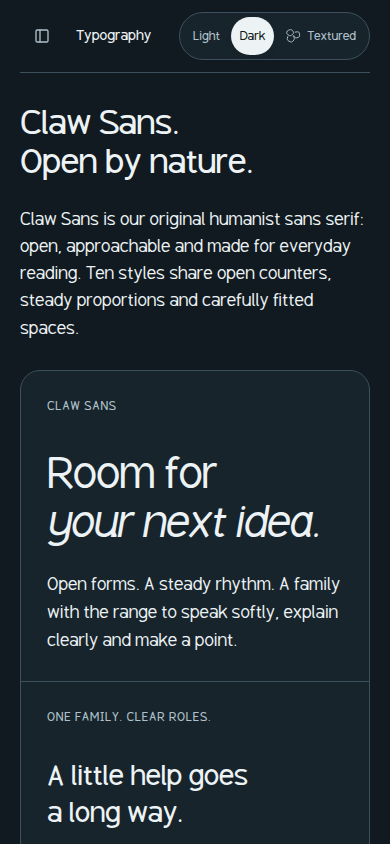

# View the proposal or run your own copy

The public site is [OpenClaw Design — community proposal](https://openclaw-design-proposal.sergiopesch.chatgpt.site/). No OpenClaw Gateway or local setup is required to explore it.

The published website and Sergio's canonical local preview use the same build. `127.0.0.1` is a loopback address: it refers to your machine, not Sergio's. To inspect the code and run your own copy, use the source archive below.

## Local setup

Requirements for this standalone proposal: Node 22.13+ (a current LTS is recommended), npm, Python 3, and unzip. These are the proposal's requirements, not the requirements for building the upstream OpenClaw repository. Initial dependency installation and companion-resource restoration need internet access.

In a new working directory:

```sh
curl -fL https://openclaw-design-proposal.sergiopesch.chatgpt.site/downloads/OpenClaw-Design-Source.zip -o OpenClaw-Design-Source.zip
unzip OpenClaw-Design-Source.zip
cd openclaw-design
npm ci
npm run resources:restore
npm run resources
npm run check
npm run build
npm run preview
```

Open http://127.0.0.1:8897 in your browser. Stop the preview with Ctrl+C. For source editing and hot reload, stop the preview, run `npm run dev`, and use the local URL printed by that command.

Use a single preview at a time. When testing beside an existing preview on the same computer, both HTTP and debugger ports need isolation; the validation run used:

```sh
npx wrangler dev --config dist/server/wrangler.json --ip 127.0.0.1 --port 8907 --inspector-port 0
```

That alternate command serves http://127.0.0.1:8907. Do not expose a development server publicly to share this study; use the public site.

## Archive integrity and contents

Source archive reviewed on 2026-09-08:

- Filename: `OpenClaw-Design-Source.zip`
- Bytes: `16479163`
- SHA-256: `5e1cf54f0d44fdddf6c084d5d7a0cbd89ec0c446034f6592453877e348426491`
- Site source revision: `a3b36049168ebc4202ab8abb3ca8fb8f6a1e73bf`

The live site can evolve. Compare a later archive with its [current checksum index](https://openclaw-design-proposal.sergiopesch.chatgpt.site/downloads/resource-index.json); do not assume this recorded checksum describes a future revision.

The source ZIP omits nested ZIPs and six large 4K images. `resources:restore` retrieves missing current companion resources and verifies their SHA-256 values. `resources` rebuilds the generated archives/indexes. It preserves all 14 featured download entry points; historical-only companion archives remain accessible on the public site instead of being restored by default. Consequently a freshly restored copy has 58 indexed resources, while the public site has 70 including historical archives. This is a documented archive-packaging difference, not a different design or interaction implementation.

The archive is sanitized for contributors: it does not contain the author's Sites project ID, credentials, environment files, node_modules, or running service state. Local viewing does not require a Sites account or an OpenClaw account.

## Verification on 2026-09-08

- Public HTTP checks: all 12 routes and 101 linked assets pass; `/materials` redirects to `/textures`, and an unknown route returns 404.
- All 70 published downloadable resource hashes match the local index.
- All 413 published static assets match the author's canonical local build byte-for-byte.
- Fresh source ZIP downloaded from the public site, checksum verified, extracted into a clean temporary directory, dependencies installed with `npm ci`, companions restored, resources regenerated, TypeScript/lint/resource checks passed, and production build completed.
- The fresh source build was started locally and passed all 12 route and 101 linked-asset checks. Its Typography reading-size/background controls and dark appearance also passed in Chromium.
- Desktop Chromium interaction checks cover logo-treatment panels, reading size/background, page navigation, character lightbox and Escape dismissal, Phone selection and opening the app preview, voice Speaking state, pause/resume control state, and wave toggle.
- A browser download of the contributor source ZIP completed. At 390 × 844, the mobile menu navigated to Typography and dismissed correctly; dark/textured/light selection applied, and Typography and Downloads had no horizontal page overflow.
- Chromium records no application console errors in those checks. It reports unused brand-asset preload warnings and WebGL ReadPixels GPU-stall warnings in the automated voice preview. The checked controls still respond; GPU performance across devices remains unqualified.

These checks cover a design prototype. They are not a claim that every interaction, assistive technology, browser, native device, or language has been qualified. Voice file playback and real microphone/Gateway behavior are not part of this test; the proposal does not implement microphone/Gateway connectivity. UI states do not represent real agent work.


