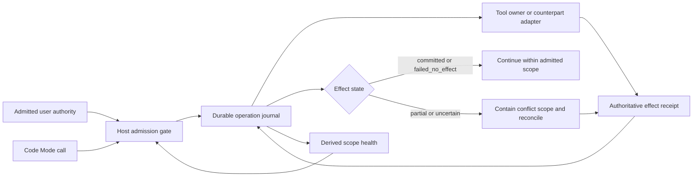

# Proposal: Code Mode Effect Receipts and Scoped Mutation Recovery

## Summary

OpenClaw Code Mode should replace its growing set of per-tool mutation-recovery
exceptions with one host-trusted effect contract. Each tool lifecycle owner reports what
happened to the exact operation, while the host durably records that fact, preserves the
admitted user authority, and contains only conflicting work when the result is uncertain.
Operational errors remain model-visible data, unrelated authorized work continues, and
global read-only mode is reserved for failures that prevent trustworthy scoped containment.

## Motivation

[OpenClaw issue #131340](https://github.com/openclaw/openclaw/issues/131340)
documents the current gap. Code Mode can tell that a bridge dispatch started and can clear
its potentially-mutating counter when a trusted no-start error reaches that boundary. It
cannot represent, through one canonical fact, whether an input-specific operation was
read-only, rejected before effects, committed, partially applied, compensated, or left
uncertain after dispatch.

This creates two bad outcomes:

- Harmless validation, policy, and read-only failures can stop productive work or force a
  read-only reconciliation turn.
- Restoring mutation capability after reconciliation can let the model propose different
  work that was never part of the admitted user task. A new operation key prevents an exact
  replay; it does not prove authorization.

The issue's redacted local audit found 67 hard-stop incidents across 10 sessions. Of those,
46 were rejected before effects, 8 performed read-only work, and 13 involved an actual or
possible mutation. Several narrow fixes improved individual paths, but core tools, plugins,
MCP tools, client tools, namespace operations, async work, cancellation, and recovery still
do not share one effect-provenance contract.

A transport disconnect illustrates the distinction this RFC needs. If a create request was
transmitted and the connection dropped before its response arrived, the exact operation is
uncertain. That does not establish that the counterpart is broken or malicious. OpenClaw
should reconcile that operation and contain its conflict scope without making the entire
agent read-only.

## Goals

- Keep the agent run alive when a code cell or nested tool call returns an operational
  error.
- Record one host-trusted, input-aware effect outcome for every Code Mode-callable
  operation.
- Preserve user authorization independently from effect certainty and recovery state.
- Reconcile uncertain or partial operations through the owner that understands the
  counterpart's semantics.
- Contain only operations that can conflict with unresolved effects; allow unrelated work
  within the already-admitted user scope to continue.
- Escalate and cool scopes from authoritative evidence with hysteresis, not elapsed time or
  error-string heuristics.
- Cover core, bundled and external plugins, MCP, client, and namespace tools across
  approval, timeout, cancellation, abort, async completion, partial success, restart, and
  stale-authority boundaries.
- Replace the current piecemeal mutation classification and reconciliation paths with one
  canonical owner boundary.

## Non-Goals

- Weakening fail-closed replay protection or allowing blind repetition of uncertain
  mutations.
- Treating a receipt as authorization, approval, or permission to start unrelated work.
- Trusting model arguments, model-visible output, error strings, plugin prose, or MCP
  annotations as effect proof.
- Guaranteeing exactly-once delivery when a counterpart provides neither idempotency nor an
  authoritative readback mechanism.
- Adding a user-facing configuration switch or making Code Mode safety optional.
- Defining a new SQLite schema in this RFC. The journal must use a canonical OpenClaw store,
  but its ownership and schema require the repository's separate persistent-store review
  checkpoint before implementation.
- Requiring every isolated validation error to increase provider-wide health state.

## Proposal

### Separate effect state, scope health, and authority

The runtime tracks three independent axes:

1. **Operation effect state:** what the owner can prove happened to this exact call.
2. **Scope health:** whether unresolved or contradictory evidence requires containment for
   a conflict key, tool owner, or provider.
3. **Execution authority:** what the admitted user task and approvals currently authorize.

Neither effect state nor health can expand authority. A cool provider cannot authorize a
mutation, and a reconciled operation cannot restore permission for unrelated work.



### Effect receipt

Every Code Mode-callable operation passes through a shared host envelope. The tool
lifecycle owner supplies the semantic classification and counterpart evidence; the host
validates authority, assigns operation identity, records state transitions, and applies
containment.

```text
EffectReceipt {
  operationId
  ownerId
  conflictKey
  operationKind: read | mutation | unknown
  state:
    not_started | read_completed | mutation_committed |
    failed_no_effect | partial | uncertain | compensated
  idempotencyKey?
  evidenceRef?
  retry: forbidden | same_key | safe
  reconciliation?
}
```

The fields have these meanings:

| Field | Contract |
| --- | --- |
| `operationId` | Host-assigned identity for one admitted operation. It is correlation, not authority. |
| `ownerId` | Stable identity of the lifecycle owner responsible for classifying and reconciling the operation. |
| `conflictKey` | Smallest resource scope whose mutation ordering can conflict with an unresolved effect. |
| `operationKind` | Input-aware classification established before dispatch when the owner can know it. Unknown remains fail-closed. |
| `state` | Owner-proven effect state. Only valid host/owner transitions may upgrade it. |
| `idempotencyKey` | Counterpart-supported key that permits same-key retry without creating a second logical operation. |
| `evidenceRef` | Bounded host reference to owner evidence, never untrusted model-visible prose. |
| `retry` | Owner decision for this operation: forbidden, same-key only, or safe. |
| `reconciliation` | Owner-supplied method for authoritative readback or compensation when supported. |

The durable journal records the request identity, frozen admitted authority reference,
owner, conflict key, state transitions, and bounded evidence references. It does not infer a
safe state from an exception class. It also does not serialize unrestricted counterpart
responses into prompt history.

The receipt is not directly model-writable. A plugin or MCP server may return data that an
installed owner adapter validates, but an arbitrary annotation cannot mint
`failed_no_effect`, `mutation_committed`, or `compensated`.

### Owner responsibilities

Each owner adapter supplies the strongest facts its counterpart can support:

- an input-aware read/mutation classifier;
- a conflict-key extractor;
- an idempotency-key strategy, when available;
- an authoritative readback or reconciliation operation;
- evidence for rejection before effects, successful commit, partial application, or
  completed compensation.

Examples include a GitHub issue identifier or operation marker, a message delivery ID, an
atomic filesystem write plus expected hash, or a database transaction commit result. The
shared runtime coordinates these facts but does not guess counterpart behavior.

An owner must revalidate the exact live admitted authority immediately before a receipt
crosses the action boundary after awaited work. Abort, replacement, claim loss, lifecycle
rotation, restart, and stale retained callbacks cannot mint a new safe receipt.

### State transitions

The canonical transition rules are:

- Admission or owner validation may end at `not_started`.
- A proven read-only operation ends at `read_completed`; a read-only failure may end at
  `failed_no_effect` because the owner established that the operation cannot mutate.
- A counterpart commit acknowledgement or authoritative readback may produce
  `mutation_committed`.
- A pre-effect rejection may produce `failed_no_effect`.
- Proven mixed application produces `partial`.
- A dispatched mutation without sufficient commit or no-effect evidence produces
  `uncertain`.
- Successful owner compensation produces `compensated`.
- `partial` and `uncertain` never become `failed_no_effect` merely because a retry, timeout,
  or process restart occurred.

The journal rejects contradictory or stale transitions. Reconciliation appends evidence; it
does not rewrite prior history.

### Scoped mutation temperature

Temperature is a deterministic presentation of unresolved owner state. It is not a
probability, reputation score, or permission system.

| Level | Evidence | Runtime behavior |
| --- | --- | --- |
| Cool | Confirmed outcomes and no unresolved calls | Ordinary execution. |
| Warm | One validation failure, rate limit, or transport disconnect | Return the error as data; correct or retry only when the owner says it is safe. |
| Hot | Repeated ambiguity or a partial effect for one conflict scope | Reconcile or compensate; queue only conflicting mutations. |
| Very hot | Repeated contradictory outcomes across one owner or provider | Fence that owner/provider while independent owners continue. |
| Critical | Journal corruption, stale global authority, or loss of isolation that prevents scoped containment | Enter global read-only emergency state. |

Health is derived first at the conflict-key scope, then at owner and provider scopes only
when evidence spans those scopes. One disconnected request may make its operation uncertain
while leaving provider health cool or warm.

Cooling requires positive evidence: authoritative readback, a confirmed no-effect result,
completed compensation, or successful owner canaries. Time passing alone does not establish
what happened. Hysteresis prevents one success from immediately clearing repeated
contradictory evidence.

### Continuation behavior

The runtime applies the receipt as follows:

- `read_completed` and `mutation_committed` continue normally.
- `not_started` and `failed_no_effect` return actionable error data to the model and allow a
  corrected retry when `retry` permits it.
- `partial` invokes owner reconciliation or compensation and fences mutations sharing its
  conflict key.
- `uncertain` forbids blind replay. It invokes owner readback and queues only conflicting
  mutations while the exact operation remains unresolved.
- `compensated` records the restored authoritative state and allows work to continue within
  the still-live user authority.
- An unhandled code-cell exception may end the cell, but does not by itself end the agent
  run.
- Unrelated mutations may continue only when they remain inside the original admitted task
  and are not fenced by the affected scope.

When an external tool cannot provide a precise conflict key, containment falls back to the
tool owner or provider. Unknown effect semantics remain fail-closed for replay, but they do
not automatically force runtime-wide read-only mode.

Global read-only mode is reserved for the cases where the host cannot trust its journal,
execution authority, or isolation boundary enough to enforce narrower containment.

### Examples

| Event | Receipt and health | Result |
| --- | --- | --- |
| Invalid arguments rejected before dispatch | `failed_no_effect`, operation scope remains cool | Return validation detail; allow a corrected retry. |
| Read-only lookup times out after dispatch | Owner-proven `failed_no_effect`; owner may become warm | Retry or use an alternate read path without mutation reconciliation. |
| Create request transmitted, then connection drops | `uncertain`; exact conflict key is fenced; provider remains cool or warm | Read back by idempotency key or owner marker. Do not replay blindly. |
| Readback proves the create committed | Transition to `mutation_committed` | Unfence the conflict key and continue within admitted scope. |
| Multi-file patch applies one file before a later failure | `partial`; workspace or file-set conflict scope becomes hot | Inspect authoritative files, compensate or finish only if the original authority permits it. |
| Repeated contradictory readbacks from one provider | Affected provider becomes very hot | Fence that provider; independent tools remain available. |
| Journal integrity or run-authority binding is lost | Runtime becomes critical | Enter global read-only emergency state and report the integrity failure. |

### Coverage and migration

Implementation proceeds by owner surface while preserving one final architecture:

1. Define the shared receipt, transition validator, conflict fencing, and host projection.
2. Adapt core and namespace operations, including input-aware mixed read/mutation tools.
3. Expose the minimum generic owner contract needed by bundled/external plugins, MCP, and
   client tools without trusting unverified remote annotations.
4. Cover async completion, approval, abort, timeout, cancellation, partial success, restart,
   and stale-authority paths in the same state machine.
5. Replace and delete the existing potentially-mutating counter exceptions and bounded
   reconciliation forks once the full matrix reaches the canonical path.

The migration may temporarily adapt existing trusted no-start and replay-safe facts into
the receipt at their current owner boundaries. Those adapters are migration steps, not a
second permanent policy path.

The implementation issue must define a regression matrix that proves both sides of the
invariant for each tool source:

- proven read/no-effect failures keep the agent productive;
- partial or uncertain mutations never replay without owner evidence;
- reconciliation cannot broaden the admitted task or approval scope;
- unrelated authorized work continues when scoped containment remains trustworthy.

### Persistence checkpoint

The journal is OpenClaw-owned runtime state and therefore belongs in a canonical SQLite
store rather than a JSON sidecar. This RFC does not choose the shared state database,
per-agent database, schema, indexes, retention, or restart semantics. Those are material
persistent-store decisions and require explicit maintainer review and acceptance before
implementation.

Any protocol or plugin SDK surface should be additive first. A protocol version bump, if
one is ultimately required, remains a separate owner-confirmed decision.

## Rationale

### Why this is broader than per-tool exceptions

Per-tool replay-safe flags and no-start error classes answer only selected lifecycle
questions. They drift as new tool sources, mixed read/mutation actions, async completion,
and new failure paths are added. A receipt makes the lifecycle owner state one canonical
fact and lets Code Mode consume it without embedding provider-specific policy.

### Why not switch the whole run to read-only after ambiguity

Global read-only mode preserves safety but destroys most of the agent's utility. It also
conflates one uncertain operation with loss of trust in every independent owner. Scoped
containment preserves safety at the conflict boundary and reserves the global state for
integrity failures that genuinely cannot be isolated.

### Why not resume all mutations after reconciliation

Reconciliation establishes effect state, not user intent. A different operation key may be
semantically equivalent, conflicting, or entirely unrelated. Continuation therefore
requires both a safe effect state and still-live authority for the proposed mutation.

### Why not replay every interrupted call with an operation key

An operation key is useful only when the counterpart honors it or an owner can reconcile
it. A non-idempotent remote mutation may commit before the host records the result. Replaying
that call can duplicate the effect. Such a call remains `uncertain` until owner evidence
resolves it.

### Why not trust MCP annotations or error strings

Those values may be remote, model-visible, incomplete, or inconsistent with actual
lifecycle state. They can inform an owner adapter but cannot directly upgrade a host receipt
or bypass authorization.

### Prior art

The following source revisions demonstrate useful parts of the design. None provides the
complete combination of counterpart-owned effect truth, durable mutation certainty, scoped
containment, reconciliation, and continued unrelated mutation work.

| Harness | Existing behavior | Lesson for OpenClaw |
| --- | --- | --- |
| [OpenCode](https://github.com/anomalyco/opencode/blob/15537a41d2a0514f7040e1c4128b7846cdc19ce0/packages/opencode/src/tool/code-mode.ts#L214-L290) | Experimental Code Mode records child calls as running/completed/error and projects nested MCP failures. It is [feature-gated](https://github.com/anomalyco/opencode/blob/15537a41d2a0514f7040e1c4128b7846cdc19ce0/packages/opencode/src/tool/registry.ts#L118-L120). | Borrow model-visible failure continuation; in-memory status is not counterpart effect proof. |
| [OpenAI Codex](https://github.com/openai/codex/blob/2f108f9fd970ed73df7e984d3a661acc02f33abc/codex-rs/core/src/tools/code_mode/execute_handler.rs#L29-L90) | Nested calls use the normal host dispatcher and runtime failures become model-visible function-call errors. Native Code Mode flags are [under development and disabled by default](https://github.com/openai/codex/blob/2f108f9fd970ed73df7e984d3a661acc02f33abc/codex-rs/features/src/lib.rs#L777-L787). | Borrow shared dispatch and error-as-data; add durable effect and reconciliation ownership. This runtime is separate from OpenClaw Code Mode. |
| [Hermes Agent](https://github.com/NousResearch/hermes-agent/blob/6dcebea7fc5d0cc4f621eeaddf52b7d877a5f882/tools/code_execution_tool.py#L1205-L1288) | Programmatic calls return structured success/error/timeout/interrupted results and a nested-call count. | Borrow structured script outcomes; a count cannot prove which mutations committed. |
| [Gemini CLI](https://github.com/google-gemini/gemini-cli/blob/3c311beac2e78336816dd4a123db39743f9fbf85/packages/core/src/scheduler/tool-executor.ts#L101-L195) | Tool errors become completed responses instead of crashing the loop. Optional [checkpointing](https://github.com/google-gemini/gemini-cli/blob/3c311beac2e78336816dd4a123db39743f9fbf85/docs/cli/checkpointing.md#L1-L46) snapshots local files and conversation state. | Borrow error-as-data and local rollback; snapshots do not resolve arbitrary remote mutation state. |
| [Qwen Code](https://github.com/QwenLM/qwen-code/blob/7357136dd168f1c4abd3a97f4252fa7971047d0e/packages/core/src/core/coreToolScheduler.ts#L4650-L4715) | Its scheduler distinguishes `not_started` pre-hook/guard failures from execution. | Borrow lifecycle phases; post-start `error` is not proof of commit or no effect. |
| [Goose](https://github.com/block/goose/blob/caf59517cc280dd3523a80131f388024eaaede9d/crates/goose/src/agents/state_machine/ops_toolcalling.rs#L900-L1024) | Dispatch, parse, decline, and interruption failures become paired tool responses so inference can continue. | Borrow complete tool-result pairing and actionable errors; add owner reconciliation for lost results. |
| [OpenHands](https://github.com/OpenHands/software-agent-sdk/blob/b57ba44c781c85ffc89804d04bf955d534ac0a29/openhands-sdk/openhands/sdk/agent/agent.py#L1344-L1406) | Tool actions and observations are event-driven; recoverable execution errors become model-consumable events. | Borrow durable conversational observations; the event alone does not prove remote effect state. |
| [Cloudflare `@cloudflare/codemode`](https://github.com/cloudflare/agents/blob/1062f847513e23e681d6225833d90100dadecbf3/packages/codemode/src/runtime.ts#L59-L75) | SQL-backed call logging stores deterministic arguments/results, approvals, and rollback state. A crash-window `executing` call is [executed again](https://github.com/cloudflare/agents/blob/1062f847513e23e681d6225833d90100dadecbf3/packages/codemode/src/runtime.ts#L394-L481). | Borrow the durable journal and replay boundary; use `uncertain` plus owner reconciliation instead of blindly re-executing non-idempotent mutations. |

The common pattern is valuable but incomplete: keep the loop alive with error-as-data,
snapshot local artifacts where useful, distinguish pre-execution from post-start failure,
and journal deterministic calls. OpenClaw's missing layer is the owner-produced effect
receipt plus scoped, evidence-driven containment.

## Unresolved questions

- Which current tool-execution owner should host the canonical receipt and transition
  validator without making Code Mode a second execution policy path?
- What is the canonical conflict-key shape, and which owners can reliably provide
  resource-level keys rather than tool/provider fallbacks?
- Which SQLite owner, schema, retention policy, and restart semantics satisfy durability
  without duplicating approval, audit, or run-terminal state?
- How should external MCP and client tools without idempotency or reconciliation APIs expose
  bounded owner adapters while remaining fail-closed?
- How should an async operation report a later authoritative commit after the initiating
  run or turn has ended?
- Which evidence and thresholds move conflict, owner, and provider scopes between health
  levels, and how are successful canaries selected safely?
- How should operator UI and model-visible tool results present containment, reconciliation,
  and the next safe action without exposing sensitive evidence?
- Does the generic owner contract require additive plugin SDK or Gateway protocol surface,
  and what migration removes the old paths cleanly?
- What exact authority representation proves that a post-reconciliation mutation remains
  inside the original user-authored task?
- Which failure prevents scoped containment strongly enough to justify global read-only,
  and what evidence is required to exit that emergency state?
