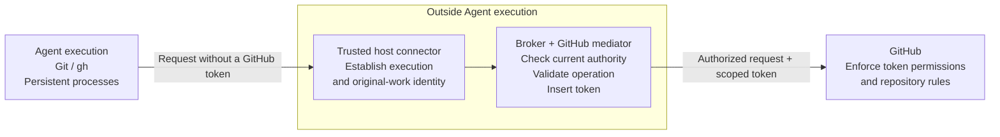

# Proposal: Credential lifecycle and GitHub App access for Enterprise Agents

## Summary

Extend OpenClaw Enterprise's `SecretBroker` to manage issued credentials, with GitHub Apps as the first provider. The OpenClaw Controller (OCC) authorizes access; the broker owns issuance, renewal, and cleanup. In production, a trusted proxy checks each GitHub request and adds the token outside Agent execution.

## Motivation

Agents need organization-managed access to repositories, issues, and pull requests. A shared credential lifecycle lets providers reuse authorization, renewal, and crash recovery.

Scoped tokens limit damage, but an external attacker can still use a leaked copy. GitHub installation tokens [expire after one hour](https://docs.github.com/en/apps/creating-github-apps/authenticating-with-a-github-app/generating-an-installation-access-token-for-a-github-app); ending a session or replacing a token does not revoke it.

## Goals

- Define who authorizes access, protects credentials, and completes cleanup.
- Support selected Git/`gh` workflows and persistent processes within explicit grants.
- Prevent Agents from publishing private workspace content to public GitHub repositories.
- Make integration credentials copied from a production container unusable elsewhere.

## Non-Goals

- A new IAM system or a user-facing resource for every token.
- Migrating all credentials or supporting every provider and protocol.
- Hiding fetched history or preventing disclosure through every output channel.

## Proposal

### Make the broker the lifecycle owner

Add an internal issuer capability to [RFC 0027's SecretBroker](0027-openclaw-enterprise.md#secret-access), selected by Installation configuration. Existing `Secret` references and `SecretDriver` manage protected material; `ServiceAccountDriver` retains account provisioning.

| Owner | Responsibility |
| --- | --- |
| OCC and existing IAM/runtime authorities | Authorize the grant and mode; check current workload and invocation authority. |
| SecretBroker and protected storage | Record issuance before dispatch, protect tokens, control use, renew, and recover cleanup. |
| Issuer implementation | Issue and revoke within the grant; report scope, expiry, and uncertain outcomes. |
| Compute | Own execution and checkout. |
| SandboxDriver | Establish and verify containment. |

The broker tracks access in a **lease** tied to one invocation or preparation operation. A lease ID grants no permission; invocation checks can only narrow workload authority. The [broker interface](0034/credential-broker-v1-spec.md) runs within trusted platform services and requires no new microservice.

This proposal consumes the [identity/execution contract](https://github.com/openclaw/rfcs/pull/69), [original-work authority](https://github.com/openclaw/rfcs/pull/70), and [stop/replacement rules](https://github.com/openclaw/rfcs/pull/71). The [series overview](0027/runtime-access-overview.md) maps their ownership and remaining decisions.

### Configure GitHub access

An operator enrolls a GitHub App installation through a Namespace's broker. OCC records approved repositories, permissions, mode, and checkout commit in an immutable Agent revision. The signing key stays outside Agent execution.

Each session selects from those grants. An invocation may narrow that selection and gets a separate lease and token per repository. Later session changes cannot expand an existing invocation's access. [Session scope](0034/github-app-v1-spec.md#session-scope-and-multiple-repositories)

| Profile | GitHub permissions |
| --- | --- |
| Read-only checkout | `contents:read` |
| Issue and PR views | `contents:read`, `issues:read`, `pull_requests:read` |
| Coding | `contents:write`, `issues:read`, `pull_requests:write` |

All include `metadata:read`; workflow, administration, and secrets permissions are excluded. Token issuance and proxy checks use the same grant. GitHub repository rules enforce branch and merge restrictions. [Policy enforcement](0034/github-app-v1-spec.md#policy-enforcement)

Pushes and PR/API writes require approved, verified non-public destinations, with [controls over visibility changes](0034/github-app-v1-spec.md#preventing-public-publication).

### Require mediation in production

SandboxDriver must [enforce this route](0034/github-app-v1-spec.md#mediated-origin-and-routing) and prevent bypass. Client proxy settings alone are insufficient.

Native delivery is development/testing only: Git helpers and new `gh` processes receive scoped tokens, which remain reusable if leaked until revoked or expired.

The initial profile covers clone/fetch, prepared-branch push, repository/issue/PR views, and explicit draft PR creation. Each command variant needs qualification; unsupported operations deny without native fallback. The model-credential proxy does not provide GitHub mediation.

### Manage normal operation

1. **Prepare.** OCC authorizes a separate read-only checkout. SandboxDriver verifies containment; Compute verifies the commit and storage handoff before OCC starts the candidate Harness. Failure preserves the serving revision and workspace.
2. **Run and renew.** Check current authority before issuance and every mediated operation. Token expiry does not end authorized work: the broker issues replacements and tracks every predecessor. Commands may fail on expiry; ambiguous writes are not automatically replayed.
3. **Close and clean up.** Completion, replacement, expiry, or withdrawal closes affected leases and starts durable cleanup. Reusable processes may survive, but old requests cannot inherit later work's authority. Workspace replacement requires observed writer termination.

Persistent processes need trusted attribution of requests to their original work. Background work beyond a turn needs explicit admission and a cancellation owner. That [design remains a release gate](0034/credential-broker-v1-spec.md#persistent-processes-and-background-work).

[Recovery requirements](0034/lifecycle.md) distinguish stopping access, stopping a process, and revoking tokens. Already accepted provider operations may finish.

## Rationale

A shared broker gives providers common lifecycle behavior while issuers retain provider-specific APIs and scope rules.

Mediation requires trusted origin enforcement and Git/API compatibility work. Copy resistance assumes trusted host and broker infrastructure; it does not cover an attacker relaying through the original authorized container.

## Unresolved questions

- Which protected transport and dispatcher can attribute persistent-worker requests to their original work on the selected runtime?
- Which background-work lifetimes should initial admission support, and who owns their renewal and cancellation?
