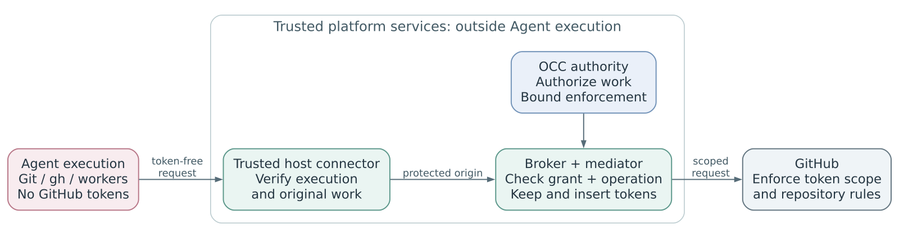

# Proposal: Credential lifecycle and GitHub App access for Enterprise Agents

## Summary

Extend OpenClaw Enterprise's `SecretBroker` to manage issued credentials, starting with GitHub Apps. The OpenClaw Controller (OCC) authorizes access; the broker owns issuance, renewal, and cleanup. Production requests pass through a trusted mediator that checks each operation and adds tokens outside Agent execution.

## Motivation

Agents need organization-managed repository, issue, and pull-request access. Shared lifecycle management avoids duplicating authorization, renewal, and crash recovery across providers. Scoped tokens still expose usable copies when leaked: GitHub installation tokens [expire after one hour](https://docs.github.com/en/apps/creating-github-apps/authenticating-with-a-github-app/generating-an-installation-access-token-for-a-github-app), and ending a session or replacing a token does not revoke them.

## Goals

- Define authorization, credential custody, and cleanup ownership.
- Support selected Git/`gh` workflows and persistent processes within explicit grants.
- Prevent public GitHub publication of private workspace content and external reuse of integration credentials copied from production containers.

## Non-Goals

New IAM or public token resources; migrating every credential or supporting every protocol; hiding fetched history or preventing disclosure through every output channel.

## Proposal

### Ownership and authority

Extend [RFC 0027's SecretBroker](0027-openclaw-enterprise.md#secret-access) with an internal issuer capability. OCC/IAM authorizes invocation separately from service/workload access. The broker records issuance before dispatch and protects credentials; issuers issue and revoke, reporting scope, expiry, and uncertain outcomes. Compute owns execution and checkout; SandboxDriver establishes and verifies containment. Existing `SecretDriver` storage and `ServiceAccountDriver` provisioning responsibilities remain.

A broker **access lease** binds one original service-owned logical work record and execution assignment, or separately admitted preparation. OCC's bounded **enforcement lease** authorizes operations; it is distinct from broker access. Neither requester identity nor a lease ID grants provider access. The [broker contract](0034/credential-broker-v1-spec.md) follows the [series' identity, original-work, and stop rules](0027/runtime-access-overview.md).

### Credential flow

1. **Admit and prepare.** Enroll a Namespace's GitHub App installation. OCC pins approved repositories, permissions, mode, and commit in an immutable Agent revision. Admit work's selection with a separate access lease and token per repository and assignment. Prepare checkout under separate read-only authority; verify containment, commit, and safe handoff before Harness startup. Failure preserves the serving revision and workspace.
2. **Dispatch and renew.** A trusted connector identifies execution and original work. The mediator validates each operation against the same grant used for issuance, then inserts the token. Signing keys and tokens stay outside Agent execution. Replacement retains predecessor cleanup obligations without extending work authority. Never automatically replay uncertain writes.
3. **Close and recover.** Work closure, assignment retirement, access expiry, or withdrawal closes affected leases and starts durable cleanup. Reassignment needs fresh authority and the required stop barrier; old leases stay closed. Workspace replacement requires observed writer termination. Access denial, process termination, and provider revocation remain separate. Accepted provider operations may finish.

### Constraints

The [GitHub profile](0034/github-app-v1-spec.md) covers selected clone/fetch, prepared-branch push, views, and explicit draft PR creation. Writes require approved non-public destinations and visibility-change controls; GitHub enforces branch and merge restrictions. Production routing must prevent bypass. Each command variant needs qualification. Unsupported operations deny; native token delivery is development/testing only.

Logical work may outlive turns and tokens. Persistent requests retain original-work attribution. Attached children need their own admission and immutable lineage; renewal requires open, authorized logical ancestors, not a live coordinator. Later work cannot expand or revive old authority.

Writes, authority renewal, and new assignments require current authority. Only qualified reads may continue during outages under an existing unexpired enforcement lease; expressly preauthorized read-only credential maintenance cannot extend its deadline.

## Rationale

A shared broker centralizes lifecycle behavior while issuers retain provider rules. Mediation adds origin-enforcement and Git/API compatibility work. Copy resistance assumes trusted host and broker infrastructure and intact containment; relay through the original authorized container remains outside the guarantee.

## Unresolved questions

The [acceptance matrix](0034/lifecycle.md#acceptance-matrix) remains a production gate. Which protected dispatcher binds persistent requests to original work? Which reads and maintenance qualify during outages? What numerical lease and withdrawal bounds meet the selected security and availability requirements?
