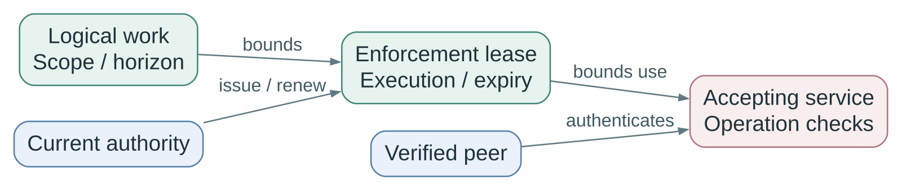

# Proposal: Workload identity and runtime authority with SPIFFE/SPIRE

## Summary

Propose optional SPIFFE/SPIRE authentication and bounded enforcement leases for Enterprise runtimes. Preserve [RFC 0027](0027-openclaw-enterprise.md#iam-and-authority)'s stable Agent identity, Namespace authorization and single active revision while distinguishing execution identity from current authority.

## Motivation

Connections and certificates can outlive executions. Authentication must never restore retired authority. SPIFFE/SPIRE provide identity and attestation; OCC and policy authorities control permissions.

## Goals

Distinguish executions and restarts, bound authority withdrawal, and preserve independently authorized bootstrap, retirement and cleanup.

## Non-Goals

Replacing human login, OAG, IAMAdapter or Kubernetes authorization; adding user-facing execution resources; proving containment or physical termination; federation or cross-Namespace references.

## Proposal

The [enforcement specification](0035/enforcement-spec.md) retains the detailed contracts.

Installation configuration explicitly selects optional X.509-SVID authentication. [Profile selection](0035/enforcement-spec.md#authentication-profiles) forbids automatic fallback. RFC 0027's pod-bound token profile remains the baseline; this draft's outage refinement, including SecretBroker access, awaits acceptance.

Under [execution registration](0035/enforcement-spec.md#execution-registration), OCC selects assignments; Compute supplies execution evidence; registrars/SPIRE bind identities; transport verifies peers; accepting services authorize operations. Agents retain OCC-created `WorkloadIdentity` objects. Each restart or replacement receives an immutable execution binding; registered subjects are never rebound, and selectors must distinguish actual incarnations.

[Request verification](0035/enforcement-spec.md#request-verification) requires qualified transport to establish required execution origin. Ordinary TLS proves key possession; copied identity fields cannot recreate connection-bound evidence. Missing origin proof denies affected operations. [RFC 0034 mediation](https://github.com/openclaw/rfcs/pull/68) binds connector, represented Agent and [RFC 0036 original work](https://github.com/openclaw/rfcs/pull/70); service identity cannot replace caller authority. [RFC 0037](https://github.com/openclaw/rfcs/pull/71) observes OCC's canonical assignment.

Application writes, admission, renewal, expansion and reassignment require current authority. [Outage operation](0035/enforcement-spec.md#outage-operation) permits only qualified existing application reads under an existing, unexpired lease. Protected origin, trustworthy time, complete revocation state and all mandatory evidence remain required; missing evidence denies use. Read eligibility, freshness, protected content versions and preauthorized credential maintenance require explicit qualification; maintenance cannot expand access or extend deadlines.

Logical work may survive a process; an enforcement lease binds an exact execution and cannot exceed the work horizon. Replacement requires current authority and new evidence.

*Work may outlive execution; identity authenticates, while leases bound authority.*

[Issuance and revocation](0035/enforcement-spec.md#lease-issuance-and-ordering) must be authoritatively ordered and stale issuers fenced. Late delivery retains original expiry. [Lease bounds](0035/enforcement-spec.md#lease-bounds-and-ancestry) respect ancestor horizons, purpose deadlines and withdrawal targets. Issuance and renewal recheck current policy and open logical ancestors; offline attenuation only narrows existing authority.

Effective withdrawal requires complete holder acknowledgements or proven expiry, including descendants and clock/enforcement allowances. Leases cannot promise immediate withdrawal from unreachable holders. Lost continuity after restart, untrustworthy time, revocation gaps or rollback block affected use until trustworthy synchronization returns; [continuity contracts](0035/enforcement-spec.md#revocation-and-continuity) define the required evidence.

[Dispatch and lifecycle](0035/enforcement-spec.md#dispatch-and-lifecycle) recheck evidence at final submission and protected delivery. Queuing, reconnect and identity renewal cannot extend deadlines. Effective retirement requires established withdrawal; physical termination remains separate. Compute must observe predecessor termination before a writable successor; retained cleanup authority survives deletion.

## Rationale

Tokens are simpler; SPIFFE offers common service authentication with added registrar, trust and attestation operations. Execution-specific subjects avoid inherited authority; certificates cannot track current policy. Qualified read leases trade bounded withdrawal delay for outage availability.

## Unresolved questions

Which gVisor attestation, transport, lease mechanisms, reads, lifetimes and measured bounds qualify? Acceptance qualifies no runtime or profile. [Runtime qualification](0035/enforcement-spec.md#runtime-qualification) requires installed-runtime evidence; unit fixtures are insufficient.
