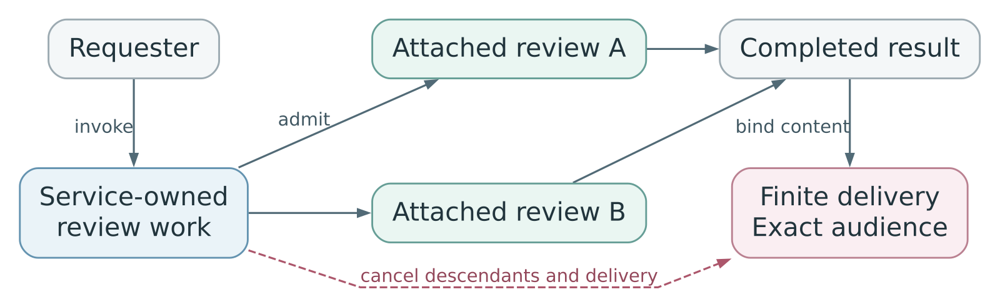

# Proposal: Service-owned work authority for Enterprise Agents

## Summary

Give Enterprise Agents explicit authority for service-owned logical work across turns and runtime replacements. OCC admits finite work; trusted services enforce shorter leases. Requester, service owner and workload retain independent authorization. This extends [RFC 0027](0027-openclaw-enterprise.md#iam-and-authority) with bounded renewal and attached children.

## Motivation

A repository review may outlast its initiating turn or provider token. Its coordinator may stop running while child reviews continue. Tying authority to a process interrupts valid work or leaves background access unbounded. Shared Agents also need to keep each request's permissions and private data separate.

## Goals

Bind operations to their original work and qualified execution; support finite service-owned work and attached children; preserve cancellation, scope, audience and effect identity.

## Non-Goals

User-owned execution, human impersonation, cross-Namespace access, general scheduling, detached delegation, a new IAM system, offline application writes or guaranteed exactly-once provider effects.

## Proposal

OCC separately authorizes invocation, service access, workload permissions, data eligibility and purpose through selected authorities. The requester supplies attribution; the service owner supplies service authority and lifecycle policy; the workload performs operations under its own permissions. Records model user and service owners, but initial admission accepts only service owners.

Each work receives an immutable resource/action ceiling `W` and original absolute horizon. Shared execution requires `W` within shared baseline `B`, within Agent maximum `M`. Extra authority requires `W` within `M`, applicable approval and qualified isolation. Private inputs require isolation even within `B`. These ceilings grant no permissions; provider selections and scopes remain independently bounded.

Admission records requester, membership, session and cancellation dependencies. Session closure withdraws explicitly session-bound work; other service-owned work may outlive the session. Relabeling ownership or omitting a session reference cannot escape admitted dependencies.

For example, Alice asks a review service to inspect an approved repository. Her invocation permission does not transfer a provider session. The coordinator admits two attached reviews, then waits without running. Each child has distinct work identity and immutable ancestor links, scope and horizon. Already-admitted children renew through the authority service while logical ancestors remain open and authorized, subject to current workload permissions, eligible execution and all ancestor horizons and withdrawal targets. A former parent execution lease does not cap fresh authoritative issuance. Ancestor cancellation governs both children; neither silently detaches.

**Figure 1.** Logical parent work remains open while attached children run and renew.

Renewal requires current authority and cannot expand original scope, provider selections or horizons. [RFC 0035 / PR 69](https://github.com/openclaw/rfcs/pull/69) owns issuance and withdrawal, binding leases to exact assignments and accepting services. During authority outages, only expressly qualified reads may continue under existing unexpired leases with every mandatory check satisfied. Writes, admission, renewal and reassignment require current authority. [RFC 0034 / PR 68](https://github.com/openclaw/rfcs/pull/68) owns provider credential mediation.

Trusted dispatch preserves the original work and immutable operation identity and request, with a durable receipt tracking submission and outcome. Unknown submission requires reconciliation; replacement credentials or execution cannot justify replay. Completion, cancellation and expiry close work terminally.

Bind completed content before closure to finite, separately admitted delivery under [RFC 0037 / PR 71](https://github.com/openclaw/rfcs/pull/71). Graceful stop preserves this responsibility, with current authorization for the exact content, audience and destination. Cancellation or security revocation withdraws affected delivery. Neither retries nor stop extend its original horizon.

The [work-authority specification](0036/work-authority-spec.md) preserves admission, isolation, protected origin, outage, receipt, lineage, delivery and qualification requirements.

## Rationale

Logical work separates authorization lifetime from turns, credentials and processes. Short leases bound disconnected use; current-authority renewal preserves finite scope. Attached lineage supports child work without requiring a scheduler. Separate delivery avoids keeping computation alive solely to post a completed report.

## Unresolved questions

Which data classes, isolation mechanisms and IAM policies qualify initial services? What lease profiles and measured withdrawal bounds are supportable? Which reads and credential-maintenance profiles qualify during outages? Which child join, allowance, approval and delivery-horizon policies should be admitted?
