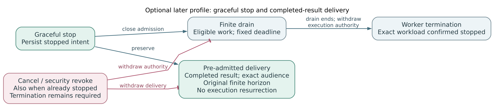

# Proposal: Persistent Agent and runtime lifecycle

## Summary

Extend [RFC 0027](0027-openclaw-enterprise.md#agent-deployment) with persistent Agent lifecycle contracts. Start with the runtime safety needed for mediated reads, then full coding reads and **Approve and publish**. Broader persistent Work, independently admitted durable children, and public Stop/Start controls follow later. Agent identity persists and execution defaults to uncapped; authority leases remain finite. The broader controls and recovery profiles below are proposals, not deployed guarantees.

## Motivation

Restarting a process cannot safely mean continuing its work. Files may contain unfinished changes, credentials may be revoked, and remote writes may already have succeeded. We need to distinguish accepted intent, effective authority withdrawal, observed termination, and credential cleanup without making the entire lifecycle API a prerequisite for initial GitHub access.

## Goals

- Preserve stable Agent identity while tracking separate work and process lifetimes.
- Require exact authority, containment, cancellation, and writer exclusion from the first supported runtime.
- Add durable controls and compatible completed-state recovery as separately qualified capabilities.

## Non-Goals

No initial active-session migration, cross-build or cross-cluster recovery, memory restore, historical tool replay, workflow scheduler, automatic merging, or independent-child coordination.

## Proposal

### Delivery sequence

1. **Mediated reads first.** Bind the exact runtime assignment and immutable authority; enforce containment; retain cancellation and revision-retirement responsibility; observe termination before handing writable state to a successor. Initial reads and approved publication use root Work with qualified subordinate helpers. Qualify a root-only profile where helper authority, aggregate limits, containment, cancellation, and physical cleanup are unproven; reject unsupported helper requests.
2. **Full coding reads + Approve and publish next.** The MVP allows any configured human approver, including the requester. An Agent cannot approve its own publication.
3. **Broader persistence later.** Add durable Work coordination, independently admitted children, public **Stop task**, **Stop Agent**, and **Start Agent**, plus selected recovery, drain, and delivery profiles. Later policies may require an independent human or explicitly authorize automatic, allowlisted push/draft-PR publication without per-operation human approval; all retain the same exact-candidate and exact-effect checks.

The full public lifecycle API and its unselected default Stop behavior do not block the first two stages. Their minimum runtime obligations remain mandatory. Configurable-cap components and lifecycle status reads do not establish complete control mutations or runtime qualification. [Detailed scope and qualification](0037/lifecycle-spec.md#delivery-sequence-and-implementation-boundary) define these boundaries.

### Runtime baseline

OCC owns policy; Compute and Sandbox drivers realize admitted intent and report observations. Use [RFC 0035's assignment](https://github.com/openclaw/rfcs/pull/69) and [RFC 0036's work authority](https://github.com/openclaw/rfcs/pull/70). Admission fixes the effective finite-or-uncapped execution selection on the original attempt, including startup and waiting. Draft edits, reconnects, and credential rotation cannot change it. Uncapped execution still requires finite enforcement leases and current authority; missing authority never means uncapped permission. Both modes retain an owner responsible for stopping exact native construction and all supported helpers.

Preserve RFC 0027's replacement order:

1. Prepare an isolated, nonserving candidate with Harness execution disabled.
2. Retire the predecessor and observe that its Harness and owned writers have terminated. Resolve uncertain creates before any successor writes shared storage.
3. Select the sole active revision, permit execution, and enable routing after readiness.

This deliberately creates an availability gap between predecessor retirement and successor serving. It provides no zero-downtime guarantee. Readiness, route withdrawal, lease expiry, and elapsed time cannot prove writer exclusion. Unknown termination blocks writable replacement; retain the data and cleanup obligation. [Activation details](0037/lifecycle-spec.md#activation-and-writer-exclusion) also cover initialization and restore.

### Later lifecycle controls and recovery

The proposed inventory reports intended state, observed work, observation time, configured cap, and pending or unknown outcomes. **Stop task** targets exact work and its owned helpers or admitted descendants. **Stop Agent** durably blocks new work and drives affected work to stop while preserving identity and retained files. **Start Agent** requires separate authorization; it cannot bypass disable, revive canceled work, or replay uncertain effects.

[Durable admission](0037/lifecycle-spec.md#durable-admission) atomically retains authorized intent, attribution, generation, idempotency key, and processing obligation. Acceptance, effective withdrawal, physical termination, and credential cleanup remain separate outcomes. Stopped intent survives restart and messages. Default Stop behavior and optional finite drain require a later product decision.

If selected, the first [recovery profile](0037/lifecycle-spec.md#recovery-contract) restores completed state on same-build, same-cluster retained storage with exact compatibility checks. Expose residual files and unknown effects for disposition. Restore supplies neither authority nor permission to execute historical tools. Active-session migration and replay remain later work.

**Figure 1.** A later graceful-stop profile may preserve separately admitted, finite delivery of a completed result. Delivery fixes content, audience, destination, and horizon and requires current authority. A late approval or delivery event cannot restart stopped execution, reopen canceled Work, or authorize replay. Unknown posting outcomes do not authorize reposting. [Delivery details](0037/lifecycle-spec.md#completed-result-delivery) retain cancellation and cleanup obligations.

## Rationale

Staged qualification keeps initial access attainable while preserving mandatory runtime safety. Separate observations prevent accepted intent or readable status from masquerading as completed execution control.

## Unresolved questions

Later selections cover default Stop behavior, drain and withdrawal bounds, recovery compatibility and retention, delivery enforcement, and independent-child coordination. The [sidecar](0037/lifecycle-spec.md#open-decisions) records these decisions; none substitutes for first-stage containment, cancellation, or observed writer termination.
