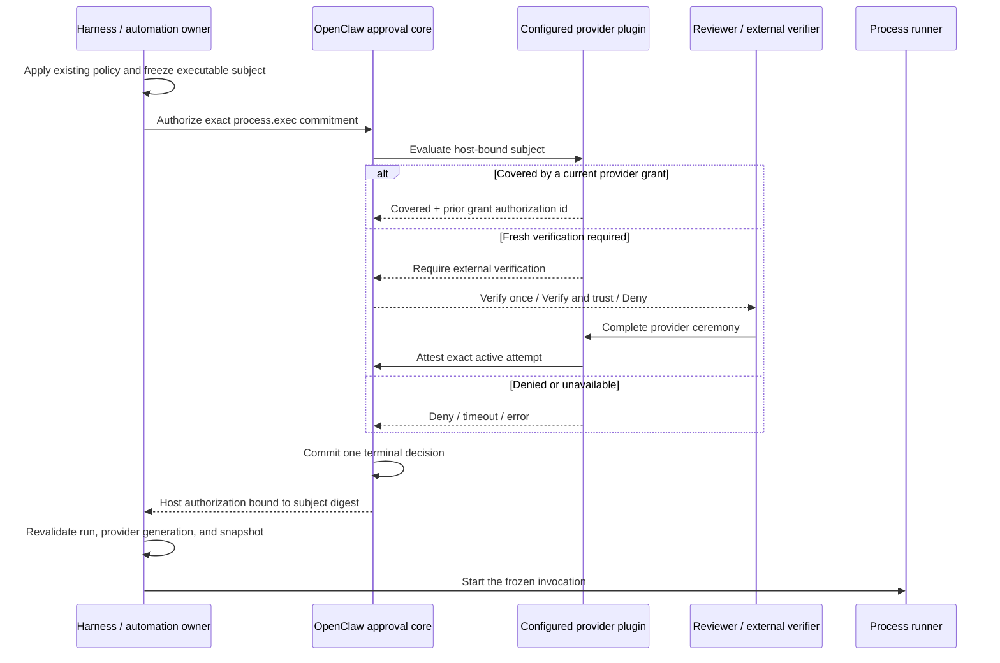

# Proposal: Host-Owned External Authorization for Process Execution

## Summary

Extend the external-verification lifecycle from RFC 0011 to host-owned
`process.exec` admissions. An operator selects one installed provider for this
capability; OpenClaw owns the request, immutable execution commitment, approval
lifecycle, final decision, and execution admission, while the provider owns its
verification ceremony and reusable grants. This is not a broad approval
resolver: a provider cannot choose its scope, resolve an arbitrary approval, or
override an existing host-policy denial.

## Motivation

RFC 0011 deliberately covers approvals created by a plugin from
`before_tool_call`. It explicitly does not let a plugin resolve a core exec
approval. That is the correct default boundary, but it leaves host-owned
execution paths without a provider-neutral way to require an external ceremony.
Examples include a Codex app-server `commandExecution` approval and a command
automation admitted directly by the Gateway rather than by a plugin-owned tool
hook.

The missing boundary matters for providers whose approval is the authorization,
such as a wallet signature, hardware key, or enterprise policy broker. Sending
an additional generic approval prompt is not sufficient: another allow surface
can win first, and the provider cannot prove that its decision covered the exact
execution. Calling a plugin callback directly is also insufficient because it
creates a second owner for timeout, cancellation, replay, and final resolution.

An earlier proposal in openclaw/openclaw#97152 asked for a capability-wide,
cross-harness resolver. Implementation experience narrowed the useful first
step:

- use the host-owned lifecycle already accepted in RFC 0011;
- cover one concrete effect, `process.exec`;
- add adapters only where the execution owner exposes an exact executable
  envelope;
- keep verifier proofs and provider secrets outside OpenClaw;
- make no completeness claim for native tools, ACP harnesses, network egress,
  file writes, or delegated work that has not been wired and tested.

This smaller contract also supports approval reuse without prompt fatigue. A
provider may attest that a current invocation is covered by one of its existing
grants, but the invocation still enters the host-owned authorization boundary
and remains bound to the exact execution commitment.

## Goals

- Preserve one OpenClaw-owned request, attempt lifecycle, and terminal decision.
- Bind authorization to an immutable description of the exact process
  invocation that reaches the execution owner.
- Let an operator designate exactly one installed provider for `process.exec`.
- Keep all existing native and OpenClaw policy denials authoritative.
- Suppress generic allow paths while external authorization is required; normal
  denial remains available.
- Support a fresh ceremony and provider-owned standing-grant reuse through the
  same host admission path.
- Fail closed on missing providers, malformed subjects, timeout, cancellation,
  provider reload, and lifecycle races.
- Keep raw proofs, signatures, wallet identifiers, and provider secrets out of
  OpenClaw state.
- Leave behavior unchanged when no provider is configured.

## Non-Goals

- A general API that lets a plugin resolve another plugin's approval or an
  arbitrary core approval.
- A universal capability taxonomy or a claim that all equivalent side effects
  across every harness are covered.
- Allowing an external provider to weaken sandbox, exec, trusted-tool, or native
  harness policy.
- Verifying provider-specific proofs in OpenClaw core.
- Persisting a proof, proof hash, signature, nullifier, or wallet identity in
  OpenClaw state.
- Defining the UX or information architecture for large execution previews.
- Adding immutable Python artifacts or command automations in this RFC. Those
  are consumers of the proposed boundary and require their own review.
- Supporting approvals that outlive the host approval deadline.

## Proposal

### One owner for each decision

The execution path composes four owners:

1. The existing host and harness policy owners decide whether execution is
   forbidden. Their denial is final.
2. The process adapter freezes the exact executable subject that its execution
   owner can later run.
3. OpenClaw owns authorization state, reviewer routing, timeout, cancellation,
   restart recovery, and the first terminal decision.
4. The configured provider classifies the subject, performs an external
   ceremony when needed, and owns its reusable grants.

Every required gate must allow. Provider success never erases an earlier host
denial. After authorization, the execution owner revalidates the current run,
provider generation, and frozen subject immediately before starting the exact
snapshot.



### Provider selection and registration

OpenClaw exposes a narrow plugin registration for host-owned process
authorization. The exact API and config names are implementation details, but
the authority contract is normative:

- registration captures the active plugin identity and lifecycle generation;
- a handler can register only for the closed `process.exec` capability;
- host configuration selects one exact provider registration;
- the provider cannot select or widen its own scope;
- duplicate active registrations for the same provider id fail registration;
- configured-but-missing, retired, or replaced providers fail closed;
- no configured provider preserves existing behavior.

This registration is separate from `before_tool_call`. It does not receive an
approval id chosen by the provider and cannot look up or resolve arbitrary
pending approvals. OpenClaw invokes it only for a host-created subject at a
known execution admission point.

### Immutable process subject

The adapter supplies a closed, versioned subject. The final schema should be
shared by adapters, but a representative shape is:

```ts
type ProcessExecutionSubjectV1 = {
  version: 1;
  capability: "process.exec";
  requestId: string;
  runId: string;
  agentId?: string;
  sessionKey?: string;
  origin: {
    adapter: "codex-app-server" | "automation-command";
    toolCallId?: string;
  };
  process:
    | { invocation: "argv"; argv: string[] }
    | { invocation: "shell"; shell: string; command: string };
  cwd?: string;
  environment: {
    mode: "inherit" | "replace";
    names: string[];
    valuesDigest: `sha256:${string}`;
  };
  stdin?: { bytes: number; digest: `sha256:${string}` };
  limits: {
    timeoutMs: number;
    noOutputTimeoutMs?: number;
    maxOutputBytes?: number;
  };
  subjectDigest: `sha256:${string}`;
};
```

`subjectDigest` is computed by OpenClaw from canonical serialization; it is not
accepted from a plugin. The adapter must build the subject from the same frozen
snapshot later passed to the runner. It must not reconstruct execution from a
display string after approval.

Environment values and stdin may contain secrets or large content. The
authoritative commitment includes their digests and sizes; bounded presentation
may show safe names and summaries. Presentation is derived and is never the
authorization object. If an adapter has only a human description, a truncated
command, or a mutable file path rather than an exact executable envelope, it
cannot request external authorization and fails closed when a provider is
required.

Managed network requests without a signable command are not `process.exec` and
remain on their existing route.

### Provider evaluation

For each host subject, OpenClaw invokes the configured provider under a bounded
deadline. The provider returns one closed result:

```ts
type HostProcessAuthorizationEvaluation =
  | { kind: "deny"; reason?: string }
  | {
      kind: "covered";
      grantAuthorizationId: string;
      decisionRef: string;
    }
  | {
      kind: "require-external-verification";
      label: string;
      decisions: Array<"allow-once" | "allow-always">;
    };
```

`covered` is the configured plugin's attestation that its current grant covers
this exact subject. OpenClaw verifies that `grantAuthorizationId` was issued to
the same provider by an earlier successful reusable decision and records only a
bounded, non-secret correlation id. The provider remains responsible for grant
scope, expiry, revocation, tombstones, and subject matching. A revoke that wins
before provider evaluation must deny; an authorization already committed by
OpenClaw is the linearization point for the admitted invocation.

`require-external-verification` enters the canonical RFC 0011 attempt lifecycle.
OpenClaw owns the approval id, immutable attempt context, selected decision,
reviewer authorization, retry generation, cancellation signal, presentation
sink, and terminal state. The provider can complete only its own exact active
attempt. Generic resolution is deny-only while this requirement exists.

A successful `allow-always` completion may return the same host-issued grant
authorization described by RFC 0011. The plugin may persist a content-addressed
grant and later use its id in `covered`; retry cannot extend or recreate an
expired, revoked, consumed, or reset grant.

### Proof-free host records

OpenClaw records the facts it owns:

- request and attempt identifiers;
- configured provider identity and lifecycle generation;
- subject digest and adapter identity;
- selected canonical decision;
- terminal outcome and source;
- host-issued grant authorization id when applicable;
- a bounded non-secret provider decision reference for correlation.

It does not record provider proof material or a hash presented as proof. The
provider may retain its own signed receipt or diagnostics under its own privacy,
retention, and revocation contract.

### Execution admission and races

An allow result authorizes only the frozen subject and active run. The adapter
must reject any mismatch between the returned subject digest and the snapshot
given to the runner. After any asynchronous provider, storage, or approval work,
the execution owner rechecks without another intervening await:

- the run and request are still current;
- the configured provider id and activation generation are unchanged;
- the canonical authorization is the winning terminal decision;
- the subject digest still matches the frozen snapshot;
- the decision and authorization have not expired.

If cancellation, denial, timeout, restart reconciliation, provider unload, or
configuration change commits first, execution remains blocked. If authorization
commits first and the final admission checks pass, later grant revocation affects
future invocations rather than retroactively changing the admitted one.

### Adapter requirements

Each adapter is a separately reviewed consumer. It must document its exact
execution owner, denial ordering, signable envelope, and completeness boundary.

The first proposed adapter is Codex app-server command execution. It must force
each in-scope command through the native approval request, preserve native and
OpenClaw policy vetoes, reject commandless requests, and return only an
invocation-scoped native allow after host authorization. It does not claim to
cover Codex operations that do not produce that exact request.

A future command-automation adapter must authorize before process creation and
before any authored trigger effect. If it publishes an existing Python file
without changing that program, publication must freeze the source bytes into an
immutable artifact; a filesystem path may be displayed but cannot be the
executed authority. That artifact format and automation schema are separate
contracts.

ACP and other harness adapters remain out of scope until their execution owners
expose an equally exact, enforceable envelope. Similar tool names are not proof
of equivalent coverage.

### Compatibility and rollout

The feature is opt-in. Without provider configuration, adapters do not register
new approval floors and existing routes are unchanged. Once configured for an
adapter, an unavailable provider or unsupported subject denies with an
actionable error before execution.

Implementation should be stacked on the RFC 0011 runtime rather than introduce
a second ledger or terminal state machine:

1. land and harden the host-owned external-verification runtime;
2. add the closed provider selection and host-subject registration contract;
3. add the Codex adapter with conformance and live proof;
4. propose command automation and immutable artifact publication separately.

## Prototype evidence and its limits

The following committed, redacted artifacts support the motivation and several
security requirements in this proposal. They record real owner-wallet and
Gateway drills rather than simulated tests:

| Drill | Observed result |
| --- | --- |
| [Immutable one-time automation](./0038/evidence/immutable-once.json) | A real owner signature was verified from a cold read; mutating the provenance file after publication did not change the bytes executed; the authorization record preceded process completion. |
| [Scheduled standing-grant lifecycle](./0038/evidence/scheduled-standing.json) | The no-approval control timed out without starting a process; one real signature covered four distinct occurrences, including three promptless reuses; revocation survived a Gateway restart. |
| [Manual standing-grant reuse](./0038/evidence/manual-standing.json) | Two distinct manual occurrences completed under one signature; the second created no approval request; cold ledger and host receipt correlations matched. |

These drills establish that immutable execution commitments, promptless bounded
reuse, fail-closed absence, and durable revocation are useful and testable. They
do **not** establish that the contract proposed here is implemented. The
prototype used a broad approval resolver, a separate proof ledger, an
automation-specific adapter, and a non-secret proof reference in a host receipt.
This RFC deliberately rejects or narrows those choices in favor of the RFC 0011
host-owned lifecycle and proof-free host records.

Accordingly, this evidence is consumer and requirements evidence only. It does
not prove the proposed Codex adapter's executable envelope, the new provider
registration contract, generic-allow suppression, or coverage of any host path
other than the drilled automation prototype. Every implementation claim in the
next section remains an after-change acceptance requirement and must be repeated
on the accepted runtime.

## Validation

The implementation must prove at least:

- behavior is unchanged with no configured provider;
- every in-scope Codex command request reaches the adapter, including commands
  native policy would otherwise auto-allow;
- an existing policy denial cannot be changed by provider success;
- commandless, truncated, malformed, or mutated subjects fail closed;
- the executed snapshot matches the authorized digest byte-for-byte;
- generic allow cannot release an externally required request;
- wrong provider, wrong run, wrong attempt, wrong decision, stale generation,
  and replayed completion fail;
- timeout, denial, cancellation, shutdown, restart recovery, and completion
  races are deterministic and first-answer-wins;
- provider unload/reload and same-id replacement cannot reuse old authority;
- `allow-once` authorizes only the current invocation;
- a valid provider-owned standing grant avoids a new ceremony but still
  produces a host-bound authorization for each invocation;
- grant revocation and authorization cover both commit orders;
- no proof, proof hash, signature, nullifier, secret environment value, or stdin
  content is written to host approval state;
- a real Codex command remains blocked until the external ceremony succeeds;
- the provider-unavailable and unsupported-subject errors identify the action an
  operator can take.

Claims for additional adapters require their own conformance and live evidence.

## Rationale

### Broad capability resolver

Rejected for this proposal. It creates a second approval owner, lets a plugin
return an allow outside the canonical lifecycle, and invites unproven coverage
claims across tools and harnesses. The earlier prototype was useful for finding
binding, replay, lifecycle, and UX requirements, but should not become a second
public approval architecture.

### Reuse only `before_tool_call`

Insufficient for host-owned execution paths that do not originate as an owning
plugin's hook approval. Adapters should still reuse that path where it truly
owns the execution; this RFC does not replace it.

### Persist provider proofs in OpenClaw

Rejected. Core cannot interpret provider-specific proof semantics, and proof
material can be sensitive or replayable. A host-owned decision record plus a
non-secret correlation reference is enough for OpenClaw audit; the provider
owns cryptographic evidence.

### Let the provider execute the command

Rejected. That moves the side effect out of the existing process runner and its
policy, cancellation, timeout, output, and audit boundaries. The provider
authorizes; the existing execution owner executes.

### Add every harness in v1

Rejected. A capability name does not establish completeness. Each harness needs
an enforceable exact envelope and evidence that all claimed paths cross the
adapter. Codex command execution is a bounded first consumer.

## Unresolved questions

1. What config and SDK names best extend `api.approvals` without implying a
   public general resolver?
2. Should the host retain provider decision references for the approval lifetime
   only, or for the same audit period as the canonical authorization record?
3. What minimum grant-authorization metadata must remain host-owned so a future
   `covered` attestation can be tied to a legitimate reusable decision without
   moving provider grant policy into core?
4. Which exact Codex request fields constitute the executable envelope on the
   target app-server protocol version, and which request variants must remain on
   the existing human route?
5. Should automation authorization be a second adapter under this RFC or a
   follow-up RFC after immutable artifact publication has independent review?
6. Which authenticated client routes can safely present the external ceremony
   without adding a second approval surface?
