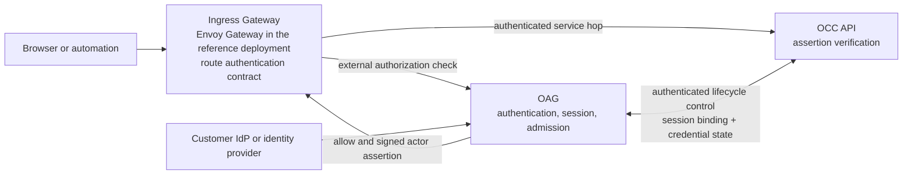

# OpenClaw access gateway

## Summary

The OpenClaw Access Gateway (OAG) is the authentication and Namespace admission
boundary for the OCC control plane. In v1, it accepts browser and automation
credentials, authenticates them through a typed flow, validates external tenant
admission for humans, and produces one short-lived signed actor assertion bound
to the existing OCC Namespace resolved by OCC.

OAG does not decide whether an actor may read or mutate a particular OpenClaw
resource. OCC verifies the assertion, resolves committed identity evidence and
the exact resource, enforces its permission ceiling from fixed Role and
AccessBinding evidence or an exact creator-read match, and asks the selected
IAMAdapter to evaluate one
`Principal + Action + Resource + Context` request. Kubernetes separately
authorizes platform and workload service identities, and provider services
separately authorize operations on provider-owned resources.

The v1 request path uses an Ingress Gateway external-authorization contract.
Envoy Gateway is the reference implementation. Every protected OCC request
requires a successful OAG check before the Gateway forwards it to OCC. Any
unauthenticated public endpoint must be explicitly configured. Missing policy,
missing protected-route metadata, authentication uncertainty, or an invalid
actor assertion denies the request. A conforming replacement must support
trusted route metadata, removal of client-supplied internal headers,
authenticated forwarding to OAG and OCC, and fail-closed external authorization.

This page specializes the ingress boundary of the authority split in
[design.md](../design.md#iam): **OAG authenticates and admits; OCC authorizes
OpenClaw resources; Kubernetes authorizes platform and workload service
identities.**

## Goals

- Provide one authentication boundary for browser and service-principal access
  to OCC.
- Support one customer OIDC provider and installation-issued automation
  credentials behind one normalized actor contract.
- Keep external access and refresh tokens out of OCC, Kubernetes resources,
  Cells, logs, and browser-readable storage.
- Require a successful OAG check for every protected OCC request and explicitly
  configure any unauthenticated public endpoint.
- Bind each actor assertion to its intended OCC recipient, Namespace, purpose,
  session or credential generation, and a short lifetime.
- Apply external tenant membership and entitlement changes no later than
  expiration or renewal of the current OAG session.
- Authorize the request as the initiating actor, verify the forwarding
  component as the trusted transport, and record both in audit evidence.
- Preserve the initiating actor across authorized integration dispatch and
  asynchronous work.
- Fail closed for new control-plane access during an OAG outage without
  revoking already-active runtime grants.

## Non-goals

- Supporting device authorization or device-flow endpoints in v1.
- Shipping an official CLI or SDK in v1.
- Storing OpenClaw roles, bindings, or exact resource permissions in OAG.
- Using customer IdP groups or external roles directly as OCC permissions.
- Mirroring human principals or external groups into Kubernetes RBAC.
- Forwarding a browser cookie, bearer token, API key, OAuth token, or refresh
  token to OCC as a fallback authentication mechanism.
- Letting clients select an identity provider, tenant, authorization engine,
  route policy, assertion audience, or downstream authority through request
  fields.
- Minting Kubernetes ServiceAccount tokens or workload credentials.
- Authorizing provider-owned runtime operations from cached OCC projections.
- Specifying actor-assertion signing-key generation, storage, rotation, or
  verifier trust distribution.

## Authority boundaries

Authentication, admission, OpenClaw authorization, infrastructure
authorization, and provider authorization are independent checks that compose
by the intersection defined in
[the IAM design](./iam.md#authority-boundaries).

| Component | Authoritative for | Not authoritative for |
| --- | --- | --- |
| Ingress Gateway (Envoy Gateway in the reference deployment) | Public ingress, route selection, trusted route metadata, header stripping, authenticated forwarding | Caller identity or OpenClaw permissions |
| OAG | Credential authentication, external session state, external tenant admission, assertion signing | OCC roles, bindings, resource containment, or exact permissions |
| OCC | Actor-assertion verification, stable Principal or ServicePrincipal resolution, and handoff to OCC IAM | External credential validation or OAG session state |

An allow at one layer is only an input to the next layer. No layer may infer an
allow because an earlier layer allowed the request.

## Architecture

OAG exposes an external-authorization service to the Ingress Gateway; it is not
the reverse proxy for OCC. The Envoy Gateway reference deployment uses Envoy's
external-authorization protocol. The per-request ingress chain contains two
authenticated service hops regardless of the selected Ingress Gateway:

1. Gateway to OAG for the authentication check.
2. Gateway to OCC for the admitted request.

A separate authenticated lifecycle-control channel connects the exact OAG and
OCC service identities. It carries only session binding and invalidation and
service-principal credential staging, promotion, and revocation. It cannot
invoke ordinary OCC handlers or substitute its service identity for an
initiating actor.

The actor assertion identifies the initiating human or service principal. The
Gateway transport identity proves which trusted component forwarded the
request. OCC authorizes the initiating actor, verifies the forwarding component
as transport, and records both; neither identity substitutes for the other.

### Deployment boundary

OAG has no directly Internet-reachable listener. The Gateway routes the
browser-facing login, callback, logout, and session-bound anti-CSRF bootstrap
endpoints to OAG and is the only workload identity allowed to call them or OAG's
external-authorization listener. Those OAG endpoints have their own explicit
route contract and cannot reach OCC handlers by path rewriting. OCC's public
API listener accepts traffic only from the installation Gateway identity.
OAG and OCC expose their lifecycle-control handlers only to the exact peer
service identity; those handlers are not routed from public listeners.

All service hops use installation-issued mTLS identities or an equivalent
workload-identity mechanism with exact service and deployment allowlists.
NetworkPolicy restricts OAG, OCC, and their backing stores to the required
callers. DNS names and network location are not identities.

OAG stores identity-provider login tokens, login state, and session state in
encrypted stores. OAG exclusively controls actor-assertion signing; the Gateway
and OCC receive no signing capability.

### Browser-facing OAG endpoints

Login start, OIDC callback, logout, and anti-CSRF bootstrap are a separate
Gateway-routed surface from OCC. They follow the owning
[browser-session contract](#browser-session), never inject an OCC actor
assertion, and cannot dispatch to an OCC handler.

## Route authentication contract

Every OCC HTTPRoute or GRPCRoute has exactly one explicit authentication
policy: browser-session authentication, service-principal authentication, or
`NoAuth`. Missing authentication policy never means public. Each protected
server-owned route supplies exactly one trusted `authFlow` value:
`browser_session` or `service_principal`.

Browser-session and service-principal access to the same OCC API handler use
distinct route objects with non-overlapping matches. Each route pins one flow
and may target the same handler only after OAG succeeds. The Gateway selects the
route through server-owned listener, host, and path configuration and derives
`authFlow` from that route. A client cannot supply or override `authFlow` with a
credential, header, query, or body field. Overlapping protected route matches
are invalid configuration and deny traffic.

The Gateway passes `authFlow` to OAG from the selected route object. OAG does
not accept a client header or request field as route metadata. For a protected
route, missing, unknown, or contradictory metadata denies the request.

`NoAuth` is a positive declaration. It is never inferred from absent
configuration. A `NoAuth` route may target only a dedicated public or health
backend that cannot dispatch to any authenticated OCC handler.

Every OCC Console route uses `browser_session`. Login start, OIDC callback,
logout, and anti-CSRF bootstrap remain OAG browser endpoints and cannot dispatch
to a Console handler. `NoAuth` cannot target the Console.

### Trusted header and credential handling

Before calling OAG, the Ingress Gateway removes every client-supplied header
reserved for internal trust, including actor assertions, route metadata,
component identity, and internal authorization artifacts. OAG receives route
metadata only from the selected server-owned route configuration.

After OAG allows the request, the Gateway forwards the signed actor assertion
and only explicitly allowlisted server-owned metadata. It removes all end-user
credentials, including browser cookies, bearer tokens, API keys, and OAuth
tokens, before forwarding to OCC. The OAG response cannot cause arbitrary
request-header injection.

OCC accepts the actor assertion only from the exact allowed Gateway identity
over the authenticated Gateway-to-OCC hop. It authenticates the request only
through that assertion and never falls back to any request credential.

## Authentication flows

All supported flows end in the same `OccRequestActorAssertion`. Flow-specific
credentials never become alternate OCC authentication mechanisms.

### Browser session

1. OAG starts Authorization Code with PKCE against the selected installation
   identity provider using signed state, a nonce, an exact redirect URI, and an
   allowlisted return URL.
2. OAG validates `state`, nonce, redirect URI, issuer, audience, signature, and
   authorization response timing.
3. OAG validates the immutable external tenant, membership in that tenant,
   application admission, and entitlement.
4. OAG stores provider tokens only in its encrypted credential store and gives
   the browser an opaque, rotating, `Secure`, `HttpOnly`, `SameSite=Lax`
   session cookie.
5. Each protected request validates the current OAG session before OAG signs an
   actor assertion.

Login state and authorization codes are purpose-bound, short-lived, and
consumed atomically. An exact callback retry may return its recorded non-secret
outcome; a mismatched replay denies. Authentication failures return a local
protocol error. OAG never redirects credentials, authorization codes,
assertions, or internal failure details to an unvalidated return URL.

Every unsafe browser method requires both an exact allowed `Origin` and a
high-entropy anti-CSRF token sent in a dedicated header. OAG binds the token to
the session and rotates it with the session; a cookie alone never authorizes an
unsafe request. Login and callback CSRF protection use the independently
signed, nonce-bound, single-use login state.

The anti-CSRF bootstrap route is available only on the Console's allowlisted
same origin. It validates the current session and returns its token in a
non-cacheable response with no assertion or OCC resource data. Product-owned
browser code sends the token in the dedicated header; OAG validates it and the
Gateway strips it before forwarding an allowed request to OCC. Logout likewise
requires the current session, an allowed Origin, and that token. The token grants
no authority without its bound session.

The browser cannot read provider tokens or choose an external tenant or OCC
Namespace through an application request field.

### Service principal

Automation uses the same Gateway and OAG boundary. OAG accepts an
installation-supported service principal credential, resolves its registered
`ServicePrincipal`, Namespace, credential ID, and generation, and emits a
service-principal actor assertion.

OCC owns the ServicePrincipal and credential lifecycle. At credential creation
or rotation, OCC persists a pending credential generation and sends OAG its
one-way verifier, credential ID, generation, and Namespace over the
lifecycle-control channel. OAG stores the verifier as inactive and acknowledges
only that it is prepared. This acknowledgement does not permit authentication,
and neither service can recover the presented secret from stored state.

OCC then atomically promotes the candidate generation as current. Only after
that commit does it reveal the secret once. OAG activates a verifier only after
observing the committed promotion. Failure before promotion leaves a new
credential unusable and a rotated credential's previous generation current.
After promotion, the new generation is authoritative and both services
reconcile forward; a propagation gap may deny authentication but cannot restore
the prior generation.

OCC has no second public listener that directly accepts service principal API
keys. Explicit revocation advances OCC's authoritative credential generation and
marks the credential inactive. OAG receives that state over the lifecycle-control
channel and removes or deactivates the verifier asynchronously, while OCC
immediately rejects an assertion whose generation no longer matches current
state. Bounded assertion expiry is an independent backstop.

Deletion first performs that same generation invalidation and marks the
ServicePrincipal inactive. OAG then deactivates the exact verifier and
acknowledges completion over the lifecycle-control channel before OCC tombstones
the resource. If OAG is unavailable, deletion remains pending from the inactive
state and retries forward; authentication stays denied.

## Session and admission model

Before human login to a Namespace is enabled, installation provisioning supplies
its immutable `ExternalTenantLink`. Initial installation also supplies one OCC
Namespace and the first Principal with an installation-scoped OrgAdmin binding.
These prerequisites define no tenant-bootstrap API. Creating another Namespace
does not create an `ExternalTenantLink` or grant external admission.

Within the one installation-selected `IdentityProviderConnection`, an immutable
provider tenant and an OCC Namespace may each appear in only one
`ExternalTenantLink`. Provisioning rejects a candidate link or configuration
that would make resolution ambiguous; OAG never chooses from competing
mappings.

Each OAG session and ServicePrincipal credential has exactly one monotonically
increasing generation. Session renewal or invalidation and credential rotation
or revocation advance it; ServicePrincipal deletion performs the same
invalidation before tombstoning. OCC rejects assertions from any generation that
is no longer current; bounded assertion expiry covers delayed
session-invalidation notification.

A human OAG session is pinned to exactly one external tenant and one OCC
Namespace as admission context. Switching external tenants creates or selects
another session, and an application request cannot change that context. The pin
grants no Permission and does not replace IAM containment: OCC still authorizes
the exact Installation or Namespace target under its committed AccessBindings.

For a human principal, OAG tracks:

- immutable provider issuer and subject;
- external tenant and provider revision;
- OCC Namespace UID and stable Principal UID;
- OAG session ID and generation;
- authentication time and method; and
- session expiration.

OAG carries external identity and admission facts, not OpenClaw group, role, or
permission claims. OCC uses `DirectoryAdapter` to materialize revisioned
`ExternalGroupSnapshot` provider-subject coordinates and verified identity-link
evidence. Before IAM evaluation, OCC matches the current committed
`ExternalIdentity` to those coordinates. The selected IAMAdapter consumes that
evidence; the evidence is not an authorization decision.

### Session binding in OCC

After external login, OAG presents verified external identity and admission
facts to OCC over the lifecycle-control channel. OCC resolves the existing
`ExternalTenantLink`, materializes the stable Principal and committed directory
evidence, and returns the exact Principal and Namespace UIDs. OAG pins those
identities and registers the current session ID, generation, expiration, and
active state before issuing ordinary request assertions. This path grants no
OCC permission, and OAG never calls a `DirectoryAdapter` directly.

Session renewal advances the generation and updates that registration,
including its expiration, over the same channel before OAG issues assertions
for the renewed session.

## Actor assertion contract

Every short-lived actor assertion binds `schemaVersion`, the exact OAG issuer,
OCC deployment audience, `occ-request` purpose, Namespace UID, actor kind and
UID, authentication method, assertion ID, and validity window. A human
assertion also binds the immutable provider issuer and provider subject,
external tenant ID, OAG session ID, and current session generation. A
service-principal assertion instead binds the credential ID and generation. An
assertion contains no OCC Role, AccessBinding, permission, target resource,
provider credential, or Kubernetes credential.

OAG sets a human assertion's `expiresAt` to the earlier of the configured
assertion lifetime and the registered session expiration.

OAG owns signing and OCC verifies the signature against installation trust.
The key-generation, storage, rotation, revocation-distribution, and verifier
refresh implementation is deferred. An assertion that OCC cannot verify under
its current configured trust denies.

### OCC verification

OCC constructs its request context only after it verifies:

1. The request arrived from the exact allowed Gateway workload identity.
2. The signature verifies under the current configured OAG trust.
3. The exact issuer, OCC deployment audience, `schemaVersion`, and
   `purpose = "occ-request"` are valid.
4. `notBefore`, `issuedAt`, and `expiresAt` are within the bounded time policy.
5. Actor kind, actor UID, and Namespace UID are internally consistent.
6. For a human, the provider issuer and provider subject, `ExternalIdentity`,
   `ExternalTenantLink`, Namespace, Principal, OAG session ID, and session
   generation match one current, active, unexpired registered session record,
   and the assertion `expiresAt` does not exceed that record's expiration. For
   a service principal, the registered Namespace, ServicePrincipal, credential
   ID, and generation match current OCC state.
7. The selected route and OCC handler accept the actor kind and authentication
   method represented by the assertion.

For an allowed mutation, OCC consumes the assertion ID in the same atomic
boundary as the AuthorizationDecision, mutation, and audit evidence. A failed
commit consumes nothing. Ordinary idempotent reads may accept the same assertion
more than once within its lifetime; every use remains independently authorized
against current OCC state.

## OCC authorization handoff

After verifying the assertion, OCC builds one exact
`Principal + Action + Resource + Context` request from server-owned routing,
resource state, and current committed identity evidence, and evaluates it under
the [IAM control-plane contract](./iam.md#authorization-flows). An allow
assertion from OAG never skips IAM evaluation: every protected OCC handler
obtains an explicit allow for its exact request before executing. OAG emits
authentication and admission evidence with the same correlation coordinates.

## Downstream authorization boundary

The OAG actor assertion authorizes no downstream operation. After OCC
authorizes the exact OpenClaw request, it dispatches each integration operation
through the canonical [operation-dispatch contract](./integrations.md#operation-dispatch).
Adapters and Drivers never treat an actor assertion as operation authority.

## Session expiration and revocation

OAG verifies current external tenant membership, application admission, and
entitlement at login and session renewal. External membership and entitlement
changes take effect no later than expiration or renewal of the current OAG
session. OAG does not mint assertions from an expired or invalid session.

OAG owns session invalidation. Explicit sign-out or revocation advances the
session generation, marks the session inactive, and stops new assertion
issuance. OAG notifies OCC over the lifecycle-control channel, and OCC
invalidates the corresponding registered session evidence and rejects assertions
tied to the prior generation. If that update cannot reach OCC, outstanding
assertions expire at the earlier of their bounded lifetime and the registered
session expiration.

An OAG outage blocks new control-plane access but does not revoke an
already-active RuntimeGrant. Runtime execution stops when that grant expires,
is revoked, or fails an independent provider check. The outage cannot create,
renew, or widen runtime authority.

## Failure behavior

| Failure | Required behavior |
| --- | --- |
| OAG timeout, unavailable service, or malformed response | Gateway denies the protected request. |
| Missing, unknown, or conflicting metadata on a protected route | OAG denies. |
| Browser and service-principal route matches overlap | Reject the route configuration and deny traffic. |
| `NoAuth` route targets an authenticated OCC backend | Reject the route configuration and deny traffic. |
| Missing or unsupported credential on a protected route | OAG denies; it does not return an authenticated anonymous context. |
| External provider timeout during login or session renewal | OAG denies the login or renewal. |
| OAG does not acknowledge a candidate service-principal verifier | The candidate remains pending and undisclosed; rotation leaves the previous generation current. |
| Credential promotion commits but OAG has not activated the generation | Authentication with the new generation fails closed; OCC rejects the prior generation and both services reconcile the committed promotion forward. |
| OAG does not acknowledge ServicePrincipal verifier deactivation during deletion | Keep the ServicePrincipal inactive and deletion pending; reject authentication and retry deactivation without restoring it. |
| Atomic OCC mutation commit fails | Return an infrastructure error; consume no assertion ID and commit no AuthorizationDecision, mutation, or audit evidence. |
| Client-supplied internal-trust header | Gateway strips it before OAG evaluation. |
| Missing actor assertion or unauthenticated Gateway hop | OCC denies before handler execution; request credentials cannot substitute. |
| Bad signature, issuer, audience, purpose, time, schema, trust, external tenant, Namespace, inactive or expired registered session, assertion expiry beyond session expiry, session generation, or credential generation | OCC denies before handler execution. |
| Selected IAMAdapter or policy evaluation unavailable, invalid, or unknown | OCC denies; it does not try another adapter or fall back to `OCCIAMAdapter`. |

## Audit boundary

OAG records authentication and admission evidence with the initiating actor,
forwarding platform component, and correlation coordinates. OCC commits
authorization evidence through the [IAM audit contract](./iam.md#audit-contract).
Raw credentials, cookies, tokens, and actor assertions are never recorded.

## Security invariants

1. Every protected OCC request requires a successful OAG check before the
   Gateway forwards it to OCC.
2. Only an explicitly configured `NoAuth` endpoint on a dedicated public or
   health backend bypasses OAG.
3. Before OAG evaluation, the Gateway strips every client-supplied header
   reserved for internal trust. Before OCC forwarding, it strips every end-user
   credential.
4. OAG authenticates and admits; it does not grant OpenClaw permissions.
5. OCC resolves current identity evidence, enforces its permission ceiling from
   fixed Role and AccessBinding evidence or an exact creator-read match, and
   requires the selected IAMAdapter to allow one exact request containing
   `Principal`, `Action`, `Resource`, and `Context`.
6. Human principals and external groups do not receive Kubernetes authority
   through the product path.
7. Identity-provider login tokens remain inside OAG's credential boundary.
8. Actor assertions contain identity and admission facts, not OCC Roles,
   AccessBindings, capabilities, or policy decisions.
9. Transport identity and initiating actor are verified and audited separately.
10. OAG owns actor assertions; OCC owns downstream integration authorization
    and dispatch.
11. Service principals use distinct server-owned routes at the same OAG
    boundary and normalized actor seam as human callers.
12. Assertion expiry, registered session expiry, session generation, credential
    generation, authorization decision, and policy revisions are distinct
    revocation controls.
13. Unknown, unavailable, stale, or indeterminate security state never broadens
    access.
14. Existing Cells run only under current bounded RuntimeGrants and provider
    authority; control-plane outages do not mint new runtime authority.
