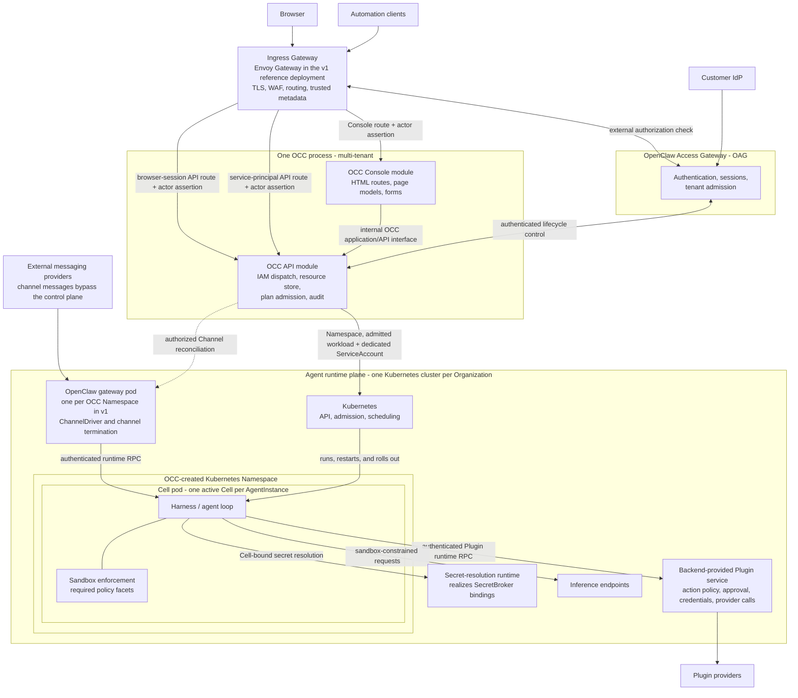

# Proposal: OpenClaw as the Open Enterprise Agent Platform

## Summary

OpenClaw is evolving from a single-player proactive agent into a platform on
which companies build business-critical infrastructure. This RFC lays the
groundwork for a Kubernetes-like, provider-neutral platform for managing agents
in the enterprise.

## Motivation

OpenClaw today is a single-tenant gateway: one deployment serves one
administrator, with locally authored config, no tenant isolation, and no
enterprise governance surface. Adopting it beyond a single user currently means
one hand-managed gateway per tenant—no shared policy, admission control, audit
trail, or standard way to swap the sandbox, harness, and network proxy pieces
that enterprises need to control.

At the same time, the ecosystem is fragmenting: harnesses ship their own
sandboxes, sandbox providers ship their own compute, and every combination is
bespoke glue. There is no standard resource model for "an agent, its policy, and
where it runs."

## Goals

- A multi-tenant, enterprise-ready OpenClaw control plane.
- Standard, provider-neutral primitives for defining, deploying, constraining,
  and observing agents, with precise lifecycle and authority boundaries.
- Every OCC-dispatched third-party integration point uses either a Driver or
  Adapter contract, and compatible integrations can be packaged as a versioned
  Backend without transferring operation authority to that Backend.
- A Console that presents OpenClaw resources and submits mutations through the
  same authorized OCC API used by browser and automation clients.

## Non-Goals

- Making the existing OpenClaw gateway multi-tenant.
- Fully specifying every primitive in this overview. `Automation`, `Budget`,
  `Context`, `InferenceProvider`, and `Router` are deferred in this round.
- Making an enterprise OCC deployment that runs outside Kubernetes. A
  single-player Docker build may exist for prototyping, without multi-tenancy
  guarantees.

The following decisions are deferred or out of scope globally. Component
designs must not resolve them until this document is updated:

- The exact audit mechanism. The platform requires audit evidence, but its
  storage, export, and query mechanisms are not specified.
- Cross-Namespace references and `ReferenceGrant`. Every Namespace-scoped
  reference remains within its source Namespace in v1.
- Multiple layers of tenancy. One OpenClaw platform deployment runs in one
  Kubernetes cluster and represents one Organization. Each OCC Namespace is
  the v1 Tenant boundary and maps one-to-one to one Tenant and one Kubernetes
  Namespace. Tenant is not a separately nestable resource.
- Updating, deleting, or retiring a Namespace. V1 permits creation only; each
  accepted OCC Namespace and backing Kubernetes Namespace mapping is immutable.
- Optimistic concurrency control.
- Delegated administration and `DelegationGrant`. `OrgAdmin` may grant any
  fixed v1 role at any supported scope.
- Multiple Plugin feeds and `PluginCatalogRef`. V1 uses one
  installation-configured Plugin feed.
- Provider-side `PluginConnection` lifecycle. Provider installation, consent,
  credential provisioning, rotation, and removal occur outside this design. V1
  owns only the OCC binding record and runtime use of an already-provisioned
  connection.
- Exact Plugin invocation idempotency, replay, and recovery after an
  indeterminate provider effect. V1 defines only the authenticated
  Harness-to-service boundary, local policy enforcement before provider
  invocation, and no-fallback behavior.
- Dynamic or nested Group membership. V1 supports local and synchronized Groups
  with direct members only.
- Migrating an existing resource kind or active RuntimeGrant between
  IAMAdapters.
- Channel approval policy and evidence. The OpenClaw gateway handles channel
  approvals in v1 outside OCC IAM; OCC defines no channel approval Permission
  or decision contract.
- Actor-assertion signing keys and trust-distribution implementation. V1
  requires signed assertions and fail-closed verification but does not specify
  key generation, storage, rotation, or verifier distribution.
- Preventing or recovering from administrative lockout.

## Proposal

1. Introduce two new components to OpenClaw:
   - OpenClaw Controller (OCC): one process containing a declarative,
     multi-tenant API module and an OCC Console module. The API owns resources,
     authorization, mutations, and integration dispatch. The Console owns HTML
     routes and calls only the OCC application/API interface; it cannot call
     adapters or drivers directly.
   - OpenClaw Access Gateway (OAG): authenticates humans against the one
     installation-configured customer OIDC identity provider and automation
     through installation-issued `ServicePrincipal` credentials. It validates
     external tenant admission for humans. OCC resolves the existing Namespace
     mapping and remains responsible for OpenClaw authorization.
1. Introduce the composable primitives necessary for enterprise agent management:
   `Agent`, `AgentRevision`, `AgentInstance`, `Cell`, `Configuration`, `Harness`,
   `Plugin`, `PluginConnection`, `Channel`, `Secret`, `SecretBroker`,
   `SandboxPolicy`, `Restriction`, and `Namespace`.
1. Introduce integration contracts:
   - A **Driver** realizes or enforces primitive intent in a runtime or
     infrastructure system.
   - An **Adapter** translates an external system's protocol and authority
     evidence into a normalized OCC contract; it does not realize runtime state.
   - A **Backend** is a globally installed, versioned distribution of compatible
     Drivers, Adapters, and a capability manifest. Installation makes
     integrations eligible but grants no resource, policy, runtime, route, or UI
     authority.
1. Introduce durable storage contracts for OCC resources,
   `AuthorizationDecision` records, operation state, and append-only audit
   evidence. The physical database schema remains an implementation decision.
1. Introduce an IAM system and its integration with the primitive model.

## Design Principles

- Declarative, versioned APIs.
- Composable primitives with one authoritative writer per resource or action.
- Centralized desired state and authorization without centralizing runtime data
  paths.
- A small core extended through explicit Driver and Adapter contracts.

## Architecture

The OpenClaw gateway serves exactly one OCC Namespace in v1. It terminates
channels and communicates with Cells over an authenticated runtime protocol; it
does not run inside a Cell or expose Namespace-wide channel credentials to one.

A selected HarnessDriver registration may include a Backend-provided Plugin
service outside the Cell. OCC supplies its capability-specific RuntimeGrant
materialization during deployment, renewal, and revocation; those control-plane
operations never carry a Plugin invocation. At runtime, the Harness invokes only
the companion service pinned by its RuntimeGrant over an authenticated runtime
channel. Neither the Harness nor the Plugin service calls OCC on the invocation
path. The service owns Plugin action-policy enforcement, approval, provider
credentials, and provider egress; the Cell Sandbox boundary does not govern it.

Each OCC Namespace maps immutably to one OCC-created Kubernetes Namespace. OCC
persists the accepted server-generated mapping and reconciles only that exact
identity. The mapping remains unavailable until OCC records the backing UID, and
OCC never adopts an unrelated Namespace. Creating a Namespace does not create
external tenant admission or an administrator identity.

Before human access to a Namespace is enabled, installation provisioning
supplies its immutable `ExternalTenantLink`. One external tenant may link to at
most one OCC Namespace, and one Namespace may have at most one such link in the
configured identity provider. Initial installation also supplies one Namespace
and the first Principal with an installation-scoped OrgAdmin binding. The
bootstrap mechanism is outside this design.

Each AgentInstance permanently owns one OCC-created WorkloadIdentity and one
dedicated ServiceAccount. OCC creates the server-owned WorkloadIdentity with
AgentInstance acceptance; clients and Drivers cannot select it. The identity
survives stop and Cell replacement and is tombstoned with the AgentInstance. OCC
records the backing ServiceAccount UID before finalizing a Cell plan, and every
replacement Cell uses the same WorkloadIdentity and ServiceAccount. OCC derives
publication-frozen primitive inputs from the selected AgentRevision; current
Restrictions and live provider authorization may only narrow them.

OCC materializes admitted Cells with native Kubernetes resources. The canonical
[primitive lifecycle](./components/primitives.md#agentinstance-and-cell) keeps a
non-tightening deployment effective during preparation, invokes the stopped
baseline for a committed tightening, and activates only after required
attestation. Sandbox Drivers cannot change the admitted workload or
ServiceAccount.

### OpenClaw Access Gateway (OAG)

The Ingress Gateway owns public control-plane ingress and asks OAG to
authenticate callers. OAG validates external tenant admission for humans;
automation uses installation-issued `ServicePrincipal` credentials. OAG returns
a short-lived actor assertion with stable identity, Namespace admission, and
freshness evidence; OCC independently authorizes the exact OpenClaw operation.

Browser-session and service-principal access to the same OCC API handler use
distinct, non-overlapping server-owned routes. Each route is pinned to exactly
one authentication flow; after OAG authenticates the caller, both may dispatch
to the same handler and normalized actor seam.

The Ingress Gateway removes client-supplied internal-trust metadata and forwards
only the signed assertion and allowlisted server-owned metadata over the
authenticated OCC hop. It never forwards end-user credentials. OAG and OCC use
a separate authenticated edge for session and ServicePrincipal lifecycle state;
that edge cannot invoke ordinary OCC handlers. Envoy Gateway is the v1 reference
implementation, and `NoAuth` may target only an isolated public or health
backend.

The complete contract is defined in the canonical
[OpenClaw access gateway](./components/access-gateway.md).

### OpenClaw Controller (OCC)

OCC serves as the central control plane for agents. In v1, OCC is one process
with two strict modules:

- **OCC API:** Owns resources, mutations, exact-request resolution and dispatch
  to each resource's selected IAMAdapter, adapter dispatch, driver
  reconciliation, operation-scoped integration dispatch, RuntimeGrants, and
  audit.
- **OCC Console:** Owns the user and administrator HTML routes, page models,
  navigation, and forms. It calls only the OCC application/API interface under
  the authenticated actor and cannot import or call adapter or driver
  implementations.

Both modules share one deployment and origin in v1. The module boundary keeps
the OCC API usable without the Console and allows a later deployment split
without changing authorization or integration contracts. Backends cannot
register Console routes or executable UI.

The complete browser route, page-model, rendering, mutation, and failure
contract is defined in the canonical [OCC Console](./components/occ-console.md).

### Invariants

The core invariants OCC enforces are:

- **Explicit scope:** every resource is installation-scoped or Namespace-scoped.
  Every deployable primitive belongs to exactly one Namespace, which is the v1
  Tenant boundary. Tenant is not an additional resource or binding scope. Every
  Namespace-scoped reference remains within that Namespace in v1.
- **Exact-resource authorization:** OCC resolves the immutable principal, action,
  resource, and request context. OCC first enforces its permission ceiling from
  the applicable fixed Role and AccessBinding or, only for exact `read`, an
  immutable match to the actor-created resource's creator. It then sends the
  exact request and determining ceiling evidence to the IAMAdapter selected for
  its evaluator resource kind. `list` and `create` retain the containing
  Installation or Namespace as the exact target while selection uses the listed
  or candidate resource kind. `OCCIAMAdapter` permits a request that passed the
  OCC ceiling unless an applicable committed Restriction denies it or returns an
  unmet obligation. A custom IAMAdapter evaluates its own policy plus committed
  Restrictions and may only tighten that result. OCC configuration may select
  one custom IAMAdapter per resource kind. An allowed mutation that creates a
  readable entity records the initiating actor as immutable creator and may
  return that exact entity without a second `read` decision; later reads follow
  the ordinary exact-resource path.
  OAG admission, OCC structural invariants,
  Kubernetes admission and authorization, provider authorization, RuntimeGrant,
  and runtime enforcement remain independent checks: every required check must
  allow.
- **Single-writer ownership:** OCC owns every primitive's resource record and
  lifecycle. It owns desired intent for authorable primitives and server-owned
  state for immutable or observed primitives. Runtime-backed primitives use a
  server-selected Driver to realize or enforce admitted intent; OCC-native
  primitives require no Driver. A Driver may report readiness and observations
  through OCC but cannot rewrite primitive intent. OCC is the canonical writer
  for Restrictions; the PolicyAdministrationAdapter paired with a selected
  IAMAdapter may only project an exact committed OCC policy revision to that
  same external policy authority. A projection becomes ready only when its
  readback matches that OCC revision; the external copy never becomes
  canonical. Each policy projection and runtime action likewise has one
  authoritative writer. An applicable Restriction
  tightening intersects each affected active or pending RuntimeGrant with
  current Restrictions. Removing or loosening a Restriction never widens an
  active grant without an authorized AgentInstance rollout.
- **Local runtime authorization:** OCC materializes only capability-specific
  RuntimeGrant slices to the selected Plugin service, Channel gateway, and
  SecretBroker runtime, plus a coordinate-only runtime-grant binding in the
  current Cell. These copies are derived, not independently authorable. Ordinary
  runtime calls authorize from the active local materialization and exact
  current-Cell association, fail closed on mismatch or expiry, and do not call
  OCC on the request path.
- **Server-owned selection:** OCC core owns the provider-neutral capability
  catalog, including required capabilities and facets and their built-in
  implementations. OCC configuration resolves one eligible implementation for
  each required capability; Sandbox resolves one Driver for each disjoint
  required facet. Every operation carries one exact `IntegrationSelectionRef`.
  Clients, resources, Backends, and integration payloads cannot select
  themselves.
- **Fail closed without fallback:** missing, stale, incompatible, timed-out, or
  unknown authorization results and failed or indeterminate durable integration
  results deny or block the exact operation. OCC never silently retries through
  another Driver or unions grants across authority domains.
- **Auditable transitions:** every control-plane mutation and its audit evidence
  commit in one atomic boundary. For an allowed actor-initiated mutation
  admitted through OAG,
  that boundary also includes assertion-ID consumption and the completed
  AuthorizationDecision. A failed commit writes none of them. Runtime
  enforcement emits separately correlated evidence; loss of optional telemetry
  must not widen authority.

## Agent Primitives

The complete supported-v1 primitive model, ownership boundaries, and lifecycle
relationships are defined in
[OpenClaw platform primitives](./components/primitives.md).

## IAM

OAG authenticates humans through OIDC and validates their external tenant
admission. It authenticates automation through installation-issued
`ServicePrincipal` credentials. OCC resolves the existing Namespace mapping for
human sessions.
OCC authorizes operations on exact OpenClaw resources.
Kubernetes authorizes platform and workload service identities.
External providers independently authorize operations on provider-owned resources.

The complete entity model, authorization logic, and the composition of these
domains are defined in [OpenClaw Enterprise IAM](./components/iam.md).

## Integrations

The parent-level Driver, Adapter, Backend, configuration, and selection
contracts in this document are canonical. The complete registry, selection,
dispatch, runtime realization, external translation, Backend lifecycle,
failure, and audit-boundary contracts are defined in
[OpenClaw integration contracts](./components/integrations.md).

## Packaging

The enterprise distribution packages OCC, OAG, and their versioned APIs as the
platform core. The OCC API and OCC Console are strict modules in one process and
deployment in v1. Kubernetes is the supported multi-tenant runtime substrate; a
local Docker package is a non-multi-tenant development convenience.

Backends are installed independently as versioned, installation-wide
distributions. Their manifests declare compatible platform versions and opaque,
versioned capabilities for their Drivers and Adapters. Registration makes an
integration eligible without granting resource, policy, runtime, route, or UI
authority. Installation, upgrade, selection, pinning, and removal follow the
canonical [integration lifecycle](./components/integrations.md#backend-installation-and-versioning).

## End-to-End Scenario

The canonical [v1 use-case implementation](./components/usecase-impl.md) applies
the platform contracts to the ChatGPT, Gmail, OpenShell, Codex, and Slack golden
application. It is authoritative for that composition and its proof criteria,
not for reusable platform contracts. The protected
[customer use case](./usecase.md) remains its input.

## Rationale

- **Use Kubernetes as the v1 enterprise substrate.** Kubernetes already provides
  the scheduling, workload identity, Namespace isolation, admission, and
  reconciliation foundations OCC needs. Building a parallel scheduler or a
  generic non-Kubernetes runtime abstraction would widen v1 without proving the
  golden use case.
- **Separate definition, deployment, and execution.** The `Agent` -> immutable
  `AgentRevision` -> stable `AgentInstance` -> replaceable `Cell` chain makes
  rollout, replacement, audit, and failure recovery explicit. It also prevents
  a draft edit or mutable dependency from silently changing a running agent.
- **Separate Drivers from Adapters.** Runtime realization has different
  lifecycle, idempotency, observation, and failure semantics from translation of
  external identity, policy, catalog, or provider operations. One generic
  integration interface would obscure both authority and ownership.
- **Package compatibility without packaging authority.** Backends make a tested
  set of integrations installable and versionable as one distribution, while
  server-owned OCC configuration, exact-resource IAMAdapter selection, and
  operation-scoped dispatch keep authority explicit. This avoids treating a
  provider bundle as the owner of every supported primitive or Console route.
- **Keep authentication and authorization separate.** Splitting OAG
  authentication from OCC authorization keeps every authority domain
  independent, so each required layer can tighten but none can widen another.
- **Keep v1 contracts deliberately minimal and churn-tolerant.** Stable
  envelopes carry exact resource identity, operation identity, content digests,
  and audit correlation; capability-specific data remains opaque and
  versioned. This preserves fail-closed authority boundaries while allowing
  expected backwards-incompatible iteration before the extension surface
  stabilizes.

## Risks

- **Authority drift:** resource, policy, integration, and runtime ownership can
  diverge across systems. Exact-resource decisions, pinned selections, and
  fail-closed reconciliation limit that risk.
- **Partial revocation:** a control-plane decision can change before every
  runtime enforcement point has fenced the old grant. The canonical primitive
  lifecycle preserves non-tightening deployments and fails closed from a
  committed tightening through cutover.
- **Kubernetes privilege:** OCC's Kubernetes identity may create and observe
  backing Namespaces and create, update, or delete AgentInstance workloads and
  dedicated ServiceAccounts inside them. It cannot update or delete Namespaces
  or mutate Kubernetes RBAC. Fixed RBAC and admission restrict writes to the
  immutable OCC mapping and admitted resource kinds and plans; exact UID
  validation and non-shared workload identities further limit the write surface.
- **Extension instability:** freezing provider-specific payloads too early would
  make expected v1 churn expensive. The architecture standardizes ownership,
  lifecycle, and failure semantics before standardizing capability payloads.

## Future work

- Multi-tenant OpenClaw gateways and agent-to-agent delegation.
- Stable OCC, gateway, and integration wire contracts and capability payloads
  proven reusable across implementations.
- Physical database technology and layouts for durable resource,
  authorization, operation, and audit state.
- Sandboxed third-party Console extensions and non-Kubernetes enterprise
  substrates.
